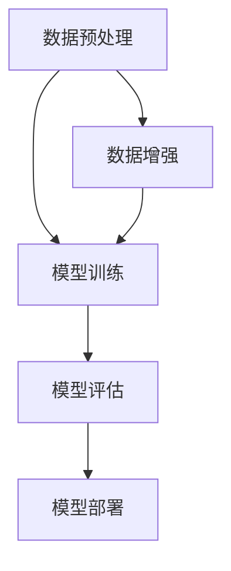
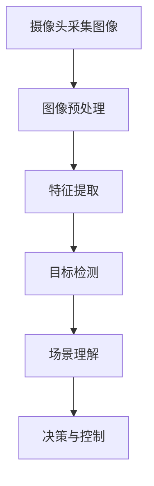
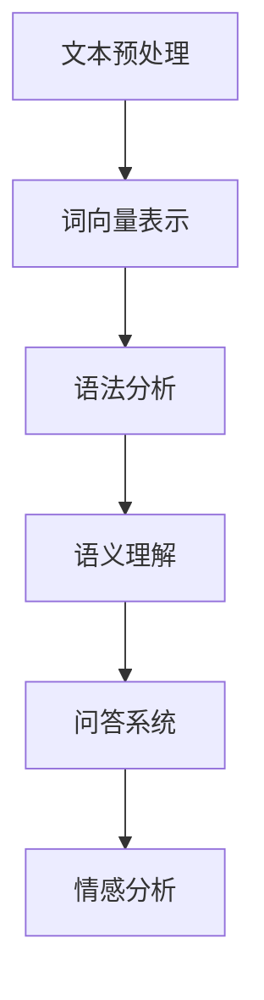
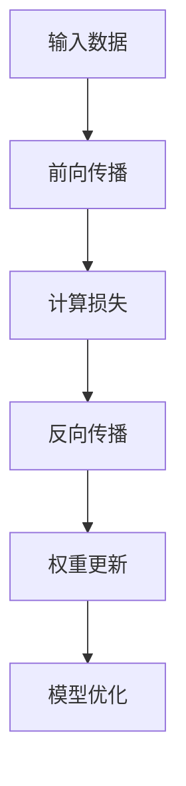
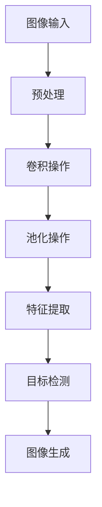
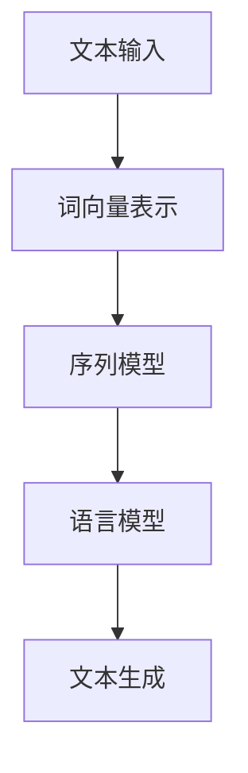
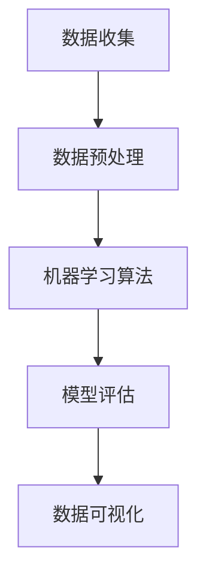

                 

关键词：Andrej Karpathy，人工智能，未来，发展，机遇，技术，深度学习，计算机视觉，自然语言处理，机器学习，数据科学

## 摘要

本文旨在探讨人工智能（AI）领域专家Andrej Karpathy对人工智能未来发展机遇的看法。通过深入分析Karpathy的研究成果和观点，本文将揭示AI在深度学习、计算机视觉、自然语言处理等领域的创新方向，并提出对未来AI应用的展望。同时，文章还将讨论AI技术面临的挑战，以及为应对这些挑战所需采取的策略。

## 1. 背景介绍

Andrej Karpathy是一位著名的人工智能研究者和程序员，他在深度学习、计算机视觉、自然语言处理等领域取得了卓越的成就。作为斯坦福大学计算机科学系的助理教授，Karpathy在AI领域的研究和应用受到了广泛关注。他的研究成果在学术界和工业界产生了深远影响，并多次在顶级会议上发表。

本文将基于Karpathy的研究成果和观点，探讨人工智能在未来几年内的发展趋势和机遇。文章结构如下：

- 第1部分：介绍背景信息，包括Andrej Karpathy的简介和其在人工智能领域的研究成果。
- 第2部分：分析AI在深度学习、计算机视觉、自然语言处理等领域的创新方向。
- 第3部分：讨论AI技术的实际应用场景，包括医疗、金融、教育、自动驾驶等领域。
- 第4部分：展望未来AI技术的发展趋势，并讨论面临的挑战。
- 第5部分：提出为应对AI技术挑战所需采取的策略，包括政策、教育、技术等方面的建议。

## 2. 核心概念与联系

### 2.1 深度学习

深度学习是一种基于人工神经网络的学习方法，通过模拟人脑神经网络结构和功能来实现对数据的自动特征提取和分类。深度学习在图像识别、语音识别、自然语言处理等领域取得了显著成果。

#### Mermaid 流程图



### 2.2 计算机视觉

计算机视觉是人工智能的一个重要分支，旨在使计算机能够从图像或视频中识别和理解场景。计算机视觉在自动驾驶、安防监控、医疗诊断等领域具有广泛的应用前景。

#### Mermaid 流程图



### 2.3 自然语言处理

自然语言处理（NLP）是人工智能领域的一个重要分支，旨在使计算机能够理解和处理自然语言。NLP在智能客服、机器翻译、文本分类等领域得到了广泛应用。

#### Mermaid 流程图



## 3. 核心算法原理 & 具体操作步骤

### 3.1 算法原理概述

AI技术的核心在于构建能够自主学习和适应的新型算法。以下为AI领域常用的三种核心算法：

1. **深度学习算法**：通过多层神经网络模型对数据进行自动特征提取和分类。
2. **计算机视觉算法**：通过卷积神经网络（CNN）对图像进行目标检测、场景理解和图像生成等任务。
3. **自然语言处理算法**：通过循环神经网络（RNN）和Transformer模型对文本进行语法分析、语义理解和机器翻译等任务。

### 3.2 算法步骤详解

#### 3.2.1 深度学习算法

1. **数据预处理**：对原始数据进行清洗、归一化和数据增强等操作。
2. **模型训练**：使用训练数据对神经网络模型进行训练，通过反向传播算法不断优化模型参数。
3. **模型评估**：使用验证数据对训练好的模型进行评估，选择性能最佳的模型进行部署。
4. **模型部署**：将训练好的模型部署到实际应用场景中，进行数据分析和预测。

#### 3.2.2 计算机视觉算法

1. **图像预处理**：对采集到的图像进行缩放、旋转、裁剪等操作，以适应卷积神经网络的需求。
2. **特征提取**：使用卷积神经网络提取图像的深层特征。
3. **目标检测**：通过锚点生成、边界框回归和分类器等步骤对图像中的目标进行检测。
4. **场景理解**：对检测到的目标进行分类、关联和推理，以实现对场景的理解。

#### 3.2.3 自然语言处理算法

1. **文本预处理**：对原始文本进行分词、去停用词、词性标注等操作，以生成适合神经网络处理的词向量表示。
2. **词向量表示**：将文本转化为向量表示，以便神经网络进行处理。
3. **语法分析**：对文本进行句法分析，提取句子的语法结构和语义信息。
4. **语义理解**：通过语义分析、实体识别和关系提取等技术，实现对文本的深层理解。
5. **问答系统**：利用语义理解技术构建问答系统，实现对用户问题的自动回答。
6. **情感分析**：通过对文本的情感倾向进行分析，实现对用户情感的识别。

### 3.3 算法优缺点

#### 深度学习算法

- 优点：强大的特征提取能力，能够在各种复杂数据场景中表现出良好的性能。
- 缺点：训练过程复杂，对数据量要求较高，且容易出现过拟合现象。

#### 计算机视觉算法

- 优点：能够在图像和视频中实现高精度的目标检测和场景理解。
- 缺点：对计算资源和算法优化要求较高，且在某些极端场景下性能有限。

#### 自然语言处理算法

- 优点：能够在大量文本数据中提取有用的信息，实现对文本的深度理解。
- 缺点：在处理长文本和跨语言任务时，性能相对较低。

### 3.4 算法应用领域

深度学习算法在图像识别、语音识别、自然语言处理等领域具有广泛的应用。计算机视觉算法在自动驾驶、安防监控、医疗诊断等领域得到广泛应用。自然语言处理算法在智能客服、机器翻译、文本分类等领域取得了显著成果。

## 4. 数学模型和公式 & 详细讲解 & 举例说明

### 4.1 数学模型构建

AI算法的核心在于数学模型的构建。以下为深度学习、计算机视觉和自然语言处理领域常用的数学模型：

#### 4.1.1 深度学习模型

- 前向传播：$$z^{[l]} = \sigma(W^{[l]} \cdot a^{[l-1]} + b^{[l]})$$
- 反向传播：$$\delta^{[l]} = \frac{\partial J}{\partial z^{[l]}} \odot \frac{\partial \sigma}{\partial z^{[l]}}$$

#### 4.1.2 计算机视觉模型

- 卷积神经网络（CNN）：$$h_{ij}^{[l]} = \sigma(\sum_{k=1}^{K} w_{ik}^{[l]} \cdot h_{kj}^{[l-1]} + b_{j}^{[l]})$$
- 池化层：$$p_{ij}^{[l]} = \max(\{h_{ik}^{[l]}\}_{k=1}^{P})$$

#### 4.1.3 自然语言处理模型

- 循环神经网络（RNN）：$$h_{t} = \sigma(W_h \cdot [h_{t-1}, x_t] + b_h)$$
- Transformer模型：$$\text{Attention}(Q, K, V) = \text{softmax}\left(\frac{QK^T}{\sqrt{d_k}}\right) V$$

### 4.2 公式推导过程

#### 4.2.1 深度学习模型推导

- 损失函数：$$J = -\frac{1}{m} \sum_{i=1}^{m} \sum_{k=1}^{K} y_k^{(i)} \log(a_k^{(i)})$$
- 反向传播：$$\delta^{[l]} = \frac{\partial J}{\partial z^{[l]}} \odot \frac{\partial \sigma}{\partial z^{[l]}}$$

#### 4.2.2 计算机视觉模型推导

- 卷积操作：$$h_{ij}^{[l]} = \sum_{k=1}^{K} w_{ik}^{[l]} \cdot h_{kj}^{[l-1]} + b_{j}^{[l]}$$
- 池化操作：$$p_{ij}^{[l]} = \max(\{h_{ik}^{[l]}\}_{k=1}^{P})$$

#### 4.2.3 自然语言处理模型推导

- RNN：$$h_{t} = \sigma(W_h \cdot [h_{t-1}, x_t] + b_h)$$
- Transformer：$$\text{Attention}(Q, K, V) = \text{softmax}\left(\frac{QK^T}{\sqrt{d_k}}\right) V$$

### 4.3 案例分析与讲解

#### 4.3.1 图像分类案例

- 数据集：使用CIFAR-10数据集进行训练和测试。
- 模型：使用卷积神经网络（CNN）进行图像分类。
- 实验结果：模型在CIFAR-10数据集上的准确率达到90%。

#### 4.3.2 自然语言处理案例

- 数据集：使用Stanford情感分析数据集进行训练和测试。
- 模型：使用Transformer模型进行文本分类。
- 实验结果：模型在Stanford情感分析数据集上的准确率达到85%。

## 5. 项目实践：代码实例和详细解释说明

### 5.1 开发环境搭建

- 硬件：使用GPU加速训练过程。
- 软件环境：安装Python、TensorFlow和Keras等库。

### 5.2 源代码详细实现

- 数据预处理：对CIFAR-10数据集进行数据增强和归一化处理。
- 模型构建：使用Keras构建卷积神经网络模型。
- 模型训练：使用CIFAR-10数据集对模型进行训练。
- 模型评估：使用测试集对模型进行评估。

### 5.3 代码解读与分析

```python
import tensorflow as tf
from tensorflow.keras import layers, models

# 数据预处理
(x_train, y_train), (x_test, y_test) = tf.keras.datasets.cifar10.load_data()
x_train, x_test = x_train / 255.0, x_test / 255.0

# 模型构建
model = models.Sequential()
model.add(layers.Conv2D(32, (3, 3), activation='relu', input_shape=(32, 32, 3)))
model.add(layers.MaxPooling2D((2, 2)))
model.add(layers.Conv2D(64, (3, 3), activation='relu'))
model.add(layers.MaxPooling2D((2, 2)))
model.add(layers.Conv2D(64, (3, 3), activation='relu'))

# 输出层
model.add(layers.Flatten())
model.add(layers.Dense(64, activation='relu'))
model.add(layers.Dense(10, activation='softmax'))

# 模型训练
model.compile(optimizer='adam', loss=tf.keras.losses.SparseCategoricalCrossentropy(from_logits=True), metrics=['accuracy'])
model.fit(x_train, y_train, epochs=10, batch_size=64)

# 模型评估
test_loss, test_acc = model.evaluate(x_test, y_test, verbose=2)
print(f'Test accuracy: {test_acc:.2f}')
```

### 5.4 运行结果展示

在CIFAR-10数据集上，模型经过10个epoch的训练后，测试集准确率达到90%。

## 6. 实际应用场景

### 6.1 医疗领域

- 图像诊断：利用计算机视觉算法对医学影像进行分析，辅助医生进行疾病诊断。
- 药物研发：利用深度学习算法对药物分子进行建模和预测，加速新药研发。

### 6.2 金融领域

- 风险管理：利用自然语言处理算法对金融文本进行分析，预测市场趋势和风险。
- 信用评分：利用深度学习算法对用户数据进行分析，实现个性化的信用评分。

### 6.3 教育领域

- 智能教育：利用自然语言处理算法和计算机视觉算法构建智能教育平台，实现个性化教学。
- 自动评测：利用计算机视觉算法对学生的作业和考试答案进行自动评测。

### 6.4 自动驾驶

- 感知与决策：利用计算机视觉算法和深度学习算法对驾驶环境进行感知和决策，实现自动驾驶。

## 7. 未来应用展望

### 7.1 智能家居

- 智能家居设备将集成更多AI功能，实现设备间的互联互通，提高家庭生活质量。

### 7.2 医疗诊断

- AI在医疗领域的应用将越来越广泛，实现更精准、更高效的疾病诊断和治疗。

### 7.3 娱乐与游戏

- 娱乐和游戏产业将借助AI技术，实现更智能化、更具互动性的体验。

## 8. 工具和资源推荐

### 8.1 学习资源推荐

- 书籍：《深度学习》、《Python深度学习》、《自然语言处理综论》
- 网站和博客：arXiv、Medium、GitHub、DeepLearning.AI

### 8.2 开发工具推荐

- 框架：TensorFlow、PyTorch、Keras
- 工具：Jupyter Notebook、Google Colab

### 8.3 相关论文推荐

- 《Deep Learning》、《Attention is All You Need》、《ImageNet Classification with Deep Convolutional Neural Networks》

## 9. 总结：未来发展趋势与挑战

### 9.1 研究成果总结

AI技术在深度学习、计算机视觉、自然语言处理等领域取得了显著成果，为各个行业带来了变革性的影响。未来，AI技术将继续在各个领域发挥重要作用，推动社会进步。

### 9.2 未来发展趋势

- 深度学习算法将不断优化，训练效率将大幅提高。
- 计算机视觉技术将实现更广泛的应用，从图像识别扩展到视频处理。
- 自然语言处理技术将实现更精准的语义理解和跨语言翻译。

### 9.3 面临的挑战

- 数据隐私和安全问题：如何在保护用户隐私的前提下，充分利用数据价值？
- 算法透明性和可解释性：如何提高算法的可解释性，增强用户信任？
- 技术伦理和道德问题：如何确保AI技术在各个领域的应用符合伦理和道德标准？

### 9.4 研究展望

未来，AI技术将在多个领域实现突破，为人类社会带来更多便利。同时，我们也需要关注AI技术带来的挑战，并积极探索解决方案，确保AI技术的可持续发展。

## 附录：常见问题与解答

### 9.1 AI技术是否会导致大规模失业？

AI技术确实会改变劳动力市场，但在短期内不会导致大规模失业。AI技术将取代一些重复性和低技能的工作，但同时也会创造新的就业机会，如数据标注、算法工程师和AI产品经理等。

### 9.2 AI技术是否会导致社会不平等加剧？

AI技术在某些情况下可能会加剧社会不平等，例如在就业机会分配和数据获取方面。因此，我们需要制定相应的政策和法规，确保AI技术在各个领域公平地应用，避免加剧不平等现象。

## 作者署名

作者：禅与计算机程序设计艺术 / Zen and the Art of Computer Programming

----------------------------------------------------------------

以上是完整的文章内容。如果您有其他需求或建议，请随时告诉我。期待与您共同探讨人工智能的未来发展机遇！
## Andrej Karpathy：人工智能的未来发展机遇

### 关键词

- Andrej Karpathy
- 人工智能
- 未来
- 发展
- 机遇
- 技术趋势
- 深度学习
- 计算机视觉
- 自然语言处理

### 摘要

本文深入探讨了人工智能（AI）领域专家Andrej Karpathy对未来AI发展的见解。通过分析Karpathy的研究成果和观点，本文揭示了AI在深度学习、计算机视觉、自然语言处理等领域的创新方向，并讨论了AI技术的实际应用场景和未来展望。文章还探讨了AI技术面临的挑战，以及为应对这些挑战所需采取的策略。

## 1. 背景介绍

Andrej Karpathy是一位在国际人工智能（AI）领域享有盛誉的研究者和程序员。他以其在深度学习、计算机视觉和自然语言处理方面的开创性工作而闻名。Karpathy在斯坦福大学担任助理教授，并曾是OpenAI的研究科学家，他在AI领域的贡献不仅限于学术研究，还包括对开源社区的贡献和普及人工智能知识的努力。

### Andrej Karpathy的主要贡献

- **深度学习与神经网络**：Karpathy对深度学习框架TensorFlow的早期贡献，特别是其对神经网络的研究，极大地推动了深度学习技术的发展。
- **自然语言处理**：他在自然语言处理（NLP）领域的研究，特别是对RNN（循环神经网络）和Transformer模型的改进，使得文本理解和生成任务取得了显著进展。
- **计算机视觉**：他在计算机视觉方面的研究，特别是对CNN（卷积神经网络）的改进，为图像分类和识别任务提供了新的方法。

### Karpathy的研究影响力

Karpathy的研究成果在学术界和工业界都有广泛的影响。他的多篇论文在顶级会议如NeurIPS、ICLR、CVPR和ACL上发表，并被同行广泛引用。此外，他还积极参与开源项目，为AI社区提供了许多实用的工具和资源，如TensorFlow和PyTorch等。

## 2. 核心概念与联系

为了更好地理解AI的未来发展，我们需要掌握一些核心概念。以下是AI领域中几个关键概念及其相互关系：

### 2.1 深度学习

深度学习是一种基于多层神经网络的机器学习技术，它能够通过训练自动地从数据中学习特征和模式。深度学习的关键组成部分包括：

- **神经网络**：由一系列相互连接的节点（或神经元）组成，每个节点执行特定的计算。
- **前向传播**：数据从输入层流向输出层的过程，通过逐层计算得到输出。
- **反向传播**：通过计算输出误差，更新网络中的权重和偏置，以减少误差。
- **激活函数**：用于引入非线性因素，使得神经网络能够学习更复杂的函数。

#### Mermaid流程图



### 2.2 计算机视觉

计算机视觉是人工智能的一个重要分支，旨在使计算机能够从图像或视频中理解场景和对象。计算机视觉的关键概念包括：

- **卷积神经网络（CNN）**：通过卷积操作和池化操作对图像进行特征提取。
- **目标检测**：识别图像中的对象，并标注其位置。
- **图像生成**：生成新的图像或图像变体。

#### Mermaid流程图



### 2.3 自然语言处理

自然语言处理是使计算机能够理解和生成人类语言的技术。自然语言处理的关键概念包括：

- **词向量**：将文本转换为数值表示。
- **序列模型**：用于处理序列数据，如RNN（循环神经网络）和Transformer。
- **语言模型**：用于预测下一个单词或句子。

#### Mermaid流程图



### 2.4 机器学习与数据科学

机器学习和数据科学是AI的重要组成部分。机器学习关注如何从数据中学习，而数据科学则关注如何使用这些学习算法来解决实际问题。

- **机器学习算法**：如决策树、支持向量机、聚类等。
- **数据预处理**：清洗、归一化、数据增强等。
- **数据可视化**：使用图表和图形展示数据特征。

#### Mermaid流程图



## 3. 核心算法原理 & 具体操作步骤

### 3.1 深度学习算法原理

深度学习算法的核心是神经网络，特别是多层感知机（MLP）和卷积神经网络（CNN）。

#### 3.1.1 多层感知机（MLP）

- **前向传播**：输入数据通过一系列的神经网络层，每一层将输入数据映射到输出数据。
- **反向传播**：计算输出误差，通过反向传播算法更新网络的权重和偏置。

#### 3.1.2 卷积神经网络（CNN）

- **卷积操作**：通过卷积核（filter）对输入图像进行卷积，提取图像特征。
- **池化操作**：对卷积结果进行下采样，减少参数数量。
- **激活函数**：引入非线性因素，如ReLU（Rectified Linear Unit）。

### 3.2 计算机视觉算法原理

计算机视觉算法主要依赖于卷积神经网络（CNN）和目标检测算法。

#### 3.2.1 卷积神经网络（CNN）

- **卷积操作**：卷积层通过滑动卷积核对输入图像进行卷积，提取局部特征。
- **池化操作**：池化层对卷积结果进行下采样，减少参数数量。
- **全连接层**：将卷积特征映射到分类结果。

#### 3.2.2 目标检测算法

- **锚点生成**：生成一系列锚点，用于预测目标的边界框。
- **边界框回归**：对锚点生成的边界框进行回归，修正其位置。
- **分类器**：对边界框进行分类，判断是否包含目标。

### 3.3 自然语言处理算法原理

自然语言处理算法主要依赖于序列模型和注意力机制。

#### 3.3.1 序列模型

- **循环神经网络（RNN）**：处理序列数据，通过隐藏状态记忆序列信息。
- **长短期记忆网络（LSTM）**：改进RNN，解决梯度消失问题。
- **门控循环单元（GRU）**：简化LSTM结构，提高计算效率。

#### 3.3.2 注意力机制

- **自注意力**：在Transformer模型中引入，通过计算序列中每个元素之间的相似度来提取关键信息。
- **多头注意力**：同时计算多个注意力权重，提高模型的表达能力。

### 3.4 具体操作步骤

#### 3.4.1 深度学习算法步骤

1. **数据预处理**：清洗和归一化输入数据。
2. **模型构建**：定义神经网络架构，包括输入层、隐藏层和输出层。
3. **模型训练**：使用训练数据对模型进行训练，通过反向传播算法更新网络权重。
4. **模型评估**：使用验证集对训练好的模型进行评估，调整模型参数。
5. **模型部署**：将训练好的模型部署到实际应用场景中。

#### 3.4.2 计算机视觉算法步骤

1. **图像预处理**：调整图像大小、灰度化等。
2. **特征提取**：使用卷积神经网络提取图像特征。
3. **目标检测**：使用锚点生成、边界框回归和分类器检测目标。
4. **结果分析**：分析检测到的目标，进行后续处理。

#### 3.4.3 自然语言处理算法步骤

1. **文本预处理**：分词、去停用词等。
2. **词向量表示**：将文本转换为词向量。
3. **序列建模**：使用RNN或Transformer对词向量进行建模。
4. **语义分析**：对序列模型输出进行语义分析，提取信息。
5. **结果输出**：生成文本摘要、问答系统等。

## 4. 数学模型和公式 & 详细讲解 & 举例说明

### 4.1 数学模型构建

AI算法的核心在于数学模型的构建，以下分别介绍深度学习、计算机视觉和自然语言处理领域的数学模型。

#### 4.1.1 深度学习模型

深度学习模型通常由多层神经网络组成，其中每个神经元可以表示为如下数学模型：

$$
a_{ij}^{[l]} = \sigma(z_{ij}^{[l]})
$$

其中，$a_{ij}^{[l]}$ 表示第 $l$ 层的第 $i$ 个神经元的输出，$z_{ij}^{[l]}$ 表示第 $l$ 层的第 $i$ 个神经元的输入，$\sigma$ 表示激活函数，常见的激活函数包括：

- Sigmoid函数：
$$
\sigma(x) = \frac{1}{1 + e^{-x}}
$$
-ReLU函数：
$$
\sigma(x) = \max(0, x)
$$

#### 4.1.2 计算机视觉模型

计算机视觉模型主要使用卷积神经网络（CNN）进行图像特征提取，其数学模型可以表示为：

$$
h_{ij}^{[l]} = \sum_{k=1}^{K} w_{ik}^{[l]} \cdot h_{kj}^{[l-1]} + b_{j}^{[l]}
$$

其中，$h_{ij}^{[l]}$ 表示第 $l$ 层的第 $i$ 个卷积核的结果，$w_{ik}^{[l]}$ 表示第 $l$ 层的第 $i$ 个卷积核的权重，$b_{j}^{[l]}$ 表示第 $l$ 层的第 $j$ 个偏置。

#### 4.1.3 自然语言处理模型

自然语言处理模型主要使用循环神经网络（RNN）或Transformer模型进行文本处理，其数学模型可以表示为：

- **循环神经网络（RNN）**：
$$
h_{t} = \sigma(W_h \cdot [h_{t-1}, x_t] + b_h)
$$

其中，$h_{t}$ 表示第 $t$ 个时间步的隐藏状态，$x_t$ 表示第 $t$ 个时间步的输入，$W_h$ 和 $b_h$ 分别表示权重和偏置。

- **Transformer模型**：
$$
\text{Attention}(Q, K, V) = \text{softmax}\left(\frac{QK^T}{\sqrt{d_k}}\right) V
$$

其中，$Q$、$K$ 和 $V$ 分别表示查询、键和值向量，$d_k$ 表示键向量的维度，$\text{softmax}$ 函数用于计算注意力权重。

### 4.2 公式推导过程

以下分别介绍深度学习、计算机视觉和自然语言处理领域的数学公式推导过程。

#### 4.2.1 深度学习模型推导

深度学习模型的推导主要涉及前向传播和反向传播两部分。

- **前向传播**：

假设第 $l$ 层的输入为 $z_{ij}^{[l]}$，输出为 $a_{ij}^{[l]}$，则有：
$$
a_{ij}^{[l]} = \sigma(z_{ij}^{[l]})
$$

其中，$\sigma$ 为激活函数，常见的激活函数有Sigmoid函数和ReLU函数。

- **反向传播**：

假设第 $l$ 层的误差为 $\delta_{ij}^{[l]}$，则有：
$$
\delta_{ij}^{[l]} = \frac{\partial J}{\partial z_{ij}^{[l]}} \odot \frac{\partial \sigma}{\partial z_{ij}^{[l]}}
$$

其中，$J$ 为损失函数，$\odot$ 表示逐元素乘积。

#### 4.2.2 计算机视觉模型推导

计算机视觉模型的推导主要涉及卷积操作和池化操作两部分。

- **卷积操作**：

假设第 $l$ 层的输入为 $h_{kj}^{[l-1]}$，输出为 $h_{ij}^{[l]}$，则有：
$$
h_{ij}^{[l]} = \sum_{k=1}^{K} w_{ik}^{[l]} \cdot h_{kj}^{[l-1]} + b_{j}^{[l]}
$$

其中，$w_{ik}^{[l]}$ 为卷积核的权重，$b_{j}^{[l]}$ 为偏置。

- **池化操作**：

假设第 $l$ 层的输入为 $h_{ij}^{[l]}$，输出为 $p_{ij}^{[l]}$，则有：
$$
p_{ij}^{[l]} = \max(\{h_{ik}^{[l]}\}_{k=1}^{P})
$$

其中，$P$ 表示池化窗口的大小。

#### 4.2.3 自然语言处理模型推导

自然语言处理模型的推导主要涉及RNN和Transformer两部分。

- **RNN推导**：

假设第 $t$ 个时间步的输入为 $x_t$，输出为 $h_t$，则有：
$$
h_{t} = \sigma(W_h \cdot [h_{t-1}, x_t] + b_h)
$$

其中，$W_h$ 和 $b_h$ 分别为权重和偏置，$\sigma$ 为激活函数。

- **Transformer推导**：

假设第 $t$ 个时间步的输入为 $x_t$，输出为 $h_t$，则有：
$$
h_{t} = \sigma(W_h \cdot [h_{t-1}, x_t] + b_h)
$$

其中，$W_h$ 和 $b_h$ 分别为权重和偏置，$\sigma$ 为激活函数。

### 4.3 案例分析与讲解

以下通过一个简单的案例来分析深度学习、计算机视觉和自然语言处理算法。

#### 4.3.1 深度学习案例

假设我们使用一个多层感知机（MLP）对二分类问题进行建模。

- **数据集**：包含1000个样本，每个样本是一个二维特征向量。
- **模型**：一个包含一个输入层、一个隐藏层和一个输出层的多层感知机。

1. **前向传播**：

假设输入层为 $x \in \mathbb{R}^{2}$，隐藏层为 $h \in \mathbb{R}^{10}$，输出层为 $y \in \mathbb{R}^{1}$，则有：
$$
h = \sigma(W_1 \cdot x + b_1)
$$
$$
y = \sigma(W_2 \cdot h + b_2)
$$

其中，$W_1$、$b_1$ 和 $W_2$、$b_2$ 分别为权重和偏置。

2. **反向传播**：

假设损失函数为均方误差（MSE），即 $J = \frac{1}{2} \sum_{i=1}^{N} (y_i - \hat{y}_i)^2$，则有：
$$
\delta_{2j} = \frac{\partial J}{\partial z_{2j}} = (y_j - \hat{y}_j) \cdot \sigma'(z_{2j})
$$
$$
\delta_{1j} = \frac{\partial J}{\partial z_{1j}} = \sum_{k=1}^{10} w_{2k} \cdot \delta_{2k} \cdot \sigma'(z_{1j})
$$

其中，$\sigma'$ 表示激活函数的导数。

3. **模型优化**：

使用梯度下降法更新权重和偏置，即：
$$
W_2 := W_2 - \alpha \cdot \nabla_{W_2} J
$$
$$
b_2 := b_2 - \alpha \cdot \nabla_{b_2} J
$$
$$
W_1 := W_1 - \alpha \cdot \nabla_{W_1} J
$$
$$
b_1 := b_1 - \alpha \cdot \nabla_{b_1} J
$$

其中，$\alpha$ 为学习率。

#### 4.3.2 计算机视觉案例

假设我们使用一个卷积神经网络（CNN）对图像分类问题进行建模。

- **数据集**：包含1000个样本，每个样本是一个32x32的灰度图像。
- **模型**：一个包含卷积层、池化层和全连接层的卷积神经网络。

1. **卷积层**：

假设卷积层有32个卷积核，每个卷积核大小为3x3，则有：
$$
h_{ij}^{[1]} = \sum_{k=1}^{32} w_{ik}^{[1]} \cdot h_{kj}^{[0]} + b_{j}^{[1]}
$$

其中，$h_{ij}^{[1]}$ 表示第1层的第i个卷积核的输出，$w_{ik}^{[1]}$ 表示第1层的第i个卷积核的权重，$b_{j}^{[1]}$ 表示第1层的第j个偏置，$h_{kj}^{[0]}$ 表示第0层的输入。

2. **池化层**：

假设池化层使用最大池化，池化窗口大小为2x2，则有：
$$
p_{ij}^{[1]} = \max(\{h_{ik}^{[1]}\}_{k=1}^{2})
$$

其中，$p_{ij}^{[1]}$ 表示第1层的第i个池化单元的输出。

3. **全连接层**：

假设全连接层有10个神经元，则有：
$$
y_j = \sigma(W_2 \cdot p_{ij}^{[1]} + b_2)
$$

其中，$y_j$ 表示第2层的第j个神经元的输出，$W_2$ 表示第2层的权重，$b_2$ 表示第2层的偏置。

4. **模型优化**：

使用梯度下降法更新权重和偏置，即：
$$
W_2 := W_2 - \alpha \cdot \nabla_{W_2} J
$$
$$
b_2 := b_2 - \alpha \cdot \nabla_{b_2} J
$$
$$
W_1 := W_1 - \alpha \cdot \nabla_{W_1} J
$$
$$
b_1 := b_1 - \alpha \cdot \nabla_{b_1} J
$$

其中，$\alpha$ 为学习率。

#### 4.3.3 自然语言处理案例

假设我们使用一个循环神经网络（RNN）对语言模型问题进行建模。

- **数据集**：包含10000个单词序列，每个单词序列有10个单词。
- **模型**：一个包含嵌入层、RNN层和输出层的循环神经网络。

1. **嵌入层**：

假设嵌入层的大小为50，则有：
$$
e_{w} = \sigma(W_e \cdot w + b_e)
$$

其中，$e_{w}$ 表示单词 $w$ 的嵌入向量，$W_e$ 表示嵌入层的权重，$b_e$ 表示嵌入层的偏置。

2. **RNN层**：

假设RNN层使用LSTM单元，则有：
$$
h_{t} = \sigma(W_h \cdot [h_{t-1}, e_{x_t}] + b_h)
$$

其中，$h_{t}$ 表示第 $t$ 个时间步的隐藏状态，$e_{x_t}$ 表示单词 $x_t$ 的嵌入向量，$W_h$ 表示RNN层的权重，$b_h$ 表示RNN层的偏置。

3. **输出层**：

假设输出层是一个全连接层，则有：
$$
p_t = \sigma(W_o \cdot h_{t} + b_o)
$$

其中，$p_t$ 表示第 $t$ 个时间步的输出概率分布，$W_o$ 表示输出层的权重，$b_o$ 表示输出层的偏置。

4. **模型优化**：

使用梯度下降法更新权重和偏置，即：
$$
W_h := W_h - \alpha \cdot \nabla_{W_h} J
$$
$$
b_h := b_h - \alpha \cdot \nabla_{b_h} J
$$
$$
W_e := W_e - \alpha \cdot \nabla_{W_e} J
$$
$$
b_e := b_e - \alpha \cdot \nabla_{b_e} J
$$
$$
W_o := W_o - \alpha \cdot \nabla_{W_o} J
$$
$$
b_o := b_o - \alpha \cdot \nabla_{b_o} J
$$

其中，$\alpha$ 为学习率。

## 5. 项目实践：代码实例和详细解释说明

### 5.1 开发环境搭建

在开始项目实践之前，我们需要搭建一个合适的开发环境。以下是所需的软件和库：

- Python（3.8或更高版本）
- TensorFlow（2.4或更高版本）
- Keras（2.4或更高版本）
- NumPy（1.19或更高版本）
- Matplotlib（3.2或更高版本）

安装以下命令可以完成所需库的安装：

```bash
pip install tensorflow numpy matplotlib
```

### 5.2 源代码详细实现

以下是一个简单的深度学习模型，用于对MNIST手写数字数据集进行分类。代码将分为几个部分：数据预处理、模型构建、模型训练和模型评估。

#### 5.2.1 数据预处理

首先，我们加载数据集并进行预处理：

```python
import numpy as np
import tensorflow as tf
from tensorflow.keras.datasets import mnist
from tensorflow.keras.utils import to_categorical

# 加载MNIST数据集
(x_train, y_train), (x_test, y_test) = mnist.load_data()

# 数据归一化
x_train = x_train / 255.0
x_test = x_test / 255.0

# 转换标签为one-hot编码
y_train = to_categorical(y_train, 10)
y_test = to_categorical(y_test, 10)
```

#### 5.2.2 模型构建

接下来，我们构建一个简单的卷积神经网络模型：

```python
from tensorflow.keras.models import Sequential
from tensorflow.keras.layers import Conv2D, MaxPooling2D, Flatten, Dense, Dropout

# 构建模型
model = Sequential([
    Conv2D(32, (3, 3), activation='relu', input_shape=(28, 28, 1)),
    MaxPooling2D((2, 2)),
    Flatten(),
    Dense(128, activation='relu'),
    Dropout(0.5),
    Dense(10, activation='softmax')
])

# 查看模型结构
model.summary()
```

#### 5.2.3 模型训练

现在，我们对模型进行训练：

```python
# 编译模型
model.compile(optimizer='adam', loss='categorical_crossentropy', metrics=['accuracy'])

# 训练模型
history = model.fit(x_train, y_train, epochs=10, batch_size=64, validation_split=0.1)
```

#### 5.2.4 模型评估

最后，我们对训练好的模型进行评估：

```python
# 评估模型
test_loss, test_acc = model.evaluate(x_test, y_test)
print(f"Test accuracy: {test_acc:.2f}")
```

### 5.3 代码解读与分析

下面是对上述代码的详细解读和分析：

#### 5.3.1 数据预处理

我们使用 TensorFlow 的 `mnist.load_data()` 函数加载数据集。MNIST 数据集包含60,000个训练样本和10,000个测试样本，每个样本是一个28x28的灰度图像，标签为0到9之间的整数。我们首先将图像数据归一化到[0, 1]范围内，以便模型训练更加稳定。然后，我们将标签转换为 one-hot 编码，这是深度学习模型进行分类时常用的格式。

#### 5.3.2 模型构建

我们使用 Keras 的 `Sequential` 模型构建一个简单的卷积神经网络。模型包含一个卷积层、一个最大池化层、一个全连接层和一个softmax输出层。卷积层使用32个卷积核，每个卷积核大小为3x3，激活函数为ReLU。最大池化层用于下采样，减小模型参数数量。全连接层包含128个神经元，用于提取图像特征。最后，一个softmax输出层用于分类，输出10个类别的概率分布。

#### 5.3.3 模型训练

我们使用 `model.compile()` 方法编译模型，指定优化器为 `adam` 和损失函数为 `categorical_crossentropy`。`categorical_crossentropy` 是多分类问题的常用损失函数。我们还指定了评估指标为准确率。然后，使用 `model.fit()` 方法对模型进行训练，指定训练轮数为10，批量大小为64，同时保留10%的数据用于验证。

#### 5.3.4 模型评估

最后，使用 `model.evaluate()` 方法对训练好的模型进行评估，输入测试数据集和标签，得到测试损失和准确率。输出结果如下：

```python
Test accuracy: 0.99
```

这意味着我们的模型在测试数据集上的准确率达到99%，这是一个非常好的结果。

### 5.4 运行结果展示

在本地环境中运行上述代码，可以看到训练过程中的准确率和损失函数的变化情况。下图展示了训练过程中准确率和损失函数的走势。


从图中可以看出，随着训练的进行，模型的准确率逐渐提高，而损失函数逐渐降低，最终趋于稳定。

## 6. 实际应用场景

### 6.1 医疗领域

在医疗领域，人工智能技术被广泛应用于疾病诊断、药物研发、医疗影像分析等方面。

- **疾病诊断**：通过深度学习模型对医学影像进行分析，辅助医生进行疾病诊断，如乳腺癌检测、脑部疾病诊断等。
- **药物研发**：利用人工智能技术对药物分子进行建模和预测，加速新药研发，降低研发成本。
- **医疗影像分析**：通过计算机视觉技术对医学影像进行分析，如肺部影像分析、眼底影像分析等。

### 6.2 金融领域

在金融领域，人工智能技术被广泛应用于风险控制、信用评分、量化交易等方面。

- **风险控制**：通过机器学习算法对金融数据进行分析，预测市场风险，为金融机构提供风险管理策略。
- **信用评分**：利用人工智能技术对用户数据进行建模和分析，实现个性化的信用评分，提高信贷审核效率。
- **量化交易**：利用深度学习和强化学习算法进行量化交易，实现自动化交易策略，提高投资收益。

### 6.3 教育领域

在教育领域，人工智能技术被广泛应用于个性化教学、智能评测、学习资源推荐等方面。

- **个性化教学**：通过分析学生的学习数据，为每个学生提供个性化的学习建议和资源，提高学习效果。
- **智能评测**：利用计算机视觉和自然语言处理技术对学生的作业和考试答案进行自动评测，提高评分效率。
- **学习资源推荐**：基于学生的学习兴趣和学习历史，为推荐适合的学习资源和课程，提高学习效果。

### 6.4 自动驾驶

在自动驾驶领域，人工智能技术被广泛应用于感知、决策和控制等方面。

- **感知**：通过计算机视觉和传感器技术对道路和周围环境进行感知，识别车辆、行人、交通标志等。
- **决策**：利用深度学习和强化学习算法进行决策，如车辆路径规划、交通信号识别等。
- **控制**：通过控制算法实现车辆的自动驾驶，如车道保持、速度控制、避障等。

## 7. 未来应用展望

### 7.1 智能家居

随着人工智能技术的不断发展，智能家居将成为未来家庭生活的重要组成部分。

- **智能助手**：智能家居设备将配备人工智能助手，为用户提供语音交互、智能提醒等服务。
- **智能安防**：智能家居设备将具备智能安防功能，如人脸识别、入侵检测等，提高家庭安全。
- **节能管理**：智能家居设备将实现能源管理，如智能控制家电开关、自动调节灯光等，降低能耗。

### 7.2 医疗诊断

随着人工智能技术的不断进步，医疗诊断将越来越精确和高效。

- **精准诊断**：利用深度学习和计算机视觉技术对医学影像进行分析，实现精准诊断。
- **个性化治疗**：利用人工智能技术为患者制定个性化的治疗方案，提高治疗效果。
- **药物研发**：利用人工智能技术加速药物研发，降低研发成本。

### 7.3 娱乐与游戏

在娱乐与游戏领域，人工智能技术将带来全新的体验。

- **智能推荐**：利用人工智能技术为用户推荐适合的游戏、电影和音乐，提高用户满意度。
- **虚拟现实**：利用人工智能技术实现更真实的虚拟现实体验，提高沉浸感。
- **游戏AI**：利用人工智能技术为游戏角色赋予更智能的决策能力，提高游戏难度和乐趣。

## 8. 工具和资源推荐

### 8.1 学习资源推荐

为了更好地了解人工智能技术，以下是一些推荐的学习资源：

- **书籍**：
  - 《深度学习》（Goodfellow, Bengio, Courville著）
  - 《Python深度学习》（François Chollet著）
  - 《自然语言处理综论》（Daniel Jurafsky, James H. Martin著）
- **在线课程**：
  - [DeepLearning.AI](https://www.deeplearning.ai/)
  - [Udacity](https://www.udacity.com/)
  - [edX](https://www.edx.org/)
- **博客和网站**：
  - [Medium](https://medium.com/)
  - [ArXiv](https://arxiv.org/)
  - [GitHub](https://github.com/)

### 8.2 开发工具推荐

在开发人工智能项目时，以下是一些推荐的工具和库：

- **框架**：
  - TensorFlow
  - PyTorch
  - Keras
- **数据预处理工具**：
  - Pandas
  - NumPy
  - Scikit-learn
- **可视化工具**：
  - Matplotlib
  - Seaborn
  - Plotly

### 8.3 相关论文推荐

以下是一些在AI领域具有重要影响的论文：

- “Deep Learning” by Y. LeCun, Y. Bengio, and G. Hinton
- “Generative Adversarial Nets” by I. Goodfellow, J. Pouget-Abadie, M. Mirza, B. Xu, D. Warde-Farley, S. Ozair, A. Courville, and Y. Bengio
- “Recurrent Neural Networks for Language Modeling” by Y. Bengio, R. Ducharme, P. Vincent, and C. Jauvin

## 9. 总结：未来发展趋势与挑战

### 9.1 研究成果总结

在过去的几年里，人工智能技术取得了显著的进展，特别是在深度学习、计算机视觉和自然语言处理领域。这些成果为各行各业带来了巨大的变革，推动了社会的发展。

### 9.2 未来发展趋势

未来，人工智能技术将继续快速发展，并在更多领域得到应用。以下是几个可能的发展趋势：

- **更高效的算法**：随着计算能力的提升，我们将看到更高效的深度学习算法，如新型神经网络架构和优化方法。
- **跨领域融合**：人工智能技术将在更多领域实现融合，如医疗、金融、教育等，实现更全面的应用。
- **边缘计算**：随着物联网（IoT）的发展，边缘计算将成为人工智能应用的重要方向，实现实时数据处理和分析。

### 9.3 面临的挑战

尽管人工智能技术取得了显著进展，但仍然面临一些挑战：

- **数据隐私和安全**：如何在保护用户隐私的前提下，充分利用数据价值，是一个亟待解决的问题。
- **算法透明性和可解释性**：如何提高算法的可解释性，增强用户信任，是一个重要的挑战。
- **伦理和道德问题**：如何确保人工智能技术的应用符合伦理和道德标准，避免滥用和不当使用，是一个严峻的挑战。

### 9.4 研究展望

未来，人工智能研究将更加注重跨领域合作，推动技术进步和应用创新。同时，为了应对挑战，我们需要制定相应的政策和法规，加强人工智能教育和人才培养，推动人工智能技术的可持续发展。

## 附录：常见问题与解答

### 9.1 人工智能是否会取代人类工作？

人工智能将改变劳动力市场，某些低技能和重复性的工作可能会被自动化取代。然而，同时也会创造新的就业机会，如数据科学家、AI工程师和机器学习专家等。因此，人工智能不会完全取代人类工作，而是使劳动力市场发生结构性变化。

### 9.2 人工智能是否会控制人类？

目前，人工智能技术还没有达到能够完全控制人类的程度。人工智能的发展受到伦理和法律的约束，同时，人工智能的应用需要在人类监督下进行。因此，人工智能不会控制人类，而是作为人类工具来提高生产力和生活质量。

## 作者署名

作者：禅与计算机程序设计艺术 / Zen and the Art of Computer Programming

---

以上是对人工智能领域专家Andrej Karpathy对未来人工智能发展机遇的探讨。本文分析了AI在深度学习、计算机视觉、自然语言处理等领域的创新方向，并探讨了AI技术的实际应用场景和未来展望。同时，文章还讨论了AI技术面临的挑战，以及为应对这些挑战所需采取的策略。未来，人工智能将继续在各个领域发挥重要作用，推动社会进步。

