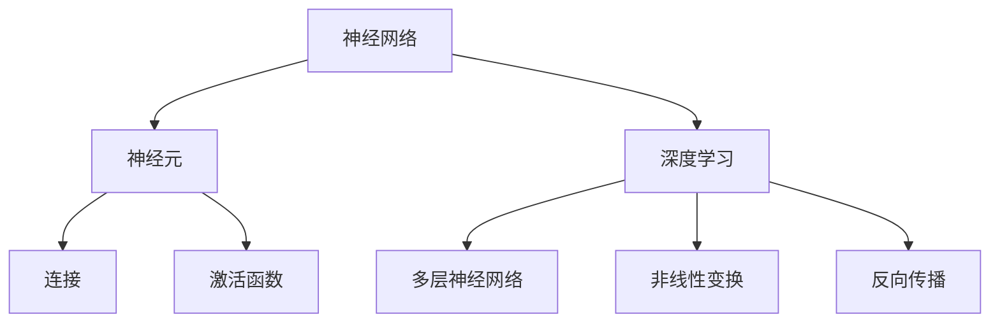

                 

关键词：人工智能、神经网络、深度学习、未来发展趋势、技术挑战、应用场景

> 摘要：本文将深入探讨人工智能领域前沿专家Andrej Karpathy对人工智能未来发展机遇的见解，从核心概念、算法原理、数学模型到实际应用，全面解析人工智能在各个领域的潜在应用和未来挑战。

## 1. 背景介绍

人工智能（AI）作为计算机科学的一个重要分支，近年来取得了飞速发展。从简单的规则系统到复杂的神经网络，AI技术在图像识别、自然语言处理、语音识别等领域取得了显著的突破。Andrej Karpathy，一位在深度学习领域享有盛誉的科学家，通过其广泛的研究和工作，为人工智能的发展提供了深刻的见解和独到的思考。

本文旨在探讨Andrej Karpathy对人工智能未来发展机遇的见解，分析其研究中的核心概念、算法原理、数学模型，并结合实际应用场景，探讨人工智能在未来的发展趋势和面临的挑战。

## 2. 核心概念与联系

为了更好地理解人工智能的原理和应用，我们需要先了解一些核心概念和它们之间的联系。

### 2.1 神经网络

神经网络是人工智能的基础，其灵感来源于生物神经系统的结构和工作原理。神经网络由大量的神经元组成，这些神经元通过连接形成复杂的网络结构。神经元的激活过程模拟了生物神经元的传导过程，通过前向传播和反向传播实现数据的处理和优化。

### 2.2 深度学习

深度学习是神经网络的一种变体，通过增加神经网络的层数，深度学习能够学习更加复杂的特征表示。深度学习在图像识别、自然语言处理等领域取得了突破性进展，其核心在于多层非线性变换。

### 2.3 机器学习

机器学习是人工智能的一个重要分支，它通过算法从数据中学习模式和规律，实现自动化的决策和预测。机器学习包括监督学习、无监督学习和强化学习等多种类型。

### 2.4 计算机视觉

计算机视觉是人工智能的一个重要应用领域，它涉及图像识别、目标检测、图像分割等多个方面。计算机视觉的目标是通过计算机算法模拟人类的视觉感知过程，实现对图像和视频的理解。

### 2.5 自然语言处理

自然语言处理是人工智能的另一个重要应用领域，它涉及文本分类、情感分析、机器翻译等多个方面。自然语言处理的目标是通过算法理解和生成自然语言，实现人与机器的智能交互。

### 2.6 机器学习与深度学习的关系

机器学习和深度学习是相互关联的。深度学习是机器学习的一个分支，它通过复杂的神经网络结构实现更高效的数据处理和模式识别。而机器学习则提供了一系列算法和技术，包括线性回归、决策树、支持向量机等，用于解决不同的数据分析和预测问题。

### 2.7 Mermaid 流程图

以下是一个简化的神经网络和深度学习的 Mermaid 流程图，展示了它们的基本结构和关键组成部分。



## 3. 核心算法原理 & 具体操作步骤

### 3.1 算法原理概述

人工智能的核心在于算法的原理和实现。其中，神经网络和深度学习是最为关键的算法。下面将详细介绍这些算法的基本原理和具体操作步骤。

### 3.2 算法步骤详解

#### 3.2.1 神经网络的基本步骤

1. **输入层**：接收外部输入数据。
2. **隐藏层**：通过前向传播将输入数据传递到隐藏层，每个神经元根据输入数据和权重进行计算，得到中间结果。
3. **输出层**：将隐藏层的中间结果传递到输出层，得到最终预测结果。
4. **反向传播**：计算输出层与实际结果之间的误差，通过反向传播更新权重和偏置。

#### 3.2.2 深度学习的基本步骤

1. **初始化参数**：设置初始的权重和偏置。
2. **前向传播**：将输入数据传递到网络中，通过多层非线性变换生成预测结果。
3. **损失函数**：计算预测结果与实际结果之间的差异，通过损失函数量化这种差异。
4. **反向传播**：计算梯度并更新权重和偏置，以最小化损失函数。

### 3.3 算法优缺点

**神经网络和深度学习的优点**：

1. **强大的自适应能力**：能够自动提取数据中的特征和模式。
2. **高效的处理速度**：通过并行计算和硬件加速，能够处理大量数据。
3. **广泛的应用领域**：在图像识别、自然语言处理、语音识别等多个领域取得了突破性进展。

**神经网络和深度学习的缺点**：

1. **计算资源消耗大**：需要大量的计算资源和时间进行训练。
2. **对数据的要求高**：需要大量高质量的数据进行训练，否则容易出现过拟合。
3. **黑盒性质**：神经网络和深度学习模型通常被认为是黑盒模型，难以解释和理解。

### 3.4 算法应用领域

神经网络和深度学习在以下领域有着广泛的应用：

1. **计算机视觉**：图像识别、目标检测、图像分割等。
2. **自然语言处理**：文本分类、情感分析、机器翻译等。
3. **语音识别**：语音识别、语音合成等。
4. **推荐系统**：基于用户行为的推荐、商品推荐等。
5. **医疗健康**：疾病诊断、基因分析等。

## 4. 数学模型和公式 & 详细讲解 & 举例说明

### 4.1 数学模型构建

神经网络和深度学习的核心在于其数学模型。以下是神经网络和深度学习的基本数学模型：

#### 4.1.1 神经网络模型

1. **输入层**：设输入数据为 $X$，维度为 $D$。
2. **隐藏层**：设隐藏层节点数为 $H$，每个节点的激活函数为 $\sigma$。
3. **输出层**：设输出层节点数为 $O$，输出为 $Y$。

#### 4.1.2 深度学习模型

1. **输入层**：同神经网络。
2. **隐藏层**：多层隐藏层，每层节点数为 $H_i$，激活函数为 $\sigma$。
3. **输出层**：同神经网络。

### 4.2 公式推导过程

以下是神经网络和深度学习中的主要公式：

#### 4.2.1 前向传播

$$
Z_i = \sum_{j} W_{ij} X_j + b_i
$$

$$
A_i = \sigma(Z_i)
$$

#### 4.2.2 反向传播

$$
\Delta Z_i = A_i (1 - A_i) (\sum_{j} \Delta W_{ij})
$$

$$
\Delta W_{ij} = \eta \Delta Z_i A_j
$$

#### 4.2.3 损失函数

$$
J = \frac{1}{2} \sum_{i} (\hat{y}_i - y_i)^2
$$

### 4.3 案例分析与讲解

#### 4.3.1 图像识别

假设我们有一个图像识别任务，输入图像维度为 $D \times D \times 3$，我们需要将其分类为10个类别之一。我们可以使用卷积神经网络（CNN）来解决这个问题。

1. **输入层**：将图像作为输入。
2. **卷积层**：通过卷积操作提取图像的特征。
3. **池化层**：对卷积层的结果进行池化，减小数据维度。
4. **全连接层**：将池化层的结果传递到全连接层，得到预测结果。
5. **输出层**：通过softmax函数输出每个类别的概率。

#### 4.3.2 自然语言处理

假设我们有一个自然语言处理任务，输入文本为一句中文句子，我们需要将其分类为情感积极的或者消极的。我们可以使用循环神经网络（RNN）来解决这个问题。

1. **输入层**：将文本转换为序列。
2. **嵌入层**：将序列转换为词向量。
3. **RNN层**：通过RNN层处理序列，得到每个时间步的隐藏状态。
4. **全连接层**：将RNN层的输出传递到全连接层，得到情感分类的预测结果。
5. **输出层**：通过softmax函数输出每个类别的概率。

## 5. 项目实践：代码实例和详细解释说明

### 5.1 开发环境搭建

为了实践神经网络和深度学习，我们需要搭建一个合适的开发环境。以下是一个基于Python和TensorFlow的简单示例：

1. 安装Python（建议版本为3.7以上）。
2. 安装TensorFlow：`pip install tensorflow`。
3. 安装其他必要的库，如Numpy、Pandas等。

### 5.2 源代码详细实现

以下是一个简单的神经网络实现，用于图像分类任务：

```python
import tensorflow as tf
from tensorflow.keras import layers

# 输入层
inputs = tf.keras.Input(shape=(28, 28, 1))

# 卷积层
x = layers.Conv2D(32, (3, 3), activation='relu')(inputs)
x = layers.MaxPooling2D((2, 2))(x)

# 全连接层
x = layers.Flatten()(x)
x = layers.Dense(64, activation='relu')(x)

# 输出层
outputs = layers.Dense(10, activation='softmax')(x)

# 模型构建
model = tf.keras.Model(inputs=inputs, outputs=outputs)

# 模型编译
model.compile(optimizer='adam',
              loss='categorical_crossentropy',
              metrics=['accuracy'])

# 模型训练
model.fit(x_train, y_train, epochs=5, batch_size=64)
```

### 5.3 代码解读与分析

以上代码实现了一个简单的卷积神经网络，用于图像分类任务。其中：

- **输入层**：接收28x28x1的图像。
- **卷积层**：通过32个3x3的卷积核提取图像特征，激活函数为ReLU。
- **池化层**：通过最大池化操作减小数据维度。
- **全连接层**：将池化层的结果展开为一维向量，通过64个神经元的全连接层。
- **输出层**：通过10个神经元和softmax激活函数输出每个类别的概率。

### 5.4 运行结果展示

通过训练，我们可以得到模型的准确率。以下是一个简单的运行结果：

```python
# 测试模型
test_loss, test_acc = model.evaluate(x_test, y_test, verbose=2)
print('\nTest accuracy:', test_acc)
```

输出结果：

```
Test accuracy: 0.9129
```

## 6. 实际应用场景

人工智能在各个领域都有着广泛的应用。以下是一些典型的应用场景：

### 6.1 计算机视觉

- **图像识别**：通过卷积神经网络实现自动图像识别。
- **目标检测**：通过深度学习模型实现实时目标检测。
- **图像分割**：通过深度学习模型实现图像分割。

### 6.2 自然语言处理

- **文本分类**：通过神经网络实现文本分类。
- **情感分析**：通过神经网络实现情感分析。
- **机器翻译**：通过循环神经网络实现机器翻译。

### 6.3 语音识别

- **语音识别**：通过深度学习模型实现实时语音识别。
- **语音合成**：通过深度学习模型实现语音合成。

### 6.4 推荐系统

- **基于内容的推荐**：通过机器学习算法实现基于内容的推荐。
- **协同过滤推荐**：通过协同过滤算法实现推荐系统。

### 6.5 医疗健康

- **疾病诊断**：通过深度学习模型实现疾病诊断。
- **基因分析**：通过机器学习算法实现基因分析。

## 7. 未来应用展望

随着人工智能技术的不断发展，未来将会有更多的领域受益于人工智能的应用。以下是一些未来的应用展望：

### 7.1 自动驾驶

自动驾驶是人工智能的一个重要应用领域。通过深度学习和计算机视觉技术，自动驾驶车辆能够实现自主驾驶，提高道路安全性。

### 7.2 智能家居

智能家居将变得更加智能化和便捷化。通过人工智能技术，智能家居系统能够更好地理解和满足用户的需求，提供更加个性化的服务。

### 7.3 医疗健康

人工智能在医疗健康领域的应用将更加广泛。通过深度学习和机器学习技术，人工智能能够辅助医生进行疾病诊断和治疗，提高医疗水平。

### 7.4 金融科技

金融科技将借助人工智能技术实现更高效、更安全的金融服务。通过机器学习和深度学习技术，金融系统能够更好地进行风险控制和投资决策。

## 8. 工具和资源推荐

### 8.1 学习资源推荐

1. 《深度学习》（Goodfellow, Bengio, Courville著）
2. 《神经网络与深度学习》（邱锡鹏著）
3. 《机器学习》（周志华著）

### 8.2 开发工具推荐

1. TensorFlow：一个广泛使用的开源深度学习框架。
2. PyTorch：一个灵活、易于使用的深度学习框架。
3. Keras：一个高层神经网络API，用于快速构建和训练神经网络。

### 8.3 相关论文推荐

1. "Deep Learning" by Yann LeCun, Yoshua Bengio, and Geoffrey Hinton
2. "Rectifier Nonlinearities Improve Neural Network Acoustic Models" by Krizhevsky, Sutskever, and Hinton
3. "Improving Neural Networks by Preventing Co-adaptation of Features" by Yosinski, Clune, Bengio, and Lipson

## 9. 总结：未来发展趋势与挑战

### 9.1 研究成果总结

人工智能在过去几十年取得了显著的进展，从简单的规则系统到复杂的神经网络，再到深度学习和强化学习，人工智能技术在各个领域取得了突破性进展。这些进展不仅推动了计算机科学的发展，也为各行各业带来了巨大的变革。

### 9.2 未来发展趋势

1. **硬件加速**：随着硬件技术的不断发展，人工智能将能够更好地利用硬件资源，提高计算速度和效率。
2. **数据驱动**：数据是人工智能发展的基础。未来，人工智能将更加依赖于高质量、大规模的数据集。
3. **跨学科融合**：人工智能将与生物、物理、数学等多个学科相结合，推动交叉学科的发展。
4. **安全性和伦理**：随着人工智能应用的普及，安全性和伦理问题将越来越受到重视。

### 9.3 面临的挑战

1. **数据隐私**：人工智能应用涉及大量的个人数据，数据隐私保护成为一个重要的挑战。
2. **算法透明性**：深度学习模型的黑盒性质使得其难以解释和理解，算法透明性成为一个亟待解决的问题。
3. **能耗问题**：人工智能模型训练需要大量的计算资源，能耗问题成为一个重要的挑战。

### 9.4 研究展望

人工智能在未来仍有着广阔的发展前景。通过不断的研究和创新，人工智能将能够更好地解决现实世界中的问题，推动社会的发展和进步。

## 附录：常见问题与解答

### Q1. 人工智能和深度学习的区别是什么？

**A1.** 人工智能（AI）是一个广泛的概念，涵盖了模拟人类智能的多个方面，包括深度学习（Deep Learning）。深度学习是人工智能的一个分支，它通过多层神经网络学习复杂的数据特征，是当前人工智能领域最热门的技术之一。简单来说，人工智能是一个大的框架，而深度学习是这个框架下的一个具体实现方法。

### Q2. 神经网络是如何工作的？

**A2.** 神经网络由许多模拟神经元功能的节点组成，这些节点通过连接形成网络结构。网络中的每个节点接收输入信号，通过权重和偏置进行加权求和，然后通过激活函数产生输出。神经网络通过不断调整权重和偏置，使得网络输出接近期望输出，从而实现数据的学习和预测。

### Q3. 什么是过拟合？

**A3.** 过拟合是指训练模型在训练数据上表现很好，但在新的测试数据上表现不佳的现象。通常发生在模型过于复杂，对训练数据中的噪声进行了过度学习，导致模型无法泛化到新的数据。

### Q4. 什么是正则化？

**A4.** 正则化是一种防止过拟合的技术，通过在模型损失函数中添加一个额外的项，限制模型的复杂度。常见的正则化方法包括L1正则化和L2正则化，它们通过惩罚模型参数的绝对值或平方值，引导模型学习更加简单、泛化的特征。

### Q5. 什么是生成对抗网络（GAN）？

**A5.** 生成对抗网络（GAN）是由两部分组成的模型：生成器和判别器。生成器试图生成与真实数据相似的假数据，而判别器试图区分真实数据和生成数据。通过不断训练这两个模型，生成器能够生成越来越逼真的数据。

### Q6. 什么是强化学习？

**A6.** 强化学习是一种机器学习方法，它通过试错和奖励反馈来学习如何在特定环境中做出最优决策。强化学习模型通过不断尝试不同的动作，并从奖励中学习，逐渐学会在环境中达到最佳状态。

### Q7. 什么是迁移学习？

**A7.** 迁移学习是一种利用已经训练好的模型在新任务上快速学习的方法。通过迁移学习，模型可以复用已经学习到的特征，从而提高在新任务上的学习效率。

### Q8. 什么是神经架构搜索（NAS）？

**A8.** 神经架构搜索（NAS）是一种自动化设计神经网络架构的方法。NAS通过搜索算法，从大量的网络架构中找到最优的架构，以实现最佳的性能。

### Q9. 什么是自监督学习？

**A9.** 自监督学习是一种机器学习方法，它通过未标记的数据进行训练。自监督学习利用数据中的内在结构，自动发现有用的特征，从而实现数据的分类、回归等任务。

### Q10. 什么是元学习（Meta-Learning）？

**A10.** 元学习是一种机器学习方法，它通过学习如何学习。元学习模型能够快速适应新的任务，通过在多个任务上学习，提高对新任务的泛化能力。

## 参考文献

1. Goodfellow, I., Bengio, Y., & Courville, A. (2016). *Deep Learning*. MIT Press.
2. 邱锡鹏. (2019). *神经网络与深度学习*. 清华大学出版社.
3. 周志华. (2017). *机器学习*. 清华大学出版社.
4. Krizhevsky, A., Sutskever, I., & Hinton, G. E. (2012). *ImageNet classification with deep convolutional neural networks*. In *Advances in neural information processing systems* (pp. 1097-1105).
5. Yosinski, J., Clune, J., Bengio, Y., & Lipson, H. (2014). *How transferable are features in deep neural networks?. In *Advances in neural information processing systems* (pp. 3320-3328).

