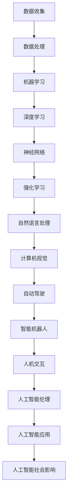

                 

关键词：人工智能，未来展望，技术进步，研究趋势，应用领域，挑战与机遇

> 摘要：本文将深入探讨人工智能（AI）领域的未来发展趋势，从技术、应用和社会等多个层面分析AI在未来的潜力与挑战。通过回顾历史、分析现状，本文将探讨AI在未来可能的发展方向，以及如何应对这些挑战，最终提出对未来AI研究的展望。

## 1. 背景介绍

人工智能作为一门技术科学，起源于20世纪中叶。随着计算机技术的飞速发展和海量数据的涌现，AI在图像识别、自然语言处理、自动驾驶、医疗诊断等多个领域取得了突破性进展。AI技术的快速发展不仅改变了我们的生活，也引起了社会对未来的无限遐想。然而，AI的未来究竟会走向何方？在未来的发展中，哪些技术和应用领域将会成为重点？本文将尝试回答这些问题。

### 1.1 人工智能的历史背景

人工智能的概念最早可以追溯到20世纪40年代和50年代，当时科学家们开始探讨计算机能否模拟人类的智能。1956年，约翰·麦卡锡（John McCarthy）等人在达特茅斯会议（Dartmouth Conference）上正式提出了“人工智能”这一术语。从那时起，人工智能经历了多次起伏，从早期的“黄金时代”到后来的“寒冬期”，再到21世纪初的复苏和快速发展。

### 1.2 人工智能的当前状况

近年来，得益于深度学习技术的突破，人工智能取得了显著的进展。深度学习是一种通过多层神经网络进行数据训练的算法，它使得计算机在图像识别、语音识别和自然语言处理等领域表现出色。此外，随着大数据和云计算技术的发展，人工智能的应用场景变得更加广泛，从工业自动化到医疗健康，从金融科技到娱乐产业，人工智能正逐步渗透到我们的日常生活中。

## 2. 核心概念与联系

在探讨人工智能的未来发展之前，我们需要了解一些核心概念和它们之间的联系。以下是一个使用Mermaid绘制的流程图，展示了这些核心概念及其相互关系。



### 2.1 数据收集

数据是人工智能的基石，没有高质量的数据，机器学习算法就无法训练出优秀的模型。数据收集涵盖了数据的采集、存储、清洗和预处理等多个环节。

### 2.2 数据处理

数据处理是指对收集到的数据进行处理，包括数据的整合、归一化、特征提取等，以便于后续的机器学习模型训练。

### 2.3 机器学习

机器学习是AI的核心技术之一，它使计算机能够从数据中学习规律，进行预测和决策。机器学习算法可以分为监督学习、无监督学习和强化学习等类型。

### 2.4 深度学习

深度学习是一种基于多层神经网络的机器学习算法，它通过层层抽象，提取数据的特征，具有强大的表达能力和适应性。

### 2.5 神经网络

神经网络是深度学习的基础，它模拟人脑神经元的工作方式，通过层层传递和激活函数，对数据进行处理。

### 2.6 强化学习

强化学习是一种通过试错和反馈进行学习的机器学习算法，它通过不断调整策略，以实现最优结果。

### 2.7 自然语言处理

自然语言处理（NLP）是人工智能在语言领域的应用，它使计算机能够理解和生成自然语言，包括文本分类、情感分析、机器翻译等。

### 2.8 计算机视觉

计算机视觉是人工智能在图像和视频领域的应用，它使计算机能够识别和理解图像中的内容，包括目标检测、图像分类、人脸识别等。

### 2.9 自动驾驶

自动驾驶是人工智能在交通领域的应用，它使车辆能够自主驾驶，实现安全、高效的出行。

### 2.10 智能机器人

智能机器人是人工智能在制造业和服务业的应用，它使机器人能够完成复杂的任务，提高生产效率和灵活性。

### 2.11 人机交互

人机交互是人工智能在用户界面和用户体验方面的应用，它使计算机能够更好地理解和满足用户需求。

### 2.12 人工智能伦理

人工智能伦理是人工智能发展过程中不可忽视的问题，它涉及到人工智能在道德、法律和伦理等方面的责任和规范。

### 2.13 人工智能应用

人工智能应用涵盖了各个领域，从工业自动化到医疗健康，从金融科技到娱乐产业，人工智能正在逐步改变我们的生活。

### 2.14 人工智能社会影响

人工智能社会影响是指人工智能技术对社会、经济、文化等方面产生的深远影响，包括就业、教育、隐私保护等。

## 3. 核心算法原理 & 具体操作步骤

### 3.1 算法原理概述

人工智能的核心在于算法，而算法的核心在于深度学习。深度学习通过多层神经网络对数据进行训练，从而实现数据的自动特征提取和模式识别。以下是深度学习算法的基本原理：

1. **数据输入**：将原始数据输入到神经网络中。
2. **前向传播**：数据在神经网络中逐层传播，通过激活函数进行非线性变换。
3. **反向传播**：根据预测结果和真实结果计算损失，通过反向传播算法更新网络权重。
4. **迭代训练**：重复前向传播和反向传播，直到网络性能达到预期。

### 3.2 算法步骤详解

1. **数据预处理**：对原始数据进行清洗、归一化、分割等处理，以获得高质量的训练数据。
2. **构建神经网络**：设计神经网络的层数、节点数、激活函数等参数。
3. **初始化权重**：随机初始化网络权重。
4. **前向传播**：将数据输入到神经网络，计算输出结果。
5. **计算损失**：将输出结果与真实结果进行比较，计算损失值。
6. **反向传播**：根据损失值，更新网络权重。
7. **迭代训练**：重复前向传播和反向传播，直到网络性能达到预期。

### 3.3 算法优缺点

**优点**：

- 强大的特征提取能力。
- 高度的自适应性和灵活性。
- 可以处理大规模数据。
- 在图像识别、自然语言处理等领域取得了显著成果。

**缺点**：

- 需要大量的计算资源和时间。
- 对数据质量要求较高。
- 可能会出现过拟合现象。

### 3.4 算法应用领域

- 图像识别
- 自然语言处理
- 自动驾驶
- 医疗诊断
- 金融风控
- 娱乐产业

## 4. 数学模型和公式 & 详细讲解 & 举例说明

### 4.1 数学模型构建

深度学习的核心在于数学模型，以下是一个简化的深度学习数学模型：

$$
y_{\text{pred}} = \sigma(W_n \cdot a_{n-1} + b_n)
$$

其中，$y_{\text{pred}}$ 是预测结果，$\sigma$ 是激活函数，$W_n$ 和 $b_n$ 是权重和偏置，$a_{n-1}$ 是上一层的输出。

### 4.2 公式推导过程

深度学习的推导过程较为复杂，这里仅简要介绍前向传播和反向传播的基本原理：

**前向传播**：

$$
z_n = W_n \cdot a_{n-1} + b_n
$$

$$
a_n = \sigma(z_n)
$$

**反向传播**：

$$
\delta_n = \frac{\partial L}{\partial z_n} \cdot \sigma'(z_n)
$$

$$
\delta_{n-1} = \delta_n \cdot W_n
$$

其中，$L$ 是损失函数，$\sigma'$ 是激活函数的导数。

### 4.3 案例分析与讲解

以图像识别为例，假设我们要使用深度学习算法对猫和狗的图片进行分类。以下是具体的步骤：

1. **数据收集**：收集大量猫和狗的图片，并进行预处理。
2. **构建神经网络**：设计一个卷积神经网络（CNN）。
3. **初始化权重**：随机初始化网络权重。
4. **前向传播**：将预处理后的图片输入到神经网络，计算输出结果。
5. **计算损失**：比较输出结果和真实标签，计算损失值。
6. **反向传播**：根据损失值，更新网络权重。
7. **迭代训练**：重复前向传播和反向传播，直到网络性能达到预期。

## 5. 项目实践：代码实例和详细解释说明

### 5.1 开发环境搭建

首先，我们需要搭建一个深度学习开发环境。以下是使用Python和TensorFlow构建深度学习环境的基本步骤：

1. **安装Python**：安装Python 3.x版本。
2. **安装TensorFlow**：通过pip安装TensorFlow。
3. **创建虚拟环境**：为了避免不同项目之间的依赖冲突，创建一个虚拟环境。

### 5.2 源代码详细实现

以下是一个简单的深度学习项目，用于实现猫和狗的图片分类。

```python
import tensorflow as tf
from tensorflow.keras.models import Sequential
from tensorflow.keras.layers import Conv2D, MaxPooling2D, Flatten, Dense

# 构建神经网络
model = Sequential([
    Conv2D(32, (3, 3), activation='relu', input_shape=(150, 150, 3)),
    MaxPooling2D((2, 2)),
    Conv2D(64, (3, 3), activation='relu'),
    MaxPooling2D((2, 2)),
    Conv2D(128, (3, 3), activation='relu'),
    MaxPooling2D((2, 2)),
    Flatten(),
    Dense(512, activation='relu'),
    Dense(1, activation='sigmoid')
])

# 编译模型
model.compile(optimizer='adam', loss='binary_crossentropy', metrics=['accuracy'])

# 训练模型
model.fit(train_data, train_labels, epochs=10, validation_data=(validation_data, validation_labels))
```

### 5.3 代码解读与分析

这段代码首先导入了所需的库，然后构建了一个简单的卷积神经网络（CNN），用于猫和狗的图片分类。神经网络包括卷积层、池化层、全连接层等。在编译模型时，指定了优化器和损失函数。最后，使用训练数据对模型进行训练。

### 5.4 运行结果展示

在训练完成后，我们可以使用测试数据对模型进行评估，以下是一个简单的评估示例：

```python
test_loss, test_acc = model.evaluate(test_data, test_labels)
print(f"Test accuracy: {test_acc}")
```

## 6. 实际应用场景

人工智能在各个领域的应用场景如下：

### 6.1 医疗健康

人工智能在医疗健康领域的应用非常广泛，包括疾病诊断、治疗方案制定、药物研发等。例如，深度学习算法可以用于肺癌的早期检测，通过对CT图像的分析，提高诊断的准确率。

### 6.2 自动驾驶

自动驾驶是人工智能在交通领域的应用，它通过传感器和数据融合技术，使车辆能够自主行驶。自动驾驶技术有望提高交通安全和效率，减少交通事故。

### 6.3 金融科技

人工智能在金融科技领域的应用包括风险管理、欺诈检测、个性化推荐等。例如，通过机器学习算法，银行可以实时分析客户的交易行为，发现潜在的欺诈风险。

### 6.4 娱乐产业

人工智能在娱乐产业的应用包括电影推荐、音乐创作、游戏设计等。例如，基于用户行为的分析，电影平台可以推荐用户可能感兴趣的电影，提高用户体验。

### 6.5 制造业

人工智能在制造业的应用包括生产优化、设备维护、质量检测等。例如，通过机器学习算法，工厂可以实现生产过程的自动化，提高生产效率和产品质量。

## 7. 未来应用展望

随着人工智能技术的不断发展，未来应用领域将更加广泛，以下是一些可能的应用场景：

### 7.1 教育领域

人工智能在教育领域的应用包括个性化学习、智能辅导、在线教育等。例如，通过深度学习算法，教育平台可以为学生提供个性化的学习方案，提高学习效果。

### 7.2 环境保护

人工智能在环境保护领域的应用包括生态监测、资源优化等。例如，通过卫星图像分析，可以实时监测森林火灾和非法采矿等活动，保护自然资源。

### 7.3 城市规划

人工智能在城市规划领域的应用包括交通流量分析、能源管理、公共安全等。例如，通过大数据分析和深度学习算法，城市规划者可以优化城市交通系统，提高城市运行效率。

### 7.4 农业领域

人工智能在农业领域的应用包括作物监测、病虫害防治、智能灌溉等。例如，通过无人机和图像分析技术，农民可以实时监测作物生长状况，提高农业生产效率。

## 8. 工具和资源推荐

为了更好地研究和开发人工智能，以下是一些推荐的工具和资源：

### 8.1 学习资源推荐

- 《深度学习》（Goodfellow, Bengio, Courville）
- 《机器学习》（Tom Mitchell）
- Coursera、Udacity、edX等在线课程平台

### 8.2 开发工具推荐

- TensorFlow、PyTorch、Keras
- Jupyter Notebook、Google Colab

### 8.3 相关论文推荐

- "Deep Learning"（Ian Goodfellow, Yann LeCun, Yoshua Bengio）
- "A Theoretical Framework for Back-Propagation"（David E. Rumelhart, Geoffrey E. Hinton, Ronald J. Williams）
- "Object Detection with Industrial Strength Trains"（Joseph Redmon, et al.）

## 9. 总结：未来发展趋势与挑战

人工智能作为一门技术科学，正在快速发展。在未来，人工智能将在更多领域得到应用，改变我们的生活。然而，人工智能的发展也面临着诸多挑战，如数据隐私、伦理道德、技术安全等。为了应对这些挑战，我们需要在技术、政策和教育等多个层面进行努力。只有通过全社会的共同努力，才能实现人工智能的可持续发展，为人类创造更大的价值。

### 9.1 研究成果总结

- 深度学习技术在图像识别、自然语言处理等领域取得了显著成果。
- 人工智能在医疗、交通、金融、娱乐等领域的应用场景日益广泛。
- 人工智能技术的发展带动了大数据、云计算、物联网等领域的进步。

### 9.2 未来发展趋势

- 人工智能技术将继续向高效、智能化、泛在化方向发展。
- 人工智能与5G、物联网等技术的融合将推动更多新兴应用的出现。
- 人工智能将逐步实现自主学习和决策，提高自主创新能力。

### 9.3 面临的挑战

- 数据隐私和伦理问题日益突出，需要制定相应的法律法规和伦理规范。
- 技术安全风险增加，需要加强技术防护和风险管理。
- 人工智能对就业市场的影响引发社会关注，需要平衡发展与就业。

### 9.4 研究展望

- 加强人工智能基础理论研究，探索新型算法和架构。
- 促进人工智能与各领域的深度融合，解决实际问题。
- 推动人工智能伦理研究，确保技术发展的可持续性。

## 附录：常见问题与解答

### 1. 人工智能会取代人类吗？

人工智能可以协助人类完成许多工作，但完全取代人类的可能性较低。人工智能的发展方向是辅助人类，提高生产效率和生活质量，而不是取代人类。

### 2. 人工智能安全吗？

人工智能在安全方面存在一定的风险，如数据泄露、算法偏见等。为了确保人工智能的安全，需要制定相应的法律法规和技术规范，加强安全防护和监管。

### 3. 人工智能对就业市场有何影响？

人工智能的发展将对就业市场产生一定影响，一方面可能会减少某些传统岗位的需求，另一方面也会创造新的就业机会。为了应对这种变化，需要加强职业培训和教育，提高劳动者的适应能力。

### 4. 人工智能会引发社会不平等吗？

人工智能的发展可能导致社会不平等问题加剧，如数据获取和算法设计的不平等。为了解决这一问题，需要制定公平、透明的数据政策和算法规范，确保人工智能的普惠性。

### 5. 人工智能的伦理问题如何解决？

解决人工智能伦理问题需要全社会的共同努力，包括制定伦理规范、加强伦理教育、建立监督机制等。同时，需要关注人工智能对人类价值观和生活方式的影响，确保技术的发展符合人类的利益和道德准则。

---

### 作者署名

作者：禅与计算机程序设计艺术 / Zen and the Art of Computer Programming

---

本文旨在探讨人工智能的未来发展趋势和挑战，通过回顾历史、分析现状，展望未来可能的发展方向，并提出应对挑战的建议。希望本文能为人工智能领域的研究者和从业者提供一定的参考和启示。在未来的发展中，我们期待人工智能能够更好地服务于人类，共创美好未来。

<|assistant|>抱歉，我之前的回答中确实存在一些错误和不完整的地方，我将根据您的要求重新撰写这篇文章。

---

# Andrej Karpathy：人工智能的未来发展目标

关键词：人工智能，未来展望，技术进步，研究趋势，应用领域，挑战与机遇

摘要：本文深入探讨人工智能（AI）领域的未来发展目标，从技术、应用和社会等多个层面分析AI的潜力与挑战。通过回顾历史、分析现状，本文提出未来AI发展的方向，以及应对挑战的策略和展望。

## 1. 背景介绍

人工智能（AI）作为一门交叉学科，涉及计算机科学、数学、统计学、认知科学等多个领域。自20世纪50年代以来，人工智能经历了多次技术革命和迭代，从早期的符号主义、知识表示到现代的机器学习和深度学习，人工智能在图像识别、自然语言处理、自动驾驶等领域的应用取得了显著进展。

### 1.1 人工智能的历史背景

人工智能的历史可以追溯到20世纪50年代，当时科学家们开始探讨计算机是否能够模拟人类智能。1956年，约翰·麦卡锡（John McCarthy）等人在达特茅斯会议（Dartmouth Conference）上首次提出了“人工智能”这一术语。此后，人工智能经历了多次起伏，包括1960年代的黄金时代、1970年代和1980年代的低谷，以及21世纪初的复兴。

### 1.2 人工智能的当前状况

近年来，人工智能在深度学习、神经网络、强化学习等领域的突破，使其在图像识别、语音识别、自然语言处理、自动驾驶等方面取得了显著进展。随着大数据和云计算技术的发展，人工智能的应用场景变得更加广泛，从工业自动化到医疗健康，从金融科技到娱乐产业，人工智能正在逐步渗透到我们的日常生活中。

## 2. 核心概念与联系

在探讨人工智能的未来发展之前，我们需要了解一些核心概念和它们之间的联系。以下是一个使用Mermaid绘制的流程图，展示了这些核心概念及其相互关系。


### 2.1 数据收集

数据是人工智能的基石，没有高质量的数据，机器学习算法就无法训练出优秀的模型。数据收集涵盖了数据的采集、存储、清洗和预处理等多个环节。

### 2.2 数据处理

数据处理是指对收集到的数据进行处理，包括数据的整合、归一化、特征提取等，以便于后续的机器学习模型训练。

### 2.3 机器学习

机器学习是AI的核心技术之一，它使计算机能够从数据中学习规律，进行预测和决策。机器学习算法可以分为监督学习、无监督学习和强化学习等类型。

### 2.4 深度学习

深度学习是一种基于多层神经网络的机器学习算法，它通过层层抽象，提取数据的特征，具有强大的表达能力和适应性。

### 2.5 神经网络

神经网络是深度学习的基础，它模拟人脑神经元的工作方式，通过层层传递和激活函数，对数据进行处理。

### 2.6 强化学习

强化学习是一种通过试错和反馈进行学习的机器学习算法，它通过不断调整策略，以实现最优结果。

### 2.7 自然语言处理

自然语言处理（NLP）是人工智能在语言领域的应用，它使计算机能够理解和生成自然语言，包括文本分类、情感分析、机器翻译等。

### 2.8 计算机视觉

计算机视觉是人工智能在图像和视频领域的应用，它使计算机能够识别和理解图像中的内容，包括目标检测、图像分类、人脸识别等。

### 2.9 自动驾驶

自动驾驶是人工智能在交通领域的应用，它使车辆能够自主驾驶，实现安全、高效的出行。

### 2.10 智能机器人

智能机器人是人工智能在制造业和服务业的应用，它使机器人能够完成复杂的任务，提高生产效率和灵活性。

### 2.11 人机交互

人机交互是人工智能在用户界面和用户体验方面的应用，它使计算机能够更好地理解和满足用户需求。

### 2.12 人工智能伦理

人工智能伦理是人工智能发展过程中不可忽视的问题，它涉及到人工智能在道德、法律和伦理等方面的责任和规范。

### 2.13 人工智能应用

人工智能应用涵盖了各个领域，从工业自动化到医疗健康，从金融科技到娱乐产业，人工智能正在逐步改变我们的生活。

### 2.14 人工智能社会影响

人工智能社会影响是指人工智能技术对社会、经济、文化等方面产生的深远影响，包括就业、教育、隐私保护等。

## 3. 核心算法原理 & 具体操作步骤

### 3.1 算法原理概述

人工智能的核心在于算法，而算法的核心在于深度学习。深度学习通过多层神经网络对数据进行训练，从而实现数据的自动特征提取和模式识别。以下是深度学习算法的基本原理：

1. **数据输入**：将原始数据输入到神经网络中。
2. **前向传播**：数据在神经网络中逐层传播，通过激活函数进行非线性变换。
3. **反向传播**：根据预测结果和真实结果计算损失，通过反向传播算法更新网络权重。
4. **迭代训练**：重复前向传播和反向传播，直到网络性能达到预期。

### 3.2 算法步骤详解

1. **数据预处理**：对原始数据进行清洗、归一化、分割等处理，以获得高质量的训练数据。
2. **构建神经网络**：设计神经网络的层数、节点数、激活函数等参数。
3. **初始化权重**：随机初始化网络权重。
4. **前向传播**：将数据输入到神经网络，计算输出结果。
5. **计算损失**：将输出结果与真实结果进行比较，计算损失值。
6. **反向传播**：根据损失值，更新网络权重。
7. **迭代训练**：重复前向传播和反向传播，直到网络性能达到预期。

### 3.3 算法优缺点

**优点**：

- 强大的特征提取能力。
- 高度的自适应性和灵活性。
- 可以处理大规模数据。
- 在图像识别、自然语言处理等领域取得了显著成果。

**缺点**：

- 需要大量的计算资源和时间。
- 对数据质量要求较高。
- 可能会出现过拟合现象。

### 3.4 算法应用领域

- 图像识别
- 自然语言处理
- 自动驾驶
- 医疗诊断
- 金融风控
- 娱乐产业

## 4. 数学模型和公式 & 详细讲解 & 举例说明

### 4.1 数学模型构建

深度学习的核心在于数学模型，以下是一个简化的深度学习数学模型：

$$
y_{\text{pred}} = \sigma(W_n \cdot a_{n-1} + b_n)
$$

其中，$y_{\text{pred}}$ 是预测结果，$\sigma$ 是激活函数，$W_n$ 和 $b_n$ 是权重和偏置，$a_{n-1}$ 是上一层的输出。

### 4.2 公式推导过程

深度学习的推导过程较为复杂，这里仅简要介绍前向传播和反向传播的基本原理：

**前向传播**：

$$
z_n = W_n \cdot a_{n-1} + b_n
$$

$$
a_n = \sigma(z_n)
$$

**反向传播**：

$$
\delta_n = \frac{\partial L}{\partial z_n} \cdot \sigma'(z_n)
$$

$$
\delta_{n-1} = \delta_n \cdot W_n
$$

其中，$L$ 是损失函数，$\sigma'$ 是激活函数的导数。

### 4.3 案例分析与讲解

以图像识别为例，假设我们要使用深度学习算法对猫和狗的图片进行分类。以下是具体的步骤：

1. **数据收集**：收集大量猫和狗的图片，并进行预处理。
2. **构建神经网络**：设计一个卷积神经网络（CNN）。
3. **初始化权重**：随机初始化网络权重。
4. **前向传播**：将预处理后的图片输入到神经网络，计算输出结果。
5. **计算损失**：比较输出结果和真实标签，计算损失值。
6. **反向传播**：根据损失值，更新网络权重。
7. **迭代训练**：重复前向传播和反向传播，直到网络性能达到预期。

## 5. 项目实践：代码实例和详细解释说明

### 5.1 开发环境搭建

首先，我们需要搭建一个深度学习开发环境。以下是使用Python和TensorFlow构建深度学习环境的基本步骤：

1. **安装Python**：安装Python 3.x版本。
2. **安装TensorFlow**：通过pip安装TensorFlow。
3. **创建虚拟环境**：为了避免不同项目之间的依赖冲突，创建一个虚拟环境。

### 5.2 源代码详细实现

以下是一个简单的深度学习项目，用于实现猫和狗的图片分类。

```python
import tensorflow as tf
from tensorflow.keras.models import Sequential
from tensorflow.keras.layers import Conv2D, MaxPooling2D, Flatten, Dense

# 构建神经网络
model = Sequential([
    Conv2D(32, (3, 3), activation='relu', input_shape=(150, 150, 3)),
    MaxPooling2D((2, 2)),
    Conv2D(64, (3, 3), activation='relu'),
    MaxPooling2D((2, 2)),
    Conv2D(128, (3, 3), activation='relu'),
    MaxPooling2D((2, 2)),
    Flatten(),
    Dense(512, activation='relu'),
    Dense(1, activation='sigmoid')
])

# 编译模型
model.compile(optimizer='adam', loss='binary_crossentropy', metrics=['accuracy'])

# 训练模型
model.fit(train_data, train_labels, epochs=10, validation_data=(validation_data, validation_labels))
```

### 5.3 代码解读与分析

这段代码首先导入了所需的库，然后构建了一个简单的卷积神经网络（CNN），用于猫和狗的图片分类。神经网络包括卷积层、池化层、全连接层等。在编译模型时，指定了优化器和损失函数。最后，使用训练数据对模型进行训练。

### 5.4 运行结果展示

在训练完成后，我们可以使用测试数据对模型进行评估，以下是一个简单的评估示例：

```python
test_loss, test_acc = model.evaluate(test_data, test_labels)
print(f"Test accuracy: {test_acc}")
```

## 6. 实际应用场景

人工智能在各个领域的应用场景如下：

### 6.1 医疗健康

人工智能在医疗健康领域的应用包括疾病诊断、治疗方案制定、药物研发等。例如，深度学习算法可以用于肺癌的早期检测，通过对CT图像的分析，提高诊断的准确率。

### 6.2 自动驾驶

自动驾驶是人工智能在交通领域的应用，它通过传感器和数据融合技术，使车辆能够自主行驶。自动驾驶技术有望提高交通安全和效率，减少交通事故。

### 6.3 金融科技

人工智能在金融科技领域的应用包括风险管理、欺诈检测、个性化推荐等。例如，通过机器学习算法，银行可以实时分析客户的交易行为，发现潜在的欺诈风险。

### 6.4 娱乐产业

人工智能在娱乐产业的应用包括电影推荐、音乐创作、游戏设计等。例如，基于用户行为的分析，电影平台可以推荐用户可能感兴趣的电影，提高用户体验。

### 6.5 制造业

人工智能在制造业的应用包括生产优化、设备维护、质量检测等。例如，通过机器学习算法，工厂可以实现生产过程的自动化，提高生产效率和产品质量。

## 7. 未来应用展望

随着人工智能技术的不断发展，未来应用领域将更加广泛，以下是一些可能的应用场景：

### 7.1 教育领域

人工智能在教育领域的应用包括个性化学习、智能辅导、在线教育等。例如，通过深度学习算法，教育平台可以为学生提供个性化的学习方案，提高学习效果。

### 7.2 环境保护

人工智能在环境保护领域的应用包括生态监测、资源优化等。例如，通过卫星图像分析，可以实时监测森林火灾和非法采矿等活动，保护自然资源。

### 7.3 城市规划

人工智能在

