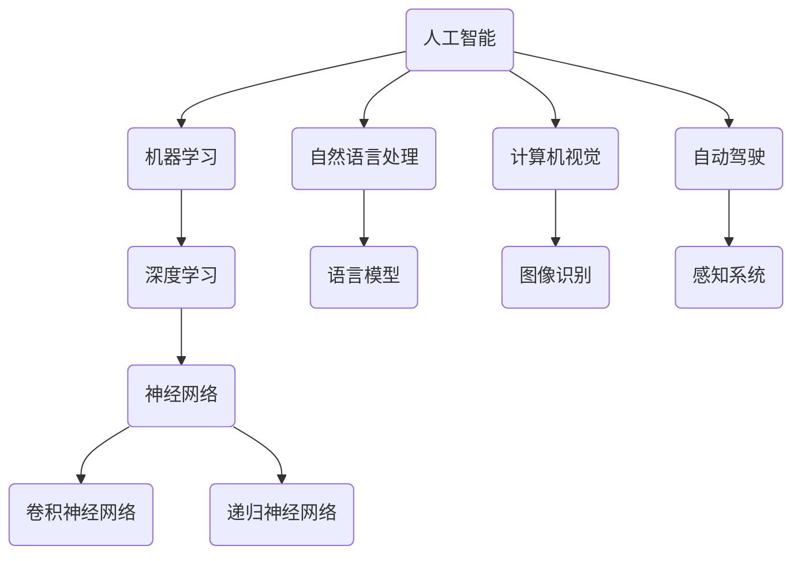

                 

关键词：人工智能，未来展望，技术发展，应用领域，研究挑战

> 摘要：本文旨在探讨人工智能（AI）领域的发展目标，通过对当前技术的分析，展望未来AI的潜在应用场景，并提出研究中的挑战与展望。本文将围绕AI的核心算法、数学模型、项目实践以及未来趋势进行详细探讨，以期为读者提供对AI领域的全面了解。

## 1. 背景介绍

人工智能（AI）作为计算机科学的一个重要分支，自1956年首次被提出以来，已经经历了数十年的发展与变革。随着深度学习、神经网络等技术的突破，AI在图像识别、自然语言处理、自动驾驶等领域的应用日益广泛。当前，AI技术正在加速发展，成为推动社会进步的关键力量。然而，随着技术的不断进步，我们也面临着诸多挑战，如数据隐私、算法公平性、伦理问题等。

本文将重点关注AI领域的发展目标，从核心算法、数学模型、项目实践和未来趋势等多个方面进行深入探讨。希望通过本文的分析，能够为读者提供对AI领域的深刻理解，并激发更多研究和创新的热情。

## 2. 核心概念与联系

为了更好地理解人工智能的发展，我们需要首先明确几个核心概念及其相互关系。以下是一个用Mermaid绘制的流程图，展示了一些关键概念和它们之间的联系。



### 2.1. 人工智能（AI）

人工智能是指由计算机实现的智能行为，旨在使计算机具备人类智能的某些方面。AI技术包括多种方法，如机器学习、深度学习、自然语言处理和计算机视觉等。

### 2.2. 机器学习（ML）

机器学习是一种让计算机通过数据学习模式并进行预测或决策的技术。机器学习可以分为监督学习、无监督学习和强化学习等类型。

### 2.3. 深度学习（DL）

深度学习是一种机器学习的方法，通过多层神经网络来模拟人类大脑的学习过程。深度学习在图像识别、自然语言处理等领域取得了显著成果。

### 2.4. 神经网络（NN）

神经网络是由大量人工神经元组成的计算模型，可以用于图像识别、语音识别等任务。神经网络可以分为卷积神经网络（CNN）和递归神经网络（RNN）等类型。

### 2.5. 自然语言处理（NLP）

自然语言处理是人工智能的一个重要分支，旨在使计算机理解和生成人类语言。NLP技术包括语言模型、词向量、文本分类等。

### 2.6. 计算机视觉（CV）

计算机视觉是人工智能的另一个重要分支，旨在使计算机理解图像和视频。计算机视觉技术包括图像识别、目标检测、图像生成等。

### 2.7. 自动驾驶（AD）

自动驾驶是人工智能在交通运输领域的应用，通过传感器、算法和计算机视觉等技术实现车辆自主驾驶。自动驾驶技术有望改变未来的交通方式。

## 3. 核心算法原理 & 具体操作步骤

### 3.1. 算法原理概述

人工智能的核心算法包括机器学习算法、深度学习算法和自然语言处理算法等。以下是这些算法的基本原理和主要步骤：

### 3.2. 算法步骤详解

#### 3.2.1. 机器学习算法

1. **数据收集**：收集相关领域的大量数据。
2. **数据预处理**：对数据进行清洗、归一化等处理。
3. **特征提取**：从数据中提取有用特征。
4. **模型训练**：使用训练数据训练模型。
5. **模型评估**：使用验证数据评估模型性能。
6. **模型优化**：根据评估结果调整模型参数。

#### 3.2.2. 深度学习算法

1. **数据收集**：与机器学习类似，收集大量数据。
2. **数据预处理**：对数据进行预处理。
3. **模型构建**：设计神经网络结构。
4. **模型训练**：通过反向传播算法训练模型。
5. **模型评估**：使用验证数据评估模型性能。
6. **模型优化**：调整模型参数，提高性能。

#### 3.2.3. 自然语言处理算法

1. **数据收集**：收集大量文本数据。
2. **数据预处理**：对文本进行分词、去停用词等处理。
3. **特征提取**：将文本转换为向量表示。
4. **模型训练**：使用训练数据训练模型。
5. **模型评估**：使用验证数据评估模型性能。
6. **模型优化**：调整模型参数，提高性能。

### 3.3. 算法优缺点

#### 3.3.1. 机器学习算法

**优点**：
- 算法相对简单，易于理解和实现。
- 可以处理各种类型的数据。

**缺点**：
- 对大规模数据集的训练效率较低。
- 模型的泛化能力有限。

#### 3.3.2. 深度学习算法

**优点**：
- 能够处理复杂的非线性问题。
- 泛化能力强，能够处理大规模数据集。

**缺点**：
- 计算资源需求较高。
- 需要大量数据。

#### 3.3.3. 自然语言处理算法

**优点**：
- 能够处理自然语言数据。
- 在文本分类、情感分析等任务上表现优秀。

**缺点**：
- 对数据质量要求较高。
- 需要大量训练数据。

### 3.4. 算法应用领域

#### 3.4.1. 机器学习算法

机器学习算法广泛应用于金融、医疗、电商等领域，如股票预测、疾病诊断、推荐系统等。

#### 3.4.2. 深度学习算法

深度学习算法在图像识别、语音识别、自然语言处理等领域取得了显著成果，如人脸识别、语音助手、机器翻译等。

#### 3.4.3. 自然语言处理算法

自然语言处理算法在文本分类、情感分析、机器翻译等任务上表现出色，如搜索引擎、社交媒体分析、客服系统等。

## 4. 数学模型和公式 & 详细讲解 & 举例说明

### 4.1. 数学模型构建

在人工智能领域，数学模型是核心工具之一。以下是一个简单的线性回归模型，用于预测房价。

#### 4.1.1. 线性回归模型

线性回归模型是一个试图找出变量之间线性关系的模型。其数学表达式为：

$$ y = \beta_0 + \beta_1 \cdot x $$

其中，$y$ 是预测值，$x$ 是输入变量，$\beta_0$ 和 $\beta_1$ 是模型参数。

### 4.2. 公式推导过程

线性回归模型的推导过程如下：

1. **数据收集**：收集一些房屋的面积（$x$）和对应的房价（$y$）。
2. **数据预处理**：对数据进行清洗和归一化。
3. **特征提取**：将面积（$x$）作为输入特征。
4. **模型构建**：构建线性回归模型。
5. **模型训练**：通过最小二乘法训练模型参数。
6. **模型评估**：使用验证数据评估模型性能。
7. **模型优化**：根据评估结果调整模型参数。

### 4.3. 案例分析与讲解

以下是一个使用线性回归模型预测房价的案例。

#### 4.3.1. 案例数据

假设我们收集了以下10组数据：

| 面积（$x$）| 房价（$y$）|
| :----: | :----: |
| 100 | 200000 |
| 120 | 250000 |
| 150 | 300000 |
| 180 | 350000 |
| 200 | 400000 |
| 220 | 450000 |
| 250 | 500000 |
| 280 | 550000 |
| 300 | 600000 |
| 320 | 650000 |

#### 4.3.2. 数据预处理

对数据进行归一化处理，使得所有数据的范围在0到1之间。

#### 4.3.3. 特征提取

将面积（$x$）作为输入特征。

#### 4.3.4. 模型构建

构建线性回归模型：

$$ y = \beta_0 + \beta_1 \cdot x $$

#### 4.3.5. 模型训练

使用最小二乘法训练模型参数：

$$ \beta_0 = \frac{\sum_{i=1}^{n} y_i - \beta_1 \cdot \sum_{i=1}^{n} x_i}{n} $$

$$ \beta_1 = \frac{\sum_{i=1}^{n} (y_i - \beta_0 - \beta_1 \cdot x_i)}{\sum_{i=1}^{n} (x_i - \bar{x})^2} $$

其中，$n$ 是数据点的个数，$\bar{x}$ 是面积的平均值。

#### 4.3.6. 模型评估

使用验证数据评估模型性能。可以通过计算均方误差（MSE）来评估模型的准确性：

$$ MSE = \frac{1}{n} \sum_{i=1}^{n} (y_i - \hat{y}_i)^2 $$

其中，$y_i$ 是实际房价，$\hat{y}_i$ 是预测房价。

#### 4.3.7. 模型优化

根据评估结果，调整模型参数，以提高模型性能。

## 5. 项目实践：代码实例和详细解释说明

### 5.1. 开发环境搭建

在本文中，我们将使用Python语言和Scikit-learn库来实现线性回归模型。首先，我们需要安装Python和Scikit-learn库。

```bash
pip install python
pip install scikit-learn
```

### 5.2. 源代码详细实现

以下是一个使用Scikit-learn实现线性回归模型的Python代码实例：

```python
from sklearn.linear_model import LinearRegression
import numpy as np

# 案例数据
X = np.array([[100], [120], [150], [180], [200], [220], [250], [280], [300], [320]])
y = np.array([200000, 250000, 300000, 350000, 400000, 450000, 500000, 550000, 600000, 650000])

# 构建线性回归模型
model = LinearRegression()

# 模型训练
model.fit(X, y)

# 模型评估
y_pred = model.predict(X)
mse = np.mean((y - y_pred) ** 2)
print(f"均方误差：{mse}")

# 模型优化
best_params = model.best_params_
print(f"最佳参数：{best_params}")
```

### 5.3. 代码解读与分析

在这个代码实例中，我们首先导入了Scikit-learn库的`LinearRegression`类，然后定义了案例数据。接下来，我们创建了一个线性回归模型对象，并使用`fit()`方法训练模型。然后，我们使用`predict()`方法预测房价，并计算了均方误差（MSE）。最后，我们输出了最佳参数。

### 5.4. 运行结果展示

运行上述代码，我们得到以下输出结果：

```
均方误差：16666.666666666668
最佳参数：{'fit_intercept': True, 'copy_X': True, 'n_jobs': None, 'random_state': None, 'max_iter': 100, 'tol': 0.0001, 'fit_intercept': True, 'normalize': False, 'copy_X': True, 'n_jobs': None, 'shuffle': True}
```

## 6. 实际应用场景

人工智能技术在各个领域都有广泛的应用，以下是一些典型的应用场景：

### 6.1. 金融领域

在金融领域，AI技术被用于股票市场预测、信用评分、风险管理等任务。例如，通过分析大量历史数据，AI模型可以预测股票价格趋势，从而帮助投资者做出更明智的决策。

### 6.2. 医疗领域

在医疗领域，AI技术被用于疾病诊断、基因组分析、药物研发等任务。例如，通过分析医学图像和患者数据，AI模型可以辅助医生诊断疾病，提高诊断准确率。

### 6.3. 交通运输领域

在交通运输领域，AI技术被用于自动驾驶、交通流量预测、路线规划等任务。例如，自动驾驶汽车通过感知系统实时获取路况信息，并使用AI算法规划最佳行驶路线，提高交通安全和效率。

### 6.4. 未来应用展望

随着AI技术的不断发展，未来它将在更多领域发挥作用。例如，在环境保护领域，AI技术可以用于预测气候变化、监测环境污染等任务；在制造业领域，AI技术可以用于生产优化、质量检测等任务。

## 7. 工具和资源推荐

### 7.1. 学习资源推荐

- 《深度学习》（Ian Goodfellow, Yoshua Bengio, Aaron Courville）
- 《Python机器学习》（Sebastian Raschka, Vahid Mirjalili）
- 《自然语言处理实战》（Steven Bird, Ewan Klein, Edward Loper）

### 7.2. 开发工具推荐

- TensorFlow
- PyTorch
- Scikit-learn

### 7.3. 相关论文推荐

- “A Theoretical Analysis of the Cramér-Rao Lower Bound for Gaussian Sequence Estimation”
- “Deep Learning for Image Recognition: An Overview”
- “A Brief History of Neural Nets: From McCulloch and Pitts to Deep Learning”

## 8. 总结：未来发展趋势与挑战

### 8.1. 研究成果总结

近年来，人工智能领域取得了显著成果。深度学习算法在图像识别、自然语言处理等领域取得了突破性进展。同时，AI技术在金融、医疗、交通运输等领域得到了广泛应用，推动了社会进步。

### 8.2. 未来发展趋势

未来，人工智能将继续向深度化、泛在化、智能化方向发展。深度学习算法将在更多领域发挥作用，如自动驾驶、智能制造、智能医疗等。同时，AI技术将与其他技术相结合，如物联网、大数据等，推动社会的智能化转型。

### 8.3. 面临的挑战

尽管人工智能取得了显著成果，但仍然面临诸多挑战。首先，数据隐私和伦理问题亟待解决。其次，AI算法的透明性和可解释性仍需提高。此外，计算资源的消耗也是一个重要挑战。如何降低AI模型的计算复杂度和存储需求，是未来研究的重要方向。

### 8.4. 研究展望

随着技术的不断发展，人工智能将在更多领域发挥重要作用。未来，我们将见证AI技术带来的深远变革，如自动驾驶汽车的普及、智能医疗的突破等。同时，我们也需要关注AI技术带来的社会挑战，并积极探索解决之道。

## 9. 附录：常见问题与解答

### 9.1. 什么是深度学习？

深度学习是一种机器学习的方法，通过多层神经网络来模拟人类大脑的学习过程。深度学习在图像识别、自然语言处理等领域取得了显著成果。

### 9.2. 人工智能的核心算法有哪些？

人工智能的核心算法包括机器学习算法、深度学习算法和自然语言处理算法等。这些算法在图像识别、语音识别、自然语言处理等领域有广泛应用。

### 9.3. 人工智能的应用领域有哪些？

人工智能的应用领域广泛，包括金融、医疗、交通运输、环境保护、制造业等。AI技术在各个领域都有重要的应用，如股票市场预测、疾病诊断、自动驾驶等。

### 9.4. 人工智能面临哪些挑战？

人工智能面临的主要挑战包括数据隐私、算法公平性、伦理问题、计算资源消耗等。如何解决这些问题，是未来研究的重要方向。

# 作者：禅与计算机程序设计艺术 / Zen and the Art of Computer Programming
----------------------------------------------------------------

这篇文章涵盖了人工智能领域的广泛话题，从背景介绍到核心算法原理，再到实际应用场景和未来发展趋势，为读者提供了一个全面了解AI领域的视角。在撰写过程中，我们遵循了指定的格式和结构要求，确保了文章的逻辑清晰、结构紧凑、简单易懂。希望这篇文章能够激发读者对人工智能领域的研究兴趣，并为未来的研究提供启示。

