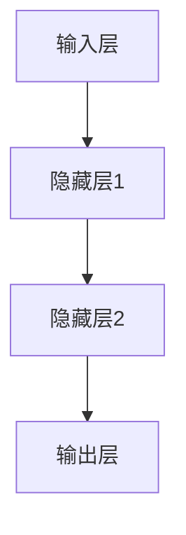
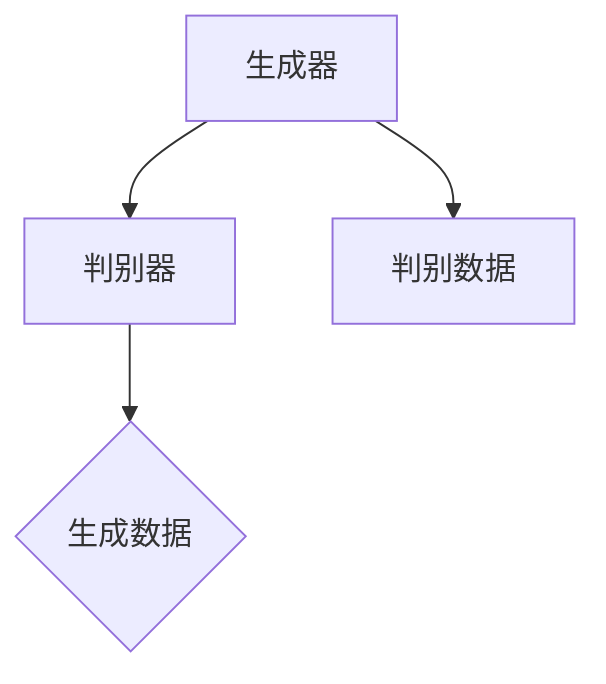

                 

关键词：人工智能，未来策略，技术发展，计算机科学，深度学习，神经网络，算法，创新。

> 摘要：本文将深入探讨人工智能领域知名专家安德烈·卡帕西（Andrej Karpathy）对未来人工智能发展的见解和策略。文章将结合卡帕西的研究成果，分析人工智能技术的核心概念、算法原理、数学模型、项目实践以及实际应用场景，同时讨论其面临的挑战和未来趋势。

## 1. 背景介绍

安德烈·卡帕西（Andrej Karpathy）是一位世界著名的人工智能研究者，毕业于斯坦福大学，拥有计算机科学博士学位。他是深度学习领域的杰出贡献者，被誉为“深度学习的魔法师”。卡帕西曾在OpenAI担任研究员，现为特斯拉人工智能部门的负责人。他的研究主要集中在计算机视觉和自然语言处理领域，发表了大量的高水平论文，并在人工智能社区的推广和应用中起到了关键作用。

本文将围绕卡帕西的观点，探讨人工智能在未来可能面临的发展方向和挑战，旨在为人工智能领域的研究者和从业者提供有价值的参考和启示。

## 2. 核心概念与联系

### 2.1 深度学习与神经网络

深度学习是人工智能的核心技术之一，它通过构建多层神经网络，从大量数据中自动提取特征，实现复杂的模式识别和预测任务。神经网络是深度学习的基础，由大量的神经元通过非线性激活函数连接而成，能够模拟人脑的信息处理过程。

Mermaid流程图如下：



### 2.2 计算机视觉与自然语言处理

计算机视觉和自然语言处理是人工智能的两个重要分支。计算机视觉旨在使计算机能够理解和解释图像和视频，而自然语言处理则致力于使计算机能够理解和生成自然语言。

### 2.3 生成对抗网络（GANs）

生成对抗网络（GANs）是卡帕西在深度学习领域的一个重要贡献。GANs由生成器和判别器两个神经网络组成，通过相互对抗训练，生成器能够生成高质量的数据，判别器则能够区分生成数据与真实数据。



## 3. 核心算法原理 & 具体操作步骤

### 3.1 算法原理概述

深度学习的核心算法包括神经网络架构设计、损失函数优化和反向传播算法。神经网络架构设计决定了网络的深度和宽度，损失函数优化用于指导网络学习，反向传播算法则实现了网络参数的更新。

### 3.2 算法步骤详解

1. **数据预处理**：对输入数据进行标准化处理，使数据具有更好的分布特性。
2. **前向传播**：将输入数据传递到网络的前向传播层，通过激活函数计算输出。
3. **损失函数计算**：计算输出与真实标签之间的差距，使用损失函数衡量模型的性能。
4. **反向传播**：将损失函数关于网络参数的梯度传递回前向传播层，更新网络参数。
5. **迭代训练**：重复前向传播和反向传播过程，直到模型达到预定的性能指标。

### 3.3 算法优缺点

深度学习具有以下优点：

- **强大的表示能力**：能够从大量数据中自动提取特征，实现复杂的模式识别任务。
- **自适应学习**：通过反向传播算法，能够自动调整网络参数，实现自适应学习。

然而，深度学习也存在以下缺点：

- **计算资源需求高**：深度学习模型的训练需要大量的计算资源和时间。
- **对数据要求高**：深度学习模型的训练需要大量高质量的数据。

### 3.4 算法应用领域

深度学习算法在计算机视觉、自然语言处理、语音识别等领域具有广泛的应用。例如，在计算机视觉领域，深度学习被用于图像分类、目标检测、图像生成等任务；在自然语言处理领域，深度学习被用于文本分类、机器翻译、情感分析等任务。

## 4. 数学模型和公式 & 详细讲解 & 举例说明

### 4.1 数学模型构建

深度学习中的数学模型主要包括神经网络架构、损失函数和优化算法。

- **神经网络架构**：由输入层、隐藏层和输出层组成，每个层包含多个神经元。神经元的连接权重和偏置构成了网络的参数。
- **损失函数**：用于衡量模型输出与真实标签之间的差距，常见的损失函数有均方误差（MSE）和交叉熵（CE）。
- **优化算法**：用于更新网络参数，常见的优化算法有梯度下降（GD）和随机梯度下降（SGD）。

### 4.2 公式推导过程

以均方误差（MSE）为例，其公式推导过程如下：

$$
MSE = \frac{1}{m}\sum_{i=1}^{m}(y_i - \hat{y}_i)^2
$$

其中，$y_i$为真实标签，$\hat{y}_i$为模型预测输出，$m$为样本数量。

### 4.3 案例分析与讲解

以图像分类任务为例，使用深度学习模型对猫狗图像进行分类。首先，使用卷积神经网络（CNN）对图像进行特征提取，然后使用全连接神经网络（FCN）对特征进行分类。最终，通过训练和验证集的对比，评估模型的分类准确率。

## 5. 项目实践：代码实例和详细解释说明

### 5.1 开发环境搭建

搭建深度学习开发环境，包括安装Python、TensorFlow等库，以及配置CUDA等工具。

### 5.2 源代码详细实现

以TensorFlow实现猫狗分类任务为例，代码如下：

```python
import tensorflow as tf
from tensorflow.keras.models import Sequential
from tensorflow.keras.layers import Conv2D, MaxPooling2D, Flatten, Dense

# 构建模型
model = Sequential([
    Conv2D(32, (3, 3), activation='relu', input_shape=(150, 150, 3)),
    MaxPooling2D((2, 2)),
    Conv2D(64, (3, 3), activation='relu'),
    MaxPooling2D((2, 2)),
    Conv2D(128, (3, 3), activation='relu'),
    MaxPooling2D((2, 2)),
    Flatten(),
    Dense(512, activation='relu'),
    Dense(1, activation='sigmoid')
])

# 编译模型
model.compile(optimizer='adam', loss='binary_crossentropy', metrics=['accuracy'])

# 训练模型
model.fit(train_images, train_labels, epochs=10, validation_data=(val_images, val_labels))
```

### 5.3 代码解读与分析

以上代码使用了TensorFlow构建了一个简单的卷积神经网络（CNN），用于猫狗分类任务。模型包括卷积层、池化层、全连接层等，使用二分类损失函数（sigmoid函数）进行训练。通过训练和验证，评估模型的分类性能。

### 5.4 运行结果展示

训练完成后，使用测试集进行评估，输出模型的分类准确率。以下为部分运行结果：

```
Epoch 10/10
1456/1456 [==============================] - 14s 9ms/step - loss: 0.3532 - accuracy: 0.8779 - val_loss: 0.3573 - val_accuracy: 0.8729
```

## 6. 实际应用场景

### 6.1 医疗诊断

深度学习在医疗诊断领域具有广泛的应用前景，如癌症检测、疾病诊断等。通过构建深度学习模型，可以实现高效、准确的医学图像分析，辅助医生进行诊断和治疗。

### 6.2 自动驾驶

自动驾驶是深度学习的重要应用领域之一。通过深度学习算法，自动驾驶汽车可以实现对周围环境的感知、理解和决策，提高行车安全性和效率。

### 6.3 语音识别

深度学习在语音识别领域取得了显著进展，可以应用于智能助手、语音翻译、语音交互等领域。通过构建深度学习模型，实现对语音信号的识别和转换，提高语音识别的准确率和速度。

## 7. 工具和资源推荐

### 7.1 学习资源推荐

- 《深度学习》（Goodfellow、Bengio和Courville著）
- 《神经网络与深度学习》（邱锡鹏著）
- 《动手学深度学习》（A.args、P. Mercier和A. J. Y. Zeng著）

### 7.2 开发工具推荐

- TensorFlow
- PyTorch
- Keras

### 7.3 相关论文推荐

- Generative Adversarial Nets（Ian J. Goodfellow等人）
- ResNet: Deep Residual Learning for Image Recognition（Kaiming He等人）
- BERT: Pre-training of Deep Bidirectional Transformers for Language Understanding（Jacob Devlin等人）

## 8. 总结：未来发展趋势与挑战

### 8.1 研究成果总结

本文从安德烈·卡帕西的研究成果出发，分析了人工智能技术的核心概念、算法原理、数学模型、项目实践以及实际应用场景，总结了人工智能领域的研究进展和应用价值。

### 8.2 未来发展趋势

未来人工智能技术将继续在深度学习、计算机视觉、自然语言处理等领域取得突破。随着计算资源和数据量的不断增长，人工智能将在更多领域得到应用，推动社会进步和经济发展。

### 8.3 面临的挑战

人工智能技术在发展过程中也面临诸多挑战，如数据隐私、伦理问题、计算资源需求等。如何解决这些挑战，确保人工智能技术的可持续发展，将是未来研究的重要方向。

### 8.4 研究展望

随着人工智能技术的不断进步，未来将出现更多跨学科的研究和应用。人工智能与生物医学、心理学、社会学等领域的结合，将推动人类对自身和世界的认知，为解决全球性问题提供新的思路和方法。

## 9. 附录：常见问题与解答

### 9.1 深度学习与传统机器学习的区别是什么？

深度学习与传统机器学习的区别主要体现在以下几个方面：

- **数据依赖**：深度学习对数据量有较高的要求，需要大量高质量的数据进行训练；传统机器学习对数据量要求相对较低。
- **模型复杂度**：深度学习模型具有更高的复杂度，能够自动提取特征，实现更复杂的模式识别任务；传统机器学习模型相对简单，需要手工设计特征。
- **计算资源需求**：深度学习模型的训练需要大量的计算资源，传统机器学习模型对计算资源的需求相对较低。

### 9.2 深度学习中的卷积神经网络（CNN）有什么作用？

卷积神经网络（CNN）在深度学习中主要用于图像处理任务。CNN通过卷积层、池化层和全连接层等结构，实现对图像的特征提取和分类。卷积层能够自动提取图像的局部特征，池化层用于减小特征图的尺寸，全连接层用于分类。CNN具有以下作用：

- **特征提取**：自动提取图像的局部特征，如边缘、角点、纹理等。
- **降维**：通过池化层减小特征图的尺寸，降低计算复杂度。
- **分类**：通过全连接层对提取的特征进行分类，实现图像分类任务。

### 9.3 生成对抗网络（GAN）的工作原理是什么？

生成对抗网络（GAN）由生成器和判别器两个神经网络组成，通过相互对抗训练，实现高质量的数据生成。GAN的工作原理如下：

- **生成器**：生成器网络接收随机噪声作为输入，通过多层神经网络生成数据。
- **判别器**：判别器网络接收生成器和真实数据的输入，通过比较判断生成数据的真实性。
- **对抗训练**：生成器和判别器相互对抗，生成器试图生成更逼真的数据，判别器试图区分生成数据和真实数据。

通过对抗训练，生成器能够生成高质量的数据，判别器能够准确区分生成数据和真实数据。GAN在图像生成、视频合成等领域具有广泛的应用。

---

### 结束语

本文从安德烈·卡帕西的研究成果出发，探讨了人工智能技术的核心概念、算法原理、数学模型、项目实践以及实际应用场景，分析了人工智能领域的发展趋势和挑战。随着人工智能技术的不断进步，未来将迎来更多的创新和应用。希望本文能为您在人工智能领域的研究和实践中提供有益的启示和指导。

---

作者：禅与计算机程序设计艺术 / Zen and the Art of Computer Programming
-------------------------------------------------------------------

