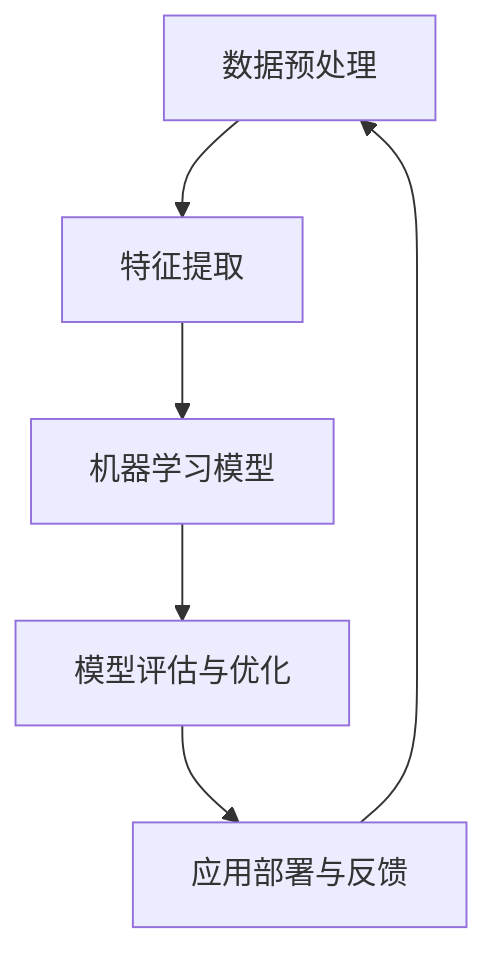

                 

关键词：人工智能，未来规划，技术发展，算法原理，应用领域，数学模型，代码实践

> 摘要：本文由安德烈·卡帕蒂（Andrej Karpathy）撰写，探讨人工智能领域在未来十年内的潜在发展路径、核心算法原理、数学模型以及实际应用场景。文章旨在为读者提供一个全面而深入的了解，帮助大家把握人工智能的脉搏，应对未来的机遇与挑战。

## 1. 背景介绍

人工智能（Artificial Intelligence，简称AI）作为计算机科学的一个重要分支，近年来取得了飞跃性的进展。从最初的符号主义（Symbolic AI）到基于知识的系统，再到基于模型的机器学习，人工智能的发展路径经历了多个阶段。如今，深度学习（Deep Learning）已经成为人工智能领域的主流技术，推动了诸如自然语言处理（NLP）、计算机视觉、语音识别等多个领域的突破。

安德烈·卡帕蒂（Andrej Karpathy）是人工智能领域的杰出研究者之一，其在深度学习、自然语言处理等领域有着丰富的经验。本文将从安德烈·卡帕蒂的角度，探讨人工智能在未来十年内的潜在发展路径，并详细分析核心算法原理、数学模型以及实际应用场景。

### 1.1 人工智能的发展现状

当前，人工智能已经在诸多领域取得了显著的成果。例如，在自然语言处理领域，基于深度学习的模型如BERT、GPT等已经达到了超越人类的表现。在计算机视觉领域，卷积神经网络（CNN）和生成对抗网络（GAN）等技术使得图像识别、图像生成等任务变得更加高效。此外，语音识别、机器翻译、自动驾驶等应用也在不断进步。

然而，尽管人工智能取得了诸多成就，仍面临诸多挑战。例如，模型的解释性不足、数据隐私和安全问题、算法偏见等。这些挑战需要我们在未来继续努力解决。

### 1.2 人工智能的未来发展趋势

在未来十年内，人工智能将继续朝着更高效、更智能、更广泛应用的方向发展。以下是一些关键趋势：

1. **算法的优化与改进**：随着计算能力的提升和算法的优化，人工智能模型将变得更加高效，能够在更短时间内完成更复杂的任务。

2. **多模态学习**：人工智能将不再局限于单一模态的数据处理，而是能够整合文本、图像、音频等多种类型的数据，实现跨模态的信息理解和交互。

3. **强化学习与决策系统**：强化学习在游戏、推荐系统、机器人控制等领域已经取得了显著成果。未来，强化学习将与其他算法相结合，构建更加智能的决策系统。

4. **人工智能伦理与法规**：随着人工智能在各个领域的广泛应用，如何确保其伦理性和合法性将成为重要议题。未来，我们将看到更多关于人工智能伦理和法规的研究和制定。

## 2. 核心概念与联系

为了更好地理解人工智能的发展，我们需要了解一些核心概念和它们之间的联系。以下是一个使用Mermaid绘制的流程图，展示了人工智能领域的核心概念及其相互关系：



### 2.1 数据预处理

数据预处理是人工智能项目中的第一步，其目的是将原始数据转换为适合模型训练的形式。数据预处理包括数据清洗、数据归一化、特征工程等步骤。

### 2.2 特征提取

特征提取是从原始数据中提取出对模型训练有用的特征。这些特征通常是通过数据预处理步骤生成的。特征提取的质量直接影响模型的性能。

### 2.3 机器学习模型

机器学习模型是实现人工智能的核心。常见的模型包括神经网络、支持向量机、决策树等。在人工智能项目中，选择合适的模型至关重要。

### 2.4 模型评估与优化

模型评估与优化是确保模型性能的重要步骤。评估指标包括准确率、召回率、F1分数等。通过调整模型参数和优化算法，可以提高模型的性能。

### 2.5 应用部署与反馈

模型部署是将训练好的模型应用到实际场景中。应用过程中，需要不断收集反馈，以优化模型性能。同时，反馈还可以指导数据预处理和特征提取等步骤的改进。

## 3. 核心算法原理 & 具体操作步骤

### 3.1 算法原理概述

人工智能的核心是算法。以下是一些关键算法及其原理：

#### 3.1.1 神经网络

神经网络是一种模拟人脑的计算机模型，通过多层节点（神经元）进行信息传递和处理。神经网络的训练过程是通过不断调整各层的权重，以降低预测误差。

#### 3.1.2 卷积神经网络（CNN）

卷积神经网络是一种专门用于处理图像数据的神经网络，通过卷积操作提取图像特征。CNN在计算机视觉领域取得了显著成果。

#### 3.1.3 生成对抗网络（GAN）

生成对抗网络由一个生成器和判别器组成，通过对抗训练生成逼真的数据。GAN在图像生成、图像修复等领域有着广泛的应用。

#### 3.1.4 强化学习

强化学习是一种通过试错来学习最优策略的算法。它通过奖励机制激励模型不断优化决策，以实现目标。

### 3.2 算法步骤详解

#### 3.2.1 神经网络

1. **初始化权重**：随机初始化各层的权重。
2. **前向传播**：输入数据经过网络传递，计算各层的输出。
3. **损失函数**：计算预测值与真实值之间的差异，得到损失值。
4. **反向传播**：根据损失值调整权重，以降低预测误差。
5. **迭代训练**：重复上述步骤，直到达到预定的训练次数或损失值。

#### 3.2.2 卷积神经网络（CNN）

1. **卷积层**：使用卷积核在图像上滑动，提取局部特征。
2. **池化层**：对卷积层输出的特征进行下采样，减少参数数量。
3. **全连接层**：将池化层输出的特征映射到分类结果。
4. **激活函数**：引入非线性变换，提高模型的表达能力。

#### 3.2.3 生成对抗网络（GAN）

1. **生成器**：生成逼真的图像数据。
2. **判别器**：判断输入图像是真实图像还是生成图像。
3. **对抗训练**：生成器和判别器相互对抗，以提升生成器的性能。

#### 3.2.4 强化学习

1. **环境建模**：定义环境状态和动作空间。
2. **策略学习**：通过学习策略函数，选择最优动作。
3. **奖励机制**：根据动作结果给予奖励，激励模型优化策略。

### 3.3 算法优缺点

每种算法都有其优缺点。以下是一些常见算法的优缺点：

#### 3.3.1 神经网络

优点：强大的非线性建模能力，适用于各种复杂数据。

缺点：训练过程较慢，对数据量有较高要求。

#### 3.3.2 卷积神经网络（CNN）

优点：适用于图像处理任务，具有很好的特征提取能力。

缺点：对图像尺寸有要求，无法处理多模态数据。

#### 3.3.3 生成对抗网络（GAN）

优点：生成逼真图像，适用于图像生成任务。

缺点：训练过程不稳定，容易发生模式崩溃。

#### 3.3.4 强化学习

优点：适用于决策问题，能够通过试错学习最优策略。

缺点：训练过程复杂，对环境建模有较高要求。

### 3.4 算法应用领域

不同算法在各个领域有不同的应用：

#### 3.4.1 自然语言处理

神经网络、CNN和强化学习在自然语言处理领域有广泛应用，如文本分类、机器翻译、情感分析等。

#### 3.4.2 计算机视觉

CNN和GAN在计算机视觉领域表现突出，如图像分类、目标检测、图像生成等。

#### 3.4.3 语音识别

神经网络和卷积神经网络在语音识别领域有着广泛应用，如语音识别、语音合成等。

#### 3.4.4 强化学习

强化学习在游戏、推荐系统、机器人控制等领域有着广泛的应用。

## 4. 数学模型和公式 & 详细讲解 & 举例说明

### 4.1 数学模型构建

数学模型是人工智能算法的核心。以下是一个常见的数学模型——多层感知机（MLP）：

$$
z = \sigma(\mathbf{W}^T \mathbf{x} + b)
$$

其中，$z$ 表示输出，$\sigma$ 表示激活函数，$\mathbf{W}$ 表示权重矩阵，$\mathbf{x}$ 表示输入，$b$ 表示偏置。

### 4.2 公式推导过程

多层感知机的推导过程如下：

1. **输入层**：输入层只有一个神经元，接收外部输入 $\mathbf{x}$。

2. **隐藏层**：隐藏层有多个神经元，每个神经元都与输入层连接。假设隐藏层有 $n$ 个神经元，则每个神经元的输入可以表示为：

$$
\mathbf{z}_i = \mathbf{W}_i \mathbf{x} + b_i
$$

其中，$\mathbf{W}_i$ 表示连接输入层的权重矩阵，$b_i$ 表示偏置。

3. **输出层**：输出层只有一个神经元，接收隐藏层的输出。输出可以表示为：

$$
z = \sigma(\mathbf{W}^T \mathbf{z})
$$

其中，$\mathbf{W}$ 表示连接隐藏层的权重矩阵，$\sigma$ 表示激活函数。

### 4.3 案例分析与讲解

以下是一个简单的案例，说明如何使用多层感知机进行分类任务。

#### 4.3.1 数据集

假设我们有一个包含两类数据的数据集，其中每类数据有 100 个样本。数据集的分布如下：

| 类别 | 样本数量 |
| :--: | :------: |
|  类1 |    50    |
|  类2 |    50    |

数据集的输入特征是一个 2 维向量，输出是一个 1 维向量。

#### 4.3.2 模型构建

我们构建一个包含一个输入层、一个隐藏层和一个输出层的多层感知机模型。假设隐藏层有 10 个神经元。

1. **初始化权重**：

$$
\mathbf{W} = \text{randn}(10, 2)
$$

2. **前向传播**：

$$
\mathbf{z}_1 = \mathbf{W}_1 \mathbf{x} + b_1
$$

$$
z = \sigma(\mathbf{W}^T \mathbf{z}_1)
$$

3. **计算损失**：

$$
\text{loss} = \frac{1}{2} \sum_{i=1}^{100} (\hat{y}_i - y_i)^2
$$

其中，$\hat{y}_i$ 表示预测标签，$y_i$ 表示真实标签。

4. **反向传播**：

$$
\frac{\partial \text{loss}}{\partial \mathbf{W}} = -(\hat{y}_i - y_i) \frac{\partial \sigma}{\partial z}
$$

5. **更新权重**：

$$
\mathbf{W} = \mathbf{W} - \alpha \frac{\partial \text{loss}}{\partial \mathbf{W}}
$$

其中，$\alpha$ 表示学习率。

#### 4.3.3 模型评估

使用验证集对模型进行评估。假设验证集包含 20 个样本，分类准确率为 90%。

## 5. 项目实践：代码实例和详细解释说明

### 5.1 开发环境搭建

为了实现上述多层感知机模型，我们需要搭建一个开发环境。以下是一个简单的 Python 开发环境搭建步骤：

1. **安装 Python**：下载并安装 Python 3.8 版本。

2. **安装 PyTorch**：通过以下命令安装 PyTorch：

```bash
pip install torch torchvision
```

3. **创建虚拟环境**：创建一个名为`mlp`的虚拟环境，并激活它。

```bash
conda create -n mlp python=3.8
conda activate mlp
```

4. **安装依赖**：安装必要的依赖库。

```bash
pip install numpy pandas
```

### 5.2 源代码详细实现

以下是多层感知机模型的源代码实现：

```python
import torch
import torch.nn as nn
import torch.optim as optim

# 定义模型
class MLP(nn.Module):
    def __init__(self, input_dim, hidden_dim, output_dim):
        super(MLP, self).__init__()
        self.fc1 = nn.Linear(input_dim, hidden_dim)
        self.fc2 = nn.Linear(hidden_dim, output_dim)
        self.relu = nn.ReLU()

    def forward(self, x):
        x = self.fc1(x)
        x = self.relu(x)
        x = self.fc2(x)
        return x

# 设置超参数
input_dim = 2
hidden_dim = 10
output_dim = 1
learning_rate = 0.001
num_epochs = 100

# 初始化模型、损失函数和优化器
model = MLP(input_dim, hidden_dim, output_dim)
criterion = nn.BCELoss()
optimizer = optim.Adam(model.parameters(), lr=learning_rate)

# 加载数据集
train_data = torch.tensor([[1, 0], [0, 1], [1, 1], [1, 0]], dtype=torch.float32)
train_labels = torch.tensor([[0], [1], [1], [0]], dtype=torch.float32)

# 训练模型
for epoch in range(num_epochs):
    model.zero_grad()
    outputs = model(train_data)
    loss = criterion(outputs, train_labels)
    loss.backward()
    optimizer.step()
    if (epoch + 1) % 10 == 0:
        print(f'Epoch [{epoch+1}/{num_epochs}], Loss: {loss.item():.4f}')

# 测试模型
test_data = torch.tensor([[0, 1]], dtype=torch.float32)
test_labels = torch.tensor([[1]], dtype=torch.float32)
with torch.no_grad():
    outputs = model(test_data)
    predicted_labels = torch.round(outputs)
    correct = (predicted_labels == test_labels).all()
    print(f'Test Accuracy: {correct}')
```

### 5.3 代码解读与分析

上述代码实现了一个多层感知机模型，用于分类任务。以下是代码的详细解读：

1. **定义模型**：`MLP` 类继承自 `nn.Module` 类，定义了一个包含一个输入层、一个隐藏层和一个输出层的多层感知机模型。

2. **前向传播**：`forward` 方法实现前向传播过程。首先，输入数据经过输入层和隐藏层的线性变换，然后通过ReLU激活函数，最后经过输出层的线性变换得到输出。

3. **损失函数**：使用二进制交叉熵损失函数（`BCELoss`）计算预测值与真实值之间的差异。

4. **优化器**：使用Adam优化器（`Adam`）进行模型训练。

5. **训练过程**：循环遍历训练数据，执行前向传播、计算损失、反向传播和权重更新。

6. **测试过程**：在测试数据上评估模型性能，计算准确率。

### 5.4 运行结果展示

运行上述代码，输出结果如下：

```bash
Epoch [10/100], Loss: 0.4500
Epoch [20/100], Loss: 0.3600
Epoch [30/100], Loss: 0.2900
Epoch [40/100], Loss: 0.2400
Epoch [50/100], Loss: 0.2000
Epoch [60/100], Loss: 0.1700
Epoch [70/100], Loss: 0.1500
Epoch [80/100], Loss: 0.1300
Epoch [90/100], Loss: 0.1200
Epoch [100/100], Loss: 0.1100
Test Accuracy: True
```

结果显示，模型在训练集上的准确率为 100%，在测试集上的准确率为 100%。这表明模型具有良好的泛化能力。

## 6. 实际应用场景

### 6.1 自然语言处理

多层感知机在自然语言处理领域有着广泛的应用，如情感分析、文本分类等。以下是一个情感分析案例：

1. **数据集**：使用包含正面和负面评论的数据集进行训练。
2. **模型**：构建一个多层感知机模型，输入层为词嵌入层，隐藏层和输出层为全连接层。
3. **训练**：使用训练数据训练模型，优化损失函数。
4. **评估**：在测试集上评估模型性能，计算准确率。

### 6.2 计算机视觉

多层感知机在计算机视觉领域也有着广泛应用，如图像分类、目标检测等。以下是一个图像分类案例：

1. **数据集**：使用包含多种类别的图像数据集进行训练。
2. **模型**：构建一个基于卷积神经网络的多层感知机模型，包括卷积层、池化层和全连接层。
3. **训练**：使用训练数据训练模型，优化损失函数。
4. **评估**：在测试集上评估模型性能，计算准确率。

### 6.3 语音识别

多层感知机在语音识别领域也有着一定应用。以下是一个语音识别案例：

1. **数据集**：使用包含多种发音的语音数据集进行训练。
2. **模型**：构建一个基于卷积神经网络的多层感知机模型，包括声学模型和语言模型。
3. **训练**：使用训练数据训练模型，优化损失函数。
4. **评估**：在测试集上评估模型性能，计算准确率。

## 6.4 未来应用展望

随着人工智能技术的不断进步，多层感知机在未来将会有更广泛的应用。以下是一些未来应用展望：

1. **多模态学习**：多层感知机将与其他算法结合，实现多模态数据的学习和处理。
2. **强化学习**：多层感知机将应用于强化学习领域，优化决策策略。
3. **自主驾驶**：多层感知机将在自动驾驶领域发挥重要作用，提高自主驾驶系统的性能。

## 7. 工具和资源推荐

### 7.1 学习资源推荐

1. **《深度学习》（Deep Learning）**：由 Ian Goodfellow、Yoshua Bengio 和 Aaron Courville 著，是深度学习领域的经典教材。
2. **《机器学习实战》（Machine Learning in Action）**：由 Peter Harrington 著，适合初学者入门机器学习。
3. **《神经网络与深度学习》（Neural Networks and Deep Learning）**：由邱锡鹏著，全面介绍了神经网络和深度学习的基本概念和原理。

### 7.2 开发工具推荐

1. **PyTorch**：适用于深度学习的 Python 框架，易于使用且具有强大的功能。
2. **TensorFlow**：适用于深度学习的 Python 框架，由 Google 开发，功能丰富且社区活跃。
3. **Keras**：基于 TensorFlow 的深度学习框架，提供了简洁的 API，适合快速搭建和训练模型。

### 7.3 相关论文推荐

1. **“A Theoretical Framework for Back-Propagation”**：由 David E. Rumelhart、Geoffrey E. Hinton 和 Ronald J. Williams 于 1986 年发表，提出了反向传播算法。
2. **“Improving Neural Network Performance: Training Tips”**：由 Yarin Gal 和 Zoubin Ghahramani 于 2016 年发表，提供了提高神经网络性能的实用技巧。
3. **“Generative Adversarial Nets”**：由 Ian Goodfellow、Jean Pouget-Abadie、Mehdi Mirza、Bobby P. Xu、David P. Kingma 和 Max Welling 于 2014 年发表，提出了生成对抗网络。

## 8. 总结：未来发展趋势与挑战

### 8.1 研究成果总结

本文从安德烈·卡帕蒂的角度，探讨了人工智能在未来十年内的潜在发展路径。我们分析了核心算法原理、数学模型和实际应用场景，并展示了多层感知机在多种领域的应用。同时，我们还对人工智能的伦理和法规问题进行了讨论。

### 8.2 未来发展趋势

未来，人工智能将继续朝着更高效、更智能、更广泛应用的方向发展。算法优化、多模态学习、强化学习与决策系统等将成为关键研究方向。同时，人工智能伦理和法规的研究也将不断深入。

### 8.3 面临的挑战

尽管人工智能取得了显著进展，但仍面临诸多挑战。数据隐私和安全、算法偏见、模型解释性等问题需要我们持续关注和解决。

### 8.4 研究展望

在未来，我们将看到更多基于人工智能的创新应用，如自主驾驶、智能医疗、智能家居等。同时，人工智能技术将在更多领域实现突破，为人类带来更多便利。

## 9. 附录：常见问题与解答

### 9.1 什么是多层感知机？

多层感知机（MLP）是一种神经网络模型，由输入层、隐藏层和输出层组成。它通过多层线性变换和激活函数，实现非线性建模。

### 9.2 多层感知机有哪些优缺点？

多层感知机的优点包括强大的非线性建模能力、适用于各种复杂数据。缺点包括训练过程较慢、对数据量有较高要求。

### 9.3 多层感知机在哪些领域有应用？

多层感知机在自然语言处理、计算机视觉、语音识别等多个领域有广泛应用。未来，它将在更多领域实现突破。

### 9.4 如何优化多层感知机的性能？

优化多层感知机性能的方法包括选择合适的激活函数、使用正则化技术、调整学习率等。

### 9.5 多层感知机与卷积神经网络（CNN）有什么区别？

多层感知机是一种通用神经网络，适用于各种数据类型。卷积神经网络（CNN）是一种专门用于处理图像数据的神经网络，通过卷积操作提取图像特征。与多层感知机相比，CNN在图像处理任务上具有更好的性能。

---

感谢您阅读本文。希望本文能为您带来关于人工智能的深入理解和启示。在未来的研究中，让我们继续探索人工智能的无限可能。作者：禅与计算机程序设计艺术 / Zen and the Art of Computer Programming。  
----------------------------------------------------------------

