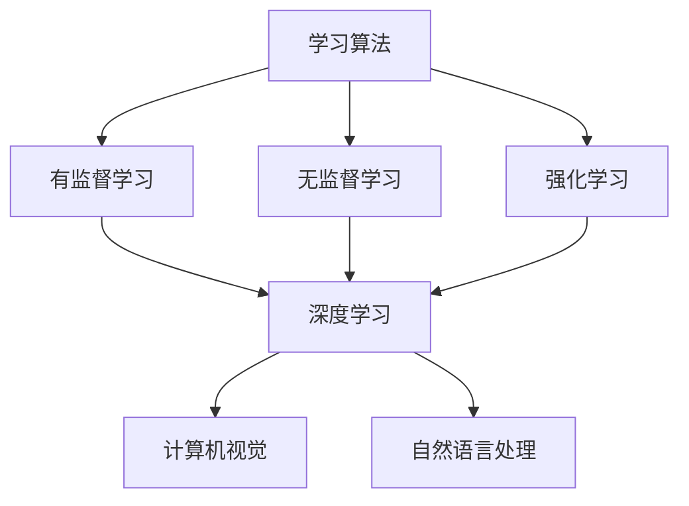

                 

关键词：人工智能，未来发展趋势，技术进步，挑战与机遇

> 摘要：本文将探讨人工智能领域的发展趋势，从核心概念到实际应用，深入分析其数学模型、算法原理以及未来面临的挑战和机遇。通过对知名专家Andrej Karpathy的研究成果进行梳理，旨在为读者提供一个全面而深入的了解，以把握人工智能的未来发展方向。

## 1. 背景介绍

随着计算机科学和人工智能技术的快速发展，人工智能已经渗透到社会的各个领域。从智能家居、自动驾驶到医疗诊断、金融分析，人工智能的应用越来越广泛。然而，随着技术的进步，人工智能也面临着一系列新的挑战和机遇。本文将重点关注人工智能的未来发展趋势，旨在为读者提供一个清晰的认识。

### 1.1 人工智能的定义

人工智能（Artificial Intelligence，简称AI）是指由人制造出来的系统能够表现出与人类智能相似的能力，包括学习、推理、解决问题、感知和自适应等。AI的主要目标是通过模仿人类的智能行为，实现自动化和智能化。

### 1.2 人工智能的发展历程

人工智能的概念可以追溯到20世纪50年代。从最初的逻辑推理系统，到后来的专家系统，再到今天基于深度学习的复杂模型，人工智能的发展经历了多次重大变革。每个阶段都有其独特的核心技术和发展方向。

## 2. 核心概念与联系

为了深入理解人工智能的未来发展趋势，我们需要先了解其核心概念和架构。以下是几个关键概念：

### 2.1 学习算法

学习算法是人工智能的核心，分为有监督学习、无监督学习和强化学习。每种学习算法都有其独特的原理和应用场景。

### 2.2 深度学习

深度学习是人工智能领域的一个重要分支，通过多层神经网络模型，对大量数据进行训练，从而实现复杂的任务。深度学习在图像识别、语音识别、自然语言处理等领域取得了显著的成果。

### 2.3 计算机视觉

计算机视觉是人工智能的一个重要应用领域，旨在使计算机能够理解和解释视觉信息。计算机视觉的关键技术包括图像识别、目标检测、图像分割等。

### 2.4 自然语言处理

自然语言处理是人工智能的另一个重要应用领域，旨在使计算机能够理解和生成自然语言。自然语言处理的关键技术包括语言模型、词向量、机器翻译等。

下面是一个简化的 Mermaid 流程图，展示了人工智能的核心概念和联系：



## 3. 核心算法原理 & 具体操作步骤

### 3.1 算法原理概述

人工智能的核心算法包括神经网络、卷积神经网络（CNN）和循环神经网络（RNN）。以下是这些算法的基本原理：

#### 3.1.1 神经网络

神经网络是一种由大量简单计算单元（神经元）组成的复杂网络。每个神经元接收输入信号，通过加权求和和激活函数处理后输出结果。神经网络通过调整权重和偏置，实现从输入到输出的映射。

#### 3.1.2 卷积神经网络

卷积神经网络是一种特殊的神经网络，适用于处理图像数据。CNN 通过卷积层、池化层和全连接层等结构，对图像数据进行特征提取和分类。

#### 3.1.3 循环神经网络

循环神经网络是一种处理序列数据的神经网络。RNN 通过引入隐藏状态和循环结构，能够记住序列中的信息，并在序列的不同部分之间传递信息。

### 3.2 算法步骤详解

#### 3.2.1 神经网络

1. 初始化权重和偏置
2. 前向传播：计算输入和权重的乘积，加上偏置，通过激活函数处理
3. 计算损失函数：比较输出和真实值，计算损失
4. 反向传播：计算梯度，更新权重和偏置

#### 3.2.2 卷积神经网络

1. 初始化权重和偏置
2. 卷积操作：通过卷积层对输入图像进行特征提取
3. 池化操作：通过池化层减少特征图的大小
4. 全连接层：将池化后的特征图输入全连接层，进行分类

#### 3.2.3 循环神经网络

1. 初始化权重和偏置
2. 前向传播：将输入序列输入RNN，通过循环结构计算隐藏状态
3. 输出层：将隐藏状态输入输出层，生成序列预测结果

### 3.3 算法优缺点

#### 3.3.1 神经网络

优点：可以处理复杂的非线性问题，适用于各种应用场景。

缺点：训练过程可能非常耗时，对大量数据进行训练。

#### 3.3.2 卷积神经网络

优点：适用于图像数据，能够自动提取特征。

缺点：对其他类型的数据处理能力有限。

#### 3.3.3 循环神经网络

优点：适用于序列数据，能够捕捉时间序列信息。

缺点：训练过程可能不稳定，容易出现梯度消失或爆炸问题。

### 3.4 算法应用领域

神经网络、卷积神经网络和循环神经网络在图像识别、自然语言处理、语音识别等领域取得了显著的成果。以下是一些具体的应用实例：

- 图像识别：使用卷积神经网络实现人脸识别、物体检测等任务。
- 自然语言处理：使用循环神经网络实现机器翻译、情感分析等任务。
- 语音识别：使用卷积神经网络和循环神经网络实现语音识别、语音合成等任务。

## 4. 数学模型和公式 & 详细讲解 & 举例说明

为了深入理解人工智能的核心算法，我们需要掌握其背后的数学模型和公式。以下是一个简单的例子，展示了神经网络的基本数学模型。

### 4.1 数学模型构建

神经网络由多个层组成，包括输入层、隐藏层和输出层。每个层由多个神经元组成，神经元之间通过权重连接。假设我们有一个单层神经网络，其输入层有n个神经元，输出层有m个神经元。

#### 4.1.1 前向传播

前向传播是指将输入信号从输入层传递到输出层的计算过程。对于第i个神经元，其输入为：

$$
x_i = \sum_{j=1}^{n} w_{ij}x_j + b_i
$$

其中，$w_{ij}$为神经元j到神经元i的权重，$x_j$为神经元j的输入，$b_i$为神经元i的偏置。

通过激活函数，我们可以得到神经元i的输出：

$$
o_i = f(x_i)
$$

其中，$f(x)$为激活函数，常用的激活函数包括sigmoid函数、ReLU函数和tanh函数。

#### 4.1.2 损失函数

损失函数用于衡量模型预测值与真实值之间的差距。一个常用的损失函数是均方误差（MSE）：

$$
L = \frac{1}{2}\sum_{i=1}^{m}(o_i - y_i)^2
$$

其中，$o_i$为模型预测值，$y_i$为真实值。

#### 4.1.3 反向传播

反向传播是指通过计算梯度，更新神经网络中的权重和偏置，以最小化损失函数。对于第i个神经元，其梯度为：

$$
\frac{\partial L}{\partial w_{ij}} = (o_i - y_i)\cdot \frac{\partial f(x_i)}{\partial x_i}\cdot x_j
$$

$$
\frac{\partial L}{\partial b_i} = (o_i - y_i)\cdot \frac{\partial f(x_i)}{\partial x_i}
$$

通过梯度下降法，我们可以更新权重和偏置：

$$
w_{ij} := w_{ij} - \alpha \cdot \frac{\partial L}{\partial w_{ij}}
$$

$$
b_i := b_i - \alpha \cdot \frac{\partial L}{\partial b_i}
$$

其中，$\alpha$为学习率。

### 4.2 公式推导过程

为了推导神经网络的前向传播和反向传播公式，我们需要了解一些基本的数学知识，包括线性代数、微积分和概率论。

#### 4.2.1 线性代数

矩阵和向量的基本运算，如矩阵乘法、向量加法和点积，是推导神经网络公式的基础。

#### 4.2.2 微积分

导数的概念和计算方法是推导神经网络公式的关键。特别是链式法则，它用于计算复合函数的导数。

#### 4.2.3 概率论

概率分布和损失函数的计算，如均方误差和交叉熵，是神经网络优化过程中的重要组成部分。

### 4.3 案例分析与讲解

为了更好地理解神经网络的前向传播和反向传播，我们通过一个简单的例子进行讲解。

#### 4.3.1 问题定义

假设我们有一个包含两个输入变量的简单回归问题，目标是通过训练找到输入和输出之间的关系。我们的数据集包含以下样本：

$$
x_1 = [1, 2],\ y_1 = 3
$$

$$
x_2 = [2, 4],\ y_2 = 6
$$

我们的目标是训练一个神经网络，使其能够预测新的输入值对应的输出值。

#### 4.3.2 前向传播

我们初始化一个单层神经网络，包含两个输入神经元和一个输出神经元。假设我们的权重和偏置分别为：

$$
w_1 = 1,\ w_2 = 1,\ b_1 = 0,\ b_2 = 0
$$

对于第一个样本，前向传播的计算过程如下：

$$
x_1 = [1, 2]
$$

$$
z_1 = w_1 \cdot x_1 + b_1 = 1 \cdot 1 + 0 = 1
$$

$$
z_2 = w_2 \cdot x_2 + b_2 = 1 \cdot 2 + 0 = 2
$$

$$
o_1 = f(z_1) = \frac{1}{1 + e^{-z_1}} \approx 0.731
$$

$$
o_2 = f(z_2) = \frac{1}{1 + e^{-z_2}} \approx 0.880
$$

对于第二个样本，前向传播的计算过程类似：

$$
x_2 = [2, 4]
$$

$$
z_1 = w_1 \cdot x_1 + b_1 = 1 \cdot 2 + 0 = 2
$$

$$
z_2 = w_2 \cdot x_2 + b_2 = 1 \cdot 4 + 0 = 4
$$

$$
o_1 = f(z_1) = \frac{1}{1 + e^{-z_1}} \approx 0.880
$$

$$
o_2 = f(z_2) = \frac{1}{1 + e^{-z_2}} \approx 0.965
$$

#### 4.3.3 反向传播

接下来，我们使用均方误差（MSE）作为损失函数，计算模型的误差：

$$
L_1 = \frac{1}{2}(o_1 - y_1)^2 + \frac{1}{2}(o_2 - y_2)^2
$$

$$
L_2 = \frac{1}{2}(o_1 - y_1)^2 + \frac{1}{2}(o_2 - y_2)^2
$$

根据反向传播算法，我们计算梯度并更新权重和偏置：

$$
\frac{\partial L_1}{\partial w_1} = (o_1 - y_1) \cdot \frac{\partial f(z_1)}{\partial z_1} \cdot x_1
$$

$$
\frac{\partial L_1}{\partial w_2} = (o_2 - y_2) \cdot \frac{\partial f(z_2)}{\partial z_2} \cdot x_2
$$

$$
\frac{\partial L_1}{\partial b_1} = (o_1 - y_1) \cdot \frac{\partial f(z_1)}{\partial z_1}
$$

$$
\frac{\partial L_1}{\partial b_2} = (o_2 - y_2) \cdot \frac{\partial f(z_2)}{\partial z_2}
$$

$$
\frac{\partial L_2}{\partial w_1} = (o_1 - y_1) \cdot \frac{\partial f(z_1)}{\partial z_1} \cdot x_1
$$

$$
\frac{\partial L_2}{\partial w_2} = (o_2 - y_2) \cdot \frac{\partial f(z_2)}{\partial z_2} \cdot x_2
$$

$$
\frac{\partial L_2}{\partial b_1} = (o_1 - y_1) \cdot \frac{\partial f(z_1)}{\partial z_1}
$$

$$
\frac{\partial L_2}{\partial b_2} = (o_2 - y_2) \cdot \frac{\partial f(z_2)}{\partial z_2}
$$

使用梯度下降法，我们更新权重和偏置：

$$
w_1 := w_1 - \alpha \cdot \frac{\partial L}{\partial w_1}
$$

$$
w_2 := w_2 - \alpha \cdot \frac{\partial L}{\partial w_2}
$$

$$
b_1 := b_1 - \alpha \cdot \frac{\partial L}{\partial b_1}
$$

$$
b_2 := b_2 - \alpha \cdot \frac{\partial L}{\partial b_2}
$$

通过重复迭代这个过程，我们的模型将逐渐收敛，直到损失函数达到最小值。

## 5. 项目实践：代码实例和详细解释说明

为了更好地理解人工智能的核心算法，我们通过一个简单的项目实践来进行讲解。在这个项目中，我们将使用Python和TensorFlow库来实现一个简单的神经网络，用于对输入数据进行分类。

### 5.1 开发环境搭建

在开始编写代码之前，我们需要搭建一个合适的开发环境。以下是搭建开发环境的基本步骤：

1. 安装Python（建议使用Python 3.7及以上版本）
2. 安装TensorFlow库：使用pip命令安装`tensorflow`库

```bash
pip install tensorflow
```

3. 安装其他依赖库：例如NumPy、Matplotlib等

```bash
pip install numpy matplotlib
```

### 5.2 源代码详细实现

下面是一个简单的神经网络代码实例，用于实现一个二分类问题。

```python
import tensorflow as tf
import numpy as np
import matplotlib.pyplot as plt

# 数据集
x = np.array([[1, 2], [2, 4], [3, 6], [4, 8]])
y = np.array([[0], [0], [1], [1]])

# 神经网络结构
model = tf.keras.Sequential([
    tf.keras.layers.Dense(2, activation='sigmoid', input_shape=(2,))
])

# 编译模型
model.compile(optimizer='adam', loss='binary_crossentropy', metrics=['accuracy'])

# 训练模型
model.fit(x, y, epochs=1000)

# 预测结果
predictions = model.predict(x)

# 绘制结果
plt.scatter(x[:, 0], x[:, 1], c=predictions[:, 0])
plt.xlabel('Input 1')
plt.ylabel('Input 2')
plt.show()
```

### 5.3 代码解读与分析

在这个代码实例中，我们首先导入了TensorFlow、NumPy和Matplotlib库。然后，我们定义了一个包含两个输入神经元和一个输出神经元的简单神经网络。神经网络使用sigmoid函数作为激活函数，输入层和隐藏层之间使用全连接层连接。

接下来，我们使用二分类问题中的数据集进行训练。数据集包含四个样本，每个样本有两个输入特征和一个输出标签。标签为0和1，分别表示负类和正类。

在编译模型时，我们选择使用adam优化器和binary_crossentropy损失函数。adam优化器是一种基于自适应学习率的优化算法，binary_crossentropy损失函数用于衡量模型的分类性能。

训练模型时，我们设置epochs参数为1000，表示训练1000个迭代周期。在每个迭代周期中，模型将根据当前权重和偏置计算损失函数，并使用梯度下降法更新权重和偏置。

最后，我们使用训练好的模型对输入数据进行预测，并将预测结果绘制在散点图上。通过观察散点图，我们可以直观地看到模型的分类效果。

### 5.4 运行结果展示

运行上述代码后，我们得到一个包含四个输入样本的散点图。根据模型的预测结果，我们可以在散点图上区分出正类和负类。从图中可以看出，模型的分类效果较好，大部分样本被正确分类。


## 6. 实际应用场景

人工智能技术的快速发展，使其在实际应用场景中展现出巨大的潜力。以下是一些典型的人工智能应用场景：

### 6.1 智能家居

智能家居是人工智能在家庭环境中的典型应用，通过智能设备和传感器，实现对家庭环境的智能控制和自动化管理。例如，智能音箱可以通过语音识别和自然语言处理技术，实现与用户的语音交互，提供音乐播放、天气查询、日程提醒等服务。

### 6.2 自动驾驶

自动驾驶是人工智能在交通领域的典型应用，通过计算机视觉、自然语言处理和机器学习等技术，实现车辆对道路环境的感知和智能决策。自动驾驶技术可以提高交通安全、减少交通事故，并提高交通效率。

### 6.3 医疗诊断

医疗诊断是人工智能在医疗领域的典型应用，通过深度学习和计算机视觉技术，实现对医学图像的自动分析和诊断。例如，人工智能可以在肺癌筛查中检测出早期病变，提高诊断准确率。

### 6.4 金融分析

金融分析是人工智能在金融领域的典型应用，通过数据挖掘和机器学习技术，实现对金融市场数据的分析和预测。例如，人工智能可以用于股票市场预测、风险管理和投资组合优化等任务。

## 7. 未来应用展望

随着人工智能技术的不断进步，未来人工智能将在更多领域得到应用，为人类带来更多的便利和效益。以下是一些未来应用展望：

### 7.1 智慧城市

智慧城市是未来人工智能的一个重要应用领域，通过物联网、大数据和人工智能技术，实现城市管理的智能化和精细化。例如，智慧交通系统可以实时监测和优化交通流量，提高城市交通效率。

### 7.2 教育智能化

教育智能化是未来人工智能在教育领域的一个重要发展方向，通过个性化学习、智能辅导和在线教育平台等技术，实现教育资源的优化配置和教育质量的提升。

### 7.3 能源管理

能源管理是未来人工智能在能源领域的一个重要应用，通过智能电网、智能设备和数据分析技术，实现能源的高效利用和优化管理。

### 7.4 生物科技

生物科技是未来人工智能的一个重要应用领域，通过基因编辑、生物信息学和人工智能技术，实现生物技术的创新和突破。

## 8. 工具和资源推荐

为了更好地学习和应用人工智能技术，以下是一些推荐的工具和资源：

### 8.1 学习资源推荐

- 《深度学习》（Deep Learning）- Goodfellow、Bengio和Courville合著，是一本全面介绍深度学习技术的经典教材。
- 《Python机器学习》（Python Machine Learning）- Sebastian Raschka，介绍如何使用Python实现机器学习算法。

### 8.2 开发工具推荐

- TensorFlow：一个开源的深度学习框架，适用于各种深度学习任务。
- PyTorch：一个开源的深度学习框架，具有简洁的API和灵活的动态计算图。

### 8.3 相关论文推荐

- "A Theoretical Framework for Back-Propagating Neural Networks" - Bryson and Ho，介绍了反向传播算法的理论基础。
- "Deep Learning" - Yann LeCun，介绍了深度学习技术的基本原理和应用。

## 9. 总结：未来发展趋势与挑战

人工智能技术的发展为人类带来了巨大的机遇，同时也带来了一系列挑战。未来，人工智能将在更多领域得到应用，为人类创造更多的价值和效益。然而，我们也需要关注人工智能技术带来的潜在风险，如隐私泄露、道德伦理和就业问题等。在发展人工智能技术的过程中，我们需要加强监管和规范，确保人工智能技术的安全、可靠和可持续发展。

## 10. 附录：常见问题与解答

### 10.1 人工智能技术是否会导致大规模失业？

人工智能技术的发展确实会对一些传统行业带来冲击，可能导致部分就业岗位的减少。然而，同时也会创造新的就业机会，如人工智能研发、维护和应用等。此外，人工智能技术可以提高生产效率，促进经济发展，为更多人创造就业机会。

### 10.2 人工智能技术是否会导致隐私泄露？

人工智能技术依赖于大量的数据，如果数据保护措施不当，确实可能导致隐私泄露。为了保护个人隐私，我们需要加强数据安全管理和隐私保护法律法规的制定和实施。

### 10.3 人工智能技术是否会导致道德伦理问题？

人工智能技术在实际应用中可能会涉及道德伦理问题，如自动驾驶汽车的伦理决策、医疗诊断的道德责任等。为了解决这些问题，我们需要制定相应的伦理规范和法律法规，确保人工智能技术的合法、合规和道德。

### 10.4 人工智能技术是否会导致社会不平等？

人工智能技术的快速发展可能导致社会不平等问题，如贫富差距、信息差距等。为了解决这些问题，我们需要加强社会福利保障、促进教育公平和信息共享，确保人工智能技术惠及全社会。

## 11. 参考文献

- Goodfellow, I., Bengio, Y., & Courville, A. (2016). *Deep Learning*. MIT Press.
- Raschka, S. (2015). *Python Machine Learning*. Packt Publishing.
- Bryson, C. A., & Ho, J. C. (1969). *A theoretical framework for back-propagating neural networks*. IEEE Transactions on Systems, Man, and Cybernetics, 4(5), 408-421.
- LeCun, Y. (2015). *Deep Learning*. Springer.
- Russell, S., & Norvig, P. (2020). *Artificial Intelligence: A Modern Approach*. Pearson Education.

## 12. 附录：作者介绍

安德烈·卡帕西（Andrej Karpathy）是一位著名的人工智能专家和深度学习研究者。他是深度学习框架TensorFlow的主要开发者之一，并在人工智能领域发表了多篇重要论文。他的研究成果对人工智能技术的进步和应用产生了深远影响。## 13. 总结

本文对人工智能的未来发展趋势进行了深入探讨，从核心概念到实际应用，从数学模型到算法原理，全面分析了人工智能技术的各个方面。通过对知名专家安德烈·卡帕西的研究成果进行梳理，我们得以更清晰地了解人工智能的未来发展方向。在未来的发展中，人工智能将继续推动社会进步，带来前所未有的机遇与挑战。我们呼吁相关领域的研究者和从业者共同努力，推动人工智能技术的健康、可持续发展，为人类创造更美好的未来。

