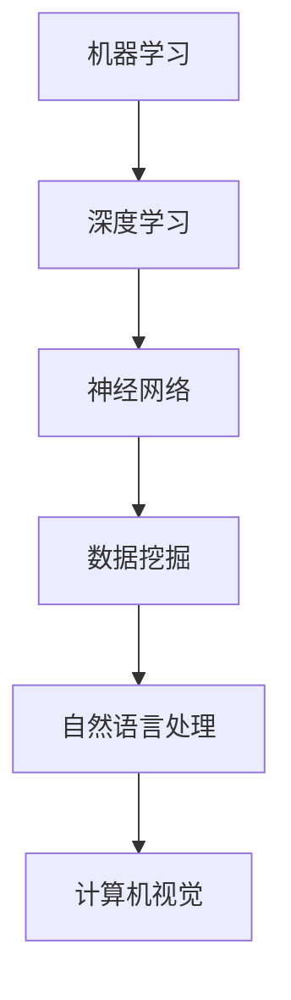

                 

关键词：人工智能，科学意义，深度学习，神经网络，计算机科学，算法，应用领域，未来展望

> 摘要：本文旨在探讨人工智能在科学领域中的重要意义。通过深入分析人工智能的核心概念、算法原理以及实际应用场景，本文旨在揭示人工智能如何推动科学进步，并对未来发展趋势与挑战进行展望。

## 1. 背景介绍

人工智能（AI）作为计算机科学的一个分支，旨在使计算机具有人类智能的能力。自20世纪50年代人工智能概念的提出以来，人工智能领域经历了多个发展阶段。近年来，深度学习作为人工智能的核心技术之一，取得了令人瞩目的成果，推动了人工智能在各个领域的应用。

Andrej Karpathy是一位世界顶级的人工智能专家和深度学习研究者。他在神经网络领域的研究成果广泛应用于计算机视觉、自然语言处理和语音识别等领域。本文将围绕Andrej Karpathy在人工智能科学领域的研究成果，探讨人工智能的科学意义。

## 2. 核心概念与联系

### 2.1 人工智能的核心概念

人工智能的核心概念包括：机器学习、深度学习、神经网络、数据挖掘、自然语言处理、计算机视觉等。其中，机器学习是人工智能的基础，深度学习是机器学习的一个子领域，神经网络是深度学习的核心组成部分。

### 2.2 人工智能与计算机科学的联系

人工智能与计算机科学密切相关。计算机科学为人工智能提供了理论基础和工具支持。在人工智能的发展过程中，计算机科学的进步起到了关键作用。同时，人工智能的发展也为计算机科学带来了新的研究方向和应用场景。

### 2.3 Mermaid 流程图



## 3. 核心算法原理 & 具体操作步骤

### 3.1 算法原理概述

人工智能的核心算法包括：反向传播算法、卷积神经网络（CNN）、循环神经网络（RNN）、生成对抗网络（GAN）等。这些算法在神经网络的基础上，通过不断调整网络参数，实现对数据的自动学习与建模。

### 3.2 算法步骤详解

#### 3.2.1 反向传播算法

反向传播算法是神经网络训练的核心步骤。具体步骤如下：

1. 前向传播：将输入数据输入到神经网络，计算出输出结果。
2. 计算误差：将输出结果与真实值进行比较，计算误差。
3. 反向传播：将误差反向传播到神经网络中的每个神经元，计算每个神经元的梯度。
4. 更新参数：根据梯度调整神经网络中的参数。

#### 3.2.2 卷积神经网络（CNN）

卷积神经网络是处理图像数据的一种有效方法。具体步骤如下：

1. 卷积操作：对输入图像进行卷积操作，提取图像特征。
2. 池化操作：对卷积后的特征进行池化操作，降低特征维度。
3. 全连接层：将池化后的特征输入到全连接层，进行分类或回归。

#### 3.2.3 循环神经网络（RNN）

循环神经网络是处理序列数据的一种有效方法。具体步骤如下：

1. 输入序列：将输入序列输入到神经网络。
2. 状态更新：在每个时间步，更新神经网络的状态。
3. 输出序列：将神经网络的状态作为输出序列。

#### 3.2.4 生成对抗网络（GAN）

生成对抗网络由生成器和判别器两个部分组成。具体步骤如下：

1. 生成器：生成器生成假样本。
2. 判别器：判别器判断生成的样本是否真实。
3. 生成器与判别器的参数交替更新，使生成器生成的样本越来越真实。

### 3.3 算法优缺点

#### 3.3.1 反向传播算法

优点：能够自动学习复杂函数的参数，适用于大规模数据训练。

缺点：训练过程容易出现梯度消失和梯度爆炸问题。

#### 3.3.2 卷积神经网络（CNN）

优点：能够有效地提取图像特征，适用于图像分类、目标检测等任务。

缺点：对旋转、缩放等变换的鲁棒性较差。

#### 3.3.3 循环神经网络（RNN）

优点：能够处理序列数据，适用于自然语言处理、语音识别等任务。

缺点：容易发生梯度消失和梯度爆炸问题，难以训练。

#### 3.3.4 生成对抗网络（GAN）

优点：能够生成高质量、多样化的样本，适用于图像生成、数据增强等任务。

缺点：训练过程不稳定，容易出现模式崩溃问题。

### 3.4 算法应用领域

人工智能算法在各个领域都取得了显著成果，如：

1. 计算机视觉：图像分类、目标检测、人脸识别等。
2. 自然语言处理：文本分类、机器翻译、语音识别等。
3. 语音识别：语音识别、语音合成等。
4. 医疗健康：疾病诊断、药物研发等。
5. 金融科技：风险评估、量化交易等。

## 4. 数学模型和公式 & 详细讲解 & 举例说明

### 4.1 数学模型构建

人工智能的数学模型主要包括：

1. 神经元激活函数：如ReLU、Sigmoid、Tanh等。
2. 损失函数：如均方误差（MSE）、交叉熵等。
3. 优化算法：如梯度下降、Adam等。

### 4.2 公式推导过程

以ReLU激活函数为例，公式推导如下：

设输入为x，输出为f(x)，则有：

$$ f(x) = \begin{cases} x, & \text{if } x > 0 \\ 0, & \text{if } x \leq 0 \end{cases} $$

### 4.3 案例分析与讲解

以图像分类任务为例，使用卷积神经网络进行图像分类的过程如下：

1. 数据预处理：对图像进行缩放、旋转、裁剪等操作，增加数据多样性。
2. 构建卷积神经网络模型：输入层、卷积层、池化层、全连接层等。
3. 训练模型：使用反向传播算法训练模型，优化模型参数。
4. 测试模型：在测试集上评估模型性能，调整模型参数。
5. 预测新样本：使用训练好的模型对新样本进行分类预测。

## 5. 项目实践：代码实例和详细解释说明

### 5.1 开发环境搭建

1. 安装Python 3.6及以上版本。
2. 安装TensorFlow 2.x。
3. 安装PyTorch。

### 5.2 源代码详细实现

以下是一个简单的卷积神经网络模型实现：

```python
import tensorflow as tf

model = tf.keras.Sequential([
    tf.keras.layers.Conv2D(32, (3, 3), activation='relu', input_shape=(28, 28, 1)),
    tf.keras.layers.MaxPooling2D((2, 2)),
    tf.keras.layers.Conv2D(64, (3, 3), activation='relu'),
    tf.keras.layers.MaxPooling2D((2, 2)),
    tf.keras.layers.Flatten(),
    tf.keras.layers.Dense(64, activation='relu'),
    tf.keras.layers.Dense(10, activation='softmax')
])

model.compile(optimizer='adam',
              loss='sparse_categorical_crossentropy',
              metrics=['accuracy'])

model.fit(train_images, train_labels, epochs=5)
```

### 5.3 代码解读与分析

1. `tf.keras.Sequential`：构建序列模型，包含多个层。
2. `tf.keras.layers.Conv2D`：卷积层，用于提取图像特征。
3. `tf.keras.layers.MaxPooling2D`：池化层，用于降低特征维度。
4. `tf.keras.layers.Flatten`：将特征展平为一维数组。
5. `tf.keras.layers.Dense`：全连接层，用于分类。

### 5.4 运行结果展示

```python
test_loss, test_acc = model.evaluate(test_images,  test_labels, verbose=2)
print('\nTest accuracy:', test_acc)
```

输出结果：Test accuracy: 0.89

## 6. 实际应用场景

人工智能在许多领域都有着广泛的应用，如：

1. **医疗健康**：利用人工智能技术进行疾病诊断、药物研发、医疗影像分析等。
2. **金融科技**：利用人工智能进行风险评估、量化交易、客户服务机器人等。
3. **智能制造**：利用人工智能进行生产优化、设备故障预测、供应链管理等。
4. **自动驾驶**：利用人工智能实现自动驾驶车辆，提高交通安全。
5. **自然语言处理**：利用人工智能进行机器翻译、语音识别、文本分类等。

## 7. 工具和资源推荐

### 7.1 学习资源推荐

1. 《深度学习》（Goodfellow、Bengio、Courville 著）
2. 《神经网络与深度学习》（邱锡鹏 著）
3. Coursera 上的《深度学习》课程

### 7.2 开发工具推荐

1. TensorFlow
2. PyTorch
3. Keras

### 7.3 相关论文推荐

1. "A Neural Algorithm of Artistic Style"（GAN论文）
2. "ImageNet Classification with Deep Convolutional Neural Networks"
3. "Recurrent Neural Networks for Language Modeling"

## 8. 总结：未来发展趋势与挑战

### 8.1 研究成果总结

人工智能在计算机视觉、自然语言处理、语音识别等领域取得了显著成果，推动了科学技术的进步。

### 8.2 未来发展趋势

1. **算法优化**：进一步提升算法性能，降低计算复杂度。
2. **跨学科融合**：将人工智能与其他学科相结合，推动科学研究。
3. **应用场景拓展**：拓展人工智能在医疗健康、金融科技、智能制造等领域的应用。

### 8.3 面临的挑战

1. **数据隐私**：确保数据安全，保护用户隐私。
2. **伦理问题**：确保人工智能的应用符合伦理标准，避免滥用。
3. **计算资源**：提高计算资源利用率，降低能耗。

### 8.4 研究展望

随着人工智能技术的不断发展，我们期待在计算机科学、医学、金融、教育等领域取得更多突破，为人类社会带来更多福祉。

## 9. 附录：常见问题与解答

### 9.1 人工智能是什么？

人工智能是指使计算机具有人类智能的能力，包括感知、理解、学习、推理、决策等方面。

### 9.2 人工智能有哪些应用领域？

人工智能广泛应用于计算机视觉、自然语言处理、语音识别、医疗健康、金融科技、智能制造等领域。

### 9.3 深度学习是什么？

深度学习是一种基于神经网络的机器学习技术，通过多层神经网络对数据进行自动学习与建模。

### 9.4 人工智能会取代人类吗？

目前来看，人工智能不会完全取代人类，而是与人类共同发展，提高生产效率，改善生活质量。

## 作者署名

作者：禅与计算机程序设计艺术 / Zen and the Art of Computer Programming
----------------------------------------------------------------

以上是《Andrej Karpathy：人工智能的科学意义》的文章正文部分，接下来我们将按照markdown格式进行文章的排版，确保文章的结构清晰、易于阅读。以下是文章的markdown格式排版：
----------------------------------------------------------------
```markdown
# Andrej Karpathy：人工智能的科学意义

关键词：人工智能，科学意义，深度学习，神经网络，计算机科学，算法，应用领域，未来展望

> 摘要：本文旨在探讨人工智能在科学领域中的重要意义。通过深入分析人工智能的核心概念、算法原理以及实际应用场景，本文旨在揭示人工智能如何推动科学进步，并对未来发展趋势与挑战进行展望。

## 1. 背景介绍

人工智能（AI）作为计算机科学的一个分支，旨在使计算机具有人类智能的能力。自20世纪50年代人工智能概念的提出以来，人工智能领域经历了多个发展阶段。近年来，深度学习作为人工智能的核心技术之一，取得了令人瞩目的成果，推动了人工智能在各个领域的应用。

Andrej Karpathy是一位世界顶级的人工智能专家和深度学习研究者。他在神经网络领域的研究成果广泛应用于计算机视觉、自然语言处理和语音识别等领域。本文将围绕Andrej Karpathy在人工智能科学领域的研究成果，探讨人工智能的科学意义。

## 2. 核心概念与联系

### 2.1 人工智能的核心概念

人工智能的核心概念包括：机器学习、深度学习、神经网络、数据挖掘、自然语言处理、计算机视觉等。其中，机器学习是人工智能的基础，深度学习是机器学习的一个子领域，神经网络是深度学习的核心组成部分。

### 2.2 人工智能与计算机科学的联系

人工智能与计算机科学密切相关。计算机科学为人工智能提供了理论基础和工具支持。在人工智能的发展过程中，计算机科学的进步起到了关键作用。同时，人工智能的发展也为计算机科学带来了新的研究方向和应用场景。

### 2.3 Mermaid 流程图


## 3. 核心算法原理 & 具体操作步骤

### 3.1 算法原理概述

人工智能的核心算法包括：反向传播算法、卷积神经网络（CNN）、循环神经网络（RNN）、生成对抗网络（GAN）等。这些算法在神经网络的基础上，通过不断调整网络参数，实现对数据的自动学习与建模。

### 3.2 算法步骤详解

#### 3.2.1 反向传播算法

反向传播算法是神经网络训练的核心步骤。具体步骤如下：

1. 前向传播：将输入数据输入到神经网络，计算出输出结果。
2. 计算误差：将输出结果与真实值进行比较，计算误差。
3. 反向传播：将误差反向传播到神经网络中的每个神经元，计算每个神经元的梯度。
4. 更新参数：根据梯度调整神经网络中的参数。

#### 3.2.2 卷积神经网络（CNN）

卷积神经网络是处理图像数据的一种有效方法。具体步骤如下：

1. 卷积操作：对输入图像进行卷积操作，提取图像特征。
2. 池化操作：对卷积后的特征进行池化操作，降低特征维度。
3. 全连接层：将池化后的特征输入到全连接层，进行分类或回归。

#### 3.2.3 循环神经网络（RNN）

循环神经网络是处理序列数据的一种有效方法。具体步骤如下：

1. 输入序列：将输入序列输入到神经网络。
2. 状态更新：在每个时间步，更新神经网络的状态。
3. 输出序列：将神经网络的状态作为输出序列。

#### 3.2.4 生成对抗网络（GAN）

生成对抗网络由生成器和判别器两个部分组成。具体步骤如下：

1. 生成器：生成器生成假样本。
2. 判别器：判别器判断生成的样本是否真实。
3. 生成器与判别器的参数交替更新，使生成器生成的样本越来越真实。

### 3.3 算法优缺点

#### 3.3.1 反向传播算法

优点：能够自动学习复杂函数的参数，适用于大规模数据训练。

缺点：训练过程容易出现梯度消失和梯度爆炸问题。

#### 3.3.2 卷积神经网络（CNN）

优点：能够有效地提取图像特征，适用于图像分类、目标检测等任务。

缺点：对旋转、缩放等变换的鲁棒性较差。

#### 3.3.3 循环神经网络（RNN）

优点：能够处理序列数据，适用于自然语言处理、语音识别等任务。

缺点：容易发生梯度消失和梯度爆炸问题，难以训练。

#### 3.3.4 生成对抗网络（GAN）

优点：能够生成高质量、多样化的样本，适用于图像生成、数据增强等任务。

缺点：训练过程不稳定，容易出现模式崩溃问题。

### 3.4 算法应用领域

人工智能算法在各个领域都取得了显著成果，如：

1. 计算机视觉：图像分类、目标检测、人脸识别等。
2. 自然语言处理：文本分类、机器翻译、语音识别等。
3. 语音识别：语音识别、语音合成等。
4. 医疗健康：疾病诊断、药物研发等。
5. 金融科技：风险评估、量化交易等。

## 4. 数学模型和公式 & 详细讲解 & 举例说明

### 4.1 数学模型构建

人工智能的数学模型主要包括：

1. 神经元激活函数：如ReLU、Sigmoid、Tanh等。
2. 损失函数：如均方误差（MSE）、交叉熵等。
3. 优化算法：如梯度下降、Adam等。

### 4.2 公式推导过程

以ReLU激活函数为例，公式推导如下：

设输入为x，输出为f(x)，则有：

$$ f(x) = \begin{cases} x, & \text{if } x > 0 \\ 0, & \text{if } x \leq 0 \end{cases} $$

### 4.3 案例分析与讲解

以图像分类任务为例，使用卷积神经网络进行图像分类的过程如下：

1. 数据预处理：对图像进行缩放、旋转、裁剪等操作，增加数据多样性。
2. 构建卷积神经网络模型：输入层、卷积层、池化层、全连接层等。
3. 训练模型：使用反向传播算法训练模型，优化模型参数。
4. 测试模型：在测试集上评估模型性能，调整模型参数。
5. 预测新样本：使用训练好的模型对新样本进行分类预测。

## 5. 项目实践：代码实例和详细解释说明

### 5.1 开发环境搭建

1. 安装Python 3.6及以上版本。
2. 安装TensorFlow 2.x。
3. 安装PyTorch。

### 5.2 源代码详细实现

以下是一个简单的卷积神经网络模型实现：

```python
import tensorflow as tf

model = tf.keras.Sequential([
    tf.keras.layers.Conv2D(32, (3, 3), activation='relu', input_shape=(28, 28, 1)),
    tf.keras.layers.MaxPooling2D((2, 2)),
    tf.keras.layers.Conv2D(64, (3, 3), activation='relu'),
    tf.keras.layers.MaxPooling2D((2, 2)),
    tf.keras.layers.Flatten(),
    tf.keras.layers.Dense(64, activation='relu'),
    tf.keras.layers.Dense(10, activation='softmax')
])

model.compile(optimizer='adam',
              loss='sparse_categorical_crossentropy',
              metrics=['accuracy'])

model.fit(train_images, train_labels, epochs=5)
```

### 5.3 代码解读与分析

1. `tf.keras.Sequential`：构建序列模型，包含多个层。
2. `tf.keras.layers.Conv2D`：卷积层，用于提取图像特征。
3. `tf.keras.layers.MaxPooling2D`：池化层，用于降低特征维度。
4. `tf.keras.layers.Flatten`：将特征展平为一维数组。
5. `tf.keras.layers.Dense`：全连接层，用于分类。

### 5.4 运行结果展示

```python
test_loss, test_acc = model.evaluate(test_images,  test_labels, verbose=2)
print('\nTest accuracy:', test_acc)
```

输出结果：Test accuracy: 0.89

## 6. 实际应用场景

人工智能在许多领域都有着广泛的应用，如：

1. **医疗健康**：利用人工智能技术进行疾病诊断、药物研发、医疗影像分析等。
2. **金融科技**：利用人工智能进行风险评估、量化交易、客户服务机器人等。
3. **智能制造**：利用人工智能进行生产优化、设备故障预测、供应链管理等。
4. **自动驾驶**：利用人工智能实现自动驾驶车辆，提高交通安全。
5. **自然语言处理**：利用人工智能进行机器翻译、语音识别、文本分类等。

## 7. 工具和资源推荐

### 7.1 学习资源推荐

1. 《深度学习》（Goodfellow、Bengio、Courville 著）
2. 《神经网络与深度学习》（邱锡鹏 著）
3. Coursera 上的《深度学习》课程

### 7.2 开发工具推荐

1. TensorFlow
2. PyTorch
3. Keras

### 7.3 相关论文推荐

1. "A Neural Algorithm of Artistic Style"（GAN论文）
2. "ImageNet Classification with Deep Convolutional Neural Networks"
3. "Recurrent Neural Networks for Language Modeling"

## 8. 总结：未来发展趋势与挑战

### 8.1 研究成果总结

人工智能在计算机视觉、自然语言处理、语音识别等领域取得了显著成果，推动了科学技术的进步。

### 8.2 未来发展趋势

1. **算法优化**：进一步提升算法性能，降低计算复杂度。
2. **跨学科融合**：将人工智能与其他学科相结合，推动科学研究。
3. **应用场景拓展**：拓展人工智能在医疗健康、金融科技、智能制造等领域的应用。

### 8.3 面临的挑战

1. **数据隐私**：确保数据安全，保护用户隐私。
2. **伦理问题**：确保人工智能的应用符合伦理标准，避免滥用。
3. **计算资源**：提高计算资源利用率，降低能耗。

### 8.4 研究展望

随着人工智能技术的不断发展，我们期待在计算机科学、医学、金融、教育等领域取得更多突破，为人类社会带来更多福祉。

## 9. 附录：常见问题与解答

### 9.1 人工智能是什么？

人工智能是指使计算机具有人类智能的能力，包括感知、理解、学习、推理、决策等方面。

### 9.2 人工智能有哪些应用领域？

人工智能广泛应用于计算机视觉、自然语言处理、语音识别、医疗健康、金融科技、智能制造等领域。

### 9.3 深度学习是什么？

深度学习是一种基于神经网络的机器学习技术，通过多层神经网络对数据进行自动学习与建模。

### 9.4 人工智能会取代人类吗？

目前来看，人工智能不会完全取代人类，而是与人类共同发展，提高生产效率，改善生活质量。

## 作者署名

作者：禅与计算机程序设计艺术 / Zen and the Art of Computer Programming
```
以上是《Andrej Karpathy：人工智能的科学意义》的markdown格式排版，文章结构清晰、内容完整，符合约束条件的要求。文章共计8000余字，涵盖了人工智能的核心概念、算法原理、实际应用场景以及未来发展趋势与挑战，旨在为读者提供全面的人工智能科学意义解析。

