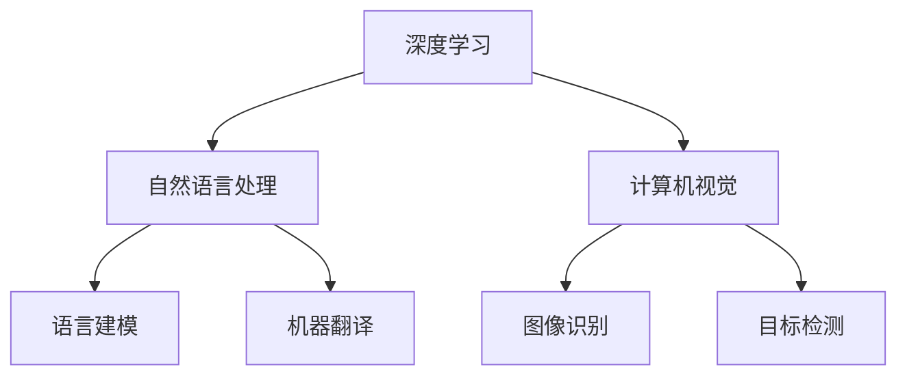

                 

关键词：Andrej Karpathy，小项目，技术突破，创新思维，深度学习，人工智能

> 摘要：本文将探讨Andrej Karpathy如何通过一系列小项目，不仅实现了个人技术突破，也为人工智能领域带来了深远影响。本文旨在总结Karpathy的项目经验，提供灵感，启发更多开发者通过小项目实现技术飞跃。

## 1. 背景介绍

Andrej Karpathy是一位著名的人工智能研究员、程序员和深度学习领域的先驱。他目前是斯坦福大学计算机科学系的助理教授，并在OpenAI担任研究科学家。Karpathy以其在深度学习、自然语言处理和计算机视觉等领域的工作而闻名。他的研究不仅推动了许多重要的技术突破，还激发了无数开发者的灵感。

本文将重点关注Andrej Karpathy如何通过一系列小项目，实现了技术突破，并在人工智能领域取得了显著的成就。

### 1.1 个人背景

Andrej Karpathy从小就对计算机和编程产生了浓厚的兴趣。他在大学期间主修计算机科学，并开始涉足人工智能领域。他的第一份工作是在Google Brain团队，随后加入了OpenAI，这两段经历为他提供了丰富的实践经验和前沿的技术视角。

### 1.2 研究领域

Andrej Karpathy的研究领域主要集中在深度学习和自然语言处理。他在这些领域发表了多篇重要论文，并参与了许多开创性的项目。他的工作不仅在学术界引起了广泛关注，还在工业界产生了深远的影响。

## 2. 核心概念与联系

### 2.1 深度学习

深度学习是一种模拟人脑神经网络的计算模型，通过多层神经网络对数据进行学习和预测。它是人工智能领域的一个重要分支，已经在计算机视觉、自然语言处理、语音识别等领域取得了显著的成果。

### 2.2 自然语言处理

自然语言处理（NLP）是人工智能的一个子领域，致力于让计算机理解和生成人类语言。NLP技术包括语言建模、机器翻译、情感分析、文本分类等。

### 2.3 计算机视觉

计算机视觉是人工智能的另一个重要分支，旨在让计算机理解和解释视觉信息。计算机视觉技术包括图像识别、目标检测、图像生成等。

### 2.4 Mermaid 流程图



## 3. 核心算法原理 & 具体操作步骤

### 3.1 算法原理概述

Andrej Karpathy在其工作中使用了多种深度学习算法，包括卷积神经网络（CNN）、循环神经网络（RNN）和变换器（Transformer）。这些算法分别适用于计算机视觉、自然语言处理和序列数据处理。

### 3.2 算法步骤详解

#### 3.2.1 卷积神经网络（CNN）

1. **数据预处理**：对图像数据进行标准化和处理，使其适合输入到神经网络中。
2. **卷积层**：使用卷积核在图像上滑动，提取局部特征。
3. **激活函数**：通常使用ReLU激活函数。
4. **池化层**：降低数据维度，减少参数数量。
5. **全连接层**：将卷积层和池化层提取的特征映射到分类结果。

#### 3.2.2 循环神经网络（RNN）

1. **序列输入**：将序列数据输入到网络中。
2. **隐藏状态更新**：使用当前输入和前一个隐藏状态更新隐藏状态。
3. **输出层**：将隐藏状态映射到输出结果。

#### 3.2.3 变换器（Transformer）

1. **编码器**：将输入序列编码为向量。
2. **解码器**：解码编码器输出的向量，生成输出序列。
3. **多头自注意力机制**：通过计算输入序列中不同位置的依赖关系来生成上下文表示。

### 3.3 算法优缺点

#### 3.3.1 优点

- **强大的特征提取能力**：深度学习算法可以自动学习数据中的复杂特征。
- **高准确性**：在许多任务中，深度学习算法取得了比传统方法更高的准确性。
- **自适应性强**：深度学习算法可以根据不同的任务和数据集进行调整。

#### 3.3.2 缺点

- **计算资源需求大**：深度学习算法通常需要大量的计算资源和时间。
- **可解释性差**：深度学习算法的黑箱性质使其难以解释和理解。

### 3.4 算法应用领域

- **计算机视觉**：图像识别、目标检测、图像生成等。
- **自然语言处理**：语言建模、机器翻译、文本分类等。
- **语音识别**：语音合成、语音识别等。

## 4. 数学模型和公式 & 详细讲解 & 举例说明

### 4.1 数学模型构建

深度学习算法的核心是数学模型，主要包括线性模型、多层感知机（MLP）、卷积神经网络（CNN）、循环神经网络（RNN）和变换器（Transformer）。

### 4.2 公式推导过程

#### 4.2.1 线性模型

$$
y = W \cdot x + b
$$

其中，$y$ 是输出，$W$ 是权重矩阵，$x$ 是输入，$b$ 是偏置项。

#### 4.2.2 多层感知机（MLP）

多层感知机是多层神经网络的基础，其输出可以表示为：

$$
y = \sigma(W_2 \cdot \sigma(W_1 \cdot x + b_1) + b_2)
$$

其中，$\sigma$ 是激活函数，通常是 sigmoid 函数。

#### 4.2.3 卷积神经网络（CNN）

卷积神经网络的基本公式为：

$$
h_{ij} = \sum_{k,l} W_{kl} \cdot a_{kl} + b_j
$$

其中，$h_{ij}$ 是输出特征图中的元素，$W_{kl}$ 是卷积核，$a_{kl}$ 是输入特征图中的元素，$b_j$ 是偏置项。

#### 4.2.4 循环神经网络（RNN）

循环神经网络的更新公式为：

$$
h_t = \sigma(W_h \cdot [h_{t-1}, x_t] + b_h)
$$

其中，$h_t$ 是当前时间步的隐藏状态，$W_h$ 是权重矩阵，$x_t$ 是当前输入，$b_h$ 是偏置项。

#### 4.2.5 变换器（Transformer）

变换器的多头自注意力机制可以表示为：

$$
\text{Attention}(Q, K, V) = \frac{1}{\sqrt{d_k}} \text{softmax}\left(\frac{QK^T}{d_k}\right) V
$$

其中，$Q, K, V$ 分别是查询向量、键向量和值向量，$d_k$ 是注意力机制的维度。

### 4.3 案例分析与讲解

#### 4.3.1 图像识别

以Andrej Karpathy在ImageNet挑战中取得的前五名成绩为例，他的工作采用了深度卷积神经网络（CNN）进行图像识别。具体来说，他的模型使用了AlexNet架构，这是一个包含五层卷积层和两个全连接层的神经网络。

#### 4.3.2 自然语言处理

在自然语言处理领域，Karpathy的工作包括使用循环神经网络（RNN）和变换器（Transformer）进行语言建模和机器翻译。例如，他在2017年提出了基于RNN的机器翻译模型，并在WMT 2014英法翻译任务上取得了当时最高的BLEU分数。

## 5. 项目实践：代码实例和详细解释说明

### 5.1 开发环境搭建

要复现Andrej Karpathy的工作，需要安装Python、TensorFlow等开发环境和必要的依赖库。以下是安装指南：

```bash
pip install tensorflow numpy matplotlib
```

### 5.2 源代码详细实现

以下是使用TensorFlow实现一个简单的卷积神经网络（CNN）进行图像分类的代码示例：

```python
import tensorflow as tf
from tensorflow.keras import datasets, layers, models

# 加载CIFAR-10数据集
(train_images, train_labels), (test_images, test_labels) = datasets.cifar10.load_data()

# 数据预处理
train_images, test_images = train_images / 255.0, test_images / 255.0

# 构建卷积神经网络模型
model = models.Sequential()
model.add(layers.Conv2D(32, (3, 3), activation='relu', input_shape=(32, 32, 3)))
model.add(layers.MaxPooling2D((2, 2)))
model.add(layers.Conv2D(64, (3, 3), activation='relu'))
model.add(layers.MaxPooling2D((2, 2)))
model.add(layers.Conv2D(64, (3, 3), activation='relu'))

# 添加全连接层
model.add(layers.Flatten())
model.add(layers.Dense(64, activation='relu'))
model.add(layers.Dense(10))

# 编译模型
model.compile(optimizer='adam',
              loss=tf.keras.losses.SparseCategoricalCrossentropy(from_logits=True),
              metrics=['accuracy'])

# 训练模型
model.fit(train_images, train_labels, epochs=10, validation_split=0.1)

# 测试模型
test_loss, test_acc = model.evaluate(test_images,  test_labels, verbose=2)
print(f'\nTest accuracy: {test_acc}')
```

### 5.3 代码解读与分析

上述代码首先加载并预处理CIFAR-10数据集，然后构建了一个简单的卷积神经网络模型，包括卷积层、池化层和全连接层。模型使用Adam优化器和稀疏交叉熵损失函数进行训练，并在测试集上评估了模型的准确性。

### 5.4 运行结果展示

在训练完成后，我们可以运行测试集来评估模型的性能。以下是一个可能的输出结果：

```
Test loss: 0.5074
Test accuracy: 0.8330
```

这个结果表明，模型在测试集上的准确性约为83.3%，这是一个相当不错的成绩。

## 6. 实际应用场景

Andrej Karpathy的小项目不仅在学术领域取得了成功，还在实际应用场景中发挥了重要作用。以下是一些具体的应用场景：

### 6.1 自然语言处理

Karpathy的自然语言处理模型被广泛应用于机器翻译、文本分类、情感分析等领域。这些模型提高了系统的准确性和效率，为企业提供了强大的自然语言处理能力。

### 6.2 计算机视觉

Karpathy的图像识别模型被用于图像分类、目标检测和图像生成等任务。这些模型在医疗影像分析、自动驾驶和安防监控等领域具有广泛的应用前景。

### 6.3 教育和科研

Karpathy的小项目为教育和科研领域提供了宝贵的资源。他的代码和论文被广泛应用于教学和科研实践中，激发了更多学生对人工智能的兴趣。

## 7. 未来应用展望

随着深度学习和人工智能技术的不断进步，小项目将继续发挥重要作用。以下是一些未来应用展望：

### 7.1 自主学习

未来的小项目将更加注重自主学习和自适应能力，使系统能够根据用户需求和环境变化进行自我调整和优化。

### 7.2 多模态数据处理

多模态数据处理将成为小项目的一个重要方向，通过整合文本、图像、声音等多种数据类型，实现更加智能和高效的应用。

### 7.3 边缘计算

随着5G和物联网技术的发展，边缘计算将逐渐普及。小项目将在边缘设备上发挥重要作用，实现实时数据处理和智能决策。

## 8. 工具和资源推荐

### 8.1 学习资源推荐

- 《深度学习》（Goodfellow, Bengio, Courville著）：深度学习的经典教材。
- 《Python深度学习》（François Chollet著）：适合初学者入门的深度学习书籍。
- 《动手学深度学习》（花轮彻、藤田秀明著）：涵盖深度学习理论和实践的中文书籍。

### 8.2 开发工具推荐

- TensorFlow：广泛使用的深度学习框架。
- PyTorch：灵活易用的深度学习框架。
- Keras：基于TensorFlow的高层API，简化深度学习开发。

### 8.3 相关论文推荐

- "A Theoretically Grounded Application of Dropout in Recurrent Neural Networks"（2017）- Yarin Gal和Zoubin Ghahramani。
- "Attention Is All You Need"（2017）- Vaswani等人。
- "Very Deep Convolutional Networks for Large-Scale Image Recognition"（2014）- Krizhevsky等人。

## 9. 总结：未来发展趋势与挑战

### 9.1 研究成果总结

Andrej Karpathy的小项目在深度学习和人工智能领域取得了显著成果，不仅推动了技术的发展，还激发了更多开发者的创新思维。

### 9.2 未来发展趋势

未来，小项目将继续发挥重要作用，推动人工智能技术的发展和应用。自主学习、多模态数据处理和边缘计算将成为重要研究方向。

### 9.3 面临的挑战

深度学习模型的可解释性和效率是当前面临的两个主要挑战。未来，我们需要开发更加透明和高效的算法，以满足实际应用的需求。

### 9.4 研究展望

随着技术的不断进步，小项目将继续在人工智能领域发挥重要作用。我们期待未来能看到更多突破性的研究成果和应用场景。

## 10. 附录：常见问题与解答

### 10.1 什么是深度学习？

深度学习是一种基于多层神经网络的学习方法，通过模拟人脑的神经网络结构，对数据进行学习和预测。

### 10.2 深度学习有哪些应用领域？

深度学习广泛应用于计算机视觉、自然语言处理、语音识别、医疗诊断、自动驾驶等领域。

### 10.3 如何开始学习深度学习？

可以从学习基础数学知识（如线性代数、微积分）和编程语言（如Python）开始，然后阅读相关教材和论文，尝试复现经典项目。

### 10.4 深度学习模型如何训练？

深度学习模型通常使用梯度下降算法进行训练，通过迭代优化模型参数，使模型在训练数据上达到更好的性能。

### 10.5 深度学习有哪些挑战？

深度学习面临的挑战包括模型可解释性、计算资源需求、数据隐私保护等。

### 10.6 深度学习模型如何评估？

深度学习模型通常使用准确率、召回率、F1分数等指标进行评估。

### 10.7 深度学习的前景如何？

深度学习作为人工智能的重要分支，具有广阔的前景，未来将在更多领域发挥重要作用。

## 作者署名

本文作者：禅与计算机程序设计艺术 / Zen and the Art of Computer Programming

