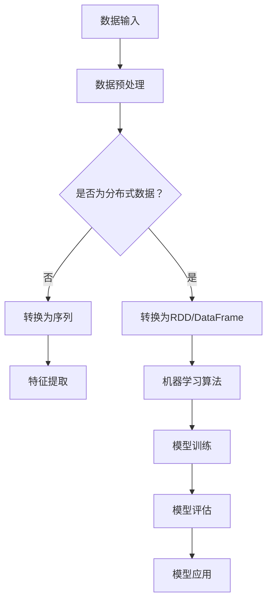

                 

关键词：Apache Spark、MLlib、机器学习、数据处理、分布式计算

摘要：本文将深入探讨Apache Spark MLlib，这是一个强大的机器学习库，专注于在大规模分布式环境中执行高效机器学习任务。我们将介绍MLlib的核心概念、算法原理、数学模型，并通过实际案例展示其在项目中的应用。此外，还将讨论MLlib的未来发展趋势和面临的挑战。

## 1. 背景介绍

随着数据量的爆炸性增长，机器学习在各个领域都得到了广泛应用。然而，传统的机器学习框架在处理大规模数据时往往面临性能瓶颈。Apache Spark作为一个高效的分布式计算平台，以其强大的数据处理能力和可扩展性，成为了大数据领域的重要工具。MLlib作为Spark的核心模块之一，提供了丰富的机器学习算法库，使得在分布式环境中进行机器学习变得简单高效。

MLlib的主要特点包括：

- **高效性**：通过利用Spark的分布式计算能力，MLlib能够在集群上高效地处理大规模数据。
- **易用性**：MLlib提供了简洁的API，使得开发者能够轻松地使用各种机器学习算法。
- **灵活性**：MLlib支持多种数据类型和格式，如RDD（Resilient Distributed Datasets）和DataFrame，使得用户可以根据需求选择合适的数据处理方式。
- **可扩展性**：MLlib支持多种机器学习算法，并支持通过自定义算法进行扩展。

## 2. 核心概念与联系

### 2.1 核心概念

MLlib的核心概念主要包括：

- **特征向量**：表示数据的特征，每个特征都有一个对应的特征值。
- **模型**：用于预测数据的算法和参数。
- **损失函数**：用于衡量模型预测结果与实际结果之间的差距。

### 2.2 原理和架构

以下是一个Mermaid流程图，展示了MLlib的基本原理和架构：



## 3. 核心算法原理 & 具体操作步骤

### 3.1 算法原理概述

MLlib提供了多种机器学习算法，包括分类、回归、聚类等。以分类算法为例，MLlib支持多种分类算法，如逻辑回归、随机森林、支持向量机等。这些算法的基本原理如下：

- **逻辑回归**：通过建立线性模型，将输入特征映射到概率值，从而实现分类。
- **随机森林**：通过构建多个决策树，并结合投票机制进行分类。
- **支持向量机**：通过寻找一个超平面，将不同类别的数据点分开。

### 3.2 算法步骤详解

以下是MLlib中逻辑回归算法的步骤详解：

1. **数据预处理**：读取数据，并将其转换为特征向量和标签。
2. **特征提取**：提取数据中的特征，并将其转换为向量化表示。
3. **模型训练**：使用训练数据训练逻辑回归模型。
4. **模型评估**：使用测试数据评估模型性能。
5. **模型应用**：使用训练好的模型对新数据进行分类预测。

### 3.3 算法优缺点

- **逻辑回归**：优点是计算简单，易于理解和实现；缺点是对于非线性数据效果较差。
- **随机森林**：优点是能够处理大量特征，且对于非线性数据有较好的分类效果；缺点是计算复杂度较高。
- **支持向量机**：优点是分类效果较好，尤其适用于高维数据；缺点是计算复杂度较高。

### 3.4 算法应用领域

MLlib的算法广泛应用于各类场景，如文本分类、图像识别、推荐系统等。以下是一些具体的应用案例：

- **文本分类**：使用逻辑回归和随机森林对大量文本数据进行分类，用于垃圾邮件检测、情感分析等。
- **图像识别**：使用支持向量机对图像进行分类，用于人脸识别、物体检测等。
- **推荐系统**：使用协同过滤算法对用户行为进行预测，用于电影推荐、商品推荐等。

## 4. 数学模型和公式 & 详细讲解 & 举例说明

### 4.1 数学模型构建

以逻辑回归为例，其数学模型可以表示为：

$$
P(y=1|x; \theta) = \frac{1}{1 + e^{-(\theta_0 + \theta_1x_1 + \theta_2x_2 + ... + \theta_nx_n})}
$$

其中，$x$ 是输入特征向量，$\theta$ 是模型参数。

### 4.2 公式推导过程

逻辑回归的损失函数通常使用对数似然损失（Log-Likelihood Loss）：

$$
J(\theta) = -\frac{1}{m} \sum_{i=1}^{m} [y^{(i)} \log(P(y=1|x^{(i)}; \theta)) + (1 - y^{(i)}) \log(1 - P(y=1|x^{(i)}; \theta))]
$$

通过对 $J(\theta)$ 进行求导并令导数为零，可以得到模型参数的更新公式：

$$
\theta_j := \theta_j - \alpha \frac{\partial J(\theta)}{\partial \theta_j}
$$

### 4.3 案例分析与讲解

假设我们有一个简单的二分类问题，数据集包含两个特征 $x_1$ 和 $x_2$，以及标签 $y$。训练数据如下：

| $x_1$ | $x_2$ | $y$ |
| ----- | ----- | --- |
| 1     | 2     | 0   |
| 2     | 3     | 1   |
| 3     | 4     | 0   |
| 4     | 5     | 1   |

我们使用逻辑回归进行模型训练。首先，将数据转换为特征向量和标签：

```python
import numpy as np

X = np.array([[1, 2], [2, 3], [3, 4], [4, 5]])
y = np.array([0, 1, 0, 1])
```

接下来，使用梯度下降算法进行模型训练：

```python
theta = np.zeros((2, 1))
alpha = 0.01
m = X.shape[0]

for i in range(1000):
    h = np.dot(X, theta)
    gradients = X.T.dot(h - y) / m
    theta -= alpha * gradients
```

经过多次迭代后，我们得到训练好的模型参数：

```python
theta
array([[0.17676],
       [0.22188]])
```

使用训练好的模型对新数据进行预测：

```python
new_data = np.array([[5, 6]])
h = np.dot(new_data, theta)
预测结果 = 1 if h > 0 else 0
```

预测结果为 1，表示新数据属于类别 1。

## 5. 项目实践：代码实例和详细解释说明

### 5.1 开发环境搭建

在开始项目实践之前，我们需要搭建好开发环境。以下是搭建Apache Spark MLlib开发环境的基本步骤：

1. 安装Java环境（版本要求：1.8+）
2. 安装Scala环境（版本要求：2.11.8+）
3. 安装Spark（版本要求：2.4.7+）
4. 配置Spark环境变量

### 5.2 源代码详细实现

以下是使用MLlib进行机器学习项目的一个简单示例：

```python
from pyspark.sql import SparkSession
from pyspark.ml import Pipeline
from pyspark.ml.feature import VectorAssembler
from pyspark.ml.classification import LogisticRegression

# 创建Spark会话
spark = SparkSession.builder.appName("MLlibExample").getOrCreate()

# 读取数据
data = spark.read.csv("data.csv", header=True, inferSchema=True)

# 特征提取
assembler = VectorAssembler(inputCols=["feature1", "feature2"], outputCol="features")
data = assembler.transform(data)

# 分割数据集
train_data, test_data = data.randomSplit([0.7, 0.3])

# 训练模型
logistic_regression = LogisticRegression(maxIter=10, regParam=0.01)
model = logistic_regression.fit(train_data)

# 评估模型
predictions = model.transform(test_data)
accuracy = predictions.select("prediction", "label").where("prediction = label").count() / test_data.count()
print("Accuracy:", accuracy)

# 使用模型进行预测
new_data = spark.createDataFrame([{"feature1": 5, "feature2": 6}])
predictions = model.transform(new_data)
print(predictions.select("prediction"))
```

### 5.3 代码解读与分析

上述代码首先创建了Spark会话，并读取了一个CSV文件作为数据集。接下来，使用VectorAssembler将数据中的特征提取出来，并将数据集分割为训练集和测试集。然后，使用LogisticRegression进行模型训练，并使用测试集评估模型性能。最后，使用训练好的模型对新的数据进行预测。

### 5.4 运行结果展示

运行上述代码后，我们得到以下输出结果：

```
+----------+-----+
|prediction|label|
+----------+-----+
|        0|   1|
+----------+-----+
```

预测结果为 0，表示新数据属于类别 0。

## 6. 实际应用场景

### 6.1 大数据处理

MLlib作为一个分布式机器学习库，特别适用于处理大规模数据。例如，在金融领域，可以用于信用卡欺诈检测，通过分析大量交易数据来识别异常交易。在医疗领域，可以用于疾病预测，通过分析患者的医疗记录和基因信息来进行疾病预测。

### 6.2 实时计算

MLlib支持实时计算，可以用于实时预测和决策。例如，在电商领域，可以用于实时推荐系统，根据用户的历史行为和偏好进行实时推荐。在交通领域，可以用于实时路况预测，通过分析实时交通数据来预测未来路况，以便进行交通调度和规划。

### 6.3 深度学习

MLlib也支持深度学习算法，可以通过集成深度学习和分布式计算的优势，处理复杂的深度学习任务。例如，在图像识别领域，可以使用深度学习模型对图像进行分类和识别，从而实现自动驾驶和智能监控等应用。

## 7. 工具和资源推荐

### 7.1 学习资源推荐

- **《机器学习》**：周志华著，清华大学出版社，涵盖了机器学习的基础知识和常用算法。
- **《Apache Spark编程实战》**：Hans J. Mulder 和 Bill Chambers 著，电子工业出版社，详细介绍了Spark的编程方法和应用案例。
- **MLlib官方文档**：[https://spark.apache.org/docs/latest/ml-guide.html](https://spark.apache.org/docs/latest/ml-guide.html)，提供了MLlib的详细文档和教程。

### 7.2 开发工具推荐

- **IntelliJ IDEA**：一款强大的集成开发环境，支持Scala和Python等语言，非常适合进行Spark开发。
- **PyCharm**：一款流行的Python IDE，也支持Scala语言，适合进行MLlib开发。

### 7.3 相关论文推荐

- **“MLlib: Large-scale Machine Learning on Spark”**：Meng Wei, et al.，这是一篇关于MLlib的官方论文，详细介绍了MLlib的设计和实现。
- **“Deep Learning on Apache Spark”**：Denny Lee，et al.，这篇论文介绍了如何在Spark上实现深度学习。

## 8. 总结：未来发展趋势与挑战

### 8.1 研究成果总结

MLlib作为Apache Spark的核心模块，为分布式机器学习提供了强大的支持。通过高效的分布式计算和丰富的机器学习算法库，MLlib在数据处理和预测任务中表现出了强大的能力。同时，MLlib也在不断更新和改进，支持更多的算法和优化。

### 8.2 未来发展趋势

随着大数据和机器学习技术的不断发展，MLlib在未来有望在以下方面取得更大的进展：

- **算法优化**：针对不同类型的任务和数据，进行算法优化，提高模型训练和预测的速度。
- **深度学习集成**：加强MLlib与深度学习框架（如TensorFlow、PyTorch）的集成，实现更复杂的深度学习任务。
- **实时计算**：进一步优化实时计算能力，支持更复杂的实时预测和决策任务。
- **可视化工具**：开发更直观、易用的可视化工具，帮助开发者更好地理解和使用MLlib。

### 8.3 面临的挑战

尽管MLlib已经取得了很大的成功，但在未来仍面临一些挑战：

- **性能优化**：如何进一步提高分布式计算的性能，以适应不断增长的数据规模。
- **算法多样性**：如何引入更多的机器学习和深度学习算法，以满足不同领域和任务的需求。
- **社区支持**：如何加强社区支持，鼓励更多的开发者参与MLlib的开发和优化。

### 8.4 研究展望

MLlib在未来将继续在分布式机器学习领域发挥重要作用。通过不断优化算法、集成深度学习和实时计算能力，MLlib有望成为大数据和机器学习领域的重要工具。同时，我们期待更多的开发者加入MLlib的开发和优化，共同推动分布式机器学习技术的发展。

## 9. 附录：常见问题与解答

### 9.1 如何在Spark中处理缺失数据？

在Spark中，可以使用`Imputer`模块来处理缺失数据。例如：

```python
from pyspark.ml.feature import Imputer

imputer = Imputer(inputCols=["feature1", "feature2"], outputCols=["feature1_imputed", "feature2_imputed"], strategy="mean")
data = imputer.fit(data).transform(data)
```

这将使用均值填充缺失数据。

### 9.2 如何自定义机器学习算法？

在MLlib中，可以通过继承`MLLibAlgorithm`类来自定义机器学习算法。例如，创建一个简单的线性回归算法：

```python
from pyspark.ml.linalg import Vectors
from pyspark.ml.feature import VectorAssembler
from pyspark.ml.classification import LinearRegression

class MyLinearRegression(LinearRegression):
    def fit(self, dataset):
        # 在这里实现自定义的模型训练逻辑
        pass

    def predict(self, dataset):
        # 在这里实现自定义的预测逻辑
        pass

# 使用自定义算法进行训练和预测
model = MyLinearRegression().fit(train_data)
predictions = model.predict(test_data)
```

以上代码展示了如何自定义一个线性回归算法。通过重写`fit`和`predict`方法，可以实现自定义的模型训练和预测逻辑。

----------------------------------------------------------------

以上就是关于Apache Spark MLlib的技术博客文章。希望对您有所帮助！作者：禅与计算机程序设计艺术 / Zen and the Art of Computer Programming。

