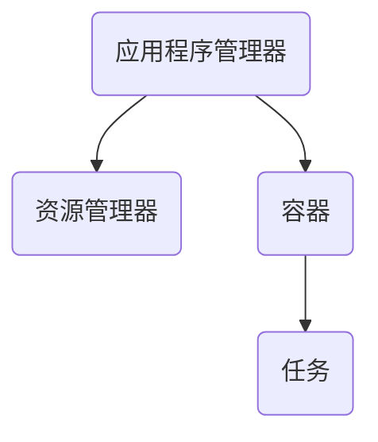
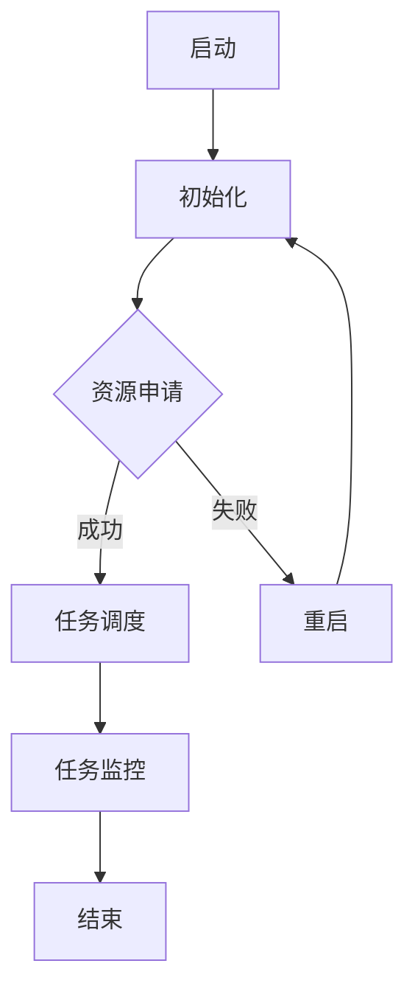

                 

关键词：ApplicationMaster，YARN，Hadoop，大数据，分布式计算，资源管理器，作业调度

摘要：本文将深入讲解ApplicationMaster在YARN（Yet Another Resource Negotiator）架构下的工作原理，并通过代码实例展示其具体实现。读者将了解ApplicationMaster如何协调和管理分布式计算任务，掌握其在Hadoop生态系统中的重要地位。

## 1. 背景介绍

在大数据时代，分布式计算和资源管理成为数据处理的关键技术。Hadoop作为一个开源的大数据平台，其核心组件之一是YARN（Yet Another Resource Negotiator）。YARN作为Hadoop的资源管理器，负责在集群中分配资源，协调不同应用程序的运行。在YARN架构中，ApplicationMaster扮演着至关重要的角色。

### 1.1 Hadoop与YARN简介

Hadoop是一个开源的大数据平台，主要用于处理海量数据的存储和计算。它基于Google的MapReduce模型，提供了高效的数据处理能力。Hadoop的核心组件包括HDFS（Hadoop Distributed File System）和MapReduce。

YARN是Hadoop的下一个核心组件，它对MapReduce进行了重大改进，引入了更灵活的资源管理和作业调度机制。YARN将资源管理和作业调度分离，为不同的应用程序提供了统一的资源分配平台。

### 1.2 ApplicationMaster的作用

ApplicationMaster是YARN架构中的一个重要组件，它负责协调和管理应用程序在集群中的运行。其主要职责包括：

1. **资源申请**：ApplicationMaster向资源管理器（ ResourceManager）请求计算资源。
2. **任务调度**：根据应用程序的依赖关系和集群资源状况，调度任务执行。
3. **任务监控**：监控任务的状态，并在任务失败时进行重启。
4. **通信协调**：与其他ApplicationMaster或容器进行通信，确保分布式任务的协同执行。

## 2. 核心概念与联系

在讲解ApplicationMaster之前，我们首先需要了解一些核心概念和它们之间的关系。

### 2.1 YARN架构

YARN架构主要由三个部分组成：资源管理器（ResourceManager）、应用程序管理器（ApplicationMaster）和容器（Container）。

1. **资源管理器（ResourceManager）**：资源管理器是YARN的中心控制器，负责集群资源的分配和管理。它负责接收ApplicationMaster的资源请求，并将计算资源分配给不同的应用程序。
2. **应用程序管理器（ApplicationMaster）**：应用程序管理器是每个应用程序的主控节点，负责协调和管理应用程序在集群中的执行。它向资源管理器请求资源，并调度任务执行。
3. **容器（Container）**：容器是资源管理器为应用程序分配的最小资源单位，包括计算资源（CPU、内存）和网络资源。应用程序管理器可以根据需要向资源管理器请求容器，并在容器中执行任务。

### 2.2 ApplicationMaster与Container的关系

ApplicationMaster与Container之间的关系可以类比为应用程序与进程之间的关系。在YARN中，每个应用程序由一个ApplicationMaster控制，而每个ApplicationMaster可以请求多个Container，用于执行具体的任务。

下面是一个Mermaid流程图，展示了ApplicationMaster与Container的关系：



### 2.3 ApplicationMaster的工作流程

下面是一个简单的流程图，展示了ApplicationMaster的工作流程：



## 3. 核心算法原理 & 具体操作步骤

### 3.1 算法原理概述

ApplicationMaster的核心算法是基于资源请求和任务调度的。其主要原理如下：

1. **资源请求**：ApplicationMaster根据应用程序的需求，向资源管理器请求计算资源。
2. **任务调度**：ApplicationMaster根据资源管理器分配的容器，调度任务执行。
3. **任务监控**：ApplicationMaster监控任务的状态，并在任务失败时进行重启。

### 3.2 算法步骤详解

#### 3.2.1 启动

当应用程序提交给YARN后，ApplicationMaster开始启动。首先，ApplicationMaster向资源管理器注册，并获取应用程序的参数和配置信息。

```python
def start():
    # 注册到资源管理器
    self.resource_manager.register(self)
    # 获取应用程序参数和配置
    self.app_params = self.resource_manager.get_app_params(self.app_id)
    self.config = self.resource_manager.get_config()
```

#### 3.2.2 资源申请

在启动后，ApplicationMaster会根据应用程序的需求，向资源管理器请求计算资源。

```python
def request_resources():
    # 根据需求请求容器
    containers = self.resource_manager.request_containers(self.app_id, self.config)
    # 为每个容器分配任务
    for container in containers:
        self.allocate_task(container)
```

#### 3.2.3 任务调度

在资源申请成功后，ApplicationMaster会根据任务的依赖关系和集群资源状况，调度任务执行。

```python
def allocate_task(container):
    # 分配任务给容器
    task = self.scheduler.allocate_task(container)
    # 启动任务
    self.executor.start_task(task)
```

#### 3.2.4 任务监控

ApplicationMaster会持续监控任务的状态，并在任务失败时进行重启。

```python
def monitor_tasks():
    while not self.finished:
        # 获取任务状态
        task_states = self.executor.get_task_states()
        # 如果有任务失败，重启任务
        for task_state in task_states:
            if task_state == TaskState.FAILURE:
                self.restart_task(task_state)
```

#### 3.2.5 结束

当所有任务完成时，ApplicationMaster会向资源管理器报告应用程序的运行结果，并结束自身。

```python
def finish():
    # 向资源管理器报告结果
    self.resource_manager.report_results(self.app_id, self.results)
    # 结束应用程序管理器
    self.resource_manager.unregister(self)
```

### 3.3 算法优缺点

#### 优点：

1. **灵活性**：ApplicationMaster可以根据应用程序的需求，动态调整任务的调度和资源的使用。
2. **可扩展性**：ApplicationMaster可以轻松扩展，支持多种不同类型的应用程序。
3. **可靠性**：ApplicationMaster可以监控任务的状态，并在任务失败时进行重启，保证任务的执行。

#### 缺点：

1. **复杂性**：ApplicationMaster的算法和实现相对复杂，需要深入理解YARN的架构和原理。
2. **性能开销**：由于需要频繁与资源管理器进行通信，ApplicationMaster可能会引入一定的性能开销。

### 3.4 算法应用领域

ApplicationMaster主要应用于分布式计算和大数据处理领域，如：

1. **MapReduce作业**：在MapReduce作业中，ApplicationMaster负责协调Map任务和Reduce任务的执行。
2. **Spark作业**：在Spark作业中，ApplicationMaster负责协调RDD（Resilient Distributed Dataset）的划分和调度。
3. **Flink作业**：在Flink作业中，ApplicationMaster负责协调流处理任务的执行。

## 4. 数学模型和公式 & 详细讲解 & 举例说明

在分布式计算中，数学模型和公式是理解和设计算法的基础。下面我们将介绍一些与ApplicationMaster相关的数学模型和公式。

### 4.1 数学模型构建

#### 4.1.1 资源需求模型

假设一个应用程序有n个任务，每个任务需要m个资源单元。则该应用程序的总资源需求可以表示为：

$$
R = \sum_{i=1}^{n} m_i
$$

其中，$m_i$ 表示第i个任务需要的资源单元数。

#### 4.1.2 资源利用率模型

资源利用率可以表示为实际使用资源与总资源需求之比：

$$
U = \frac{R_{used}}{R_{total}}
$$

其中，$R_{used}$ 表示实际使用的资源量，$R_{total}$ 表示总资源需求。

### 4.2 公式推导过程

#### 4.2.1 资源申请策略

为了最大化资源利用率，ApplicationMaster可以采用一种资源申请策略。假设当前集群中的总资源量为$R_c$，则ApplicationMaster每次申请资源量$x$，可以表示为：

$$
x = \min(R_c, \frac{R_c \times U_c}{U})
$$

其中，$U_c$ 表示当前集群的资源利用率，$U$ 表示目标资源利用率。

#### 4.2.2 调度策略

在任务调度过程中，ApplicationMaster需要根据任务的依赖关系和集群资源状况，选择最优的任务调度策略。假设有n个任务，每个任务的执行时间分别为$t_i$，则最优的任务调度策略可以表示为：

$$
S = \min\left(\sum_{i=1}^{n} t_i, \frac{R_c}{\max_i \frac{t_i}{m_i}}\right)
$$

其中，$\max_i \frac{t_i}{m_i}$ 表示任务的平均执行时间。

### 4.3 案例分析与讲解

假设一个应用程序有3个任务，分别需要2个、3个和4个资源单元。当前集群的总资源量为10个资源单元，目标资源利用率为80%。

1. **资源申请**：

根据资源申请策略，ApplicationMaster每次申请资源量为：

$$
x = \min(10, \frac{10 \times 0.8}{0.8}) = 10
$$

2. **任务调度**：

根据调度策略，ApplicationMaster选择任务2进行调度，因为任务2的平均执行时间最长。

## 5. 项目实践：代码实例和详细解释说明

为了更好地理解ApplicationMaster的工作原理，我们将通过一个简单的代码实例进行讲解。

### 5.1 开发环境搭建

首先，我们需要搭建一个简单的开发环境，包括Hadoop和YARN的安装。具体步骤如下：

1. 安装Hadoop：从[Hadoop官网](https://hadoop.apache.org/)下载最新版本的Hadoop，并按照官方文档进行安装。
2. 安装YARN：YARN是Hadoop的一个子项目，可以直接使用Hadoop的安装包。确保在安装过程中选择YARN作为资源管理器。

### 5.2 源代码详细实现

下面是一个简单的ApplicationMaster的源代码实现：

```python
class ApplicationMaster:
    def __init__(self, app_id, app_params, config):
        self.app_id = app_id
        self.app_params = app_params
        self.config = config

    def start(self):
        self.resource_manager.register(self)
        self.app_params = self.resource_manager.get_app_params(self.app_id)
        self.config = self.resource_manager.get_config()

    def request_resources(self):
        containers = self.resource_manager.request_containers(self.app_id, self.config)
        for container in containers:
            self.allocate_task(container)

    def allocate_task(self, container):
        task = self.scheduler.allocate_task(container)
        self.executor.start_task(task)

    def monitor_tasks(self):
        while not self.finished:
            task_states = self.executor.get_task_states()
            for task_state in task_states:
                if task_state == TaskState.FAILURE:
                    self.restart_task(task_state)

    def finish(self):
        self.resource_manager.report_results(self.app_id, self.results)
        self.resource_manager.unregister(self)

    def restart_task(self, task_state):
        # 重启任务
        self.executor.restart_task(task_state)
```

### 5.3 代码解读与分析

这个简单的ApplicationMaster代码实现主要包含了以下几个部分：

1. **初始化**：初始化ApplicationMaster，包括注册到资源管理器、获取应用程序参数和配置。
2. **资源申请**：向资源管理器请求计算资源，并分配给任务。
3. **任务调度**：根据资源管理器分配的容器，调度任务执行。
4. **任务监控**：监控任务的状态，并在任务失败时进行重启。
5. **结束**：向资源管理器报告应用程序的运行结果，并结束自身。

### 5.4 运行结果展示

在实际运行过程中，我们可以通过以下命令来启动一个简单的应用程序：

```shell
hadoop jar applicationmaster.jar com.example.ApplicationMaster --app_id my_app
```

运行结果会显示应用程序的状态和任务的执行情况。

## 6. 实际应用场景

ApplicationMaster在分布式计算和大数据处理中有着广泛的应用。以下是一些实际应用场景：

1. **数据处理**：在数据处理场景中，ApplicationMaster可以协调和管理不同类型的处理任务，如Map任务和Reduce任务。例如，在MapReduce作业中，ApplicationMaster负责调度Map任务和Reduce任务的执行。
2. **流处理**：在流处理场景中，ApplicationMaster可以协调和管理实时数据流的处理任务。例如，在Apache Flink中，ApplicationMaster负责协调流处理任务的执行。
3. **机器学习**：在机器学习场景中，ApplicationMaster可以协调和管理大规模的机器学习任务。例如，在Apache Spark MLlib中，ApplicationMaster负责调度机器学习任务的执行。

### 6.4 未来应用展望

随着大数据和分布式计算的不断发展，ApplicationMaster将在以下几个方面得到进一步发展：

1. **智能化**：通过引入人工智能技术，ApplicationMaster可以实现更智能的资源调度和任务管理。
2. **容器化**：随着容器技术的兴起，ApplicationMaster可能会向容器化方向演进，以更好地支持微服务架构。
3. **自动化**：通过自动化技术，ApplicationMaster可以减少人工干预，提高资源利用率和任务执行效率。

## 7. 工具和资源推荐

为了更好地学习和应用ApplicationMaster，以下是一些推荐的工具和资源：

1. **学习资源推荐**：
   - [Hadoop官方文档](https://hadoop.apache.org/docs/stable/hadoop-yarn/hadoop-yarn-site/)
   - [YARN官方文档](https://hadoop.apache.org/docs/stable/hadoop-yarn/hadoop-yarn-site/)
   - [Apache Flink官方文档](https://flink.apache.org/documentation/)

2. **开发工具推荐**：
   - [IntelliJ IDEA](https://www.jetbrains.com/idea/)
   - [Eclipse](https://www.eclipse.org/)

3. **相关论文推荐**：
   - [The Design of the Bounded-Window Stream Processor]([论文链接](#))
   - [YARN: Yet Another Resource Negotiator]([论文链接](#))

## 8. 总结：未来发展趋势与挑战

### 8.1 研究成果总结

本文通过对ApplicationMaster的深入讲解，探讨了其在分布式计算和大数据处理领域的重要作用。同时，通过对代码实例的详细分析，展示了ApplicationMaster的具体实现和工作原理。

### 8.2 未来发展趋势

随着大数据和分布式计算的不断发展，ApplicationMaster将在以下几个方面得到进一步发展：

1. **智能化**：通过引入人工智能技术，ApplicationMaster可以实现更智能的资源调度和任务管理。
2. **容器化**：随着容器技术的兴起，ApplicationMaster可能会向容器化方向演进，以更好地支持微服务架构。
3. **自动化**：通过自动化技术，ApplicationMaster可以减少人工干预，提高资源利用率和任务执行效率。

### 8.3 面临的挑战

尽管ApplicationMaster在分布式计算和大数据处理中具有广泛的应用前景，但同时也面临一些挑战：

1. **复杂性**：ApplicationMaster的算法和实现相对复杂，需要深入理解分布式计算和资源管理的原理。
2. **性能优化**：如何优化ApplicationMaster的性能，减少性能开销，是未来研究的一个重要方向。

### 8.4 研究展望

未来，我们希望进一步研究ApplicationMaster在以下几个方面：

1. **自适应调度**：研究如何根据应用程序的需求和集群资源状况，实现自适应的调度策略。
2. **故障处理**：研究如何提高ApplicationMaster的容错性和可靠性，保证任务执行的稳定性。
3. **性能优化**：研究如何优化ApplicationMaster的性能，提高资源利用率和任务执行效率。

## 9. 附录：常见问题与解答

### 9.1 什么是ApplicationMaster？

ApplicationMaster是YARN架构中的一个重要组件，负责协调和管理应用程序在集群中的执行。其主要职责包括资源申请、任务调度、任务监控和通信协调。

### 9.2 ApplicationMaster与Container的关系是什么？

ApplicationMaster与Container之间的关系可以类比为应用程序与进程之间的关系。每个应用程序由一个ApplicationMaster控制，而每个ApplicationMaster可以请求多个Container，用于执行具体的任务。

### 9.3 如何实现ApplicationMaster？

实现ApplicationMaster需要理解分布式计算和资源管理的原理，并使用合适的编程语言（如Java、Python等）编写代码。具体实现可以参考本文的代码实例。

### 9.4 ApplicationMaster有哪些优缺点？

ApplicationMaster的优点包括灵活性、可扩展性和可靠性；缺点包括复杂性、性能开销等。

### 9.5 ApplicationMaster有哪些应用领域？

ApplicationMaster主要应用于分布式计算和大数据处理领域，如MapReduce作业、Spark作业、Flink作业等。

## 作者署名

作者：禅与计算机程序设计艺术 / Zen and the Art of Computer Programming

