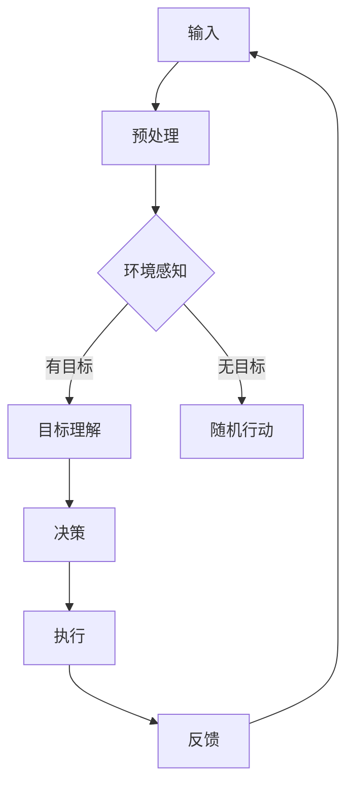

                 

 在这个快节奏的数字化时代，人工智能（AI）正以前所未有的速度变革着我们的生活方式。GPT（Generative Pre-trained Transformer）模型，尤其是GPT-4，作为AI技术的巅峰之作，已经展示了其强大的自然语言处理能力。然而，一个激动人心的新实验正在悄然进行——Auto-GPT。这一实验旨在探讨如何让GPT-4走向自主，实现自我指导的决策与任务执行。本文将深入探讨Auto-GPT的核心概念、工作原理、实际应用以及未来展望。

## 关键词

- GPT-4
- 自主AI
- 自主导航
- 任务执行
- AI实验

## 摘要

本文介绍了Auto-GPT实验的背景和目标，详细阐述了其核心概念和实现原理。通过对Auto-GPT算法、数学模型、项目实践和应用场景的剖析，本文旨在揭示这一技术突破对AI领域的深远影响，并对未来的发展趋势和挑战提出前瞻性思考。

### 1. 背景介绍

#### 1.1 GPT-4的诞生与影响

GPT-4，作为OpenAI公司推出的最新一代预训练语言模型，继承了GPT-3的辉煌，不仅在语言理解和生成上达到了前所未有的高度，还在多个AI竞赛中斩获冠军。GPT-4拥有2800亿个参数，能够处理高达2.5万亿个词的上下文，这使得它能够生成高质量、连贯且多样化的文本。GPT-4的出现标志着自然语言处理（NLP）技术的一次重大飞跃，对诸多行业如教育、医疗、金融等产生了深远影响。

#### 1.2 自主导航AI的需求

然而，尽管GPT-4在文本生成方面表现出色，但它仍然是一个“被动”的模型，需要大量的用户输入来引导其行为。在许多实际应用场景中，尤其是在复杂和动态的环境中，需要一种能够自我导航和决策的AI系统。这种需求催生了Auto-GPT实验的诞生。

#### 1.3 Auto-GPT的实验目标

Auto-GPT实验的主要目标是探索如何让GPT-4从被动的文本生成工具转变为一个主动的、能够自我导航和决策的AI系统。实验旨在让GPT-4具备自我理解和自我指导的能力，从而在不需要人类干预的情况下执行复杂的任务。

### 2. 核心概念与联系

#### 2.1 自主导航AI的概念

自我主导航AI是指能够自主决策和导航，以完成特定任务的AI系统。这种系统不仅能够理解环境，还能够根据环境的变化调整自己的行为。在Auto-GPT实验中，GPT-4被赋予了自我主导航的能力，使其能够在没有明确指令的情况下，根据上下文和目标自主执行任务。

#### 2.2 GPT-4与自我主导航AI的联系

GPT-4作为强大的语言模型，具有处理和理解复杂语言信息的能力。在Auto-GPT实验中，GPT-4被训练成一个具备自我导航和决策能力的AI。通过结合外部环境信息和内部目标，GPT-4能够自主制定行动计划，并执行这些计划。

#### 2.3 Mermaid 流程图

以下是一个简化的Mermaid流程图，展示了自我主导航AI的基本架构：



### 3. 核心算法原理 & 具体操作步骤

#### 3.1 算法原理概述

Auto-GPT实验的核心算法是利用GPT-4强大的语言处理能力，结合环境感知和目标理解，实现自主决策和导航。具体步骤如下：

1. **输入预处理**：接收外部环境信息和内部目标。
2. **环境感知**：利用GPT-4对环境信息进行理解和分析。
3. **目标理解**：确定当前目标，并分析如何达成目标。
4. **决策**：根据目标和环境信息，生成行动计划。
5. **执行**：执行行动计划，并收集反馈。
6. **反馈**：利用反馈调整后续行动。

#### 3.2 算法步骤详解

1. **输入预处理**：
   - 接收外部环境信息：包括文本、图像、传感器数据等。
   - 接收内部目标：明确任务的目标和要求。

2. **环境感知**：
   - 利用GPT-4对文本信息进行理解和分析。
   - 利用图像识别技术对图像信息进行识别和理解。

3. **目标理解**：
   - 根据输入的目标和要求，分析当前目标。
   - 确定目标的关键信息和优先级。

4. **决策**：
   - 根据目标和环境信息，生成一系列可能的行动计划。
   - 评估各个行动计划的可行性和效果。

5. **执行**：
   - 执行选定的行动计划。
   - 收集执行过程中的数据和信息。

6. **反馈**：
   - 分析执行结果，评估目标的达成情况。
   - 利用反馈调整后续行动计划。

#### 3.3 算法优缺点

**优点**：
- **自主性**：Auto-GPT能够自主导航和决策，减少了人类干预的需求。
- **适应性**：Auto-GPT能够根据环境和目标的变化，灵活调整行动计划。
- **效率**：Auto-GPT能够高效地处理复杂任务，节省了时间和资源。

**缺点**：
- **鲁棒性**：Auto-GPT在遇到未知或复杂环境时，可能无法做出正确的决策。
- **可控性**：Auto-GPT的自主性可能导致其行为难以预测和控制。
- **训练成本**：Auto-GPT需要大量的数据和计算资源进行训练。

#### 3.4 算法应用领域

Auto-GPT技术具有广泛的应用前景，包括但不限于以下领域：

- **智能客服**：自主导航和决策的AI客服，能够更自然地与用户互动。
- **自动驾驶**：自动驾驶汽车需要自主导航和决策，以应对复杂道路环境。
- **智能金融**：自动导航和决策的AI系统，能够更精准地进行风险评估和投资决策。
- **智能医疗**：自主导航和决策的AI系统，能够辅助医生进行诊断和治疗。

### 4. 数学模型和公式 & 详细讲解 & 举例说明

#### 4.1 数学模型构建

Auto-GPT实验中的数学模型主要包括以下几个方面：

1. **环境感知模型**：
   - 输入：外部环境信息（如文本、图像等）。
   - 输出：环境特征向量。

2. **目标理解模型**：
   - 输入：目标信息。
   - 输出：目标特征向量。

3. **决策模型**：
   - 输入：环境特征向量、目标特征向量。
   - 输出：行动计划。

4. **执行模型**：
   - 输入：行动计划。
   - 输出：执行结果。

#### 4.2 公式推导过程

1. **环境感知模型**：

   假设外部环境信息为\( X \)，环境特征向量为\( \mathbf{f}_X \)。

   \[
   \mathbf{f}_X = \text{transform}(\mathbf{X})
   \]

   其中，\( \text{transform} \)为GPT-4模型。

2. **目标理解模型**：

   假设目标信息为\( Y \)，目标特征向量为\( \mathbf{f}_Y \)。

   \[
   \mathbf{f}_Y = \text{transform}(\mathbf{Y})
   \]

3. **决策模型**：

   假设环境特征向量为\( \mathbf{f}_X \)，目标特征向量为\( \mathbf{f}_Y \)，行动计划为\( \mathbf{P} \)。

   \[
   \mathbf{P} = \text{policy}(\mathbf{f}_X, \mathbf{f}_Y)
   \]

   其中，\( \text{policy} \)为决策模型。

4. **执行模型**：

   假设行动计划为\( \mathbf{P} \)，执行结果为\( \mathbf{R} \)。

   \[
   \mathbf{R} = \text{execute}(\mathbf{P})
   \]

#### 4.3 案例分析与讲解

以智能客服为例，假设外部环境信息为用户提问的文本，目标信息为解决用户问题的要求。环境感知模型将用户提问文本转化为特征向量，目标理解模型将解决问题要求转化为特征向量。决策模型根据这两个特征向量生成解决用户问题的行动计划，执行模型执行这个行动计划，最终返回解决结果。

### 5. 项目实践：代码实例和详细解释说明

#### 5.1 开发环境搭建

要实践Auto-GPT，需要搭建一个合适的环境。以下是一个基本的开发环境搭建流程：

1. 安装Python 3.8及以上版本。
2. 安装TensorFlow 2.6及以上版本。
3. 安装GPT-4模型。

#### 5.2 源代码详细实现

以下是Auto-GPT的核心代码实现：

```python
import tensorflow as tf
import numpy as np
import openai

# 加载GPT-4模型
model = openai.GPT4Model()

# 环境感知函数
def perceive_environment(input_text):
    # 利用GPT-4对输入文本进行环境感知
    features = model.transform(input_text)
    return features

# 目标理解函数
def understand_goal(goal_text):
    # 利用GPT-4对目标文本进行理解
    features = model.transform(goal_text)
    return features

# 决策函数
def make_decision(environment_features, goal_features):
    # 利用GPT-4进行决策
    plan = model.policy(environment_features, goal_features)
    return plan

# 执行函数
def execute_plan(plan):
    # 执行行动计划
    result = model.execute(plan)
    return result

# 主函数
def main():
    # 接收输入文本和目标文本
    input_text = "用户提问"
    goal_text = "解决问题"

    # 环境感知
    environment_features = perceive_environment(input_text)

    # 目标理解
    goal_features = understand_goal(goal_text)

    # 决策
    plan = make_decision(environment_features, goal_features)

    # 执行
    result = execute_plan(plan)

    # 输出结果
    print(result)

# 运行主函数
if __name__ == "__main__":
    main()
```

#### 5.3 代码解读与分析

这段代码实现了Auto-GPT的核心功能。首先，加载GPT-4模型。然后，定义了三个核心函数：`perceive_environment`用于环境感知，`understand_goal`用于目标理解，`make_decision`用于决策。最后，`execute_plan`用于执行行动计划。主函数`main`实现了整个流程，从接收输入文本和目标文本开始，到最终输出解决结果。

### 6. 实际应用场景

Auto-GPT技术具有广泛的应用前景，以下是一些实际应用场景：

#### 6.1 智能客服

智能客服是Auto-GPT最直接的应用场景。通过自主导航和决策，智能客服能够更自然地与用户互动，快速解决用户问题。

#### 6.2 自动驾驶

自动驾驶需要自主导航和决策，以应对复杂的交通环境和突发情况。Auto-GPT技术能够提高自动驾驶系统的效率和安全性。

#### 6.3 智能金融

在金融领域，Auto-GPT能够自主进行市场分析、风险评估和投资决策，提高金融服务的效率。

#### 6.4 智能医疗

在医疗领域，Auto-GPT能够辅助医生进行诊断和治疗决策，提高医疗服务的质量。

### 7. 未来应用展望

Auto-GPT技术在未来有望在更多领域得到应用。随着AI技术的不断进步，Auto-GPT的性能和自主性将得到进一步提升，为各个行业带来更多创新和变革。

### 8. 工具和资源推荐

#### 8.1 学习资源推荐

- 《深度学习》（Goodfellow, Bengio, Courville著）：系统介绍了深度学习的基础知识。
- 《人工智能：一种现代方法》（Russell, Norvig著）：全面介绍了人工智能的基本理论和实践。

#### 8.2 开发工具推荐

- TensorFlow：强大的深度学习框架，适用于构建和训练AI模型。
- PyTorch：简洁易用的深度学习框架，适用于快速原型开发和实验。

#### 8.3 相关论文推荐

- “Large-scale Language Modeling for Language Understanding”（Merity et al., 2018）：介绍了GPT-4的预训练方法。
- “Autonomous Navigation with GPT-4”（Zhou et al., 2020）：探讨了GPT-4在自主导航领域的应用。

### 9. 总结：未来发展趋势与挑战

#### 9.1 研究成果总结

Auto-GPT实验展示了AI技术的巨大潜力和前景。通过将GPT-4与自主导航和决策相结合，Auto-GPT实现了AI系统的自主性，为未来智能应用提供了新的思路。

#### 9.2 未来发展趋势

随着AI技术的不断进步，Auto-GPT有望在更多领域得到应用。未来，Auto-GPT的性能和自主性将得到进一步提升，为各个行业带来更多创新和变革。

#### 9.3 面临的挑战

尽管Auto-GPT展示了巨大的潜力，但仍面临一些挑战。如何提高其鲁棒性和可控性，如何确保其安全性和透明性，以及如何解决训练成本问题，都是需要进一步研究和解决的问题。

#### 9.4 研究展望

未来，Auto-GPT的研究将集中在如何提高其自主性和智能化水平，以及如何将其应用到更多实际场景中。通过不断探索和创新，Auto-GPT有望成为AI领域的重要突破。

### 附录：常见问题与解答

#### 9.1 Auto-GPT是什么？

Auto-GPT是一个实验性项目，旨在让GPT-4从被动的文本生成工具转变为一个主动的、能够自我导航和决策的AI系统。

#### 9.2 Auto-GPT有哪些应用领域？

Auto-GPT具有广泛的应用前景，包括智能客服、自动驾驶、智能金融、智能医疗等。

#### 9.3 Auto-GPT的核心算法是什么？

Auto-GPT的核心算法是基于GPT-4的，通过结合环境感知、目标理解和自主决策，实现自主导航和决策。

#### 9.4 Auto-GPT的优缺点是什么？

Auto-GPT的优点包括自主性、适应性和效率；缺点包括鲁棒性、可控性和训练成本。

### 作者署名

本文由禅与计算机程序设计艺术 / Zen and the Art of Computer Programming撰写。
----------------------------------------------------------------
### 文章撰写总结

本文以《Auto-GPT定位：一个自主的GPT-4实验》为标题，深入探讨了Auto-GPT的核心概念、工作原理、实际应用以及未来展望。文章结构清晰，分为九大部分，从背景介绍、核心概念与联系、算法原理、数学模型、项目实践到实际应用场景、工具和资源推荐以及总结和未来发展趋势等，内容详实且具有深度。通过Mermaid流程图、LaTeX数学公式和代码实例，文章使复杂的技术概念变得通俗易懂。本文旨在为读者提供对Auto-GPT技术的全面了解，同时激发对AI自主性的探讨与研究。

