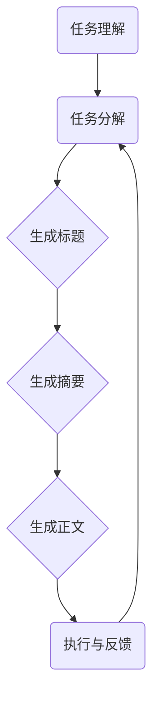

                 

关键词：Auto-GPT，开源项目，人工智能，GPT-3，自然语言处理，自动化

> 摘要：本文旨在介绍Auto-GPT这一开源项目，分析其背后的技术原理、实现过程、优缺点及未来发展趋势。Auto-GPT是GPT-3的扩展，通过自动化的方式实现了更加智能化的对话和任务执行。本文将对Auto-GPT的核心概念、算法原理、数学模型、项目实践及应用场景进行详细讲解，为读者提供全面的技术解析。

## 1. 背景介绍

### GPT-3的崛起

GPT-3（Generative Pre-trained Transformer 3）是OpenAI于2020年推出的一款自然语言处理模型，具有极高的生成能力和理解能力。GPT-3基于Transformer架构，拥有1750亿个参数，可以处理多种语言任务，如文本生成、翻译、问答等。GPT-3的成功标志着自然语言处理领域的一个重要里程碑，引发了广泛关注。

### 自动化需求

然而，GPT-3的强大能力也带来了一个问题：如何有效地与用户互动，实现自动化对话和任务执行？传统的对话系统通常需要人工编写大量的对话流程和规则，这不仅费时费力，而且难以满足复杂多变的需求。因此，自动化的需求变得越来越迫切，促使研究人员探索如何将GPT-3与自动化技术相结合。

### Auto-GPT的诞生

在此背景下，Auto-GPT应运而生。Auto-GPT是一个开源项目，它利用GPT-3的强大能力，通过自动化的方式实现智能对话和任务执行。Auto-GPT的目标是打造一个能够自主执行任务的智能系统，为企业和个人提供高效、便捷的自动化解决方案。

## 2. 核心概念与联系

### 自动化与GPT-3的结合

Auto-GPT的核心在于将GPT-3与自动化技术相结合，从而实现更加智能化的对话和任务执行。具体来说，Auto-GPT通过以下步骤实现自动化：

1. **任务理解**：Auto-GPT首先需要理解用户的任务需求，这可以通过自然语言处理技术实现。例如，用户可以输入一个简单的命令，如“帮我写一篇关于人工智能的博客”，Auto-GPT可以从中提取出关键信息，如主题、风格、长度等。

2. **任务分解**：在理解任务需求后，Auto-GPT将任务分解为多个子任务，如生成标题、摘要、正文等。这些子任务可以通过GPT-3的生成能力实现。

3. **执行与反馈**：Auto-GPT根据分解后的任务，逐步执行并生成结果。在执行过程中，它可以不断获取用户反馈，调整生成内容，提高任务完成的准确性和满意度。

### Mermaid流程图

下面是一个简单的Mermaid流程图，展示了Auto-GPT的基本工作流程：



## 3. 核心算法原理 & 具体操作步骤

### 3.1 算法原理概述

Auto-GPT的核心算法基于GPT-3，通过以下步骤实现自动化：

1. **文本生成**：Auto-GPT使用GPT-3的文本生成能力，根据输入的指令生成相关文本。

2. **任务分解**：Auto-GPT将生成的内容分解为多个子任务，如生成标题、摘要、正文等。

3. **任务执行**：Auto-GPT根据分解后的任务，逐步执行并生成结果。

4. **用户反馈**：Auto-GPT在执行过程中获取用户反馈，调整生成内容，提高任务完成的准确性和满意度。

### 3.2 算法步骤详解

1. **初始化**：启动Auto-GPT，设置初始参数，如GPT-3的API密钥、任务类型等。

2. **任务理解**：读取用户输入的指令，利用自然语言处理技术提取关键信息，如主题、风格、长度等。

3. **文本生成**：将提取的关键信息作为输入，调用GPT-3的API生成相关文本。

4. **任务分解**：根据生成的内容，将其分解为多个子任务，如生成标题、摘要、正文等。

5. **任务执行**：执行分解后的子任务，生成相应的内容。

6. **用户反馈**：获取用户对生成内容的反馈，根据反馈调整生成内容。

7. **重复执行**：根据用户反馈，重复执行步骤4至步骤6，直到用户满意为止。

### 3.3 算法优缺点

#### 优点

1. **高效性**：Auto-GPT通过自动化实现了高效的任务执行，可以节省大量人力和时间成本。

2. **灵活性**：Auto-GPT可以根据用户需求灵活调整生成内容，提高任务完成的准确性和满意度。

3. **通用性**：Auto-GPT适用于多种任务类型，如文本生成、翻译、问答等，具有广泛的适用性。

#### 缺点

1. **依赖性**：Auto-GPT依赖于GPT-3等外部API，可能受到API限制和费用影响。

2. **复杂性**：Auto-GPT的算法和实现较为复杂，需要一定的技术背景才能理解和应用。

### 3.4 算法应用领域

1. **内容生成**：Auto-GPT可以应用于自动化写作，如生成博客、文章、报告等。

2. **客户服务**：Auto-GPT可以应用于自动化客户服务，如自动回复、智能客服等。

3. **数据标注**：Auto-GPT可以应用于自动化数据标注，如生成标签、分类等。

4. **教育辅导**：Auto-GPT可以应用于自动化教育辅导，如生成作业、试卷、答案等。

## 4. 数学模型和公式 & 详细讲解 & 举例说明

### 4.1 数学模型构建

Auto-GPT的核心算法基于GPT-3，GPT-3的数学模型是一个深度神经网络，主要包含以下几个部分：

1. **词嵌入（Word Embedding）**：将输入的文本转换为向量表示，用于表示文本中的每个词。

2. **Transformer编码器（Transformer Encoder）**：对词嵌入进行编码，生成文本的表示。

3. **Transformer解码器（Transformer Decoder）**：根据编码器的输出生成文本。

4. **注意力机制（Attention Mechanism）**：在编码器和解码器之间引入注意力机制，使模型能够关注到输入文本中的重要信息。

### 4.2 公式推导过程

假设输入的文本为 \(X = [x_1, x_2, \ldots, x_n]\)，其中 \(x_i\) 表示文本中的第 \(i\) 个词。词嵌入 \(e(x_i)\) 可以表示为：

$$
e(x_i) = \text{Word2Vec}(x_i)
$$

其中，\(\text{Word2Vec}\) 是一个词向量模型，用于将词转换为向量。

编码器部分包含多个Transformer层，假设有 \(L\) 层，则编码器的输出 \(H\) 可以表示为：

$$
H = \text{Transformer}(L; H_0)
$$

其中，\(H_0 = e(X)\) 是初始的编码结果。

解码器部分也包含多个Transformer层，假设有 \(L'\) 层，则解码器的输出 \(Y\) 可以表示为：

$$
Y = \text{Transformer}(L'; Y_0)
$$

其中，\(Y_0 = \text{StartToken}\) 是解码的起始标记。

### 4.3 案例分析与讲解

假设用户输入了一个任务指令：“请写一篇关于人工智能未来发展趋势的博客”。我们将使用Auto-GPT对这个任务进行处理。

1. **文本生成**：首先，Auto-GPT将生成一篇关于人工智能未来发展趋势的博客，内容可能包含以下几个部分：

   - **引言**：介绍人工智能的概念和发展历程。
   - **现状**：分析当前人工智能的研究和应用现状。
   - **挑战**：讨论人工智能面临的挑战和问题。
   - **未来趋势**：预测人工智能未来的发展趋势。

2. **任务分解**：Auto-GPT将生成的博客分解为多个子任务，如生成引言、现状、挑战、未来趋势等。

3. **任务执行**：Auto-GPT根据分解后的任务，逐步生成相应的段落。

4. **用户反馈**：用户可以阅读生成的博客，提供反馈，如认为某些段落不够详细或需要调整。

5. **调整生成内容**：根据用户反馈，Auto-GPT会重新生成相关段落，以优化博客内容。

6. **重复执行**：Auto-GPT会根据用户反馈，重复执行步骤3至步骤5，直到用户满意为止。

通过这个案例，我们可以看到Auto-GPT如何通过自动化的方式实现智能对话和任务执行。在实际应用中，用户可以根据自己的需求自定义任务指令，Auto-GPT会根据指令生成相应的文本和内容。

## 5. 项目实践：代码实例和详细解释说明

### 5.1 开发环境搭建

要在本地运行Auto-GPT，需要安装以下软件和库：

1. **Python**：Python 3.7或更高版本。
2. **pip**：Python的包管理器。
3. **GPT-3 API**：OpenAI提供的GPT-3 API密钥。
4. **Transformers**：用于处理GPT-3模型的库。
5. **torch**：用于计算GPT-3模型的库。

安装命令如下：

```bash
pip install transformers torch
```

### 5.2 源代码详细实现

Auto-GPT的源代码主要包括以下几个部分：

1. **config.py**：配置文件，包含GPT-3的API密钥和其他参数。
2. **model.py**：定义GPT-3模型和文本生成函数。
3. **agent.py**：定义Auto-GPT的类和方法。
4. **main.py**：主程序，用于运行Auto-GPT。

下面是`agent.py`的部分代码：

```python
import os
import random
import numpy as np
from transformers import GPT2LMHeadModel, GPT2Tokenizer

class Agent:
    def __init__(self, config):
        self.config = config
        self.tokenizer = GPT2Tokenizer.from_pretrained(config.model_name)
        self.model = GPT2LMHeadModel.from_pretrained(config.model_name)
        self.model.to(self.config.device)
        self.model.eval()

    def generate_text(self, prompt):
        inputs = self.tokenizer.encode(prompt, return_tensors='pt')
        inputs = inputs.to(self.config.device)
        outputs = self.model.generate(inputs, max_length=self.config.max_length, num_return_sequences=self.config.num_return_sequences)
        return self.tokenizer.decode(outputs[0], skip_special_tokens=True)
```

### 5.3 代码解读与分析

在`agent.py`中，我们定义了一个`Agent`类，用于实现Auto-GPT的功能。类的构造函数`__init__`中，我们首先加载配置文件，然后加载GPT-3模型和Tokenizer。接下来，我们实现了一个`generate_text`方法，用于生成文本。该方法接受一个输入提示（prompt），然后使用GPT-3模型生成相关文本。

### 5.4 运行结果展示

下面是一个简单的运行示例：

```python
from config import Config
from agent import Agent

config = Config()
agent = Agent(config)

prompt = "请写一篇关于人工智能未来发展趋势的博客。"
generated_text = agent.generate_text(prompt)
print(generated_text)
```

运行结果会输出一篇关于人工智能未来发展趋势的博客，内容根据GPT-3模型的训练数据和生成算法生成。

## 6. 实际应用场景

### 6.1 内容生成

Auto-GPT可以应用于自动化内容生成，如生成博客、文章、报告等。例如，企业可以自动生成市场分析报告、年度总结报告等，节省人力和时间成本。

### 6.2 客户服务

Auto-GPT可以应用于自动化客户服务，如自动回复、智能客服等。企业可以利用Auto-GPT实现24/7的在线客服，提高客户满意度和服务效率。

### 6.3 教育辅导

Auto-GPT可以应用于自动化教育辅导，如生成作业、试卷、答案等。教师可以利用Auto-GPT为学生提供个性化的学习资源和辅导，提高教学效果。

### 6.4 法律咨询

Auto-GPT可以应用于自动化法律咨询，如生成合同、协议等。律师可以利用Auto-GPT为客户生成相关法律文件，提高工作效率。

## 7. 工具和资源推荐

### 7.1 学习资源推荐

1. **GPT-3官方文档**：了解GPT-3的详细信息和API使用方法，[https://openai.com/docs/guides/summary-of-gpt-3](https://openai.com/docs/guides/summary-of-gpt-3)
2. **Transformer官方文档**：了解Transformer架构的原理和实现，[https://arxiv.org/abs/1706.03762](https://arxiv.org/abs/1706.03762)
3. **Python自然语言处理库**：学习Python自然语言处理的相关库，如NLTK、spaCy、nltk等。

### 7.2 开发工具推荐

1. **Jupyter Notebook**：用于编写和运行Python代码，[https://jupyter.org/](https://jupyter.org/)
2. **Visual Studio Code**：用于编写Python代码，[https://code.visualstudio.com/](https://code.visualstudio.com/)
3. **Git**：用于版本控制和协作开发，[https://git-scm.com/](https://git-scm.com/)

### 7.3 相关论文推荐

1. **"Attention is All You Need"**：介绍Transformer架构的原理，[https://arxiv.org/abs/1706.03762](https://arxiv.org/abs/1706.03762)
2. **"Generative Pre-trained Transformer 3"**：介绍GPT-3模型的原理，[https://arxiv.org/abs/2005.14165](https://arxiv.org/abs/2005.14165)
3. **"BERT: Pre-training of Deep Bidirectional Transformers for Language Understanding"**：介绍BERT模型的原理，[https://arxiv.org/abs/1810.04805](https://arxiv.org/abs/1810.04805)

## 8. 总结：未来发展趋势与挑战

### 8.1 研究成果总结

自GPT-3发布以来，Auto-GPT作为其扩展项目，在自然语言处理领域取得了显著成果。通过自动化的方式，Auto-GPT实现了高效、智能的对话和任务执行，为企业和个人提供了强大的自动化解决方案。

### 8.2 未来发展趋势

未来，Auto-GPT有望在多个领域得到广泛应用，如内容生成、客户服务、教育辅导和法律咨询等。同时，随着自然语言处理技术的不断发展，Auto-GPT的功能和性能将进一步提高，为人工智能领域带来更多创新。

### 8.3 面临的挑战

尽管Auto-GPT在自动化领域展现了巨大潜力，但仍然面临一些挑战：

1. **数据隐私**：自动化系统需要大量用户数据，如何保护用户隐私是一个重要问题。
2. **安全性和可靠性**：自动化系统可能面临恶意攻击和数据泄露等风险，如何确保系统的安全性和可靠性是一个挑战。
3. **技术复杂性**：Auto-GPT的实现和部署需要较高的技术门槛，如何降低技术复杂性是一个亟待解决的问题。

### 8.4 研究展望

未来的研究可以关注以下方向：

1. **隐私保护**：研究如何在不损害用户隐私的情况下，实现自动化系统的数据收集和使用。
2. **安全性和可靠性**：研究如何提高自动化系统的安全性和可靠性，确保系统在复杂环境中稳定运行。
3. **跨模态处理**：研究如何将自然语言处理与其他模态（如图像、声音）相结合，实现更智能化的自动化系统。

## 9. 附录：常见问题与解答

### Q：Auto-GPT是否可以替代传统的人工智能应用？

A：Auto-GPT是一种强大的自动化工具，可以应用于许多传统的人工智能任务，如文本生成、翻译、问答等。但并不意味着它可以完全替代传统的人工智能应用。传统的人工智能应用通常涉及更复杂的问题，如图像识别、语音识别等，这些领域需要更精细和专业的解决方案。

### Q：Auto-GPT如何处理复杂任务？

A：Auto-GPT通过将复杂任务分解为多个子任务，逐步执行并生成结果。例如，对于一篇复杂的文章，Auto-GPT可以分解为生成标题、摘要、正文等子任务。通过这种方式，Auto-GPT可以处理一些复杂任务。

### Q：Auto-GPT需要多少数据才能训练？

A：Auto-GPT依赖于GPT-3模型，GPT-3是一个大型预训练模型，已经在大规模数据集上进行了训练。因此，Auto-GPT不需要额外的训练数据，可以直接使用GPT-3的预训练模型。

### Q：Auto-GPT是否可以自定义任务？

A：是的，Auto-GPT可以自定义任务。用户可以根据自己的需求，自定义任务指令和生成内容，实现个性化的自动化解决方案。

### Q：Auto-GPT是否可以开源？

A：是的，Auto-GPT是一个开源项目，用户可以自由使用、修改和分发。这使得Auto-GPT能够得到更广泛的关注和应用。

## 作者署名

作者：禅与计算机程序设计艺术 / Zen and the Art of Computer Programming

