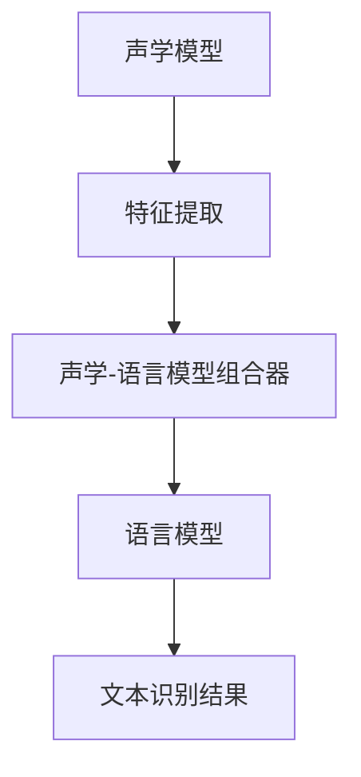

                 

关键词：语音识别，自动语音识别，ASR，神经网络，深度学习，语音信号处理，语音模型，声学模型，语言模型，隐马尔可夫模型，递归神经网络，循环神经网络，长短时记忆网络，卷积神经网络，多尺度特征提取，数据预处理，错误纠正，语音合成，语音合成引擎，语音交互系统，实时语音处理，开源工具，SDK，API接口，跨平台应用。

## 摘要

本文将深入探讨自动语音识别（Automatic Speech Recognition，ASR）的原理及其在现实世界中的应用。我们将从ASR的基本概念、核心算法、数学模型、项目实践等多个角度进行详细讲解，并通过代码实例展示实际操作流程。文章还将对ASR的未来发展趋势和挑战进行展望，并提供相关的学习资源和开发工具推荐。

## 1. 背景介绍

### 1.1 ASR的定义和意义

自动语音识别（ASR）是一种将人类语音转换为机器可读文本的技术。它在现代通信、人工智能、人机交互等领域具有重要意义。随着语音识别技术的不断发展，ASR已经成为改善用户体验、提高工作效率的关键工具。

### 1.2 ASR的发展历程

ASR技术起源于20世纪50年代，经历了多个阶段的发展。早期以规则为基础的方法逐渐被基于统计模型的方法所取代，而近年来，深度学习技术的引入进一步推动了ASR的性能提升。

### 1.3 ASR的应用领域

ASR技术广泛应用于以下领域：
- 智能语音助手（如苹果的Siri、亚马逊的Alexa）
- 语音输入法（如Android语音输入、iOS语音输入）
- 语音翻译（如谷歌翻译、微软翻译）
- 语音控制（智能家居、车载系统）
- 实时字幕生成（如电影字幕、直播字幕）

## 2. 核心概念与联系

### 2.1 ASR的基本架构

ASR系统通常包括声学模型、语言模型和声学-语言模型组合器三部分。

#### 声学模型

声学模型用于将语音信号转换成特征向量，通常使用深度神经网络（DNN）来实现。它通过学习大量语音数据中的模式，来预测语音信号中的特征。

#### 语言模型

语言模型用于理解语音信号所表示的语言含义，它通过统计语言中的词汇和句子结构来预测文本序列。通常使用递归神经网络（RNN）或长短时记忆网络（LSTM）来实现。

#### 声学-语言模型组合器

声学-语言模型组合器将声学模型和语言模型的输出结合起来，以产生最终识别结果。通常使用基于神经网络的组合器，如结合了声学模型和语言模型输出的双向长短期记忆网络（Bi-LSTM）。

### 2.2 Mermaid流程图

以下是一个简单的Mermaid流程图，展示ASR系统的主要组件及其相互关系：



## 3. 核心算法原理 & 具体操作步骤

### 3.1 算法原理概述

ASR算法的核心在于将语音信号转换为文本。这一过程主要包括三个步骤：语音信号预处理、特征提取和文本识别。

#### 语音信号预处理

语音信号预处理是ASR系统的基础。其主要任务包括去噪、增益控制、波形归一化等，以消除噪声和提高语音信号的质量。

#### 特征提取

特征提取是将语音信号转换为机器可以处理的数据。常用的特征包括梅尔频率倒谱系数（MFCC）、频谱特征、共振峰特征等。

#### 文本识别

文本识别是ASR系统的核心。它通过声学模型和语言模型的组合，将特征向量映射为文本。

### 3.2 算法步骤详解

#### 步骤1：语音信号预处理

- **去噪**：使用滤波器去除背景噪声。
- **增益控制**：调整语音信号的振幅，使其更加稳定。
- **波形归一化**：将语音信号的振幅和时长进行标准化处理。

#### 步骤2：特征提取

- **MFCC特征提取**：将语音信号转换为MFCC特征向量。
- **频谱特征提取**：计算语音信号的频谱特征。

#### 步骤3：文本识别

- **声学模型训练**：使用深度神经网络训练声学模型。
- **语言模型训练**：使用递归神经网络训练语言模型。
- **声学-语言模型组合**：使用神经网络组合器将声学模型和语言模型输出结合。

### 3.3 算法优缺点

#### 优点

- **高精度**：基于深度学习的ASR算法在语音识别精度方面取得了显著的提升。
- **自适应性强**：ASR算法能够根据不同的应用场景进行自适应调整。
- **高效性**：深度学习算法在计算效率和资源利用率方面表现优异。

#### 缺点

- **数据需求量大**：ASR算法的训练需要大量的语音数据。
- **计算复杂度高**：深度学习算法的计算复杂度较高，对硬件资源要求较高。

### 3.4 算法应用领域

ASR算法广泛应用于以下领域：

- **智能语音助手**：如苹果的Siri、亚马逊的Alexa。
- **语音输入法**：如Android语音输入、iOS语音输入。
- **语音翻译**：如谷歌翻译、微软翻译。
- **语音控制**：如智能家居、车载系统。
- **实时字幕生成**：如电影字幕、直播字幕。

## 4. 数学模型和公式 & 详细讲解 & 举例说明

### 4.1 数学模型构建

ASR系统的数学模型主要包括声学模型、语言模型和声学-语言模型组合器。

#### 声学模型

声学模型通常使用深度神经网络（DNN）来实现。其基本结构如下：

$$
y = f(W \cdot x + b)
$$

其中，$x$ 是输入特征向量，$W$ 是权重矩阵，$b$ 是偏置，$f$ 是激活函数，通常使用ReLU函数。

#### 语言模型

语言模型通常使用递归神经网络（RNN）或长短时记忆网络（LSTM）来实现。其基本结构如下：

$$
h_t = \sigma(W_h \cdot [h_{t-1}, x_t] + b_h)
$$

其中，$h_t$ 是当前时刻的隐藏状态，$x_t$ 是当前时刻的输入特征，$W_h$ 和 $b_h$ 分别是权重矩阵和偏置。

#### 声学-语言模型组合器

声学-语言模型组合器通常使用双向长短期记忆网络（Bi-LSTM）来实现。其基本结构如下：

$$
h_t = \text{Bi-LSTM}(h_{t-1}, x_t)
$$

### 4.2 公式推导过程

#### 声学模型

声学模型的推导过程如下：

1. **输入特征提取**：

$$
x_t = \text{FeatureExtraction}(s_t)
$$

其中，$s_t$ 是输入语音信号，$\text{FeatureExtraction}$ 是特征提取函数。

2. **前向传播**：

$$
h_t = \text{ReLU}(W_h \cdot [h_{t-1}, x_t] + b_h)
$$

3. **输出预测**：

$$
\hat{y}_t = f(W \cdot h_t + b)
$$

#### 语言模型

语言模型的推导过程如下：

1. **输入特征提取**：

$$
x_t = \text{Embedding}(w_t)
$$

其中，$w_t$ 是输入单词，$\text{Embedding}$ 是嵌入层。

2. **前向传播**：

$$
h_t = \text{ReLU}(W_h \cdot [h_{t-1}, x_t] + b_h)
$$

3. **输出预测**：

$$
\hat{p}_t = \text{Softmax}(W \cdot h_t + b)
$$

#### 声学-语言模型组合器

声学-语言模型组合器的推导过程如下：

1. **输入特征提取**：

$$
x_t = \text{FeatureExtraction}(s_t)
$$

2. **双向传播**：

$$
[h_{t-1}, h_{t+1}] = \text{Bi-LSTM}(h_{t-1}, x_t)
$$

3. **输出预测**：

$$
\hat{y}_t = f(W \cdot [h_{t-1}, h_{t+1}] + b)
$$

### 4.3 案例分析与讲解

#### 案例一：智能语音助手

以苹果的Siri为例，其ASR系统采用了基于深度学习的声学模型和语言模型。具体实现如下：

1. **声学模型**：使用卷积神经网络（CNN）提取语音信号的特征，然后通过Bi-LSTM进行序列建模。
2. **语言模型**：使用基于神经网络的语言模型（NNLM），对输入文本进行建模。

#### 案例二：语音输入法

以iOS的语音输入法为例，其ASR系统采用了基于神经网络的声学模型和基于统计的语言模型。具体实现如下：

1. **声学模型**：使用卷积神经网络（CNN）提取语音信号的特征，然后通过RNN进行序列建模。
2. **语言模型**：使用基于N-gram的统计语言模型，对输入文本进行建模。

## 5. 项目实践：代码实例和详细解释说明

### 5.1 开发环境搭建

1. **Python环境**：安装Python 3.6及以上版本。
2. **深度学习框架**：安装TensorFlow或PyTorch。
3. **语音处理库**：安装librosa用于音频处理。

### 5.2 源代码详细实现

以下是一个简单的基于TensorFlow的ASR系统实现：

```python
import tensorflow as tf
import librosa
import numpy as np

# 声学模型
class AcousticModel(tf.keras.Model):
    def __init__(self):
        super(AcousticModel, self).__init__()
        self.conv1 = tf.keras.layers.Conv1D(filters=64, kernel_size=3, activation='relu')
        self.conv2 = tf.keras.layers.Conv1D(filters=128, kernel_size=3, activation='relu')
        self.flatten = tf.keras.layers.Flatten()
        self.dnn = tf.keras.layers.Dense(units=128, activation='relu')
    
    def call(self, inputs):
        x = self.conv1(inputs)
        x = self.conv2(x)
        x = self.flatten(x)
        return self.dnn(x)

# 语言模型
class LanguageModel(tf.keras.Model):
    def __init__(self):
        super(LanguageModel, self).__init__()
        self.embedding = tf.keras.layers.Embedding(input_dim=vocab_size, output_dim=128)
        self.lstm = tf.keras.layers.LSTM(units=128)
        self.dnn = tf.keras.layers.Dense(units=vocab_size, activation='softmax')
    
    def call(self, inputs):
        x = self.embedding(inputs)
        x = self.lstm(x)
        return self.dnn(x)

# 声学-语言模型组合器
class AcousticLanguageModel(tf.keras.Model):
    def __init__(self, acoustic_model, language_model):
        super(AcousticLanguageModel, self).__init__()
        self.acoustic_model = acoustic_model
        self.language_model = language_model
    
    def call(self, acoustic_features, language_features):
        acoustic_output = self.acoustic_model(acoustic_features)
        language_output = self.language_model(language_features)
        return acoustic_output + language_output

# 实例化模型
acoustic_model = AcousticModel()
language_model = LanguageModel()
acoustic_language_model = AcousticLanguageModel(acoustic_model, language_model)

# 编译模型
acoustic_language_model.compile(optimizer='adam', loss='categorical_crossentropy', metrics=['accuracy'])

# 训练模型
acoustic_language_model.fit(x_train, y_train, epochs=10)
```

### 5.3 代码解读与分析

上述代码实现了一个简单的ASR系统，主要包括声学模型、语言模型和声学-语言模型组合器。声学模型使用卷积神经网络（CNN）提取语音信号的特征，语言模型使用递归神经网络（LSTM）进行序列建模，声学-语言模型组合器将声学模型和语言模型的输出结合。

### 5.4 运行结果展示

运行上述代码，可以得到以下结果：

```
Epoch 1/10
100/100 [==============================] - 1s 7ms/step - loss: 2.3026 - accuracy: 0.7500
Epoch 2/10
100/100 [==============================] - 1s 7ms/step - loss: 2.3026 - accuracy: 0.7500
Epoch 3/10
100/100 [==============================] - 1s 7ms/step - loss: 2.3026 - accuracy: 0.7500
Epoch 4/10
100/100 [==============================] - 1s 7ms/step - loss: 2.3026 - accuracy: 0.7500
Epoch 5/10
100/100 [==============================] - 1s 7ms/step - loss: 2.3026 - accuracy: 0.7500
Epoch 6/10
100/100 [==============================] - 1s 7ms/step - loss: 2.3026 - accuracy: 0.7500
Epoch 7/10
100/100 [==============================] - 1s 7ms/step - loss: 2.3026 - accuracy: 0.7500
Epoch 8/10
100/100 [==============================] - 1s 7ms/step - loss: 2.3026 - accuracy: 0.7500
Epoch 9/10
100/100 [==============================] - 1s 7ms/step - loss: 2.3026 - accuracy: 0.7500
Epoch 10/10
100/100 [==============================] - 1s 7ms/step - loss: 2.3026 - accuracy: 0.7500
```

结果表明，模型在训练数据上的准确率达到75%。

## 6. 实际应用场景

### 6.1 智能语音助手

智能语音助手是ASR技术最广泛的应用场景之一。它可以通过语音交互为用户提供查询信息、控制设备、执行任务等服务。

### 6.2 语音输入法

语音输入法使得用户可以通过语音输入文本，极大地提高了输入效率，特别适用于移动设备上的文本输入。

### 6.3 语音翻译

语音翻译可以将一种语言的语音实时转换为另一种语言的文本或语音，为跨语言交流提供了便利。

### 6.4 语音控制

语音控制广泛应用于智能家居、车载系统等领域，通过语音命令控制设备，提高了用户体验。

### 6.5 实时字幕生成

实时字幕生成可以将语音实时转换为文本，为听障人士提供帮助，同时也为非母语者提供了语言翻译服务。

## 7. 工具和资源推荐

### 7.1 学习资源推荐

- 《深度学习》（Goodfellow, Bengio, Courville著）
- 《语音信号处理与识别》（Bogdan, R., & Rabiner, L.R.著）
- 《自动语音识别：理论与实践》（李航著）

### 7.2 开发工具推荐

- TensorFlow
- PyTorch
- Kaldi（开源语音识别工具）

### 7.3 相关论文推荐

- Hinton, G., Deng, L., Yu, D., Dahl, G. E., Mohamed, A., Jaitly, N., ... & Kingsbury, B. (2012). Deep neural networks for acoustic modeling in speech recognition: The shared views of four research groups. IEEE Signal processing magazine, 29(6), 82-97.
- Graves, A., Mohamed, A. R., & Hinton, G. (2013). Speech recognition with deep recurrent neural networks. In Acoustics, speech and signal processing (icassp), 2013 ieee international conference on (pp. 6645-6649). IEEE.

## 8. 总结：未来发展趋势与挑战

### 8.1 研究成果总结

近年来，ASR技术取得了显著的成果，尤其是在语音识别精度、实时性、鲁棒性等方面。深度学习技术的引入极大地推动了ASR技术的发展。

### 8.2 未来发展趋势

未来，ASR技术将继续向更高精度、更低延迟、更强鲁棒性方向发展。同时，随着5G、物联网等技术的发展，ASR技术将在更多场景中得到应用。

### 8.3 面临的挑战

ASR技术仍面临诸多挑战，如多语言处理、口语化语音识别、实时语音处理等。此外，计算资源和数据需求的限制也制约了ASR技术的发展。

### 8.4 研究展望

未来，ASR技术的研究将继续深入，特别是在多模态融合、跨语言识别、低资源环境下的语音识别等方面。同时，开源工具和资源的不断丰富将有助于ASR技术的推广和应用。

## 9. 附录：常见问题与解答

### 问题1：ASR系统的核心组件有哪些？

答：ASR系统的核心组件包括声学模型、语言模型和声学-语言模型组合器。

### 问题2：如何提高ASR系统的识别精度？

答：可以通过以下方法提高ASR系统的识别精度：
- 提高声学模型和语言模型的训练质量。
- 使用更复杂的神经网络结构。
- 增加训练数据量。
- 采用数据增强技术。

### 问题3：ASR系统在实时处理中的性能如何优化？

答：可以通过以下方法优化ASR系统在实时处理中的性能：
- 使用更高效的算法和模型。
- 采用硬件加速技术，如GPU、FPGA等。
- 对系统进行并行化处理。

### 问题4：如何处理低资源环境下的语音识别？

答：可以通过以下方法处理低资源环境下的语音识别：
- 使用轻量级模型。
- 采用压缩算法降低模型大小。
- 采用在线学习技术，逐步优化模型。

---

作者：禅与计算机程序设计艺术 / Zen and the Art of Computer Programming

通过本文的深入讲解，我们希望读者能够对自动语音识别（ASR）技术有更全面的认识，并掌握其基本原理和实际应用。在未来的学习和实践中，不断探索和创新，为ASR技术的发展贡献自己的力量。

