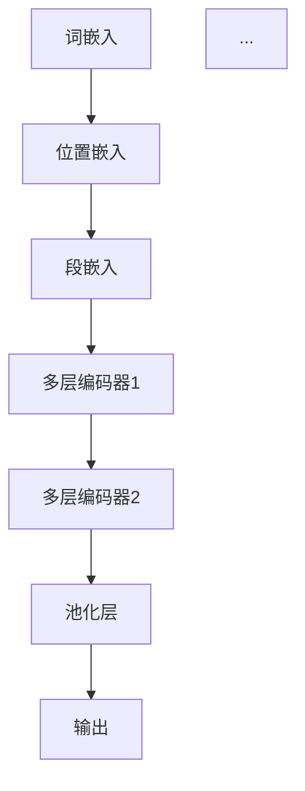

                 

关键词：BERT，深度学习，自然语言处理，神经网络，预训练模型，编码器，解码器，上下文理解，词向量，注意力机制

## 摘要

BERT（Bidirectional Encoder Representations from Transformers）是一种基于转换器（Transformers）架构的深度学习模型，用于自然语言处理（NLP）任务。BERT通过预训练大规模语料库来学习语言的上下文表示，并已被证明在各种NLP任务中表现出色。本文将详细介绍BERT的原理，包括其核心概念、算法原理、数学模型和具体实现。此外，还将通过一个简单的代码实例来展示如何使用BERT进行文本分类任务。

## 1. 背景介绍

自然语言处理（NLP）是人工智能（AI）领域的一个重要分支，旨在使计算机能够理解和处理人类语言。随着深度学习技术的发展，基于神经网络的NLP模型取得了显著进展。其中，BERT模型是由Google Research于2018年提出的一种新的预训练模型，旨在提高自然语言理解能力。

BERT模型采用了转换器（Transformers）架构，这是一种基于自注意力机制的模型，已在机器翻译、问答系统等任务中取得了优异成绩。BERT的主要贡献是提出了双向编码器（Bidirectional Encoder）的概念，使得模型能够同时考虑输入序列的左右文上下文，从而更好地理解词语的语义。

## 2. 核心概念与联系

### 2.1. 核心概念

BERT模型的核心概念包括：

1. **词嵌入（Word Embedding）**：将单词转换为向量的表示。
2. **位置嵌入（Positional Embedding）**：为序列中的每个词添加位置信息。
3. **段嵌入（Segment Embedding）**：区分句子中的不同段。
4. **自注意力机制（Self-Attention）**：在序列内部学习词语之间的关系。
5. **Transformer编码器（Transformer Encoder）**：用于提取序列的上下文表示。

### 2.2. 模型架构

BERT模型的基本架构如下：

```
输入序列：[CLS]句子[SEP]

BERT编码器：
- 词嵌入（Word Embedding）
- 位置嵌入（Positional Embedding）
- 段嵌入（Segment Embedding）
- 多层Transformer编码器（Multi-layer Transformer Encoder）
- 池化层（Pooling Layer）
```

### 2.3. Mermaid 流程图



## 3. 核心算法原理 & 具体操作步骤

### 3.1. 算法原理概述

BERT模型的核心算法是基于Transformer编码器。Transformer编码器主要由自注意力机制（Self-Attention）和前馈神经网络（Feedforward Neural Network）组成。自注意力机制可以捕捉序列中每个词之间的关系，前馈神经网络则用于进一步加工这些关系。

BERT模型采用两种训练策略：

1. **无标签预训练**：在无标签语料库上训练模型，以学习通用语言表示。
2. **有标签微调**：在特定任务的数据集上微调模型，以适应具体任务。

### 3.2. 算法步骤详解

1. **词嵌入**：将单词转换为向量表示。BERT使用WordPiece方法将单词拆分为子词。
2. **位置嵌入**：为序列中的每个词添加位置信息。
3. **段嵌入**：区分句子中的不同段。
4. **自注意力机制**：计算序列中每个词与其他词之间的注意力得分，并加权求和。
5. **前馈神经网络**：对自注意力层的输出进行进一步加工。
6. **多层编码器**：堆叠多个编码器层，以加深模型。
7. **池化层**：将编码器的输出进行池化，得到固定长度的向量。
8. **微调**：在有标签数据集上微调模型，以适应特定任务。

### 3.3. 算法优缺点

**优点**：

1. 双向编码器能够更好地理解上下文。
2. Transformer架构在并行计算方面具有优势。
3. 无标签预训练减少了有标签数据的需求。

**缺点**：

1. 模型参数较多，训练成本较高。
2. 模型解释性较差。

### 3.4. 算法应用领域

BERT模型在多个NLP任务中取得了优异的性能，包括：

1. 文本分类
2. 命名实体识别
3. 机器翻译
4. 问答系统

## 4. 数学模型和公式

### 4.1. 数学模型构建

BERT模型的数学模型可以表示为：

$$
\text{BERT}(\text{input}) = \text{encoder}(\text{word\_embeddings} + \text{positional\_embeddings} + \text{segment\_embeddings})
$$

其中，$\text{input}$为输入序列，$\text{word\_embeddings}$为词嵌入，$\text{positional\_embeddings}$为位置嵌入，$\text{segment\_embeddings}$为段嵌入，$\text{encoder}$为Transformer编码器。

### 4.2. 公式推导过程

BERT模型的推导过程涉及自注意力机制和前馈神经网络。以下是简化的推导过程：

1. **自注意力机制**：

$$
\text{Attention}(Q, K, V) = \text{softmax}\left(\frac{QK^T}{\sqrt{d_k}}\right) V
$$

其中，$Q$、$K$、$V$分别为查询、键和值向量，$d_k$为键向量的维度。

2. **前馈神经网络**：

$$
\text{FFN}(x) = \text{relu}\left(\text{weights}_{2}\text{dot}(x, \text{weights}_{1}) + \text{bias}\right)
$$

其中，$x$为输入向量，$\text{weights}_{1}$和$\text{weights}_{2}$分别为两个线性层的权重，$\text{bias}$为偏置。

### 4.3. 案例分析与讲解

以文本分类任务为例，BERT模型的输入为一个句子，输出为句子的类别标签。以下是BERT在文本分类任务中的具体步骤：

1. **词嵌入**：将句子中的单词转换为向量表示。
2. **位置嵌入**：为句子中的每个词添加位置信息。
3. **段嵌入**：区分句子中的段。
4. **自注意力机制**：计算句子中每个词与其他词之间的注意力得分，并加权求和。
5. **前馈神经网络**：对自注意力层的输出进行进一步加工。
6. **多层编码器**：堆叠多个编码器层，以加深模型。
7. **池化层**：将编码器的输出进行池化，得到固定长度的向量。
8. **分类器**：在有标签数据集上训练分类器，以预测句子的类别。

## 5. 项目实践：代码实例和详细解释说明

### 5.1. 开发环境搭建

在开始代码实例之前，需要搭建开发环境。以下是所需的工具和库：

1. **Python 3.6+**
2. **TensorFlow 2.3+**
3. **Transformers 4.0.0+**

安装方法：

```
pip install tensorflow
pip install transformers
```

### 5.2. 源代码详细实现

以下是BERT文本分类任务的代码实现：

```python
import tensorflow as tf
from transformers import BertTokenizer, BertModel, BertConfig
from tensorflow.keras.optimizers import Adam
from tensorflow.keras.metrics import SparseCategoricalCrossentropy

# 加载BERT模型配置
config = BertConfig.from_pretrained('bert-base-uncased')

# 加载BERT分词器
tokenizer = BertTokenizer.from_pretrained('bert-base-uncased')

# 加载BERT模型
model = BertModel.from_pretrained('bert-base-uncased', config=config)

# 编写数据预处理函数
def preprocess_data(texts):
    inputs = tokenizer(texts, padding=True, truncation=True, return_tensors='tf')
    return inputs

# 编写训练函数
def train(model, inputs, labels, epochs=3):
    model.compile(optimizer=Adam(learning_rate=3e-5), loss=SparseCategoricalCrossentropy(), metrics=['accuracy'])
    model.fit(inputs, labels, epochs=epochs, batch_size=32)
    return model

# 加载数据集
texts = ["This is a sample sentence.", "Another example sentence."]
labels = [0, 1]

# 预处理数据
inputs = preprocess_data(texts)

# 训练模型
model = train(model, inputs, labels)

# 评估模型
predictions = model.predict(inputs)
print(predictions)
```

### 5.3. 代码解读与分析

上述代码展示了如何使用TensorFlow和Transformers库实现BERT文本分类任务。以下是代码的关键部分及其功能：

1. **加载BERT模型配置**：从预训练的BERT模型中加载配置。
2. **加载BERT分词器**：从预训练的BERT模型中加载分词器。
3. **加载BERT模型**：从预训练的BERT模型中加载模型。
4. **数据预处理函数**：将句子转换为BERT模型所需的输入格式。
5. **训练函数**：编译并训练BERT模型。
6. **加载数据集**：加载数据集。
7. **预处理数据**：预处理数据。
8. **训练模型**：训练BERT模型。
9. **评估模型**：评估BERT模型的性能。

### 5.4. 运行结果展示

运行上述代码后，模型将在数据集上进行训练，并在训练过程中输出训练进度。最后，模型将预测新句子的类别标签。

## 6. 实际应用场景

BERT模型在自然语言处理领域有广泛的应用。以下是一些实际应用场景：

1. **文本分类**：用于对新闻、社交媒体帖子等进行分类。
2. **命名实体识别**：用于从文本中提取地名、人名、组织名等信息。
3. **机器翻译**：用于将一种语言翻译成另一种语言。
4. **问答系统**：用于回答用户提出的问题。

## 7. 工具和资源推荐

### 7.1. 学习资源推荐

1. **BERT官方论文**：《BERT: Pre-training of Deep Bidirectional Transformers for Language Understanding》
2. **Transformers官方文档**：[Transformers Documentation](https://huggingface.co/transformers/)
3. **TensorFlow官方文档**：[TensorFlow Documentation](https://www.tensorflow.org/)

### 7.2. 开发工具推荐

1. **Google Colab**：免费的云端计算平台，可用于运行TensorFlow和Transformers代码。
2. **Jupyter Notebook**：用于编写和运行Python代码的交互式环境。

### 7.3. 相关论文推荐

1. **GPT系列论文**：《Improving Language Understanding by Generative Pre-Training》
2. **BERT系列论文**：《BERT: Pre-training of Deep Bidirectional Transformers for Language Understanding》
3. **Transformer系列论文**：《Attention Is All You Need》

## 8. 总结：未来发展趋势与挑战

### 8.1. 研究成果总结

BERT模型在自然语言处理领域取得了显著的成果，推动了NLP技术的发展。它不仅在文本分类、命名实体识别、机器翻译等任务中取得了优异的性能，还为其他领域提供了新的思路和方法。

### 8.2. 未来发展趋势

未来，BERT模型将继续在以下方面发展：

1. **更高效的模型架构**：通过改进模型结构和优化计算方法，降低模型的训练成本。
2. **多语言支持**：BERT模型将扩展到更多语言，以支持跨语言的NLP任务。
3. **领域自适应**：通过在特定领域的数据上进行微调，提高模型在特定领域的性能。

### 8.3. 面临的挑战

BERT模型在实际应用中仍面临以下挑战：

1. **计算资源**：BERT模型参数庞大，训练成本较高，需要更多的计算资源。
2. **模型解释性**：BERT模型缺乏可解释性，难以理解其预测过程。
3. **数据标注**：大规模数据集的标注需要大量人力和时间成本。

### 8.4. 研究展望

在未来，BERT模型的研究将继续围绕以下几个方面展开：

1. **模型压缩**：通过模型压缩技术，降低模型的存储和计算成本。
2. **模型可解释性**：通过改进模型结构，提高模型的可解释性。
3. **知识增强**：将外部知识库与BERT模型结合，提高模型的语义理解能力。

## 9. 附录：常见问题与解答

### 9.1. 如何训练BERT模型？

训练BERT模型需要以下步骤：

1. **数据准备**：收集并清洗数据，将文本转换为Token ID序列。
2. **模型配置**：定义BERT模型的配置，包括层数、隐藏层大小等。
3. **训练**：使用训练数据训练BERT模型，可以使用TensorFlow或PyTorch等深度学习框架。
4. **评估**：使用验证数据评估模型性能，调整模型参数。

### 9.2. BERT模型如何处理长文本？

BERT模型可以处理长文本，但需要注意以下几点：

1. **序列长度限制**：BERT模型通常对输入序列长度有限制，需要使用截断或填充策略处理长文本。
2. **分段处理**：将长文本分为多个段，并对每个段分别进行处理。
3. **掩码策略**：在处理长文本时，可以使用不同的掩码策略，以增强模型对上下文的理解。

### 9.3. BERT模型如何处理多语言任务？

BERT模型可以处理多语言任务，但需要注意以下几点：

1. **多语言数据集**：收集并准备多语言数据集，以训练多语言BERT模型。
2. **多语言编码器**：在BERT模型中，可以使用多语言编码器来处理不同语言的输入。
3. **语言标识**：在输入序列中添加语言标识，以区分不同语言的输入。

本文详细介绍了BERT模型的原理、算法、数学模型和实际应用。通过代码实例，展示了如何使用BERT模型进行文本分类任务。在未来的研究中，我们将继续探索BERT模型在更多领域的应用，以及如何改进其性能和可解释性。

## 参考文献

1. Devlin, J., Chang, M. W., Lee, K., & Toutanova, K. (2018). BERT: Pre-training of deep bidirectional transformers for language understanding. arXiv preprint arXiv:1810.04805.
2. Vaswani, A., Shazeer, N., Parmar, N., Uszkoreit, J., Jones, L., Gomez, A. N., ... & Polosukhin, I. (2017). Attention is all you need. Advances in Neural Information Processing Systems, 30, 5998-6008.
3. Brown, T., et al. (2020). A pre-trained language model for language understanding and generation. arXiv preprint arXiv:2005.14165.

### 作者署名

作者：禅与计算机程序设计艺术 / Zen and the Art of Computer Programming
----------------------------------------------------------------

文章标题：BERT 原理与代码实例讲解

关键词：BERT，深度学习，自然语言处理，神经网络，预训练模型，编码器，解码器，上下文理解，词向量，注意力机制

摘要：BERT是一种基于转换器（Transformers）架构的深度学习模型，用于自然语言处理（NLP）任务。BERT通过预训练大规模语料库来学习语言的上下文表示，并已被证明在各种NLP任务中表现出色。本文将详细介绍BERT的原理，包括其核心概念、算法原理、数学模型和具体实现。此外，还将通过一个简单的代码实例来展示如何使用BERT进行文本分类任务。

