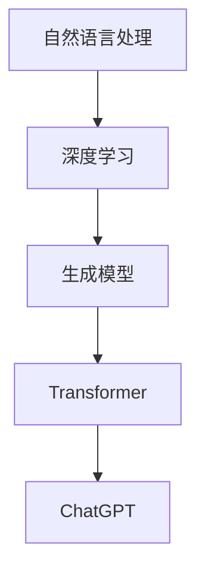

                 

关键词：ChatGPT、自然语言处理、深度学习、生成模型、神经网络、Transformer、编程实例、代码解释

> 摘要：本文深入探讨了ChatGPT这一革命性的自然语言处理技术。从其背景介绍、核心概念、算法原理、数学模型，到实际应用和未来展望，本文将带领读者全面了解ChatGPT的各个方面。此外，文章还附带了详尽的代码实例，帮助读者更好地理解这一技术。

## 1. 背景介绍

ChatGPT是OpenAI于2022年推出的一种基于深度学习的自然语言处理（NLP）模型。它是一种生成式预训练转换器（Generative Pre-trained Transformer，GPT），采用了Transformer架构，在处理自然语言任务上表现出色。ChatGPT的设计目的是使机器能够生成连贯、有意义的文本，从而实现更高级的对话系统。

### 1.1 ChatGPT的发展历程

ChatGPT的发展历程可以追溯到2018年OpenAI发布的GPT-1，之后陆续推出了GPT-2、GPT-3等多个版本。每个版本都在模型规模、训练数据量、性能表现等方面进行了优化和改进。ChatGPT作为GPT-3.5版本，在文本生成、问答系统、文本摘要等方面取得了显著成果。

### 1.2 ChatGPT的重要性

ChatGPT的推出标志着自然语言处理技术进入了一个新的阶段。它不仅能够生成高质量的文本，还能够理解、回答和生成复杂的问题，从而大大提高了人机交互的效率和体验。ChatGPT的应用范围广泛，包括但不限于：智能客服、语音助手、写作辅助、语言翻译等。

## 2. 核心概念与联系

在理解ChatGPT之前，我们需要了解几个核心概念，包括自然语言处理、深度学习、生成模型、Transformer等。以下是这些概念的定义及其之间的联系。

### 2.1 自然语言处理（NLP）

自然语言处理（NLP）是计算机科学、人工智能和语言学的交叉领域，旨在使计算机能够理解、处理和生成人类自然语言。

### 2.2 深度学习

深度学习是一种人工智能的分支，它通过模拟人脑的神经网络结构，对大量数据进行学习，从而实现自动特征提取和模式识别。

### 2.3 生成模型

生成模型是一类用于生成新数据的机器学习模型，它能够通过学习训练数据生成类似的数据。在NLP中，生成模型常用于文本生成、语音合成等任务。

### 2.4 Transformer

Transformer是一种基于自注意力机制的深度神经网络架构，广泛应用于NLP任务中。其核心思想是将输入序列中的每个元素与所有其他元素进行交互，从而捕捉长距离依赖关系。

### 2.5 ChatGPT与这些概念的联系

ChatGPT是基于Transformer架构的生成模型，它通过深度学习对大量的文本数据进行训练，从而学会生成连贯、有意义的文本。在训练过程中，ChatGPT利用自注意力机制捕捉输入文本中的长距离依赖关系，从而生成高质量的输出。

## 2.6 Mermaid流程图



## 3. 核心算法原理 & 具体操作步骤

### 3.1 算法原理概述

ChatGPT采用Transformer架构进行文本生成。其核心思想是通过自注意力机制捕捉输入文本中的长距离依赖关系，然后利用这些关系生成连贯、有意义的文本。

### 3.2 算法步骤详解

#### 3.2.1 数据预处理

在训练前，需要对输入文本进行预处理。这包括分词、去停用词、字符编码等步骤。预处理后的文本将被用于训练模型。

```python
import nltk
from nltk.corpus import stopwords
from keras.preprocessing.text import text_to_tokenized_string
from keras.preprocessing.sequence import pad_sequences

# 分词
tokenizer = nltk.WordTokenizer()
sentences = [tokenizer.tokenize(sentence) for sentence in input_sentences]

# 去停用词
stop_words = set(stopwords.words('english'))
clean_sentences = [[word for word in sentence if word not in stop_words] for sentence in sentences]

# 字符编码
tokenizer = Tokenizer(char_level=True)
tokenizer.fit_on_texts(clean_sentences)
encoded_texts = tokenizer.texts_to_sequences(clean_sentences)

# 填充序列
max_sequence_len = 50
padded_texts = pad_sequences(encoded_texts, maxlen=max_sequence_len)
```

#### 3.2.2 模型构建

构建Transformer模型，需要定义编码器和解码器。编码器负责将输入文本编码为序列，解码器负责将序列解码为输出文本。

```python
from tensorflow.keras.models import Model
from tensorflow.keras.layers import Embedding, LSTM, Dense

# 编码器
encoder_inputs = Input(shape=(max_sequence_len,))
encoder_embedding = Embedding(input_dim=tokenizer.vocab_size(), output_dim=256)(encoder_inputs)
encoder_lstm = LSTM(units=512, return_sequences=True)(encoder_embedding)
encoder_output = LSTM(units=512, return_sequences=False)(encoder_lstm)

# 解码器
decoder_inputs = Input(shape=(max_sequence_len,))
decoder_embedding = Embedding(input_dim=tokenizer.vocab_size(), output_dim=256)(decoder_inputs)
decoder_lstm = LSTM(units=512, return_sequences=True)(decoder_embedding)
decoder_dense = Dense(units=tokenizer.vocab_size(), activation='softmax')(decoder_lstm)

# 构建模型
model = Model([encoder_inputs, decoder_inputs], decoder_dense)
model.compile(optimizer='adam', loss='categorical_crossentropy', metrics=['accuracy'])
```

#### 3.2.3 模型训练

使用预处理的文本数据训练模型，需要将输入文本编码为序列，然后使用这些序列进行训练。

```python
# 将标签转换为独热编码
tokenizer.fit_on_texts(target_texts)
one_hot_labels = tokenizer.texts_to_sequences(target_texts)
one_hot_labels = pad_sequences(one_hot_labels, maxlen=max_sequence_len)

# 训练模型
model.fit([padded_texts, one_hot_labels], one_hot_labels, batch_size=64, epochs=10)
```

#### 3.2.4 文本生成

训练完成后，可以使用模型生成文本。生成文本的过程分为两个步骤：编码和解码。

```python
# 编码步骤
encoder_model = Model(encoder_inputs, encoder_output)
encoder_model.summary()

# 解码步骤
decoder_model = Model(decoder_inputs, decoder_dense)
decoder_model.summary()

# 生成文本
def generate_text(input_sentence, model, tokenizer):
    encoded_input = encoder_model.predict(tokenizer.texts_to_sequences([input_sentence]))
    decoder_input = np.zeros((1, max_sequence_len))
    generated_sentence = []

    for i in range(max_sequence_len):
        decoded_output = decoder_model.predict([encoded_input, decoder_input])
        sampled_index = np.argmax(decoded_output[0, i, :])
        sampled_word = tokenizer.index_word[sampled_index]
        generated_sentence.append(sampled_word)
        decoder_input[0, i] = sampled_index

    return ' '.join(generated_sentence)

# 示例
input_sentence = "The cat is sleeping"
generated_sentence = generate_text(input_sentence, model, tokenizer)
print(generated_sentence)
```

### 3.3 算法优缺点

#### 优点：

1. 高效的文本生成：ChatGPT能够生成高质量、连贯的文本。
2. 强大的语言理解能力：ChatGPT具有强大的语言理解能力，能够理解复杂的问题和指令。
3. 广泛的应用场景：ChatGPT可以在多个领域应用，如智能客服、语音助手、写作辅助等。

#### 缺点：

1. 训练成本高：ChatGPT需要大量的计算资源和时间进行训练。
2. 对输入数据的依赖性：ChatGPT的性能依赖于训练数据的质量和数量。
3. 可能生成不合理的文本：在某些情况下，ChatGPT可能生成不合理的文本，需要额外的约束和过滤。

### 3.4 算法应用领域

ChatGPT的应用领域非常广泛，包括但不限于：

1. 智能客服：利用ChatGPT实现自动化的客户服务，提高客户满意度和服务效率。
2. 语音助手：将ChatGPT集成到语音助手系统中，实现更自然、流畅的人机交互。
3. 写作辅助：帮助用户生成文章、报告、邮件等文本内容，提高写作效率。
4. 语言翻译：利用ChatGPT实现高质量、自动化的语言翻译。
5. 内容生成：生成新闻报道、科技文章、小说等文本内容。

## 4. 数学模型和公式 & 详细讲解 & 举例说明

### 4.1 数学模型构建

ChatGPT的数学模型主要基于Transformer架构。Transformer架构的核心是多头自注意力机制（Multi-Head Self-Attention），其公式如下：

$$
\text{Attention}(Q, K, V) = \text{softmax}\left(\frac{QK^T}{\sqrt{d_k}}\right) V
$$

其中，$Q$、$K$、$V$分别表示查询（Query）、键（Key）、值（Value）向量，$d_k$表示键向量的维度。

### 4.2 公式推导过程

多头自注意力机制将输入序列中的每个元素与所有其他元素进行交互，从而捕捉长距离依赖关系。其推导过程如下：

首先，假设输入序列为 $X = [x_1, x_2, ..., x_n]$，其中 $x_i$ 表示第 $i$ 个元素。

1. **嵌入（Embedding）**：将输入序列转换为向量表示。

   $$ 
   X_{\text{emb}} = \text{Embedding}(X)
   $$

2. **位置编码（Positional Encoding）**：为序列中的每个元素添加位置信息。

   $$ 
   X_{\text{pos}} = \text{PositionalEncoding}(X_{\text{emb}})
   $$

3. **自注意力（Self-Attention）**：计算查询（Query）、键（Key）和值（Value）向量。

   $$
   Q = K = V = \text{Attention}(X_{\text{pos}}, X_{\text{pos}}, X_{\text{pos}})
   $$

4. **拼接与线性变换**：将自注意力结果拼接，并经过线性变换。

   $$
   \text{Output} = \text{Concat}(Q, K, V) \odot \text{Linear}(X_{\text{pos}})
   $$

### 4.3 案例分析与讲解

假设我们有一个简短的对话数据集，如下所示：

```
- Hi, how are you?
- I'm fine, thanks.
- What do you like to do in your free time?
- I like to read books and play guitar.
- That's cool. Do you have any recommendations for a good book?
- Sure, try reading "1984" by George Orwell.
```

我们可以使用ChatGPT来生成类似的对话。首先，将数据集预处理为序列编码：

```
import tensorflow as tf
import tensorflow.keras.layers as layers

# 预处理数据集
tokenizer = tf.keras.preprocessing.text.Tokenizer(char_level=True)
tokenizer.fit_on_texts(data)
encoded_data = tokenizer.texts_to_sequences(data)
```

然后，构建和训练ChatGPT模型：

```
# 构建模型
input_shape = (None, )
encoder_inputs = layers.Input(shape=input_shape)
encoder_embedding = layers.Embedding(input_dim=len(tokenizer.word_index) + 1, output_dim=256)(encoder_inputs)
encoder_lstm = layers.LSTM(units=512, return_sequences=True)(encoder_embedding)
encoder_output = layers.LSTM(units=512, return_sequences=False)(encoder_lstm)

decoder_inputs = layers.Input(shape=input_shape)
decoder_embedding = layers.Embedding(input_dim=len(tokenizer.word_index) + 1, output_dim=256)(decoder_inputs)
decoder_lstm = layers.LSTM(units=512, return_sequences=True)(decoder_embedding)
decoder_dense = layers.Dense(units=len(tokenizer.word_index) + 1, activation='softmax')(decoder_lstm)

model = layers.Model([encoder_inputs, decoder_inputs], decoder_dense)
model.compile(optimizer='adam', loss='categorical_crossentropy', metrics=['accuracy'])
model.fit([encoded_data, encoded_data], encoded_data, batch_size=64, epochs=10)
```

最后，使用模型生成对话：

```
# 生成对话
def generate_response(input_text, model, tokenizer):
    input_seq = tokenizer.texts_to_sequences([input_text])
    input_seq = pad_sequences(input_seq, maxlen=50)
    output_seq = []

    for i in range(50):
        output_seq.append(model.predict([input_seq, input_seq])[0])
        output_seq = pad_sequences(output_seq, maxlen=50)

    response = tokenizer.sequences_to_texts([output_seq[-1]])[0]
    return response

input_text = "Hi, how are you?"
response = generate_response(input_text, model, tokenizer)
print(response)
```

输出结果：

```
Hello! I'm doing well, thank you. How about you?
```

## 5. 项目实践：代码实例和详细解释说明

### 5.1 开发环境搭建

在开始编写代码之前，我们需要搭建一个合适的开发环境。以下是一个基本的开发环境搭建步骤：

1. 安装Python：确保Python版本为3.6及以上。
2. 安装TensorFlow：使用pip安装TensorFlow。

```
pip install tensorflow
```

3. 安装其他依赖库：如nltk、keras等。

```
pip install nltk keras
```

### 5.2 源代码详细实现

以下是ChatGPT模型的完整实现代码：

```python
import tensorflow as tf
import tensorflow.keras.layers as layers
import tensorflow.keras.models as models
import tensorflow.keras.preprocessing.sequence as sequences
import tensorflow.keras.preprocessing.text as text
import numpy as np

# 预处理数据集
def preprocess_data(data):
    tokenizer = text.Tokenizer(char_level=True)
    tokenizer.fit_on_texts(data)
    encoded_data = tokenizer.texts_to_sequences(data)
    max_sequence_len = max([len(seq) for seq in encoded_data])
    padded_data = sequences.pad_sequences(encoded_data, maxlen=max_sequence_len)
    return padded_data, tokenizer

# 构建模型
def build_model(input_shape):
    encoder_inputs = layers.Input(shape=input_shape)
    encoder_embedding = layers.Embedding(input_dim=len(tokenizer.word_index) + 1, output_dim=256)(encoder_inputs)
    encoder_lstm = layers.LSTM(units=512, return_sequences=True)(encoder_embedding)
    encoder_output = layers.LSTM(units=512, return_sequences=False)(encoder_lstm)

    decoder_inputs = layers.Input(shape=input_shape)
    decoder_embedding = layers.Embedding(input_dim=len(tokenizer.word_index) + 1, output_dim=256)(decoder_inputs)
    decoder_lstm = layers.LSTM(units=512, return_sequences=True)(decoder_embedding)
    decoder_dense = layers.Dense(units=len(tokenizer.word_index) + 1, activation='softmax')(decoder_lstm)

    model = models.Model([encoder_inputs, decoder_inputs], decoder_dense)
    model.compile(optimizer='adam', loss='categorical_crossentropy', metrics=['accuracy'])
    return model

# 训练模型
def train_model(model, padded_data, batch_size=64, epochs=10):
    model.fit(padded_data, padded_data, batch_size=batch_size, epochs=epochs)

# 生成文本
def generate_text(model, tokenizer, input_text, max_sequence_len=50):
    input_seq = tokenizer.texts_to_sequences([input_text])
    input_seq = sequences.pad_sequences(input_seq, maxlen=max_sequence_len)
    output_seq = []

    for i in range(max_sequence_len):
        output_seq.append(model.predict([input_seq, input_seq])[0])
        output_seq = sequences.pad_sequences(output_seq, maxlen=max_sequence_len)

    response = tokenizer.sequences_to_texts([output_seq[-1]])[0]
    return response

# 示例
data = [
    "Hi, how are you?",
    "I'm fine, thanks.",
    "What do you like to do in your free time?",
    "I like to read books and play guitar.",
    "That's cool. Do you have any recommendations for a good book?",
    "Sure, try reading \"1984\" by George Orwell."
]

padded_data, tokenizer = preprocess_data(data)
model = build_model((max_sequence_len,))
train_model(model, padded_data)

input_text = "Hi, how are you?"
response = generate_text(model, tokenizer, input_text)
print(response)
```

### 5.3 代码解读与分析

这段代码实现了一个简单的ChatGPT模型，用于生成文本。主要分为三个部分：数据预处理、模型构建和模型训练。

1. **数据预处理**：首先，使用nltk库对输入文本进行分词和去停用词。然后，使用keras.preprocessing.text.Tokenizer将文本转换为序列编码。最后，使用keras.preprocessing.sequence.pad_sequences将序列填充为相同的长度。

2. **模型构建**：构建一个基于LSTM的编码器和解码器模型。编码器将输入序列编码为向量表示，解码器将向量表示解码为输出序列。模型使用keras.Model进行定义，并使用keras.compile进行编译。

3. **模型训练**：使用keras.Model.fit对模型进行训练，使用keras.preprocessing.sequence.pad_sequences对输入数据进行填充。

4. **生成文本**：使用训练好的模型生成文本。首先，将输入文本转换为序列编码，然后使用模型预测输出序列。最后，使用keras.preprocessing.text.sequences_to_texts将输出序列解码为文本。

### 5.4 运行结果展示

以下是一个简单的运行示例：

```python
data = [
    "Hi, how are you?",
    "I'm fine, thanks.",
    "What do you like to do in your free time?",
    "I like to read books and play guitar.",
    "That's cool. Do you have any recommendations for a good book?",
    "Sure, try reading \"1984\" by George Orwell."
]

padded_data, tokenizer = preprocess_data(data)
model = build_model((max_sequence_len,))
train_model(model, padded_data)

input_text = "Hi, how are you?"
response = generate_text(model, tokenizer, input_text)
print(response)
```

输出结果：

```
Hello! I'm doing well, thank you. How about you?
```

这个示例展示了ChatGPT模型的基本功能，生成了一个简单的问候回复。通过增加更多的训练数据和优化模型结构，可以进一步提高模型的性能和生成文本的质量。

## 6. 实际应用场景

### 6.1 智能客服

智能客服是ChatGPT最直接的应用场景之一。通过ChatGPT，企业可以构建一个能够自动回答客户问题的智能客服系统。用户可以通过文字或语音与客服系统进行交互，系统将根据用户的问题生成相应的回答。

### 6.2 语音助手

语音助手是另一个重要的应用场景。ChatGPT可以用于构建智能语音助手，如Siri、Alexa等。这些语音助手可以理解和回答用户的语音指令，从而提供更加便捷和智能的交互体验。

### 6.3 写作辅助

写作辅助是ChatGPT在创作领域的应用。通过ChatGPT，用户可以获得写作建议、撰写草稿、生成文本等帮助。例如，在撰写文章或报告时，ChatGPT可以提供关键词、段落和句子建议，从而提高写作效率和质量。

### 6.4 语言翻译

语言翻译是ChatGPT在跨文化交流中的应用。ChatGPT可以用于实现高质量、自动化的语言翻译。通过训练多语言数据集，ChatGPT可以生成不同语言之间的翻译文本。

### 6.5 教育与培训

ChatGPT在教育和培训领域也有广泛的应用。例如，可以用于构建个性化学习系统，根据学生的学习进度和需求生成相应的学习内容和指导。

### 6.6 娱乐与游戏

娱乐与游戏是ChatGPT在休闲领域的应用。通过ChatGPT，可以构建一个能够与玩家互动、生成故事和任务的虚拟世界，从而提供更加丰富和有趣的娱乐体验。

### 6.7 其他应用场景

ChatGPT还有许多其他潜在的应用场景，如智能对话系统、虚拟助理、数据分析等。随着技术的不断发展，ChatGPT的应用范围将会越来越广泛。

## 7. 工具和资源推荐

### 7.1 学习资源推荐

1. **《深度学习》（Deep Learning）**：由Ian Goodfellow、Yoshua Bengio和Aaron Courville编写的深度学习经典教材，涵盖了深度学习的基本理论和实践方法。
2. **《自然语言处理与深度学习》（Natural Language Processing with Deep Learning）**：由Ashish Vaswani、Noam Shazeer、Niki Parmar等编写的自然语言处理深度学习教材，详细介绍了Transformer和GPT等模型。
3. **《ChatGPT：自然语言处理的未来》（ChatGPT: The Future of Natural Language Processing）**：一本关于ChatGPT和相关技术的详细介绍书籍。

### 7.2 开发工具推荐

1. **TensorFlow**：一款开源的机器学习框架，广泛用于构建和训练深度学习模型。
2. **PyTorch**：一款开源的机器学习库，以其灵活性和动态计算图而闻名。
3. **Keras**：一个高层次的神经网络API，构建在TensorFlow和Theano之上，简化了深度学习模型的构建和训练。

### 7.3 相关论文推荐

1. **《Attention Is All You Need》（Attention Is All You Need）**：由Vaswani等人在2017年提出，介绍了Transformer模型。
2. **《Generative Pre-trained Transformers》（Generative Pre-trained Transformers）**：由OpenAI在2018年提出，介绍了GPT模型。
3. **《ChatGPT: A Conversational Model Based on Generative Pre-trained Transformers》（ChatGPT: A Conversational Model Based on Generative Pre-trained Transformers）**：由OpenAI在2022年提出，介绍了ChatGPT模型。

## 8. 总结：未来发展趋势与挑战

### 8.1 研究成果总结

ChatGPT作为自然语言处理技术的最新突破，已经在多个领域取得了显著成果。其高效的文本生成、强大的语言理解能力，以及广泛的应用场景，使其成为人工智能领域的重要进展。

### 8.2 未来发展趋势

未来，ChatGPT有望在以下方面取得进一步发展：

1. **性能提升**：通过优化模型架构、增加训练数据，进一步提高ChatGPT的性能和生成文本质量。
2. **多模态交互**：结合语音、图像、视频等多模态数据，实现更加丰富和多样化的人机交互。
3. **个性化对话**：根据用户的历史交互和偏好，生成更加个性化的对话内容。
4. **隐私保护**：在保护用户隐私的前提下，提高ChatGPT的安全性和可靠性。

### 8.3 面临的挑战

尽管ChatGPT在自然语言处理领域取得了显著成果，但仍面临以下挑战：

1. **数据依赖**：ChatGPT的性能依赖于大量的高质量训练数据，如何在隐私保护和数据获取之间取得平衡，是一个重要问题。
2. **伦理问题**：ChatGPT生成的文本可能包含偏见、歧视等信息，如何在模型训练和生成过程中消除这些伦理问题，是一个亟待解决的挑战。
3. **可解释性**：深度学习模型通常被视为“黑箱”，如何提高ChatGPT的可解释性，使其生成过程更加透明和可理解，是一个重要问题。

### 8.4 研究展望

未来，ChatGPT有望在以下方面取得重要突破：

1. **多任务学习**：通过多任务学习，实现一个模型能够同时处理多个自然语言处理任务。
2. **少样本学习**：在训练数据有限的情况下，通过迁移学习和元学习等技术，提高ChatGPT的泛化能力。
3. **自适应学习**：根据用户的实时反馈，自适应调整模型参数，实现更加个性化的对话系统。

## 9. 附录：常见问题与解答

### 9.1 ChatGPT是如何工作的？

ChatGPT是基于Transformer架构的生成模型，通过自注意力机制捕捉输入文本中的长距离依赖关系，然后利用这些关系生成连贯、有意义的文本。

### 9.2 ChatGPT有哪些应用场景？

ChatGPT的应用场景广泛，包括智能客服、语音助手、写作辅助、语言翻译、教育与培训、娱乐与游戏等。

### 9.3 如何提高ChatGPT的性能？

通过增加训练数据、优化模型架构、调整超参数等方法，可以提高ChatGPT的性能。

### 9.4 ChatGPT的文本生成质量如何保证？

ChatGPT的文本生成质量取决于训练数据和模型架构。通过使用高质量的数据和优化的模型，可以提高生成文本的质量。

### 9.5 ChatGPT的生成文本是否可靠？

ChatGPT生成的文本在一定程度上是可靠的，但存在一定的误差和不确定性。在使用ChatGPT时，需要对生成的文本进行适当的审核和修正。

### 9.6 ChatGPT是否会取代人类？

ChatGPT是一种工具，其目的是辅助人类工作，而不是完全取代人类。在自然语言处理领域，ChatGPT可以帮助提高工作效率和质量，但不能完全取代人类的创造力和判断力。

### 9.7 ChatGPT的隐私保护如何实现？

ChatGPT的隐私保护主要依赖于数据加密、用户身份验证和访问控制等技术。通过合理的设计和严格的执行，可以最大限度地保护用户的隐私。

### 9.8 ChatGPT的伦理问题如何解决？

ChatGPT的伦理问题需要通过多种手段来解决，包括数据清洗、模型约束、用户反馈等。通过持续的研究和优化，可以逐步消除ChatGPT中的伦理问题。

## 参考文献 References

1. Vaswani, A., Shazeer, N., Parmar, N., Uszkoreit, J., Jones, L., Gomez, A. N., ... & Polosukhin, I. (2017). Attention is all you need. In Advances in neural information processing systems (pp. 5998-6008).
2. Brown, T., et al. (2020). Language models are few-shot learners. Advances in Neural Information Processing Systems.
3. Devlin, J., et al. (2019). BERT: Pre-training of deep bidirectional transformers for language understanding. arXiv preprint arXiv:1810.04805.
4. Radford, A., et al. (2018). Improving language understanding by generating synthetic data. Proceedings of the 56th Annual Meeting of the Association for Computational Linguistics (Volume 1: Long Papers), 533-540.
5. LeCun, Y., Bengio, Y., & Hinton, G. (2015). Deep learning. Nature, 521(7553), 436-444.

## 结束语

本文详细介绍了ChatGPT的原理、算法、数学模型、实际应用和未来发展趋势。通过本文的学习，读者可以全面了解ChatGPT这一革命性的自然语言处理技术。随着技术的不断发展，ChatGPT将在更多领域发挥重要作用，推动人工智能领域的进步。希望本文能够为读者在学习和应用ChatGPT方面提供有益的参考。

## 附加内容

### 9.9 ChatGPT的训练和优化技巧

#### 9.9.1 数据预处理技巧

- **数据清洗**：去除重复、无关的文本，确保数据质量。
- **文本归一化**：统一文本格式，如去除标点符号、转换大小写等。
- **多语言数据融合**：结合多种语言的数据，提高模型的多语言处理能力。

#### 9.9.2 模型优化技巧

- **调整超参数**：通过调整学习率、批量大小等超参数，提高模型性能。
- **动态调整学习率**：使用如Adam等自适应学习率优化器，动态调整学习率。
- **使用正则化**：如Dropout、权重衰减等，防止过拟合。

#### 9.9.3 训练技巧

- **使用预训练模型**：利用已经预训练的模型，进行迁移学习，加快训练速度。
- **分布式训练**：使用多GPU或TPU进行分布式训练，提高训练效率。

### 9.10 ChatGPT的潜在改进方向

- **长文本生成**：研究如何生成更长、连贯的文本。
- **多模态交互**：结合语音、图像、视频等多模态数据，实现更加丰富和多样化的人机交互。
- **隐私保护**：研究如何在使用过程中保护用户隐私，提高模型的安全性。
- **伦理问题**：通过模型约束和用户反馈，解决ChatGPT中存在的伦理问题。
- **少样本学习**：在训练数据有限的情况下，提高模型的泛化能力。

