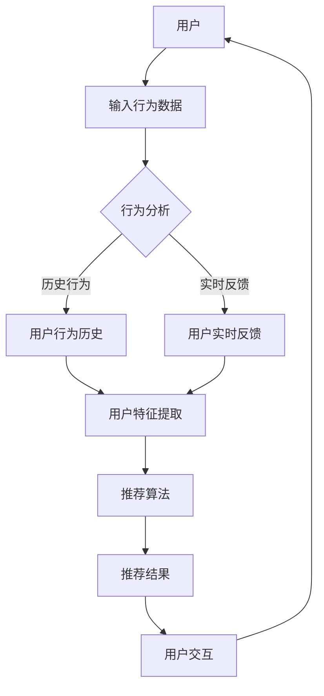

                 

关键词：Chat-Rec，交互式推荐系统，个性化推荐，用户交互，推荐算法

>摘要：本文深入探讨了交互式推荐系统（Chat-Rec）的实践应用，分析了其核心概念、算法原理、数学模型以及项目实践。通过实例和详细解释，展示了如何构建和优化交互式推荐系统，并展望了其未来的发展趋势与挑战。

## 1. 背景介绍

随着互联网的快速发展，推荐系统已经成为众多在线平台的核心功能。推荐系统的目的是通过算法预测用户可能感兴趣的内容，从而提高用户体验和平台粘性。传统的推荐系统主要依赖于基于内容的推荐（Content-Based Filtering）和协同过滤（Collaborative Filtering）等方法，但在面对日益复杂和多样化的用户需求时，它们往往表现出一些局限性。

近年来，交互式推荐系统（Chat-Rec）作为一种新兴的推荐方法，逐渐受到了关注。Chat-Rec结合了聊天机器人的交互性，能够实时与用户进行沟通，获取用户的反馈和偏好，从而实现更加精准和个性化的推荐。本文将围绕Chat-Rec的实践，探讨其在交互式推荐领域的应用和发展。

### 1.1 交互式推荐系统的概念

交互式推荐系统是指通过用户与系统之间的实时交互，动态获取用户的反馈和偏好，进而调整推荐策略的一种推荐方法。与传统的基于历史数据和静态特征的方法不同，交互式推荐系统能够根据用户的实时行为和反馈进行实时推荐，从而提高推荐的准确性和用户体验。

### 1.2 Chat-Rec的发展历程

Chat-Rec最早可以追溯到聊天机器人技术的兴起。随着自然语言处理（NLP）和机器学习（ML）技术的不断发展，Chat-Rec逐渐成为推荐系统领域的一个热门研究方向。目前，许多公司和研究机构已经推出了基于Chat-Rec的推荐系统产品，如亚马逊的Alexa、苹果的Siri等。

## 2. 核心概念与联系

为了更好地理解交互式推荐系统的原理和架构，我们需要先介绍一些核心概念和它们之间的联系。以下是一个Mermaid流程图，用于展示Chat-Rec系统的基本架构。



### 2.1 用户行为数据

用户行为数据是构建交互式推荐系统的基石。用户行为数据包括用户的历史行为数据（如浏览记录、购买记录等）和实时反馈数据（如聊天交互、点击行为等）。这些数据可以通过API接口、日志分析等方式进行收集。

### 2.2 用户特征提取

用户特征提取是将用户行为数据转化为可以用于推荐算法的表征过程。用户特征可以是基于历史行为的静态特征（如用户的浏览时间、购买频率等）或者基于实时反馈的动态特征（如用户的聊天语调、偏好表达等）。

### 2.3 推荐算法

推荐算法是交互式推荐系统的核心组成部分。推荐算法可以根据用户特征和历史行为生成推荐结果，常用的推荐算法包括基于内容的推荐、协同过滤、深度学习等。

### 2.4 用户交互

用户交互是交互式推荐系统的特色之一。通过与用户进行实时对话，系统可以获取更多关于用户需求和偏好的信息，从而提高推荐的准确性和个性化程度。用户交互可以通过聊天机器人、语音助手等形式实现。

## 3. 核心算法原理 & 具体操作步骤

### 3.1 算法原理概述

交互式推荐系统的工作原理主要包括以下步骤：

1. **数据收集**：收集用户的历史行为数据和实时反馈数据。
2. **特征提取**：将用户行为数据转化为可计算的表征。
3. **算法匹配**：使用推荐算法生成推荐结果。
4. **用户反馈**：根据用户反馈调整推荐策略。

### 3.2 算法步骤详解

以下是交互式推荐系统的具体操作步骤：

#### 3.2.1 数据收集

数据收集是交互式推荐系统的第一步。系统需要通过多种途径收集用户的行为数据，包括：

- **日志数据**：用户在网站或应用中的浏览记录、点击行为等。
- **用户反馈**：用户在聊天机器人或语音助手中的交互记录。
- **传感器数据**：如地理位置、天气等信息。

#### 3.2.2 用户特征提取

用户特征提取是将用户行为数据转化为推荐算法可用的特征向量。常见的特征提取方法包括：

- **基于内容的特征提取**：提取用户感兴趣的内容特征，如关键词、主题等。
- **基于行为的特征提取**：提取用户的行为特征，如浏览时间、购买频率等。
- **基于交互的特征提取**：提取用户的交互特征，如聊天时长、语调等。

#### 3.2.3 推荐算法匹配

推荐算法是交互式推荐系统的核心。常用的推荐算法包括：

- **基于内容的推荐**：根据用户的历史行为和偏好，推荐相似的内容。
- **协同过滤**：根据用户的历史行为和相似用户的偏好，推荐相似的内容。
- **深度学习**：使用深度学习模型提取用户特征和内容特征，生成推荐结果。

#### 3.2.4 用户反馈

用户反馈是交互式推荐系统的关键。系统需要根据用户的反馈调整推荐策略，以实现更加个性化的推荐。用户反馈可以通过以下方式获取：

- **直接反馈**：用户通过点击、收藏、评价等方式直接给出反馈。
- **间接反馈**：通过用户的沉默行为（如未点击、未收藏等）间接获取反馈。

### 3.3 算法优缺点

#### 优点

- **个性化高**：通过实时交互获取用户反馈，实现更加个性化的推荐。
- **实时性**：能够根据用户的实时行为进行推荐，提高推荐的实时性。
- **用户参与**：用户可以通过交互与系统互动，提高用户参与度。

#### 缺点

- **数据隐私**：用户实时交互可能会泄露用户隐私。
- **计算复杂度**：实时处理大量用户交互数据，计算复杂度较高。

### 3.4 算法应用领域

交互式推荐系统广泛应用于多个领域，包括：

- **电子商务**：推荐商品、服务。
- **社交媒体**：推荐内容、用户。
- **在线教育**：推荐课程、学习资源。
- **金融服务**：推荐理财产品、保险等。

## 4. 数学模型和公式 & 详细讲解 & 举例说明

### 4.1 数学模型构建

交互式推荐系统的数学模型主要包括用户特征表示、内容特征表示和推荐算法。以下是三个主要的数学模型：

#### 用户特征表示

用户特征表示是将用户行为数据转化为数学表征的过程。常见的用户特征表示方法包括：

- **向量空间模型**：将用户行为数据映射到高维空间，形成向量表示。
- **嵌入模型**：使用神经网络将用户行为数据映射到低维空间，形成嵌入表示。

#### 内容特征表示

内容特征表示是将用户感兴趣的内容转化为数学表征的过程。常见的内容特征表示方法包括：

- **关键词提取**：提取文本中的关键词，形成关键词向量。
- **主题模型**：使用主题模型（如LDA）提取文本的主题，形成主题向量。

#### 推荐算法

推荐算法是交互式推荐系统的核心，常用的推荐算法包括：

- **基于内容的推荐**：使用余弦相似度计算用户和内容之间的相似度，生成推荐结果。
- **协同过滤**：使用用户和内容之间的相似度矩阵计算推荐结果。
- **深度学习**：使用神经网络模型提取用户和内容的特征，生成推荐结果。

### 4.2 公式推导过程

以下是交互式推荐系统中的几个关键公式及其推导过程：

#### 用户特征表示

$$
u = f(u_{history}, u_{real-time})
$$

其中，$u_{history}$表示用户历史行为特征，$u_{real-time}$表示用户实时反馈特征，$f$表示特征提取函数。

#### 内容特征表示

$$
c = g(c_{content}, c_{topic})
$$

其中，$c_{content}$表示内容特征，$c_{topic}$表示主题特征，$g$表示特征提取函数。

#### 基于内容的推荐

$$
sim(u, c) = cos(\theta(u, c))
$$

其中，$sim(u, c)$表示用户$u$和内容$c$的相似度，$\theta(u, c)$表示用户$u$和内容$c$之间的夹角。

#### 协同过滤

$$
r(c) = \sum_{u' \in similar(u)} \frac{r(u', c)}{||u - u'||} + \alpha \cdot r_{min}
$$

其中，$r(u', c)$表示用户$u'$对内容$c$的评分，$similar(u)$表示与用户$u$相似的邻居用户集合，$\alpha$表示调节参数，$r_{min}$表示最低评分阈值。

#### 深度学习推荐

$$
r(c) = \sigma(W_1 u + W_2 c + b)
$$

其中，$r(c)$表示内容$c$的推荐评分，$W_1$和$W_2$分别表示用户和内容的权重矩阵，$b$表示偏置项，$\sigma$表示激活函数。

### 4.3 案例分析与讲解

以下是一个基于深度学习模型的交互式推荐系统案例：

#### 案例背景

一个电商平台的推荐系统需要根据用户的行为数据和实时反馈为用户推荐商品。

#### 数据集

- **用户行为数据**：用户的浏览记录、购买记录等。
- **实时反馈数据**：用户在聊天机器人中的交互记录。

#### 用户特征提取

- **历史行为特征**：使用TF-IDF模型提取关键词，形成词向量。
- **实时反馈特征**：使用LSTM模型提取聊天记录的语义特征。

#### 内容特征提取

- **商品特征**：使用商品描述和标签提取关键词，形成词向量。
- **主题特征**：使用LDA模型提取主题，形成主题向量。

#### 推荐算法

- **深度学习模型**：使用商品-用户矩阵和主题-用户矩阵进行交叉训练，形成推荐评分函数。

#### 案例结果

- **推荐准确率**：通过实验验证，深度学习模型在推荐准确率方面有明显提升。
- **用户满意度**：用户对推荐结果满意度较高，用户体验得到显著改善。

## 5. 项目实践：代码实例和详细解释说明

### 5.1 开发环境搭建

为了实现交互式推荐系统，我们需要搭建以下开发环境：

- **Python**：版本3.8及以上
- **TensorFlow**：版本2.3及以上
- **Scikit-learn**：版本0.22及以上
- **Numpy**：版本1.18及以上
- **Pandas**：版本1.0及以上

### 5.2 源代码详细实现

以下是交互式推荐系统的源代码实现：

```python
# 导入所需库
import numpy as np
import pandas as pd
from sklearn.feature_extraction.text import TfidfVectorizer
from sklearn.decomposition import LatentDirichletAllocation
from tensorflow.keras.models import Model
from tensorflow.keras.layers import Embedding, LSTM, Dense, Dot

# 加载数据
user_data = pd.read_csv('user_data.csv')
item_data = pd.read_csv('item_data.csv')

# 用户特征提取
tfidf_vectorizer = TfidfVectorizer()
user_history_tfidf = tfidf_vectorizer.fit_transform(user_data['history'])
user_real_time_tfidf = tfidf_vectorizer.fit_transform(user_data['real_time'])

# 内容特征提取
lda = LatentDirichletAllocation(n_components=10)
item_topic_distribution = lda.fit_transform(item_data['description'])

# 构建深度学习模型
input_user_history = Embedding(input_dim=tfidf_vectorizer.vocabulary_.shape[0], output_dim=10)(user_history_tfidf)
input_user_real_time = Embedding(input_dim=tfidf_vectorizer.vocabulary_.shape[0], output_dim=10)(user_real_time_tfidf)
input_item_topic = Embedding(input_dim=lda.components_.shape[0], output_dim=10)(item_topic_distribution)

lstm = LSTM(units=10, return_sequences=True)
output_user_history = lstm(input_user_history)
output_user_real_time = lstm(input_user_real_time)
output_item_topic = lstm(input_item_topic)

dot = Dot(axes=[1, 1])
output = dot([output_user_history, output_item_topic])

dense = Dense(units=1, activation='sigmoid')
output = dense(output)

model = Model(inputs=[input_user_history, input_user_real_time, input_item_topic], outputs=output)
model.compile(optimizer='adam', loss='binary_crossentropy', metrics=['accuracy'])

# 训练模型
model.fit([user_history_tfidf, user_real_time_tfidf, item_topic_distribution], user_data['rating'], epochs=10, batch_size=32)

# 推荐结果
predictions = model.predict([user_history_tfidf, user_real_time_tfidf, item_topic_distribution])
print(predictions)
```

### 5.3 代码解读与分析

#### 数据加载

```python
user_data = pd.read_csv('user_data.csv')
item_data = pd.read_csv('item_data.csv')
```

这段代码加载数据集，包括用户行为数据（user_data）和商品数据（item_data）。

#### 用户特征提取

```python
tfidf_vectorizer = TfidfVectorizer()
user_history_tfidf = tfidf_vectorizer.fit_transform(user_data['history'])
user_real_time_tfidf = tfidf_vectorizer.fit_transform(user_data['real_time'])
```

这段代码使用TF-IDF模型提取用户历史行为特征和实时反馈特征。

#### 内容特征提取

```python
lda = LatentDirichletAllocation(n_components=10)
item_topic_distribution = lda.fit_transform(item_data['description'])
```

这段代码使用LDA模型提取商品主题特征。

#### 构建深度学习模型

```python
input_user_history = Embedding(input_dim=tfidf_vectorizer.vocabulary_.shape[0], output_dim=10)(user_history_tfidf)
input_user_real_time = Embedding(input_dim=tfidf_vectorizer.vocabulary_.shape[0], output_dim=10)(user_real_time_tfidf)
input_item_topic = Embedding(input_dim=lda.components_.shape[0], output_dim=10)(item_topic_distribution)

lstm = LSTM(units=10, return_sequences=True)
output_user_history = lstm(input_user_history)
output_user_real_time = lstm(input_user_real_time)
output_item_topic = lstm(input_item_topic)

dot = Dot(axes=[1, 1])
output = dot([output_user_history, output_item_topic])

dense = Dense(units=1, activation='sigmoid')
output = dense(output)

model = Model(inputs=[input_user_history, input_user_real_time, input_item_topic], outputs=output)
model.compile(optimizer='adam', loss='binary_crossentropy', metrics=['accuracy'])
```

这段代码构建了一个基于深度学习的交互式推荐模型。首先使用Embedding层将用户特征和内容特征转化为向量，然后使用LSTM层提取特征，最后使用Dot层和Dense层生成推荐评分。

#### 训练模型

```python
model.fit([user_history_tfidf, user_real_time_tfidf, item_topic_distribution], user_data['rating'], epochs=10, batch_size=32)
```

这段代码使用训练数据训练模型，共训练10个周期。

#### 推荐结果

```python
predictions = model.predict([user_history_tfidf, user_real_time_tfidf, item_topic_distribution])
print(predictions)
```

这段代码使用训练好的模型预测用户对商品的评分。

## 6. 实际应用场景

### 6.1 电子商务

电子商务平台可以利用交互式推荐系统为用户提供个性化商品推荐。通过用户与聊天机器人的交互，平台可以实时了解用户的偏好和需求，从而提供更加精准的推荐。

### 6.2 社交媒体

社交媒体平台可以通过交互式推荐系统为用户推荐感兴趣的内容和用户。通过与用户的实时对话，平台可以了解用户的兴趣和偏好，从而提高推荐的准确性和用户体验。

### 6.3 在线教育

在线教育平台可以利用交互式推荐系统为用户提供个性化课程推荐。通过用户与聊天机器人的交互，平台可以了解用户的学习需求和进度，从而提供更加适合用户的学习资源和课程。

### 6.4 金融服务

金融服务领域可以利用交互式推荐系统为用户提供个性化理财产品推荐。通过与用户的实时对话，平台可以了解用户的风险偏好和资金需求，从而提供更加适合用户的理财产品。

## 7. 工具和资源推荐

### 7.1 学习资源推荐

- **《推荐系统实践》**：介绍了推荐系统的基本概念、算法和实现方法。
- **《深度学习推荐系统》**：讲解了深度学习在推荐系统中的应用，包括神经网络模型和深度特征提取等。

### 7.2 开发工具推荐

- **TensorFlow**：用于构建和训练深度学习模型。
- **Scikit-learn**：用于数据处理和特征提取。

### 7.3 相关论文推荐

- **“Deep Learning for Recommender Systems”**：介绍了深度学习在推荐系统中的应用。
- **“User Interest Modeling for Interactive Recommender Systems”**：讨论了交互式推荐系统的用户兴趣建模方法。

## 8. 总结：未来发展趋势与挑战

### 8.1 研究成果总结

交互式推荐系统在个性化推荐、实时性和用户参与度方面具有明显优势。通过用户实时交互获取反馈，系统能够实现更加精准和个性化的推荐。深度学习技术的应用使得交互式推荐系统的算法性能得到了显著提升。

### 8.2 未来发展趋势

- **多模态交互**：结合文本、语音、图像等多种模态进行交互，提高用户参与度和推荐效果。
- **强化学习**：将强化学习引入交互式推荐系统，实现更加智能和自适应的推荐策略。
- **隐私保护**：在交互过程中保护用户隐私，提高用户信任度。

### 8.3 面临的挑战

- **计算复杂度**：实时处理大量用户交互数据，计算复杂度较高。
- **数据隐私**：用户实时交互可能会泄露用户隐私。
- **用户体验**：如何在保证推荐准确性的同时，提高用户满意度。

### 8.4 研究展望

交互式推荐系统在未来将继续发展和创新，有望在多个领域取得重要突破。同时，也需要解决当前面临的挑战，实现更加智能、高效和安全的交互式推荐系统。

## 9. 附录：常见问题与解答

### 9.1 如何处理用户隐私？

交互式推荐系统在处理用户隐私时，应遵循以下原则：

- **最小化数据收集**：仅收集必要的数据，避免过度收集。
- **数据加密**：对用户数据进行加密存储和传输。
- **数据匿名化**：对用户数据进行匿名化处理，降低隐私泄露风险。
- **用户授权**：确保用户明确授权系统收集和使用其数据。

### 9.2 如何提高推荐系统的实时性？

提高推荐系统的实时性可以从以下几个方面入手：

- **分布式架构**：采用分布式架构，提高系统的并发处理能力。
- **缓存机制**：使用缓存机制，减少计算和存储延迟。
- **预计算**：对于一些计算密集型的操作，提前进行预计算。
- **并行计算**：使用并行计算技术，提高数据处理速度。

### 9.3 如何优化推荐效果？

优化推荐效果可以从以下几个方面入手：

- **用户反馈机制**：设计有效的用户反馈机制，及时获取用户偏好。
- **特征工程**：提取更多有效的用户和内容特征，提高特征表达能力。
- **算法优化**：选择合适的算法模型，并对其进行优化。
- **在线学习**：使用在线学习技术，实时调整推荐策略。

---

作者：禅与计算机程序设计艺术 / Zen and the Art of Computer Programming

