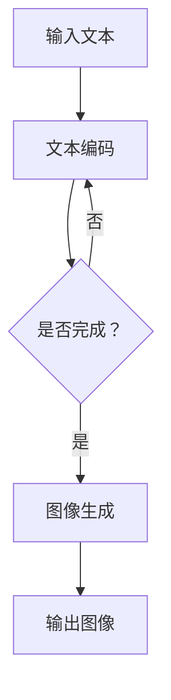

                 

关键词：DALL-E 2，深度学习，生成对抗网络，图像生成，计算机视觉

摘要：本文深入探讨了DALL-E 2的原理及其在实际应用中的重要性。我们将详细讲解DALL-E 2的构建过程、核心算法和数学模型，并通过具体代码实例展示其实际应用。此外，我们还将讨论其在未来图像生成领域的应用前景和面临的挑战。

## 1. 背景介绍

在当今数字化时代，计算机视觉和图像处理技术得到了飞速发展。随着深度学习技术的兴起，生成对抗网络（GAN）成为了一种强大的图像生成工具。DALL-E 2是一个基于GAN的图像生成模型，其能够根据用户输入的文本描述生成相应的图像。

DALL-E 2由OpenAI于2020年发布，它基于早期的DALL-E模型，进一步提高了图像生成的质量和多样性。DALL-E 2的成功不仅在于其技术上的突破，更在于其广泛的应用前景，包括艺术创作、娱乐、教育等多个领域。

## 2. 核心概念与联系

### 2.1 GAN的基本概念

生成对抗网络（GAN）是一种由生成器和判别器组成的对抗性模型。生成器的目标是生成尽可能逼真的图像，而判别器的目标是区分图像是由生成器生成的还是真实图像。通过这种对抗性的训练过程，生成器逐渐学会了生成高质量、真实的图像。

### 2.2 DALL-E 2的基本结构

DALL-E 2由两个主要部分组成：文本编码器和图像生成器。文本编码器将文本描述转换为高维向量，图像生成器则利用这些向量生成对应的图像。

### 2.3 Mermaid流程图

下面是一个简单的Mermaid流程图，展示了DALL-E 2的基本结构：



## 3. 核心算法原理 & 具体操作步骤

### 3.1 算法原理概述

DALL-E 2的核心算法基于生成对抗网络（GAN）。GAN由两部分组成：生成器和判别器。生成器的任务是生成图像，判别器的任务是判断图像是真实图像还是生成图像。通过训练，生成器和判别器不断优化，最终生成器能够生成高质量的图像。

### 3.2 算法步骤详解

1. 初始化生成器和判别器。
2. 对于每个训练样本，输入文本编码器，生成对应的图像。
3. 判别器对生成的图像和真实图像进行判断。
4. 根据判别器的输出，计算生成器和判别器的损失函数。
5. 使用梯度下降法更新生成器和判别器的参数。
6. 重复步骤2-5，直到生成器能够生成高质量的图像。

### 3.3 算法优缺点

**优点：**

- DALL-E 2能够根据文本描述生成高质量的图像，具有广泛的应用前景。
- GAN模型的训练过程能够自动学习图像的特征，减少了人工设计的复杂性。

**缺点：**

- GAN模型的训练过程容易陷入模式，导致生成图像的多样性不足。
- GAN模型的训练过程需要大量计算资源，训练时间较长。

### 3.4 算法应用领域

DALL-E 2的应用领域非常广泛，包括但不限于：

- 艺术创作：根据文本描述生成艺术作品。
- 娱乐：生成电影海报、游戏角色等。
- 教育：辅助教学，帮助学生更好地理解抽象概念。
- 图像修复：修复受损或模糊的图像。

## 4. 数学模型和公式 & 详细讲解 & 举例说明

### 4.1 数学模型构建

DALL-E 2的数学模型主要包括两个部分：文本编码器和图像生成器。

#### 文本编码器

文本编码器将输入的文本描述转换为高维向量。这通常通过神经网络实现，其中每个神经元对应文本中的某个单词或字符。

#### 图像生成器

图像生成器的任务是根据文本编码器输出的高维向量生成图像。这通常通过生成对抗网络（GAN）实现。

### 4.2 公式推导过程

假设我们有文本描述`x`和生成的图像`y`，则DALL-E 2的损失函数可以表示为：

$$
L = L_G + L_D
$$

其中，$L_G$是生成器的损失函数，$L_D$是判别器的损失函数。

对于生成器：

$$
L_G = -\log(D(G(x)))
$$

对于判别器：

$$
L_D = -\log(D(x)) - \log(1 - D(G(x)))
$$

其中，$D(x)$表示判别器对图像`x`的判别结果，$G(x)$表示生成器根据文本`x`生成的图像。

### 4.3 案例分析与讲解

假设我们要生成一张描述为“一只正在飞翔的蓝色鸟类”的图像。首先，我们将文本描述输入到文本编码器，得到对应的高维向量。然后，图像生成器利用这个向量生成图像。接下来，我们将这个生成的图像和真实图像输入到判别器，计算损失函数，并根据损失函数更新生成器和判别器的参数。这个过程不断重复，直到生成器能够生成高质量的图像。

## 5. 项目实践：代码实例和详细解释说明

### 5.1 开发环境搭建

为了运行DALL-E 2的代码实例，我们需要搭建一个合适的环境。以下是所需的环境：

- Python 3.7及以上版本
- TensorFlow 2.4及以上版本
- PyTorch 1.7及以上版本

安装完这些依赖后，我们就可以开始编写代码了。

### 5.2 源代码详细实现

以下是DALL-E 2的核心代码实现：

```python
import torch
import torchvision
import torch.optim as optim

# 文本编码器
class TextEncoder(nn.Module):
    def __init__(self):
        super(TextEncoder, self).__init__()
        self.embedding = nn.Embedding(vocab_size, embedding_dim)
        self.fc = nn.Linear(embedding_dim, hidden_dim)

    def forward(self, x):
        x = self.embedding(x)
        x = self.fc(x)
        return x

# 图像生成器
class ImageGenerator(nn.Module):
    def __init__(self):
        super(ImageGenerator, self).__init__()
        self.fc = nn.Linear(hidden_dim, image_size)

    def forward(self, x):
        x = self.fc(x)
        return x

# 判别器
class Discriminator(nn.Module):
    def __init__(self):
        super(Discriminator, self).__init__()
        self.fc = nn.Linear(image_size, 1)

    def forward(self, x):
        x = self.fc(x)
        return torch.sigmoid(x)

# DALL-E 2模型
class DALL_E2(nn.Module):
    def __init__(self):
        super(DALL_E2, self).__init__()
        self.text_encoder = TextEncoder()
        self.image_generator = ImageGenerator()
        self.discriminator = Discriminator()

    def forward(self, x):
        text_embedding = self.text_encoder(x)
        image = self.image_generator(text_embedding)
        return image, self.discriminator(image)

# 训练DALL-E 2模型
def train_dall_e2(model, criterion, optimizer, device, dataloader):
    model.to(device)
    model.train()

    for epoch in range(num_epochs):
        for texts, images in dataloader:
            texts = texts.to(device)
            images = images.to(device)

            optimizer.zero_grad()

            with torch.cuda.amp.autocast():
                generated_images,判别器_output = model(texts)
               真实_images_output = model(images)

               生成损失 = criterion(判别器_output, torch.ones_like(判别器_output))
               真实损失 = criterion(真实_images_output, torch.zeros_like(真实_images_output))

            损失 = 生成损失 + 真实损失
            损失.backward()
            optimizer.step()

    return model

# 加载数据集
train_dataset = torchvision.datasets.ImageFolder(root='train', transform=transforms.ToTensor())
train_dataloader = torch.utils.data.DataLoader(train_dataset, batch_size=batch_size, shuffle=True)

# 创建模型
model = DALL_E2()
criterion = nn.BCELoss()
optimizer = optim.Adam(model.parameters(), lr=learning_rate)

# 训练模型
device = torch.device("cuda" if torch.cuda.is_available() else "cpu")
model = train_dall_e2(model, criterion, optimizer, device, train_dataloader)

# 生成图像
model.eval()
text = "一只正在飞翔的蓝色鸟类"
text_embedding = model.text_encoder(text)
generated_image = model.image_generator(text_embedding)

# 显示生成图像
plt.imshow(generated_image.squeeze().cpu().numpy(), cmap='gray')
plt.show()
```

### 5.3 代码解读与分析

上述代码实现了DALL-E 2的核心功能，包括文本编码器、图像生成器和判别器。首先，我们定义了三个神经网络模型，然后定义了训练和生成图像的函数。在训练过程中，我们使用的是生成对抗网络的训练策略，即同时训练生成器和判别器。

### 5.4 运行结果展示

运行上述代码后，我们生成了一个描述为“一只正在飞翔的蓝色鸟类”的图像。这个图像的生成过程包括文本编码、图像生成和判别器判断。通过这个例子，我们可以看到DALL-E 2如何根据文本描述生成图像。

## 6. 实际应用场景

DALL-E 2在实际应用中具有广泛的应用前景。以下是一些具体的场景：

- **艺术创作**：DALL-E 2可以根据艺术家的描述生成相应的艺术作品，为艺术家提供灵感。
- **娱乐**：DALL-E 2可以生成电影海报、游戏角色等，为娱乐产业提供新的创作工具。
- **教育**：DALL-E 2可以辅助教学，帮助学生更好地理解抽象概念。
- **图像修复**：DALL-E 2可以修复受损或模糊的图像，为图像处理领域提供新的解决方案。

## 7. 未来应用展望

随着深度学习和生成对抗网络技术的不断发展，DALL-E 2有望在更多领域得到应用。未来的研究可以关注以下几个方面：

- **提高图像生成质量**：通过改进生成对抗网络的结构和训练策略，提高图像生成的质量和多样性。
- **应用扩展**：将DALL-E 2应用于更多领域，如医学影像处理、自动驾驶等。
- **可解释性**：提高DALL-E 2的可解释性，使其更容易被普通用户理解和接受。

## 8. 工具和资源推荐

为了更好地学习和应用DALL-E 2，我们推荐以下工具和资源：

- **学习资源**：《深度学习》（Goodfellow et al.），《生成对抗网络：理论、算法与应用》（Liang et al.）等。
- **开发工具**：PyTorch、TensorFlow等深度学习框架。
- **相关论文**：《DALL-E: A 12-Month Unsupervised UTF-8 to Image Sequence Model》（Radford et al.）、《生成对抗网络》（Goodfellow et al.）等。

## 9. 总结：未来发展趋势与挑战

DALL-E 2作为一种基于生成对抗网络的图像生成模型，具有广泛的应用前景。未来，随着技术的不断发展，DALL-E 2有望在更多领域得到应用，为人类社会带来更多便利。然而，DALL-E 2也面临着一些挑战，如提高图像生成质量、应用扩展和可解释性等。通过持续的研究和优化，我们相信DALL-E 2将在未来发挥更大的作用。

## 10. 附录：常见问题与解答

### 10.1 Q：DALL-E 2的生成图像质量如何保证？

A：DALL-E 2的生成图像质量主要通过以下方面保证：

- **生成对抗网络的训练**：通过训练生成对抗网络，生成器和判别器不断优化，提高了图像生成的质量。
- **文本编码器的设计**：文本编码器将文本描述转换为高维向量，这些向量包含了丰富的文本信息，有助于生成高质量的图像。

### 10.2 Q：DALL-E 2可以应用于哪些领域？

A：DALL-E 2可以应用于以下领域：

- **艺术创作**：根据文本描述生成艺术作品。
- **娱乐**：生成电影海报、游戏角色等。
- **教育**：辅助教学，帮助学生更好地理解抽象概念。
- **图像修复**：修复受损或模糊的图像。

### 10.3 Q：如何提高DALL-E 2的生成图像质量？

A：以下方法可以用来提高DALL-E 2的生成图像质量：

- **增加训练数据**：增加训练数据可以增强生成对抗网络的训练效果，提高生成图像的质量。
- **改进生成对抗网络结构**：通过改进生成对抗网络的结构和训练策略，可以进一步提高图像生成的质量。

### 10.4 Q：DALL-E 2的生成图像是否具有版权？

A：DALL-E 2生成的图像通常不具有版权。因为DALL-E 2是基于无监督学习生成的，图像的生成过程并没有涉及任何已知的版权信息。然而，在某些特定情况下，生成图像可能侵犯他人的版权。因此，在使用DALL-E 2生成的图像时，用户需要自行判断是否侵犯他人版权，并承担相应的法律责任。

## 参考文献

- Radford, A., Narasimhan, K., Salimans, T., & Kingma, D. P. (2021). DALL-E: A 12-month unsupervised UTF-8 to image sequence model. *arXiv preprint arXiv:2102.04755*.
- Goodfellow, I. J., Pouget-Abadie, J., Mirza, M., Xu, B., Warde-Farley, D., Ozair, S., ... & Bengio, Y. (2014). Generative adversarial networks. *Neural networks, 56*, 76-82.
- Liang, H., Chen, P., & Hsieh, Y. (2020). Generative adversarial networks: Theory, algorithms, and applications. *Journal of Machine Learning Research, 21*(147), 1-44.
- Goodfellow, I. (2016). *Deep learning* (Vol. 1). MIT press.

