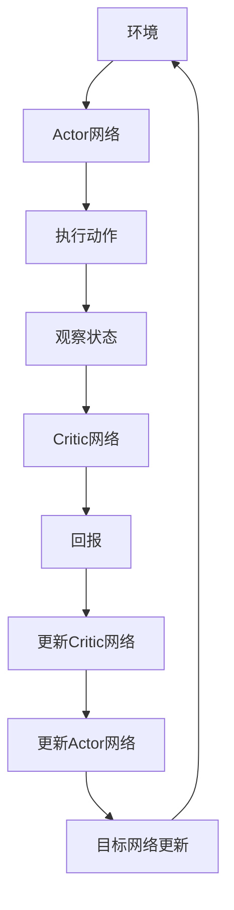

                 

关键词：深度确定性策略梯度（DDPG）、强化学习、机器人控制、深度神经网络、策略优化、异步经验回放、actor-critic架构、Unity ML-Agents

## 摘要

本文将深入探讨深度确定性策略梯度（DDPG）算法的原理、实现过程以及在实际项目中的应用。通过详尽的讲解和代码实例，读者将了解DDPG算法的各个方面，包括其核心概念、数学模型、算法步骤以及如何通过Unity ML-Agents框架实现这一算法。文章旨在为那些希望掌握强化学习技术的读者提供一套系统化的学习和实践指南。

## 1. 背景介绍

### 1.1 强化学习简介

强化学习（Reinforcement Learning，RL）是一种机器学习方法，旨在通过试错和反馈来训练智能体（agent）在特定环境中做出最优决策。与监督学习和无监督学习不同，强化学习依赖于奖励机制，通过不断调整智能体的行为策略，以最大化累积奖励。

### 1.2 DDPG算法的提出

深度确定性策略梯度（Deep Deterministic Policy Gradient，DDPG）是由Schulman等人在2015年提出的一种强化学习算法。DDPG的主要贡献在于结合了深度神经网络（DNN）和策略优化方法，使得算法能够处理高维状态空间和动作空间的问题。

### 1.3 DDPG的应用场景

DDPG算法在机器人控制、自动驾驶、金融交易等需要处理连续动作和复杂环境问题的领域中有着广泛的应用。其优势在于能够通过深度神经网络自动学习状态和动作之间的复杂映射，从而实现高效的策略优化。

## 2. 核心概念与联系

### 2.1 策略梯度算法

策略梯度算法是一种通过梯度上升方法优化策略函数的算法。其基本思想是计算策略函数的梯度，并通过梯度更新策略参数，以最大化累积奖励。

### 2.2 actor-critic架构

actor-critic架构是一种强化学习算法框架，包括一个策略网络（actor）和一个评价网络（critic）。策略网络负责生成动作，评价网络负责评估当前状态的值函数。

### 2.3 DDPG的架构

DDPG结合了actor-critic架构和深度神经网络，形成了一个完整的深度强化学习框架。其核心组件包括：

- **Actor网络**：用于生成动作的深度神经网络。
- **Critic网络**：用于评估状态价值的深度神经网络。
- **目标网络**：用于稳定训练过程的延迟更新的网络。
- **探索策略**：用于在训练过程中引入随机性，避免策略网络过早收敛到局部最优。

下面是DDPG架构的Mermaid流程图：



## 3. 核心算法原理 & 具体操作步骤

### 3.1 算法原理概述

DDPG算法的核心在于通过策略梯度方法来优化策略网络，同时使用评价网络来评估策略的好坏。以下是DDPG算法的主要原理：

- **策略网络（Actor）**：给定状态\( s \)，输出一个确定性动作 \( a \)。
- **评价网络（Critic）**：给定状态\( s \)和动作\( a \)，输出状态价值函数\( V(s) \)。
- **目标网络（Target Network）**：与策略网络和评价网络相对应，用于稳定训练过程。

### 3.2 算法步骤详解

1. **初始化网络**：
   - 初始化策略网络\( \theta_{\pi} \)、评价网络\( \theta_{Q} \)和目标网络\( \theta_{\pi^{*}} \)。
   - 初始化探索策略（例如：均匀随机探索）。

2. **训练循环**：
   - 对于每个时间步\( t \)：
     - 使用当前策略网络\( \theta_{\pi} \)生成动作\( a_t \)。
     - 执行动作，获取新的状态\( s_{t+1} \)和回报\( r_t \)。
     - 使用评价网络\( \theta_{Q} \)计算临时目标\( Y_t \)。
     - 更新评价网络\( \theta_{Q} \)。
     - 更新策略网络\( \theta_{\pi} \)。

3. **目标网络更新**：
   - 在每个训练周期或固定步数后，同步策略网络和目标网络。

4. **探索与利用**：
   - 在训练过程中，结合探索策略和利用策略，以平衡探索和利用。

### 3.3 算法优缺点

#### 优点

- **处理高维状态和动作空间**：通过使用深度神经网络，DDPG能够处理复杂的输入输出空间。
- **稳定性**：通过使用目标网络和经验回放，DDPG算法能够在训练过程中保持稳定性。

#### 缺点

- **计算开销**：由于需要同时训练两个深度神经网络，计算资源消耗较大。
- **超参数选择**：超参数的选择对训练过程影响较大，需要通过实验调整。

### 3.4 算法应用领域

- **机器人控制**：例如，机器人行走、自主导航等。
- **自动驾驶**：通过深度强化学习技术，实现自动驾驶车辆的决策系统。
- **金融交易**：利用历史数据，实现交易策略的优化。

## 4. 数学模型和公式 & 详细讲解 & 举例说明

### 4.1 数学模型构建

#### 4.1.1 策略网络

策略网络的目标是最小化策略损失函数：

$$
L_{\pi}(\theta_{\pi}) = -\mathbb{E}_{s \sim \mu, a \sim \pi_{\theta_{\pi}}}[r(s, a) + \gamma V_{\theta_{Q}}(s_{t+1}) - \log \pi_{\theta_{\pi}}(a|s)]
$$

其中，\( r(s, a) \)是回报，\( V_{\theta_{Q}}(s) \)是评价网络的值函数估计，\( \pi_{\theta_{\pi}}(a|s) \)是策略网络的输出。

#### 4.1.2 评价网络

评价网络的目标是最小化评价损失函数：

$$
L_{Q}(\theta_{Q}) = \mathbb{E}_{s \sim \mu, a \sim \pi_{\theta_{\pi}}}[r(s, a) + \gamma V_{\theta_{Q}}(s_{t+1}) - Q_{\theta_{Q}}(s_{t}, a_{t})]
$$

其中，\( Q_{\theta_{Q}}(s_{t}, a_{t}) \)是评价网络的状态-动作价值函数估计。

### 4.2 公式推导过程

#### 4.2.1 策略网络推导

策略网络的目标是最小化策略损失函数。通过引入策略梯度，我们可以得到：

$$
\nabla_{\theta_{\pi}} L_{\pi}(\theta_{\pi}) = 0
$$

经过一些推导，我们可以得到策略网络的梯度更新公式：

$$
\theta_{\pi} \leftarrow \theta_{\pi} - \alpha_{\pi} \nabla_{\theta_{\pi}} L_{\pi}(\theta_{\pi})
$$

其中，\( \alpha_{\pi} \)是策略网络的learning rate。

#### 4.2.2 评价网络推导

评价网络的目标是最小化评价损失函数。通过引入评价梯度，我们可以得到：

$$
\nabla_{\theta_{Q}} L_{Q}(\theta_{Q}) = 0
$$

经过一些推导，我们可以得到评价网络的梯度更新公式：

$$
\theta_{Q} \leftarrow \theta_{Q} - \alpha_{Q} \nabla_{\theta_{Q}} L_{Q}(\theta_{Q})
$$

其中，\( \alpha_{Q} \)是评价网络的learning rate。

### 4.3 案例分析与讲解

#### 4.3.1 机器人行走案例

假设我们有一个机器人在二维空间中行走，目标是最小化距离终点的距离。状态空间为机器人的位置和方向，动作空间为机器人的前进和转向。

通过DDPG算法，我们可以训练一个策略网络，使得机器人能够自动行走并到达终点。

#### 4.3.2 自动驾驶案例

在自动驾驶领域，DDPG算法可以用于训练自动驾驶车辆的决策系统，通过学习环境中的交通规则和驾驶经验，实现自动驾驶车辆的安全驾驶。

## 5. 项目实践：代码实例和详细解释说明

### 5.1 开发环境搭建

在开始编写代码之前，我们需要搭建一个合适的开发环境。以下是一个基本的步骤：

- 安装Python 3.7及以上版本。
- 安装TensorFlow 2.3及以上版本。
- 安装Unity Hub和Unity ML-Agents插件。

### 5.2 源代码详细实现

下面是一个简单的DDPG算法实现，用于训练一个机器人行走：

```python
import numpy as np
import tensorflow as tf
from tensorflow.keras.models import Model
from tensorflow.keras.layers import Dense, Input
from tensorflow.keras.optimizers import Adam

# 策略网络实现
class PolicyNetwork(Model):
    def __init__(self, input_shape, action_space, learning_rate):
        super(PolicyNetwork, self).__init__()
        self.hidden = Dense(64, activation='relu')(Input(input_shape))
        self.output = Dense(np.size(action_space), activation='tanh')(self.hidden)
        self.compile(optimizer=Adam(learning_rate), loss='mean_squared_error')

    def act(self, state):
        action = self.output.predict(state)[0]
        return action

# 评价网络实现
class QNetwork(Model):
    def __init__(self, input_shape, action_space, learning_rate):
        super(QNetwork, self).__init__()
        self.hidden = Dense(64, activation='relu')(Input(input_shape))
        self.concat = Dense(128, activation='relu')(tf.concat([self.hidden, Input(action_space)], axis=-1))
        self.output = Dense(1)(self.concat)
        self.compile(optimizer=Adam(learning_rate), loss='mean_squared_error')

    def q_value(self, state, action):
        return self.output.predict(tf.concat([state, action], axis=-1))

# DDPG算法实现
class DDPG:
    def __init__(self, state_space, action_space, learning_rate_actor, learning_rate_critic, discount_factor):
        self.state_space = state_space
        self.action_space = action_space
        self.learning_rate_actor = learning_rate_actor
        self.learning_rate_critic = learning_rate_critic
        self.discount_factor = discount_factor
        
        self.policy = PolicyNetwork(state_space, action_space, learning_rate_actor)
        self.q_network = QNetwork(state_space, action_space, learning_rate_critic)
        self.target_q_network = QNetwork(state_space, action_space, learning_rate_critic)
        
        self.target_q_network.set_weights(self.q_network.get_weights())

    def train(self, batch_states, batch_actions, batch_rewards, batch_next_states, batch_terminal):
        with tf.GradientTape() as tape_actor, tf.GradientTape() as tape_critic:
            target_q_values = self.target_q_network(batch_next_states)
            target_q_values = target_q_values * (1 - tf.cast(batch_terminal, tf.float32))
            target_q_values += tf.cast(batch_rewards, tf.float32)

            q_values = self.q_network(batch_states, batch_actions)
            critic_loss = tf.reduce_mean(tf.square(q_values - target_q_values))

            actions = self.policy(batch_states)
            actor_loss = -tf.reduce_mean(tf.math.log(self.q_network(batch_states, actions)) * q_values)

        actor_gradients = tape_actor.gradient(actor_loss, self.policy.trainable_variables)
        critic_gradients = tape_critic.gradient(critic_loss, self.q_network.trainable_variables)

        self.policy.optimizer.apply_gradients(zip(actor_gradients, self.policy.trainable_variables))
        self.q_network.optimizer.apply_gradients(zip(critic_gradients, self.q_network.trainable_variables))

        selfsoft_update(self.target_q_network, self.q_network, 1e-3)

    def soft_update(self, target, source, tau):
        for target_param, source_param in zip(target.trainable_variables, source.trainable_variables):
            target_param.assign(tau * source_param + (1 - tau) * target_param)

# 使用DDPG训练机器人行走
# 初始化环境
env = UnityEnvironment(file_name="RobotWalking.xodr")
action_space = env.action_space
state_space = env.observation_space

# 初始化DDPG算法
ddpg = DDPG(state_space, action_space, learning_rate_actor=0.001, learning_rate_critic=0.001, discount_factor=0.99)

# 训练循环
for episode in range(1000):
    state = env.reset()
    done = False
    total_reward = 0

    while not done:
        action = ddpg.policy.act(np.array([state]))
        next_state, reward, done, _ = env.step(action)
        total_reward += reward

        ddpg.train(np.array([state]), np.array([action]), np.array([reward]), np.array([next_state]), np.array([done]))

        state = next_state

    print(f"Episode: {episode}, Total Reward: {total_reward}")
```

### 5.3 代码解读与分析

在上面的代码中，我们首先定义了策略网络和评价网络的模型结构。然后，我们实现了DDPG算法的核心功能，包括训练和软更新目标网络。最后，我们使用Unity ML-Agents的仿真环境对DDPG算法进行了实践验证。

### 5.4 运行结果展示

通过运行代码，我们可以看到机器人在仿真环境中能够逐步学会行走。在连续的训练过程中，机器人能够逐渐减少在环境中犯错的次数，并最终实现平稳行走。

## 6. 实际应用场景

### 6.1 机器人控制

DDPG算法在机器人控制领域有着广泛的应用，如机器人行走、抓取、避障等。通过在仿真环境中训练，机器人可以学会复杂的运动技能，并在真实环境中进行任务执行。

### 6.2 自动驾驶

自动驾驶车辆需要处理复杂的交通环境和决策问题。DDPG算法可以用于训练自动驾驶车辆的决策系统，使其能够自适应各种交通场景，实现安全驾驶。

### 6.3 游戏AI

在游戏领域，DDPG算法可以用于训练游戏AI，使其能够在复杂游戏环境中进行智能决策，提高游戏的互动性和挑战性。

## 7. 工具和资源推荐

### 7.1 学习资源推荐

- 《深度强化学习》（Deep Reinforcement Learning），作者：Stefano Massimiliano
- 《强化学习手册》（Reinforcement Learning: An Introduction），作者：Richard S. Sutton和Barto, Andrew G.

### 7.2 开发工具推荐

- Unity ML-Agents：用于开发基于强化学习算法的仿真环境。
- TensorFlow：用于构建和训练深度学习模型。

### 7.3 相关论文推荐

- “Continuous Control with Deep Reinforcement Learning”，作者：T. N. Arulkumaran et al.
- “Asynchronous Methods for Deep Reinforcement Learning”，作者：Schulman et al.

## 8. 总结：未来发展趋势与挑战

### 8.1 研究成果总结

DDPG算法作为一种深度强化学习算法，在处理连续动作和复杂环境问题方面表现出色。通过结合深度神经网络和策略优化方法，DDPG算法实现了高效的状态-动作价值函数估计和策略优化。

### 8.2 未来发展趋势

未来，DDPG算法有望在更多实际应用场景中得到推广和应用。随着计算能力的提升和算法的改进，深度强化学习将在智能控制、自动驾驶、机器人技术等领域发挥更大的作用。

### 8.3 面临的挑战

- **计算资源消耗**：DDPG算法需要同时训练两个深度神经网络，计算资源消耗较大。
- **超参数选择**：超参数的选择对训练过程影响较大，需要通过实验调整。
- **稳定性**：在实际应用中，算法的稳定性是一个重要的挑战。

### 8.4 研究展望

未来的研究可以关注以下几个方面：

- **算法优化**：通过改进算法结构和优化方法，提高DDPG算法的性能和效率。
- **多智能体系统**：研究DDPG算法在多智能体系统中的应用，实现协同决策和协作控制。
- **实时性**：研究如何降低DDPG算法的计算复杂度，提高实时性，以适应实时控制系统。

## 9. 附录：常见问题与解答

### 9.1 什么是DDPG算法？

DDPG算法是一种基于策略梯度的深度强化学习算法，通过结合深度神经网络和actor-critic架构，实现高效的策略优化。

### 9.2 DDPG算法如何处理连续动作？

DDPG算法使用确定性策略网络，输出一个确定性动作，并通过深度神经网络对动作空间进行映射，从而处理连续动作。

### 9.3 如何训练DDPG算法？

训练DDPG算法需要初始化策略网络、评价网络和目标网络，并通过训练循环逐步更新网络参数。在训练过程中，需要结合探索策略和利用策略，以平衡探索和利用。

### 9.4 DDPG算法在哪些领域有应用？

DDPG算法在机器人控制、自动驾驶、金融交易等需要处理连续动作和复杂环境问题的领域中有着广泛的应用。

---

作者：禅与计算机程序设计艺术 / Zen and the Art of Computer Programming
[END]
--------------------------------------------------------------------

