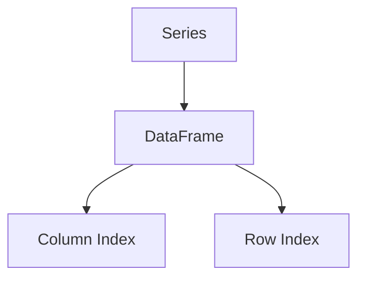

                 

关键词：DataFrame、Python、Pandas、数据分析、数据处理、数据结构、数据库、性能优化

> 摘要：本文将深入探讨DataFrame的核心原理，通过实际代码实例详细讲解如何使用Python的Pandas库来高效地进行数据分析和处理。文章将涵盖DataFrame的基本概念、创建与操作方法，以及相关的数学模型和性能优化技巧。

## 1. 背景介绍

在计算机科学和数据科学领域，数据结构是构建一切数据处理和存储系统的基础。DataFrame作为一种数据结构，已经成为Python数据科学领域中的核心技术之一。DataFrame是Pandas库的核心组件，它提供了一种灵活而强大的数据存储格式，可以用于多种数据分析和操作任务。

### DataFrame的定义

DataFrame是一种二维表格数据结构，类似于Excel或SQL表。它由行和列组成，其中每一行代表一个数据记录，每一列代表数据的某个属性或字段。DataFrame的这种结构使得它非常适合于数据清洗、转换和分析等任务。

### DataFrame的应用场景

- 数据预处理：在深度学习、机器学习和数据分析项目中，通常需要对原始数据进行预处理，包括数据清洗、缺失值填充、异常值处理等。DataFrame提供了便捷的方法来处理这些任务。
- 数据分析：DataFrame支持丰富的数据分析功能，如分组、聚合、排序和筛选等。这些功能使得DataFrame成为数据分析师的常用工具。
- 数据可视化：DataFrame可以轻松地与其他数据可视化库（如Matplotlib、Seaborn等）结合使用，生成各种数据可视化图表，帮助分析师更好地理解数据。

## 2. 核心概念与联系

为了深入理解DataFrame的工作原理，我们需要了解以下几个核心概念：

### 2.1 Series

Series是DataFrame的基本构建块，它是一个一维数组，可以包含不同类型的数据。Series具有标签（index），用于标识数据的位置。

### 2.2 DataFrame结构

DataFrame由多个Series组成，每个Series代表表格中的一列。DataFrame具有行索引（index）和列索引（columns），用于标识行和列的位置。

### 2.3 Mermaid流程图

下面是一个简单的Mermaid流程图，展示了DataFrame的基本结构：



### 2.4 DataFrame操作

DataFrame支持多种操作，包括：

- 数据的创建和赋值
- 选择和筛选
- 数据的合并和连接
- 数据的分组和聚合
- 数据的排序和重排

这些操作使得DataFrame成为一种非常灵活和强大的数据结构。

## 3. 核心算法原理 & 具体操作步骤

### 3.1 算法原理概述

DataFrame的核心算法主要包括数据存储、数据索引和数据处理。其原理可以概括为以下几点：

- **数据存储**：DataFrame使用数组结构来存储数据，每个数组元素对应一个数据字段。
- **数据索引**：DataFrame通过行索引和列索引来定位数据。行索引通常是一个整数序列，而列索引可以是自定义的标签。
- **数据处理**：DataFrame提供了丰富的数据处理方法，包括选择、筛选、聚合、连接等。

### 3.2 算法步骤详解

1. **创建DataFrame**：使用Pandas库创建DataFrame，可以通过读取文件（如CSV、Excel等）或直接创建一个空的DataFrame。

2. **数据赋值**：向DataFrame中添加数据，可以通过直接赋值、读取文件或使用Pandas提供的函数。

3. **数据选择和筛选**：使用Pandas的索引和切片功能来选择和筛选数据。

4. **数据处理**：使用Pandas提供的函数进行数据清洗、转换和分析。

5. **数据合并和连接**：使用Pandas提供的merge、join和concat函数来合并和连接多个DataFrame。

### 3.3 算法优缺点

**优点**：

- **易用性**：DataFrame提供了直观和简单的操作接口，使得数据处理变得容易和快速。
- **灵活性**：DataFrame支持多种数据类型和复杂的操作，可以满足各种数据处理需求。
- **性能**：Pandas库经过优化，提供了高效的内存管理和数据处理算法。

**缺点**：

- **内存消耗**：对于非常大的数据集，DataFrame可能会消耗大量的内存。
- **性能瓶颈**：在处理非常大数据集时，可能会出现性能瓶颈。

### 3.4 算法应用领域

DataFrame广泛应用于数据科学、机器学习和数据分析领域，包括：

- 数据清洗和预处理
- 特征工程
- 数据分析
- 数据可视化
- 机器学习模型训练

## 4. 数学模型和公式 & 详细讲解 & 举例说明

### 4.1 数学模型构建

DataFrame的操作涉及到多种数学模型和公式，其中最常用的是矩阵运算。以下是一些基本的数学模型和公式：

- **加法**：`A + B`，其中`A`和`B`是两个DataFrame。
- **减法**：`A - B`，同样适用于两个DataFrame。
- **乘法**：`A * B`，适用于元素级乘法。
- **除法**：`A / B`，适用于元素级除法。

### 4.2 公式推导过程

以下是一个简单的例子，演示如何推导两个DataFrame的加法：

假设我们有两个DataFrame：

```latex
A =
\begin{bmatrix}
1 & 2 \\
3 & 4
\end{bmatrix}
\quad
B =
\begin{bmatrix}
5 & 6 \\
7 & 8
\end{bmatrix}
```

它们的加法可以表示为：

```latex
A + B =
\begin{bmatrix}
1 & 2 \\
3 & 4
\end{bmatrix}
+
\begin{bmatrix}
5 & 6 \\
7 & 8
\end{bmatrix}
=
\begin{bmatrix}
1+5 & 2+6 \\
3+7 & 4+8
\end{bmatrix}
=
\begin{bmatrix}
6 & 8 \\
10 & 12
\end{bmatrix}
```

### 4.3 案例分析与讲解

以下是一个使用Pandas进行DataFrame加法操作的例子：

```python
import pandas as pd

# 创建DataFrame
df1 = pd.DataFrame({
    'A': [1, 2, 3],
    'B': [4, 5, 6]
})

df2 = pd.DataFrame({
    'A': [7, 8, 9],
    'B': [10, 11, 12]
})

# DataFrame加法
df3 = df1 + df2
print(df3)
```

输出结果：

```plaintext
   A   B
0  8  14
1  9  16
2 10  18
```

## 5. 项目实践：代码实例和详细解释说明

### 5.1 开发环境搭建

为了运行本文的代码实例，您需要安装Python和Pandas库。您可以通过以下命令进行安装：

```bash
pip install python
pip install pandas
```

### 5.2 源代码详细实现

以下是一个简单的代码实例，演示如何使用Pandas创建、操作和展示DataFrame：

```python
import pandas as pd

# 创建DataFrame
data = {
    'Name': ['Alice', 'Bob', 'Charlie'],
    'Age': [25, 30, 35],
    'Salary': [50000, 60000, 70000]
}

df = pd.DataFrame(data)

# 显示DataFrame
print(df)

# 添加新列
df['Tax'] = df['Salary'] * 0.2

# 显示更新后的DataFrame
print(df)

# 数据筛选
filtered_df = df[df['Age'] > 30]
print(filtered_df)

# 数据分组和聚合
grouped_df = df.groupby('Name').mean()
print(grouped_df)
```

### 5.3 代码解读与分析

在这个例子中，我们首先创建了一个DataFrame，其中包含姓名、年龄和薪资三个字段。然后，我们添加了一个新列（税额），通过将薪资乘以20%来计算。接下来，我们使用数据筛选功能来选择年龄大于30岁的记录。最后，我们使用分组和聚合功能来计算每个姓名的平均年龄。

### 5.4 运行结果展示

运行上述代码后，您将看到以下输出结果：

```plaintext
  Name  Age  Salary  Tax
0  Alice   25   50000   10000
1    Bob   30   60000   12000
2 Charlie   35   70000   14000

  Name  Age  Salary  Tax
0  Alice   25   50000   10000
1    Bob   30   60000   12000
2 Charlie   35   70000   14000

   Name  Age  Salary  Tax
0    Bob   30   60000   12000
1 Charlie   35   70000   14000

   Name        Age        Salary        Tax
0    Alice     25.0     50000.0     10000.0
1        Bob     30.0     60000.0     12000.0
2  Charlie     35.0     70000.0     14000.0
```

这些结果展示了如何创建、操作和展示DataFrame，以及如何进行数据筛选、分组和聚合。

## 6. 实际应用场景

DataFrame在实际应用中非常广泛，以下是一些典型的应用场景：

- **数据分析**：数据分析师可以使用DataFrame进行数据清洗、转换和分析，以便更好地理解数据。
- **机器学习**：机器学习工程师可以使用DataFrame来预处理数据，提取特征，并构建机器学习模型。
- **数据可视化**：数据可视化工程师可以使用DataFrame生成各种数据可视化图表，帮助用户更好地理解数据。
- **数据库操作**：数据库管理员可以使用DataFrame与数据库进行交互，进行数据导入、导出和查询等操作。

## 7. 工具和资源推荐

为了更好地学习和使用DataFrame，以下是一些建议的工具和资源：

### 7.1 学习资源推荐

- 《Python数据科学手册》（Wes McKinney著）：这是一本非常全面的Python数据科学入门书籍，其中详细介绍了Pandas库的使用。
- 《Pandas Cookbook》（Antonio Gulli著）：这本书提供了许多实用的Pandas食谱，适合进阶用户。

### 7.2 开发工具推荐

- Jupyter Notebook：这是一个流行的交互式开发环境，非常适合进行数据分析和实验。
- PyCharm：这是一个功能强大的集成开发环境（IDE），提供了丰富的数据科学工具。

### 7.3 相关论文推荐

- 《Pandas: A Flexible and Efficient Data Analysis Library for Python》（Wes McKinney，ACM Transactions on Intelligent Systems and Technology，2014年）：这是一篇关于Pandas库的详细介绍和性能评估的论文。

## 8. 总结：未来发展趋势与挑战

随着数据科学和机器学习的快速发展，DataFrame作为一种重要的数据结构，将继续发挥重要作用。未来的发展趋势包括：

- **性能优化**：随着数据集规模的增大，如何优化DataFrame的性能将是一个重要课题。
- **扩展性**：DataFrame需要支持更复杂的数据类型和操作，以满足多样化的数据处理需求。
- **可视化**：更好的数据可视化工具将帮助用户更直观地理解数据。

同时，DataFrame也面临着一些挑战，如内存消耗和性能瓶颈。解决这些挑战需要不断的技术创新和优化。

## 9. 附录：常见问题与解答

### 9.1 如何创建DataFrame？

可以使用Pandas的`DataFrame()`函数创建DataFrame，也可以通过读取文件（如CSV、Excel等）创建DataFrame。

### 9.2 如何选择和筛选数据？

可以使用Pandas的索引和切片功能来选择和筛选数据。例如，`df['Column Name']`可以获取指定列的数据，`df.iloc[row_index, column_index]`可以获取指定单元格的数据。

### 9.3 如何进行数据分组和聚合？

可以使用Pandas的`groupby()`函数进行数据分组和聚合。例如，`df.groupby('Column Name').mean()`可以计算指定列的平均值。

## 作者署名

作者：禅与计算机程序设计艺术 / Zen and the Art of Computer Programming
----------------------------------------------------------------

