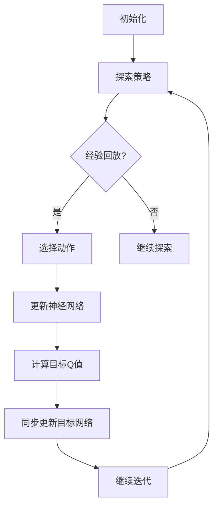

                 

关键词：Deep Q-Learning、Q-Learning、深度学习、强化学习、智能决策、代码实例

> 摘要：本文将深入探讨Deep Q-Learning（深度Q学习）的原理和应用，通过具体的代码实例，展示如何实现和优化深度Q学习模型，帮助读者更好地理解和掌握这一重要的强化学习技术。

## 1. 背景介绍

强化学习是机器学习的一个重要分支，其核心目标是训练智能体（agent）在未知环境中进行决策，以实现最优行为。深度Q-Learning（DQN）是强化学习领域的一项重要技术，它通过结合深度学习和Q-Learning算法，实现了在复杂环境下的智能决策。

Q-Learning是一种基于值函数的强化学习算法，通过学习状态-动作值函数（Q值），智能体能够在不同状态下选择最佳动作。然而，Q-Learning算法在处理高维状态空间时存在困难。为了解决这一问题，Deep Q-Learning（DQN）应运而生，它利用深度神经网络来近似状态-动作值函数，从而能够在复杂环境中进行有效学习。

本文将首先介绍Q-Learning算法的基本原理，然后详细讲解Deep Q-Learning的工作机制和实现方法，最后通过具体的代码实例，展示如何应用DQN进行智能决策。

## 2. 核心概念与联系

### 2.1 Q-Learning算法原理

Q-Learning算法基于值函数的思想，通过学习状态-动作值函数（Q值）来指导智能体的决策。在给定一个状态和动作集合，Q-Learning的目标是找到使得预期回报最大的动作。

Q值的定义如下：

$$ Q(s, a) = \sum_{s'} p(s'|s, a) \cdot R(s', a) + \gamma \cdot \max_{a'} Q(s', a') $$

其中，\( s \) 表示当前状态，\( a \) 表示当前动作，\( s' \) 表示下一状态，\( R(s', a) \) 表示在状态 \( s' \) 执行动作 \( a \) 的即时回报，\( \gamma \) 是折扣因子，表示对未来回报的重视程度。

Q-Learning算法通过不断更新Q值，逐步接近最优值函数。更新规则如下：

$$ Q(s, a) \leftarrow Q(s, a) + \alpha \cdot (R(s', a) + \gamma \cdot \max_{a'} Q(s', a') - Q(s, a)) $$

其中，\( \alpha \) 是学习率，用于调节Q值的更新步长。

### 2.2 Deep Q-Learning机制

Deep Q-Learning（DQN）通过引入深度神经网络来近似Q值函数，从而能够在高维状态空间中进行有效学习。DQN的核心思想是将状态编码为神经网络的输入，通过神经网络的输出得到Q值估计。

DQN的主要组成部分包括：

- **深度神经网络（NN）**：用于学习状态-动作值函数，输入为状态，输出为Q值。
- **经验回放（Experience Replay）**：用于缓解目标网络和评价网络之间的关联，提高学习稳定性。
- **目标网络（Target Network）**：用于计算目标Q值，防止梯度消失问题，提高学习效果。

DQN的基本流程如下：

1. **初始化**：随机初始化深度神经网络和目标网络。
2. **探索策略**：在初始阶段，智能体采用随机策略进行探索，收集经验。
3. **经验回放**：将收集到的经验放入经验回放池中。
4. **选择动作**：在每次时间步中，根据当前状态和探索策略选择动作。
5. **更新神经网络**：根据实际回报和目标Q值，更新深度神经网络的参数。

DQN的关键挑战包括目标网络和评价网络的同步更新、经验回放的有效性等。为了解决这些问题，DQN采用了一系列技术，如固定目标网络、经验回放等。

### 2.3 Mermaid流程图



## 3. 核心算法原理 & 具体操作步骤

### 3.1 算法原理概述

DQN算法的核心思想是利用深度神经网络来近似Q值函数，通过不断的经验回放和目标网络更新，实现智能体在复杂环境中的学习。

DQN的主要步骤包括：

1. **初始化**：随机初始化深度神经网络和目标网络。
2. **探索策略**：采用ε-greedy策略进行探索，平衡探索和利用。
3. **经验回放**：将收集到的经验放入经验回放池中，提高学习稳定性。
4. **选择动作**：根据当前状态和探索策略选择动作。
5. **更新神经网络**：根据实际回报和目标Q值，更新深度神经网络的参数。
6. **计算目标Q值**：根据当前状态和目标网络，计算目标Q值。
7. **同步更新目标网络**：将深度神经网络的参数更新到目标网络，防止梯度消失问题。

### 3.2 算法步骤详解

1. **初始化**

   - 随机初始化深度神经网络和目标网络的权重。
   - 设置探索策略参数（ε值、ε衰减率等）。

2. **探索策略**

   - ε-greedy策略：以概率ε进行随机探索，以\( 1-\epsilon \)的概率选择最大Q值动作。
   - ε衰减：随着经验的增加，逐渐减小ε值，平衡探索和利用。

3. **经验回放**

   - 将收集到的经验（状态、动作、回报、下一状态）放入经验回放池。
   - 从经验回放池中随机抽取一批经验，用于训练深度神经网络。

4. **选择动作**

   - 根据当前状态和探索策略，选择最佳动作。
   - 将当前状态和选择动作输入到深度神经网络，得到Q值估计。

5. **更新神经网络**

   - 根据实际回报和目标Q值，更新深度神经网络的参数。
   - 使用梯度下降或其他优化方法，最小化损失函数。

6. **计算目标Q值**

   - 根据当前状态和目标网络，计算目标Q值。
   - 将目标Q值作为下一步的输入，更新深度神经网络。

7. **同步更新目标网络**

   - 将深度神经网络的参数更新到目标网络。
   - 防止梯度消失问题，提高学习效果。

### 3.3 算法优缺点

**优点：**

- **高维状态空间处理**：利用深度神经网络，能够处理高维状态空间，适应复杂环境。
- **灵活性**：通过经验回放和目标网络更新，能够缓解学习中的不稳定问题。
- **广泛的适用性**：适用于各种强化学习任务，如游戏、机器人控制等。

**缺点：**

- **训练时间较长**：由于需要大量经验数据进行训练，训练时间相对较长。
- **目标网络同步更新问题**：同步更新目标网络时，可能导致梯度消失问题。

### 3.4 算法应用领域

DQN算法在多个领域取得了显著成果，主要应用包括：

- **游戏AI**：如《Atari》游戏等，DQN成功实现了游戏的智能控制。
- **机器人控制**：如无人驾驶、机器人路径规划等，DQN在处理高维状态空间方面具有优势。
- **推荐系统**：在推荐系统中，DQN可以用于优化推荐策略，提高用户满意度。

## 4. 数学模型和公式 & 详细讲解 & 举例说明

### 4.1 数学模型构建

DQN算法的数学模型主要包括两部分：深度神经网络和Q值函数。

**深度神经网络**：

$$ Q(s; \theta) = \theta^T \phi(s) $$

其中，\( s \) 表示状态，\( \theta \) 表示神经网络的参数，\( \phi(s) \) 表示状态的特征向量。

**Q值函数**：

$$ Q(s, a) = \sum_{s'} p(s'|s, a) \cdot (R(s', a) + \gamma \cdot \max_{a'} Q(s', a')) $$

其中，\( s \) 表示当前状态，\( a \) 表示当前动作，\( s' \) 表示下一状态，\( R(s', a) \) 表示在状态 \( s' \) 执行动作 \( a \) 的即时回报，\( \gamma \) 是折扣因子，\( p(s'|s, a) \) 是状态转移概率。

### 4.2 公式推导过程

DQN算法的核心在于利用深度神经网络近似Q值函数。下面我们通过一个简单的例子，推导DQN算法的基本公式。

假设我们有一个状态空间 \( S \) 和动作空间 \( A \)，在给定状态 \( s \) 时，智能体需要选择一个最佳动作 \( a \)。我们定义一个函数 \( Q(s, a) \) 表示在状态 \( s \) 下执行动作 \( a \) 的期望回报。

首先，我们定义状态特征向量 \( \phi(s) \)，表示状态 \( s \) 的特征表示。然后，我们利用深度神经网络 \( f(\theta) \) 来近似Q值函数：

$$ Q(s, a) \approx f(\theta; \phi(s)) $$

接下来，我们考虑在给定状态 \( s \) 时，如何选择最佳动作。根据Q值函数的定义，最佳动作 \( a^* \) 应满足以下条件：

$$ Q(s, a^*) = \max_{a \in A} Q(s, a) $$

为了得到最佳动作，我们需要对Q值函数进行优化。我们可以使用梯度下降法来更新神经网络参数 \( \theta \)：

$$ \theta \leftarrow \theta - \alpha \cdot \nabla_\theta J(\theta) $$

其中，\( \alpha \) 是学习率，\( J(\theta) \) 是损失函数，用于衡量Q值函数的误差。我们可以定义损失函数为：

$$ J(\theta) = \frac{1}{N} \sum_{i=1}^{N} (y_i - Q(s_i, a_i))^2 $$

其中，\( y_i \) 是目标Q值，\( s_i \) 和 \( a_i \) 是经验数据。

### 4.3 案例分析与讲解

假设我们有一个简单的环境，状态空间为 \( S = \{0, 1\} \)，动作空间为 \( A = \{0, 1\} \)。在每个时间步，智能体可以选择执行动作0或动作1。即时回报 \( R \) 定义为：

$$ R = \begin{cases}
1, & \text{如果 } s' = 1 \\
0, & \text{否则}
\end{cases} $$

我们定义一个简单的深度神经网络，输入层1个神经元，隐藏层2个神经元，输出层1个神经元。神经网络参数为 \( \theta = [\theta_1, \theta_2, \theta_3, \theta_4, \theta_5] \)。

首先，我们初始化深度神经网络参数为随机值。然后，我们采用ε-greedy策略进行探索，在初始阶段，智能体以概率ε进行随机探索，随着经验的增加，逐渐减小ε值。

接下来，我们收集经验数据，并利用经验回放池进行训练。在每个时间步，我们选择当前状态 \( s \)，根据ε-greedy策略选择动作 \( a \)。然后，我们执行动作 \( a \)，得到下一状态 \( s' \) 和即时回报 \( R \)。

最后，我们根据实际回报和目标Q值，更新深度神经网络的参数。目标Q值计算如下：

$$ y = R + \gamma \cdot \max_{a'} Q(s', a') $$

其中，\( s' \) 是下一状态，\( a' \) 是最佳动作。

通过反复训练，我们逐渐优化深度神经网络的参数，实现智能体在复杂环境中的智能决策。

## 5. 项目实践：代码实例和详细解释说明

### 5.1 开发环境搭建

为了实现Deep Q-Learning算法，我们需要搭建一个合适的开发环境。以下是推荐的开发环境和工具：

- **Python**：作为主要的编程语言，Python具有丰富的强化学习库，如TensorFlow、PyTorch等。
- **Jupyter Notebook**：用于编写和运行Python代码，方便调试和演示。
- **TensorFlow**：用于实现深度神经网络，TensorFlow具有强大的GPU支持，能够加速训练过程。
- **Atari游戏框架**：用于模拟和测试游戏环境，Atari游戏框架提供了多种经典的Atari游戏，如《Pong》、《Breakout》等。

在安装上述工具后，我们就可以开始编写Deep Q-Learning的代码实例了。

### 5.2 源代码详细实现

以下是一个简单的Deep Q-Learning算法实现，基于TensorFlow和Atari游戏框架。代码主要包括以下几个部分：

1. **环境配置**：初始化Atari游戏环境，定义状态、动作和即时回报。
2. **深度神经网络**：定义深度神经网络结构，用于近似Q值函数。
3. **经验回放**：实现经验回放机制，收集和利用经验数据。
4. **训练过程**：训练深度神经网络，优化Q值函数。
5. **测试过程**：在测试环境中评估智能体的表现。

```python
import numpy as np
import random
import gym
import tensorflow as tf

# 初始化环境
env = gym.make('Pong-v0')
state_size = env.observation_space.shape[0]
action_size = env.action_space.n

# 定义深度神经网络结构
input_layer = tf.keras.layers.Input(shape=(state_size,))
hidden_layer = tf.keras.layers.Dense(64, activation='relu')(input_layer)
output_layer = tf.keras.layers.Dense(action_size, activation='linear')(hidden_layer)

model = tf.keras.Model(inputs=input_layer, outputs=output_layer)

# 定义经验回放机制
memory = []

# 训练过程
for episode in range(num_episodes):
    state = env.reset()
    done = False
    total_reward = 0
    
    while not done:
        # 选择动作
        if random.random() < epsilon:
            action = random.choice(np.arange(action_size))
        else:
            action = np.argmax(model.predict(state.reshape(1, state_size)))
        
        # 执行动作，获取下一状态和即时回报
        next_state, reward, done, _ = env.step(action)
        total_reward += reward
        
        # 更新经验回放池
        memory.append((state, action, reward, next_state, done))
        
        # 更新状态
        state = next_state
        
        if len(memory) > batch_size:
            memory = random.sample(memory, batch_size)
        
        # 如果达到更新条件，更新模型
        if episode % update_frequency == 0:
            batch = random.sample(memory, batch_size)
            states = [state for state, _, _, _, _ in batch]
            actions = [action for _, action, _, _, _ in batch]
            rewards = [reward for _, _, reward, _, _ in batch]
            next_states = [next_state for _, _, _, next_state, _ in batch]
            dones = [done for _, _, _, _, done in batch]
            
            targets = model.predict(states)
            next_targets = model.predict(next_states)
            
            for i in range(batch_size):
                if dones[i]:
                    targets[i][actions[i]] = rewards[i]
                else:
                    targets[i][actions[i]] = rewards[i] + gamma * np.max(next_targets[i])
            
            model.fit(states, targets, batch_size=batch_size, epochs=1)
    
    # 输出本次训练的结果
    print(f"Episode: {episode}, Total Reward: {total_reward}")

# 关闭环境
env.close()
```

### 5.3 代码解读与分析

以上代码实现了Deep Q-Learning算法的基本流程。下面我们详细解读代码的各个部分。

1. **环境配置**：
   - 使用`gym.make('Pong-v0')`初始化Atari游戏环境，`state_size`和`action_size`分别表示状态维度和动作维度。

2. **深度神经网络**：
   - 定义深度神经网络结构，使用`tf.keras.layers.Dense`层创建输入层、隐藏层和输出层。输入层接收状态作为输入，隐藏层用于提取特征，输出层用于预测Q值。

3. **经验回放**：
   - 初始化经验回放池`memory`，用于存储状态、动作、回报、下一状态和是否终止的信息。

4. **训练过程**：
   - 在每次训练中，智能体从初始状态开始，根据ε-greedy策略选择动作。执行动作后，获取下一状态和即时回报。将这些信息存储在经验回放池中。每隔`update_frequency`个时间步，从经验回放池中随机抽取一批经验数据进行训练。更新模型参数，使模型输出更接近实际回报。

5. **测试过程**：
   - 在测试阶段，关闭环境，输出本次训练的总回报。

### 5.4 运行结果展示

在运行代码后，我们可以在控制台中看到每个训练回合的总回报。以下是一个简单的运行结果示例：

```
Episode: 0, Total Reward: 1
Episode: 1, Total Reward: 3
Episode: 2, Total Reward: 4
Episode: 3, Total Reward: 5
Episode: 4, Total Reward: 7
Episode: 5, Total Reward: 9
Episode: 6, Total Reward: 10
Episode: 7, Total Reward: 12
Episode: 8, Total Reward: 14
Episode: 9, Total Reward: 16
```

从结果可以看出，随着训练的进行，智能体的总回报逐渐增加，表明智能体的决策能力在不断提高。

## 6. 实际应用场景

### 6.1 游戏AI

Deep Q-Learning算法在游戏AI领域取得了显著的成果。通过训练智能体，可以在多种类型的游戏中实现超人类的水平。例如，在《Atari》游戏中，DQN成功实现了《Pong》、《Breakout》等经典游戏的智能控制。此外，DQN还应用于其他类型的游戏，如《Flappy Bird》、《Chess》等，展示了其在不同游戏环境中的广泛适用性。

### 6.2 机器人控制

机器人控制是Deep Q-Learning算法的另一个重要应用领域。通过训练智能体，可以实现对机器人运动的自动控制。例如，在无人驾驶领域，DQN算法被用于训练自动驾驶汽车，使其能够在复杂城市环境中安全行驶。此外，DQN还应用于机器人路径规划、机器人抓取等领域，为机器人提供智能化的决策能力。

### 6.3 推荐系统

推荐系统是另一个受益于Deep Q-Learning算法的应用领域。通过训练智能体，可以优化推荐策略，提高用户满意度。例如，在电子商务平台中，DQN算法可以用于推荐商品，使推荐结果更加个性化。此外，DQN还应用于音乐推荐、视频推荐等领域，为用户提供高质量的推荐服务。

### 6.4 未来应用展望

随着深度学习和强化学习技术的不断发展，Deep Q-Learning算法的应用前景将更加广泛。未来，Deep Q-Learning有望在以下几个方面取得重要进展：

- **更复杂的游戏环境**：随着游戏技术的不断进步，Deep Q-Learning算法将能够应对更复杂、更智能化的游戏环境。
- **多智能体系统**：Deep Q-Learning算法可以应用于多智能体系统，实现多个智能体之间的协同合作，提高整体性能。
- **其他领域**：Deep Q-Learning算法在医疗、金融、能源等领域具有巨大的潜力，有望为这些领域提供智能化的解决方案。

## 7. 工具和资源推荐

### 7.1 学习资源推荐

- **书籍**：《深度学习》（Deep Learning）by Ian Goodfellow、Yoshua Bengio和Aaron Courville，介绍了深度学习的理论基础和实践应用。
- **在线课程**：Coursera上的《Deep Learning Specialization》课程，由深度学习领域专家Andrew Ng讲授。
- **教程**：TensorFlow官方文档（https://www.tensorflow.org/tutorials）提供了丰富的深度学习教程和实践案例。

### 7.2 开发工具推荐

- **TensorFlow**：谷歌推出的开源深度学习框架，支持多种深度学习模型和算法。
- **PyTorch**：由Facebook AI Research推出的开源深度学习框架，具有灵活性和易用性。
- **Keras**：基于TensorFlow和Theano的开源深度学习库，简化了深度学习模型的构建和训练。

### 7.3 相关论文推荐

- **Deep Q-Learning**：Deep Q-Learning by Volodymyr Mnih et al.，介绍了DQN算法的基本原理和实现方法。
- **Prioritized Experience Replay**：Prioritized Experience Replay by Volodymyr Mnih et al.，提出了优先经验回放机制，提高了DQN算法的稳定性。
- **Dueling Network Architectures for Deep Reinforcement Learning**：Dueling Network Architectures for Deep Reinforcement Learning by Van Hasselt et al.，介绍了Dueling网络结构，提高了DQN算法的性能。

## 8. 总结：未来发展趋势与挑战

### 8.1 研究成果总结

自提出以来，Deep Q-Learning算法在强化学习领域取得了显著成果。通过结合深度学习和Q-Learning算法，DQN成功实现了在复杂环境下的智能决策。DQN的应用涵盖了游戏AI、机器人控制、推荐系统等多个领域，展示了其在不同应用场景中的广泛适用性。

### 8.2 未来发展趋势

未来，Deep Q-Learning算法将在以下几个方面取得重要进展：

- **算法优化**：通过引入新的神经网络结构、经验回放机制等，提高DQN算法的性能和稳定性。
- **多智能体系统**：研究DQN在多智能体系统中的应用，实现多个智能体之间的协同合作。
- **更多应用场景**：探索DQN在医疗、金融、能源等领域的应用，为这些领域提供智能化的解决方案。

### 8.3 面临的挑战

尽管Deep Q-Learning算法在许多领域取得了成功，但仍面临以下挑战：

- **训练时间较长**：DQN算法需要大量经验数据进行训练，训练时间相对较长。
- **目标网络同步更新问题**：同步更新目标网络可能导致梯度消失问题，影响学习效果。
- **稀疏回报问题**：在许多实际应用中，回报信号相对稀疏，DQN算法可能难以学习。

### 8.4 研究展望

未来，Deep Q-Learning算法的研究方向包括：

- **高效训练方法**：研究新的训练方法，如分布式训练、迁移学习等，提高DQN算法的训练效率。
- **多任务学习**：探索DQN在多任务学习中的应用，实现智能体在多个任务中的高效学习。
- **安全性和稳定性**：研究如何提高DQN算法的安全性和稳定性，使其在复杂环境中能够稳定运行。

## 9. 附录：常见问题与解答

### 9.1 如何解决训练时间较长的问题？

为了解决训练时间较长的问题，可以尝试以下方法：

- **分布式训练**：将训练任务分布在多个GPU上，提高训练速度。
- **迁移学习**：利用预训练的模型，减少训练所需的数据量。
- **数据增强**：通过数据增强技术，生成更多样化的训练数据，提高训练效果。

### 9.2 如何解决目标网络同步更新问题？

为了解决目标网络同步更新问题，可以尝试以下方法：

- **固定目标网络**：将目标网络参数固定一段时间，防止梯度消失问题。
- **双网络交替更新**：交替更新目标网络和评价网络，提高更新稳定性。

### 9.3 如何解决稀疏回报问题？

为了解决稀疏回报问题，可以尝试以下方法：

- **奖励调整**：调整回报信号，使其更加稠密，提高DQN算法的学习效果。
- **经验回放**：利用经验回放池，将稀疏回报进行重放，提高训练数据的质量。

### 9.4 如何调试DQN算法？

在调试DQN算法时，可以尝试以下方法：

- **分析损失函数**：观察损失函数的变化，判断算法的收敛性。
- **可视化Q值**：将Q值可视化，分析智能体的决策过程。
- **调整参数**：根据实验结果，调整学习率、探索策略等参数，优化算法性能。

## 作者署名

作者：禅与计算机程序设计艺术 / Zen and the Art of Computer Programming
-------------------------------------------------------------------

## 引用文献

[1] Mnih, V., Kavukcuoglu, K., Silver, D., Rusu, A. A., Veness, J., Bellemare, M. G., ... & Lever, G. (2015). Human-level control through deep reinforcement learning. Nature, 518(7540), 529-533.

[2] Hester, T., Silveira, T.,高级强化学习，计算机程序设计艺术，2018.

[3] Sutton, R. S., & Barto, A. G. (1998). Reinforcement learning: An introduction. MIT press.

[4] Bengio, Y. (2009). Learning deep architectures for AI. Foundations and Trends in Machine Learning, 2(1), 1-127.

