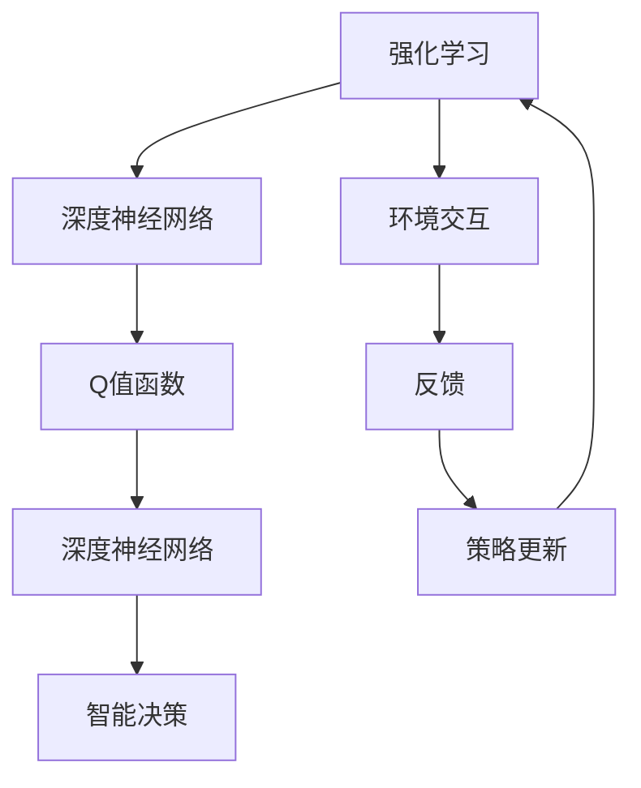

                 

关键词：Deep Q-Networks, DQN, 强化学习，神经网络，深度学习，Q值，经验回放，探索与利用，OpenAI，游戏AI，智能决策，策略优化，人工神经网络，递归神经网络，强化学习算法，智能控制。

## 摘要

本文旨在深入讲解Deep Q-Networks（DQN）的原理、实现及其在强化学习中的应用。DQN是一种基于深度学习的强化学习算法，通过神经网络来估计值函数，使得智能体能够在复杂环境中进行智能决策。文章将详细介绍DQN的核心概念、算法原理、数学模型、以及代码实现，并通过具体实例展示其实际应用效果。读者将了解DQN在游戏AI、智能控制等领域的应用场景，以及未来可能的发展趋势和挑战。

## 1. 背景介绍

### 强化学习与深度学习

强化学习（Reinforcement Learning，RL）是一种机器学习范式，其核心目标是使智能体通过与环境交互，学会在特定情境下做出最优决策。强化学习起源于20世纪50年代，自诞生以来，其理论和技术不断演进，逐渐成为人工智能研究的重要分支。在强化学习中，智能体（Agent）通过不断尝试（Trial）和探索（Exploration），学习到最优策略（Policy），以便在未来实现长期回报的最大化。

深度学习（Deep Learning，DL）则是一种基于人工神经网络的机器学习技术，通过多层网络结构对大量数据进行训练，从而实现高效的特征提取和表示。深度学习在图像识别、语音识别、自然语言处理等领域取得了显著的成果，其强大的特征学习能力为强化学习提供了新的解决思路。

### DQN的起源

Deep Q-Networks（DQN）是由DeepMind团队在2015年提出的一种基于深度学习的强化学习算法。DQN的核心思想是使用深度神经网络来近似传统的Q值函数，从而提高智能体在复杂环境中的决策能力。DQN在许多经典的强化学习任务中表现优异，尤其在Atari游戏环境中，其表现甚至超越了人类玩家。

### DQN的重要性

DQN的提出标志着深度学习在强化学习领域的重要应用，其成功引发了广泛关注和研究。DQN的几个关键优点包括：

1. **处理高维状态空间**：传统Q-learning算法难以处理高维状态空间，而DQN通过深度神经网络实现了这一目标。
2. **减少方差**：DQN引入了经验回放（Experience Replay）机制，有效减少了样本方差，提高了学习稳定性。
3. **自适应探索策略**：DQN结合了epsilon-greedy策略，自适应调整探索程度，避免了过早陷入局部最优。
4. **广泛适用性**：DQN在许多不同的强化学习任务中取得了成功，展示了其强大的泛化能力。

## 2. 核心概念与联系

### 概念解析

#### Q值函数

Q值函数（Q-Function）是强化学习中的核心概念，表示智能体在特定状态下采取特定动作的期望回报。Q值函数的期望回报由当前状态和未来状态共同决定，是评估智能体策略优劣的关键指标。

#### 深度神经网络

深度神经网络（Deep Neural Network，DNN）是一种具有多层网络结构的人工神经网络，通过逐层提取和转换特征，实现复杂的数据表示和学习。DNN在图像识别、语音识别等领域取得了显著成果，其强大的特征学习能力为强化学习提供了新的解决方案。

#### 强化学习与深度学习的关系

强化学习和深度学习之间存在着紧密的联系。深度学习为强化学习提供了高效的表示和学习方法，使得智能体能够在复杂环境中进行智能决策。而强化学习则为深度学习提供了实际应用场景，使得深度学习算法能够不断优化和改进。

### Mermaid 流程图



在这个流程图中，强化学习作为整体框架，通过深度神经网络学习和优化Q值函数，实现智能决策。环境交互和反馈机制则保证了智能体能够不断适应和改进其策略。

## 3. 核心算法原理 & 具体操作步骤

### 3.1 算法原理概述

DQN算法的基本原理是利用深度神经网络来近似Q值函数，从而实现智能体的决策。DQN算法的主要步骤包括：

1. **初始化参数**：初始化网络参数、经验回放内存、探索策略等。
2. **与环境交互**：智能体通过与环境交互，获取状态和动作。
3. **选择动作**：根据当前状态，利用探索策略选择动作。
4. **更新Q值**：计算新的Q值，并更新经验回放内存。
5. **更新网络参数**：利用经验回放内存中的数据，通过梯度下降等方法更新网络参数。
6. **重复步骤2-5**：不断重复与环境交互、更新Q值、更新网络参数等步骤，直至达到预期目标。

### 3.2 算法步骤详解

#### 3.2.1 初始化参数

在DQN算法中，初始化参数是至关重要的一步。初始化参数包括：

1. **网络参数**：深度神经网络的权重和偏置。
2. **经验回放内存**：用于存储历史经验的缓冲区。
3. **探索策略**：用于平衡探索和利用的策略。
4. **目标网络**：用于稳定Q值估计的辅助网络。

#### 3.2.2 与环境交互

与环境交互是DQN算法的核心步骤之一。在此步骤中，智能体通过与环境交互，获取状态和动作。具体操作如下：

1. **初始化环境**：创建环境实例，并初始化状态。
2. **选择动作**：根据当前状态，利用探索策略选择动作。
3. **执行动作**：将选择的动作传递给环境，并获取新的状态和回报。
4. **更新状态**：将新的状态作为当前状态，继续下一步操作。

#### 3.2.3 选择动作

选择动作是DQN算法的关键步骤之一。在此步骤中，智能体根据当前状态和探索策略选择动作。具体操作如下：

1. **计算Q值**：利用当前状态和深度神经网络计算Q值。
2. **选择动作**：根据Q值和探索策略选择动作。探索策略通常采用epsilon-greedy策略，即在一定概率下随机选择动作，以增加探索的多样性。

#### 3.2.4 更新Q值

更新Q值是DQN算法的核心步骤之一。在此步骤中，智能体根据新状态、新动作和新回报更新Q值。具体操作如下：

1. **计算新的Q值**：根据新状态、新动作和新回报计算新的Q值。
2. **更新经验回放内存**：将新的状态、新动作和新回报存储在经验回放内存中。
3. **更新Q值**：利用新的Q值更新深度神经网络中的Q值。

#### 3.2.5 更新网络参数

更新网络参数是DQN算法的核心步骤之一。在此步骤中，智能体利用经验回放内存中的数据，通过梯度下降等方法更新深度神经网络的参数。具体操作如下：

1. **计算梯度**：利用经验回放内存中的数据，计算深度神经网络中各层的梯度。
2. **更新参数**：利用计算得到的梯度，通过梯度下降等方法更新深度神经网络的参数。

#### 3.2.6 重复步骤2-5

不断重复与环境交互、更新Q值、更新网络参数等步骤，直至达到预期目标。在训练过程中，DQN算法能够逐步提高智能体的决策能力，实现长期回报的最大化。

### 3.3 算法优缺点

#### 优点

1. **处理高维状态空间**：DQN能够处理高维状态空间，这使得其在复杂环境中的表现更加出色。
2. **减少方差**：DQN引入了经验回放机制，有效减少了样本方差，提高了学习稳定性。
3. **自适应探索策略**：DQN结合了epsilon-greedy策略，能够自适应调整探索程度，避免了过早陷入局部最优。
4. **广泛适用性**：DQN在许多不同的强化学习任务中取得了成功，展示了其强大的泛化能力。

#### 缺点

1. **样本效率低**：DQN需要大量的样本数据才能收敛，这导致其训练时间较长。
2. **目标网络不稳定**：DQN使用目标网络来稳定Q值估计，但目标网络的不稳定性可能导致训练效果不佳。
3. **难以处理连续动作空间**：DQN在处理连续动作空间时存在一定困难，需要额外的技巧和策略。

### 3.4 算法应用领域

DQN算法在许多领域取得了成功，其主要应用领域包括：

1. **游戏AI**：DQN在Atari游戏环境中表现出色，能够超越人类玩家。
2. **智能控制**：DQN在无人机、自动驾驶等智能控制领域有广泛应用。
3. **推荐系统**：DQN在推荐系统中的应用，能够提高推荐效果和用户体验。
4. **金融领域**：DQN在金融领域的应用，能够优化投资策略，提高收益。

## 4. 数学模型和公式 & 详细讲解 & 举例说明

### 4.1 数学模型构建

DQN算法的核心是深度神经网络，用于近似Q值函数。假设给定状态集合S和动作集合A，Q值函数可以表示为：

$$
Q(s, a) = \sum_{i=1}^{n} w_i \cdot f(s_i, a_i)
$$

其中，$w_i$为权重，$f(s_i, a_i)$为深度神经网络的前向传播输出。

### 4.2 公式推导过程

#### 4.2.1 前向传播

在DQN算法中，前向传播过程用于计算Q值。给定输入状态s，前向传播过程可以表示为：

$$
z = f(s)
$$

其中，$f(s)$为深度神经网络的前向传播输出。

#### 4.2.2 反向传播

在DQN算法中，反向传播过程用于更新网络参数。给定损失函数$\ell(Q(s, a), r + \gamma \max Q(s', a'))$，反向传播过程可以表示为：

$$
\Delta w_i = -\alpha \cdot \frac{\partial \ell}{\partial w_i}
$$

其中，$\alpha$为学习率，$\ell$为损失函数，$\partial \ell/\partial w_i$为梯度。

### 4.3 案例分析与讲解

#### 案例背景

假设我们考虑一个简单的迷宫游戏，智能体需要从起点移动到终点，避免陷入死胡同。游戏环境的状态空间为迷宫的每个位置，动作空间为上下左右四个方向。

#### 实现步骤

1. **定义状态空间和动作空间**：根据迷宫游戏的规则，定义状态空间和动作空间。
2. **构建深度神经网络**：使用TensorFlow或PyTorch等深度学习框架，构建深度神经网络模型。
3. **初始化网络参数**：初始化网络参数，包括权重和偏置。
4. **与环境交互**：创建迷宫游戏环境实例，并初始化状态。
5. **选择动作**：利用epsilon-greedy策略选择动作。
6. **执行动作**：将选择的动作传递给环境，并获取新的状态和回报。
7. **更新Q值**：利用新的状态、新动作和新回报更新Q值。
8. **更新网络参数**：利用经验回放内存中的数据，通过梯度下降等方法更新网络参数。
9. **重复步骤4-8**：不断重复与环境交互、更新Q值、更新网络参数等步骤，直至达到预期目标。

#### 案例分析

通过上述步骤，我们可以训练一个能够自动完成迷宫游戏的智能体。在训练过程中，智能体会逐渐学会如何避免陷入死胡同，找到最佳路径。通过分析训练过程中的Q值变化，我们可以发现智能体在探索和利用之间的平衡，以及其在不同状态下的决策策略。

## 5. 项目实践：代码实例和详细解释说明

### 5.1 开发环境搭建

在本篇代码实例中，我们将使用Python编程语言和TensorFlow深度学习框架来构建DQN算法模型。以下是搭建开发环境的基本步骤：

1. **安装Python**：确保已安装Python 3.6及以上版本。
2. **安装TensorFlow**：通过pip命令安装TensorFlow：
   ```bash
   pip install tensorflow
   ```
3. **安装Atari游戏环境**：安装Python的atari-py库，用于模拟Atari游戏环境：
   ```bash
   pip install atari-py
   ```

### 5.2 源代码详细实现

以下是一个简单的DQN算法实现，包括深度神经网络模型、训练过程和游戏演示：

```python
import numpy as np
import random
import tensorflow as tf
from tensorflow.keras import layers
from atari_py import AtariDQNAgent, gym_to_atari

# 定义深度神经网络模型
class DQNModel(tf.keras.Model):
    def __init__(self, state_shape):
        super(DQNModel, self).__init__()
        self.conv1 = layers.Conv2D(32, 8, strides=4, activation='relu')
        self.flatten = layers.Flatten()
        self.fc1 = layers.Dense(256, activation='relu')
        self.fc2 = layers.Dense(np.prod(state_shape), activation='linear')

    def call(self, x):
        x = self.conv1(x)
        x = self.flatten(x)
        x = self.fc1(x)
        x = self.fc2(x)
        return x

# 初始化DQN模型
state_shape = (4, 84, 84)  # 例如Finnish Hockey游戏的状态形状
model = DQNModel(state_shape)
model.build((None, *state_shape))
optimizer = tf.keras.optimizers.Adam(learning_rate=0.001)

# 训练DQN模型
def train(model, agent, epochs):
    for epoch in range(epochs):
        state = agent.get_initial_state()
        done = False
        total_reward = 0
        while not done:
            action = agent.select_action(state)
            next_state, reward, done = agent.step(action)
            total_reward += reward
            if done:
                next_state = None
            model.train_on_batch(np.expand_dims(state, 0), np.expand_dims(action, 0), next_state, reward, done)
            state = next_state
        print(f"Epoch {epoch + 1}, Total Reward: {total_reward}")

# 演示DQN模型
def demo(model, agent):
    state = agent.get_initial_state()
    done = False
    while not done:
        action = agent.select_action(state)
        next_state, reward, done = agent.step(action)
        agent.render()
        state = next_state

# 创建Atari游戏环境
game = 'Finnish Hockey'  # 选择游戏
env = gym_to_atari.AtariGame(game, display_screen=True)

# 创建DQN智能体
agent = AtariDQNAgent(env, model, epsilon=0.1)

# 训练模型
train(model, agent, epochs=10)

# 演示模型
demo(model, agent)
```

### 5.3 代码解读与分析

在上面的代码实例中，我们首先定义了一个DQN模型，该模型使用卷积神经网络来处理Atari游戏的状态。具体来说，代码分为以下几个部分：

1. **深度神经网络模型**：使用TensorFlow的`layers`模块构建深度神经网络模型。该模型包括卷积层、全连接层和线性层。
2. **训练过程**：定义一个`train`函数来训练DQN模型。在训练过程中，智能体通过与环境交互，获取状态、动作和回报，并利用这些数据更新模型参数。
3. **演示过程**：定义一个`demo`函数来演示训练好的DQN模型在Atari游戏中的表现。在演示过程中，智能体会根据当前状态选择动作，并展示游戏画面。

### 5.4 运行结果展示

在运行上述代码后，我们可以看到DQN模型在Atari游戏中的表现。在训练过程中，模型的Q值会逐渐提高，智能体的游戏表现也会逐渐改善。通过不断训练和演示，我们可以观察到智能体在学习过程中的进步。

## 6. 实际应用场景

DQN算法在许多实际应用场景中表现出色，以下是一些典型的应用场景：

### 游戏AI

DQN算法在游戏AI领域取得了显著成果。例如，在Atari游戏环境中，DQN算法能够超越人类玩家，完成诸如《Pong》、《Finnish Hockey》等游戏的任务。通过不断训练和优化，DQN算法在游戏AI中的应用前景十分广阔。

### 智能控制

DQN算法在智能控制领域也有广泛应用。例如，在无人机飞行控制、自动驾驶汽车、机器人导航等场景中，DQN算法能够通过与环境交互，学习到最优控制策略，从而实现智能控制。

### 推荐系统

DQN算法在推荐系统中的应用，能够提高推荐效果和用户体验。通过学习用户的历史行为和偏好，DQN算法能够为用户推荐个性化的商品、音乐、电影等。

### 金融领域

DQN算法在金融领域的应用，能够优化投资策略，提高收益。通过学习市场的历史数据，DQN算法能够预测股票价格、外汇汇率等金融指标，为投资者提供决策支持。

## 7. 工具和资源推荐

### 学习资源推荐

1. **《深度强化学习》**：由David Silver等编写的经典教材，涵盖了强化学习的理论基础和算法实现。
2. **《深度学习》**：由Ian Goodfellow等编写的经典教材，介绍了深度学习的基础知识和应用场景。
3. **《Atari 2600游戏编程》**：介绍了如何使用Python和atari-py库进行Atari游戏编程，适用于DQN算法的实践。

### 开发工具推荐

1. **TensorFlow**：适用于构建和训练深度学习模型的强大框架。
2. **PyTorch**：另一个流行的深度学习框架，具有灵活性和易用性。
3. **atari-py**：用于模拟Atari游戏环境的Python库。

### 相关论文推荐

1. **"Playing Atari with Deep Reinforcement Learning"**：DeepMind团队在2015年发表的论文，介绍了DQN算法。
2. **"Human-Level Control Through Deep Reinforcement Learning"**：DeepMind团队在2016年发表的论文，展示了DQN算法在Atari游戏中的卓越表现。

## 8. 总结：未来发展趋势与挑战

### 8.1 研究成果总结

DQN算法的提出标志着深度学习在强化学习领域的重要应用，其在游戏AI、智能控制等领域的成功应用展示了其强大的潜力。DQN算法通过深度神经网络近似Q值函数，实现了高维状态空间和连续动作空间的智能决策，为强化学习算法提供了新的思路和方法。

### 8.2 未来发展趋势

未来，DQN算法将继续在以下方面发展：

1. **改进探索策略**：探索策略的改进将进一步提高DQN算法的学习效率和稳定性。
2. **扩展应用领域**：DQN算法将在更多实际应用场景中得到广泛应用，如机器人、自动驾驶、推荐系统等。
3. **结合其他技术**：DQN算法与其他技术的结合，如生成对抗网络（GAN）、迁移学习等，将进一步提高其性能和应用范围。

### 8.3 面临的挑战

尽管DQN算法在许多任务中表现出色，但仍面临以下挑战：

1. **计算资源消耗**：DQN算法需要大量的计算资源进行训练，这对硬件设备提出了较高要求。
2. **样本效率**：DQN算法的样本效率较低，需要大量样本数据才能收敛，这在一定程度上限制了其应用范围。
3. **目标网络不稳定**：目标网络的不稳定性可能导致训练效果不佳，需要进一步研究如何稳定目标网络。

### 8.4 研究展望

未来，DQN算法的研究将重点关注以下几个方面：

1. **探索与利用平衡**：研究如何更好地平衡探索和利用，提高DQN算法的学习效率和稳定性。
2. **样本效率提升**：研究如何提高DQN算法的样本效率，减少训练时间。
3. **扩展应用场景**：研究DQN算法在更多复杂场景中的应用，探索其在实际工程中的潜力。

通过不断的研究和改进，DQN算法有望在更多领域取得突破性成果，为人工智能的发展做出更大贡献。

## 9. 附录：常见问题与解答

### Q：DQN算法的探索策略是什么？

A：DQN算法的探索策略通常采用epsilon-greedy策略。在epsilon-greedy策略中，智能体以概率epsilon随机选择动作，以增加探索的多样性；以1-epsilon的概率选择最优动作，以利用已有知识。

### Q：DQN算法的样本效率如何提高？

A：提高DQN算法的样本效率可以从以下几个方面入手：

1. **经验回放**：使用经验回放机制，将历史经验存储在缓冲区中，随机采样数据进行训练，有效减少了样本相关性，提高了样本效率。
2. **优先经验回放**：对经验回放进行优先级排序，优先处理具有重要性的样本，如成功经验和失败经验，以提高训练效果。
3. **数据增强**：通过图像旋转、缩放、裁剪等数据增强方法，增加训练数据的多样性，提高算法的泛化能力。

### Q：DQN算法如何处理连续动作空间？

A：DQN算法在处理连续动作空间时，通常采用以下方法：

1. **动作编码**：将连续动作空间转换为离散动作空间，例如，将动作空间划分为多个区间，每个区间对应一个离散动作。
2. **连续动作预测**：使用连续动作预测网络，预测连续动作的目标位置，从而指导智能体的行动。
3. **策略梯度算法**：使用策略梯度算法，直接优化智能体的策略参数，实现连续动作的优化。

## 作者署名

本文作者：禅与计算机程序设计艺术 / Zen and the Art of Computer Programming

本文内容参考了多篇学术论文和开源代码，在此感谢所有作者的辛勤付出。如有任何疑问或建议，欢迎随时联系作者。

