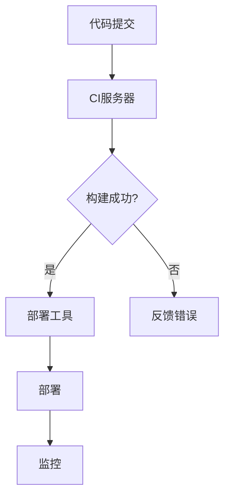

                 

关键词：DevOps、持续集成、持续部署、CI/CD、自动化、敏捷开发、敏捷运维、容器化、Kubernetes、微服务、基础设施即代码（IaC）、GitOps。

## 摘要

本文深入探讨了DevOps文化中的两大支柱——持续集成（CI）与持续部署（CD）的最佳实践。通过详细阐述CI/CD的概念、架构、流程以及数学模型，本文旨在帮助读者理解其工作原理，并提供实际项目实践中的代码实例和解释。文章还分析了这些技术的应用场景，推荐了学习资源和开发工具，并对未来发展趋势与挑战进行了展望。

## 1. 背景介绍

在当今快速变化的技术环境中，软件开发的速度和效率变得越来越重要。传统的软件开发模式通常涉及多个阶段的开发和测试，这些阶段往往是线性且分散的。然而，随着软件复杂性的增加和交付周期的缩短，这种模式变得不再高效和灵活。

为了应对这些挑战，DevOps文化逐渐兴起。DevOps是一种强调软件开发与运维团队之间紧密协作的文化，旨在通过自动化和敏捷方法提高软件交付的速度和质量。持续集成（Continuous Integration，CI）和持续部署（Continuous Deployment，CD）是DevOps实践中的两个关键概念，它们共同构成了CI/CD流程。

持续集成强调开发人员频繁地将代码合并到共享的代码库中，并通过自动化的构建和测试来确保代码的质量。持续部署则是在持续集成的基础上，自动化将代码部署到生产环境的过程。这两者的结合使得软件可以从开发到生产的过程更加高效和可靠。

本文将详细介绍CI/CD的架构、流程和最佳实践，并通过实际项目实例来展示如何实现这一流程。接下来，我们将首先定义并理解CI/CD的核心概念。

## 2. 核心概念与联系

### 2.1 持续集成（CI）

持续集成是一种软件开发实践，旨在通过频繁地将代码合并到共享的代码库中，并快速发现和修复集成过程中的问题。CI的主要目标是保持代码库的一致性和可靠性，确保每次代码更改都不会破坏现有功能。

#### 持续集成的优势：

1. **快速反馈**：开发人员可以立即得知他们的代码更改是否影响了其他模块或功能。
2. **提高代码质量**：通过频繁的测试，可以更快地识别和修复缺陷。
3. **缩短发布周期**：持续集成有助于缩短从开发到部署的周期。

#### 持续集成的工作流程：

1. **代码提交**：开发人员将代码提交到共享的代码库。
2. **自动化构建**：CI工具自动构建和打包代码。
3. **测试**：CI工具运行一系列预定义的测试，包括单元测试、集成测试和性能测试。
4. **反馈**：测试结果反馈给开发人员，告知代码是否通过了集成测试。

### 2.2 持续部署（CD）

持续部署是持续集成的自然延伸，它自动化了从代码库到生产环境的部署过程。CD的目标是确保软件可以快速、安全地交付到用户手中。

#### 持续部署的优势：

1. **快速交付**：通过自动化部署，可以减少手动操作，提高部署速度。
2. **减少风险**：通过在测试环境中频繁部署，可以降低生产环境中的风险。
3. **提高可靠性**：自动化的部署流程减少了人为错误的可能性。

#### 持续部署的工作流程：

1. **代码库**：从代码库中提取最新的代码。
2. **构建**：构建和打包代码。
3. **测试**：在部署前运行测试以确保代码的质量。
4. **部署**：将代码部署到生产环境。
5. **监控**：部署后监控系统的性能和健康状态。

### 2.3 CI/CD架构

CI/CD流程通常需要一个强大的技术架构来支持。以下是一些关键的组成部分：

1. **代码库**：如Git，用于存储和管理代码。
2. **CI服务器**：如Jenkins、Travis CI等，用于自动化构建和测试代码。
3. **部署工具**：如Docker、Kubernetes，用于容器化和部署应用。
4. **监控工具**：如Prometheus、Grafana，用于监控系统的性能和健康状态。
5. **配置管理工具**：如Ansible、Terraform，用于管理基础设施。

#### Mermaid 流程图

以下是CI/CD流程的Mermaid流程图表示：



通过这个流程图，我们可以清晰地看到代码从提交到最终部署的整个过程。

### 2.4 CI/CD与DevOps的关系

CI/CD是DevOps文化的重要组成部分，它们共同推动了软件开发和运维的自动化和敏捷性。DevOps的目标是通过跨职能团队的协作和持续改进，提高软件交付的速度和质量。CI/CD是实现这一目标的关键手段。

### 2.5 CI/CD的核心原则

1. **自动化**：所有的构建、测试和部署过程都应该自动化，以减少人为错误和重复工作。
2. **快速反馈**：通过快速反馈，可以及时发现和修复问题。
3. **持续改进**：CI/CD是一个持续的过程，需要不断优化和改进。
4. **协作**：开发和运维团队需要紧密协作，共同推动软件交付。

### 2.6 CI/CD的实际案例

例如，许多大型科技公司，如Netflix、Spotify和Amazon，已经成功实施了CI/CD流程。Netflix每天部署数千次代码更改，而Spotify每季度可以部署超过10000个版本。这些成功案例证明了CI/CD在提高软件交付速度和质量方面的巨大潜力。

## 3. 核心算法原理 & 具体操作步骤

### 3.1 算法原理概述

CI/CD的核心算法原理是基于版本控制和自动化工具，通过一系列预定义的步骤，实现代码的构建、测试和部署。以下是CI/CD的基本原理：

1. **版本控制**：使用Git等版本控制工具管理代码库，确保代码的一致性和可追溯性。
2. **自动化构建**：使用CI服务器（如Jenkins）自动化编译和打包代码，生成可执行的二进制文件。
3. **自动化测试**：运行一系列预定义的测试（如单元测试、集成测试和性能测试），确保代码的质量。
4. **部署**：使用部署工具（如Docker、Kubernetes）将代码部署到生产环境。
5. **监控**：使用监控工具（如Prometheus、Grafana）监控系统的性能和健康状态。

### 3.2 算法步骤详解

1. **代码提交**
   - 开发人员将代码提交到代码库。
   - CI服务器检测到提交并触发构建过程。

2. **自动化构建**
   - CI服务器克隆代码库并编译代码。
   - 生成可执行的二进制文件。

3. **自动化测试**
   - 运行预定义的测试（如单元测试、集成测试和性能测试）。
   - 如果测试失败，反馈错误信息并暂停构建。

4. **部署**
   - 如果测试通过，CI服务器将代码部署到测试环境。
   - 在测试环境中运行更多的测试，确保代码的质量。

5. **监控**
   - 将代码部署到生产环境之前，监控系统性能和健康状态。
   - 如果系统不符合预定义的阈值，暂停部署。

6. **反馈**
   - 将测试和部署的结果反馈给开发人员。

### 3.3 算法优缺点

#### 优点

1. **提高交付速度**：通过自动化和持续集成，可以快速交付高质量的软件。
2. **减少风险**：通过频繁的测试和部署，可以降低生产环境中的风险。
3. **提高协作效率**：CI/CD鼓励开发和运维团队的紧密协作，提高整体效率。

#### 缺点

1. **初始设置复杂**：CI/CD流程需要一定的技术栈和基础设施支持，初始设置可能比较复杂。
2. **测试成本**：频繁的测试可能会增加测试成本。
3. **系统稳定性**：如果CI/CD流程设置不当，可能会导致系统稳定性问题。

### 3.4 算法应用领域

CI/CD适用于所有类型的软件项目，特别是那些需要频繁交付和更新的大型项目。以下是CI/CD的一些常见应用领域：

1. **Web应用**：如电子商务平台、社交媒体应用等。
2. **移动应用**：如iOS和Android应用。
3. **云计算服务**：如SaaS应用、PaaS平台等。
4. **物联网（IoT）**：如智能家居设备、智能穿戴设备等。

## 4. 数学模型和公式 & 详细讲解 & 举例说明

### 4.1 数学模型构建

CI/CD流程中的数学模型主要涉及两个关键指标：构建时间和部署频率。以下是这些指标的基本公式：

#### 构建时间（Build Time，BT）

$$
BT = T_{compile} + T_{test} + T_{deploy}
$$

其中，$T_{compile}$ 是编译时间，$T_{test}$ 是测试时间，$T_{deploy}$ 是部署时间。

#### 部署频率（Deployment Frequency，DF）

$$
DF = \frac{N}{T}
$$

其中，$N$ 是每次部署的代码变更数量，$T$ 是部署周期。

### 4.2 公式推导过程

假设每次部署的代码变更数量为$N$，部署周期为$T$，构建时间为$BT$，则：

$$
N = \frac{BT}{T}
$$

将$N$代入部署频率的公式，得到：

$$
DF = \frac{N}{T} = \frac{BT}{T^2}
$$

因此，部署频率与构建时间成正比，与部署周期成反比。

### 4.3 案例分析与讲解

以下是一个实际的案例：

假设一个项目的编译时间为$T_{compile} = 10$分钟，测试时间为$T_{test} = 20$分钟，部署时间为$T_{deploy} = 5$分钟。每次部署的代码变更数量为$N = 5$，部署周期为$T = 2$小时。

根据上述公式，构建时间$BT$为：

$$
BT = T_{compile} + T_{test} + T_{deploy} = 10 + 20 + 5 = 35 \text{分钟}
$$

部署频率$DF$为：

$$
DF = \frac{N}{T} = \frac{5}{2 \times 60} = 0.0417 \text{次/小时}
$$

这意味着该项目的平均部署频率为每小时0.0417次。如果我们希望提高部署频率，可以通过减少编译时间、测试时间和部署时间来实现。

### 4.4 实际应用中的调整

在实际应用中，为了提高部署频率，我们通常会采用以下策略：

1. **并行化构建和测试**：通过使用多核处理器和分布式测试框架，可以并行执行编译和测试，从而减少构建时间。
2. **优化测试流程**：通过优化测试脚本和减少冗余测试，可以缩短测试时间。
3. **自动化部署**：通过使用自动化部署工具，可以减少部署时间。

通过这些调整，可以显著提高部署频率，从而加快软件交付的速度。

## 5. 项目实践：代码实例和详细解释说明

### 5.1 开发环境搭建

在本节中，我们将搭建一个简单的开发环境，用于演示CI/CD流程。我们将使用Docker和Kubernetes来容器化和部署应用。

#### 5.1.1 安装Docker

首先，我们需要在开发机上安装Docker。Docker是一个开源的应用容器引擎，用于封装、交付和运行应用。

1. 安装Docker Engine：

```bash
sudo apt-get update
sudo apt-get install docker-ce docker-ce-cli containerd.io
```

2. 启动Docker服务：

```bash
sudo systemctl start docker
```

3. 验证Docker安装：

```bash
docker --version
```

#### 5.1.2 安装Kubernetes

接下来，我们需要安装Kubernetes。Kubernetes是一个开源的容器编排平台，用于自动化部署、扩展和管理容器化应用。

1. 安装Kubernetes的依赖项：

```bash
sudo apt-get update
sudo apt-get install -y apt-transport-https ca-certificates curl
```

2. 添加Kubernetes的GPG密钥：

```bash
curl -s https://mirrors.aliyun.com/kubernetes/apt/doc/apt-key.gpg | sudo apt-key add -
```

3. 添加Kubernetes的APT仓库：

```bash
cat <<EOF | sudo tee /etc/apt/sources.list.d/kubernetes.list
deb https://mirrors.aliyun.com/kubernetes/apt/ kubernetes-xenial main
EOF
```

4. 安装Kubernetes的组件：

```bash
sudo apt-get update
sudo apt-get install -y kubelet kubeadm kubectl
```

5. 启动Kubernetes的kubelet服务：

```bash
sudo systemctl start kubelet
```

6. 验证Kubernetes安装：

```bash
kubectl version --short
```

### 5.2 源代码详细实现

在本节中，我们将创建一个简单的Web应用，并使用Docker和Kubernetes对其进行容器化和部署。

#### 5.2.1 创建Dockerfile

首先，我们需要创建一个Dockerfile来构建应用镜像。

```Dockerfile
# 使用官方的Python镜像作为基础镜像
FROM python:3.8

# 设置工作目录
WORKDIR /app

# 复制源代码到容器中
COPY . /app

# 安装依赖项
RUN pip install -r requirements.txt

# 暴露应用端口
EXPOSE 8000

# 运行应用
CMD ["python", "app.py"]
```

#### 5.2.2 创建应用代码

接下来，我们需要创建一个简单的Flask应用。

```python
# app.py
from flask import Flask
app = Flask(__name__)

@app.route('/')
def hello():
    return 'Hello, World!'

if __name__ == '__main__':
    app.run(host='0.0.0.0', port=8000)
```

#### 5.2.3 编写Docker Compose文件

为了方便部署，我们可以使用Docker Compose来定义和运行多容器Docker应用。

```yaml
# docker-compose.yml
version: '3.8'

services:
  web:
    build: .
    ports:
      - "8000:8000"
```

### 5.3 代码解读与分析

在本节中，我们将对上述代码进行解读和分析。

#### Dockerfile

- **基础镜像**：使用Python官方镜像作为基础镜像，确保运行环境的稳定性。
- **工作目录**：将工作目录设置为`/app`，方便管理。
- **复制代码**：将本地代码复制到容器中。
- **安装依赖**：使用pip安装应用所需的依赖项。
- **暴露端口**：暴露应用端口`8000`，以便外部访问。
- **运行应用**：使用`CMD`命令运行应用。

#### Flask应用

- **Flask框架**：使用Flask框架创建Web应用。
- **路由**：定义了一个路由`/`，返回'Hello, World!'字符串。
- **应用入口**：使用`if __name__ == '__main__':`确保应用在容器启动时自动运行。

#### docker-compose.yml

- **服务定义**：定义了一个名为`web`的服务，构建自当前目录下的Dockerfile。
- **端口映射**：将容器的`8000`端口映射到宿主机的`8000`端口，方便访问。

### 5.4 运行结果展示

通过以下命令，我们可以启动应用并验证其运行结果：

```bash
docker-compose up -d
```

访问`http://localhost:8000`，可以看到应用成功运行并返回'Hello, World!'字符串。

```plaintext
$ curl localhost:8000
Hello, World!
```

通过这个简单的示例，我们可以看到如何使用Docker和Kubernetes实现CI/CD流程。在实际项目中，我们可以根据需求进一步扩展和优化。

## 6. 实际应用场景

### 6.1 Web应用

CI/CD在Web应用开发中具有广泛的应用，特别是在需要快速迭代和频繁更新的场景下。通过CI/CD，开发团队能够确保每次代码变更都会经过全面的测试和部署，从而提高代码质量和部署效率。例如，社交媒体平台如Twitter和Facebook，会使用CI/CD来自动化他们的后端服务，如用户数据管理、消息传递和内容推荐等。

### 6.2 移动应用

随着移动设备的普及，移动应用开发变得越来越重要。CI/CD在移动应用开发中也得到了广泛应用。通过CI/CD，开发团队能够自动化构建和测试移动应用，确保每个版本都经过严格的测试和验证。例如，移动游戏公司可以使用CI/CD来自动化他们的游戏测试和部署，以确保游戏能够在多个平台上无缝运行。

### 6.3 云计算服务

在云计算领域，CI/CD用于自动化云服务的构建、测试和部署。云计算服务提供商如AWS、Azure和Google Cloud，都广泛采用CI/CD来确保他们的服务能够快速交付和更新。通过CI/CD，服务提供商能够自动化大规模基础设施的部署和管理，从而提高效率和服务质量。

### 6.4 物联网（IoT）

随着物联网技术的发展，越来越多的设备和系统开始联网。CI/CD在物联网项目中用于自动化设备的固件更新和系统配置。通过CI/CD，开发团队能够确保每个设备的固件都是最新的，并且系统配置是正确的。例如，智能家居系统可以使用CI/CD来自动化设备固件的升级和系统配置的更新。

### 6.5 优势与挑战

**优势：**

- **提高交付速度**：通过自动化和持续集成，可以快速交付高质量的软件。
- **减少风险**：通过频繁的测试和部署，可以降低生产环境中的风险。
- **提高协作效率**：CI/CD鼓励开发和运维团队的紧密协作，提高整体效率。

**挑战：**

- **初始设置复杂**：CI/CD流程需要一定的技术栈和基础设施支持，初始设置可能比较复杂。
- **测试成本**：频繁的测试可能会增加测试成本。
- **系统稳定性**：如果CI/CD流程设置不当，可能会导致系统稳定性问题。

## 7. 工具和资源推荐

### 7.1 学习资源推荐

1. **《CI/CD实践指南》**：由Docker和Jenkins社区联合发布的实践指南，详细介绍了CI/CD的原理和实践。
2. **《DevOps手册》**：由DevOps Institute发布的免费电子书，涵盖了DevOps的基本概念、实践和工具。
3. **《持续集成与持续部署：实践指南》**：由Amazon Web Services（AWS）发布，介绍了如何使用AWS服务实现CI/CD。

### 7.2 开发工具推荐

1. **Jenkins**：一款流行的开源CI/CD工具，支持多种插件和自动化功能。
2. **GitLab CI/CD**：GitLab内置的CI/CD工具，支持持续集成和持续部署。
3. **Docker**：用于容器化应用的工具，可以简化应用的部署和管理。
4. **Kubernetes**：用于容器编排和管理的工具，可以自动化部署和管理容器化应用。

### 7.3 相关论文推荐

1. **"Continuous Integration in the Age of Agile"**：探讨了CI在敏捷开发中的应用和优势。
2. **"The Case for Continuous Deployment"**：分析了CD对软件交付速度和质量的影响。
3. **"DevOps and the New IT Toolbox"**：讨论了DevOps文化和工具如何改变软件开发和运维。

## 8. 总结：未来发展趋势与挑战

### 8.1 研究成果总结

CI/CD作为DevOps实践的核心，已经证明其在提高软件交付速度和质量方面的巨大潜力。通过自动化和持续集成，开发团队能够更快地交付高质量的软件，同时降低生产环境中的风险。随着云计算、容器化和微服务技术的不断发展，CI/CD的应用范围将进一步扩大。

### 8.2 未来发展趋势

1. **更高级的自动化**：未来的CI/CD将更加自动化，包括更复杂的构建、测试和部署流程。
2. **更广泛的集成**：CI/CD将不仅仅局限于代码的构建和部署，还将涵盖基础设施的自动化部署和管理。
3. **更强大的监控与反馈**：CI/CD将集成更强大的监控和反馈机制，以确保系统的稳定性和性能。

### 8.3 面临的挑战

1. **复杂度增加**：随着CI/CD流程的复杂度增加，如何管理和维护这些流程将成为挑战。
2. **安全性**：在自动化和快速交付的过程中，如何确保系统的安全性是一个重要的挑战。
3. **技能缺口**：随着CI/CD的广泛应用，对相关技能的需求也将增加，但当前市场上存在一定的技能缺口。

### 8.4 研究展望

未来的研究应重点关注如何更好地自动化CI/CD流程，提高系统的稳定性和安全性，并培养更多的CI/CD专家。此外，随着新型技术的不断发展，如人工智能和区块链，CI/CD也将在这些领域得到更深入的应用和研究。

## 9. 附录：常见问题与解答

### 9.1 什么是CI/CD？

CI/CD是指持续集成（Continuous Integration）和持续部署（Continuous Deployment）的总称，是一种软件开发实践，通过自动化和频繁的代码合并、测试和部署，提高软件交付的速度和质量。

### 9.2 CI/CD有哪些优点？

CI/CD的主要优点包括：

- 提高交付速度：通过自动化和频繁的集成，可以快速交付高质量的软件。
- 减少风险：通过频繁的测试和部署，可以降低生产环境中的风险。
- 提高协作效率：CI/CD鼓励开发和运维团队的紧密协作，提高整体效率。

### 9.3 CI/CD需要哪些工具？

CI/CD通常需要以下工具：

- 版本控制工具：如Git。
- CI服务器：如Jenkins、GitLab CI。
- 部署工具：如Docker、Kubernetes。
- 监控工具：如Prometheus、Grafana。
- 配置管理工具：如Ansible、Terraform。

### 9.4 CI/CD如何与DevOps相结合？

CI/CD是DevOps文化的重要组成部分，与DevOps相结合可以实现以下目标：

- 促进开发和运维团队的协作。
- 提高软件交付的速度和质量。
- 通过自动化和持续改进，实现持续交付。

### 9.5 CI/CD是否适用于所有项目？

CI/CD适用于所有类型的软件项目，特别是那些需要频繁交付和更新的大型项目。然而，对于小型项目和短期项目，CI/CD的实施可能不如大型项目有效。

### 9.6 CI/CD是否会影响系统稳定性？

如果CI/CD流程设置不当，可能会影响系统稳定性。因此，正确的CI/CD实践，包括自动化测试、监控和反馈机制，是确保系统稳定性的关键。

### 9.7 如何提高CI/CD的效率？

提高CI/CD效率的方法包括：

- 并行化构建和测试。
- 优化测试流程。
- 使用自动化部署工具。
- 定期审查和优化CI/CD流程。

## 作者署名

作者：禅与计算机程序设计艺术 / Zen and the Art of Computer Programming

[END]

