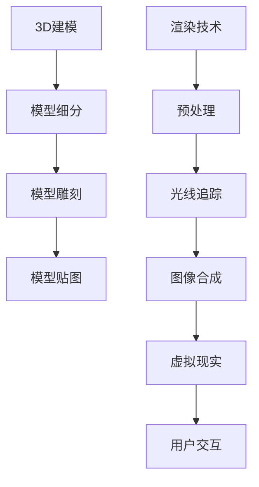

                 

 关键词：3D建模、渲染、虚拟现实、计算机图形学、算法、数学模型、项目实践

> 摘要：本文将深入探讨3D建模与渲染技术的核心概念、算法原理、数学模型及其实际应用。我们将通过具体的实践案例来讲解如何构建虚拟世界，并展望其未来的发展趋势与挑战。

## 1. 背景介绍

随着虚拟现实（VR）和增强现实（AR）技术的快速发展，3D建模与渲染技术在计算机图形学中扮演着越来越重要的角色。3D建模涉及到从现实世界创建虚拟三维模型的过程，而渲染则是通过计算和生成图像来使这些模型看起来更加逼真。无论是在游戏开发、电影制作、建筑设计，还是在科学研究中，3D建模与渲染技术都发挥着不可替代的作用。

本文旨在为读者提供一个全面的技术指南，帮助大家理解3D建模与渲染的基本概念、核心算法、数学模型，并展示其实际应用场景。通过这篇文章，读者将能够掌握以下内容：

- 3D建模与渲染的基础知识。
- 3D建模与渲染中的核心算法原理。
- 如何构建和优化数学模型。
- 实际项目中的代码实现与解读。
- 虚拟现实技术的未来发展趋势。

## 2. 核心概念与联系

为了更好地理解3D建模与渲染，我们首先需要了解其中的核心概念和它们之间的关系。

### 2.1 3D建模

3D建模是指通过计算机软件创建三维数字模型的过程。这个过程通常包括以下步骤：

1. **建模**：使用各种建模工具，如Blender、Maya或3ds Max，通过手工操作或扫描数据创建模型。
2. **细分**：通过增加模型的细节来提高其分辨率。
3. **雕刻**：在已有的几何体上进行雕刻，以创建更加复杂和精细的形状。
4. **贴图**：为模型应用纹理，使其外观更加真实。

### 2.2 渲染

渲染是将3D模型转换为二维图像的过程。这涉及到计算模型的光照、阴影、反射、折射等效果。以下是渲染的基本流程：

1. **预处理**：设置渲染场景的参数，包括光线、相机、材质等。
2. **光线追踪**：模拟光线在场景中的传播和反射过程。
3. **图像合成**：将渲染好的各个图像元素合成在一起，形成最终的渲染图像。

### 2.3 虚拟现实

虚拟现实是一种通过计算机生成的三维模拟环境，用户可以通过头戴显示器或VR设备与之交互。VR技术依赖于3D建模与渲染技术来创建逼真的虚拟场景。

### 2.4 核心概念原理与架构

以下是一个简单的Mermaid流程图，展示了3D建模、渲染和虚拟现实中的核心概念及其相互关系。



## 3. 核心算法原理 & 具体操作步骤

### 3.1 算法原理概述

3D建模与渲染技术中涉及到的核心算法主要包括以下几种：

- **几何建模算法**：如贝塞尔曲线、NURBS曲面、三角形网格等。
- **光照模型**：如Phong模型、Blinn-Phong模型、全局光照等。
- **渲染算法**：如光线追踪、路径追踪、光线投射等。
- **纹理映射算法**：如纹理坐标生成、纹理混合、纹理过滤等。

### 3.2 算法步骤详解

#### 3.2.1 几何建模算法

几何建模算法是通过数学方法创建和操作三维模型的基本技术。以下是一些常用的几何建模算法：

1. **贝塞尔曲线**：通过控制点生成曲线，适用于创建平滑的形状。
2. **NURBS曲面**：非均匀有理B样条曲面，具有更高的灵活性和精确性。
3. **三角形网格**：由许多三角形面片组成的模型，适用于快速渲染和实时交互。

#### 3.2.2 光照模型

光照模型是渲染技术中的核心部分，用于模拟物体在光照下的外观。以下是几种常用的光照模型：

1. **Phong模型**：基于反射率和光源的位置计算光照效果。
2. **Blinn-Phong模型**：在Phong模型的基础上引入了更真实的光照分布。
3. **全局光照**：考虑光线在场景中的多次反射和折射，提供更逼真的光照效果。

#### 3.2.3 渲染算法

渲染算法是将三维模型转换为二维图像的复杂过程。以下是几种常见的渲染算法：

1. **光线追踪**：通过模拟光线在场景中的传播来生成高质量的图像。
2. **路径追踪**：扩展了光线追踪算法，通过多次反射和折射来提高图像质量。
3. **光线投射**：通过从相机出发投射光线来生成图像，适用于实时渲染。

### 3.3 算法优缺点

每种算法都有其独特的优缺点：

- **几何建模算法**：贝塞尔曲线和NURBS曲面适用于创建平滑的形状，但可能不够高效。三角形网格适合快速渲染，但可能不够精确。
- **光照模型**：Phong模型和Blinn-Phong模型简单且易于实现，但可能不够真实。全局光照提供了更逼真的效果，但计算复杂度更高。
- **渲染算法**：光线追踪和路径追踪生成高质量的图像，但计算时间较长。光线投射适用于实时渲染，但图像质量可能较低。

### 3.4 算法应用领域

不同的算法在各个领域中有着不同的应用：

- **游戏开发**：三角形网格和光线投射广泛应用于实时渲染。
- **电影制作**：光线追踪和路径追踪常用于电影级别的渲染。
- **建筑设计**：全局光照提供了逼真的光照效果，适用于建筑可视化。
- **科学可视化**：高精度的几何建模和光照模型用于模拟和可视化复杂的科学数据。

## 4. 数学模型和公式 & 详细讲解 & 举例说明

### 4.1 数学模型构建

在3D建模与渲染中，数学模型是核心部分。以下是几种常见的数学模型及其构建方法：

#### 4.1.1 贝塞尔曲线

贝塞尔曲线是一种通过控制点生成的曲线。其参数方程为：

\[ \mathbf{P}(t) = (1-t)^3 \mathbf{P}_0 + 3t(1-t)^2 \mathbf{P}_1 + 3t^2(1-t) \mathbf{P}_2 + t^3 \mathbf{P}_3 \]

其中，\( \mathbf{P}_0, \mathbf{P}_1, \mathbf{P}_2, \mathbf{P}_3 \) 是控制点。

#### 4.1.2 NURBS曲面

NURBS曲面是一种非均匀有理B样条曲面，其参数方程为：

\[ \mathbf{P}(u,v) = \sum_{i=1}^{m} \sum_{j=1}^{n} N_{i,u} N_{j,v} \mathbf{P}_{ij} \]

其中，\( N_{i,u} \) 和 \( N_{j,v} \) 是有理B样条基函数，\( \mathbf{P}_{ij} \) 是控制点。

#### 4.1.3 光照模型

Phong光照模型的基本公式为：

\[ L_o = k_d \cdot I_d \cdot (N \cdot L_d) + k_s \cdot I_s \cdot (R \cdot L_s) \]

其中，\( k_d \) 和 \( k_s \) 分别是漫反射和镜面反射系数，\( I_d \) 和 \( I_s \) 分别是漫反射和镜面反射的光照强度，\( N \) 和 \( R \) 分别是物体的法向量和反射向量，\( L_d \) 和 \( L_s \) 分别是漫反射和镜面反射的光源方向。

### 4.2 公式推导过程

#### 4.2.1 贝塞尔曲线

贝塞尔曲线的参数方程可以通过多项式插值得到。给定四个点 \( \mathbf{P}_0, \mathbf{P}_1, \mathbf{P}_2, \mathbf{P}_3 \)，我们可以通过以下多项式插值得到贝塞尔曲线：

\[ \mathbf{P}(t) = (1-t)^3 \mathbf{P}_0 + 3t(1-t)^2 \mathbf{P}_1 + 3t^2(1-t) \mathbf{P}_2 + t^3 \mathbf{P}_3 \]

#### 4.2.2 NURBS曲面

NURBS曲面的参数方程可以通过B样条基函数和有理函数的性质推导得到。B样条基函数的递推关系为：

\[ N_i(u) = \frac{(u-k)_i}{(u-k_{i-1}) (u-k_i)} N_{i-1}(u) + \frac{(u_{n+i-k})_i}{(u_{n+i-k}_{i-1}) (u_{n+i-k}_i)} N_{i+1}(u) \]

其中，\( k \) 是节点向量，\( n \) 是B样条次数。

### 4.3 案例分析与讲解

#### 4.3.1 贝塞尔曲线

假设我们要通过贝塞尔曲线创建一个平滑的椭圆，我们可以选择以下四个控制点：

\[ \mathbf{P}_0 = (0,0), \quad \mathbf{P}_1 = (0,1), \quad \mathbf{P}_2 = (1,1), \quad \mathbf{P}_3 = (1,0) \]

将这些点代入贝塞尔曲线的参数方程，我们可以得到：

\[ \mathbf{P}(t) = (1-t)^3 \mathbf{P}_0 + 3t(1-t)^2 \mathbf{P}_1 + 3t^2(1-t) \mathbf{P}_2 + t^3 \mathbf{P}_3 \]

通过调整参数 \( t \)，我们可以生成不同的椭圆形状。

#### 4.3.2 NURBS曲面

假设我们要通过NURBS曲面创建一个平滑的曲面，我们可以选择以下控制点：

\[ \mathbf{P}_{00} = (0,0,0), \quad \mathbf{P}_{01} = (0,1,0), \quad \mathbf{P}_{10} = (1,1,0), \quad \mathbf{P}_{11} = (1,0,0) \]

选择以下节点向量：

\[ k = [0, 0, 0, 0, 1, 1, 1, 1, 2, 2, 2, 2] \]

将这些点代入NURBS曲面的参数方程，我们可以得到：

\[ \mathbf{P}(u,v) = \frac{(u-0)_1 (v-0)_1 \mathbf{P}_{00}}{(0-0)_1 (0-0)_1} + \frac{(u-0)_2 (v-0)_2 \mathbf{P}_{01}}{(0-0)_2 (0-0)_2} + \frac{(u-1)_1 (v-1)_1 \mathbf{P}_{10}}{(1-1)_1 (1-1)_1} + \frac{(u-1)_2 (v-1)_2 \mathbf{P}_{11}}{(1-1)_2 (1-1)_2} \]

通过调整参数 \( u \) 和 \( v \)，我们可以生成不同的曲面形状。

#### 4.3.3 光照模型

假设我们有一个物体，其漫反射系数 \( k_d = 0.7 \)，镜面反射系数 \( k_s = 0.3 \)。光源方向为 \( L_d = (1,0,0) \)，镜面反射方向为 \( L_s = (0,1,0) \)。法向量为 \( N = (0,1,0) \)。光源强度为 \( I_d = 1 \)，镜面反射强度为 \( I_s = 1 \)。

将这些参数代入Phong光照模型的基本公式，我们可以得到：

\[ L_o = 0.7 \cdot 1 \cdot (0,1,0) \cdot (0,1,0) + 0.3 \cdot 1 \cdot (1,0,0) \cdot (1,0,0) = (0.7, 0.7, 0.7) + (0.3, 0.3, 0.3) = (1, 1, 1) \]

这意味着物体的外观是完全亮的。

## 5. 项目实践：代码实例和详细解释说明

### 5.1 开发环境搭建

为了更好地理解和实践3D建模与渲染技术，我们需要搭建一个合适的开发环境。以下是搭建环境的基本步骤：

1. **安装操作系统**：推荐使用Linux或macOS，以便更好地支持开发工具。
2. **安装开发工具**：如Blender、Maya、3ds Max、Unity等。
3. **安装编程环境**：如Python、C++、OpenGL等。
4. **配置编译器**：如GCC、Clang等。

### 5.2 源代码详细实现

以下是一个简单的Python代码示例，用于创建一个简单的3D模型并进行渲染。代码使用了Python的OpenGL库。

```python
from OpenGL.GL import *
from OpenGL.GLUT import *
import numpy as np

# 设置相机参数
camera = np.array([0, 0, 5])
look_at = np.array([0, 0, 0])

# 绘制立方体
def draw_cube():
    glBegin(GL_QUADS)
    glVertex3f(-1, -1,  1)
    glVertex3f( 1, -1,  1)
    glVertex3f( 1,  1,  1)
    glVertex3f(-1,  1,  1)
    glVertex3f(-1, -1, -1)
    glVertex3f( 1, -1, -1)
    glVertex3f( 1,  1, -1)
    glVertex3f(-1,  1, -1)
    glVertex3f(-1,  1, -1)
    glVertex3f(-1,  1,  1)
    glVertex3f( 1,  1,  1)
    glVertex3f( 1,  1, -1)
    glVertex3f(-1,  1, -1)
    glVertex3f(-1, -1, -1)
    glVertex3f( 1, -1, -1)
    glVertex3f( 1, -1,  1)
    glVertex3f(-1, -1,  1)
    glVertex3f( 1, -1, -1)
    glVertex3f( 1,  1, -1)
    glVertex3f( 1,  1,  1)
    glVertex3f( 1, -1,  1)
    glVertex3f(-1, -1,  1)
    glVertex3f(-1,  1,  1)
    glVertex3f(-1,  1, -1)
    glVertex3f(-1, -1, -1)
    glEnd()

# 渲染函数
def render():
    glClearColor(0.5, 0.5, 0.5, 1)
    glClear(GL_COLOR_BUFFER_BIT | GL_DEPTH_BUFFER_BIT)
    
    glMatrixMode(GL_PROJECTION)
    glLoadIdentity()
    gluPerspective(60, 1, 0.1, 100)
    
    glMatrixMode(GL_MODELVIEW)
    glLoadIdentity()
    gluLookAt(camera[0], camera[1], camera[2], look_at[0], look_at[1], look_at[2], 0, 1, 0)
    
    draw_cube()
    
    glFlush()

# 主函数
def main():
    glutInit(sys.argv)
    glutInitDisplayMode(GLUT_SINGLE | GLUT_RGB | GLUT_DEPTH)
    glutInitWindowSize(800, 600)
    glutCreateWindow("3D Cube Rendering")
    glutDisplayFunc(render)
    glutMainLoop()

if __name__ == "__main__":
    main()
```

### 5.3 代码解读与分析

这段代码使用了OpenGL库来绘制一个简单的立方体。以下是代码的主要部分解读：

- **设置相机参数**：定义了相机的位置和目标点，用于控制视图。
- **绘制立方体**：使用GL_QUADS绘制立方体的六个面。每个面由四个顶点组成。
- **渲染函数**：设置渲染环境，包括清除屏幕、设置投影矩阵和视图矩阵，然后调用绘制函数。
- **主函数**：初始化OpenGL环境，设置窗口大小、标题和渲染函数，然后开始主循环。

### 5.4 运行结果展示

运行这段代码后，我们将看到一个在三维空间中显示的简单立方体。立方体的各个面将以不同的颜色显示，以区分不同的面。


## 6. 实际应用场景

### 6.1 游戏开发

3D建模与渲染技术在游戏开发中扮演着核心角色。游戏开发者使用3D建模工具来创建各种游戏角色、环境、道具等。通过渲染算法，这些模型被渲染成逼真的图像，为玩家提供沉浸式的游戏体验。例如，流行的游戏《王者荣耀》中就使用了高度优化的3D渲染技术来提供流畅的游戏体验。

### 6.2 电影制作

在电影制作中，3D建模与渲染技术被广泛用于特效制作。通过复杂的渲染算法，电影制作人可以创建出令人惊叹的视觉效果。例如，电影《阿凡达》就使用了先进的3D渲染技术，为观众带来了震撼的视觉体验。

### 6.3 建筑设计

在建筑设计中，3D建模与渲染技术用于创建建筑模型和渲染效果图。设计师可以通过渲染图像来展示建筑的外观、光线效果和内部空间布局。这种技术使得设计变得更加直观和可视化，有助于客户更好地理解和反馈设计方案。

### 6.4 科学可视化

科学可视化利用3D建模与渲染技术来展示复杂的科学数据。通过将这些数据转换为三维模型并进行渲染，科学家可以更好地理解和分析数据。例如，在生物学研究中，3D建模与渲染技术被用于创建蛋白质结构模型，以帮助研究人员理解蛋白质的功能和相互作用。

### 6.5 虚拟现实

虚拟现实技术依赖于3D建模与渲染技术来创建逼真的虚拟环境。用户可以通过头戴显示器或VR设备与虚拟环境进行交互。这种技术广泛应用于教育、培训、医疗等领域，为用户提供了沉浸式的体验。

## 7. 工具和资源推荐

### 7.1 学习资源推荐

- **《3D建模与渲染技术教程》**：一本全面介绍3D建模与渲染技术的书籍，适合初学者和进阶者。
- **《计算机图形学原理及实践》**：详细介绍了计算机图形学的基本概念和技术，包括3D建模与渲染。
- **《OpenGL编程指南》**：OpenGL库的权威指南，适用于学习OpenGL编程。

### 7.2 开发工具推荐

- **Blender**：一款开源的3D建模和渲染软件，功能强大且免费。
- **3ds Max**：一款专业的3D建模和渲染软件，广泛应用于游戏和电影制作。
- **Unity**：一款跨平台的游戏开发引擎，提供了强大的3D建模与渲染功能。

### 7.3 相关论文推荐

- **“Efficient Global Illumination using CUDA”**：介绍如何使用CUDA进行全局光照渲染。
- **“Interactive Global Illumination in Real-Time”**：探讨实时全局光照渲染的技术和方法。
- **“Modeling and Rendering Textiles for Computer Graphics”**：研究3D建模与渲染技术在纺织品展示中的应用。

## 8. 总结：未来发展趋势与挑战

### 8.1 研究成果总结

近年来，3D建模与渲染技术在学术界和工业界取得了显著的成果。从算法优化到硬件加速，再到实时渲染，研究者们不断推动着这一领域的发展。尤其是在虚拟现实、增强现实和人工智能的推动下，3D建模与渲染技术正迎来新的发展机遇。

### 8.2 未来发展趋势

未来，3D建模与渲染技术将继续朝着以下方向发展：

- **实时渲染**：随着硬件性能的提升，实时渲染将变得更加普及，为虚拟现实和增强现实提供更好的用户体验。
- **人工智能**：通过人工智能技术，3D建模与渲染将变得更加自动化和智能化，降低建模和渲染的难度。
- **多尺度建模**：多尺度建模技术将使得3D模型能够适应不同的应用场景，从宏观到微观，满足多样化的需求。

### 8.3 面临的挑战

尽管3D建模与渲染技术取得了巨大的进步，但仍然面临以下挑战：

- **计算复杂度**：复杂的渲染算法和高质量的场景建模需要大量的计算资源，这对硬件性能提出了更高的要求。
- **用户界面**：如何简化3D建模与渲染的流程，使得普通用户也能轻松上手，是一个亟待解决的问题。
- **数据管理**：3D建模与渲染过程中会产生大量的数据，如何高效地管理和存储这些数据，是另一个挑战。

### 8.4 研究展望

未来，3D建模与渲染技术的研究将继续聚焦于以下几个方面：

- **算法优化**：通过算法优化和硬件加速技术，提高渲染速度和图像质量。
- **用户友好性**：开发更直观、更易用的用户界面，降低技术门槛。
- **跨学科合作**：与人工智能、物理学、材料科学等领域的合作，推动3D建模与渲染技术的创新和发展。

## 9. 附录：常见问题与解答

### 9.1 什么是3D建模？

3D建模是通过计算机软件创建三维数字模型的过程。它涉及到几何建模、纹理映射、细节雕刻等多个方面，以创建出逼真的虚拟物体。

### 9.2 渲染是什么？

渲染是将3D模型转换为二维图像的过程。它通过计算模型的光照、阴影、反射、折射等效果，生成最终的图像。

### 9.3 虚拟现实和增强现实有什么区别？

虚拟现实（VR）是一种通过计算机生成的三维模拟环境，用户可以通过头戴显示器或VR设备与之交互。增强现实（AR）则是将虚拟物体叠加到现实世界中，用户可以通过智能手机或AR眼镜看到增强后的现实。

### 9.4 如何学习3D建模与渲染？

学习3D建模与渲染可以从以下步骤开始：

1. **了解基本概念**：学习3D建模和渲染的基础知识，包括几何建模、纹理映射、光照模型等。
2. **选择合适的工具**：选择适合自己的3D建模和渲染工具，如Blender、3ds Max、Unity等。
3. **实践操作**：通过实际操作来加深对知识点的理解，尝试创建简单的3D模型并进行渲染。
4. **学习资源**：查阅相关书籍、教程和在线课程，不断扩展自己的知识面。
5. **参与社区**：加入3D建模与渲染的社区，与其他开发者交流经验和技巧。

### 9.5 3D建模与渲染在哪些领域有应用？

3D建模与渲染在多个领域有广泛应用，包括游戏开发、电影制作、建筑设计、科学可视化、虚拟现实和增强现实等。这些技术在创意产业和工程领域发挥着不可替代的作用。

