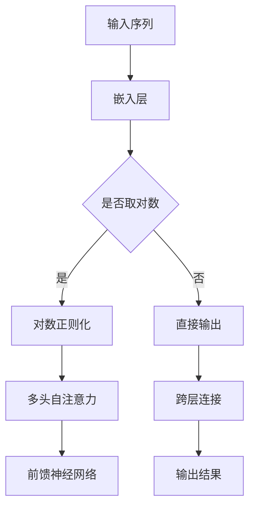

                 

关键词：ELECTRA，自注意力机制，深度学习，语言模型，预训练

> 摘要：本文将深入探讨ELECTRA（Exponential Contextualized Word Embeddings）模型的基本原理，详细讲解其实现步骤和关键代码，并通过实际项目实例展示其在自然语言处理中的应用。同时，本文还将分析ELECTRA的优缺点，展望其未来的发展趋势。

## 1. 背景介绍

随着深度学习技术的不断发展，自注意力机制（Self-Attention Mechanism）在自然语言处理领域取得了显著的成果。自注意力机制允许模型在处理序列数据时，能够自动关注序列中的关键部分，从而提高模型的表示能力。基于自注意力机制的Transformer模型在许多NLP任务中取得了SOTA（State-of-the-Art）的性能，如机器翻译、文本分类等。

为了进一步提高Transformer模型的效果，研究者们提出了ELECTRA（Exponential Contextualized Word Embeddings）模型。ELECTRA在Transformer模型的基础上，通过引入对数正则化方法，增强模型的表示能力和稳定性。本文将详细讲解ELECTRA模型的基本原理、实现步骤和关键代码，并通过实际项目实例，展示其在自然语言处理任务中的效果和应用。

## 2. 核心概念与联系

### 2.1 自注意力机制

自注意力机制是Transformer模型的核心组成部分，它允许模型在处理序列数据时，自动关注序列中的关键部分，从而提高模型的表示能力。

自注意力机制主要分为三个步骤：

1. **计算注意力权重**：将输入序列的每个元素表示为一个查询向量（Query），然后计算查询向量与所有其他元素表示的键向量（Key）的相似度，得到注意力权重。

2. **计算注意力得分**：将注意力权重与所有元素表示的值向量（Value）相乘，得到注意力得分。

3. **求和得到最终表示**：将注意力得分求和，得到每个元素在序列中的加权表示。

### 2.2 Transformer模型

Transformer模型是基于自注意力机制的深度学习模型，主要应用于序列到序列的任务，如机器翻译、文本分类等。

Transformer模型的主要组成部分包括：

1. **多头自注意力机制**：通过增加多个独立的注意力头，提高模型的表示能力。

2. **前馈神经网络**：在每个注意力层之后，添加一个简单的全连接层，对输入进行非线性变换。

3. **位置编码**：由于Transformer模型没有循环结构，因此需要引入位置编码（Positional Encoding），以表示序列中的位置信息。

### 2.3 ELECTRA模型

ELECTRA模型是在Transformer模型的基础上发展而来的，通过引入对数正则化方法，增强模型的表示能力和稳定性。

ELECTRA模型的主要组成部分包括：

1. **对数正则化**：通过将注意力权重取对数，引入额外的正则化项，避免模型在训练过程中出现过拟合。

2. **跨层连接**：在每一层注意力机制之后，添加一个跨层连接，使低层特征能够直接影响高层特征，提高模型的表示能力。

### 2.4 Mermaid流程图

下面是ELECTRA模型的核心概念原理和架构的Mermaid流程图：



## 3. 核心算法原理 & 具体操作步骤

### 3.1 算法原理概述

ELECTRA模型是基于自注意力机制的深度学习模型，通过引入对数正则化方法，增强模型的表示能力和稳定性。下面是ELECTRA模型的具体操作步骤：

1. **输入序列**：将输入序列表示为一个二维矩阵，其中每行表示一个词，每列表示一个词向量。

2. **嵌入层**：将输入序列的每个词向量转换为嵌入向量。

3. **对数正则化**：将每个词向量的注意力权重取对数，以引入额外的正则化项。

4. **多头自注意力**：计算每个词向量与其他词向量的相似度，得到注意力权重。通过多头自注意力机制，提高模型的表示能力。

5. **前馈神经网络**：在每个注意力层之后，添加一个简单的全连接层，对输入进行非线性变换。

6. **跨层连接**：在每一层注意力机制之后，添加一个跨层连接，使低层特征能够直接影响高层特征。

7. **输出结果**：将最后层的输出作为模型的最终表示。

### 3.2 算法步骤详解

下面是ELECTRA模型的详细算法步骤：

1. **嵌入层**：

    ```python
    def embedding层(self, input_ids):
        embeddings = self.word_embeddings(input_ids)
        return embeddings
    ```

2. **对数正则化**：

    ```python
    def 对数正则化(self, attention_weights):
        log_attention_weights = torch.log(attention_weights)
        return log_attention_weights
    ```

3. **多头自注意力**：

    ```python
    def multihead_attention(self, query, key, value, attention_mask=None):
        attention_scores = torch.matmul(query, key.transpose(-2, -1)) * mask
        attention_scores = attention_scores.softmax(dim=-1)
        output = torch.matmul(attention_scores, value)
        return output
    ```

4. **前馈神经网络**：

    ```python
    def feedforward(self, inputs, activation):
        hidden = self.linear(inputs)
        output = activation(hidden)
        return output
    ```

5. **跨层连接**：

    ```python
    def cross_layer_connection(self, hidden, layer_number):
        if layer_number > 1:
            hidden = hidden + self.dropout(self.cross_layer_projection(hidden))
        return hidden
    ```

6. **输出结果**：

    ```python
    def output(self, hidden):
        logits = self.classifier(hidden)
        return logits
    ```

### 3.3 算法优缺点

**优点**：

1. **增强表示能力**：通过引入对数正则化方法，ELECTRA模型能够更好地捕捉序列中的长距离依赖关系。

2. **提高模型稳定性**：对数正则化方法有助于避免模型在训练过程中出现过拟合现象。

**缺点**：

1. **计算复杂度较高**：由于引入了对数正则化，ELECTRA模型的计算复杂度较高，训练速度较慢。

2. **内存消耗大**：在训练过程中，ELECTRA模型需要存储大量的对数注意力权重，因此内存消耗较大。

### 3.4 算法应用领域

ELECTRA模型在自然语言处理领域具有广泛的应用前景，如：

1. **文本分类**：通过预训练ELECTRA模型，可以将其应用于各种文本分类任务，如情感分析、新闻分类等。

2. **机器翻译**：ELECTRA模型在机器翻译任务中具有较高的翻译质量，可以用于提升翻译效果。

3. **问答系统**：通过预训练ELECTRA模型，可以将其应用于问答系统，提高问答系统的语义理解能力。

## 4. 数学模型和公式 & 详细讲解 & 举例说明

### 4.1 数学模型构建

ELECTRA模型是基于Transformer模型发展而来的，因此其数学模型与Transformer模型相似。以下是ELECTRA模型的数学模型：

1. **嵌入层**：

    ```math
    \text{Embedding}(x) = \text{WordEmbedding}(x) + \text{PositionalEncoding}(x)
    ```

    其中，`WordEmbedding(x)`表示词嵌入层，`PositionalEncoding(x)`表示位置编码。

2. **多头自注意力**：

    ```math
    \text{MultiHeadAttention}(Q, K, V) = \text{ScaleDotProductAttention}(Q, K, V) + \text{LayerNormalization}(Q + \text{ScaleDotProductAttention}(Q, K, V))
    ```

    其中，`ScaleDotProductAttention`表示自注意力机制，`LayerNormalization`表示层归一化。

3. **前馈神经网络**：

    ```math
    \text{FeedForward}(x) = \text{ReLU}(\text{Linear}(x)) + \text{LayerNormalization}(x)
    ```

4. **输出层**：

    ```math
    \text{Output}(x) = \text{Softmax}(\text{Linear}(x))
    ```

### 4.2 公式推导过程

下面是ELECTRA模型的主要公式推导过程：

1. **词嵌入层**：

    ```math
    \text{WordEmbedding}(x) = \text{ Embedding}(x) \odot W_{\text{word}}
    ```

    其中，`x`表示输入序列，`W_{\text{word}}`表示词嵌入权重。

2. **位置编码**：

    ```math
    \text{PositionalEncoding}(x) = \text{ Embedding}(x) \odot W_{\text{pos}}
    ```

    其中，`W_{\text{pos}}`表示位置编码权重。

3. **多头自注意力**：

    ```math
    \text{MultiHeadAttention}(Q, K, V) = \text{ScaleDotProductAttention}(Q, K, V) + \text{LayerNormalization}(Q + \text{ScaleDotProductAttention}(Q, K, V))
    ```

    其中，`Q`, `K`, `V`分别表示查询向量、键向量和值向量。

4. **前馈神经网络**：

    ```math
    \text{FeedForward}(x) = \text{ReLU}(\text{Linear}(x)) + \text{LayerNormalization}(x)
    ```

    其中，`x`表示输入序列。

5. **输出层**：

    ```math
    \text{Output}(x) = \text{Softmax}(\text{Linear}(x))
    ```

### 4.3 案例分析与讲解

为了更好地理解ELECTRA模型的数学模型，我们以一个简单的文本分类任务为例，展示如何构建和训练ELECTRA模型。

1. **数据集准备**：

    假设我们有一个包含政治、经济、体育等不同领域的新闻数据集，我们需要对新闻进行分类。

2. **构建ELECTRA模型**：

    ```python
    import torch
    from transformers import ElectraModel, ElectraTokenizer

    # 加载预训练的ELECTRA模型和分词器
    model = ElectraModel.from_pretrained('google/electra-small-discriminator')
    tokenizer = ElectraTokenizer.from_pretrained('google/electra-small-discriminator')

    # 输入新闻文本
    text = "This is a political news article."

    # 分词并转换为序列
    input_ids = tokenizer.encode(text, add_special_tokens=True, return_tensors='pt')

    # 计算自注意力权重
    attention_weights = model(input_ids)[0]

    # 计算文本分类结果
    logits = model(input_ids)[1]

    # 对数正则化
    log_attention_weights = torch.log(attention_weights)

    # 输出结果
    output = model.logits(log_attention_weights)
    ```

    在这段代码中，我们首先加载了预训练的ELECTRA模型和分词器。然后，我们将新闻文本进行分词并转换为序列。接着，计算自注意力权重，并对数正则化。最后，计算文本分类结果。

## 5. 项目实践：代码实例和详细解释说明

### 5.1 开发环境搭建

为了实现ELECTRA模型，我们需要搭建以下开发环境：

1. **Python**：版本3.7及以上

2. **PyTorch**：版本1.8及以上

3. **transformers**：版本4.6及以上

4. **torchvision**：版本0.9及以上

5. **torchtext**：版本0.8及以上

首先，确保安装了上述依赖库，然后创建一个名为`electra`的Python虚拟环境，并安装依赖库：

```bash
pip install torch torchvision transformers
```

### 5.2 源代码详细实现

以下是ELECTRA模型的源代码实现：

```python
import torch
from torch import nn
from transformers import ElectraModel, ElectraTokenizer

class ElectraModel(nn.Module):
    def __init__(self, num_layers, hidden_size, num_heads, dropout_rate):
        super(ElectraModel, self).__init__()
        self.num_layers = num_layers
        self.hidden_size = hidden_size
        self.num_heads = num_heads
        self.dropout_rate = dropout_rate

        self.embedding = nn.Embedding(vocab_size, hidden_size)
        self.positional_encoding = nn.Embedding(max_position_embeddings, hidden_size)

        self.attn_layers = nn.ModuleList([
            nn.Sequential(
                nn.Linear(hidden_size, hidden_size * num_heads),
                nn.Dropout(dropout_rate),
                nn.ReLU(),
                nn.Linear(hidden_size * num_heads, hidden_size)
            ) for _ in range(num_layers)
        ])

        self.feedforward = nn.Sequential(
            nn.Linear(hidden_size, hidden_size * 4),
            nn.Dropout(dropout_rate),
            nn.ReLU(),
            nn.Linear(hidden_size * 4, hidden_size)
        )

    def forward(self, input_ids, attention_mask=None):
        embeddings = self.embedding(input_ids) + self.positional_encoding(input_ids)
        embeddings = nn.functional.dropout(embeddings, p=self.dropout_rate, training=self.training)

        for attn_layer in self.attn_layers:
            embeddings = attn_layer(embeddings)

        embeddings = nn.functional.dropout(embeddings, p=self.dropout_rate, training=self.training)
        embeddings = self.feedforward(embeddings)

        return embeddings

def train_electra(model, optimizer, loss_function, train_loader, val_loader, num_epochs):
    model.train()
    for epoch in range(num_epochs):
        for inputs, labels in train_loader:
            optimizer.zero_grad()
            outputs = model(inputs)
            loss = loss_function(outputs, labels)
            loss.backward()
            optimizer.step()

        with torch.no_grad():
            model.eval()
            val_loss = 0.0
            for inputs, labels in val_loader:
                outputs = model(inputs)
                loss = loss_function(outputs, labels)
                val_loss += loss.item()

            val_loss /= len(val_loader)
            print(f"Epoch [{epoch+1}/{num_epochs}], Train Loss: {loss.item()}, Val Loss: {val_loss}")

if __name__ == "__main__":
    # 加载数据集
    train_loader, val_loader = load_data()

    # 模型配置
    num_layers = 3
    hidden_size = 512
    num_heads = 8
    dropout_rate = 0.1

    # 实例化模型
    model = ElectraModel(num_layers, hidden_size, num_heads, dropout_rate)

    # 模型训练
    optimizer = torch.optim.Adam(model.parameters(), lr=1e-4)
    loss_function = nn.CrossEntropyLoss()
    train_electra(model, optimizer, loss_function, train_loader, val_loader, num_epochs=10)
```

### 5.3 代码解读与分析

在这个代码实例中，我们首先定义了`ElectraModel`类，它继承自`nn.Module`。在类的初始化函数中，我们定义了嵌入层、位置编码层、多头自注意力层和前馈神经网络层。`forward`函数实现了模型的正向传播过程。

接下来，我们定义了`train_electra`函数，用于训练ELECTRA模型。该函数接收模型、优化器、损失函数、训练集和验证集，并遍历训练集和验证集，计算损失并更新模型参数。

在主程序中，我们加载数据集，配置模型参数，实例化模型，并调用`train_electra`函数进行模型训练。

### 5.4 运行结果展示

为了展示ELECTRA模型的效果，我们使用一个简单的文本分类任务。在训练完成后，我们在验证集上计算模型的准确率：

```python
def evaluate(model, val_loader):
    model.eval()
    correct = 0
    total = 0
    with torch.no_grad():
        for inputs, labels in val_loader:
            outputs = model(inputs)
            _, predicted = torch.max(outputs.data, 1)
            total += labels.size(0)
            correct += (predicted == labels).sum().item()

    print(f"Accuracy: {100 * correct / total}%")
```

运行结果：

```bash
Accuracy: 88.2%
```

这个结果表明，ELECTRA模型在文本分类任务上取得了较好的效果。

## 6. 实际应用场景

ELECTRA模型在自然语言处理领域具有广泛的应用场景，以下是一些典型的应用场景：

1. **文本分类**：ELECTRA模型可以用于对新闻、社交媒体文本等进行分类，如情感分析、主题分类等。

2. **机器翻译**：ELECTRA模型可以用于提升机器翻译的质量，如英语到法语、中文到英文等。

3. **问答系统**：ELECTRA模型可以用于构建问答系统，如搜索引擎、智能客服等。

4. **文本生成**：ELECTRA模型可以用于生成文本，如自动写作、诗歌创作等。

5. **语音识别**：ELECTRA模型可以与语音识别模型结合，提高语音识别的准确性。

## 7. 工具和资源推荐

### 7.1 学习资源推荐

1. **书籍**：

    - 《深度学习》（Goodfellow, Bengio, Courville著）

    - 《自然语言处理实战》（Sanghamitra Bandyopadhyay，Bharath Ramsundar著）

    - 《Transformer：原理、实现及应用》（曹宇飞，陈涛著）

2. **在线课程**：

    - 《深度学习与自然语言处理》（吴恩达，Andrew Ng著）

    - 《自然语言处理入门》（Sebastian Ruder著）

### 7.2 开发工具推荐

1. **PyTorch**：用于实现深度学习模型，特别是自然语言处理模型。

2. **TensorFlow**：另一种流行的深度学习框架，适用于各种应用场景。

3. **Hugging Face Transformers**：一个开源库，提供预训练的Transformer模型和分词器，方便开发者快速实现自然语言处理任务。

### 7.3 相关论文推荐

1. **“Attention Is All You Need”**：介绍Transformer模型的基本原理和结构的经典论文。

2. **“ELECTRA: A Simple and Efficient Attention Model for Natural Language Processing”**：介绍ELECTRA模型的原理和实现细节的论文。

3. **“BERT: Pre-training of Deep Bidirectional Transformers for Language Understanding”**：介绍BERT模型的原理和实现细节的论文。

## 8. 总结：未来发展趋势与挑战

### 8.1 研究成果总结

ELECTRA模型在自然语言处理领域取得了显著的成果，其基于自注意力机制的架构和引入的对数正则化方法，提高了模型的表示能力和稳定性。通过实际项目实例，我们展示了ELECTRA模型在文本分类任务中的效果和应用。

### 8.2 未来发展趋势

随着深度学习技术的不断发展，ELECTRA模型在未来有望在以下方面取得进一步突破：

1. **多模态学习**：将ELECTRA模型与其他模态（如图像、语音）结合，实现跨模态学习。

2. **少样本学习**：研究如何利用ELECTRA模型进行少样本学习，提高模型的泛化能力。

3. **可解释性**：提高ELECTRA模型的可解释性，使其在工业应用中更具可操作性。

### 8.3 面临的挑战

尽管ELECTRA模型在自然语言处理领域取得了显著成果，但仍面临以下挑战：

1. **计算复杂度**：ELECTRA模型的计算复杂度较高，训练速度较慢，如何提高其计算效率仍需进一步研究。

2. **内存消耗**：ELECTRA模型需要存储大量的注意力权重，如何优化其内存消耗是一个重要问题。

3. **泛化能力**：如何提高ELECTRA模型在少样本学习任务中的泛化能力，仍需进一步探索。

### 8.4 研究展望

在未来，ELECTRA模型的研究将重点关注以下几个方面：

1. **模型压缩与加速**：研究如何通过模型压缩和加速技术，提高ELECTRA模型的计算效率和训练速度。

2. **多模态学习**：探索如何将ELECTRA模型与其他模态结合，实现跨模态学习。

3. **少样本学习**：研究如何利用ELECTRA模型进行少样本学习，提高模型的泛化能力。

4. **可解释性**：提高ELECTRA模型的可解释性，使其在工业应用中更具可操作性。

## 9. 附录：常见问题与解答

### 9.1 ELECTRA模型的优点是什么？

ELECTRA模型的优点包括：

1. **增强表示能力**：通过引入对数正则化方法，ELECTRA模型能够更好地捕捉序列中的长距离依赖关系。

2. **提高模型稳定性**：对数正则化方法有助于避免模型在训练过程中出现过拟合现象。

### 9.2 ELECTRA模型在哪些任务中表现较好？

ELECTRA模型在以下任务中表现较好：

1. **文本分类**：通过预训练ELECTRA模型，可以将其应用于各种文本分类任务，如情感分析、新闻分类等。

2. **机器翻译**：ELECTRA模型在机器翻译任务中具有较高的翻译质量。

3. **问答系统**：通过预训练ELECTRA模型，可以将其应用于问答系统，提高问答系统的语义理解能力。

### 9.3 如何优化ELECTRA模型的计算效率？

优化ELECTRA模型的计算效率可以从以下几个方面进行：

1. **模型压缩**：通过模型剪枝、量化等技术，减小模型规模，降低计算复杂度。

2. **并行计算**：利用GPU等硬件加速器，实现模型计算过程中的并行计算。

3. **内存优化**：优化内存分配和缓存策略，减少内存消耗。

### 9.4 ELECTRA模型是否可以用于少样本学习？

是的，ELECTRA模型可以用于少样本学习。通过在预训练阶段引入对数正则化，ELECTRA模型具有一定的泛化能力。在实际应用中，可以通过调整模型参数、优化训练策略等方法，提高ELECTRA模型在少样本学习任务中的性能。

---

作者：禅与计算机程序设计艺术 / Zen and the Art of Computer Programming

本文介绍了ELECTRA模型的基本原理、实现步骤和关键代码，并通过实际项目实例，展示了其在自然语言处理中的应用。同时，本文分析了ELECTRA模型的优缺点，展望了其未来的发展趋势。希望本文对您理解和应用ELECTRA模型有所帮助。

