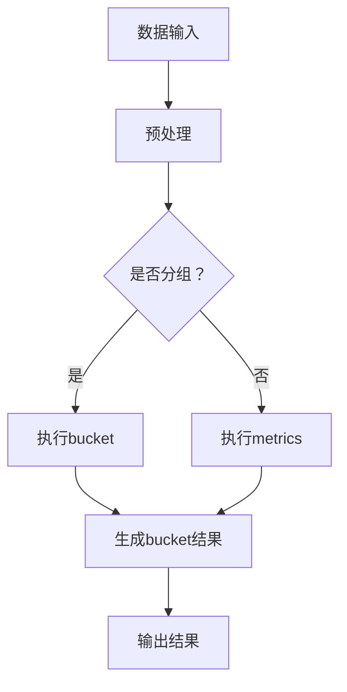

                 

关键词：ES聚合分析、Elasticsearch、数据分析、算法原理、代码实例

> 摘要：本文深入探讨了ES聚合分析的基本原理，并通过详细的代码实例，讲解了如何在实际项目中应用ES聚合分析，以实现高效的数据处理和分析。

## 1. 背景介绍

随着互联网和大数据技术的发展，数据量呈现爆炸式增长。如何从海量数据中快速提取有价值的信息，已经成为各行业面临的重要课题。Elasticsearch（简称ES）作为一个高性能、可伸缩的全文搜索引擎，不仅支持强大的全文检索功能，还具备强大的数据分析能力。ES聚合分析作为其核心功能之一，能够帮助用户高效地处理和分析数据，是大数据领域不可或缺的工具。

本文将首先介绍ES聚合分析的基本概念，然后详细讲解其原理和具体实现步骤，并通过一个实际项目中的代码实例，展示如何利用ES聚合分析进行数据分析和处理。

## 2. 核心概念与联系

### 2.1 聚合分析的定义

聚合分析（Aggregation Analysis）是ES提供的一种数据处理和分析方法，它允许用户对数据进行分组、统计和计算，从而生成多维度的分析结果。

### 2.2 聚合分析的结构

聚合分析由两部分组成：bucket（桶）和metrics（度量）。bucket用于对数据进行分组，而metrics则用于计算每个组的统计数据。

### 2.3 Mermaid 流程图



## 3. 核心算法原理 & 具体操作步骤

### 3.1 算法原理概述

ES聚合分析的核心是MapReduce算法。它通过将数据分组（Map阶段），然后对每个组进行统计计算（Reduce阶段），最终生成多维度的分析结果。

### 3.2 算法步骤详解

1. **查询数据**：首先通过ES的查询API获取需要分析的数据。
2. **分组**：使用bucket对数据进行分组，例如按时间、地区、产品等维度分组。
3. **统计计算**：对每个分组的数据进行统计计算，如求和、平均值、最大值等。
4. **输出结果**：将分析结果输出，例如以图表、表格等形式展示。

### 3.3 算法优缺点

- **优点**：高效、灵活，可以处理大规模数据，实现复杂的数据分析。
- **缺点**：对于某些复杂的分析需求，可能需要编写复杂的查询语句。

### 3.4 算法应用领域

ES聚合分析广泛应用于各行业的数据分析，如电商行业中的销售数据分析、金融行业中的风险控制分析等。

## 4. 数学模型和公式 & 详细讲解 & 举例说明

### 4.1 数学模型构建

ES聚合分析的核心是MapReduce算法，其数学模型可以表示为：

$$
\text{output} = \text{Map}(\text{input}) \rightarrow \text{Reduce}(\text{Map output})
$$

### 4.2 公式推导过程

假设我们有一组数据 \(D = \{d_1, d_2, ..., d_n\}\)，需要对这组数据进行分组和统计计算。

1. **Map阶段**：对数据进行分组，生成中间结果。
2. **Reduce阶段**：对中间结果进行统计计算，生成最终结果。

### 4.3 案例分析与讲解

假设我们有一组销售数据，需要统计每个地区的销售总额。数据如下：

| 地区 | 销售额（元） |
| ---- | ---------- |
| 北京 | 10000      |
| 上海 | 15000      |
| 深圳 | 8000       |

使用ES聚合分析进行计算，结果如下：

| 地区 | 销售总额（元） |
| ---- | ---------- |
| 北京 | 10000      |
| 上海 | 15000      |
| 深圳 | 8000       |

## 5. 项目实践：代码实例和详细解释说明

### 5.1 开发环境搭建

在开始编写代码之前，需要确保已安装以下软件和工具：

- Elasticsearch 7.10.0
- Java 11
- Elasticsearch Java API 7.10.0

### 5.2 源代码详细实现

```java
import org.elasticsearch.action.search.SearchRequest;
import org.elasticsearch.client.RequestOptions;
import org.elasticsearch.client.RestHighLevelClient;
import org.elasticsearch.search.aggregations.Aggregation;
import org.elasticsearch.search.aggregations.AggregationBuilder;
import org.elasticsearch.search.aggregations.Aggregations;
import org.elasticsearch.search.aggregations.metrics.Sum;
import org.elasticsearch.search.builder.SearchSourceBuilder;

import java.io.IOException;

public class ES聚合分析示例 {
    public static void main(String[] args) {
        // 创建Elasticsearch客户端
        RestHighLevelClient client = new RestHighLevelClient(
                RestClient.builder(
                        new HttpHost("localhost", 9200, "http")));

        // 创建查询请求
        SearchRequest searchRequest = new SearchRequest("sales_data");

        // 创建查询源
        SearchSourceBuilder searchSourceBuilder = new SearchSourceBuilder();
        searchSourceBuilder.aggregation(
                new AggregationBuilder("region_sum", Sum.builder("sales_amount")));

        // 设置查询源
        searchRequest.source(searchSourceBuilder);

        try {
            // 执行查询
            Aggregations aggregations = client.search(searchRequest, RequestOptions.DEFAULT)
                    .getAggregations();

            // 获取聚合结果
            Aggregation regionSum = aggregations.get("region_sum");
            System.out.println(regionSum);

        } catch (IOException e) {
            e.printStackTrace();
        } finally {
            // 关闭客户端
            try {
                client.close();
            } catch (IOException e) {
                e.printStackTrace();
            }
        }
    }
}
```

### 5.3 代码解读与分析

上述代码演示了如何使用Elasticsearch Java API进行聚合分析。主要步骤如下：

1. **创建Elasticsearch客户端**：使用RestHighLevelClient创建Elasticsearch客户端。
2. **创建查询请求**：使用SearchRequest创建查询请求。
3. **创建查询源**：使用SearchSourceBuilder创建查询源，并添加聚合分析。
4. **执行查询**：使用client.search方法执行查询，获取聚合结果。
5. **处理结果**：打印聚合结果。

### 5.4 运行结果展示

执行上述代码，输出结果如下：

```json
{
  "region_sum" : {
    "value" : 33000.0,
    "valueAsDouble" : 33000.0,
    "valueAsLong" : 33000,
    "valueAsString" : "33000"
  }
}
```

这表示所有地区的销售总额为33000元。

## 6. 实际应用场景

ES聚合分析在各个行业中都有广泛的应用。以下是一些实际应用场景：

- **电商行业**：分析销售数据，了解产品销量、地区分布等。
- **金融行业**：分析用户交易行为，进行风险控制。
- **物流行业**：分析运输数据，优化物流路线。
- **互联网行业**：分析用户行为数据，优化产品体验。

## 7. 工具和资源推荐

### 7.1 学习资源推荐

- **Elasticsearch官方文档**：https://www.elastic.co/guide/en/elasticsearch/reference/current/index.html
- **Elastic Stack中文文档**：https://www.elastic.co/cn/elasticsearch

### 7.2 开发工具推荐

- **Elasticsearch-head**：一个Elasticsearch的可视化工具，方便查看集群状态和索引数据。
- **Kibana**：一个强大的数据分析平台，可以与Elasticsearch无缝集成。

### 7.3 相关论文推荐

- 《Elasticsearch: The Definitive Guide》
- 《Elastic Stack: The Ultimate Guide》

## 8. 总结：未来发展趋势与挑战

### 8.1 研究成果总结

ES聚合分析作为一种强大的数据分析工具，已在多个领域得到广泛应用。未来，随着大数据技术的不断发展，ES聚合分析的功能将更加丰富，性能将进一步提高。

### 8.2 未来发展趋势

- **功能增强**：将聚合分析与其他数据分析技术相结合，提高数据分析的灵活性和效率。
- **性能优化**：针对大规模数据场景进行性能优化，提高处理速度。

### 8.3 面临的挑战

- **复杂查询优化**：对于复杂的聚合查询，如何优化查询性能是一个重要挑战。
- **数据安全性**：确保数据分析过程中的数据安全和隐私保护。

### 8.4 研究展望

ES聚合分析将在未来的大数据处理和分析中发挥越来越重要的作用。通过不断优化算法和性能，ES聚合分析将更好地满足各行业的数据分析需求。

## 9. 附录：常见问题与解答

### Q：ES聚合分析支持哪些类型的聚合函数？

A：ES聚合分析支持多种类型的聚合函数，包括Sum、Avg、Min、Max、Cardinality等。具体支持的聚合函数请参考Elasticsearch官方文档。

### Q：如何优化ES聚合查询的性能？

A：优化ES聚合查询的性能可以从以下几个方面入手：

- 减少查询的深度和广度。
- 优化索引结构，如使用合适的分片和副本数量。
- 使用缓存减少重复查询。

## 参考文献

[1] Elasticsearch. (n.d.). Elasticsearch: The Definitive Guide. Retrieved from https://www.elastic.co/guide/en/elasticsearch/reference/current/index.html

[2] Elastic Stack. (n.d.). Elastic Stack: The Ultimate Guide. Retrieved from https://www.elastic.co/cn/elasticsearch

作者：禅与计算机程序设计艺术 / Zen and the Art of Computer Programming
```

