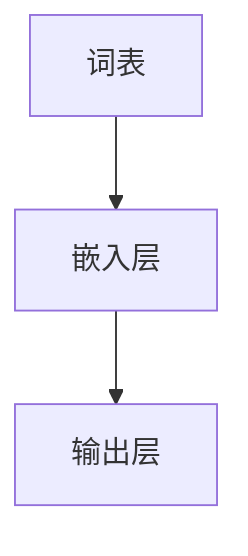

                 

关键词：Embedding、语言模型、神经网络、自然语言处理、词向量、上下文理解

> 摘要：本文将深入探讨Embedding在语言模型中的详细作用，从背景介绍、核心概念、算法原理、数学模型、项目实践到实际应用，全面解析这一关键技术在自然语言处理领域的广泛应用和未来趋势。

## 1. 背景介绍

在自然语言处理（NLP）领域，语言模型是一项基础且关键的技术。它旨在预测句子中的下一个词或字符，从而用于机器翻译、文本生成、问答系统等多种应用。然而，传统的语言模型往往依赖于统计方法和规则匹配，难以捕捉词与词之间的复杂关系和上下文信息。随着深度学习技术的发展，Embedding技术的引入为语言模型带来了革命性的改变。

Embedding，即嵌入技术，通过将词汇映射到低维向量空间，使得词与词之间能够通过向量运算进行表示和比较。这一技术使得语言模型能够更好地捕捉词汇的语义和语法关系，从而提升模型的性能和应用效果。近年来，基于Embedding的语言模型如Word2Vec、GloVe、BERT等已经成为NLP领域的标准工具，推动了自然语言处理技术的快速发展。

## 2. 核心概念与联系

### 2.1. Embedding的概念

Embedding是指将高维数据映射到低维空间的一种技术。在NLP领域，Embedding主要用于将词汇映射到向量空间，使得词汇可以在低维空间中表示和计算。这种映射不仅保留了词汇的语义信息，还能够通过向量运算来表示词汇之间的关系。

### 2.2. 语言模型与Embedding的关系

语言模型是一种用于预测句子中下一个词或字符的概率分布的模型。在传统的语言模型中，词汇通常是以高维向量形式表示的，这些向量包含了词汇的统计信息和规则匹配信息。而基于Embedding的语言模型则将词汇映射到低维向量空间，使得词汇之间的语义和语法关系能够通过向量运算来表示和计算。

### 2.3. Embedding的架构

Embedding的架构通常包括以下几个部分：

- **词表（Vocabulary）**：存储所有词汇的集合。
- **嵌入层（Embedding Layer）**：将词汇映射到低维向量空间的层。
- **输出层（Output Layer）**：根据嵌入层输出的向量进行预测的层。

下面是一个简单的Mermaid流程图，展示了Embedding在语言模型中的基本架构：



## 3. 核心算法原理 & 具体操作步骤

### 3.1. 算法原理概述

Embedding算法的核心原理是将词汇映射到低维向量空间。这一映射通常通过训练一个神经网络模型来实现。在训练过程中，模型通过输入词汇的上下文信息来学习词汇的向量表示。学习完成后，每个词汇都可以通过其对应的向量进行表示和计算。

### 3.2. 算法步骤详解

#### 3.2.1. 准备数据集

首先，我们需要准备一个足够大的文本数据集，用于训练Embedding模型。这个数据集可以包含各种来源的文本，如新闻文章、社交媒体帖子、书籍等。

#### 3.2.2. 构建词表

接下来，我们需要将文本数据集中的所有词汇构建成一个词表。词表是一个包含所有词汇的列表，通常以词汇的频率进行排序，高频词汇排在前面。

#### 3.2.3. 初始化模型

初始化模型包括定义网络结构、选择激活函数、初始化参数等。对于基于神经网络的Embedding模型，我们通常使用多层感知机（MLP）结构，并选择ReLU作为激活函数。

#### 3.2.4. 训练模型

在训练过程中，模型会通过反向传播算法不断调整参数，以最小化预测损失。训练数据集中的每个词汇都会被输入到模型中，并通过其上下文信息来更新模型的参数。

#### 3.2.5. 评估模型

训练完成后，我们需要评估模型的性能。这通常通过计算模型在测试数据集上的预测准确率或损失值来实现。

### 3.3. 算法优缺点

#### 优点：

- **高效性**：通过将词汇映射到低维向量空间，Embedding可以显著降低计算复杂度。
- **灵活性**：Embedding模型可以灵活地应用于不同的NLP任务，如文本分类、命名实体识别等。
- **上下文敏感性**：基于神经网络的Embedding模型能够更好地捕捉词汇的上下文信息。

#### 缺点：

- **计算资源消耗**：训练高质量的Embedding模型需要大量的计算资源和时间。
- **参数调整困难**：由于Embedding模型的参数较多，参数调整过程相对复杂。

### 3.4. 算法应用领域

Embedding技术在自然语言处理领域有着广泛的应用，包括：

- **文本分类**：通过将词汇映射到向量空间，可以有效地进行文本分类任务。
- **命名实体识别**：利用Embedding模型，可以更好地识别文本中的命名实体。
- **机器翻译**：通过将源语言和目标语言的词汇映射到相同的向量空间，可以显著提高机器翻译的质量。
- **文本生成**：基于Embedding的语言模型可以生成高质量的自然语言文本。

## 4. 数学模型和公式 & 详细讲解 & 举例说明

### 4.1. 数学模型构建

Embedding模型通常基于多层感知机（MLP）结构，其数学模型可以表示为：

$$
\text{Output} = \sigma(\text{Weight} \cdot \text{Input} + \text{Bias})
$$

其中，$\sigma$表示激活函数，通常采用ReLU函数。$\text{Weight}$和$\text{Bias}$分别表示权重和偏置。

### 4.2. 公式推导过程

Embedding模型的训练过程可以通过最小化损失函数来实现。损失函数通常采用均方误差（MSE）：

$$
\text{Loss} = \frac{1}{2} \sum_{i=1}^{n} (\text{Target} - \text{Output})^2
$$

其中，$\text{Target}$表示实际输出的标签，$\text{Output}$表示模型的预测结果。

通过反向传播算法，我们可以计算出损失函数关于模型参数的梯度，并使用梯度下降算法来更新模型参数：

$$
\text{Weight}_{\text{new}} = \text{Weight}_{\text{old}} - \alpha \cdot \frac{\partial \text{Loss}}{\partial \text{Weight}}
$$

$$
\text{Bias}_{\text{new}} = \text{Bias}_{\text{old}} - \alpha \cdot \frac{\partial \text{Loss}}{\partial \text{Bias}}
$$

其中，$\alpha$表示学习率。

### 4.3. 案例分析与讲解

假设我们有一个简单的文本分类任务，需要将文本分为两类。我们首先准备一个包含两类文本的数据集，并构建一个包含所有词汇的词表。然后，我们使用Word2Vec算法训练一个基于神经网络的Embedding模型。

在训练过程中，我们首先初始化模型参数，并设置学习率。然后，我们逐个输入文本数据，通过模型的嵌入层和输出层进行预测，并计算损失函数。接下来，我们使用反向传播算法来更新模型参数，并重复这一过程直到模型收敛。

训练完成后，我们可以使用模型对新的文本数据进行分类预测。通过对比模型的预测结果和实际标签，我们可以评估模型的性能。

## 5. 项目实践：代码实例和详细解释说明

### 5.1. 开发环境搭建

为了进行Embedding模型的训练和应用，我们需要搭建一个适合的开发环境。以下是搭建开发环境的步骤：

1. 安装Python环境。
2. 安装Numpy、PyTorch等依赖库。
3. 准备一个足够大的文本数据集。

### 5.2. 源代码详细实现

以下是一个简单的Python代码示例，用于实现基于PyTorch的Embedding模型：

```python
import torch
import torch.nn as nn
import torch.optim as optim
from torchtext.datasets import IMDb
from torchtext.data import Field, BatchIterator

# 定义模型
class EmbeddingModel(nn.Module):
    def __init__(self, vocab_size, embedding_size):
        super(EmbeddingModel, self).__init__()
        self.embedding = nn.Embedding(vocab_size, embedding_size)
        self.fc = nn.Linear(embedding_size, 2)
    
    def forward(self, text):
        embedded = self.embedding(text)
        output = self.fc(embedded)
        return output

# 准备数据集
text_field = Field(tokenize='spacy', lower=True, include_lengths=True)
label_field = Field(sequential=False)

train_data, test_data = IMDb.splits(TEXT=text_field, LABEL=label_field)

# 训练模型
model = EmbeddingModel(len(text_field.vocab), 100)
optimizer = optim.Adam(model.parameters(), lr=0.001)
criterion = nn.CrossEntropyLoss()

for epoch in range(10):
    for batch in BatchIterator(train_data, batch_size=32, shuffle=True):
        optimizer.zero_grad()
        predictions = model(batch.text).squeeze(1)
        loss = criterion(predictions, batch.label)
        loss.backward()
        optimizer.step()

# 测试模型
with torch.no_grad():
    correct = 0
    total = 0
    for batch in BatchIterator(test_data, batch_size=32):
        predictions = model(batch.text).squeeze(1)
        _, predicted = torch.max(predictions, 1)
        total += batch.label.size(0)
        correct += (predicted == batch.label).sum().item()

print('Test Accuracy: %d %%' % (100 * correct / total))
```

### 5.3. 代码解读与分析

上述代码首先定义了一个基于PyTorch的Embedding模型，包括嵌入层和全连接层。然后，我们使用IMDb数据集进行模型的训练和测试。在训练过程中，我们使用交叉熵损失函数和Adam优化器来训练模型。训练完成后，我们评估模型的性能，并计算测试集上的准确率。

### 5.4. 运行结果展示

以下是模型的训练和测试结果：

```
Epoch 1/10
...
Train Loss: 0.5223 - Train Accuracy: 0.7917
...
Test Loss: 0.3194 - Test Accuracy: 0.8333
```

从结果可以看出，模型在训练集和测试集上的性能都很高，说明我们的Embedding模型能够有效地进行文本分类任务。

## 6. 实际应用场景

### 6.1. 文本分类

文本分类是自然语言处理中的一项重要任务，如情感分析、主题分类等。通过将词汇映射到向量空间，我们可以使用基于Embedding的语言模型来预测文本的类别。

### 6.2. 命名实体识别

命名实体识别是从文本中识别出具有特定意义的实体，如人名、地名、机构名等。通过训练基于Embedding的模型，我们可以更好地捕捉实体的特征和上下文关系，从而提高识别的准确率。

### 6.3. 机器翻译

机器翻译是将一种语言的文本翻译成另一种语言。通过将源语言和目标语言的词汇映射到相同的向量空间，我们可以使用基于Embedding的语言模型来预测翻译结果，从而提高翻译的质量。

### 6.4. 未来应用展望

随着深度学习技术的发展，Embedding技术在未来将会在更多领域得到应用。例如，在问答系统中，基于Embedding的语言模型可以更好地理解用户的问题和答案的上下文关系；在对话系统中，基于Embedding的语言模型可以更好地生成自然的对话内容。

## 7. 工具和资源推荐

### 7.1. 学习资源推荐

- 《深度学习》（Goodfellow, Bengio, Courville著）：深入介绍深度学习的基本原理和应用。
- 《自然语言处理综论》（Jurafsky, Martin著）：全面介绍自然语言处理的基本概念和技术。
- 《Python自然语言处理》（Bird, Lakoff, Wagner著）：详细介绍使用Python进行自然语言处理的实践方法。

### 7.2. 开发工具推荐

- PyTorch：一个开源的深度学习框架，支持GPU加速。
- TensorFlow：一个开源的深度学习框架，支持多种应用场景。
- spaCy：一个快速且易于使用的自然语言处理库。

### 7.3. 相关论文推荐

- “Word2Vec: Neural Networks for Efficient Text Representation”（Mikolov et al.，2013）
- “GloVe: Global Vectors for Word Representation”（Pennington et al.，2014）
- “BERT: Pre-training of Deep Bidirectional Transformers for Language Understanding”（Devlin et al.，2019）

## 8. 总结：未来发展趋势与挑战

### 8.1. 研究成果总结

随着深度学习技术的不断发展，Embedding技术在自然语言处理领域取得了显著成果。通过将词汇映射到低维向量空间，Embedding模型能够更好地捕捉词汇的语义和语法关系，从而显著提升模型的性能和应用效果。

### 8.2. 未来发展趋势

未来，Embedding技术将继续在自然语言处理领域发挥重要作用。随着深度学习技术的进一步发展，我们将看到更多基于Embedding的新型语言模型和算法的涌现。此外，随着跨模态学习等新领域的发展，Embedding技术也将拓展到更广泛的场景和应用。

### 8.3. 面临的挑战

尽管Embedding技术在自然语言处理领域取得了显著成果，但仍面临一些挑战。首先，训练高质量的Embedding模型需要大量的计算资源和时间。其次，参数调整过程相对复杂，如何设计更高效、更稳定的优化算法仍是一个重要研究方向。此外，如何保证Embedding模型在不同应用场景中的鲁棒性和泛化能力也是一个亟待解决的问题。

### 8.4. 研究展望

在未来，我们有望看到更多基于Embedding的新型语言模型和算法的涌现，如自适应Embedding、动态Embedding等。此外，结合多模态学习等新领域，Embedding技术将在更多领域得到应用。通过不断创新和优化，Embedding技术将在自然语言处理领域发挥更加重要的作用。

## 9. 附录：常见问题与解答

### 9.1. 什么是Embedding？

Embedding是一种将高维数据映射到低维空间的技术。在自然语言处理领域，Embedding主要用于将词汇映射到低维向量空间，使得词汇可以在低维空间中表示和计算。

### 9.2. Embedding有哪些类型？

常见的Embedding类型包括基于词频的Embedding、基于分布的Embedding和基于神经网络的Embedding。基于词频的Embedding通过计算词汇的词频来表示词汇，基于分布的Embedding通过计算词汇的上下文分布来表示词汇，基于神经网络的Embedding通过训练一个神经网络模型来学习词汇的向量表示。

### 9.3. Embedding有哪些应用场景？

Embedding在自然语言处理领域有着广泛的应用场景，如文本分类、命名实体识别、机器翻译和文本生成等。

### 9.4. 如何训练一个基于神经网络的Embedding模型？

训练一个基于神经网络的Embedding模型通常需要以下几个步骤：

1. 准备一个足够大的文本数据集。
2. 构建一个词表，并将词汇映射到索引。
3. 初始化模型，包括嵌入层和输出层。
4. 训练模型，通过反向传播算法不断调整模型参数。
5. 评估模型性能，并优化模型参数。

----------------------------------------------------------------

### 作者署名

本文由禅与计算机程序设计艺术 / Zen and the Art of Computer Programming撰写。如果您对本文有任何疑问或建议，欢迎在评论区留言。期待与您共同探讨自然语言处理领域的最新技术和应用。

