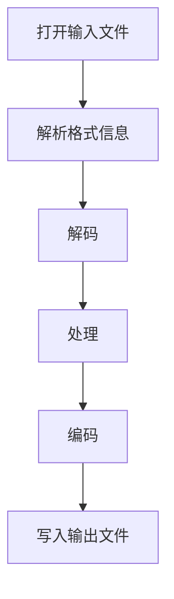

                 

## 1. 背景介绍

随着数字媒体技术的飞速发展，音视频处理技术在多媒体应用中扮演着越来越重要的角色。从简单的视频播放到复杂的视频编辑、流媒体传输，音视频处理技术已经深入到我们日常生活的各个方面。FFmpeg，作为一款开源、跨平台的音视频处理工具，因其强大的功能和灵活性，成为了音视频处理领域的首选工具。

FFmpeg最初由Fabrice Bellard在2000年创建，后来由一个志愿者团队进行维护和开发。它支持几乎所有的音视频格式，包括常见的MP3、MP4、AVI、MOV等，还支持多种视频编码和音频编码，如H.264、H.265、AAC等。FFmpeg不仅能够完成基本的音视频播放和转换任务，还支持复杂的音视频编辑、流媒体传输、视频滤镜应用等功能。

在多媒体应用开发中，FFmpeg的应用场景非常广泛。例如，在流媒体传输领域，FFmpeg可以用于视频直播、点播等应用，实现音视频流的实时传输和播放；在视频编辑领域，FFmpeg可以用于视频剪辑、特效添加、音频处理等，实现专业的视频编辑功能；在多媒体教学、在线教育等领域，FFmpeg可以帮助开发者轻松实现音视频内容的播放和控制。

总之，FFmpeg作为一款功能强大、灵活易用的音视频处理工具，已经成为多媒体应用开发中不可或缺的一部分。本文将详细介绍FFmpeg的基本概念、核心算法、数学模型、项目实践以及实际应用场景，帮助读者深入了解并掌握FFmpeg的使用方法。

## 2. 核心概念与联系

### 2.1 FFmpeg的基本概念

FFmpeg是一款开源、跨平台的音视频处理工具，它由多个组件组成，包括`libavcodec`、`libavformat`、`libavutil`、`libswscale`、`libavfilter`等。每个组件都有其特定的功能：

- `libavcodec`：提供了多种视频和音频编码解码器。
- `libavformat`：提供了多种视频和音频文件格式的读取和写入支持。
- `libavutil`：提供了通用的工具函数，如内存管理、时间处理等。
- `libswscale`：提供了视频缩放、色彩空间转换等功能。
- `libavfilter`：提供了视频滤镜处理功能，如图像效果、色彩调整等。

### 2.2 FFmpeg的工作流程

FFmpeg的工作流程主要包括以下几个步骤：

1. **打开输入文件**：通过`libavformat`组件读取输入文件，并解析其格式信息。
2. **解码**：使用`libavcodec`组件对音视频数据进行解码，将其转换为原始数据。
3. **处理**：根据需求对音视频数据进行处理，如缩放、滤镜应用等，使用`libswscale`和`libavfilter`组件。
4. **编码**：使用`libavcodec`组件对处理后的音视频数据进行编码，生成输出文件。
5. **写入输出文件**：通过`libavformat`组件将编码后的音视频数据写入输出文件。

### 2.3 FFmpeg与其他音视频处理工具的比较

与其它音视频处理工具相比，FFmpeg具有以下优势：

- **开源、免费**：FFmpeg是开源软件，用户可以免费使用。
- **跨平台**：FFmpeg支持Windows、Linux、macOS等多个平台。
- **强大的功能**：FFmpeg支持多种音视频格式、编码和解码器，能够处理复杂的音视频处理任务。
- **灵活性强**：FFmpeg提供了丰富的命令行选项和API接口，用户可以根据需求进行自定义开发。

### 2.4 FFmpeg的核心概念原理和架构的 Mermaid 流程图

下面是FFmpeg的工作流程的Mermaid流程图：



## 3. 核心算法原理 & 具体操作步骤

### 3.1 算法原理概述

FFmpeg的核心算法主要涉及音视频编码和解码。音视频编码是将原始音视频数据转换为压缩数据的过程，目的是减少数据量，提高传输和存储效率。常见的视频编码标准有H.264、H.265、HEVC等；音频编码标准有MP3、AAC等。

音视频解码则是将压缩数据还原为原始数据的过程。FFmpeg支持多种编码解码器，通过选择合适的编码解码器，可以实现高质量、高效率的音视频处理。

### 3.2 算法步骤详解

1. **打开输入文件**：使用`avformat_open_input`函数打开输入文件，获取输入流的元数据。

2. **读取输入流**：使用`avformat_find_stream_info`函数读取输入流的元数据，如视频分辨率、帧率、音频采样率等。

3. **找到视频和音频流**：遍历输入流，找到视频和音频流，并初始化相应的解码器。

4. **解码**：使用`avcodec_decode_video2`和`avcodec_decode_audio4`函数对视频和音频数据进行解码，将其转换为原始数据。

5. **处理**：根据需求对音视频数据进行处理，如缩放、滤镜应用等。

6. **编码**：使用`avcodec_encode_video2`和`avcodec_encode_audio4`函数对处理后的音视频数据进行编码，生成压缩数据。

7. **写入输出文件**：使用`avformat_write_header`、`avformat_write_packet`和`avformat_write_trailer`函数将编码后的音视频数据写入输出文件。

### 3.3 算法优缺点

**优点**：

- 支持多种音视频格式和编码解码器，灵活性强。
- 开源免费，可进行自定义开发。
- 社区活跃，文档和教程丰富。

**缺点**：

- 命令行使用较为复杂，对于初学者有一定的学习成本。
- 编程接口较为底层，对于不熟悉音视频处理的人来说可能不太友好。

### 3.4 算法应用领域

FFmpeg在以下领域有广泛应用：

- **视频编辑**：实现视频剪辑、特效添加等功能。
- **流媒体传输**：实现视频直播、点播等应用。
- **多媒体教学**：实现音视频内容的播放和控制。
- **视频监控**：实现视频数据的实时处理和存储。

## 4. 数学模型和公式 & 详细讲解 & 举例说明

### 4.1 数学模型构建

在音视频处理中，常用的数学模型包括图像处理模型和音频处理模型。

**图像处理模型**：

- **图像采样**：图像采样是指将连续的图像信号转换为离散的像素点。常用的采样标准有YUV 4:2:0、YUV 4:2:2等。
- **图像压缩**：图像压缩是指通过编码算法将图像数据压缩成更小的数据量。常用的图像压缩算法有JPEG、H.264等。

**音频处理模型**：

- **音频采样**：音频采样是指将连续的音频信号转换为离散的样本点。常用的音频采样标准有CD品质（44.1kHz）、Hi-Res音频（96kHz、192kHz等）。
- **音频压缩**：音频压缩是指通过编码算法将音频数据压缩成更小的数据量。常用的音频压缩算法有MP3、AAC等。

### 4.2 公式推导过程

**图像采样公式**：

- **采样频率**：采样频率（fs）是指每秒采样的次数，通常以kHz为单位。公式为：

  $$ fs = \frac{1}{\Delta t} $$

  其中，$\Delta t$ 是采样周期。

- **采样点数**：采样点数（N）是指整个信号周期内采样的点数。公式为：

  $$ N = \frac{f_s \cdot T}{2} $$

  其中，$T$ 是信号周期。

**图像压缩公式**：

- **压缩比**：压缩比（C）是指原始图像数据大小与压缩后图像数据大小的比值。公式为：

  $$ C = \frac{原始图像数据大小}{压缩后图像数据大小} $$

- **压缩率**：压缩率（R）是指压缩后的图像数据大小与原始图像数据大小的比值。公式为：

  $$ R = \frac{压缩后图像数据大小}{原始图像数据大小} $$

**音频采样公式**：

- **采样频率**：与图像采样公式相同。
- **采样点数**：与图像采样公式相同。

**音频压缩公式**：

- **压缩比**：与图像压缩公式相同。
- **压缩率**：与图像压缩公式相同。

### 4.3 案例分析与讲解

**案例一：图像采样**

假设一个视频信号，采样频率为30kHz，信号周期为0.033秒，求采样点数。

根据采样点数公式：

$$ N = \frac{f_s \cdot T}{2} $$

代入数值：

$$ N = \frac{30kHz \cdot 0.033s}{2} = 4950 $$

所以，该视频信号的采样点数为4950。

**案例二：图像压缩**

假设一个图像数据大小为10MB，压缩后数据大小为1MB，求压缩比和压缩率。

根据压缩比公式：

$$ C = \frac{原始图像数据大小}{压缩后图像数据大小} $$

代入数值：

$$ C = \frac{10MB}{1MB} = 10 $$

所以，压缩比为10。

根据压缩率公式：

$$ R = \frac{压缩后图像数据大小}{原始图像数据大小} $$

代入数值：

$$ R = \frac{1MB}{10MB} = 0.1 $$

所以，压缩率为0.1。

## 5. 项目实践：代码实例和详细解释说明

### 5.1 开发环境搭建

要在Windows或Linux系统上使用FFmpeg，首先需要安装FFmpeg。以下是安装步骤：

**Windows系统**：

1. 访问FFmpeg的官方网站：[FFmpeg官网](https://www.ffmpeg.org/)。
2. 下载适用于Windows的FFmpeg安装程序。
3. 运行安装程序，按照提示完成安装。

**Linux系统**：

1. 使用以下命令安装FFmpeg：

   ```bash
   sudo apt-get install ffmpeg
   ```

   或者

   ```bash
   sudo yum install ffmpeg
   ```

2. 安装完成后，可以使用以下命令检查FFmpeg的版本：

   ```bash
   ffmpeg -version
   ```

### 5.2 源代码详细实现

以下是一个简单的FFmpeg命令行脚本，用于将一个MP4视频文件转换为AVI格式。

```bash
ffmpeg -i input.mp4 -c:v mpeg4 -qscale 2 output.avi
```

该脚本的具体参数解释如下：

- `-i input.mp4`：指定输入文件为MP4格式。
- `-c:v mpeg4`：指定视频编码格式为mpeg4。
- `-qscale 2`：指定视频质量为2（值越小，质量越高）。
- `output.avi`：指定输出文件为AVI格式。

### 5.3 代码解读与分析

这个简单的FFmpeg命令行脚本实现了将MP4视频转换为AVI格式的功能。通过指定输入文件和输出文件，以及视频编码格式和质量，可以实现对音视频数据的处理。

在实际应用中，可以根据需求自定义命令行参数，实现更复杂的音视频处理任务。例如，可以添加音频解码器、视频滤镜等，以实现视频剪辑、特效添加等功能。

### 5.4 运行结果展示

运行上述脚本后，输入文件`input.mp4`将转换为输出文件`output.avi`。在Windows系统上，可以使用暴风影音等媒体播放器打开输出文件进行播放；在Linux系统上，可以使用`mpv`等媒体播放器进行播放。

## 6. 实际应用场景

### 6.1 流媒体传输

流媒体传输是指通过网络将音视频内容实时传输到用户端，用户可以在播放过程中实时观看，而无需等待整个文件下载完成。FFmpeg在流媒体传输中具有重要作用，可以用于实现视频直播、点播等功能。

**案例一：视频直播**

视频直播是一种实时传输视频内容的方式，用户可以实时观看主播的表演或讲解。使用FFmpeg可以实现视频直播的功能。以下是一个简单的直播流传输命令：

```bash
ffmpeg -f video4linux2 -i /dev/video0 -f flv rtmp://live airing
```

该脚本的具体参数解释如下：

- `-f video4linux2`：指定输入设备为视频摄像头。
- `-i /dev/video0`：指定视频输入设备为/dev/video0。
- `-f flv`：指定输出格式为flv。
- `rtmp://live airing`：指定输出流地址为rtmp协议的直播流地址。

**案例二：视频点播**

视频点播是一种用户可以按需观看音视频内容的方式。使用FFmpeg可以实现视频点播的功能。以下是一个简单的点播流传输命令：

```bash
ffmpeg -i input.mp4 -f flv rtmp://live video
```

该脚本的具体参数解释如下：

- `-i input.mp4`：指定输入文件为MP4格式。
- `-f flv`：指定输出格式为flv。
- `rtmp://live video`：指定输出流地址为rtmp协议的视频点播流地址。

### 6.2 视频编辑

视频编辑是对音视频内容进行剪辑、特效添加、音频处理等操作，以实现特定的视觉效果。FFmpeg提供了丰富的视频编辑功能，可以用于实现视频剪辑、特效添加等功能。

**案例一：视频剪辑**

视频剪辑是指对视频内容进行裁剪、拼接等操作。使用FFmpeg可以实现视频剪辑的功能。以下是一个简单的视频剪辑命令：

```bash
ffmpeg -i input.mp4 -ss 00:00:10 -to 00:00:30 -c copy output.mp4
```

该脚本的具体参数解释如下：

- `-i input.mp4`：指定输入文件为MP4格式。
- `-ss 00:00:10`：指定开始时间为00:00:10。
- `-to 00:00:30`：指定结束时间为00:00:30。
- `-c copy`：指定使用原编码，不进行重新编码。

**案例二：视频特效添加**

视频特效添加是指对视频内容添加各种特效，如模糊、锐化、色彩调整等。使用FFmpeg可以实现视频特效添加的功能。以下是一个简单的视频特效添加命令：

```bash
ffmpeg -i input.mp4 -filter_complex "colorize" output.mp4
```

该脚本的具体参数解释如下：

- `-i input.mp4`：指定输入文件为MP4格式。
- `-filter_complex "colorize"`：指定添加颜色特效。

### 6.3 多媒体教学

多媒体教学是指利用计算机技术和网络技术，实现音视频内容的播放、控制、互动等功能。FFmpeg在多媒体教学中具有重要作用，可以用于实现音视频内容的播放、控制等。

**案例一：音视频播放**

使用FFmpeg可以实现对音视频内容的播放。以下是一个简单的音视频播放命令：

```bash
ffmpeg -i input.mp4 -c:v libx264 -c:a aac output.mp4
```

该脚本的具体参数解释如下：

- `-i input.mp4`：指定输入文件为MP4格式。
- `-c:v libx264`：指定视频编码为H.264。
- `-c:a aac`：指定音频编码为AAC。

**案例二：音视频控制**

使用FFmpeg可以实现对音视频内容的控制，如播放、暂停、停止等。以下是一个简单的音视频控制命令：

```bash
ffmpeg -i input.mp4 -c:v libx264 -c:a aac -ss 00:00:10 -to 00:00:30 output.mp4
```

该脚本的具体参数解释如下：

- `-i input.mp4`：指定输入文件为MP4格式。
- `-c:v libx264`：指定视频编码为H.264。
- `-c:a aac`：指定音频编码为AAC。
- `-ss 00:00:10`：指定开始时间为00:00:10。
- `-to 00:00:30`：指定结束时间为00:00:30。

### 6.4 未来应用展望

随着数字媒体技术的不断发展，FFmpeg的应用前景非常广阔。未来，FFmpeg将在以下几个方面发挥重要作用：

- **人工智能与大数据**：FFmpeg可以与人工智能技术相结合，实现音视频内容的智能识别、分类、推荐等功能，助力大数据处理。
- **虚拟现实与增强现实**：FFmpeg可以与虚拟现实（VR）和增强现实（AR）技术相结合，实现高质量的音视频内容呈现，提升用户体验。
- **智能家居与物联网**：FFmpeg可以与智能家居和物联网（IoT）技术相结合，实现音视频内容的远程监控、控制等功能，提升生活品质。

总之，FFmpeg作为一款功能强大、灵活易用的音视频处理工具，将在未来继续发挥重要作用，为多媒体应用开发带来更多可能性。

## 7. 工具和资源推荐

### 7.1 学习资源推荐

为了更好地学习FFmpeg，以下是一些推荐的资源：

- **官方文档**：FFmpeg的[官方文档](https://ffmpeg.org/ffmpeg.html)包含了详细的API和命令行选项，是学习FFmpeg的基础。
- **在线教程**：[FFmpeg教程](https://www.ffmpeg.org/trac/ffmpeg/wiki)提供了丰富的使用教程和示例代码，适合初学者和进阶者。
- **书籍**：《FFmpeg从入门到精通》和《FFmpeg音视频处理实战》是两本非常好的入门书籍，适合有一定编程基础的朋友阅读。

### 7.2 开发工具推荐

- **Visual Studio Code**：一款功能强大的代码编辑器，支持FFmpeg的语法高亮和插件，适合进行FFmpeg开发。
- **Sublime Text**：一款轻量级的代码编辑器，支持多种编程语言，也适合进行FFmpeg开发。

### 7.3 相关论文推荐

- **"FFmpeg: A Complete, Cross-Platform Solution for Audio and Video Processing"**：这是一篇关于FFmpeg全面介绍的论文，详细介绍了FFmpeg的架构、功能和应用。
- **"Optimization of FFmpeg for ARM Platform"**：这篇论文探讨了如何在ARM平台上优化FFmpeg，提高其性能。

## 8. 总结：未来发展趋势与挑战

### 8.1 研究成果总结

自FFmpeg问世以来，其在多媒体应用领域的地位逐渐巩固，成为音视频处理的事实标准。FFmpeg不仅在开源社区中获得了广泛的应用，还在许多商业项目中发挥了关键作用。FFmpeg的不断发展，也带动了整个音视频处理技术的发展，为多媒体应用的创新提供了强有力的支持。

### 8.2 未来发展趋势

随着数字媒体技术的不断进步，FFmpeg在未来有望在以下领域取得更大的发展：

- **人工智能与大数据**：FFmpeg可以与人工智能技术相结合，实现音视频内容的智能识别、分类、推荐等功能，为大数据处理提供支持。
- **虚拟现实与增强现实**：FFmpeg可以与VR和AR技术相结合，实现高质量的音视频内容呈现，提升用户体验。
- **流媒体传输**：随着5G网络的普及，FFmpeg在流媒体传输领域将发挥更大的作用，实现更加高效、稳定的音视频传输。

### 8.3 面临的挑战

尽管FFmpeg在多媒体应用中具有广泛的应用前景，但同时也面临着一些挑战：

- **性能优化**：随着音视频处理需求的不断提高，如何优化FFmpeg的性能，提高处理速度和效率，是一个重要的课题。
- **跨平台兼容性**：FFmpeg需要在不同操作系统和硬件平台上保持兼容性，这对开发团队来说是一个巨大的挑战。
- **社区维护**：FFmpeg的社区维护是一个长期的任务，如何保持社区的活跃度，吸引更多的开发者参与，也是一个需要关注的问题。

### 8.4 研究展望

未来，FFmpeg有望在以下方面取得突破：

- **高性能计算**：通过引入新的算法和优化技术，提高FFmpeg的处理速度和效率。
- **智能处理**：结合人工智能技术，实现音视频内容的智能处理，提升用户体验。
- **多样化应用**：拓展FFmpeg的应用领域，如物联网、虚拟现实、增强现实等，实现更广泛的应用。

总之，FFmpeg作为一款功能强大、灵活易用的音视频处理工具，在未来将继续发挥重要作用，为多媒体应用开发提供强有力的支持。

## 9. 附录：常见问题与解答

### 问题1：如何安装FFmpeg？

**解答**：在Windows系统上，可以访问FFmpeg的官方网站下载安装程序进行安装。在Linux系统上，可以使用包管理器进行安装，例如在Ubuntu系统上，可以使用以下命令：

```bash
sudo apt-get install ffmpeg
```

### 问题2：如何将MP4视频转换为AVI格式？

**解答**：可以使用以下FFmpeg命令将MP4视频转换为AVI格式：

```bash
ffmpeg -i input.mp4 -c:v mpeg4 -qscale 2 output.avi
```

其中，`input.mp4`是输入文件，`output.avi`是输出文件。

### 问题3：如何实现视频直播？

**解答**：可以使用以下FFmpeg命令实现视频直播：

```bash
ffmpeg -f video4linux2 -i /dev/video0 -f flv rtmp://live airing
```

其中，`/dev/video0`是视频输入设备，`rtmp://live airing`是直播流地址。

### 问题4：如何实现视频剪辑？

**解答**：可以使用以下FFmpeg命令实现视频剪辑：

```bash
ffmpeg -i input.mp4 -ss 00:00:10 -to 00:00:30 -c copy output.mp4
```

其中，`input.mp4`是输入文件，`output.mp4`是输出文件，`-ss`和`-to`指定剪辑的时间范围。

### 问题5：如何添加视频特效？

**解答**：可以使用以下FFmpeg命令添加视频特效：

```bash
ffmpeg -i input.mp4 -filter_complex "colorize" output.mp4
```

其中，`input.mp4`是输入文件，`output.mp4`是输出文件，`colorize`是添加的颜色特效。

## 作者署名

作者：禅与计算机程序设计艺术 / Zen and the Art of Computer Programming

