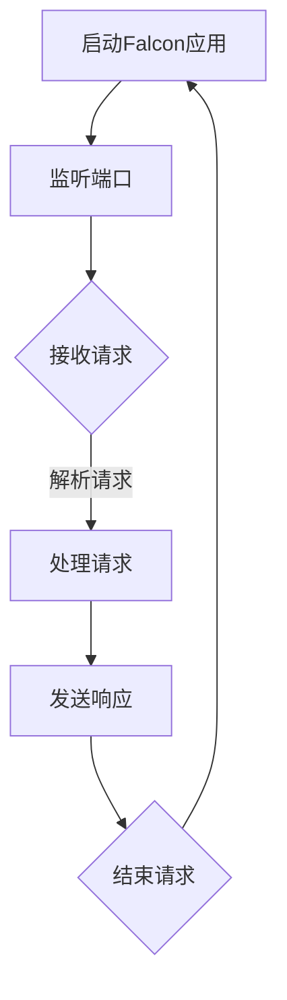

                 

关键词：Falcon、网络编程、高性能框架、Python、异步、协程、事件驱动

## 摘要

Falcon是一个基于Python的高性能网络应用框架，旨在提供简单、强大且易于扩展的网络编程模型。本文将深入探讨Falcon的工作原理、核心概念以及如何使用它进行网络编程。通过代码实例，我们将展示如何利用Falcon构建高性能的网络应用。

## 1. 背景介绍

在网络应用开发中，性能和可扩展性是至关重要的因素。传统的同步阻塞式编程模型往往难以应对高并发请求，导致性能瓶颈。为了解决这个问题，异步和非阻塞编程模型逐渐成为主流。Falcon正是基于这样的需求而诞生的。

Falcon由阿里巴巴开源，它采用了异步和非阻塞的编程模型，使得网络应用能够更好地处理大量并发请求。Falcon的设计理念是简单、易用且高性能，它允许开发者用Python编写出与C++或Java相媲美的网络应用程序。

## 2. 核心概念与联系

### 2.1. 异步与非阻塞

异步编程允许任务在等待其他操作完成时继续执行，而非阻塞编程则是确保代码不会因为等待某个操作而阻塞。这两个概念是Falcon的核心，使得Falcon能够高效地处理并发请求。

### 2.2. 协程

协程是Falcon实现异步编程的关键技术。协程是一种轻量级的线程，允许代码以非阻塞方式执行，同时避免了多线程带来的复杂性和开销。

### 2.3. 事件驱动

事件驱动模型是Falcon网络应用架构的基础。在事件驱动模型中，程序的状态由事件驱动，而不是由程序逻辑控制。这种模型使得Falcon能够高效地处理大量并发事件。

### 2.4. Mermaid流程图

下面是一个Mermaid流程图，展示了Falcon的工作流程：



## 3. 核心算法原理 & 具体操作步骤

### 3.1 算法原理概述

Falcon使用了一种基于协程和事件循环的异步编程模型。在Falcon中，每个请求都会分配一个协程，协程会在事件循环中处理请求，并异步执行相应的操作。

### 3.2 算法步骤详解

1. 启动Falcon应用，并监听指定端口。
2. 接收客户端请求，分配一个协程。
3. 协程解析请求，并根据请求类型执行相应的处理逻辑。
4. 处理完成后，发送响应给客户端。
5. 结束请求，回收协程资源。

### 3.3 算法优缺点

**优点：**
- 高性能：Falcon利用异步和非阻塞模型，能够高效地处理大量并发请求。
- 简单易用：Falcon的设计哲学是简单和易用，使得开发者能够轻松上手。
- 扩展性强：Falcon提供了丰富的API和中间件支持，使得开发者可以轻松扩展功能。

**缺点：**
- 学习曲线：异步编程和协程的概念对于初学者来说可能较为复杂。
- 错误处理：异步编程的错误处理比同步编程更为复杂。

### 3.4 算法应用领域

Falcon适用于需要处理大量并发请求的场景，例如Web应用、消息队列服务、实时数据处理等。

## 4. 数学模型和公式 & 详细讲解 & 举例说明

### 4.1 数学模型构建

Falcon的性能可以用以下几个数学模型来描述：

- 并发能力：$C = N \times T_p$
- 平均响应时间：$T_r = \frac{N \times T_p + T_p}{2}$
- 请求处理能力：$R = \frac{C}{T_r}$

其中，$N$ 表示并发处理能力，$T_p$ 表示处理单个请求的时间，$T_r$ 表示平均响应时间，$R$ 表示请求处理能力。

### 4.2 公式推导过程

假设Falcon可以同时处理$N$个并发请求，每个请求的处理时间相同，为$T_p$。那么，Falcon的总处理时间为$N \times T_p$。由于请求在处理过程中是交替进行的，所以平均响应时间为$\frac{N \times T_p + T_p}{2}$。因此，请求处理能力为$R = \frac{C}{T_r} = \frac{N \times T_p}{\frac{N \times T_p + T_p}{2}} = \frac{2N}{N+1}$。

### 4.3 案例分析与讲解

假设一个Falcon应用可以同时处理10个并发请求，每个请求的处理时间均为0.1秒。根据上述公式，我们可以计算出：

- 并发能力：$C = N \times T_p = 10 \times 0.1 = 1$
- 平均响应时间：$T_r = \frac{N \times T_p + T_p}{2} = \frac{10 \times 0.1 + 0.1}{2} = 0.55$秒
- 请求处理能力：$R = \frac{C}{T_r} = \frac{1}{0.55} \approx 1.82$

这意味着该Falcon应用每秒可以处理约1.82个请求。

## 5. 项目实践：代码实例和详细解释说明

### 5.1 开发环境搭建

在开始编写Falcon代码之前，我们需要安装Falcon和相关依赖。以下是在Linux系统上安装Falcon的命令：

```bash
pip install falcon
```

### 5.2 源代码详细实现

下面是一个简单的Falcon服务器示例代码：

```python
from falcon import app, HTTPError

class MyResource(object):
    def on_get(self, req, resp):
        # 获取请求参数
        param = req.get_param('param') or 'default'

        # 设置响应内容
        resp.body = f'Hello, {param}!'

        # 设置响应头
        resp.status = falcon.HTTP_200
        resp.headers['Content-Type'] = 'text/plain'

# 创建Falcon应用实例
app = app

# 注册资源
app.add_route('/hello/{param}', MyResource())

if __name__ == '__main__':
    app.run()
```

### 5.3 代码解读与分析

- 第1行：从`falcon`模块导入`app`、`HTTPError`类。
- 第5行：定义了一个名为`MyResource`的类，该类继承了`object`。
- 第8行：定义了`on_get`方法，该方法在接收到GET请求时会被调用。
- 第11行：获取请求参数`param`，如果不存在，则返回默认值`'default'`。
- 第15行：设置响应内容。
- 第18行：设置响应状态码为200（成功）。
- 第21行：设置响应头，此处指定了响应内容的MIME类型为`text/plain`。
- 第25行：创建Falcon应用实例。
- 第28行：注册资源，指定资源路径和对应的处理类。
- 第32行：运行Falcon应用。

### 5.4 运行结果展示

运行上述代码后，Falcon服务器会监听默认端口8000。在浏览器中输入`http://localhost:8000/hello/world`，将看到响应内容为`Hello, world!`。

## 6. 实际应用场景

Falcon在以下场景中表现出色：

- 高并发Web应用：例如电子商务平台、在线教育平台等。
- 消息队列服务：例如处理海量日志、监控数据等。
- 实时数据处理：例如实时数据分析、监控报警等。

## 7. 工具和资源推荐

### 7.1 学习资源推荐

- Falcon官方文档：<https://falconframework.org/>
- Python异步编程指南：<https://docs.python.org/3/library/asyncio.html>

### 7.2 开发工具推荐

- PyCharm：一款功能强大的Python IDE，支持异步编程。
- Visual Studio Code：一款轻量级的Python IDE，可以通过扩展支持异步编程。

### 7.3 相关论文推荐

- Asynchronous I/O with Python <https://www.python.org/doc/newstyle/io.html>
- A Survey of Asynchronous I/O in Modern Programming Languages <https://www.microsoft.com/en-us/research/publication/a-survey-of-asynchronous-io-in-modern-programming-languages/>

## 8. 总结：未来发展趋势与挑战

### 8.1 研究成果总结

Falcon凭借其异步和非阻塞的特性，在处理大量并发请求方面表现出色。未来，Falcon有望在以下几个方面取得进一步突破：

- 性能优化：通过改进算法和架构，提高Falcon的性能。
- 易用性提升：简化异步编程模型，降低学习成本。

### 8.2 未来发展趋势

- 异步编程将逐渐成为主流编程模型。
- Falcon有望在云计算和物联网等新兴领域得到更广泛的应用。

### 8.3 面临的挑战

- 异步编程的错误处理仍然是一个难题。
- 如何更好地与现有同步代码集成。

### 8.4 研究展望

Falcon的未来研究可以从以下几个方面展开：

- 性能优化：进一步挖掘异步编程的潜力，提高Falcon的性能。
- 易用性提升：简化异步编程模型，降低学习成本。
- 跨平台兼容性：支持更多操作系统和硬件平台。

## 9. 附录：常见问题与解答

### 问题1：如何处理Falcon中的错误？

解答：Falcon提供了`HTTPError`类来处理错误。在处理请求时，可以使用`raise`关键字抛出`HTTPError`，并在错误处理函数中捕获并处理错误。

### 问题2：如何使用中间件？

解答：Falcon的中间件可以通过`app.add_global_middleware()`方法添加到应用中。中间件可以在请求处理之前或之后执行特定的操作。

---

作者：禅与计算机程序设计艺术 / Zen and the Art of Computer Programming
```markdown


