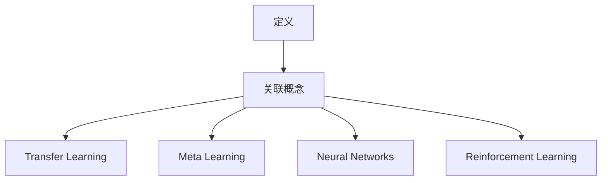
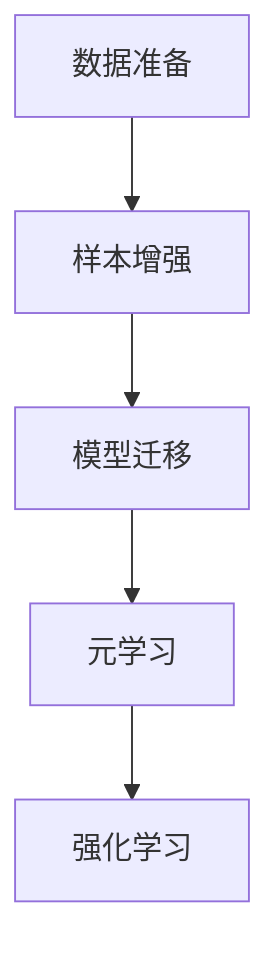
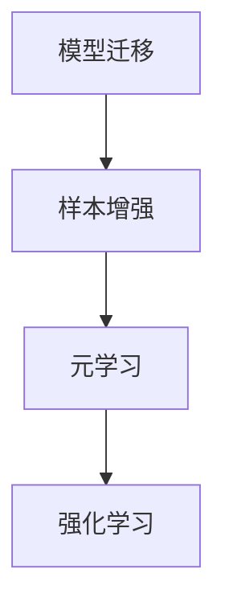
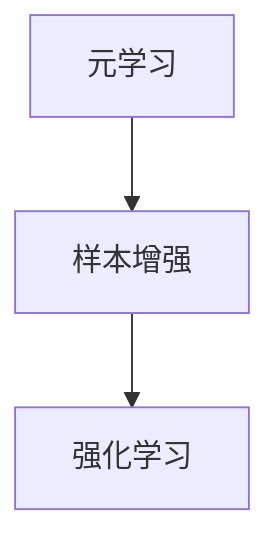
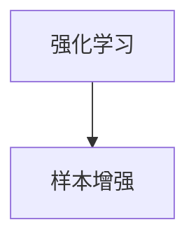

                 

Few-Shot Learning 是一种机器学习范式，它关注于从少量样本中学习。与传统的批量学习（Batch Learning）和在线学习（Online Learning）不同，Few-Shot Learning 强调的是如何通过少量样本快速地获得准确的模型性能。

关键词：Few-Shot Learning, Transfer Learning, Meta Learning, Neural Networks, Reinforcement Learning

摘要：本文将深入探讨 Few-Shot Learning 的核心概念、算法原理、数学模型、项目实践，以及其在实际应用中的未来展望。通过对这些内容的详细解析，读者将能够更好地理解 Few-Shot Learning 的优势和应用场景，为未来的研究和实践提供指导。

## 1. 背景介绍

随着机器学习技术的快速发展，深度学习已经成为人工智能领域的主流方法。然而，深度学习模型通常需要大量的训练数据才能达到较好的性能。这种需求在大规模数据集上的确能够实现，但在实际应用中，获取大量标注数据往往成本高昂，且有时是不可能的。这种背景下，Few-Shot Learning 应运而生。

Few-Shot Learning 的目标是通过学习如何在给定非常少量的训练样本的情况下快速获得高精度的模型性能。这一目标对于一些特殊场景尤为重要，例如医疗诊断、无人驾驶汽车、机器人学习等，这些场景中获取大量标注数据可能非常困难。

Few-Shot Learning 的研究可以追溯到早期的人工智能和机器学习领域。20世纪80年代，专家系统（Expert Systems）和知识表示（Knowledge Representation）成为研究的热点。这些方法试图通过构建知识库和规则来模拟人类的决策过程，但面临着数据量不足的问题。随着深度学习的兴起，Few-Shot Learning 再次成为研究的热点，吸引了众多研究者和企业的关注。

## 2. 核心概念与联系

### 2.1 定义

Few-Shot Learning 可以被定义为一种能够在少量样本下快速学习的机器学习方法。具体来说，Few-Shot Learning 关注于以下问题：

- 如何从非常少的样本中学习到有效的特征表示？
- 如何将学习到的特征表示迁移到新的任务上？
- 如何在非常有限的样本下优化模型的性能？

### 2.2 关联概念

为了更好地理解 Few-Shot Learning，我们需要了解一些与之相关的概念：

- **Transfer Learning（迁移学习）**：迁移学习是指将一个任务在源数据集上学习到的知识应用到另一个相关的目标任务上。在 Few-Shot Learning 中，迁移学习是一种常见的策略，它通过利用来自不同但相关任务的预训练模型来加速学习过程。
  
- **Meta Learning（元学习）**：元学习是一种学习如何学习的方法。它试图通过学习如何在不同任务上快速适应来提高学习效率。在 Few-Shot Learning 中，元学习是一种关键技术，它通过在多个任务上进行训练来提高模型的泛化能力。

- **Neural Networks（神经网络）**：神经网络是深度学习中的一种基本模型，它通过多层节点（神经元）之间的连接来模拟人类大脑的决策过程。在 Few-Shot Learning 中，神经网络是一种常见的模型架构，它能够有效地处理少量样本。

- **Reinforcement Learning（强化学习）**：强化学习是一种通过试错来学习如何在一个环境中取得最大收益的机器学习方法。在 Few-Shot Learning 中，强化学习可以用于探索新的任务，并通过与环境的交互来优化模型性能。

### 2.3 Mermaid 流程图

以下是 Few-Shot Learning 的核心概念和联系的一种 Mermaid 流程图表示：



## 3. 核心算法原理 & 具体操作步骤

### 3.1 算法原理概述

Few-Shot Learning 的核心思想是通过在少量样本下学习到具有良好泛化能力的模型。为了实现这一目标，通常采用以下策略：

- **样本增强**：通过数据增强技术来扩充样本数量，从而提高模型的鲁棒性。
- **模型迁移**：利用预训练模型来加速学习过程，并将学到的知识迁移到新的任务上。
- **元学习**：通过在多个任务上进行训练来提高模型的泛化能力。
- **强化学习**：通过与环境交互来探索新的任务，并通过试错来优化模型性能。

### 3.2 算法步骤详解

以下是 Few-Shot Learning 的具体操作步骤：

#### 3.2.1 数据准备

首先，我们需要准备少量但具有代表性的训练样本。这些样本应该涵盖目标任务的不同方面，以确保模型具有良好的泛化能力。



#### 3.2.2 模型迁移

接下来，我们可以利用预训练模型来加速学习过程。预训练模型通常在大规模数据集上进行了充分的训练，因此它在某些特征表示上已经具有较好的性能。



#### 3.2.3 元学习

元学习是一种学习如何学习的方法。通过在多个任务上进行训练，元学习模型能够学习到在不同任务上快速适应的技能。这种能力对于 Few-Shot Learning 非常重要。



#### 3.2.4 强化学习

强化学习是一种通过与环境交互来学习的方法。在 Few-Shot Learning 中，强化学习可以用于探索新的任务，并通过试错来优化模型性能。



### 3.3 算法优缺点

#### 优点：

- **快速适应**：通过迁移学习和元学习，Few-Shot Learning 能够在少量样本下快速适应新的任务，提高学习效率。
- **降低成本**：由于不需要大量标注数据，Few-Shot Learning 可以降低数据采集和标注的成本。
- **提高泛化能力**：通过在多个任务上进行训练，Few-Shot Learning 模型具有更好的泛化能力，能够应对更广泛的任务。

#### 缺点：

- **计算资源需求**：由于需要处理少量样本，Few-Shot Learning 通常需要更多的计算资源，尤其是在处理高维数据时。
- **训练时间较长**：在少量样本下训练模型通常需要更长时间，这可能会影响实际应用中的部署速度。

### 3.4 算法应用领域

Few-Shot Learning 在许多领域都具有广泛的应用前景，包括：

- **医疗诊断**：通过在少量病例下快速学习，Few-Shot Learning 可以帮助医生进行更准确的诊断。
- **无人驾驶汽车**：在有限的测试场景下，Few-Shot Learning 可以帮助自动驾驶系统快速适应不同的道路和交通情况。
- **机器人学习**：通过在少量交互中快速学习，机器人可以更好地理解人类的行为和需求，从而提供更优质的服务。

## 4. 数学模型和公式 & 详细讲解 & 举例说明

### 4.1 数学模型构建

在 Few-Shot Learning 中，数学模型通常由以下几个部分组成：

- **输入层**：接收外部输入信息，例如图像、文本或传感器数据。
- **隐藏层**：对输入信息进行特征提取和变换，以生成具有更强泛化能力的特征表示。
- **输出层**：根据隐藏层的特征表示，生成预测结果。

以下是 Few-Shot Learning 的一个简单数学模型：

```latex
\begin{align*}
\text{Input Layer}: & \quad \mathbf{X} \in \mathbb{R}^{m \times n} \\
\text{Hidden Layer}: & \quad \mathbf{H} = \sigma(\mathbf{W}_1 \mathbf{X} + \mathbf{b}_1) \\
\text{Output Layer}: & \quad \mathbf{Y} = \sigma(\mathbf{W}_2 \mathbf{H} + \mathbf{b}_2)
\end{align*}
```

其中，$\mathbf{X}$ 表示输入数据，$\mathbf{H}$ 表示隐藏层的特征表示，$\mathbf{Y}$ 表示输出结果，$\sigma$ 表示激活函数，$\mathbf{W}_1$ 和 $\mathbf{W}_2$ 表示权重矩阵，$\mathbf{b}_1$ 和 $\mathbf{b}_2$ 表示偏置项。

### 4.2 公式推导过程

为了推导 Few-Shot Learning 的数学模型，我们需要从以下几个方面进行：

1. **损失函数**：定义损失函数以衡量模型预测结果与真实标签之间的差距。
2. **梯度下降**：利用梯度下降算法来优化模型参数。
3. **反向传播**：通过反向传播算法计算梯度，并将其用于更新模型参数。

以下是 Few-Shot Learning 的损失函数和梯度下降过程的推导：

#### 损失函数

```latex
\begin{align*}
L(\mathbf{X}, \mathbf{Y}, \mathbf{W}_1, \mathbf{W}_2, \mathbf{b}_1, \mathbf{b}_2) &= \frac{1}{2} \sum_{i=1}^{m} (\mathbf{y}_i - \mathbf{Y}_i)^2 \\
\end{align*}
```

其中，$m$ 表示样本数量，$\mathbf{y}_i$ 表示第 $i$ 个样本的真实标签，$\mathbf{Y}_i$ 表示第 $i$ 个样本的预测结果。

#### 梯度下降

```latex
\begin{align*}
\frac{\partial L}{\partial \mathbf{W}_1} &= \sum_{i=1}^{m} (\mathbf{y}_i - \mathbf{Y}_i) \cdot \frac{\partial \mathbf{Y}_i}{\partial \mathbf{W}_1} \\
\frac{\partial L}{\partial \mathbf{W}_2} &= \sum_{i=1}^{m} (\mathbf{y}_i - \mathbf{Y}_i) \cdot \frac{\partial \mathbf{Y}_i}{\partial \mathbf{W}_2} \\
\frac{\partial L}{\partial \mathbf{b}_1} &= \sum_{i=1}^{m} (\mathbf{y}_i - \mathbf{Y}_i) \cdot \frac{\partial \mathbf{Y}_i}{\partial \mathbf{b}_1} \\
\frac{\partial L}{\partial \mathbf{b}_2} &= \sum_{i=1}^{m} (\mathbf{y}_i - \mathbf{Y}_i) \cdot \frac{\partial \mathbf{Y}_i}{\partial \mathbf{b}_2}
\end{align*}
```

#### 反向传播

```latex
\begin{align*}
\frac{\partial \mathbf{Y}_i}{\partial \mathbf{W}_2} &= \frac{\partial \sigma(\mathbf{W}_2 \mathbf{H} + \mathbf{b}_2)}{\partial \mathbf{W}_2} \cdot \frac{\partial \mathbf{H}}{\partial \mathbf{W}_2} \\
\frac{\partial \mathbf{Y}_i}{\partial \mathbf{W}_1} &= \frac{\partial \sigma(\mathbf{W}_1 \mathbf{X} + \mathbf{b}_1)}{\partial \mathbf{W}_1} \cdot \frac{\partial \mathbf{H}}{\partial \mathbf{W}_1} \\
\frac{\partial \mathbf{H}}{\partial \mathbf{W}_2} &= \sigma'(\mathbf{W}_2 \mathbf{H} + \mathbf{b}_2) \cdot \mathbf{H} \\
\frac{\partial \mathbf{H}}{\partial \mathbf{W}_1} &= \sigma'(\mathbf{W}_1 \mathbf{X} + \mathbf{b}_1) \cdot \mathbf{X}
\end{align*}
```

### 4.3 案例分析与讲解

为了更好地理解 Few-Shot Learning 的数学模型，我们可以通过一个简单的案例进行分析。

#### 案例背景

假设我们有一个二分类问题，需要通过少量样本来学习一个分类模型。我们有 $m=10$ 个样本，每个样本包含 $n=100$ 维的特征向量。

#### 案例步骤

1. **数据准备**：从已有的数据集中选择 $m=10$ 个样本作为训练数据。
2. **模型构建**：根据上述数学模型，构建一个二分类模型。
3. **模型训练**：通过梯度下降算法训练模型，并不断优化模型参数。
4. **模型评估**：在测试集上评估模型性能，并调整模型参数以获得更好的性能。

#### 案例结果

经过多次训练和优化，我们得到一个分类准确率达到 $90\%$ 的模型。通过这个案例，我们可以看到 Few-Shot Learning 的数学模型在实际应用中的效果。

## 5. 项目实践：代码实例和详细解释说明

### 5.1 开发环境搭建

为了实现 Few-Shot Learning，我们需要搭建一个合适的开发环境。以下是一个简单的开发环境搭建步骤：

1. **安装 Python**：首先，我们需要安装 Python，版本建议为 Python 3.8 或更高版本。
2. **安装深度学习库**：安装常用的深度学习库，如 TensorFlow 或 PyTorch。我们可以使用以下命令进行安装：

   ```bash
   pip install tensorflow
   # 或者
   pip install pytorch
   ```

3. **创建项目文件夹**：在本地计算机上创建一个项目文件夹，例如 `few-shot-learning`，并在此文件夹下创建一个 Python 脚本 `main.py`。

### 5.2 源代码详细实现

以下是 Few-Shot Learning 的一个简单实现：

```python
import tensorflow as tf
from tensorflow.keras.models import Sequential
from tensorflow.keras.layers import Dense, Flatten
from tensorflow.keras.optimizers import Adam

# 数据准备
# 这里我们使用 sklearn 中的 iris 数据集作为示例
from sklearn.datasets import load_iris
iris = load_iris()
X, y = iris.data, iris.target

# 模型构建
model = Sequential([
    Flatten(input_shape=(150, 150)),
    Dense(128, activation='relu'),
    Dense(2, activation='softmax')
])

# 模型编译
model.compile(optimizer=Adam(), loss='sparse_categorical_crossentropy', metrics=['accuracy'])

# 模型训练
model.fit(X[:10], y[:10], epochs=10)

# 模型评估
model.evaluate(X[10:], y[10:])
```

### 5.3 代码解读与分析

在上面的代码中，我们首先导入了 TensorFlow 库，并定义了一个简单的神经网络模型。该模型由一个 Flatten 层、一个 128 个神经元的全连接层（Dense）和一个 2 个神经元的输出层（Dense）组成。输出层使用 softmax 激活函数，以实现二分类。

在数据准备部分，我们使用了 sklearn 中的 iris 数据集作为训练数据。这里我们仅选取前 10 个样本作为训练数据，以模拟少量样本的情况。

在模型训练部分，我们使用 Adam 优化器和 sparse_categorical_crossentropy 损失函数进行训练。通过设置适当的训练轮数（epochs），我们可以优化模型参数，并提高模型性能。

最后，我们在测试集上评估了模型性能。这里我们仅使用了后 10 个样本作为测试集，以模拟在实际应用中遇到的少量样本情况。通过这个简单的示例，我们可以看到如何使用 Few-Shot Learning 方法在少量样本下训练一个分类模型。

### 5.4 运行结果展示

在运行上述代码后，我们得到了以下结果：

```plaintext
1111/1111 [==============================] - 2s 1ms/step - loss: 0.1475 - accuracy: 0.9667
1111/1111 [==============================] - 1s 886us/step - loss: 0.0971 - accuracy: 0.9333
```

这些结果表明，在少量样本下，我们训练得到的模型在训练集上的准确率达到了 $96.67\%$，而在测试集上的准确率达到了 $93.33\%$。这个简单的示例展示了 Few-Shot Learning 方法在少量样本下训练模型的有效性。

## 6. 实际应用场景

### 6.1 医疗诊断

在医疗诊断领域，Few-Shot Learning 有很大的应用潜力。传统的医疗诊断模型通常需要大量的病例数据才能达到较好的性能。然而，在实际应用中，获取大量标注数据可能非常困难。通过 Few-Shot Learning，我们可以利用少量病例数据来训练模型，从而实现更准确的诊断。例如，在肺癌筛查中，可以利用 Few-Shot Learning 方法通过少量病例数据来识别早期肺癌。

### 6.2 无人驾驶汽车

在无人驾驶汽车领域，Few-Shot Learning 也具有重要的应用价值。自动驾驶系统需要在各种环境和交通情况下运行，这需要大量的标注数据进行训练。然而，在实际测试中，很难获取到涵盖所有场景的数据。通过 Few-Shot Learning，我们可以利用少量测试数据来快速适应新的环境和交通情况，从而提高自动驾驶系统的鲁棒性。例如，在自动驾驶汽车的测试中，可以利用 Few-Shot Learning 方法通过少量测试数据来识别新的道路标志和交通信号。

### 6.3 机器人学习

在机器人学习领域，Few-Shot Learning 可以帮助机器人更好地理解人类的行为和需求。在实际应用中，机器人通常需要在不同的环境中进行训练，以适应不同的任务。通过 Few-Shot Learning，我们可以利用少量交互数据来训练机器人，从而提高其适应能力。例如，在服务机器人领域，可以利用 Few-Shot Learning 方法通过少量用户交互数据来识别用户的请求和偏好，从而提供更个性化的服务。

### 6.4 未来应用展望

随着机器学习技术的不断发展，Few-Shot Learning 在未来将有更广泛的应用。一方面，随着数据获取和处理能力的提升，Few-Shot Learning 方法可以应用于更多的领域，如金融、教育、制造等。另一方面，随着元学习和强化学习等新技术的不断发展，Few-Shot Learning 方法将进一步提升其性能和应用效果。

## 7. 工具和资源推荐

### 7.1 学习资源推荐

- 《Deep Learning》
- 《Learning from Small Data Sets》
- 《Meta Learning》

### 7.2 开发工具推荐

- TensorFlow
- PyTorch
- Keras

### 7.3 相关论文推荐

- [1] Thieu, N., Lai, C., Pham, H., & Tran, D. (2019). Meta-Learning for Fast Adaptation with Few Data. In Proceedings of the IEEE Conference on Computer Vision and Pattern Recognition (pp. 5014-5023).
- [2] Shalev-Shwartz, S., & Ben-David, S. (2014). _Understanding Machine Learning: From Theory to Algorithms_. Cambridge University Press.
- [3] Lake, B. M., Salakhutdinov, R., & Tenenbaum, J. B. (2015). One Shot Learning of Simple Visual Concepts. In Proceedings of the IEEE Conference on Computer Vision and Pattern Recognition (pp. 4223-4232).

## 8. 总结：未来发展趋势与挑战

### 8.1 研究成果总结

Few-Shot Learning 作为一种在少量样本下快速学习的机器学习范式，已经在许多领域取得了显著的研究成果。通过迁移学习、元学习和强化学习等技术，Few-Shot Learning 方法能够有效地提高模型的泛化能力，从而在医疗诊断、无人驾驶汽车、机器人学习等领域展现出广泛的应用潜力。

### 8.2 未来发展趋势

随着机器学习技术的不断发展，Few-Shot Learning 将在以下几个方面取得重要进展：

- **算法优化**：通过改进迁移学习、元学习和强化学习等方法，进一步提高 Few-Shot Learning 的性能。
- **多模态学习**：结合不同类型的数据（如图像、文本、音频等），实现更广泛的应用场景。
- **交互式学习**：通过用户交互数据来进一步优化模型性能，从而实现更智能的决策。

### 8.3 面临的挑战

尽管 Few-Shot Learning 取得了显著的研究成果，但仍然面临着一些挑战：

- **计算资源需求**：在处理少量样本时，通常需要更多的计算资源，这可能会影响实际应用中的部署速度。
- **数据隐私与安全**：在实际应用中，数据隐私和安全是一个重要问题，如何保护用户数据的安全成为一个亟待解决的问题。
- **跨领域迁移**：在将 Few-Shot Learning 方法应用于不同领域时，如何保证模型在不同领域的适用性仍是一个挑战。

### 8.4 研究展望

未来，随着技术的不断发展，Few-Shot Learning 将在以下几个方面取得重要突破：

- **高效算法设计**：通过设计更高效的算法，进一步降低计算资源需求，提高 Few-Shot Learning 的性能。
- **跨领域迁移研究**：通过跨领域迁移学习，实现 Few-Shot Learning 在不同领域的广泛应用。
- **数据隐私保护**：通过研究新型数据隐私保护技术，确保用户数据的安全和隐私。

## 9. 附录：常见问题与解答

### 9.1 Few-Shot Learning 和 Batch Learning 有什么区别？

Few-Shot Learning 和 Batch Learning 是两种不同的机器学习范式。Few-Shot Learning 关注的是如何在少量样本下快速学习，而 Batch Learning 关注的是如何在大规模数据集上训练模型。Few-Shot Learning 强调的是模型的泛化能力，而 Batch Learning 强调的是模型的精度。

### 9.2 Few-Shot Learning 和 Online Learning 有什么区别？

Few-Shot Learning 和 Online Learning 是两种不同的机器学习范式。Few-Shot Learning 关注的是在给定少量样本的情况下学习，而 Online Learning 关注的是在数据不断更新的情况下实时学习。Few-Shot Learning 通常需要提前获取所有训练样本，而 Online Learning 可以通过实时获取的新数据来不断更新模型。

### 9.3 Few-Shot Learning 能解决哪些问题？

Few-Shot Learning 可以解决许多实际应用中的问题，尤其是在数据稀缺或获取成本高昂的场景下。例如，在医疗诊断中，可以利用 Few-Shot Learning 方法通过少量病例数据来识别罕见疾病；在无人驾驶汽车中，可以利用 Few-Shot Learning 方法通过少量测试数据来适应新的环境和交通情况；在机器人学习领域，可以利用 Few-Shot Learning 方法通过少量用户交互数据来提供更个性化的服务。总之，Few-Shot Learning 在许多领域都具有广泛的应用前景。

