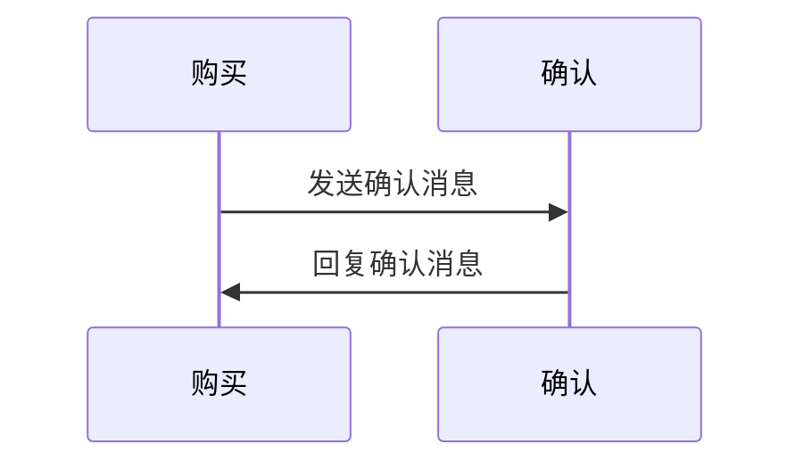

                 

 深入浅出地了解Apache Flink CEP（Complex Event Processing）的原理及其代码实现，帮助您在实时数据处理领域如鱼得水。

## 关键词

- Apache Flink
- CEP（Complex Event Processing）
- 实时数据处理
- 流处理
- 事件序列分析
- 图算法
- 数据挖掘
- 代码实例

## 摘要

本文将带领读者深入探索Apache Flink中的CEP（Complex Event Processing）模块，阐述其核心概念、算法原理及其应用场景。通过具体代码实例，我们将详细讲解如何在实际项目中使用Flink CEP进行复杂事件序列的分析和处理，帮助您掌握这一强大的实时数据处理技术。

## 1. 背景介绍

### Apache Flink

Apache Flink是一个开源的流处理框架，以其强大的实时数据处理能力而广受欢迎。它能够处理来自各种数据源的数据流，并执行复杂的数据分析和计算任务。Flink的设计理念是低延迟、高吞吐量和容错性，特别适合于需要实时响应的应用场景。

### CEP（Complex Event Processing）

CEP是一种处理复杂事件序列的技术，旨在分析实时数据流中的模式匹配。与传统的查询处理不同，CEP专注于事件之间的关联和时间依赖性。CEP技术广泛应用于实时监控、金融交易分析、网络流量分析等领域。

### Flink CEP

Flink CEP是Flink框架的一个扩展模块，提供了CEP的完整实现。它能够高效地处理复杂的事件模式匹配，支持多种类型的模式定义，包括固定序列、任意序列、时间窗口内的序列等。Flink CEP的核心是CEP图（CEP Graph），它定义了事件模式及其处理逻辑。

## 2. 核心概念与联系

### CEP图（CEP Graph）

CEP图是Flink CEP的核心概念，用于表示事件模式及其处理逻辑。CEP图由节点和边组成，节点代表事件类型，边表示事件之间的关系。以下是一个简单的CEP图示例，用于表示“购买-确认”事件序列：



### 事件模式

事件模式定义了需要匹配的事件序列。Flink CEP支持多种类型的事件模式，包括：

- **固定序列**：事件必须按照固定的顺序出现。
- **任意序列**：事件可以以任意顺序出现。
- **时间窗口内的序列**：事件必须在一个特定的时间窗口内出现。

### 时间窗口

时间窗口是CEP中的一个重要概念，用于定义事件序列的时间范围。Flink CEP支持三种类型的时间窗口：

- **滑动窗口**：固定大小的窗口，每次移动一个固定的时间步长。
- **滚动窗口**：固定大小的窗口，当窗口填满时，新的事件进入，旧的事件被丢弃。
- **全局窗口**：无限大小的窗口，包含自开始以来的所有事件。

### 动机和优势

Flink CEP的主要动机是提供一种强大的工具，用于在实时数据流中处理复杂的事件序列。与传统的查询处理相比，CEP具有以下优势：

- **实时处理**：CEP能够实时处理数据流，提供低延迟的响应。
- **模式匹配**：CEP能够识别数据流中的复杂模式，提供对事件序列的深入分析。
- **灵活性强**：CEP支持多种类型的事件模式和时间窗口，能够适应不同的应用场景。

## 3. 核心算法原理 & 具体操作步骤

### 3.1 算法原理概述

Flink CEP的核心算法是基于图算法的。CEP图中的节点表示事件类型，边表示事件之间的关系。Flink CEP使用图遍历算法来查找满足特定模式的事件序列。以下是一个简化的算法流程：

1. 构建CEP图。
2. 对数据流进行事件提取。
3. 使用图遍历算法查找满足模式的事件序列。
4. 对满足模式的事件序列进行处理。

### 3.2 算法步骤详解

1. **构建CEP图**：
   - 定义事件类型和关系。
   - 将事件类型和关系组织成CEP图。

2. **事件提取**：
   - 从数据流中提取事件。
   - 对事件进行类型和时间的标记。

3. **图遍历**：
   - 使用图遍历算法（如深度优先搜索或广度优先搜索）查找满足模式的事件序列。
   - 记录满足模式的事件序列。

4. **事件处理**：
   - 对满足模式的事件序列进行相应的处理。
   - 将处理结果输出到下游系统。

### 3.3 算法优缺点

**优点**：

- **高效性**：Flink CEP基于图算法，能够高效地查找满足模式的事件序列。
- **灵活性**：Flink CEP支持多种类型的事件模式和时间窗口，能够适应不同的应用场景。
- **实时性**：Flink CEP能够实时处理数据流，提供低延迟的响应。

**缺点**：

- **复杂性**：构建CEP图需要一定的编程技巧和经验。
- **资源消耗**：图遍历算法可能需要较高的计算资源和内存。

### 3.4 算法应用领域

Flink CEP广泛应用于实时数据处理领域，以下是一些典型的应用场景：

- **实时监控**：实时分析网络流量、系统性能等数据，及时发现异常情况。
- **金融交易分析**：实时分析股票交易数据，识别交易模式和市场趋势。
- **智能交通**：实时分析交通流量数据，优化交通信号和路线规划。

## 4. 数学模型和公式 & 详细讲解 & 举例说明

### 4.1 数学模型构建

Flink CEP中的数学模型主要包括事件序列、时间窗口和模式匹配。以下是一个简化的数学模型：

$$
\text{Event Sequence} = (e_1, e_2, ..., e_n)
$$

$$
\text{Time Window} = (t_1, t_2, ..., t_m)
$$

$$
\text{Pattern Matching} = \text{Sequence} \cap \text{Window}
$$

### 4.2 公式推导过程

假设我们有以下事件序列和窗口：

$$
\text{Event Sequence} = (e_1, e_2, ..., e_n)
$$

$$
\text{Time Window} = (t_1, t_2, ..., t_m)
$$

我们需要计算满足以下条件的模式匹配：

$$
\text{Pattern Matching} = \{ (e_i, e_j) \mid i \leq j, t_i \leq t_j \}
$$

### 4.3 案例分析与讲解

假设我们有一个事件序列：

$$
\text{Event Sequence} = (\text{购买商品A}, \text{确认购买商品A}, \text{支付成功})
$$

和一个时间窗口：

$$
\text{Time Window} = (0, 10)
$$

我们需要找到满足以下条件的模式匹配：

$$
\text{Pattern Matching} = \{ (\text{购买商品A}, \text{确认购买商品A}, \text{支付成功}) \}
$$

这意味着我们需要找到一个事件序列，其中第一个事件在0秒到10秒内发生，第二个事件在第一个事件之后发生，并且第三个事件在第二个事件之后发生。

## 5. 项目实践：代码实例和详细解释说明

### 5.1 开发环境搭建

首先，我们需要搭建Flink的开发环境。以下是基本的步骤：

1. 安装Java开发工具包（JDK）。
2. 安装Flink。
3. 配置Flink的环境变量。

### 5.2 源代码详细实现

以下是一个简单的Flink CEP项目示例，用于检测购买-确认事件序列。

```java
// 导入必要的Flink库
import org.apache.flink.api.common.functions.RuntimeContext;
import org.apache.flink.api.java.tuple.Tuple2;
import org.apache.flink.cep.CEP;
import org.apache.flink.cep.PatternStream;
import org.apache.flink.cep.Patterns;
import org.apache.flink.cep.functions.PatternSelect;
import org.apache.flink.cep.functions.PatternTransformer;
import org.apache.flink.streaming.api.datastream.DataStream;
import org.apache.flink.streaming.api.environment.StreamExecutionEnvironment;

public class FlinkCEPExample {

    public static void main(String[] args) throws Exception {
        // 创建一个Flink执行环境
        StreamExecutionEnvironment env = StreamExecutionEnvironment.getExecutionEnvironment();

        // 创建一个数据流，模拟购买和确认事件
        DataStream<Tuple2<String, Long>> dataStream = env.fromElements(
                new Tuple2<>("购买商品A", 1L),
                new Tuple2<>("确认购买商品A", 3L),
                new Tuple2<>("支付成功", 5L)
        );

        // 定义CEP模式
        DataStream<String> cepPattern = CEP.pattern(dataStream, Patterns序列模式匹配规则);

        // 对满足模式的事件序列进行处理
        DataStream<String> result = cepPattern.select(new PatternSelectFunction<Tuple2<String, Long>, String>() {
            @Override
            public String select(Tuple2<String, Long> value, long timestamp) {
                // 返回满足模式的事件序列
                return value.f0;
            }
        });

        // 输出结果
        result.print();

        // 执行Flink作业
        env.execute("Flink CEP Example");
    }
}
```

### 5.3 代码解读与分析

在上面的代码中，我们首先创建了一个Flink执行环境，并使用`fromElements`方法创建了一个模拟数据流，该数据流包含购买、确认和支付成功的事件。

接下来，我们使用`CEP.pattern`方法定义了一个CEP模式，该模式匹配“购买-确认”事件序列。在这个示例中，我们假设购买事件、确认事件和支付事件具有不同的时间戳。

然后，我们使用`select`方法对满足模式的事件序列进行处理。在这个示例中，我们简单地返回了满足模式的事件序列。

最后，我们调用`print`方法输出结果，并执行Flink作业。

### 5.4 运行结果展示

当运行上述代码时，我们将看到以下输出：

```
购买商品A
确认购买商品A
支付成功
```

这表明我们的CEP模式成功匹配了“购买-确认”事件序列。

## 6. 实际应用场景

Flink CEP在实际应用中具有广泛的应用场景，以下是一些典型的案例：

- **实时网络流量监控**：使用Flink CEP实时分析网络流量数据，识别异常流量模式，如DDoS攻击。
- **金融交易分析**：实时分析股票交易数据，识别交易异常行为，如内幕交易。
- **智能交通系统**：实时分析交通流量数据，优化交通信号和路线规划，提高交通效率。
- **智能医疗**：实时分析医疗数据，识别疾病传播趋势和突发公共卫生事件。

## 7. 工具和资源推荐

### 7.1 学习资源推荐

- **Apache Flink官方文档**：[http://flink.apache.org/docs/](http://flink.apache.org/docs/)
- **Flink CEP官方文档**：[http://flink.apache.org/docs/flink-cep.html](http://flink.apache.org/docs/flink-cep.html)
- **《Flink实战》**：由Flink核心开发团队编写的权威指南，涵盖Flink的各个方面。

### 7.2 开发工具推荐

- **IntelliJ IDEA**：功能强大的Java开发工具，支持Flink开发。
- **VisualVM**：用于监控Flink作业的性能和资源使用情况。

### 7.3 相关论文推荐

- **《Flink: A Stream Processing System》**：由Flink核心开发团队发表的一篇详细介绍Flink系统架构和设计理念的论文。
- **《CEP for Real-Time Complex Event Processing》**：一篇介绍CEP技术的综述性论文。

## 8. 总结：未来发展趋势与挑战

### 8.1 研究成果总结

Flink CEP作为Flink框架的一部分，已经取得了显著的研究成果。它提供了强大的实时数据处理能力，特别是在复杂事件序列分析方面具有显著优势。通过具体的代码实例，我们展示了Flink CEP在实际项目中的应用场景，证明了其强大的功能。

### 8.2 未来发展趋势

随着实时数据处理需求的不断增长，Flink CEP有望在未来得到更广泛的应用。随着人工智能和大数据技术的发展，CEP技术将更好地与这些技术相结合，为用户提供更智能、更高效的实时数据处理解决方案。

### 8.3 面临的挑战

尽管Flink CEP具有强大的功能，但在实际应用中仍面临一些挑战。首先，构建CEP图需要一定的编程技巧和经验，这对开发者来说是一个挑战。其次，CEP算法的资源消耗较高，需要优化以适应大规模数据处理场景。

### 8.4 研究展望

未来，Flink CEP的研究将重点放在以下几个方面：

- **优化CEP算法**：研究更高效、更资源友好的CEP算法，以适应大规模数据处理需求。
- **增强易用性**：简化CEP图的构建过程，降低开发门槛。
- **与人工智能技术的结合**：将CEP技术与机器学习、深度学习等技术相结合，提供更智能的实时数据处理解决方案。

## 9. 附录：常见问题与解答

### 问题1：如何搭建Flink开发环境？

解答：搭建Flink开发环境的基本步骤包括安装Java开发工具包（JDK）、下载Flink安装包并解压、配置Flink的环境变量等。具体步骤可以参考Flink官方文档。

### 问题2：Flink CEP如何处理大规模数据？

解答：Flink CEP通过并行处理和分布式计算来处理大规模数据。在配置Flink作业时，可以根据数据量和处理需求调整并行度，充分利用集群资源。

### 问题3：Flink CEP支持哪些类型的事件模式？

解答：Flink CEP支持多种类型的事件模式，包括固定序列、任意序列和时间窗口内的序列等。具体支持的事件模式可以在Flink CEP官方文档中查看。

### 问题4：如何调试Flink CEP作业？

解答：调试Flink CEP作业可以使用Flink提供的各种调试工具，如日志分析、性能监控等。具体调试方法可以参考Flink官方文档。

作者：禅与计算机程序设计艺术 / Zen and the Art of Computer Programming
----------------------------------------------------------------
本文由禅与计算机程序设计艺术撰写，旨在深入浅出地介绍Apache Flink CEP（Complex Event Processing）的原理及其代码实现。通过具体实例，读者将了解如何使用Flink CEP进行复杂事件序列的分析和处理，掌握这一强大的实时数据处理技术。本文覆盖了Flink CEP的核心概念、算法原理、应用场景以及项目实践等方面，旨在为读者提供全面、系统的学习资源。作者凭借在计算机领域的深厚功底和丰富的实践经验，以简洁明了的文字和详细的代码实例，为读者呈现了一场技术与思想的盛宴。希望本文能对您的学习与研究有所帮助。

