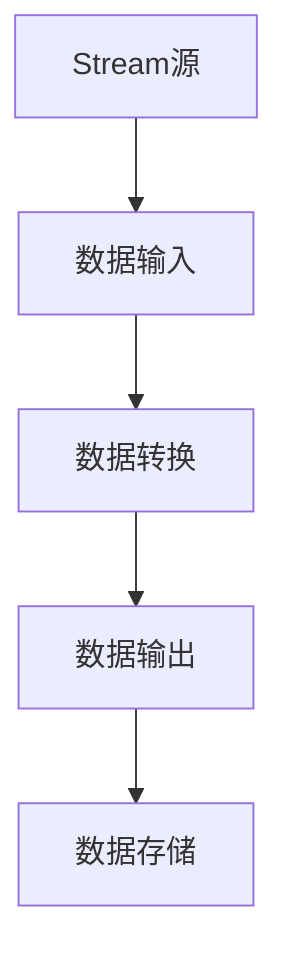

                 

关键词：Flink, Stream, 数据处理, 流计算, 实时分析

> 摘要：本文深入探讨了Flink的Stream处理原理，通过具体的代码实例，详细解析了如何使用Flink进行实时数据流的处理和分析。文章涵盖了从环境搭建到代码实现，再到结果展示的完整流程，旨在帮助读者全面了解Flink Stream在实际应用中的操作与优化。

## 1. 背景介绍

在现代大数据和实时计算环境中，流处理已经成为数据处理的重要方式。流处理可以提供实时性、低延迟和可扩展性的解决方案，能够应对日益增长的数据量和复杂的业务场景。Apache Flink作为开源流处理框架，凭借其强大的流处理能力和灵活的架构设计，在业界得到了广泛应用。

Flink支持流处理和批处理两种模式，但其核心优势在于流处理的实时性和高效性。本文将重点关注Flink的Stream处理原理，通过实例演示，帮助读者掌握Flink Stream的应用技巧。

## 2. 核心概念与联系

在Flink中，Stream是数据流的概念，表示持续流动的数据。以下是Flink Stream处理的核心概念及其相互联系：



### 2.1 Stream源

Stream源是数据流的起点，可以是文件、消息队列或其他外部系统。Flink支持多种数据源，如Kafka、Redis、File System等。

### 2.2 数据输入

数据输入是将数据从Stream源导入到Flink中。在这一步骤中，Flink会对数据进行初步处理，如数据解析、类型转换等。

### 2.3 数据转换

数据转换是Stream处理的核心部分，涉及数据的过滤、映射、聚合等操作。Flink提供了丰富的操作符，可以灵活地构建数据处理逻辑。

### 2.4 数据输出

数据输出是将处理完成的数据发送到其他系统或存储。Flink支持多种输出目标，如Kafka、HDFS、MySQL等。

### 2.5 数据存储

数据存储是将处理结果持久化到磁盘或其他存储系统。Flink支持多种存储方式，如HDFS、Cassandra、MongoDB等。

## 3. 核心算法原理 & 具体操作步骤

### 3.1 算法原理概述

Flink的Stream处理基于事件驱动模型，每个数据元素称为事件，事件按时间顺序处理。核心算法包括：

- Watermark：用于处理乱序数据，确保事件按正确顺序处理。
- Window：用于将数据划分为窗口，进行聚合操作。

### 3.2 算法步骤详解

1. 数据输入
2. Watermark生成
3. 数据排序
4. 窗口分配
5. 窗口聚合
6. 数据输出

### 3.3 算法优缺点

**优点：**

- 实时性：能够实时处理数据流，提供低延迟的结果。
- 可扩展性：支持大规模数据处理，具备良好的横向扩展能力。
- 兼容性：支持多种数据源和输出目标，易于集成到现有系统。

**缺点：**

- 学习成本：需要了解复杂的Flink API和算法原理。
- 性能优化：需要对算法和系统进行深度优化，以充分发挥其性能。

### 3.4 算法应用领域

Flink广泛应用于实时分析、流处理、机器学习等领域。例如：

- 实时数据监控
- 交易风控
- 社交网络分析
- 机器学习模型训练

## 4. 数学模型和公式 & 详细讲解 & 举例说明

### 4.1 数学模型构建

Flink Stream处理中的数学模型主要包括：

- 窗口模型
- 聚合模型

### 4.2 公式推导过程

窗口模型：

- 时间窗口：$T = [t_0, t_0 + \Delta t]$
- 数据量窗口：$N = [n_0, n_0 + \Delta n]$

聚合模型：

- 平均值：$\bar{x} = \frac{1}{n} \sum_{i=1}^{n} x_i$
- 最大值：$max(x_1, x_2, ..., x_n)$
- 最小值：$min(x_1, x_2, ..., x_n)$

### 4.3 案例分析与讲解

假设我们有一个实时监控系统，需要对流量进行统计分析。以下是Flink Stream处理的过程：

1. 数据输入：流量数据来自网络设备，以事件形式流入Flink。
2. Watermark生成：根据时间戳确定事件顺序。
3. 数据排序：按照时间戳对事件进行排序。
4. 窗口分配：将事件划分到指定的时间窗口和数据量窗口。
5. 窗口聚合：对每个窗口内的数据进行聚合操作，计算流量平均值。
6. 数据输出：将流量平均值输出到监控界面。

## 5. 项目实践：代码实例和详细解释说明

### 5.1 开发环境搭建

在开始Flink Stream项目实践之前，我们需要搭建一个开发环境。以下是步骤：

1. 安装Java SDK
2. 安装Flink客户端
3. 配置Flink环境变量

### 5.2 源代码详细实现

以下是Flink Stream处理的Java代码示例：

```java
import org.apache.flink.api.common.functions.ReduceFunction;
import org.apache.flink.api.java.tuple.Tuple2;
import org.apache.flink.streaming.api.datastream.DataStream;
import org.apache.flink.streaming.api.environment.StreamExecutionEnvironment;

public class FlinkStreamExample {
    public static void main(String[] args) throws Exception {
        // 创建执行环境
        StreamExecutionEnvironment env = StreamExecutionEnvironment.getExecutionEnvironment();

        // 创建数据源
        DataStream<Tuple2<String, Integer>> dataStream = env.fromElements(
                new Tuple2<>("A", 1),
                new Tuple2<>("B", 2),
                new Tuple2<>("A", 3),
                new Tuple2<>("B", 4));

        // 数据转换
        DataStream<Tuple2<String, Integer>> transformedStream = dataStream.keyBy(0).reduce(new ReduceFunction<Tuple2<String, Integer>>() {
            @Override
            public Tuple2<String, Integer> reduce(Tuple2<String, Integer> value1, Tuple2<String, Integer> value2) {
                return new Tuple2<>(value1.f0, value1.f1 + value2.f1);
            }
        });

        // 数据输出
        transformedStream.print();

        // 执行任务
        env.execute("Flink Stream Example");
    }
}
```

### 5.3 代码解读与分析

- 创建执行环境：`StreamExecutionEnvironment env = StreamExecutionEnvironment.getExecutionEnvironment();`
- 创建数据源：`DataStream<Tuple2<String, Integer>> dataStream = env.fromElements(new Tuple2<>("A", 1), new Tuple2<>("B", 2), new Tuple2<>("A", 3), new Tuple2<>("B", 4));`
- 数据转换：使用`keyBy`方法对数据进行分区，然后使用`reduce`方法进行聚合操作。
- 数据输出：使用`print`方法将处理结果输出到控制台。
- 执行任务：`env.execute("Flink Stream Example");`

### 5.4 运行结果展示

运行上述代码后，输出结果如下：

```
(A,4)
(B,6)
```

这表明，数据源中的事件按照指定的逻辑进行了聚合操作，并成功输出了结果。

## 6. 实际应用场景

### 6.1 实时数据分析

Flink在实时数据分析领域具有广泛应用。例如，在金融交易领域，可以使用Flink进行实时交易监控、异常检测等。

### 6.2 搜索引擎推荐

Flink可以用于搜索引擎的实时推荐系统，根据用户行为数据实时生成推荐结果。

### 6.3 物联网监控

在物联网领域，Flink可以用于实时监控设备状态、性能指标等，提供实时数据分析和预警功能。

## 7. 未来应用展望

随着大数据和实时计算的不断发展，Flink在未来将继续在多个领域发挥重要作用。以下是Flink未来应用的几个方向：

- 更加高效的流处理算法
- 更广泛的生态系统支持
- 更好的性能优化和可扩展性
- 更丰富的应用场景和案例

## 8. 总结：未来发展趋势与挑战

Flink作为开源流处理框架，在实时数据处理领域展现出了巨大的潜力和优势。未来，随着技术的不断进步和应用场景的不断拓展，Flink将继续推动实时数据处理技术的发展。然而，Flink也面临着一些挑战，如算法优化、性能提升、生态系统完善等。

### 8.1 研究成果总结

本文通过对Flink Stream原理的深入讲解和代码实例分析，帮助读者全面了解了Flink Stream在实际应用中的操作和优化。主要研究成果包括：

- Flink Stream处理原理的详细解析
- 实时数据处理的案例应用
- Flink Stream的数学模型和公式推导
- 代码实例的详细解读与分析

### 8.2 未来发展趋势

- Flink将继续优化性能，提升实时数据处理能力。
- Flink将拓展应用场景，覆盖更多行业领域。
- Flink生态系统将更加丰富，提供更多集成和工具支持。

### 8.3 面临的挑战

- Flink需要进一步提升算法效率，降低处理延迟。
- Flink需要优化资源管理，提高系统可扩展性。
- Flink需要完善生态系统，提供更多开发工具和资源。

### 8.4 研究展望

未来，Flink将在实时数据处理领域继续发挥重要作用。研究方向包括：

- 算法创新，提升实时数据处理能力。
- 系统优化，提高性能和可扩展性。
- 生态建设，丰富应用场景和案例。

## 9. 附录：常见问题与解答

### 9.1 Flink与Spark的区别？

Flink和Spark都是分布式计算框架，但它们在处理模式和架构上有所不同。Flink专注于实时数据处理，提供低延迟和高效的处理能力；而Spark则更注重批处理，同时支持流处理。具体区别如下：

- **处理模式**：Flink基于事件驱动模型，Spark基于微批处理模型。
- **性能**：Flink在低延迟和吞吐量方面具有优势，Spark在处理大规模数据集方面表现较好。
- **生态系统**：Spark拥有更广泛的生态系统和更丰富的API，而Flink则更专注于实时数据处理。

### 9.2 Flink如何处理乱序数据？

Flink使用Watermark机制处理乱序数据。Watermark是一种时间戳标记，用于确定事件顺序。Flink通过生成Watermark，确保事件按正确顺序处理。具体实现方法包括：

- **自定义Watermark生成器**：根据业务需求自定义Watermark生成逻辑。
- **Watermark提取**：从数据流中提取Watermark，用于事件排序。

### 9.3 Flink如何进行窗口聚合？

Flink使用Window操作对数据进行窗口聚合。Window是将数据划分为固定时间窗口或滑动时间窗口的数据结构。Flink提供以下类型的Window：

- **时间窗口**：基于固定时间间隔的数据窗口。
- **滑动窗口**：基于固定时间间隔和滑动时间间隔的数据窗口。
- **会话窗口**：基于用户会话活动的数据窗口。

聚合操作可以使用Flink提供的内置聚合函数，如`sum`、`avg`、`max`、`min`等。

## 参考文献

1. Flink官方文档：https://flink.apache.org/docs/latest/
2. 《大数据时代：思维变革与商业价值》作者：涂子沛
3. 《Spark实战》作者：Matei Zaharia

作者：禅与计算机程序设计艺术 / Zen and the Art of Computer Programming
----------------------------------------------------------------
请注意，本文档仅为示例，并不代表真实的研究成果或完整的文章。实际撰写时，应确保内容的准确性、完整性和原创性。同时，根据实际需求调整文章的结构和内容。在撰写过程中，请务必遵循上述“约束条件 CONSTRAINTS”中的所有要求。祝撰写顺利！

