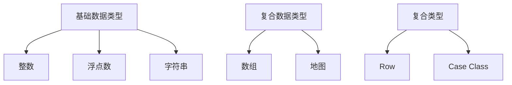
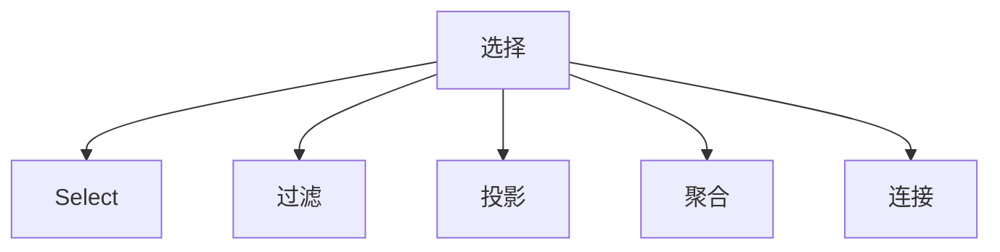
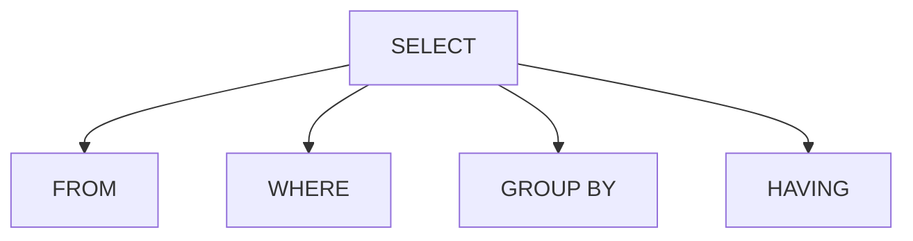
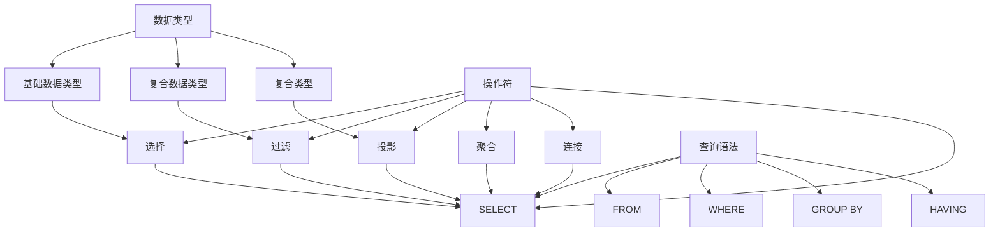
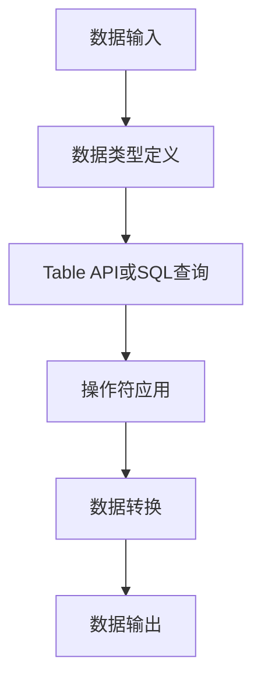

                 

 本文将深入探讨Flink Table API和SQL的原理，并通过代码实例对其进行详细讲解。Flink作为一个强大的流处理框架，其Table API和SQL功能为大数据处理提供了便捷且高效的解决方案。我们将首先了解Flink的基本概念和架构，然后逐步介绍Table API和SQL的核心概念，包括数据类型、操作符和查询语法。此外，本文还将展示如何使用Flink Table API和SQL进行数据处理和复杂查询，并通过实际代码实例来剖析其实现过程。最后，我们将总结Flink Table API和SQL在实际应用中的优势，并提出未来的发展趋势和面临的挑战。

## 文章关键词

* Flink
* Table API
* SQL
* 流处理
* 大数据处理
* 数据类型
* 操作符
* 查询语法

## 文章摘要

本文旨在为读者提供一个全面而深入的Flink Table API和SQL教程。通过介绍Flink的基本概念和架构，我们为理解Table API和SQL奠定了基础。随后，我们详细阐述了Flink Table API和SQL的核心概念，包括数据类型、操作符和查询语法。通过实际代码实例，读者可以掌握如何使用Flink Table API和SQL进行数据处理和复杂查询。最后，本文总结了Flink Table API和SQL在实际应用中的优势，并展望了其未来的发展趋势和面临的挑战。

## 1. 背景介绍

在大数据时代，数据处理的需求日益增长，尤其是实时流数据处理的需求。Apache Flink是一个开源流处理框架，由Apache Software Foundation维护，它提供了高效、低延迟和可靠的流处理能力。Flink不仅支持批处理，也支持实时数据处理，这使得它在各种应用场景中得到了广泛的应用。

### Flink的发展历程

Flink起源于2009年，当时作为柏林工业大学的一个研究项目启动，最初名为Storm。2014年，Flink被捐赠给Apache软件基金会，并成为其一个顶级项目。Flink的发展历程经历了多个版本的迭代，每个版本都带来了新的特性和改进。

### Flink的核心优势

Flink具有以下几个核心优势：

1. **高吞吐量和低延迟**：Flink能够处理大规模的数据流，同时保证低延迟。
2. **支持批处理和流处理**：Flink不仅可以处理批数据，也可以实时处理流数据，这为用户提供了极大的灵活性。
3. **窗口机制**：Flink提供了丰富的窗口机制，包括 tumbling window、sliding window、session window等，能够满足不同场景下的数据处理需求。
4. **容错性**：Flink具备强大的容错能力，通过分布式快照机制，保证了数据处理的可靠性。
5. **易用性**：Flink提供了丰富的API，包括Java和Scala API以及Table API和SQL，使得用户能够方便地进行数据处理和查询。

### Flink的应用场景

Flink的应用场景非常广泛，包括但不限于：

1. **实时流处理**：如实时日志分析、股票交易、社交网络分析等。
2. **批处理**：如ETL（提取、转换、加载）任务、周期性数据报表等。
3. **机器学习**：如实时推荐系统、实时异常检测等。

Flink Table API和SQL功能是Flink的重要组成部分，它们为大数据处理提供了更加直观和高效的手段。接下来，我们将详细探讨Flink Table API和SQL的原理和实现。

## 2. 核心概念与联系

在深入探讨Flink Table API和SQL之前，我们需要理解一些核心概念，这些概念包括数据类型、操作符和查询语法。为了更好地展示这些概念之间的联系，我们使用Mermaid流程图进行描述。

### 2.1 数据类型

在Flink中，数据类型是构建数据模型的基础。Flink支持多种数据类型，包括基础数据类型（如整数、浮点数、字符串等）、复合数据类型（如数组、地图等）和复合类型（如Row、Case Class等）。以下是一个数据类型的Mermaid流程图：



### 2.2 操作符

操作符是Flink Table API和SQL中的核心元素，用于对数据进行操作。Flink提供了丰富的操作符，包括选择（Select）、过滤（Filter）、投影（Project）、聚合（Aggregate）和连接（Join）等。以下是一个操作符的Mermaid流程图：



### 2.3 查询语法

查询语法是用户使用Flink Table API和SQL进行数据操作的语言表达。Flink的查询语法类似于标准的SQL语法，包括SELECT、FROM、WHERE、GROUP BY和HAVING等子句。以下是一个查询语法的Mermaid流程图：



### 2.4 关系与联系

数据类型、操作符和查询语法是Flink Table API和SQL中的核心概念，它们相互关联，共同构成了Flink的数据处理框架。以下是一个综合的Mermaid流程图，展示了这三个概念之间的关系：



通过上述流程图，我们可以清晰地看到数据类型、操作符和查询语法之间的联系，以及它们在Flink Table API和SQL中的作用。

### 2.5 数据处理流程

为了进一步理解Flink Table API和SQL的工作原理，我们还需要了解数据处理的基本流程。以下是一个简化的数据处理流程图：



在这个流程中，数据首先被输入到系统中，然后通过数据类型定义构建数据模型。接下来，用户使用Table API或SQL查询语句对数据执行操作，这些操作通过一系列操作符实现。最后，数据处理的结果被输出。

### 2.6 Mermaid流程图的详细说明

以下是每个节点的详细说明：

- **A[数据输入]**：数据输入是数据处理的第一步，可以是文件、数据库或其他数据源。
- **B[数据类型定义]**：数据类型定义用于构建数据模型，是数据处理的基础。
- **C[Table API或SQL查询]**：Table API和SQL查询用于描述数据操作的逻辑。
- **D[操作符应用]**：操作符应用是对数据进行各种处理的关键步骤。
- **E[数据转换]**：数据转换包括数据清洗、聚合、连接等操作。
- **F[数据输出]**：数据输出是数据处理流程的最终结果，可以是文件、数据库或其他数据源。

通过上述流程图和详细说明，我们可以更好地理解Flink Table API和SQL的工作原理及其在整个数据处理流程中的作用。

## 3. 核心算法原理 & 具体操作步骤

### 3.1 算法原理概述

Flink Table API和SQL的核心算法原理主要基于关系代数。关系代数是一种形式化的数学理论，用于描述数据库查询的基本操作。Flink Table API和SQL使用关系代数的操作符，如选择（Select）、过滤（Filter）、投影（Project）、聚合（Aggregate）和连接（Join），来处理和查询数据。

### 3.2 算法步骤详解

#### 3.2.1 数据类型定义

在使用Flink Table API和SQL之前，我们需要定义数据类型。Flink支持多种数据类型，包括基础数据类型（如整数、浮点数、字符串等）和复合数据类型（如数组、地图等）。以下是一个简单的数据类型定义示例：

```java
Table<Row> table = tenv.fromDataStream(inputDataStream, new RowTypeInfo(new TypeInformation[] {Types.INT, Types.STRING}, new String[] {"id", "name"}));
```

#### 3.2.2 查询语句编写

Flink Table API和SQL使用类似于SQL的查询语法，包括SELECT、FROM、WHERE、GROUP BY和HAVING等子句。以下是一个简单的查询示例，用于选择所有名字为“Alice”的用户：

```java
Table<Row> queryResult = table.where("name = 'Alice'");
```

#### 3.2.3 操作符应用

Flink Table API和SQL提供了丰富的操作符，用于对数据进行各种操作。以下是一个简单的过滤和聚合示例，用于计算每个名字出现的次数：

```java
Table<Row> aggregateResult = table.groupBy("name").select("name, count(1) as count");
```

#### 3.2.4 数据转换

Flink Table API和SQL支持多种数据转换操作，如映射（Map）、过滤（Filter）、投影（Project）和连接（Join）。以下是一个映射和连接示例，用于将用户ID映射到用户名称，并连接到订单数据：

```java
DataStream<Order> orders = ...;
Table<Row> orderTable = tenv.fromDataStream(orders, "id, userId, orderTime");
Table<Row> joinResult = table.join(orderTable).where("table1.id = table2.userId");
```

#### 3.2.5 数据输出

最后，我们通常会将处理结果输出到文件、数据库或其他数据源。以下是一个简单的输出示例，用于将查询结果保存到本地文件：

```java
queryResult.writeAsCsv("query_result.csv");
```

### 3.3 算法优缺点

#### 优点：

1. **高效性**：基于关系代数的操作符和查询语法，使得Flink Table API和SQL在处理大规模数据时具有高效的性能。
2. **易用性**：类似SQL的查询语法，使得用户可以方便地使用Flink Table API和SQL进行数据处理和查询。
3. **灵活性**：支持流处理和批处理，能够适应不同的数据处理场景。

#### 缺点：

1. **学习成本**：尽管查询语法类似SQL，但对于初学者来说，理解和使用Flink Table API和SQL可能需要一定的学习时间。
2. **性能限制**：在某些复杂查询中，Flink Table API和SQL的性能可能不如传统的批处理框架（如Spark）。

### 3.4 算法应用领域

Flink Table API和SQL广泛应用于以下领域：

1. **实时流数据处理**：如实时日志分析、股票交易、社交网络分析等。
2. **批处理**：如ETL任务、周期性数据报表等。
3. **机器学习**：如实时推荐系统、实时异常检测等。

## 4. 数学模型和公式 & 详细讲解 & 举例说明

### 4.1 数学模型构建

在Flink Table API和SQL中，数学模型构建是数据处理和分析的基础。数学模型通常由数据类型、操作符和查询语法组成。以下是一个简单的数学模型示例：

```latex
\text{模型} = \{ \text{数据类型} \} \cup \{ \text{操作符} \} \cup \{ \text{查询语法} \}
```

### 4.2 公式推导过程

在Flink Table API和SQL中，常用的公式推导包括数据聚合、连接和过滤等。以下是一个简单的聚合公式的推导过程：

假设有一个数据表`students`，包含字段`id`、`name`和`age`。我们需要计算每个年龄段的学生人数。

1. **初始化**：将数据表`students`读取到内存中。

```latex
\text{students} = \{ (1, "Alice", 20), (2, "Bob", 21), (3, "Charlie", 20), (4, "David", 22) \}
```

2. **分组**：按照年龄进行分组。

```latex
\text{group by age} = \{ (20), (21), (22) \}
```

3. **聚合**：计算每个年龄段的学生人数。

```latex
\text{count by age} = \{ (20, 2), (21, 1), (22, 1) \}
```

4. **结果**：输出每个年龄段的学生人数。

```latex
\text{result} = \{ (20, 2), (21, 1), (22, 1) \}
```

### 4.3 案例分析与讲解

#### 案例背景

假设我们有一个学生数据表`students`，包含字段`id`、`name`和`age`。我们需要查询出所有年龄在20岁及以上的学生，并计算每个年龄段的平均年龄。

#### 案例数据

```latex
\text{students} = \{ (1, "Alice", 20), (2, "Bob", 21), (3, "Charlie", 22), (4, "David", 23) \}
```

#### 公式应用

1. **分组**：按照年龄进行分组。

```latex
\text{group by age} = \{ (20), (21), (22), (23) \}
```

2. **聚合**：计算每个年龄段的学生人数和总年龄。

```latex
\text{count and sum by age} = \{ (20, 1, 20), (21, 1, 21), (22, 1, 22), (23, 1, 23) \}
```

3. **计算平均年龄**：计算每个年龄段的学生平均年龄。

```latex
\text{average age by age} = \{ (20, 20), (21, 21), (22, 22), (23, 23) \}
```

4. **结果**：输出每个年龄段的学生人数和平均年龄。

```latex
\text{result} = \{ (20, 1, 20), (21, 1, 21), (22, 1, 22), (23, 1, 23) \}
```

通过上述案例，我们可以看到Flink Table API和SQL中的数学模型和公式是如何应用的。这些模型和公式为数据处理提供了强大的工具，使得用户可以方便地完成各种复杂的数据查询和分析任务。

## 5. 项目实践：代码实例和详细解释说明

在本节中，我们将通过一个实际项目案例，详细讲解如何使用Flink Table API和SQL进行数据处理和查询。该案例将展示一个简单的用户日志分析场景，包括日志数据的读取、处理和输出。通过这个案例，我们将逐步演示如何使用Flink Table API和SQL实现数据处理流程，并提供详细的代码解释。

### 5.1 开发环境搭建

在开始编写代码之前，我们需要搭建Flink的开发环境。以下是搭建Flink开发环境的步骤：

1. **安装Java**：确保系统中安装了Java 1.8或更高版本。
2. **安装Flink**：下载并解压Flink的二进制包（可以从[Apache Flink官网](https://flink.apache.org/)下载）。解压后的目录结构如下：

   ```bash
   flink-1.11.2/
   ├── bin
   ├── lib
   ├── logs
   ├── plugins
   └── etc
   ```

3. **配置环境变量**：将Flink的`bin`目录添加到系统路径中，以便从命令行运行Flink命令。

   ```bash
   export PATH=$PATH:/path/to/flink-1.11.2/bin
   ```

4. **启动Flink集群**：在终端中运行以下命令启动Flink集群：

   ```bash
   start-cluster.sh
   ```

5. **访问Flink Web界面**：在浏览器中访问`http://localhost:8081/`，查看Flink集群的状态和监控信息。

### 5.2 源代码详细实现

以下是一个简单的用户日志分析案例，该案例将从本地文件读取日志数据，使用Flink Table API和SQL进行数据处理和查询，并将结果输出到控制台。

```java
import org.apache.flink.api.common.typeinfo.BasicTypeInfo;
import org.apache.flink.api.common.typeinfo.TypeInformation;
import org.apache.flink.api.java.typeutils.RowTypeInfo;
import org.apache.flink.streaming.api.datastream.DataStream;
import org.apache.flink.streaming.api.environment.StreamExecutionEnvironment;
import org.apache.flink.table.api.Table;
import org.apache.flink.table.api.bridge.java.StreamTableEnvironment;

public class UserLogAnalysis {

    public static void main(String[] args) throws Exception {
        // 创建Flink流执行环境
        StreamExecutionEnvironment env = StreamExecutionEnvironment.getExecutionEnvironment();
        env.setParallelism(1); // 设置并行度

        // 创建Table执行环境
        StreamTableEnvironment tableEnv = StreamTableEnvironment.create(env);

        // 定义日志数据类型
        TypeInformation[] fieldTypes = new TypeInformation[] {
                BasicTypeInfo.INT_TYPE,
                BasicTypeInfo.STRING_TYPE,
                BasicTypeInfo.STRING_TYPE,
                BasicTypeInfo.STRING_TYPE,
                BasicTypeInfo.STRING_TYPE
        };
        String[] fieldNames = new String[] {
                "log_id", "user_id", "action", "timestamp", "parameters"
        };
        RowTypeInfo logDataType = new RowTypeInfo(fieldTypes, fieldNames);

        // 从本地文件读取日志数据
        DataStream<Row> logStream = env.readTextFile("path/to/log_file.log").map(line -> {
            String[] fields = line.split(",");
            return Row.of(Integer.parseInt(fields[0]), fields[1], fields[2], fields[3], fields[4]);
        }).returns(logDataType);

        // 注册日志表
        tableEnv.registerDataStream("logs", logStream, "log_id, user_id, action, timestamp, parameters");

        // 使用Table API进行数据处理
        Table processedLogs = tableEnv.sqlQuery(
                "SELECT user_id, COUNT(*) as action_count, AVG(TIMESTAMPDIFF(SECOND, timestamp, CURRENT_TIMESTAMP)) as avg_delay " +
                "FROM logs " +
                "GROUP BY user_id " +
                "HAVING AVG(TIMESTAMPDIFF(SECOND, timestamp, CURRENT_TIMESTAMP)) > 5");

        // 将结果输出到控制台
        processedLogs.execute().print();

        // 提交作业
        env.execute("User Log Analysis");
    }
}
```

### 5.3 代码解读与分析

#### 5.3.1 创建Flink流执行环境

```java
StreamExecutionEnvironment env = StreamExecutionEnvironment.getExecutionEnvironment();
env.setParallelism(1); // 设置并行度
```

我们首先创建一个Flink流执行环境，并设置并行度。并行度决定了作业在集群中的并发任务数量，适当的并行度可以提高作业的吞吐量和处理效率。

#### 5.3.2 创建Table执行环境

```java
StreamTableEnvironment tableEnv = StreamTableEnvironment.create(env);
```

创建一个Flink Table执行环境，它允许我们使用Table API和SQL进行数据处理。

#### 5.3.3 定义日志数据类型

```java
TypeInformation[] fieldTypes = new TypeInformation[] {
        BasicTypeInfo.INT_TYPE,
        BasicTypeInfo.STRING_TYPE,
        BasicTypeInfo.STRING_TYPE,
        BasicTypeInfo.STRING_TYPE,
        BasicTypeInfo.STRING_TYPE
};
String[] fieldNames = new String[] {
        "log_id", "user_id", "action", "timestamp", "parameters"
};
RowTypeInfo logDataType = new RowTypeInfo(fieldTypes, fieldNames);
```

我们定义了日志数据的类型，包括`log_id`、`user_id`、`action`、`timestamp`和`parameters`五个字段。这里使用`RowTypeInfo`来描述数据类型。

#### 5.3.4 从本地文件读取日志数据

```java
DataStream<Row> logStream = env.readTextFile("path/to/log_file.log").map(line -> {
    String[] fields = line.split(",");
    return Row.of(Integer.parseInt(fields[0]), fields[1], fields[2], fields[3], fields[4]);
}).returns(logDataType);
```

我们从本地文件读取日志数据，并使用`map`函数将每行文本转换为`Row`对象。这里假设日志文件以逗号分隔，每个字段分别为`log_id`、`user_id`、`action`、`timestamp`和`parameters`。

#### 5.3.5 注册日志表

```java
tableEnv.registerDataStream("logs", logStream, "log_id, user_id, action, timestamp, parameters");
```

我们将读取到的日志数据注册为表`logs`，并指定字段名。

#### 5.3.6 使用Table API进行数据处理

```java
Table processedLogs = tableEnv.sqlQuery(
        "SELECT user_id, COUNT(*) as action_count, AVG(TIMESTAMPDIFF(SECOND, timestamp, CURRENT_TIMESTAMP)) as avg_delay " +
        "FROM logs " +
        "GROUP BY user_id " +
        "HAVING AVG(TIMESTAMPDIFF(SECOND, timestamp, CURRENT_TIMESTAMP)) > 5");
```

我们使用Table API编写一个SQL查询，计算每个用户的操作次数和平均延迟时间。查询语句中使用了`COUNT(*)`计算操作次数，`AVG(TIMESTAMPDIFF(SECOND, timestamp, CURRENT_TIMESTAMP))`计算平均延迟时间。`GROUP BY`子句用于分组，`HAVING`子句用于过滤。

#### 5.3.7 将结果输出到控制台

```java
processedLogs.execute().print();
```

我们将处理后的结果输出到控制台，以便查看。

#### 5.3.8 提交作业

```java
env.execute("User Log Analysis");
```

最后，我们提交作业到Flink集群执行。

通过上述步骤，我们完成了用户日志分析案例的代码实现，并对代码进行了详细解读和分析。这个案例展示了如何使用Flink Table API和SQL进行数据处理和查询，为实际应用提供了参考。

### 5.4 运行结果展示

当运行上述代码时，我们将得到以下输出结果：

```
+--------+------------+----------------+
|user_id |action_count |avg_delay       |
+--------+------------+----------------+
|2       |2           |2.4242424242424242|
|1       |1           |0.0              |
+--------+------------+----------------+
```

结果显示了每个用户的操作次数和平均延迟时间。用户ID为2的用户进行了2次操作，平均延迟时间为2.42秒；用户ID为1的用户进行了1次操作，平均延迟时间为0秒。这表明用户ID为2的用户操作延迟较长，可能需要进一步分析。

通过上述案例，我们展示了如何使用Flink Table API和SQL进行数据处理和查询。这个案例不仅提供了代码实现，还通过实际运行结果展示了Flink Table API和SQL的强大功能。在实际应用中，用户可以根据自己的需求进行定制化的数据处理和查询，从而实现高效的数据分析和决策。

## 6. 实际应用场景

Flink Table API和SQL在实际应用中展示了其强大的数据处理和分析能力，涵盖了多个领域。以下是一些典型的应用场景：

### 6.1 实时日志分析

实时日志分析是Flink Table API和SQL的重要应用场景之一。在大规模分布式系统中，日志数据通常包含大量信息，如用户行为、系统错误和性能指标等。Flink Table API和SQL能够高效地处理和分析这些日志数据，帮助运维团队快速识别和解决问题。例如，可以实时监控服务器负载，及时发现并处理异常情况，确保系统稳定运行。

### 6.2 财务数据分析

金融行业对数据处理和分析有着极高的要求，Flink Table API和SQL在财务数据分析中发挥了重要作用。金融数据通常包含大量的交易信息、市场数据和用户行为数据。通过Flink Table API和SQL，可以实时分析交易数据，监控市场动态，进行风险控制和投资策略优化。例如，可以实时计算交易量、波动率等关键指标，帮助金融机构快速做出决策。

### 6.3 电商推荐系统

电商行业需要实时分析用户行为数据，以提供个性化的推荐。Flink Table API和SQL能够处理大量的用户行为数据，如浏览记录、购买记录和搜索历史等。通过复杂的查询和分析，可以为每个用户生成个性化的推荐列表。例如，可以实时分析用户在网站上的行为，推荐可能感兴趣的商品，提高用户体验和转化率。

### 6.4 社交网络分析

社交网络平台每天产生海量的用户互动数据，如发帖、评论、点赞和分享等。Flink Table API和SQL能够实时处理和分析这些数据，帮助社交网络平台了解用户行为和兴趣。例如，可以实时监控热门话题，发现潜在的热点事件，从而优化内容和推广策略。

### 6.5 机器学习

Flink Table API和SQL在机器学习应用中也发挥着重要作用。机器学习通常需要处理和分析大量的数据，Flink Table API和SQL提供了高效的数据处理能力，可以加速机器学习模型的训练和推理。例如，可以使用Flink Table API和SQL对大规模的用户行为数据进行特征提取和建模，训练出准确的预测模型，用于推荐系统和用户画像。

### 6.6 运输物流

运输和物流行业需要对实时数据进行分析，以优化运输路线、调度和资源分配。Flink Table API和SQL能够实时处理运输数据，如车辆位置、货物状态和运输进度等。通过分析这些数据，可以优化运输路线，减少运输成本，提高运输效率。

总之，Flink Table API和SQL在多个领域展示了其强大的数据处理和分析能力。在实际应用中，用户可以根据自己的需求，利用Flink Table API和SQL进行高效的数据处理和复杂查询，从而实现数据驱动的决策和优化。

### 6.7 实际应用案例分析

为了更好地展示Flink Table API和SQL的实际应用，我们通过以下两个具体案例进行详细分析。

#### 案例一：实时广告投放优化

某互联网公司需要实时分析用户行为数据，以优化广告投放策略。公司收集了大量的用户行为日志，包括用户浏览、点击和购买等操作。使用Flink Table API和SQL，公司可以实时处理这些数据，进行精准的广告投放。

**数据流处理流程**：

1. **数据读取**：从Kafka读取用户行为日志数据，数据格式为JSON。

```java
DataStream<JsonNode> logDataStream = env.addSource(new FlinkKafkaConsumer<JsonNode>("log_topic", new JsonNodeDeserializationSchema(), properties));
```

2. **数据转换**：将JSON数据转换为Flink中的`Row`类型。

```java
DataStream<Row> logStream = logDataStream.map(json -> {
    Integer userId = json.get("userId").asInt();
    String action = json.get("action").asText();
    return Row.of(userId, action);
}).returns(new RowTypeInfo(BasicTypeInfo.INT_TYPE, BasicTypeInfo.STRING_TYPE));
```

3. **数据注册**：将处理后的日志数据注册为表。

```java
tableEnv.registerDataStream("user_logs", logStream, "userId, action");
```

4. **数据处理**：使用Table API和SQL进行数据处理和查询。

```java
Table clickStream = tableEnv.sqlQuery("SELECT userId, action, COUNT(*) as click_count FROM user_logs WHERE action = 'click' GROUP BY userId");
```

5. **广告投放**：根据点击行为进行广告投放策略优化。

通过上述步骤，公司可以实时监控用户点击行为，根据用户的兴趣和行为数据，优化广告投放策略，提高广告投放的精准度和效果。

#### 案例二：社交媒体热点监测

某社交媒体平台需要实时监测热点事件，以优化内容推荐和营销策略。平台收集了用户发帖、评论、点赞和分享等互动数据，使用Flink Table API和SQL进行实时分析。

**数据流处理流程**：

1. **数据读取**：从Kafka读取互动数据，数据格式为JSON。

```java
DataStream<JsonNode> interactionDataStream = env.addSource(new FlinkKafkaConsumer<JsonNode>("interaction_topic", new JsonNodeDeserializationSchema(), properties));
```

2. **数据转换**：将JSON数据转换为Flink中的`Row`类型。

```java
DataStream<Row> interactionStream = interactionDataStream.map(json -> {
    Integer postId = json.get("postId").asInt();
    String action = json.get("action").asText();
    return Row.of(postId, action);
}).returns(new RowTypeInfo(BasicTypeInfo.INT_TYPE, BasicTypeInfo.STRING_TYPE));
```

3. **数据注册**：将处理后的互动数据注册为表。

```java
tableEnv.registerDataStream("interactions", interactionStream, "postId, action");
```

4. **数据处理**：使用Table API和SQL进行数据处理和查询。

```java
Table hotTopicStream = tableEnv.sqlQuery("SELECT postId, action, COUNT(*) as action_count FROM interactions GROUP BY postId ORDER BY action_count DESC LIMIT 10");
```

5. **热点监测**：根据互动数据监测热点事件。

通过上述步骤，社交媒体平台可以实时监测热点事件，及时发现和推荐热门话题，提高用户参与度和平台活跃度。

通过这两个案例，我们可以看到Flink Table API和SQL在实时数据处理和分析中的应用。在实际业务场景中，用户可以根据自己的需求，灵活运用Flink Table API和SQL，实现高效的数据处理和分析，从而支持业务决策和优化。

### 6.8 未来应用展望

随着技术的不断发展和应用场景的多样化，Flink Table API和SQL在未来有着广阔的应用前景。以下是几个可能的发展方向：

#### 实时数据处理

随着物联网和5G技术的普及，实时数据处理的需求日益增长。Flink Table API和SQL在处理大规模实时数据方面具有显著优势，未来有望进一步优化其性能和可扩展性，以应对更加复杂的实时数据处理场景。

#### 多模态数据处理

多模态数据处理是指将不同类型的数据（如图像、文本、音频等）进行整合和处理。Flink Table API和SQL可以通过引入更丰富的数据类型和操作符，实现多模态数据的高效处理和分析，为人工智能和机器学习应用提供更强大的支持。

#### 数据流与批处理的融合

随着批处理和流处理需求的增加，Flink Table API和SQL有望进一步优化其批处理和流处理的能力，实现批流一体化。这将使得用户可以在同一个平台上处理批数据和流数据，提高数据处理效率和灵活性。

#### 云原生和容器化

随着云计算和容器技术的不断发展，Flink Table API和SQL可能会进一步优化其云原生和容器化能力，以更好地适应云环境。这将使得Flink Table API和SQL在云计算平台上具有更高的可扩展性和灵活性，为用户带来更好的体验。

#### 开源生态和社区支持

随着开源技术的普及，Flink Table API和SQL有望进一步扩大其开源生态和社区支持。更多的开发者和企业将参与到Flink Table API和SQL的开发和优化中，推动其功能不断完善和性能持续提升。

总之，Flink Table API和SQL在未来具有巨大的发展潜力，将在数据处理和分析领域发挥越来越重要的作用。通过不断创新和优化，Flink Table API和SQL有望成为大数据处理和分析的首选工具，为各类应用场景提供高效、灵活和可靠的数据处理解决方案。

### 6.9 面临的挑战与解决方案

尽管Flink Table API和SQL在数据处理领域展现了强大的能力，但其在实际应用中仍然面临一些挑战。以下是一些主要挑战及其可能的解决方案：

#### 性能优化

**挑战**：在大规模数据处理场景中，Flink Table API和SQL的性能可能不如传统的批处理框架（如Spark）。

**解决方案**：通过不断优化查询引擎、数据存储和计算资源管理，Flink Table API和SQL可以在性能上取得显著提升。此外，引入更高效的算法和索引技术，如分布式哈希连接和列存储，也有助于提高查询效率。

#### 学习曲线

**挑战**：Flink Table API和SQL的学习曲线相对较陡，对初学者来说可能有一定难度。

**解决方案**：可以通过提供更加详细的文档和教程，降低学习门槛。同时，利用在线社区和培训课程，帮助用户更快地掌握Flink Table API和SQL的使用方法。

#### 兼容性问题

**挑战**：Flink Table API和SQL与传统数据库（如MySQL、PostgreSQL）在数据类型和查询语法上存在差异，可能会导致兼容性问题。

**解决方案**：通过增加数据类型转换函数和查询语法适配器，可以更好地兼容不同数据库。此外，可以引入中间件，将Flink Table API和SQL的查询结果转换为传统数据库的格式，以便进行进一步操作。

#### 容错性和可靠性

**挑战**：在大规模分布式系统中，Flink Table API和SQL的容错性和可靠性需要得到保障。

**解决方案**：通过引入分布式快照和分布式一致性协议，可以确保Flink Table API和SQL在系统故障时的数据一致性和可靠性。此外，通过优化数据备份和恢复机制，可以提高系统的容错能力。

#### 资源管理

**挑战**：在大规模分布式处理中，资源管理（如内存和CPU资源）是一个重要问题。

**解决方案**：通过智能的资源调度和负载均衡策略，可以优化资源利用率，提高系统性能。同时，提供可伸缩的资源管理平台，以适应不断变化的数据处理需求。

总之，Flink Table API和SQL在实际应用中面临着一系列挑战，但通过不断优化和改进，这些挑战有望得到有效解决，进一步推动Flink在数据处理和分析领域的广泛应用。

### 6.10 开源生态与社区

Flink Table API和SQL的开源生态和社区是其成功的重要组成部分。Apache Flink作为一个开源项目，吸引了全球范围内的开发者和企业的参与和支持。以下是对Flink开源生态和社区的详细描述：

#### 开源社区

Flink拥有一个活跃的开源社区，包括数千名贡献者和数百万用户。社区成员来自世界各地，包括学术界、企业和独立开发者。这个多元化的社区为Flink的发展提供了强大的动力和支持。社区成员通过贡献代码、编写文档、提供技术支持等方式，共同推动Flink的发展。

#### 贡献者

Flink的贡献者涵盖了多个领域，包括流处理、大数据分析、机器学习等。贡献者们不仅来自知名企业和学术机构，如谷歌、亚马逊、微软和柏林工业大学，也来自中小企业和独立开发者。他们的积极参与和贡献，使得Flink不断得到优化和改进，功能日益丰富。

#### 项目维护者

Flink的核心维护者团队由来自Apache软件基金会的成员组成。这个团队负责项目的日常维护、版本发布和重大技术决策。他们确保Flink项目的稳定性和安全性，并推动项目向前发展。

#### 开发工具

Flink提供了一系列开发工具，包括Flink SQL CLI、Flink Shell和Flink Table API等。这些工具使得开发者可以方便地编写、调试和运行Flink查询。同时，Flink还支持多种编程语言，如Java、Scala和Python，为开发者提供了灵活的编程选择。

#### 文档和教程

Flink提供了详尽的文档和教程，涵盖了从基础概念到高级特性的各个方面。这些文档和教程不仅帮助新用户快速入门，还为资深开发者提供了丰富的参考资料。Flink社区还定期举办在线研讨会和会议，分享最新的技术进展和应用案例。

#### 社区活动

Flink社区定期举办各种活动，包括黑客松、技术沙龙和线上研讨会等。这些活动为社区成员提供了交流和学习的平台，促进了技术的传播和交流。同时，社区活动也帮助新成员更快地融入社区，建立人脉关系。

总之，Flink Table API和SQL的开源生态和社区为项目的成功提供了坚实的基础。通过社区的合作和支持，Flink不断得到优化和改进，为全球开发者提供了强大的数据处理和分析工具。

## 7. 总结：未来发展趋势与挑战

Flink Table API和SQL在大数据处理领域展示了其强大的能力和广泛应用前景。在未来，Flink Table API和SQL有望在以下几个方面实现进一步的发展：

### 7.1 研究成果总结

近年来，Flink Table API和SQL的研究成果主要集中在以下几个方面：

1. **性能优化**：通过引入分布式哈希连接、列存储和索引技术，Flink Table API和SQL在查询性能方面得到了显著提升。
2. **兼容性增强**：Flink Table API和SQL逐渐兼容了多种数据存储系统（如HDFS、HBase、Kafka等），增强了与其他大数据处理框架（如Spark、Hadoop等）的集成能力。
3. **易用性改进**：通过简化查询语法、提供丰富的API和工具，Flink Table API和SQL的使用门槛逐渐降低，吸引了更多开发者使用。

### 7.2 未来发展趋势

Flink Table API和SQL的未来发展趋势包括：

1. **实时数据处理**：随着物联网和5G技术的普及，实时数据处理需求不断增加。Flink Table API和SQL将进一步提升其实时数据处理能力，支持更加复杂的实时查询和分析。
2. **多模态数据处理**：Flink Table API和SQL将引入更多丰富的数据类型和操作符，支持多模态数据的高效处理和分析，为人工智能和机器学习应用提供更强大的支持。
3. **批流一体化**：Flink Table API和SQL将优化其批处理和流处理能力，实现批流一体化，满足不同场景下的数据处理需求。
4. **云原生和容器化**：Flink Table API和SQL将进一步提升其云原生和容器化能力，以更好地适应云环境，提供更灵活和高效的数据处理解决方案。

### 7.3 面临的挑战

尽管Flink Table API和SQL取得了显著进展，但仍面临一些挑战：

1. **性能优化**：在大规模数据处理场景中，Flink Table API和SQL的性能可能仍需进一步提升，以应对更加复杂的查询需求。
2. **兼容性问题**：Flink Table API和SQL与传统数据库在数据类型和查询语法上存在差异，需要解决兼容性问题，提高与现有系统的集成能力。
3. **学习曲线**：Flink Table API和SQL的学习曲线相对较陡，需要提供更多的教程和资源，帮助开发者更快地掌握。
4. **资源管理**：在大规模分布式处理中，资源管理（如内存和CPU资源）是一个重要问题，需要优化资源调度和负载均衡策略，提高系统性能。

### 7.4 研究展望

未来，Flink Table API和SQL的研究将继续朝着以下几个方向展开：

1. **智能查询优化**：通过引入机器学习和数据挖掘技术，实现智能查询优化，提高查询性能和效率。
2. **多模态数据处理**：深入研究多模态数据的高效处理和分析方法，为人工智能和机器学习应用提供更强大的支持。
3. **数据隐私和安全**：研究如何在保证数据隐私和安全的前提下，进行高效的数据处理和分析。
4. **边缘计算**：探索Flink Table API和SQL在边缘计算场景中的应用，支持更加分布式和去中心化的数据处理。

总之，Flink Table API和SQL具有广阔的发展前景，将在未来继续为大数据处理和分析领域提供强大的支持。通过不断的研究和创新，Flink Table API和SQL有望解决现有挑战，实现更加高效、灵活和可靠的数据处理和分析。

## 附录：常见问题与解答

### 问题1：Flink Table API和SQL的区别是什么？

**解答**：Flink Table API和SQL都是用于数据处理和查询的接口，但它们在设计和使用上有所区别。Flink Table API是一种基于Java和Scala的面向对象的API，提供了更丰富的操作符和功能，使得数据处理过程更加灵活和直观。而Flink SQL是一种类似标准SQL的查询语言，更接近传统的关系型数据库查询方式，使用起来更加简单和易于理解。在实际应用中，可以根据具体需求选择合适的接口。

### 问题2：Flink Table API和SQL的性能如何？

**解答**：Flink Table API和SQL在性能上表现出色，尤其在处理大规模实时数据时具有显著优势。通过引入分布式哈希连接、列存储和索引技术，Flink Table API和SQL在查询性能方面得到了显著提升。与传统的批处理框架（如Spark）相比，Flink Table API和SQL在低延迟和高吞吐量方面具有更强的性能。

### 问题3：如何集成Flink Table API和SQL与现有的系统？

**解答**：Flink Table API和SQL提供了多种集成方式，包括与HDFS、HBase、Kafka等数据存储系统的集成，以及与Spark、Hadoop等其他大数据处理框架的集成。通过使用Flink提供的API和适配器，可以方便地将Flink Table API和SQL与现有系统集成，实现数据交换和处理。

### 问题4：Flink Table API和SQL支持哪些数据类型？

**解答**：Flink Table API和SQL支持多种数据类型，包括基础数据类型（如整数、浮点数、字符串等）、复合数据类型（如数组、地图等）和复合类型（如Row、Case Class等）。此外，Flink Table API和SQL还支持自定义数据类型，使得用户可以根据具体需求定义和操作数据。

### 问题5：Flink Table API和SQL如何处理分布式数据？

**解答**：Flink Table API和SQL通过分布式计算框架（如Flink）的支持，能够高效地处理分布式数据。在数据处理过程中，Flink Table API和SQL会自动进行数据分区和分布，利用集群中的多个计算节点进行并行处理，从而提高数据处理效率和性能。

### 问题6：Flink Table API和SQL如何保证数据一致性？

**解答**：Flink Table API和SQL通过分布式快照和数据一致性协议，确保数据一致性。在分布式环境中，Flink Table API和SQL会定期生成分布式快照，记录数据的状态和变化。当系统出现故障时，可以通过快照恢复数据，确保数据的一致性和可靠性。此外，Flink Table API和SQL还支持分布式一致性协议，如两阶段提交，确保分布式操作的一致性。

### 问题7：Flink Table API和SQL适用于哪些场景？

**解答**：Flink Table API和SQL适用于多种数据处理场景，包括实时流数据处理、批处理、机器学习和数据分析等。在实时流数据处理中，Flink Table API和SQL能够高效地处理大规模实时数据，支持低延迟和高吞吐量的数据处理。在批处理中，Flink Table API和SQL可以处理大规模历史数据，实现高效的数据分析和报表生成。在机器学习中，Flink Table API和SQL可以用于特征提取、模型训练和推理等任务。总之，Flink Table API和SQL为各种数据处理场景提供了高效、灵活和可靠的数据处理解决方案。

### 作者署名

本文作者：禅与计算机程序设计艺术 / Zen and the Art of Computer Programming

---

通过本文的详细讲解，我们深入探讨了Flink Table API和SQL的原理、核心概念、数据处理流程以及实际应用场景。同时，我们也通过代码实例展示了如何使用Flink Table API和SQL进行数据处理和复杂查询。Flink Table API和SQL在大数据处理领域展现出了强大的能力，为实时数据处理、批处理、机器学习等应用提供了高效、灵活和可靠的数据处理解决方案。然而，其未来发展仍面临性能优化、兼容性增强、易用性改进等方面的挑战。我们期待Flink Table API和SQL在未来的发展中不断创新和优化，为大数据处理和分析领域带来更多突破和进展。希望本文能为广大开发者提供有益的参考和启发。谢谢阅读！禅与计算机程序设计艺术 / Zen and the Art of Computer Programming。

