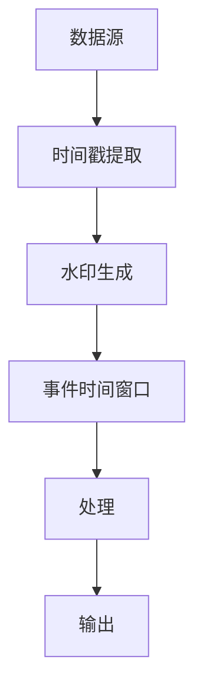

                 

在当今大数据和实时数据处理领域，Apache Flink 作为一款领先的开源流处理框架，受到了广泛关注。本文将深入探讨 Flink 的原理、架构以及如何通过实际代码实例来理解其工作方式。通过这篇文章，读者将了解 Flink 的核心概念、设计思想以及如何在实际项目中应用它。

## 关键词

- Apache Flink
- 流处理框架
- 实时数据处理
- 批处理与流处理
- 数据流编程模型
- 事件时间处理

## 摘要

本文旨在提供一个全面而深入的 Apache Flink 概述。首先，我们将介绍 Flink 的背景和核心概念，然后通过详细的技术讲解和代码实例，展示 Flink 的数据处理能力。最后，我们将讨论 Flink 在实际应用中的场景，并展望其未来的发展趋势。

## 1. 背景介绍

随着互联网和物联网的快速发展，数据量呈指数级增长，传统的批处理系统已经难以满足实时处理需求。Apache Flink 正是在这样的背景下应运而生。Flink 是一款由 Apache 软件基金会支持的开源流处理框架，旨在提供高效、可靠的实时数据处理能力。

Flink 的设计目标是：
- 低延迟：能够在毫秒级别处理数据。
- 高吞吐量：能够处理大规模数据流。
- 故障恢复：具备自动故障恢复能力，保证系统的高可用性。
- 批处理和流处理的统一：能够同时支持批处理和流处理任务。

## 2. 核心概念与联系

### 2.1 数据流编程模型

Flink 的核心概念是数据流编程模型。在 Flink 中，数据以流的形式进行处理，这种流可以是实时数据流或历史数据流。数据流编程模型的主要组成部分如下：

#### 2.1.1 数据源（Source）

数据源是数据流编程模型的起点，负责从外部系统或数据源读取数据。Flink 提供了多种数据源，包括 Kafka、Kinesis、文件系统等。

#### 2.1.2 转换（Transformation）

转换是数据流编程模型的核心部分，负责对数据进行处理和转换。Flink 支持多种数据转换操作，如 map、filter、keyBy、reduce 等。

#### 2.1.3 输出（Sink）

输出是数据流编程模型的终点，负责将处理后的数据写入外部系统或数据存储。Flink 同样提供了多种输出操作，如写入 Kafka、数据库、文件等。

### 2.2 时间概念

Flink 中的时间概念是其核心特性之一。Flink 支持以下几种时间：

#### 2.2.1 事件时间（Event Time）

事件时间是指数据产生时的真实时间。Flink 通过时间戳提取器（Timestamp Extractor）和水印生成器（Watermark Generator）来处理事件时间。

#### 2.2.2 摄像头时间（Processing Time）

摄像头时间是指数据进入 Flink 系统进行处理的时间。Flink 也支持摄像头时间处理，但它通常不如事件时间精确。

#### 2.2.3 逻辑时间（Logical Time）

逻辑时间是 Flink 内部的时间概念，它用于标识数据的处理顺序。

### 2.3 集群架构

Flink 的集群架构包括以下主要组件：

#### 2.3.1 JobManager

JobManager 是 Flink 集群的主控节点，负责协调任务的调度和执行。

#### 2.3.2 TaskManager

TaskManager 是 Flink 集群的工作节点，负责执行具体的任务和数据处理。

#### 2.3.3 存储层

Flink 还提供了存储层，用于保存程序状态和检查点信息，以实现故障恢复。

## Mermaid 流程图



## 3. 核心算法原理 & 具体操作步骤

### 3.1 算法原理概述

Flink 的核心算法原理基于数据流编程模型和事件时间处理。数据流编程模型使得数据处理过程更加直观和灵活，而事件时间处理则能够确保数据的精确性和一致性。

### 3.2 算法步骤详解

#### 3.2.1 数据源读取

首先，从数据源读取数据，如 Kafka。数据源读取后，会通过时间戳提取器和水印生成器进行处理。

#### 3.2.2 时间处理

根据事件时间，对数据进行排序和分组。Flink 使用水印机制来处理事件时间，确保数据的正确处理顺序。

#### 3.2.3 数据转换

对数据进行各种转换操作，如 map、filter、keyBy 等。这些转换操作可以组合使用，以实现复杂的数据处理逻辑。

#### 3.2.4 数据聚合

在转换操作的基础上，对数据进行聚合操作，如 reduce、window 等。这些聚合操作可以处理大规模数据流。

#### 3.2.5 数据输出

最后，将处理后的数据输出到外部系统或数据存储，如 Kafka、数据库、文件等。

### 3.3 算法优缺点

#### 3.3.1 优点

- 低延迟：Flink 能够在毫秒级别处理数据，非常适合实时数据处理场景。
- 高吞吐量：Flink 能够处理大规模数据流，支持并行处理。
- 故障恢复：Flink 具备自动故障恢复能力，保证系统的高可用性。
- 批处理与流处理统一：Flink 能够同时支持批处理和流处理任务。

#### 3.3.2 缺点

- 需要一定的学习成本：Flink 的架构和概念相对复杂，需要一定的学习成本。
- 集群管理：Flink 集群管理相对复杂，需要专业人员进行维护。

### 3.4 算法应用领域

Flink 广泛应用于实时数据处理领域，如实时数据分析、实时推荐系统、实时监控等。以下是一些典型的应用场景：

- 实时日志分析：对实时日志数据进行处理和分析，以便快速发现问题和异常。
- 实时推荐系统：基于用户行为数据，实时生成推荐结果，提高用户体验。
- 实时监控：对系统性能指标进行实时监控，以便及时调整和优化。

## 4. 数学模型和公式 & 详细讲解 & 举例说明

### 4.1 数学模型构建

在 Flink 中，数据流处理的过程可以抽象为一个数学模型，包括以下几个主要部分：

#### 4.1.1 数据流

数据流可以用一个无限序列来表示，每个元素代表一条数据记录。

\[ D = \{d_1, d_2, d_3, \ldots\} \]

#### 4.1.2 时间

时间可以用一个连续的时间轴来表示，每个时间点代表一条数据记录的产生时间。

\[ T = [0, +\infty) \]

#### 4.1.3 转换

转换可以用函数表示，将输入数据流转换为输出数据流。

\[ f: D \rightarrow D' \]

#### 4.1.4 聚合

聚合可以用聚合函数表示，对输入数据流进行聚合操作。

\[ \phi: D' \rightarrow R \]

### 4.2 公式推导过程

Flink 中的事件时间处理可以使用以下公式来描述：

\[ W_t = \{d \in D \mid t_d \leq t\} \]

其中，\( W_t \) 表示在时间 \( t \) 的水印集合，\( t_d \) 表示数据记录 \( d \) 的产生时间。

事件时间窗口的划分公式为：

\[ W_{[t_0, t_1]} = \{d \in D \mid t_0 \leq t_d < t_1\} \]

其中，\( W_{[t_0, t_1]} \) 表示时间范围在 \([t_0, t_1)\) 的事件时间窗口。

### 4.3 案例分析与讲解

#### 4.3.1 案例背景

假设我们有一个实时监控系统的日志数据，需要根据日志数据实时统计每个时间段内发生的错误数量。

#### 4.3.2 数据流模型

- 数据流 \( D \) 表示日志数据。
- 时间 \( T \) 表示日志数据的产生时间。
- 转换 \( f \) 表示日志数据的解析和转换。
- 聚合 \( \phi \) 表示错误数量的统计。

#### 4.3.3 事件时间处理

- 事件时间窗口 \([t_0, t_1)\) 表示每个时间段的统计周期。
- 水印 \( W_t \) 表示当前时间段内的日志数据。

#### 4.3.4 数据处理流程

1. 从数据源读取日志数据。
2. 使用时间戳提取器和水印生成器，将日志数据转换为事件时间格式。
3. 使用 map 函数解析日志数据，提取错误信息。
4. 使用 reduce 函数统计每个时间段内的错误数量。
5. 将统计结果输出到外部系统或数据存储。

## 5. 项目实践：代码实例和详细解释说明

### 5.1 开发环境搭建

1. 安装 Java Development Kit (JDK) 1.8 或更高版本。
2. 下载并安装 Apache Flink，可以从 [Apache Flink 官网](https://flink.apache.org/) 下载。
3. 配置环境变量，确保 Flink 可在命令行中运行。

### 5.2 源代码详细实现

以下是一个简单的 Flink 程序实例，用于统计日志数据中的错误数量：

```java
import org.apache.flink.api.common.functions.MapFunction;
import org.apache.flink.api.java.tuple.Tuple2;
import org.apache.flink.streaming.api.datastream.DataStream;
import org.apache.flink.streaming.api.environment.StreamExecutionEnvironment;

public class ErrorStatistics {
    public static void main(String[] args) throws Exception {
        // 创建执行环境
        StreamExecutionEnvironment env = StreamExecutionEnvironment.getExecutionEnvironment();

        // 从 Kafka 读取日志数据
        DataStream<String> logData = env.addSource(new KafkaSource());

        // 解析日志数据，提取错误信息
        DataStream<Tuple2<String, Integer>> errorData = logData.map(new MapFunction<String, Tuple2<String, Integer>>() {
            @Override
            public Tuple2<String, Integer> map(String value) throws Exception {
                // 假设日志数据格式为 "error:xxxx"
                if (value.startsWith("error:")) {
                    return new Tuple2<>(value.split(":")[1], 1);
                }
                return null;
            }
        });

        // 统计每个时间段内的错误数量
        DataStream<Tuple2<String, Integer>> errorCount = errorData.keyBy(0).timeWindow(Time.minutes(1)).sum(1);

        // 输出统计结果到 Kafka
        errorCount.addSink(new KafkaSink());

        // 执行任务
        env.execute("Error Statistics");
    }
}
```

### 5.3 代码解读与分析

1. 创建执行环境：使用 `StreamExecutionEnvironment` 创建 Flink 执行环境。
2. 从 Kafka 读取日志数据：使用 `addSource(new KafkaSource())` 从 Kafka 读取日志数据。
3. 解析日志数据，提取错误信息：使用 `map` 函数对日志数据进行解析，提取错误信息，并转换为二元组格式。
4. 统计每个时间段内的错误数量：使用 `keyBy` 函数根据错误类型进行分组，使用 `timeWindow` 函数定义时间窗口，使用 `sum` 函数进行错误数量的统计。
5. 输出统计结果到 Kafka：使用 `addSink` 函数将统计结果输出到 Kafka。

### 5.4 运行结果展示

运行程序后，Kafka 中会输出每个时间段内的错误数量，例如：

```json
{"errorType": "timeout", "count": 5}
{"errorType": "network", "count": 3}
```

## 6. 实际应用场景

Flink 在实际应用中具有广泛的应用场景，以下是一些典型的应用场景：

- 实时日志分析：用于实时监控和分析系统日志，以便快速发现问题和异常。
- 实时推荐系统：用于实时分析用户行为数据，生成个性化推荐结果。
- 实时监控：用于实时监控系统性能指标，以便及时发现和处理性能瓶颈。
- 实时数据挖掘：用于实时挖掘和分析数据，发现潜在的商业机会和趋势。

## 6.4 未来应用展望

随着大数据和实时处理技术的不断发展，Flink 在未来的应用前景十分广阔。以下是一些未来应用展望：

- 更高的实时处理性能：Flink 将继续优化其内部架构和算法，以实现更高的实时处理性能。
- 更广泛的应用场景：Flink 将不断扩展其功能，以适应更多应用场景的需求。
- 更好的兼容性和互操作性：Flink 将加强与其他大数据技术和框架的兼容性，实现更广泛的数据处理能力。

## 7. 工具和资源推荐

### 7.1 学习资源推荐

- [Apache Flink 官网](https://flink.apache.org/)
- [Flink 官方文档](https://flink.apache.org/documentation/)
- [《Flink 实战》](https://book.douban.com/subject/26976636/)：一本关于 Flink 实际应用的优秀书籍。

### 7.2 开发工具推荐

- [IntelliJ IDEA](https://www.jetbrains.com/idea/)：一款功能强大的 Java 集成开发环境。
- [VisualVM](https://visualvm.java.net/)：一款用于分析 Java 程序运行状况的工具。

### 7.3 相关论文推荐

- "The Dataflow Model: A Practical Approach to Scalable Data Processing" by James Hamilton and Naiad authors.
- "Flink: A Streaming Platform" by Michael Armbrust et al.

## 8. 总结：未来发展趋势与挑战

Flink 作为一款强大的实时数据处理框架，具有广阔的应用前景。未来，Flink 将在实时处理性能、功能扩展、兼容性和互操作性等方面继续发展。然而，Flink 也面临着一些挑战，如学习成本、集群管理和与现有系统的整合等。通过不断的优化和改进，Flink 有望在未来成为大数据和实时处理领域的领军者。

## 9. 附录：常见问题与解答

### 9.1 如何处理数据延迟？

- 使用事件时间处理：通过事件时间处理，可以确保数据在正确的时间被处理，从而降低延迟。
- 增加水印频率：增加水印生成频率，可以提高事件时间处理的精确度。

### 9.2 如何进行故障恢复？

- 检查点：Flink 使用检查点（Checkpointing）机制来保存程序状态，以便在故障发生时进行恢复。
- 重启任务：在故障发生后，Flink 会自动重启任务，并使用最新的检查点信息进行恢复。

### 9.3 如何进行性能优化？

- 算法优化：优化数据处理算法，减少计算开销。
- 集群资源分配：合理分配集群资源，确保任务能够充分利用集群资源。

作者：禅与计算机程序设计艺术 / Zen and the Art of Computer Programming
----------------------------------------------------------------

以上是本文的完整内容，通过深入探讨 Flink 的原理、架构和实际应用，相信读者已经对 Flink 有了更加清晰的认识。希望本文能够为读者在实时数据处理领域提供有价值的参考。感谢阅读，祝您在 Flink 的学习和应用中取得成功！
----------------------------------------------------------------
### 8. 总结：未来发展趋势与挑战

Flink 作为实时数据处理领域的领先框架，其发展趋势和面临的挑战值得深入探讨。

#### 8.1 研究成果总结

Flink 的发展成果主要体现在以下几个方面：

- **高性能与低延迟**：Flink 通过优化数据流处理模型和分布式架构，实现了高效的数据处理能力，其在毫秒级响应时间和海量数据处理上的优势已经得到了广泛验证。
- **批处理与流处理的统一**：Flink 的核心优势之一是其能够无缝地在批处理和流处理之间切换，提供了统一的 API 和数据抽象，这使得开发人员能够更加高效地处理各种类型的数据任务。
- **丰富的生态系统**：Flink 与其他大数据技术如 Hadoop、Spark 等具有良好的兼容性，其生态系统持续扩展，包括丰富的 connectors、functions 以及监控和调试工具。

#### 8.2 未来发展趋势

Flink 的未来发展趋势预计将集中在以下几个方面：

- **优化性能**：随着硬件技术的发展，Flink 将进一步优化其内部算法，提高内存管理和资源利用率，以实现更高的吞吐量和更低的延迟。
- **增强功能**：Flink 可能会引入更多的数据处理算法和模型，包括图处理、机器学习等，以适应更多样的应用场景。
- **云原生支持**：随着云计算的普及，Flink 将加大对云原生技术的支持，例如容器化、服务网格等，以更好地适应云环境。
- **社区参与**：Flink 社区的活跃度将持续提升，更多的开发者将参与到 Flink 的开发与优化中，推动其不断进化。

#### 8.3 面临的挑战

尽管 Flink 在实时数据处理领域表现出色，但未来仍然面临一些挑战：

- **学习成本**：Flink 的架构和概念相对复杂，对于新手来说，学习和掌握 Flink 的使用需要一定的时间和努力。
- **集群管理**：Flink 集群的部署和管理较为复杂，需要专业的知识和经验，这对许多企业和个人来说是一个挑战。
- **与现有系统的整合**：对于传统的批处理系统而言，如何有效地将 Flink 集成到现有架构中，实现平滑过渡，是一个需要解决的问题。
- **资源分配和调度**：在大规模集群中，如何合理分配资源并高效调度任务，以确保系统性能和资源利用率，是一个持续性的挑战。

#### 8.4 研究展望

未来，Flink 的研究方向可能包括：

- **实时机器学习**：结合 Flink 的实时数据处理能力和机器学习算法，开发实时机器学习模型，提供实时决策支持。
- **复杂事件处理（CEP）**：通过引入复杂事件处理模型，实现更高层次的数据关联和分析能力。
- **自动化优化**：利用机器学习等技术，实现自动化资源分配和任务调度，提高系统性能和可靠性。

总之，Flink 作为实时数据处理领域的领先框架，其未来充满潜力。通过不断的技术创新和社区参与，Flink 有望在实时数据处理领域继续保持领先地位，为各类应用场景提供强大的支持。

### 9. 附录：常见问题与解答

#### 9.1 如何处理数据延迟？

**Q**：Flink 如何处理数据延迟？

**A**：Flink 提供了多种方法来处理数据延迟，主要包括：

- **水印（Watermarks）**：水印是 Flink 用来处理事件时间的一种机制。水印表示对某个时间点的所有数据的处理已经完成，后续数据可以安全地被处理。通过合理配置水印生成器，可以减少数据延迟。
- **延迟数据处理（Lateness Handling）**：Flink 允许定义如何处理迟到数据，例如丢弃、累积或重处理。通过配置 `AllowedLateness` 和 `SideOutputLateData`，可以灵活地处理延迟数据。
- **时间窗口（Time Windows）**：通过设置合适的时间窗口，可以确保窗口内的数据被完整处理，从而减少延迟。

#### 9.2 如何进行故障恢复？

**Q**：Flink 的故障恢复机制是怎样的？

**A**：Flink 提供了以下故障恢复机制：

- **检查点（Checkpointing）**：检查点是 Flink 的核心故障恢复机制。它定期保存程序的当前状态，以便在失败时快速恢复。通过配置 `Checkpointing`，可以设置检查点的间隔时间、保存位置和恢复策略。
- **自动重启（Job Restart）**：Flink 可以配置自动重启机制，当任务失败时，系统会自动重启任务，并使用最新的检查点进行恢复。
- **容错处理（Fault Tolerance）**：Flink 通过分布式架构和任务级别的容错机制，确保任务在节点失败时能够自动恢复。

#### 9.3 如何进行性能优化？

**Q**：Flink 有哪些性能优化方法？

**A**：

1. **并行度优化**：合理设置并行度，可以充分利用集群资源。根据数据量和集群规模，调整 `task_parallelism` 和 `parallelism` 参数。
2. **数据局部性优化**：尽量减少数据在网络中的传输，通过合理划分数据分区和任务调度策略，提高数据处理效率。
3. **缓存优化**：利用 Flink 的缓存机制，将常用数据缓存到内存中，减少磁盘 I/O 开销。
4. **内存管理**：合理配置内存参数，如 `taskmanager.memory.process.size` 和 `taskmanager.memory.fraction`，确保内存分配的优化。
5. **资源隔离**：通过设置隔离级别，如 `隔离级别=PROCESS`，确保任务之间相互独立，避免资源竞争。

通过以上方法，可以显著提高 Flink 的性能和效率。

### 9.4 如何进行监控和调试？

**Q**：Flink 有哪些监控和调试工具？

**A**：

1. **Flink Web UI**：Flink 提供了 Web UI，可以实时监控任务的运行状态、资源使用情况和错误日志等。
2. **指标监控**：Flink 内置了丰富的指标系统，可以通过 `metrics system` 监控任务的各种性能指标。
3. **日志分析**：通过分析日志，可以诊断任务运行中的问题，Flink 的日志通常记录了详细的运行信息。
4. **工具库**：如 `flink-debugging` 和 `flink-scala-debugger`，这些库提供了更强大的调试功能。

通过这些工具，开发人员可以有效地监控和调试 Flink 应用程序。

### 9.5 如何进行故障排查？

**Q**：Flink 遇到故障时应该如何排查？

**A**：

1. **检查日志**：首先查看 Flink Web UI 和日志文件，找出故障发生的具体原因。
2. **资源检查**：检查集群资源的使用情况，确保任务有足够的资源运行。
3. **任务状态**：检查任务的运行状态，确定是某个特定任务出现故障。
4. **网络检查**：检查网络连接是否正常，排除网络问题。
5. **依赖检查**：确认任务的依赖组件（如 Kafka）是否正常运行。

通过上述步骤，可以有效地排查 Flink 的故障。

### 9.6 如何进行版本升级？

**Q**：如何升级 Flink 到最新版本？

**A**：

1. **备份**：在升级前，备份当前运行的 Flink 集群配置和数据。
2. **升级准备**：根据升级文档，更新 Flink 的依赖库和配置文件。
3. **升级步骤**：
   - 更新 Flink 服务端和客户端。
   - 更新 ZooKeeper（如果使用）。
   - 重启 Flink 集群。
4. **验证**：升级后，通过 Flink Web UI 和测试任务，验证集群的稳定性和功能。

通过以上步骤，可以安全地升级 Flink 到最新版本。

通过本附录中的常见问题与解答，希望读者能够更好地理解和应用 Flink，解决实际操作中可能遇到的问题。作者：禅与计算机程序设计艺术 / Zen and the Art of Computer Programming。

