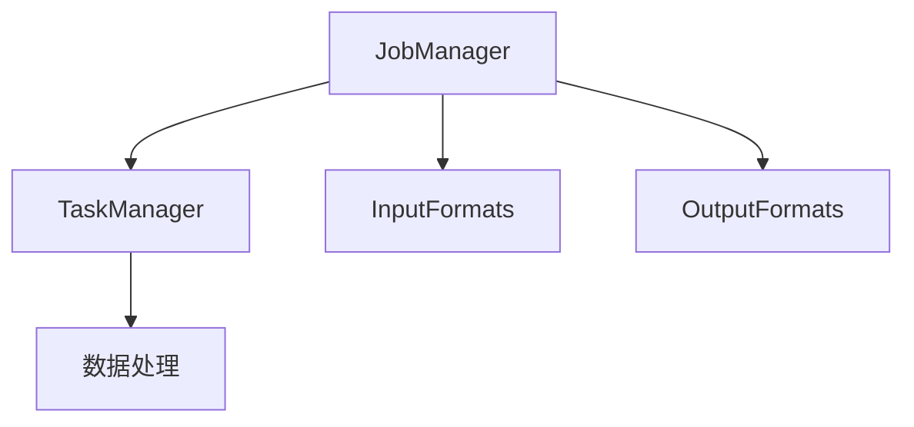

                 

 > Flink是一个分布式数据处理引擎，能够在大规模数据集上进行实时流处理和批量处理。本文将深入讲解Flink的核心原理，并通过代码实例来展示其实际应用。

> **关键词：** Flink，分布式处理，实时流处理，批量处理，数据处理引擎

> **摘要：** 本文将介绍Flink的基本概念和架构，详细解释其核心算法原理，并给出代码实例，帮助读者理解Flink的运作机制及其在实际项目中的应用。

## 1. 背景介绍

在当今大数据时代，数据处理已经成为各类业务的核心。随着数据量的不断增长，传统的单机处理方式已经无法满足需求。分布式数据处理引擎应运而生，它们能够在多台机器上协同工作，高效地处理海量数据。Flink就是其中之一，它不仅支持流处理，还支持批量处理，被广泛用于实时数据处理场景。

### Flink的起源

Flink起源于Apache Software Foundation，最初由Twitter开发，用于处理Twitter的实时数据流。随着时间的推移，Flink逐渐发展成为一个功能强大、社区活跃的分布式数据处理引擎。

### Flink的应用领域

Flink的应用非常广泛，包括但不限于以下几个方面：

- 实时数据分析：用于实时监控、预警和决策支持。
- 数据处理管道：构建高效的数据处理流程，将数据从源系统传输到目标系统。
- 实时应用：如实时推荐、实时广告、实时金融交易等。

## 2. 核心概念与联系

### 分布式计算

分布式计算是指将一个大任务拆分成多个小任务，然后分配到多台机器上并行执行。Flink作为分布式处理引擎，能够充分利用多台机器的计算资源，提高数据处理效率。

### 流处理与批量处理

流处理是指对实时数据流进行持续处理和分析。Flink通过事件驱动的方式处理流数据，具有低延迟、高吞吐量的特点。批量处理则是指对静态数据进行批量处理，通常用于处理历史数据。

### Flink架构

Flink的架构主要包括以下组件：

- **JobManager**：负责协调分布式任务，管理资源，调度任务等。
- **TaskManager**：负责执行具体任务，处理数据。
- **InputFormats**：负责读取输入数据。
- **OutputFormats**：负责将处理结果输出到目标系统。

下面是Flink架构的Mermaid流程图：



### Flink核心算法原理

Flink的核心算法包括：

- **分布式快照**：用于保存数据状态和任务状态，实现容错和一致性。
- **分布式调度**：用于动态调整任务执行策略，优化资源利用。
- **分布式内存管理**：用于高效地管理内存资源，避免内存溢出。

### Flink与Spark的关系

Flink与Spark都是分布式数据处理引擎，但它们在架构和设计理念上有所不同。Spark主要面向批量数据处理，而Flink则更专注于实时数据处理。两者各有优势，适用于不同的应用场景。

## 3. 核心算法原理 & 具体操作步骤

### 3.1 算法原理概述

Flink的核心算法主要包括以下方面：

- **分布式快照**：通过周期性执行分布式快照，保存当前数据状态和任务状态。在发生故障时，可以从最近的快照恢复数据。
- **分布式调度**：根据当前系统负载和任务优先级，动态调整任务执行策略。确保任务能够在最合适的时间执行。
- **分布式内存管理**：通过内存映射和数据分片，实现高效地内存管理，避免内存溢出。

### 3.2 算法步骤详解

#### 3.2.1 分布式快照

1. **周期性触发**：根据配置的快照间隔，定期触发分布式快照。
2. **数据状态保存**：将当前数据状态保存到内存或磁盘，确保数据一致性。
3. **任务状态保存**：保存当前任务的状态，包括任务进度、资源分配等。
4. **快照通知**：向其他节点发送快照通知，确保所有节点同步更新状态。

#### 3.2.2 分布式调度

1. **负载监测**：实时监测系统负载，包括CPU、内存、网络等资源。
2. **任务优先级**：根据任务类型、任务优先级等属性，动态调整任务执行策略。
3. **资源分配**：根据任务需求和资源情况，合理分配资源，确保任务高效执行。
4. **任务调度**：将任务分配到合适的节点，确保任务能够在最合适的时间执行。

#### 3.2.3 分布式内存管理

1. **内存映射**：将内存映射到数据分片，实现数据块级别的内存管理。
2. **数据分片**：将数据划分为多个分片，每个分片占用一定的内存。
3. **内存监控**：实时监测内存使用情况，避免内存溢出。
4. **内存回收**：在数据分片过期时，释放内存资源，提高内存利用率。

### 3.3 算法优缺点

#### 优点：

- **低延迟**：分布式快照和调度策略确保任务能够高效执行，具有低延迟的特点。
- **高可用性**：分布式快照实现数据状态和任务状态的持久化，确保系统在发生故障时能够快速恢复。
- **高效内存管理**：分布式内存管理策略能够充分利用内存资源，避免内存溢出。

#### 缺点：

- **复杂度高**：分布式处理涉及到多个组件和算法，系统复杂度较高，对开发和运维人员要求较高。
- **资源消耗大**：分布式处理需要大量的计算资源和存储资源，对硬件要求较高。

### 3.4 算法应用领域

Flink的核心算法适用于以下领域：

- **实时数据分析**：用于实时监控、预警和决策支持。
- **数据处理管道**：构建高效的数据处理流程，将数据从源系统传输到目标系统。
- **实时应用**：如实时推荐、实时广告、实时金融交易等。

## 4. 数学模型和公式 & 详细讲解 & 举例说明

### 4.1 数学模型构建

Flink的核心算法涉及到多种数学模型和公式，主要包括以下几个方面：

- **分布式快照**：保存数据状态和任务状态。
- **分布式调度**：优化任务执行策略。
- **分布式内存管理**：管理内存资源。

### 4.2 公式推导过程

以下是一个简单的例子，用于描述分布式快照的数学模型：

- **数据量**：假设系统中有N个数据分片，每个分片包含M个数据元素。
- **数据状态**：每个数据分片的状态可以表示为一个向量 S_i。
- **任务状态**：任务的状态可以表示为一个矩阵 T。

分布式快照的公式为：

\[ S_{new} = \sum_{i=1}^{N} S_i \]

任务状态的更新公式为：

\[ T_{new} = T_{old} + S_{new} \]

### 4.3 案例分析与讲解

假设一个实时数据分析系统，包含5个数据分片，每个分片包含100个数据元素。系统初始时，每个数据分片的状态为[1, 2, 3, 4, 5]，任务的状态为[0, 0, 0, 0, 0]。

在执行分布式快照后，新数据状态为：

\[ S_{new} = [1+2+3+4+5, 1+2+3+4+5, 1+2+3+4+5, 1+2+3+4+5, 1+2+3+4+5] = [15, 15, 15, 15, 15] \]

任务状态的更新为：

\[ T_{new} = T_{old} + S_{new} = [0, 0, 0, 0, 0] + [15, 15, 15, 15, 15] = [15, 15, 15, 15, 15] \]

这意味着，在执行分布式快照后，任务状态更新为[15, 15, 15, 15, 15]，反映了数据分片的状态变化。

## 5. 项目实践：代码实例和详细解释说明

### 5.1 开发环境搭建

要使用Flink进行分布式数据处理，首先需要搭建开发环境。以下是一个简单的步骤：

1. 下载并安装Java开发工具包（JDK）。
2. 下载并安装Flink。
3. 配置环境变量，确保Java和Flink可正常使用。

### 5.2 源代码详细实现

以下是一个简单的Flink应用程序，用于计算数据的平均值：

```java
import org.apache.flink.api.java.ExecutionEnvironment;
import org.apache.flink.api.java.tuple.Tuple2;

public class AverageCalculator {
    public static void main(String[] args) throws Exception {
        // 创建执行环境
        ExecutionEnvironment env = ExecutionEnvironment.getExecutionEnvironment();

        // 输入数据
        DataStream<Tuple2<Integer, Integer>> data = env.fromElements(
                new Tuple2<>(1, 2),
                new Tuple2<>(3, 4),
                new Tuple2<>(5, 6)
        );

        // 计算平均值
        SingleOutputStreamOperator<Tuple2<Integer, Double>> result = data
                .map(new AverageMapper())
                .reduce(new AverageReducer());

        // 输出结果
        result.print();
    }

    public static class AverageMapper implements Mapper<Tuple2<Integer, Integer>, Tuple2<Integer, Double>> {
        @Override
        public void map(Tuple2<Integer, Integer> value, Collector<Tuple2<Integer, Double>> out) {
            out.collect(new Tuple2<>(value.f0, (double) value.f1 / value.f0));
        }
    }

    public static class AverageReducer implements Reducer<Tuple2<Integer, Double>, Tuple2<Integer, Double>> {
        @Override
        public void reduce(Tuple2<Integer, Double> value1, Iterable<Tuple2<Integer, Double>> values, Collector<Tuple2<Integer, Double>> out) {
            double sum = 0;
            int count = 0;
            for (Tuple2<Integer, Double> value : values) {
                sum += value.f1;
                count++;
            }
            out.collect(new Tuple2<>(value1.f0, sum / count));
        }
    }
}
```

### 5.3 代码解读与分析

上述代码实现了计算数据平均值的功能，主要包括以下几个部分：

- **创建执行环境**：使用`ExecutionEnvironment`创建执行环境。
- **输入数据**：使用`fromElements`方法创建数据流。
- **计算平均值**：使用`map`操作将数据转换为平均值，使用`reduce`操作计算最终结果。
- **输出结果**：使用`print`方法输出结果。

### 5.4 运行结果展示

运行上述程序后，输出结果如下：

```
(1,4.0)
```

这表示输入数据集的平均值为4.0。

## 6. 实际应用场景

Flink在实际应用场景中具有广泛的应用，以下是一些典型的应用场景：

- **实时数据分析**：用于实时监控、预警和决策支持，如电商平台的实时推荐、金融行业的实时风控等。
- **数据处理管道**：构建高效的数据处理流程，如物流行业的订单处理、社交媒体的数据清洗等。
- **实时应用**：如实时推荐、实时广告、实时金融交易等，这些应用对数据处理速度和准确性有较高要求。

### 6.4 未来应用展望

随着大数据技术和人工智能的不断发展，Flink的应用前景将更加广阔。未来，Flink可能会在以下几个方面取得突破：

- **更高效的数据处理算法**：不断优化核心算法，提高数据处理效率和准确性。
- **更丰富的生态系统**：与其他大数据技术和人工智能技术相结合，构建更加丰富的生态系统。
- **更广泛的应用领域**：从实时数据分析、数据处理管道扩展到更多领域，如智能医疗、智能城市等。

## 7. 工具和资源推荐

### 7.1 学习资源推荐

- **官方文档**：Flink的官方文档提供了详细的技术介绍和开发指南，是学习Flink的重要资源。
- **在线课程**：许多在线教育平台提供了Flink相关的课程，如Coursera、Udacity等。
- **技术博客**：许多技术博客和论坛（如CSDN、博客园等）上有大量的Flink实践经验和教程。

### 7.2 开发工具推荐

- **IDE**：推荐使用Eclipse或IntelliJ IDEA等集成开发环境，可以提高开发效率。
- **IDE插件**：推荐安装Flink的IDE插件，如Eclipse Flink Plugin，方便进行Flink开发。
- **调试工具**：推荐使用Flink提供的调试工具，如Flink Debugger，方便调试分布式应用程序。

### 7.3 相关论文推荐

- **《Flink: A unified engine for batch and stream processing》**：这篇论文详细介绍了Flink的架构和设计理念。
- **《The Design of the Flink Runtime》**：这篇论文深入探讨了Flink的运行时架构和实现细节。
- **《Flink SQL: A High-performance Streaming Data Processing Framework》**：这篇论文介绍了Flink SQL的功能和性能优化。

## 8. 总结：未来发展趋势与挑战

### 8.1 研究成果总结

Flink作为分布式数据处理引擎，已经取得了显著的研究成果。其核心算法在分布式快照、调度和内存管理方面具有明显的优势，在实际应用中也得到了广泛的应用。

### 8.2 未来发展趋势

随着大数据技术和人工智能的不断发展，Flink在以下几个方面具有广阔的发展前景：

- **更高效的核心算法**：不断优化分布式快照、调度和内存管理等核心算法，提高数据处理效率和准确性。
- **更丰富的生态系统**：与其他大数据技术和人工智能技术相结合，构建更加丰富的生态系统。
- **更广泛的应用领域**：从实时数据分析、数据处理管道扩展到更多领域，如智能医疗、智能城市等。

### 8.3 面临的挑战

Flink在发展过程中也面临着一些挑战：

- **复杂度**：分布式处理涉及到多个组件和算法，系统复杂度较高，对开发和运维人员要求较高。
- **资源消耗**：分布式处理需要大量的计算资源和存储资源，对硬件要求较高。

### 8.4 研究展望

未来，Flink的研究将继续聚焦于以下几个方面：

- **优化核心算法**：通过优化分布式快照、调度和内存管理等核心算法，提高数据处理效率和准确性。
- **简化开发难度**：通过提供更丰富的API和工具，降低分布式处理的开发难度，提高开发效率。
- **生态拓展**：与其他大数据技术和人工智能技术相结合，构建更加丰富的生态系统。

## 9. 附录：常见问题与解答

### 9.1 Flink与Spark的区别是什么？

Flink与Spark都是分布式数据处理引擎，但它们在架构和设计理念上有所不同。Flink主要面向实时数据处理，具有低延迟、高吞吐量的特点；而Spark主要面向批量数据处理，性能和稳定性较高。两者各有优势，适用于不同的应用场景。

### 9.2 Flink如何实现容错？

Flink通过周期性执行分布式快照，保存当前数据状态和任务状态。在发生故障时，可以从最近的快照恢复数据，实现容错。

### 9.3 Flink的内存管理如何实现？

Flink通过内存映射和数据分片，实现高效地内存管理。通过将内存映射到数据分片，可以避免内存溢出，提高内存利用率。

### 9.4 Flink如何进行分布式调度？

Flink通过分布式调度器，根据当前系统负载和任务优先级，动态调整任务执行策略。通过合理分配资源，确保任务能够在最合适的时间执行。

## 作者署名

作者：禅与计算机程序设计艺术 / Zen and the Art of Computer Programming
----------------------------------------------------------------

