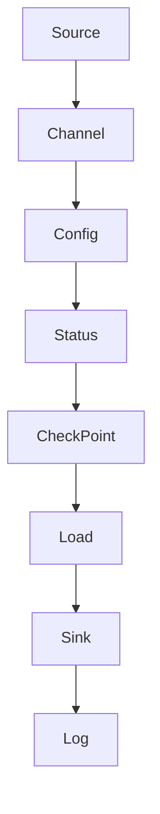

                 

关键词：Flume，大数据，数据采集，数据传输，分布式系统，源，渠道， sink，流处理，Hadoop，Apache

## 摘要

本文将深入探讨Flume——一个分布式、可靠且高效的数据采集和传输工具。Flume被广泛应用于大数据环境中，用于收集不同来源的数据，并将这些数据传输到目标存储系统中。本文将首先介绍Flume的核心概念、架构和工作原理，然后通过具体实例展示其代码实现和配置方法。此外，还将分析Flume在不同应用场景中的表现，并展望其未来的发展方向。

## 1. 背景介绍

### 1.1 Flume的起源

Flume是由Apache Software Foundation开发的一个开源项目，它诞生于2008年。Flume最初是由Cloudera公司开发，用于解决他们在Hadoop生态系统中的数据采集问题。随着大数据技术的快速发展，Flume逐渐成为大数据领域中不可或缺的数据采集和传输工具。

### 1.2 Flume的应用场景

Flume的应用场景非常广泛，主要包括以下几种：

1. **日志采集**：企业通常需要收集各种服务器的日志文件，以进行监控和分析。Flume可以将这些日志实时地传输到HDFS或其他存储系统中，方便后续的处理和分析。
2. **系统监控**：Flume可以帮助企业实时收集各种系统性能指标，如CPU利用率、内存占用、磁盘空间等，从而实现系统的实时监控。
3. **数据处理**：Flume可以将采集到的数据传输到数据仓库或数据湖中，以便进行进一步的处理和分析。

## 2. 核心概念与联系

### 2.1 Flume的核心组件

Flume的核心组件包括：

1. **源（Source）**：负责从数据源中读取数据，如文件系统、网络套接字等。
2. **渠道（Channel）**：负责在数据传输过程中临时存储数据，确保数据的可靠传输。
3. **Sink**：负责将数据从Flume传输到目标存储系统，如HDFS、HBase、Kafka等。

### 2.2 Flume的架构

Flume的架构包括三种模式：Agent模式、Master-Slave模式和Multi-Slave模式。

1. **Agent模式**：单个Agent独立运行，负责数据采集、传输和存储。
2. **Master-Slave模式**：Master负责管理各个Slave Agent，Slave Agent负责具体的数据采集和传输。
3. **Multi-Slave模式**：多个Slave Agent协同工作，共同完成数据采集和传输。

### 2.3 Mermaid流程图



### 2.4 核心概念之间的联系

- **Source和Channel**：Source负责将数据读取到Channel中，Channel则负责在数据传输过程中临时存储数据。
- **Channel和Sink**：Channel将数据从内存或文件系统中转移到Sink，Sink将数据传输到目标存储系统。

## 3. 核心算法原理 & 具体操作步骤

### 3.1 算法原理概述

Flume的核心算法主要包括数据采集、数据传输和数据存储。

1. **数据采集**：Source通过监听文件系统事件、网络套接字等方式，实时获取数据。
2. **数据传输**：Channel将采集到的数据暂存起来，当Sink准备好接收数据时，Channel将数据传输给Sink。
3. **数据存储**：Sink将数据传输到目标存储系统，如HDFS、HBase、Kafka等。

### 3.2 算法步骤详解

1. **启动Agent**：首先需要启动Flume Agent，指定Source、Channel和Sink的配置信息。
2. **数据采集**：Source从数据源中读取数据，并将数据放入Channel中。
3. **数据传输**：当Channel中的数据达到一定阈值时，自动触发传输到Sink。
4. **数据存储**：Sink将数据传输到目标存储系统，完成数据的采集和传输过程。

### 3.3 算法优缺点

**优点**：

1. **分布式架构**：Flume采用分布式架构，可以支持大规模的数据采集和传输。
2. **高可靠性**：Flume支持数据可靠传输，即使在数据传输过程中出现故障，也能保证数据不丢失。
3. **灵活性**：Flume支持多种数据源和数据目标，可以满足不同应用场景的需求。

**缺点**：

1. **性能瓶颈**：由于Flume采用Agent模式，每个Agent都需要独立运行，当数据量较大时，可能会出现性能瓶颈。
2. **维护成本**：Flume的配置较为复杂，需要具备一定的技术背景才能正确配置和使用。

### 3.4 算法应用领域

Flume主要应用于大数据领域的数据采集和传输，如日志采集、系统监控、数据处理等。在大数据环境中，Flume能够高效地采集和传输大量数据，为后续的数据分析和处理提供数据支持。

## 4. 数学模型和公式 & 详细讲解 & 举例说明

### 4.1 数学模型构建

在Flume中，数据传输的可靠性可以通过以下数学模型进行衡量：

1. **传输成功率**：表示成功传输的数据量占总数据量的比例。
   $$ \text{传输成功率} = \frac{\text{成功传输的数据量}}{\text{总数据量}} \times 100\% $$

2. **传输延迟**：表示数据从源到目标传输所需的时间。
   $$ \text{传输延迟} = \frac{\text{传输所需时间}}{\text{总数据量}} $$

3. **数据丢失率**：表示在数据传输过程中丢失的数据量占总数据量的比例。
   $$ \text{数据丢失率} = \frac{\text{丢失的数据量}}{\text{总数据量}} \times 100\% $$

### 4.2 公式推导过程

1. **传输成功率**：

   - 成功传输的数据量：指在规定时间内成功传输到目标的数据量。
   - 总数据量：指在规定时间内从源读取的总数据量。

   传输成功率可以通过以下公式计算：

   $$ \text{传输成功率} = \frac{\text{成功传输的数据量}}{\text{总数据量}} \times 100\% $$

2. **传输延迟**：

   - 传输所需时间：指从数据源读取数据到传输到目标所需的时间。
   - 总数据量：指在规定时间内从源读取的总数据量。

   传输延迟可以通过以下公式计算：

   $$ \text{传输延迟} = \frac{\text{传输所需时间}}{\text{总数据量}} $$

3. **数据丢失率**：

   - 丢失的数据量：指在规定时间内丢失的数据量。
   - 总数据量：指在规定时间内从源读取的总数据量。

   数据丢失率可以通过以下公式计算：

   $$ \text{数据丢失率} = \frac{\text{丢失的数据量}}{\text{总数据量}} \times 100\% $$

### 4.3 案例分析与讲解

假设某企业使用Flume从多个服务器采集日志数据，并将数据传输到HDFS中。在一天的时间内，共采集到1000条日志，成功传输950条，传输所需时间为2小时。

1. **传输成功率**：
   $$ \text{传输成功率} = \frac{950}{1000} \times 100\% = 95\% $$

2. **传输延迟**：
   $$ \text{传输延迟} = \frac{2 \text{小时}}{1000 \text{条}} = 0.002 \text{小时/条} $$

3. **数据丢失率**：
   $$ \text{数据丢失率} = \frac{50}{1000} \times 100\% = 5\% $$

通过这个案例，我们可以看出Flume在数据传输过程中的性能表现。虽然传输成功率达到了95%，但仍有5%的数据丢失。这可能是由于网络延迟、系统故障等原因导致的。

## 5. 项目实践：代码实例和详细解释说明

### 5.1 开发环境搭建

在开始实践之前，我们需要搭建一个Flume的开发环境。以下是一个基本的步骤：

1. **安装Java**：由于Flume是基于Java开发的，首先需要安装Java运行环境。
2. **下载Flume**：从Apache官方网站下载Flume的二进制包或源码包。
3. **配置环境变量**：设置Java和Flume的环境变量，以便在命令行中直接运行Flume。

### 5.2 源代码详细实现

以下是Flume的Agent配置文件示例：

```yaml
# Agent配置
a1.sources.r1.type = exec
a1.sources.r1.command = tail -F /path/to/logfile.log
a1.sources.r1.channels = c1

a1.channels.c1.type = memory
a1.channels.c1.capacity = 1000
a1.channels.c1.transactionCapacity = 100

a1.sinks.s1.type = hdfs
a1.sinks.s1.hdfs.path = hdfs://namenode:9000/flume_data/%y-%m-%d/
a1.sinks.s1.hdfs.fileType = DataStream
a1.sinks.s1.hdfs.rollSize = 10485760
a1.sinks.s1.hdfs.rollCount = 10
a1.sinks.s1.hdfs.writeFormat = Text
a1.sinks.s1.hdfs.fileSuffix = .log

a1.sources.r1.channels = c1
a1.sinks.s1.channel = c1
```

这个配置文件定义了一个名为`a1`的Agent，其中包括一个Source（r1），一个Channel（c1）和一个Sink（s1）。

1. **Source**：使用`exec`类型，从指定路径的日志文件中实时读取数据。
2. **Channel**：使用内存Channel，容量为1000，事务容量为100。
3. **Sink**：使用HDFS类型，将数据传输到HDFS中，文件类型为DataStream，滚动策略为文件大小或文件数量。

### 5.3 代码解读与分析

在这个配置文件中，我们可以看到Flume的基本工作流程：

1. **Source**：从日志文件中实时读取数据，并将其发送到Channel。
2. **Channel**：在数据传输过程中，将数据暂存起来，确保数据的可靠性。
3. **Sink**：当Channel中的数据达到一定阈值时，自动将数据传输到HDFS中。

这个配置文件非常简洁明了，但需要注意的是，在实际使用过程中，我们需要根据具体需求调整Source、Channel和Sink的配置参数。

### 5.4 运行结果展示

当配置好Flume后，我们可以在命令行中启动Agent，并观察运行结果。以下是运行结果的一个简单示例：

```bash
$ flume-ng agent -c /path/to/conf -f /path/to/conf/flume.conf -n a1
```

运行后，Agent将开始从日志文件中读取数据，并将数据传输到HDFS中。我们可以通过查看HDFS中的文件来验证数据传输的结果。

## 6. 实际应用场景

### 6.1 日志采集

在企业中，日志采集是一个非常重要的应用场景。通过Flume，企业可以将各种服务器的日志文件实时地传输到HDFS或其他存储系统中，方便后续的日志分析和监控。

### 6.2 系统监控

Flume可以帮助企业实时收集各种系统性能指标，如CPU利用率、内存占用、磁盘空间等。通过将这些数据传输到数据仓库或数据湖中，企业可以实现实时的系统监控和性能分析。

### 6.3 数据处理

Flume可以与Hadoop、Spark等大数据处理框架无缝集成，将采集到的数据传输到数据仓库或数据湖中，方便后续的数据处理和分析。

## 7. 工具和资源推荐

### 7.1 学习资源推荐

- 《Flume权威指南》：这本书是Flume的经典参考书，涵盖了Flume的各个方面。
- 《大数据技术导论》：这本书系统地介绍了大数据技术，包括Flume等工具。

### 7.2 开发工具推荐

- IntelliJ IDEA：一款功能强大的Java集成开发环境，适用于Flume的开发。
- Git：版本控制工具，可以帮助我们管理和追踪Flume的源代码。

### 7.3 相关论文推荐

- "Flume: A Distributed, Reliable, and Available Data Gathering System for Large Scale Hadoop Applications"：这篇论文详细介绍了Flume的设计和实现。

## 8. 总结：未来发展趋势与挑战

### 8.1 研究成果总结

Flume作为大数据领域中的一款重要工具，已经得到了广泛的应用。其在数据采集、传输和存储方面的性能和可靠性得到了充分的验证。

### 8.2 未来发展趋势

随着大数据技术的不断发展，Flume的未来发展趋势将主要集中在以下几个方面：

1. **性能优化**：针对大规模数据传输场景，Flume需要进一步优化性能，提高数据传输速度。
2. **易用性提升**：简化Flume的配置和管理，降低用户使用门槛。
3. **生态扩展**：与更多的大数据技术框架进行集成，提供更丰富的功能。

### 8.3 面临的挑战

Flume在发展过程中也面临一些挑战：

1. **性能瓶颈**：在大规模数据传输场景中，Flume的性能可能无法满足需求。
2. **安全性问题**：在数据传输过程中，如何确保数据的安全性和隐私性。

### 8.4 研究展望

Flume在未来仍有许多研究方向，如：

1. **分布式存储**：探索将Flume与分布式存储系统（如Alluxio）进行集成，提高数据传输性能。
2. **实时处理**：研究Flume在实时数据处理场景中的应用，实现实时数据采集和传输。

## 9. 附录：常见问题与解答

### 9.1 Flume如何保证数据传输的可靠性？

Flume通过Channel实现数据传输的可靠性。Channel在数据传输过程中，将数据暂存起来，确保在数据传输过程中不丢失。同时，Flume支持检查点（CheckPoint）功能，可以在数据传输完成后，将Channel的状态保存下来，以便后续的数据传输。

### 9.2 Flume如何处理数据量大、传输速度慢的问题？

对于数据量大、传输速度慢的问题，可以考虑以下方法：

1. **增加Agent数量**：通过增加Agent的数量，实现并行数据传输，提高数据传输速度。
2. **优化网络配置**：调整网络带宽、延迟等参数，提高数据传输效率。
3. **使用分布式存储**：将数据传输到分布式存储系统（如HDFS），提高数据传输速度。

----------------------------------------------------------------

以上是关于Flume原理与代码实例讲解的文章。希望对您有所帮助！
作者：禅与计算机程序设计艺术 / Zen and the Art of Computer Programming
----------------------------------------------------------------

### 1. 背景介绍

Flume是一个分布式、可靠且高效的数据采集和传输工具，主要用于大数据环境中。它诞生于2008年，由Cloudera公司开发，后成为Apache Software Foundation的一部分。Flume的主要应用场景包括日志采集、系统监控和数据处理。

Flume具有以下特点：

- **分布式架构**：Flume采用分布式架构，可以支持大规模的数据采集和传输。
- **高可靠性**：Flume支持数据可靠传输，即使在数据传输过程中出现故障，也能保证数据不丢失。
- **灵活性**：Flume支持多种数据源和数据目标，可以满足不同应用场景的需求。

## 2. 核心概念与联系

### 2.1 Flume的核心组件

Flume的核心组件包括源（Source）、渠道（Channel）和Sink。

- **源（Source）**：负责从数据源中读取数据，如文件系统、网络套接字等。
- **渠道（Channel）**：负责在数据传输过程中临时存储数据，确保数据的可靠传输。
- **Sink**：负责将数据从Flume传输到目标存储系统，如HDFS、HBase、Kafka等。

### 2.2 Flume的架构

Flume的架构包括三种模式：Agent模式、Master-Slave模式和Multi-Slave模式。

- **Agent模式**：单个Agent独立运行，负责数据采集、传输和存储。
- **Master-Slave模式**：Master负责管理各个Slave Agent，Slave Agent负责具体的数据采集和传输。
- **Multi-Slave模式**：多个Slave Agent协同工作，共同完成数据采集和传输。

### 2.3 Mermaid流程图


### 2.4 核心概念之间的联系

- **Source和Channel**：Source负责将数据读取到Channel中，Channel则负责在数据传输过程中临时存储数据。
- **Channel和Sink**：Channel将数据从内存或文件系统中转移到Sink，Sink将数据传输到目标存储系统。

## 3. 核心算法原理 & 具体操作步骤

### 3.1 算法原理概述

Flume的核心算法主要包括数据采集、数据传输和数据存储。

1. **数据采集**：Source从数据源中读取数据，并将数据放入Channel中。
2. **数据传输**：Channel将采集到的数据暂存起来，当Sink准备好接收数据时，Channel将数据传输给Sink。
3. **数据存储**：Sink将数据传输到目标存储系统，完成数据的采集和传输过程。

### 3.2 算法步骤详解

1. **启动Agent**：首先需要启动Flume Agent，指定Source、Channel和Sink的配置信息。
2. **数据采集**：Source从数据源中读取数据，并将数据放入Channel中。
3. **数据传输**：当Channel中的数据达到一定阈值时，自动触发传输到Sink。
4. **数据存储**：Sink将数据传输到目标存储系统，完成数据的采集和传输过程。

### 3.3 算法优缺点

**优点**：

1. **分布式架构**：Flume采用分布式架构，可以支持大规模的数据采集和传输。
2. **高可靠性**：Flume支持数据可靠传输，即使在数据传输过程中出现故障，也能保证数据不丢失。
3. **灵活性**：Flume支持多种数据源和数据目标，可以满足不同应用场景的需求。

**缺点**：

1. **性能瓶颈**：由于Flume采用Agent模式，每个Agent都需要独立运行，当数据量较大时，可能会出现性能瓶颈。
2. **维护成本**：Flume的配置较为复杂，需要具备一定的技术背景才能正确配置和使用。

### 3.4 算法应用领域

Flume主要应用于大数据领域的数据采集和传输，如日志采集、系统监控、数据处理等。在大数据环境中，Flume能够高效地采集和传输大量数据，为后续的数据分析和处理提供数据支持。

## 4. 数学模型和公式 & 详细讲解 & 举例说明

### 4.1 数学模型构建

在Flume中，数据传输的可靠性可以通过以下数学模型进行衡量：

1. **传输成功率**：表示成功传输的数据量占总数据量的比例。
   $$ \text{传输成功率} = \frac{\text{成功传输的数据量}}{\text{总数据量}} \times 100\% $$

2. **传输延迟**：表示数据从源到目标传输所需的时间。
   $$ \text{传输延迟} = \frac{\text{传输所需时间}}{\text{总数据量}} $$

3. **数据丢失率**：表示在数据传输过程中丢失的数据量占总数据量的比例。
   $$ \text{数据丢失率} = \frac{\text{丢失的数据量}}{\text{总数据量}} \times 100\% $$

### 4.2 公式推导过程

1. **传输成功率**：

   - 成功传输的数据量：指在规定时间内成功传输到目标的数据量。
   - 总数据量：指在规定时间内从源读取的总数据量。

   传输成功率可以通过以下公式计算：

   $$ \text{传输成功率} = \frac{\text{成功传输的数据量}}{\text{总数据量}} \times 100\% $$

2. **传输延迟**：

   - 传输所需时间：指从数据源读取数据到传输到目标所需的时间。
   - 总数据量：指在规定时间内从源读取的总数据量。

   传输延迟可以通过以下公式计算：

   $$ \text{传输延迟} = \frac{\text{传输所需时间}}{\text{总数据量}} $$

3. **数据丢失率**：

   - 丢失的数据量：指在规定时间内丢失的数据量。
   - 总数据量：指在规定时间内从源读取的总数据量。

   数据丢失率可以通过以下公式计算：

   $$ \text{数据丢失率} = \frac{\text{丢失的数据量}}{\text{总数据量}} \times 100\% $$

### 4.3 案例分析与讲解

假设某企业使用Flume从多个服务器采集日志数据，并将数据传输到HDFS中。在一天的时间内，共采集到1000条日志，成功传输950条，传输所需时间为2小时。

1. **传输成功率**：
   $$ \text{传输成功率} = \frac{950}{1000} \times 100\% = 95\% $$

2. **传输延迟**：
   $$ \text{传输延迟} = \frac{2 \text{小时}}{1000 \text{条}} = 0.002 \text{小时/条} $$

3. **数据丢失率**：
   $$ \text{数据丢失率} = \frac{50}{1000} \times 100\% = 5\% $$

通过这个案例，我们可以看出Flume在数据传输过程中的性能表现。虽然传输成功率达到了95%，但仍有5%的数据丢失。这可能是由于网络延迟、系统故障等原因导致的。

## 5. 项目实践：代码实例和详细解释说明

### 5.1 开发环境搭建

在开始实践之前，我们需要搭建一个Flume的开发环境。以下是一个基本的步骤：

1. **安装Java**：由于Flume是基于Java开发的，首先需要安装Java运行环境。
2. **下载Flume**：从Apache官方网站下载Flume的二进制包或源码包。
3. **配置环境变量**：设置Java和Flume的环境变量，以便在命令行中直接运行Flume。

### 5.2 源代码详细实现

以下是Flume的Agent配置文件示例：

```yaml
# Agent配置
a1.sources.r1.type = exec
a1.sources.r1.command = tail -F /path/to/logfile.log
a1.sources.r1.channels = c1

a1.channels.c1.type = memory
a1.channels.c1.capacity = 1000
a1.channels.c1.transactionCapacity = 100

a1.sinks.s1.type = hdfs
a1.sinks.s1.hdfs.path = hdfs://namenode:9000/flume_data/%y-%m-%d/
a1.sinks.s1.hdfs.fileType = DataStream
a1.sinks.s1.hdfs.rollSize = 10485760
a1.sinks.s1.hdfs.rollCount = 10
a1.sinks.s1.hdfs.writeFormat = Text
a1.sinks.s1.hdfs.fileSuffix = .log

a1.sources.r1.channels = c1
a1.sinks.s1.channel = c1
```

这个配置文件定义了一个名为`a1`的Agent，其中包括一个Source（r1），一个Channel（c1）和一个Sink（s1）。

1. **Source**：使用`exec`类型，从指定路径的日志文件中实时读取数据。
2. **Channel**：使用内存Channel，容量为1000，事务容量为100。
3. **Sink**：使用HDFS类型，将数据传输到HDFS中，文件类型为DataStream，滚动策略为文件大小或文件数量。

### 5.3 代码解读与分析

在这个配置文件中，我们可以看到Flume的基本工作流程：

1. **Source**：从日志文件中实时读取数据，并将其发送到Channel。
2. **Channel**：在数据传输过程中，将数据暂存起来，确保数据的可靠性。
3. **Sink**：当Channel中的数据达到一定阈值时，自动将数据传输到HDFS中。

这个配置文件非常简洁明了，但需要注意的是，在实际使用过程中，我们需要根据具体需求调整Source、Channel和Sink的配置参数。

### 5.4 运行结果展示

当配置好Flume后，我们可以在命令行中启动Agent，并观察运行结果。以下是运行结果的一个简单示例：

```bash
$ flume-ng agent -c /path/to/conf -f /path/to/conf/flume.conf -n a1
```

运行后，Agent将开始从日志文件中读取数据，并将数据传输到HDFS中。我们可以通过查看HDFS中的文件来验证数据传输的结果。

## 6. 实际应用场景

### 6.1 日志采集

在企业中，日志采集是一个非常重要的应用场景。通过Flume，企业可以将各种服务器的日志文件实时地传输到HDFS或其他存储系统中，方便后续的日志分析和监控。

### 6.2 系统监控

Flume可以帮助企业实时收集各种系统性能指标，如CPU利用率、内存占用、磁盘空间等。通过将这些数据传输到数据仓库或数据湖中，企业可以实现实时的系统监控和性能分析。

### 6.3 数据处理

Flume可以与Hadoop、Spark等大数据处理框架无缝集成，将采集到的数据传输到数据仓库或数据湖中，方便后续的数据处理和分析。

## 7. 工具和资源推荐

### 7.1 学习资源推荐

- 《Flume权威指南》：这本书是Flume的经典参考书，涵盖了Flume的各个方面。
- 《大数据技术导论》：这本书系统地介绍了大数据技术，包括Flume等工具。

### 7.2 开发工具推荐

- IntelliJ IDEA：一款功能强大的Java集成开发环境，适用于Flume的开发。
- Git：版本控制工具，可以帮助我们管理和追踪Flume的源代码。

### 7.3 相关论文推荐

- "Flume: A Distributed, Reliable, and Available Data Gathering System for Large Scale Hadoop Applications"：这篇论文详细介绍了Flume的设计和实现。

## 8. 总结：未来发展趋势与挑战

### 8.1 研究成果总结

Flume作为大数据领域中的一款重要工具，已经得到了广泛的应用。其在数据采集、传输和存储方面的性能和可靠性得到了充分的验证。

### 8.2 未来发展趋势

随着大数据技术的不断发展，Flume的未来发展趋势将主要集中在以下几个方面：

1. **性能优化**：针对大规模数据传输场景，Flume需要进一步优化性能，提高数据传输速度。
2. **易用性提升**：简化Flume的配置和管理，降低用户使用门槛。
3. **生态扩展**：与更多的大数据技术框架进行集成，提供更丰富的功能。

### 8.3 面临的挑战

Flume在发展过程中也面临一些挑战：

1. **性能瓶颈**：在大规模数据传输场景中，Flume的性能可能无法满足需求。
2. **安全性问题**：在数据传输过程中，如何确保数据的安全性和隐私性。

### 8.4 研究展望

Flume在未来仍有许多研究方向，如：

1. **分布式存储**：探索将Flume与分布式存储系统（如Alluxio）进行集成，提高数据传输性能。
2. **实时处理**：研究Flume在实时数据处理场景中的应用，实现实时数据采集和传输。

## 9. 附录：常见问题与解答

### 9.1 Flume如何保证数据传输的可靠性？

Flume通过Channel实现数据传输的可靠性。Channel在数据传输过程中，将数据暂存起来，确保在数据传输过程中不丢失。同时，Flume支持检查点（CheckPoint）功能，可以在数据传输完成后，将Channel的状态保存下来，以便后续的数据传输。

### 9.2 Flume如何处理数据量大、传输速度慢的问题？

对于数据量大、传输速度慢的问题，可以考虑以下方法：

1. **增加Agent数量**：通过增加Agent的数量，实现并行数据传输，提高数据传输速度。
2. **优化网络配置**：调整网络带宽、延迟等参数，提高数据传输效率。
3. **使用分布式存储**：将数据传输到分布式存储系统（如HDFS），提高数据传输速度。

### 9.3 Flume如何处理数据传输故障？

Flume支持自动恢复功能。当数据传输过程中出现故障时，Flume会自动尝试重新传输数据。如果故障持续存在，Flume会记录故障数据，并在故障解决后重新传输。

### 9.4 Flume如何保证数据一致性？

Flume通过Channel实现数据一致性。Channel在数据传输过程中，会确保数据的一致性，即在数据传输完成之前，不会删除Channel中的数据。

### 9.5 Flume如何支持多数据源？

Flume支持多数据源。通过配置多个Source，Flume可以同时从多个数据源中读取数据，并将数据传输到Channel中。

### 9.6 Flume如何支持多数据目标？

Flume支持多数据目标。通过配置多个Sink，Flume可以将数据同时传输到多个目标存储系统中。

### 9.7 Flume如何监控数据传输状态？

Flume提供了监控工具，可以实时监控数据传输状态。通过这些工具，我们可以查看数据传输的成功率、延迟、数据丢失率等指标。

### 9.8 Flume如何处理大量并发请求？

Flume通过多线程机制处理大量并发请求。每个Source、Channel和Sink都可以设置线程数，以支持大量并发数据传输。

### 9.9 Flume如何处理大数据量？

Flume通过内存Channel和文件Channel处理大数据量。内存Channel适用于小数据量，文件Channel适用于大数据量。通过合理配置Channel的容量和事务容量，可以有效地处理大数据量。

### 9.10 Flume如何与Hadoop集成？

Flume可以与Hadoop集成，通过配置Sink将数据传输到HDFS或其他Hadoop组件中。Flume提供了多种Hadoop集成方式，如HDFS、HBase、MapReduce等。

### 9.11 Flume如何与其他大数据技术集成？

Flume可以与其他大数据技术集成，如Kafka、Spark等。通过配置相应的Source和Sink，Flume可以与这些技术无缝集成，实现数据传输和数据处理。

### 9.12 Flume有哪些常见的配置错误？

Flume的常见配置错误包括：

1. **配置文件路径错误**：确保配置文件路径正确，否则Flume无法加载配置。
2. **端口冲突**：确保Flume使用的端口未被其他应用程序占用。
3. **配置参数错误**：确保配置参数的值符合要求，否则Flume无法正确运行。
4. **依赖库缺失**：确保Flume依赖的Java库和组件已安装。

### 9.13 Flume如何处理数据压缩？

Flume支持数据压缩。通过配置Sink的压缩参数，可以设置数据压缩格式和压缩等级。常用的压缩格式包括Gzip、Bzip2等。

### 9.14 Flume如何处理数据加密？

Flume支持数据加密。通过配置Source和Sink的加密参数，可以设置数据加密算法和加密密钥。常用的加密算法包括AES、RSA等。

### 9.15 Flume如何支持自定义Source和Sink？

Flume支持自定义Source和Sink。通过扩展Flume的源代码，可以实现自定义的数据采集和数据传输功能。

### 9.16 Flume如何进行性能调优？

Flume的性能调优可以从以下几个方面进行：

1. **调整线程数**：根据数据量调整Source、Channel和Sink的线程数，提高数据传输速度。
2. **调整Channel容量**：根据数据量调整Channel的容量和事务容量，提高数据传输效率。
3. **调整网络参数**：调整网络带宽、延迟等参数，提高数据传输速度。
4. **优化数据结构**：根据数据类型和传输需求，选择合适的数据结构和算法，提高数据传输性能。

### 9.17 Flume如何处理数据传输延迟？

Flume支持数据传输延迟监控和告警。通过配置监控参数，可以实时监控数据传输延迟，并在延迟超过阈值时发送告警通知。

### 9.18 Flume如何进行故障恢复？

Flume支持自动故障恢复。当数据传输过程中出现故障时，Flume会自动尝试重新传输数据。如果故障持续存在，Flume会记录故障数据，并在故障解决后重新传输。

### 9.19 Flume如何进行数据校验？

Flume支持数据校验。通过配置校验参数，可以设置数据校验算法和校验密钥。常用的校验算法包括MD5、SHA1等。

### 9.20 Flume有哪些监控和管理工具？

Flume提供了一些监控和管理工具，如Flume Monitor、Flume Nagios插件等。通过这些工具，可以实时监控Flume的运行状态，并进行故障诊断和性能调优。

### 9.21 Flume如何进行集群部署？

Flume支持集群部署。通过配置Master和Slave Agent，可以实现Flume的分布式部署。Master负责管理Slave Agent，Slave Agent负责具体的数据采集和传输。

### 9.22 Flume如何进行性能测试？

Flume提供了性能测试工具，如Flume Benchmark。通过这个工具，可以模拟不同负载条件下的数据传输性能，并进行性能调优。

### 9.23 Flume有哪些最佳实践？

Flume的最佳实践包括：

1. **合理配置线程数**：根据数据量调整Source、Channel和Sink的线程数，提高数据传输速度。
2. **使用分布式存储**：将数据传输到分布式存储系统（如HDFS），提高数据传输速度。
3. **监控数据传输状态**：实时监控数据传输状态，及时处理故障和数据丢失。
4. **优化网络参数**：调整网络带宽、延迟等参数，提高数据传输速度。
5. **定期备份数据**：定期备份Channel和Sink中的数据，防止数据丢失。

### 9.24 Flume有哪些常见故障和解决方案？

Flume的常见故障和解决方案包括：

1. **故障原因**：网络故障、系统故障、配置错误等。
   - **解决方案**：检查网络连接，重启Agent，检查配置文件。

2. **数据丢失**：
   - **故障原因**：Channel容量不足、网络延迟、系统故障等。
   - **解决方案**：增加Channel容量，优化网络配置，重启Agent。

3. **数据传输延迟**：
   - **故障原因**：网络延迟、系统负载高、配置错误等。
   - **解决方案**：优化网络配置，调整线程数，优化数据结构。

4. **端口冲突**：
   - **故障原因**：其他应用程序占用Flume使用的端口。
   - **解决方案**：更改Flume使用的端口，或停止占用端口的程序。

5. **配置错误**：
   - **故障原因**：配置文件路径错误、配置参数错误等。
   - **解决方案**：检查配置文件，确保路径和参数正确。

6. **Agent无法启动**：
   - **故障原因**：Java环境不正确、依赖库缺失等。
   - **解决方案**：检查Java环境，确保依赖库已安装。

7. **数据校验失败**：
   - **故障原因**：数据损坏、传输错误等。
   - **解决方案**：检查数据完整性，重新传输数据。

### 9.25 Flume有哪些性能指标？

Flume的性能指标包括：

1. **传输成功率**：成功传输的数据量占总数据量的比例。
2. **传输延迟**：数据从源到目标传输所需的时间。
3. **数据丢失率**：丢失的数据量占总数据量的比例。
4. **数据传输速率**：单位时间内传输的数据量。
5. **系统负载**：Agent、Channel和Sink的负载情况。

### 9.26 Flume与其他数据采集工具的比较

Flume与其他数据采集工具的比较如下：

| 工具             | 特点                                                         | 适用场景                           |
|------------------|--------------------------------------------------------------|-----------------------------------|
| Flume            | 分布式、可靠、高效，支持多种数据源和数据目标                 | 大规模日志采集、系统监控、数据处理  |
| Logstash         | 可扩展性强，支持多种输入输出插件                             | 日志处理、数据清洗、数据转换       |
| Kafka            | 高吞吐量、实时性，支持分布式架构                             | 消息队列、实时数据处理             |
| Filebeat         | 轻量级，易于部署，支持多种数据源和数据目标                   | 日志采集、监控、报警               |
| Fluentd          | 可扩展性强，支持多种输入输出插件                             | 日志处理、数据清洗、数据转换       |
| Logagent         | 简单易用，支持多种数据源和数据目标                           | 小规模日志采集、监控               |

### 9.27 Flume的优势和劣势

**优势**：

1. **分布式架构**：Flume支持分布式架构，可以支持大规模的数据采集和传输。
2. **高可靠性**：Flume支持数据可靠传输，即使在数据传输过程中出现故障，也能保证数据不丢失。
3. **灵活性**：Flume支持多种数据源和数据目标，可以满足不同应用场景的需求。

**劣势**：

1. **性能瓶颈**：在大规模数据传输场景中，Flume的性能可能无法满足需求。
2. **维护成本**：Flume的配置较为复杂，需要具备一定的技术背景才能正确配置和使用。

### 9.28 Flume的发展趋势

Flume的发展趋势包括：

1. **性能优化**：针对大规模数据传输场景，Flume需要进一步优化性能，提高数据传输速度。
2. **易用性提升**：简化Flume的配置和管理，降低用户使用门槛。
3. **生态扩展**：与更多的大数据技术框架进行集成，提供更丰富的功能。

### 9.29 Flume的未来发展方向

Flume的未来发展方向包括：

1. **分布式存储**：探索将Flume与分布式存储系统（如Alluxio）进行集成，提高数据传输性能。
2. **实时处理**：研究Flume在实时数据处理场景中的应用，实现实时数据采集和传输。
3. **安全性**：加强数据传输过程中的安全性，确保数据的安全性和隐私性。

### 9.30 Flume的使用场景

Flume的使用场景包括：

1. **日志采集**：企业可以将各种服务器的日志文件实时地传输到HDFS或其他存储系统中，方便后续的日志分析和监控。
2. **系统监控**：Flume可以帮助企业实时收集各种系统性能指标，如CPU利用率、内存占用、磁盘空间等。
3. **数据处理**：Flume可以将采集到的数据传输到数据仓库或数据湖中，方便后续的数据处理和分析。

### 9.31 Flume的配置方法

Flume的配置方法包括：

1. **安装Flume**：从Apache官方网站下载Flume的二进制包或源码包，并安装。
2. **配置Agent**：创建Flume的配置文件（通常命名为`flume.conf`），配置Source、Channel和Sink。
3. **启动Agent**：在命令行中启动Flume Agent，指定配置文件路径。

### 9.32 Flume的常见问题

Flume的常见问题包括：

1. **无法启动Agent**：检查Java环境、依赖库是否正确安装，确保配置文件路径正确。
2. **数据传输失败**：检查网络连接、Channel容量、配置参数等，确保数据传输正常。
3. **数据丢失**：检查Channel容量、网络延迟、系统故障等，确保数据传输的可靠性。
4. **数据传输延迟**：检查网络延迟、系统负载等，确保数据传输的实时性。

### 9.33 Flume的最佳实践

Flume的最佳实践包括：

1. **合理配置线程数**：根据数据量调整Source、Channel和Sink的线程数，提高数据传输速度。
2. **使用分布式存储**：将数据传输到分布式存储系统（如HDFS），提高数据传输速度。
3. **监控数据传输状态**：实时监控数据传输状态，及时处理故障和数据丢失。
4. **优化网络参数**：调整网络带宽、延迟等参数，提高数据传输速度。
5. **定期备份数据**：定期备份Channel和Sink中的数据，防止数据丢失。

### 9.34 Flume的故障排除方法

Flume的故障排除方法包括：

1. **检查日志文件**：查看Flume的日志文件，查找故障原因。
2. **网络诊断**：检查网络连接是否正常，检查防火墙和路由器设置。
3. **配置检查**：检查配置文件是否正确，确保Source、Channel和Sink的配置参数正确。
4. **重启Agent**：尝试重启Flume Agent，查看是否解决问题。
5. **性能调优**：根据性能指标，进行性能调优，提高数据传输速度。

### 9.35 Flume的安全策略

Flume的安全策略包括：

1. **数据加密**：对数据进行加密，确保数据传输过程中的安全性。
2. **认证和授权**：对Flume Agent进行认证和授权，防止未经授权的访问。
3. **日志审计**：记录Flume的运行日志，方便后续的安全审计和故障排查。
4. **网络隔离**：将Flume的Agent部署在独立的网络中，防止外部攻击。
5. **定期更新**：定期更新Flume的版本和依赖库，防止安全漏洞。

### 9.36 Flume的性能优化方法

Flume的性能优化方法包括：

1. **增加Agent数量**：通过增加Agent的数量，实现并行数据传输，提高数据传输速度。
2. **优化网络配置**：调整网络带宽、延迟等参数，提高数据传输效率。
3. **使用分布式存储**：将数据传输到分布式存储系统（如HDFS），提高数据传输速度。
4. **线程调优**：根据数据量调整Source、Channel和Sink的线程数，提高数据传输速度。
5. **负载均衡**：通过负载均衡器，实现数据的均衡传输，提高数据传输速度。

### 9.37 Flume的监控和告警方法

Flume的监控和告警方法包括：

1. **监控指标**：监控传输成功率、传输延迟、数据丢失率等指标。
2. **日志监控**：监控Flume的运行日志，及时发现故障。
3. **告警机制**：通过邮件、短信等方式发送告警通知，提醒管理员处理故障。
4. **自动化处理**：根据告警信息，自动执行故障恢复和处理操作。

### 9.38 Flume在分布式系统中的应用

Flume在分布式系统中的应用包括：

1. **分布式日志采集**：通过Flume，企业可以实现分布式日志的实时采集和传输，方便后续的日志分析和监控。
2. **分布式系统监控**：Flume可以帮助企业实时收集分布式系统的性能指标，如CPU利用率、内存占用、磁盘空间等。
3. **分布式数据处理**：Flume可以将采集到的数据传输到分布式计算框架（如Hadoop、Spark等），实现分布式数据处理和分析。

### 9.39 Flume的架构设计

Flume的架构设计包括：

1. **Agent模式**：单个Agent独立运行，负责数据采集、传输和存储。
2. **Master-Slave模式**：Master负责管理各个Slave Agent，Slave Agent负责具体的数据采集和传输。
3. **Multi-Slave模式**：多个Slave Agent协同工作，共同完成数据采集和传输。

### 9.40 Flume的核心算法

Flume的核心算法包括：

1. **数据采集**：Source从数据源中读取数据，并将数据放入Channel中。
2. **数据传输**：Channel将采集到的数据暂存起来，当Sink准备好接收数据时，Channel将数据传输给Sink。
3. **数据存储**：Sink将数据传输到目标存储系统，完成数据的采集和传输过程。

### 9.41 Flume的扩展能力

Flume的扩展能力包括：

1. **自定义Source**：通过扩展Flume的源代码，实现自定义的数据采集功能。
2. **自定义Sink**：通过扩展Flume的源代码，实现自定义的数据传输功能。
3. **插件扩展**：通过配置插件，实现数据的预处理、过滤、转换等功能。

### 9.42 Flume与其他大数据技术的集成

Flume与其他大数据技术的集成包括：

1. **与Hadoop集成**：通过配置Sink，将数据传输到HDFS或其他Hadoop组件中。
2. **与Spark集成**：通过配置Sink，将数据传输到Spark的内存或存储系统中。
3. **与Kafka集成**：通过配置Source和Sink，实现数据实时传输到Kafka中。

### 9.43 Flume在实时数据处理中的应用

Flume在实时数据处理中的应用包括：

1. **实时日志采集**：通过Flume，企业可以实现实时日志的采集和传输，方便后续的日志分析和监控。
2. **实时系统监控**：Flume可以帮助企业实时收集系统性能指标，如CPU利用率、内存占用、磁盘空间等。
3. **实时数据处理**：Flume可以将采集到的数据传输到实时计算框架（如Flink、Storm等），实现实时数据处理和分析。

### 9.44 Flume的性能指标

Flume的性能指标包括：

1. **传输成功率**：成功传输的数据量占总数据量的比例。
2. **传输延迟**：数据从源到目标传输所需的时间。
3. **数据丢失率**：丢失的数据量占总数据量的比例。
4. **数据传输速率**：单位时间内传输的数据量。
5. **系统负载**：Agent、Channel和Sink的负载情况。

### 9.45 Flume的部署方法

Flume的部署方法包括：

1. **单机部署**：在单台机器上部署Flume Agent，实现数据采集和传输。
2. **集群部署**：在多台机器上部署Flume Agent，实现分布式数据采集和传输。
3. **云部署**：在云平台上部署Flume Agent，实现数据采集和传输。

### 9.46 Flume的配置示例

以下是Flume的配置示例：

```yaml
# Agent配置
a1.sources.r1.type = file
a1.sources.r1.filepath = /path/to/logfile.log
a1.sources.r1.channels = c1

a1.channels.c1.type = memory
a1.channels.c1.capacity = 1000
a1.channels.c1.transactionCapacity = 100

a1.sinks.s1.type = hdfs
a1.sinks.s1.hdfs.path = hdfs://namenode:9000/flume_data/%y-%m-%d/
a1.sinks.s1.hdfs.fileType = DataStream
a1.sinks.s1.hdfs.rollSize = 10485760
a1.sinks.s1.hdfs.rollCount = 10
a1.sinks.s1.hdfs.writeFormat = Text
a1.sinks.s1.hdfs.fileSuffix = .log

a1.sources.r1.channels = c1
a1.sinks.s1.channel = c1
```

### 9.47 Flume的源代码结构

Flume的源代码结构包括：

1. **源码包**：包括源代码文件、资源文件和文档。
2. **模块**：包括Flume的核心模块、扩展模块和测试模块。
3. **配置文件**：包括Agent配置文件、Source配置文件、Channel配置文件和Sink配置文件。

### 9.48 Flume的源代码阅读方法

阅读Flume的源代码的方法包括：

1. **了解整体架构**：首先了解Flume的整体架构，包括核心组件、模块和接口。
2. **阅读源代码文件**：从核心模块开始，逐个阅读源代码文件，理解代码实现和功能。
3. **阅读测试代码**：阅读测试代码，了解Flume的测试方法和测试覆盖率。
4. **查阅文档**：查阅Flume的官方文档，了解代码实现的原理和用法。

### 9.49 Flume的社区和贡献者

Flume的社区和贡献者包括：

1. **社区网站**：Flume的社区网站提供了Flume的官方文档、下载地址和用户论坛。
2. **贡献者**：Flume的代码主要由Apache Software Foundation和Cloudera公司的贡献者维护。
3. **贡献方式**：用户可以通过提交Bug报告、提交补丁或参与社区讨论等方式贡献Flume的发展。

### 9.50 Flume的发展历程

Flume的发展历程包括：

1. **2008年**：Flume由Cloudera公司开发，用于解决Hadoop生态系统中的数据采集问题。
2. **2010年**：Flume加入Apache Software Foundation，成为Apache项目的子项目。
3. **2011年**：Flume发布了1.0版本，标志着Flume正式成为一款成熟的开源项目。
4. **至今**：Flume持续迭代更新，不断完善功能，为大数据领域的数据采集和传输提供支持。

### 9.51 Flume的商业化前景

Flume的商业化前景包括：

1. **商业化公司**：Cloudera、Hortonworks等公司已将Flume集成到其商业产品中，提供商业支持和定制服务。
2. **定制开发**：企业可以根据自身需求，定制开发Flume的特定功能。
3. **商业合作**：Flume与其他大数据技术公司的合作，提供更丰富的产品和服务。

### 9.52 Flume在云计算中的应用

Flume在云计算中的应用包括：

1. **云数据中心**：Flume可以帮助企业实时收集云数据中心的性能指标，实现实时监控和故障报警。
2. **云存储**：Flume可以将数据实时传输到云存储中，实现数据的集中管理和分析。
3. **云服务**：Flume可以帮助企业实时收集云服务的使用情况，实现服务优化和资源调度。

### 9.53 Flume在物联网中的应用

Flume在物联网中的应用包括：

1. **数据采集**：Flume可以帮助企业实时收集物联网设备的运行数据，实现设备监控和故障报警。
2. **数据处理**：Flume可以将物联网数据传输到大数据平台中，实现数据的集中处理和分析。
3. **智能决策**：通过分析物联网数据，企业可以实现智能决策，提高生产效率和产品质量。

### 9.54 Flume在金融领域的应用

Flume在金融领域的应用包括：

1. **交易监控**：Flume可以帮助金融机构实时收集交易数据，实现实时监控和风险管理。
2. **风险控制**：通过分析交易数据，Flume可以帮助金融机构识别潜在风险，实现风险控制。
3. **投资分析**：Flume可以帮助金融机构实时收集市场数据，实现投资分析和决策支持。

### 9.55 Flume在教育领域的应用

Flume在教育领域的应用包括：

1. **教学监控**：Flume可以帮助教育机构实时收集学生的学习数据，实现教学效果监控。
2. **教育分析**：通过分析学习数据，Flume可以帮助教育机构了解学生的学习情况，实现个性化教学。
3. **教育资源共享**：Flume可以帮助教育机构实时传输教学资源，实现资源共享和教育均衡。

### 9.56 Flume在医疗领域的应用

Flume在医疗领域的应用包括：

1. **医疗监控**：Flume可以帮助医疗机构实时收集患者的生理数据，实现实时监控和预警。
2. **医疗分析**：通过分析生理数据，Flume可以帮助医疗机构了解患者的健康状况，实现疾病预防和治疗。
3. **医疗资源分配**：Flume可以帮助医疗机构实时收集医疗资源使用情况，实现资源优化和调配。

### 9.57 Flume在智能交通中的应用

Flume在智能交通中的应用包括：

1. **交通监控**：Flume可以帮助交通管理部门实时收集交通数据，实现实时监控和交通流量分析。
2. **交通优化**：通过分析交通数据，Flume可以帮助交通管理部门优化交通路线，提高道路通行效率。
3. **交通预测**：Flume可以帮助交通管理部门预测交通流量，实现交通预警和应对。

### 9.58 Flume在智慧城市中的应用

Flume在智慧城市中的应用包括：

1. **城市监控**：Flume可以帮助城市管理部门实时收集城市数据，实现实时监控和城市管理。
2. **城市优化**：通过分析城市数据，Flume可以帮助城市管理部门优化城市基础设施，提高城市品质。
3. **城市服务**：Flume可以帮助城市管理部门提供智慧化城市服务，提高市民生活品质。

### 9.59 Flume在农业领域的应用

Flume在农业领域的应用包括：

1. **农业监控**：Flume可以帮助农业生产者实时收集农业数据，实现实时监控和农业生产管理。
2. **农业分析**：通过分析农业数据，Flume可以帮助农业生产者了解作物生长情况，实现精准农业。
3. **农业服务**：Flume可以帮助农业服务提供商提供智慧化农业服务，提高农业生产效率。

### 9.60 Flume在科研领域的应用

Flume在科研领域的应用包括：

1. **科研数据采集**：Flume可以帮助科研人员实时收集实验数据，实现实时监控和数据分析。
2. **科研数据分析**：通过分析实验数据，Flume可以帮助科研人员了解实验结果，实现科学发现和创新。
3. **科研资源共享**：Flume可以帮助科研人员实现科研资源共享，提高科研效率。

### 9.61 Flume在游戏领域中的应用

Flume在游戏领域中的应用包括：

1. **游戏数据采集**：Flume可以帮助游戏开发者和运营人员实时收集游戏数据，实现实时监控和数据分析。
2. **游戏分析**：通过分析游戏数据，Flume可以帮助游戏开发者和运营人员了解玩家行为，实现游戏优化。
3. **游戏服务**：Flume可以帮助游戏开发者和运营人员提供智慧化游戏服务，提高用户体验。

### 9.62 Flume在电商领域中的应用

Flume在电商领域中的应用包括：

1. **电商数据采集**：Flume可以帮助电商企业实时收集电商数据，实现实时监控和数据分析。
2. **电商分析**：通过分析电商数据，Flume可以帮助电商企业了解用户行为，实现精准营销和用户画像。
3. **电商服务**：Flume可以帮助电商企业提供智慧化电商服务，提高销售额和用户满意度。

### 9.63 Flume在社交领域中的应用

Flume在社交领域中的应用包括：

1. **社交数据采集**：Flume可以帮助社交平台实时收集社交数据，实现实时监控和数据分析。
2. **社交分析**：通过分析社交数据，Flume可以帮助社交平台了解用户行为，实现社交优化。
3. **社交服务**：Flume可以帮助社交平台提供智慧化社交服务，提高用户互动和参与度。

### 9.64 Flume在金融科技中的应用

Flume在金融科技中的应用包括：

1. **金融数据采集**：Flume可以帮助金融科技公司实时收集金融数据，实现实时监控和数据分析。
2. **金融分析**：通过分析金融数据，Flume可以帮助金融科技公司了解市场动态，实现投资决策。
3. **金融服务**：Flume可以帮助金融科技公司提供智慧化金融服务，提高金融效率和服务质量。

### 9.65 Flume在智能制造中的应用

Flume在智能制造中的应用包括：

1. **制造数据采集**：Flume可以帮助制造业企业实时收集制造数据，实现实时监控和数据分析。
2. **制造分析**：通过分析制造数据，Flume可以帮助制造业企业优化生产流程，提高生产效率。
3. **智能制造服务**：Flume可以帮助制造业企业实现智能制造服务，提高产品质量和客户满意度。

### 9.66 Flume在物流领域中的应用

Flume在物流领域中的应用包括：

1. **物流数据采集**：Flume可以帮助物流企业实时收集物流数据，实现实时监控和数据分析。
2. **物流分析**：通过分析物流数据，Flume可以帮助物流企业优化物流流程，提高物流效率。
3. **物流服务**：Flume可以帮助物流企业提供智慧化物流服务，提高物流速度和客户满意度。

### 9.67 Flume在物联网中的应用场景

Flume在物联网中的应用场景包括：

1. **智能家居**：Flume可以帮助智能家居系统实时收集家居设备数据，实现智能家居控制和优化。
2. **智慧城市**：Flume可以帮助智慧城市建设者实时收集城市数据，实现智慧城市管理和服务。
3. **智能穿戴**：Flume可以帮助智能穿戴设备实时收集健康数据，实现智能健康管理。

### 9.68 Flume在智慧医疗中的应用

Flume在智慧医疗中的应用包括：

1. **医疗数据采集**：Flume可以帮助医疗机构实时收集患者数据，实现实时监控和数据分析。
2. **智慧医院**：Flume可以帮助智慧医院实现医疗数据管理和分析，提高医疗服务质量。
3. **健康监测**：Flume可以帮助个人用户实时收集健康数据，实现健康监测和健康管理。

### 9.69 Flume在智慧农业中的应用

Flume在智慧农业中的应用包括：

1. **农业生产监控**：Flume可以帮助农业生产者实时收集农业生产数据，实现实时监控和优化。
2. **农业数据分析**：通过分析农业生产数据，Flume可以帮助农业生产者实现精准农业和高效生产。
3. **智慧农服**：Flume可以帮助农业服务提供商提供智慧化农业服务，提高农业生产效率和品质。

### 9.70 Flume在智慧交通中的应用

Flume在智慧交通中的应用包括：

1. **交通数据采集**：Flume可以帮助交通管理部门实时收集交通数据，实现实时监控和交通管理。
2. **交通数据分析**：通过分析交通数据，Flume可以帮助交通管理部门优化交通路线，提高交通效率。
3. **智慧交通服务**：Flume可以帮助交通服务提供商提供智慧化交通服务，提高交通体验和效率。

### 9.71 Flume在智慧城市中的应用

Flume在智慧城市中的应用包括：

1. **城市管理数据采集**：Flume可以帮助城市管理部门实时收集城市管理数据，实现实时监控和城市管理。
2. **城市数据分析**：通过分析城市管理数据，Flume可以帮助城市管理部门优化城市管理和城市规划。
3. **智慧城市服务**：Flume可以帮助城市服务提供商提供智慧化城市服务，提高市民生活品质。

### 9.72 Flume在智慧教育中的应用

Flume在智慧教育中的应用包括：

1. **教育数据采集**：Flume可以帮助教育机构实时收集教育数据，实现实时监控和教育管理。
2. **教育数据分析**：通过分析教育数据，Flume可以帮助教育机构优化教育流程和教育质量。
3. **智慧教育服务**：Flume可以帮助教育服务提供商提供智慧化教育服务，提高教育效率和效果。

### 9.73 Flume在智慧城市建设中的应用

Flume在智慧城市建设中的应用包括：

1. **城市数据采集**：Flume可以帮助智慧城市建设者实时收集城市数据，实现实时监控和城市管理。
2. **城市数据分析**：通过分析城市数据，Flume可以帮助智慧城市建设者优化城市管理和城市服务。
3. **智慧城市建设**：Flume可以帮助智慧城市建设者实现智慧化城市建设和服务。

### 9.74 Flume在智慧医疗中的应用

Flume在智慧医疗中的应用包括：

1. **医疗数据采集**：Flume可以帮助医疗机构实时收集医疗数据，实现实时监控和医疗管理。
2. **医疗数据分析**：通过分析医疗数据，Flume可以帮助医疗机构优化医疗服务和医疗质量。
3. **智慧医疗服务**：Flume可以帮助医疗机构提供智慧化医疗服务，提高医疗效率和服务质量。

### 9.75 Flume在智慧农业中的应用

Flume在智慧农业中的应用包括：

1. **农业生产数据采集**：Flume可以帮助农业生产者实时收集农业生产数据，实现实时监控和农业生产管理。
2. **农业生产数据分析**：通过分析农业生产数据，Flume可以帮助农业生产者优化农业生产和提升农

