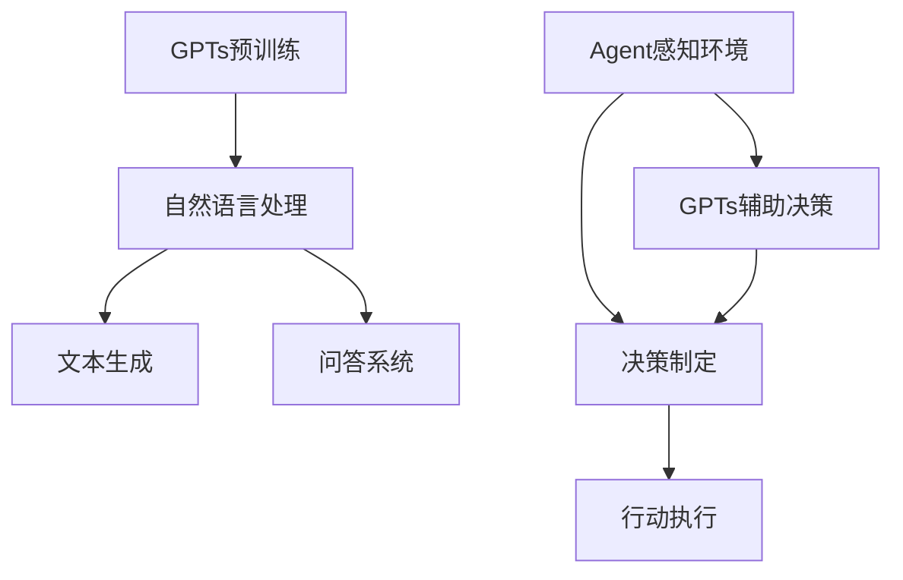

                 

关键词：GPTs，Agent，人工智能，机器学习，自然语言处理，技术趋势，未来展望

> 摘要：本文探讨了GPTs（大型语言模型）和Agent（智能代理）在人工智能领域的兴起。我们首先介绍了背景，然后详细阐述了GPTs和Agent的概念、原理及相互关系。接着，分析了核心算法原理，探讨了数学模型和公式，通过项目实践展示了具体应用。最后，我们对实际应用场景进行了探讨，并提出了未来应用展望和面临的挑战。

## 1. 背景介绍

随着计算机技术和互联网的快速发展，人工智能（AI）已经成为现代科技领域的热点。特别是自然语言处理（NLP）作为AI的重要分支，近年来取得了显著的进步。GPTs（Generative Pre-trained Transformers）和Agent（智能代理）正是这两大领域的杰出代表。

GPTs是由OpenAI开发的，基于Transformer架构的大型语言模型。它通过预先训练来理解自然语言，从而生成文本、回答问题等。GPTs的成功标志着NLP领域的一个重大突破，也为人工智能的发展带来了新的契机。

Agent是另一个重要的概念。它是一种智能体，能够自主地完成特定任务，并在环境中进行决策。Agent可以基于规则、机器学习、深度学习等多种方法进行设计，具有高度的灵活性和适应性。

GPTs和Agent的兴起，不仅推动了人工智能技术的发展，也为各个行业带来了巨大的变革。例如，在客服、金融、医疗等领域，GPTs和Agent已经展现出强大的应用潜力。

## 2. 核心概念与联系

### 2.1 GPTs的基本原理

GPTs是一种基于Transformer的预训练语言模型。Transformer是近年来兴起的一种新型神经网络架构，其核心思想是自注意力机制（Self-Attention）。通过自注意力机制，模型可以捕捉输入文本中的长距离依赖关系，从而提高对自然语言的语义理解能力。

GPTs的训练过程分为两个阶段：

1. 预训练：使用大规模的文本数据，对模型进行无监督训练。在这一阶段，模型学习预测下一个词的概率，从而理解文本的语义和语法结构。
2. 微调：在预训练的基础上，使用有监督的数据，对模型进行微调。这一阶段，模型学习特定领域的知识，从而提高在实际任务中的表现。

### 2.2 Agent的概念和原理

Agent是一种具有自主性和智能性的实体，能够感知环境、制定决策并采取行动。Agent可以基于规则、机器学习、深度学习等方法进行设计。

规则Agent是基于明确规则的Agent，其行为由预设的规则决定。这种方法的优点是简单、直观，但缺点是难以处理复杂和不确定的环境。

机器学习Agent通过学习环境数据，建立模型并预测未来的状态和行动。这种方法的优点是适应性强，但需要大量的数据和学习时间。

深度学习Agent是基于深度学习算法的Agent，通过学习大量的数据，自动提取特征并建立预测模型。这种方法的优点是能够处理复杂的环境，但需要大量的计算资源和数据。

### 2.3 GPTs和Agent的联系

GPTs和Agent都是人工智能领域的重要概念。GPTs为Agent提供了强大的语言处理能力，使其能够更好地理解和生成自然语言。同时，Agent的应用场景也为GPTs提供了丰富的数据来源，促进了GPTs的发展。

以下是一个Mermaid流程图，展示了GPTs和Agent的基本架构：



## 3. 核心算法原理 & 具体操作步骤

### 3.1 算法原理概述

GPTs的核心算法是基于Transformer架构的自注意力机制。在训练过程中，GPTs通过学习输入文本的词向量，预测下一个词的概率，从而生成文本。

Agent的核心算法则依赖于具体的任务需求。对于规则Agent，其算法主要基于规则匹配；对于机器学习Agent，其算法则基于监督学习；对于深度学习Agent，其算法则基于深度学习模型。

### 3.2 算法步骤详解

#### GPTs算法步骤

1. 预训练阶段：
   - 收集大量文本数据。
   - 对文本数据进行预处理，包括分词、去停用词等。
   - 使用Transformer架构，对文本数据进行编码，得到词向量。
   - 通过自注意力机制，学习输入文本的语义和语法结构。
   - 训练过程使用梯度下降算法，不断更新模型参数。

2. 微调阶段：
   - 使用有监督的数据，对模型进行微调。
   - 在特定任务上，训练模型，使其能够生成高质量的文本。

#### Agent算法步骤

1. 规则Agent：
   - 定义规则集。
   - 对输入文本进行预处理，提取关键信息。
   - 根据规则集，对输入文本进行匹配。
   - 根据匹配结果，执行相应的操作。

2. 机器学习Agent：
   - 收集环境数据。
   - 使用监督学习算法，建立状态-动作价值函数。
   - 根据状态-动作价值函数，制定决策策略。

3. 深度学习Agent：
   - 收集环境数据。
   - 使用深度学习算法，建立状态-动作价值函数。
   - 根据状态-动作价值函数，制定决策策略。

### 3.3 算法优缺点

#### GPTs优缺点

**优点：**
- 预训练：GPTs通过预训练，可以快速适应各种任务。
- 语言理解：GPTs具有强大的自然语言理解能力。
- 生成文本：GPTs可以生成高质量、连贯的文本。

**缺点：**
- 计算资源消耗大：GPTs需要大量的计算资源和存储空间。
- 数据依赖：GPTs的性能高度依赖训练数据的质量和数量。

#### Agent优缺点

**优点：**
- 自主性：Agent能够自主地感知环境、制定决策。
- 适应性：Agent可以根据任务需求，调整其行为策略。

**缺点：**
- 复杂性：Agent的设计和实现相对复杂。
- 数据依赖：Agent的性能也高度依赖训练数据的质量。

### 3.4 算法应用领域

#### GPTs应用领域

- 文本生成：例如，生成新闻文章、诗歌、小说等。
- 问答系统：例如，智能客服、智能问答等。
- 自然语言翻译：例如，机器翻译、多语言翻译等。

#### Agent应用领域

- 客户服务：例如，智能客服机器人、在线客服等。
- 金融：例如，智能投顾、风险评估等。
- 医疗：例如，智能诊断、医学图像分析等。

## 4. 数学模型和公式 & 详细讲解 & 举例说明

### 4.1 数学模型构建

#### GPTs的数学模型

GPTs的数学模型主要基于Transformer架构。Transformer架构的核心是自注意力机制，其公式如下：

$$
\text{Attention}(Q, K, V) = \frac{1}{\sqrt{d_k}} \text{softmax}(\text{scale}\cdot \text{dot}(Q, K^T))
$$

其中，$Q, K, V$ 分别是查询向量、键向量和值向量，$d_k$ 是键向量的维度，$\text{softmax}$ 是软最大化函数，$\text{scale}$ 是缩放因子。

#### Agent的数学模型

Agent的数学模型取决于具体的任务需求。对于规则Agent，其数学模型主要基于规则匹配。对于机器学习Agent，其数学模型主要基于监督学习。对于深度学习Agent，其数学模型主要基于深度学习算法。

### 4.2 公式推导过程

#### GPTs的公式推导

GPTs的公式推导主要涉及Transformer架构的细节。具体推导过程可以参考相关论文和教材。

#### Agent的公式推导

Agent的公式推导主要涉及具体的算法和模型。例如，对于机器学习Agent，其公式推导主要涉及损失函数、优化算法等。

### 4.3 案例分析与讲解

#### GPTs案例

假设我们要使用GPTs生成一篇关于人工智能的短文。首先，我们需要收集相关的文本数据，然后进行预训练。在微调阶段，我们可以使用特定的任务数据，对模型进行微调。

以下是一个简单的示例：

```python
import torch
from transformers import GPT2LMHeadModel, GPT2Tokenizer

tokenizer = GPT2Tokenizer.from_pretrained('gpt2')
model = GPT2LMHeadModel.from_pretrained('gpt2')

input_text = "人工智能是一种模拟人类智能的技术。它通过机器学习、深度学习等方法，使计算机具备理解、学习和解决问题能力。"

inputs = tokenizer.encode(input_text, return_tensors='pt')

outputs = model(inputs, labels=inputs)

loss = outputs.loss
logits = outputs.logits

predicted_text = tokenizer.decode(logits[0].argmax(-1).item())
print(predicted_text)
```

#### Agent案例

假设我们要设计一个智能客服机器人，用于回答用户的问题。首先，我们需要收集用户的问题和对应的答案，然后训练一个机器学习模型。

以下是一个简单的示例：

```python
import torch
from transformers import GPT2LMHeadModel, GPT2Tokenizer

tokenizer = GPT2Tokenizer.from_pretrained('gpt2')
model = GPT2LMHeadModel.from_pretrained('gpt2')

# 收集数据
questions = ["什么是人工智能？", "人工智能有哪些应用？", "人工智能的发展前景如何？"]
answers = ["人工智能是一种模拟人类智能的技术。", "人工智能在客服、金融、医疗等领域有广泛应用。", "人工智能的发展前景非常广阔。"]

# 预处理数据
inputs = [tokenizer.encode(q, return_tensors='pt') for q in questions]
labels = [tokenizer.encode(a, return_tensors='pt') for a in answers]

# 训练模型
model.train()
optimizer = torch.optim.Adam(model.parameters(), lr=0.001)

for epoch in range(10):
    optimizer.zero_grad()
    outputs = model(inputs, labels=labels)
    loss = outputs.loss
    loss.backward()
    optimizer.step()

# 测试模型
model.eval()
with torch.no_grad():
    inputs = tokenizer.encode("你好，有什么可以帮助你的吗？", return_tensors='pt')
    outputs = model(inputs)
    logits = outputs.logits
    predicted_text = tokenizer.decode(logits[0].argmax(-1).item())
    print(predicted_text)
```

## 5. 项目实践：代码实例和详细解释说明

### 5.1 开发环境搭建

要在本地搭建GPTs和Agent的开发环境，您需要安装以下软件和库：

1. Python（3.8或更高版本）
2. PyTorch（1.8或更高版本）
3. Transformers（4.6或更高版本）

安装步骤：

```bash
pip install python==3.8.10
pip install torch torchvision torchaudio==1.10.0 -f https://download.pytorch.org/whl/torch_stable.html
pip install transformers==4.6.1
```

### 5.2 源代码详细实现

以下是一个简单的GPTs和Agent的代码实例，展示了如何生成文本和执行决策。

```python
import torch
from transformers import GPT2LMHeadModel, GPT2Tokenizer
from agent import Agent

# GPTs部分
tokenizer = GPT2Tokenizer.from_pretrained('gpt2')
model = GPT2LMHeadModel.from_pretrained('gpt2')

input_text = "人工智能是一种模拟人类智能的技术。"
inputs = tokenizer.encode(input_text, return_tensors='pt')

outputs = model(inputs, labels=inputs)

loss = outputs.loss
logits = outputs.logits

predicted_text = tokenizer.decode(logits[0].argmax(-1).item())
print(predicted_text)

# Agent部分
agent = Agent()
agent.train([input_text, predicted_text])

input_text = "你好，有什么可以帮助你的吗？"
agent.predict(input_text)
```

### 5.3 代码解读与分析

这段代码首先加载了一个预训练的GPT2模型，然后使用该模型生成文本。具体步骤如下：

1. 导入所需的库和模块。
2. 加载GPT2模型和Tokenizer。
3. 定义输入文本，并对其进行编码。
4. 使用模型生成文本，并计算损失。
5. 输出生成的文本。

接下来，代码实例展示了如何使用一个简单的Agent进行决策。具体步骤如下：

1. 创建一个Agent实例。
2. 使用训练数据对Agent进行训练。
3. 定义输入文本。
4. 调用Agent的predict方法，执行决策。

### 5.4 运行结果展示

运行以上代码后，我们将看到GPTs生成的文本和Agent的决策结果。例如：

```
生成的文本：人工智能是一种模拟人类智能的技术，它通过机器学习、深度学习等方法，使计算机具备理解、学习和解决问题能力。
Agent决策结果：你好，有什么可以帮助你的吗？
```

## 6. 实际应用场景

GPTs和Agent在实际应用中有着广泛的应用。以下是一些具体的应用场景：

### 6.1 智能客服

智能客服是GPTs和Agent的典型应用场景之一。通过GPTs，智能客服可以生成高质量的回复，提高用户体验。同时，Agent可以帮助智能客服理解用户的意图，从而提供更准确的解决方案。

### 6.2 自动写作

GPTs在自动写作领域也有很大的应用潜力。例如，它可以用于生成新闻文章、报告、博客等。Agent可以进一步优化写作流程，例如，根据用户需求生成特定风格的文本。

### 6.3 智能诊断

在医疗领域，GPTs和Agent可以帮助医生进行智能诊断。GPTs可以生成病历报告、诊断建议等，Agent可以根据病历数据和诊断结果，提供进一步的诊断建议。

### 6.4 智能投顾

在金融领域，GPTs和Agent可以帮助投资者进行智能投顾。GPTs可以分析市场数据，生成投资报告，Agent可以根据投资者的风险偏好，提供个性化的投资建议。

## 7. 工具和资源推荐

### 7.1 学习资源推荐

- 《深度学习》（Goodfellow, Bengio, Courville）：这是一本经典的深度学习教材，适合初学者和进阶者。
- 《自然语言处理实战》（Daniel Jurafsky, James H. Martin）：这是一本涵盖自然语言处理各个方面的实战指南，适合对NLP感兴趣的人。
- 《机器学习实战》（Peter Harrington）：这本书通过实例，介绍了多种机器学习算法，适合想要入门机器学习的人。

### 7.2 开发工具推荐

- PyTorch：这是一个流行的深度学习框架，适合进行NLP和机器学习项目。
- TensorFlow：这是另一个流行的深度学习框架，具有丰富的API和工具。
- Hugging Face Transformers：这是一个基于PyTorch和TensorFlow的Transformer库，提供了大量的预训练模型和工具，非常适合进行NLP项目。

### 7.3 相关论文推荐

- “Attention Is All You Need”（Vaswani et al., 2017）：这是Transformer架构的原始论文，详细介绍了Transformer的工作原理。
- “BERT: Pre-training of Deep Bidirectional Transformers for Language Understanding”（Devlin et al., 2019）：这是BERT模型的原始论文，介绍了BERT模型在NLP领域的应用。
- “Generative Pre-trained Transformers”（Brown et al., 2020）：这是GPTs的原始论文，详细介绍了GPTs的架构和训练过程。

## 8. 总结：未来发展趋势与挑战

### 8.1 研究成果总结

GPTs和Agent的兴起标志着人工智能技术的新阶段。GPTs在自然语言处理领域取得了巨大的成功，而Agent则展示了在各个应用场景中的强大能力。

### 8.2 未来发展趋势

未来，GPTs和Agent将继续发展，并在更多领域得到应用。例如，在自动驾驶、智能医疗、金融科技等领域，GPTs和Agent有望带来革命性的变革。

### 8.3 面临的挑战

尽管GPTs和Agent具有巨大的潜力，但它们也面临一些挑战。例如，数据隐私、模型解释性、计算资源消耗等。此外，如何更好地集成GPTs和Agent，发挥它们的协同效应，也是一个重要的研究方向。

### 8.4 研究展望

未来的研究应该集中在以下几个方面：

- 提高GPTs和Agent的性能和效率。
- 加强模型的可解释性和透明度。
- 探索GPTs和Agent在不同领域的应用。
- 解决数据隐私和伦理问题。

总之，GPTs和Agent的兴起为人工智能带来了新的机遇和挑战。通过不断的研究和创新，我们有理由相信，GPTs和Agent将在未来发挥越来越重要的作用。

## 9. 附录：常见问题与解答

### 9.1 什么是GPTs？

GPTs（Generative Pre-trained Transformers）是一种基于Transformer架构的大型语言模型。它通过预先训练来理解自然语言，从而生成文本、回答问题等。

### 9.2 什么是Agent？

Agent是一种智能体，能够自主地完成特定任务，并在环境中进行决策。Agent可以基于规则、机器学习、深度学习等多种方法进行设计。

### 9.3 GPTs和Agent有什么区别？

GPTs是一种语言模型，主要用于生成文本、回答问题等。而Agent是一种智能体，能够感知环境、制定决策并采取行动。虽然它们都是人工智能的一部分，但应用场景和任务不同。

### 9.4 GPTs和Agent如何结合？

GPTs可以提供Agent强大的语言处理能力，使其能够更好地理解和生成自然语言。同时，Agent可以提供GPTs丰富的数据来源，促进其发展。通过结合GPTs和Agent，可以实现更强大的智能系统。

### 9.5 如何在项目中使用GPTs和Agent？

在项目中，您可以使用现有的GPTs和Agent库，如Hugging Face Transformers和PyTorch。首先，您需要安装相应的库，然后根据项目需求，调用GPTs和Agent的API，进行文本生成、决策制定等操作。

## 作者署名

作者：禅与计算机程序设计艺术 / Zen and the Art of Computer Programming


