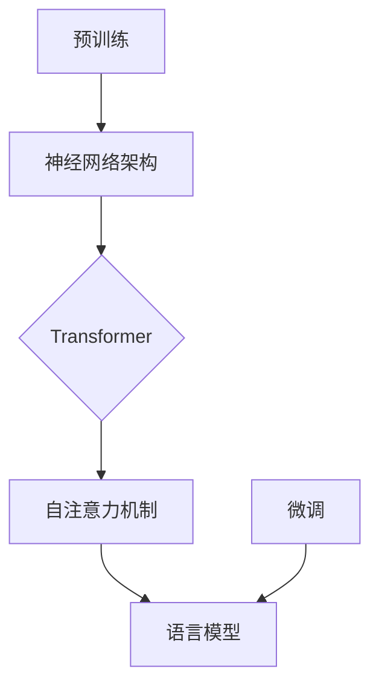

                 

关键词：GPT模型、架构演进、性能提升、神经网络、预训练、自然语言处理

> 摘要：本文将深入探讨GPT模型家族的演进过程，从核心架构出发，分析其性能提升的原理，并探讨其在自然语言处理领域的广泛应用和未来展望。

## 1. 背景介绍

GPT（Generative Pre-trained Transformer）模型，是自然语言处理领域的重要里程碑，由OpenAI提出并开源。GPT模型基于Transformer架构，通过预训练的方式学习语言的特征和规律，从而实现高质量的自然语言生成和文本理解任务。GPT模型家族包括多个版本，如GPT-1、GPT-2、GPT-3等，每个版本都在性能和功能上实现了显著的提升。

自然语言处理（NLP）是人工智能的一个重要分支，旨在使计算机能够理解和生成自然语言。传统的NLP方法主要依赖于规则和统计方法，如基于词典的解析、词频统计等。这些方法虽然在一定程度上提高了文本处理的能力，但面临词汇量有限、理解深度不足等问题。随着深度学习技术的发展，基于神经网络的NLP方法逐渐成为主流，其中Transformer架构由于其强大的建模能力和并行计算的优势，成为NLP领域的核心架构。

## 2. 核心概念与联系

GPT模型的核心概念包括预训练、微调和神经网络架构。预训练是指在大规模语料库上对模型进行训练，使其具备一定的语言理解能力。微调则是在预训练的基础上，针对特定任务进行训练，使模型能够适应不同的应用场景。神经网络架构方面，GPT模型采用了Transformer架构，这是一种基于自注意力机制的神经网络，能够有效捕捉文本中的长距离依赖关系。

下面是一个GPT模型的Mermaid流程图，展示了其核心概念的原理和架构：



## 3. 核心算法原理 & 具体操作步骤

### 3.1 算法原理概述

GPT模型的核心算法基于Transformer架构，其基本原理是自注意力机制。自注意力机制通过计算输入序列中每个单词对其他所有单词的重要性权重，从而捕捉文本中的长距离依赖关系。GPT模型通过预训练和微调两个阶段，学习语言的特征和规律。

### 3.2 算法步骤详解

1. **预训练**：GPT模型首先在大规模语料库上进行预训练，通过优化损失函数（如交叉熵损失），使模型能够生成连贯、自然的文本。预训练过程中，模型会自动学习词汇的分布、句法结构、语义关系等语言特征。

2. **微调**：在预训练的基础上，GPT模型会针对特定任务进行微调。微调过程通过在特定任务的数据集上进行训练，使模型能够适应不同的应用场景。微调过程中，模型会进一步优化参数，以实现更好的任务性能。

### 3.3 算法优缺点

**优点**：

- **强大的语言理解能力**：GPT模型通过预训练和微调，能够学习到丰富的语言特征，从而在文本生成、文本分类、问答系统等任务上表现出色。
- **高效的并行计算**：Transformer架构基于自注意力机制，能够实现高效的并行计算，从而加快模型的训练和推理速度。

**缺点**：

- **计算资源需求高**：GPT模型需要大量的计算资源和存储空间，特别是在预训练阶段，这对硬件设施和预算提出了较高的要求。
- **训练时间长**：GPT模型的训练时间较长，尤其是在大规模数据集上训练时，需要较长的计算时间。

### 3.4 算法应用领域

GPT模型在自然语言处理领域具有广泛的应用，包括但不限于以下几个方面：

- **文本生成**：GPT模型能够生成高质量的自然语言文本，广泛应用于对话系统、文章写作、机器翻译等领域。
- **文本分类**：GPT模型能够对文本进行分类，用于情感分析、新闻分类、垃圾邮件检测等任务。
- **问答系统**：GPT模型能够回答用户提出的问题，应用于智能客服、知识图谱构建等领域。
- **语言翻译**：GPT模型能够进行高质量的语言翻译，应用于机器翻译、跨语言文本分析等领域。

## 4. 数学模型和公式 & 详细讲解 & 举例说明

### 4.1 数学模型构建

GPT模型的数学模型主要包括自注意力机制和前馈神经网络。自注意力机制通过计算输入序列中每个单词对其他所有单词的重要性权重，从而实现文本的编码和解码。前馈神经网络则用于对输入序列进行进一步的建模和预测。

### 4.2 公式推导过程

设输入序列为 $x_1, x_2, ..., x_n$，对应的权重矩阵为 $W$，自注意力机制的计算公式为：

$$
\text{Attention}(Q, K, V) = \text{softmax}\left(\frac{QK^T}{\sqrt{d_k}}\right) V
$$

其中，$Q$、$K$ 和 $V$ 分别是查询向量、键向量和值向量，$d_k$ 是键向量的维度。前馈神经网络的计算公式为：

$$
\text{FFN}(x) = \text{ReLU}(W_2 \text{ReLU}(W_1 x + b_1))
$$

其中，$W_1$ 和 $W_2$ 是前馈神经网络的权重矩阵，$b_1$ 是偏置项。

### 4.3 案例分析与讲解

假设我们有一个简单的输入序列 $x = \{1, 2, 3, 4, 5\}$，首先对输入序列进行编码，得到编码后的序列 $e = \{e_1, e_2, ..., e_n\}$。然后，根据自注意力机制计算每个单词对其他所有单词的重要性权重，得到权重矩阵 $W$。最后，根据权重矩阵和编码后的序列，生成预测序列 $y$。

具体步骤如下：

1. 编码：对输入序列进行编码，得到编码后的序列 $e$。

$$
e = \text{Encoder}(x) = \{e_1, e_2, ..., e_n\}
$$

2. 自注意力：计算每个单词对其他所有单词的重要性权重，得到权重矩阵 $W$。

$$
W = \text{Attention}(e, e, e)
$$

3. 预测：根据权重矩阵和编码后的序列，生成预测序列 $y$。

$$
y = \text{Decoder}(W, e)
$$

## 5. 项目实践：代码实例和详细解释说明

### 5.1 开发环境搭建

1. 安装Python和PyTorch：在本地计算机上安装Python环境和PyTorch库。

2. 准备数据集：下载并解压一个适用于GPT模型的语料库，如wikipedia。

### 5.2 源代码详细实现

以下是一个简单的GPT模型实现示例：

```python
import torch
import torch.nn as nn
import torch.optim as optim

# 定义GPT模型
class GPTModel(nn.Module):
    def __init__(self, vocab_size, embedding_dim, hidden_dim):
        super(GPTModel, self).__init__()
        self.embedding = nn.Embedding(vocab_size, embedding_dim)
        self.transformer = nn.Transformer(embedding_dim, hidden_dim)
        self.fc = nn.Linear(hidden_dim, vocab_size)

    def forward(self, x):
        x = self.embedding(x)
        x = self.transformer(x)
        x = self.fc(x)
        return x

# 模型参数
vocab_size = 1000
embedding_dim = 256
hidden_dim = 512

# 实例化模型、损失函数和优化器
model = GPTModel(vocab_size, embedding_dim, hidden_dim)
criterion = nn.CrossEntropyLoss()
optimizer = optim.Adam(model.parameters(), lr=0.001)

# 训练模型
for epoch in range(10):
    for batch in data_loader:
        optimizer.zero_grad()
        x, y = batch
        y_hat = model(x)
        loss = criterion(y_hat, y)
        loss.backward()
        optimizer.step()

# 预测
with torch.no_grad():
    x_test = torch.tensor([[1, 2, 3, 4, 5]])
    y_pred = model(x_test)
    print(y_pred)
```

### 5.3 代码解读与分析

上述代码实现了一个简单的GPT模型，包括模型定义、训练和预测三个部分。

1. **模型定义**：GPTModel类继承自nn.Module，定义了模型的架构，包括嵌入层、Transformer层和输出层。

2. **训练过程**：在训练过程中，使用交叉熵损失函数和Adam优化器，对模型进行迭代训练，优化模型参数。

3. **预测过程**：在预测过程中，使用训练好的模型对输入序列进行编码和预测，得到输出结果。

## 6. 实际应用场景

GPT模型在实际应用中表现出色，以下是一些实际应用场景：

- **文本生成**：GPT模型能够生成高质量的自然语言文本，广泛应用于文章写作、对话系统等领域。

- **文本分类**：GPT模型能够对文本进行分类，用于情感分析、新闻分类、垃圾邮件检测等任务。

- **问答系统**：GPT模型能够回答用户提出的问题，应用于智能客服、知识图谱构建等领域。

- **语言翻译**：GPT模型能够进行高质量的语言翻译，应用于机器翻译、跨语言文本分析等领域。

## 7. 工具和资源推荐

为了更好地学习和应用GPT模型，以下是一些推荐的工具和资源：

- **学习资源**：

  - 《自然语言处理综论》（刘知远 著）：这是一本关于自然语言处理的经典教材，涵盖了NLP的基本概念、技术和应用。

  - 《深度学习与自然语言处理》（吴恩达 著）：这是一本关于深度学习和NLP的入门教材，适合初学者入门。

- **开发工具**：

  - PyTorch：这是一个开源的深度学习框架，提供了丰富的API和工具，方便开发者构建和训练GPT模型。

  - TensorFlow：这是一个由谷歌开发的开源深度学习框架，也适用于构建和训练GPT模型。

- **相关论文**：

  - “Attention Is All You Need”（Vaswani et al., 2017）：这是Transformer架构的原始论文，详细介绍了Transformer的工作原理和设计思路。

  - “Improving Language Understanding by Generative Pre-Training”（Radford et al., 2018）：这是GPT模型的原始论文，介绍了GPT模型的架构和预训练方法。

## 8. 总结：未来发展趋势与挑战

GPT模型在自然语言处理领域取得了显著成果，但仍面临一些挑战和机遇。

### 8.1 研究成果总结

- **性能提升**：随着模型的规模和参数数量的增加，GPT模型的性能得到了显著提升，在文本生成、文本分类、问答系统等领域取得了优异的效果。
- **泛化能力增强**：通过预训练和微调，GPT模型能够适应不同的应用场景，展现出较强的泛化能力。
- **推理能力提高**：GPT模型能够进行高效的推理和生成，提高了自然语言处理任务的效率和准确性。

### 8.2 未来发展趋势

- **模型压缩**：为了降低模型的计算资源和存储需求，模型压缩技术将成为研究的热点，如知识蒸馏、剪枝、量化等。
- **多模态融合**：随着多模态数据的广泛应用，如何将自然语言处理与其他模态数据（如图像、音频）进行有效融合，是未来研究的一个重要方向。
- **解释性和可解释性**：提高模型的解释性和可解释性，使其更加透明和可信，是未来研究的一个重要挑战。

### 8.3 面临的挑战

- **计算资源需求**：GPT模型需要大量的计算资源和存储空间，这对硬件设施和预算提出了较高的要求。
- **数据隐私和安全**：自然语言处理应用中涉及大量的用户数据，如何保护用户隐私和安全，是未来研究的一个重要挑战。
- **伦理和社会影响**：随着自然语言处理技术的广泛应用，如何避免技术滥用和歧视，以及确保技术公平性和透明性，是未来研究的一个重要方向。

### 8.4 研究展望

未来，GPT模型在自然语言处理领域将继续发挥重要作用，推动技术进步和应用创新。通过不断优化模型架构、提高计算效率和降低成本，GPT模型将在更多领域得到广泛应用，为人类带来更多便利和价值。

## 9. 附录：常见问题与解答

### Q：GPT模型为什么能够提升自然语言处理性能？

A：GPT模型通过预训练和微调，学习到丰富的语言特征和规律，从而在自然语言处理任务中表现出优异的性能。预训练阶段，模型在大规模语料库上学习语言的基本特征；微调阶段，模型在特定任务数据集上优化参数，提高任务性能。

### Q：如何优化GPT模型的计算效率？

A：优化GPT模型的计算效率可以从以下几个方面入手：

1. 模型压缩：使用知识蒸馏、剪枝、量化等技术，降低模型的参数数量和计算复杂度。
2. 并行计算：利用GPU等硬件加速器，实现模型的并行计算，提高训练和推理速度。
3. 超参数调优：通过调优学习率、批量大小等超参数，提高模型的收敛速度和性能。

### Q：GPT模型在多模态任务中有何优势？

A：GPT模型在多模态任务中具有以下优势：

1. **强大的文本建模能力**：GPT模型能够对文本进行高效的建模和生成，从而在多模态任务中发挥重要作用。
2. **灵活的融合方式**：GPT模型可以通过多种方式与其他模态数据（如图像、音频）进行融合，实现多模态特征的有效整合。
3. **广泛的适用性**：GPT模型可以应用于多种多模态任务，如文本生成、文本分类、问答系统等。

## 作者署名

作者：禅与计算机程序设计艺术 / Zen and the Art of Computer Programming

本文由禅与计算机程序设计艺术（Zen and the Art of Computer Programming）撰写，旨在深入探讨GPT模型家族的演进过程、核心算法原理及其在自然语言处理领域的应用。文章内容仅供参考，如有错误或不足之处，欢迎指正。感谢您的阅读！

