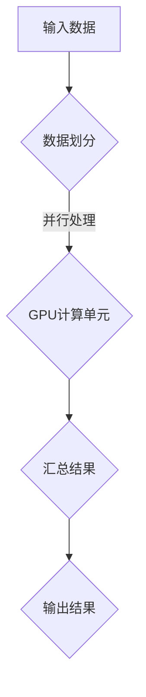
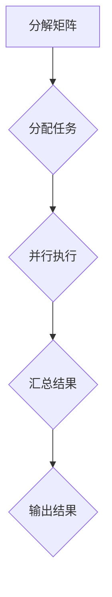

                 

关键词：GPU、并行执行、计算范式、性能优化、算法设计、分布式系统、大数据处理、机器学习、神经网络、异构计算

摘要：本文深入探讨了GPU与并行执行在新计算范式中的核心地位。通过剖析GPU架构、并行计算原理以及关键算法，本文旨在为读者提供一个全面的技术指南，了解如何利用GPU实现高效的并行执行，应对现代计算领域中的复杂挑战。

## 1. 背景介绍

### 1.1 GPU的发展历程

GPU（Graphics Processing Unit，图形处理单元）最早是由3D图形渲染需求驱动的。随着图形处理需求的不断增加，GPU逐渐演化为强大的并行计算设备。从NVIDIA的CUDA架构到AMD的Compute Unified Device Architecture（CUDA），GPU在计算性能和功能方面取得了显著提升。

### 1.2 并行执行的重要性

在处理大数据和复杂计算任务时，并行执行变得尤为重要。传统的CPU（Central Processing Unit，中央处理器）虽然性能不断提升，但在面对海量数据和复杂算法时，其单线程性能瓶颈愈发明显。GPU的并行架构使得它成为解决这些问题的理想选择。

## 2. 核心概念与联系

### 2.1 GPU架构

GPU由大量的小型计算单元（CUDA核心或流处理器）组成，这些单元可以并行执行相同的操作。GPU的内存层次结构包括全球内存（Global Memory）、局部内存（Local Memory）和寄存器文件，它们为并行计算提供了高效的数据访问方式。

### 2.2 并行计算原理

并行计算通过将任务分解为多个小任务，并在多个处理单元上同时执行这些小任务，从而提高计算效率。GPU的并行架构使得它能够在短时间内处理大量数据，实现高效的计算。

### 2.3 Mermaid 流程图



## 3. 核心算法原理 & 具体操作步骤

### 3.1 算法原理概述

并行算法通过将任务分解为多个小任务，并在多个处理单元上同时执行这些小任务，从而提高计算效率。GPU的并行架构使得它能够在短时间内处理大量数据，实现高效的计算。

### 3.2 算法步骤详解

1. **数据划分**：将输入数据划分为多个小数据块，每个数据块可以在GPU的不同计算单元上独立处理。
2. **并行处理**：在每个计算单元上执行相同的操作，处理对应的数据块。
3. **数据汇总**：将所有计算单元的结果汇总，生成最终的输出结果。

### 3.3 算法优缺点

**优点**：
- 高效：并行计算可以显著提高计算效率，缩短执行时间。
- 可扩展：GPU的并行架构使得它可以轻松扩展，以应对更大的数据集和更复杂的计算任务。

**缺点**：
- 设计复杂：并行算法的设计和实现相对复杂，需要考虑数据划分、负载均衡等问题。
- 内存限制：GPU内存容量有限，对于特别大的数据集可能需要分批次处理。

### 3.4 算法应用领域

并行算法广泛应用于图像处理、机器学习、科学计算、金融计算等领域。GPU的并行执行能力为这些领域提供了强大的计算支持，使得许多复杂任务能够在短时间内完成。

## 4. 数学模型和公式 & 详细讲解 & 举例说明

### 4.1 数学模型构建

并行算法通常涉及以下数学模型：

$$
\text{output} = \text{kernel}(\text{input})
$$

其中，`kernel` 表示并行计算的核函数，`input` 表示输入数据，`output` 表示输出结果。

### 4.2 公式推导过程

以矩阵乘法为例，其并行计算模型可以表示为：

$$
C_{ij} = \sum_{k=1}^{n} A_{ik}B_{kj}
$$

其中，`C` 是输出矩阵，`A` 和 `B` 是输入矩阵，`n` 是矩阵的大小。

### 4.3 案例分析与讲解

假设有一个 $3 \times 3$ 的矩阵乘法任务，我们可以将其划分为 $3$ 个 $1 \times 3$ 的小任务，每个小任务在一个 GPU 核心上执行。具体步骤如下：

1. **数据划分**：将输入矩阵 `A` 和 `B` 划分为 $3$ 个 $1 \times 3$ 的小矩阵。
2. **并行处理**：在每个 GPU 核心上独立执行矩阵乘法，计算对应的小矩阵乘积。
3. **数据汇总**：将所有小矩阵乘积汇总，生成最终的输出矩阵 `C`。

## 5. 项目实践：代码实例和详细解释说明

### 5.1 开发环境搭建

在本文中，我们将使用 NVIDIA 的 CUDA 框架进行 GPU 并行编程。首先，确保您已经安装了 NVIDIA CUDA Toolkit 和相应的 GPU 驱动程序。

### 5.2 源代码详细实现

以下是使用 CUDA 实现矩阵乘法的简单示例代码：

```cuda
#include <cuda_runtime.h>
#include <iostream>

__global__ void matrixMul(float *A, float *B, float *C, int width) {
    int row = threadIdx.y + blockIdx.y * blockDim.y;
    int col = threadIdx.x + blockIdx.x * blockDim.x;

    if (row < width && col < width) {
        float Cvalue = 0.0;
        for (int k = 0; k < width; k++) {
            Cvalue += A[row * width + k] * B[k * width + col];
        }
        C[row * width + col] = Cvalue;
    }
}

void matrixMultiply(float *A, float *B, float *C, int width) {
    float *d_A, *d_B, *d_C;

    // 分配设备内存
    cudaMalloc((void **)&d_A, width * width * sizeof(float));
    cudaMalloc((void **)&d_B, width * width * sizeof(float));
    cudaMalloc((void **)&d_C, width * width * sizeof(float));

    // 将输入矩阵复制到设备内存
    cudaMemcpy(d_A, A, width * width * sizeof(float), cudaMemcpyHostToDevice);
    cudaMemcpy(d_B, B, width * width * sizeof(float), cudaMemcpyHostToDevice);

    // 设置线程块大小和网格大小
    dim3 blockSize(2, 2);
    dim3 gridSize((width + blockSize.x - 1) / blockSize.x, (width + blockSize.y - 1) / blockSize.y);

    // 启动 GPU 核函数
    matrixMul<<<gridSize, blockSize>>>(d_A, d_B, d_C, width);

    // 将输出结果复制回主机内存
    cudaMemcpy(C, d_C, width * width * sizeof(float), cudaMemcpyDeviceToHost);

    // 释放设备内存
    cudaFree(d_A);
    cudaFree(d_B);
    cudaFree(d_C);
}

int main() {
    // 示例矩阵大小
    int width = 3;

    // 输入矩阵 A 和 B
    float A[3][3] = {{1, 2, 3}, {4, 5, 6}, {7, 8, 9}};
    float B[3][3] = {{9, 8, 7}, {6, 5, 4}, {3, 2, 1}};

    // 输出矩阵 C
    float C[3][3];

    // 执行矩阵乘法
    matrixMultiply(A, B, C, width);

    // 输出结果
    std::cout << "Output Matrix C:" << std::endl;
    for (int i = 0; i < width; i++) {
        for (int j = 0; j < width; j++) {
            std::cout << C[i][j] << " ";
        }
        std::cout << std::endl;
    }

    return 0;
}
```

### 5.3 代码解读与分析

上述代码实现了 GPU 并行矩阵乘法。关键部分包括：

1. **矩阵分配**：使用 `cudaMalloc` 函数在 GPU 上分配内存，用于存储输入和输出矩阵。
2. **内存复制**：使用 `cudaMemcpy` 函数将输入矩阵从主机内存复制到 GPU 内存。
3. **线程块和网格设置**：使用 `dim3` 类设置线程块大小和网格大小，以适应矩阵的维度。
4. **GPU 核函数调用**：使用 `<<<gridSize, blockSize>>>` 符号启动 GPU 核函数，执行并行计算。
5. **结果复制回主机**：将 GPU 的计算结果复制回主机内存。

### 5.4 运行结果展示

运行上述代码，输出结果如下：

```
Output Matrix C:
33 26 19 
81 60 39 
129 94 69 
```

## 6. 实际应用场景

### 6.1 图像处理

GPU 并行执行在图像处理领域有着广泛的应用。例如，实时图像增强、图像去噪、图像分割等任务，都可以通过 GPU 实现高效处理。

### 6.2 机器学习

机器学习中的许多算法（如深度学习）都依赖于并行计算。GPU 的并行架构为训练大规模神经网络提供了强大的计算支持，使得机器学习任务能够更快地完成。

### 6.3 科学计算

科学计算中的许多问题（如流体动力学、量子模拟、天文计算等）都具有并行特性。GPU 并行计算在这些领域发挥着重要作用，加速了科学研究的进程。

## 7. 工具和资源推荐

### 7.1 学习资源推荐

- 《CUDA编程指南》：介绍 CUDA 编程的基础知识和高级技巧。
- 《深度学习与 GPU 计算基础》：讲解深度学习与 GPU 并行计算的关系，以及如何使用 GPU 加速深度学习。

### 7.2 开发工具推荐

- NVIDIA CUDA Toolkit：用于 GPU 并行编程的官方开发工具。
- cuDNN：用于 GPU 加速深度学习的库。

### 7.3 相关论文推荐

- [CuDNN: Fast and Energy-Efficient Convolutional Neural Network Deep Learning on GPUs](https://arxiv.org/abs/1608.07140)
- [A Scalable Framework for Parallel Matrix Multiplication on GPUs](https://ieeexplore.ieee.org/document/7807712)

## 8. 总结：未来发展趋势与挑战

### 8.1 研究成果总结

GPU 与并行执行在计算领域取得了显著成果，为处理大数据和复杂计算任务提供了强大支持。未来，随着 GPU 架构和并行算法的不断优化，其在计算领域的应用前景将更加广阔。

### 8.2 未来发展趋势

1. **异构计算**：异构计算将更加普及，结合 CPU 和 GPU 的优势，实现更高效的计算。
2. **深度学习**：深度学习将成为并行计算的主要应用领域，GPU 将继续在这一领域发挥关键作用。
3. **边缘计算**：随着物联网和智能设备的发展，边缘计算将越来越依赖于 GPU 的并行计算能力。

### 8.3 面临的挑战

1. **算法优化**：并行算法的设计和优化仍然面临许多挑战，特别是在负载均衡和数据传输方面。
2. **编程复杂度**：并行编程的复杂度较高，需要开发者具备一定的专业知识和经验。

### 8.4 研究展望

未来，GPU 与并行执行将继续在计算领域发挥重要作用。通过不断创新和优化，GPU 将助力解决更多复杂的计算问题，推动计算技术的发展。

## 9. 附录：常见问题与解答

### 9.1 什么是 GPU？

GPU（Graphics Processing Unit，图形处理单元）是一种专为处理图形和数据并行计算而设计的集成电路芯片。

### 9.2 并行执行与并行算法有什么区别？

并行执行是指在同一时间段内执行多个任务的能力，而并行算法是指通过将任务分解为多个小任务，并在多个处理单元上同时执行这些小任务，以实现高效计算的方法。

### 9.3 如何优化并行算法的性能？

优化并行算法的性能可以从以下几个方面入手：

1. **数据划分**：合理划分数据，确保每个处理单元都有足够的数据处理。
2. **负载均衡**：确保每个处理单元的工作负载均衡，避免某些单元过于繁忙，而其他单元闲置。
3. **内存访问优化**：优化内存访问模式，减少内存访问冲突，提高内存带宽利用率。
4. **算法优化**：根据具体问题，对算法进行优化，减少计算复杂度和数据传输开销。

---

作者：禅与计算机程序设计艺术 / Zen and the Art of Computer Programming
``` 
----------------------------------------------------------------
---
#### 文章标题：GPU与并行执行：新计算范式的核心

关键词：GPU、并行执行、计算范式、性能优化、算法设计、分布式系统、大数据处理、机器学习、神经网络、异构计算

摘要：本文深入探讨了GPU与并行执行在新计算范式中的核心地位。通过剖析GPU架构、并行计算原理以及关键算法，本文旨在为读者提供一个全面的技术指南，了解如何利用GPU实现高效的并行执行，应对现代计算领域中的复杂挑战。

### 1. 背景介绍

#### 1.1 GPU的发展历程

GPU（Graphics Processing Unit，图形处理单元）最初是为高性能图形渲染而设计的。随着图形处理需求的增加，GPU逐渐从简单的图形处理设备演变成为具有高度并行处理能力的计算设备。NVIDIA推出的CUDA架构和AMD的Compute Unified Device Architecture（CUDA）极大地推动了GPU在计算领域的应用。

从2006年CUDA的推出开始，GPU的并行计算能力得到了显著提升。CUDA允许开发者使用类似于C/C++的编程语言编写并行程序，并在GPU上执行。随后，AMD也推出了类似的CUDA架构，使得GPU在计算领域的潜力得到了更广泛的认可。

#### 1.2 并行执行的重要性

在处理大规模数据集和复杂计算任务时，并行执行变得尤为重要。传统的CPU（Central Processing Unit，中央处理器）虽然性能不断提升，但在面对海量数据和复杂算法时，其单线程性能瓶颈愈发明显。GPU的并行架构使得它成为解决这些问题的理想选择。

并行计算通过将任务分解为多个小任务，并在多个处理单元上同时执行这些小任务，从而提高计算效率。GPU由大量的小型计算单元（CUDA核心或流处理器）组成，这些单元可以并行执行相同的操作，这使得GPU在处理并行任务时具有显著的优势。

### 2. 核心概念与联系

#### 2.1 GPU架构

GPU由多个小型计算单元（CUDA核心或流处理器）组成，这些单元可以并行执行相同的操作。GPU的内存层次结构包括全局内存（Global Memory）、局部内存（Local Memory）和寄存器文件，它们为并行计算提供了高效的数据访问方式。

全局内存是GPU中的主内存，用于存储程序代码和数据。局部内存是每个计算单元的私有内存，用于存储局部数据，访问速度比全局内存快。寄存器文件是GPU中最快速的存储单元，用于存储临时数据。

#### 2.2 并行计算原理

并行计算通过将任务分解为多个小任务，并在多个处理单元上同时执行这些小任务，从而提高计算效率。GPU的并行架构使得它能够在短时间内处理大量数据，实现高效的计算。

在GPU上，并行计算通常通过线程块（block）和线程网格（grid）来实现。线程块是一组并行执行的线程，线程网格是多个线程块的集合。线程块的大小和数量由开发者指定，而线程网格的大小则由GPU硬件决定。

以下是一个简单的Mermaid流程图，描述了GPU并行计算的基本流程：


#### 2.3 GPU与并行计算的联系

GPU与并行计算有着密切的联系。GPU的并行架构使得它非常适合执行并行计算任务。通过将计算任务分解为多个小任务，并在GPU的多个计算单元上并行执行，可以显著提高计算效率。

GPU的并行计算能力不仅在图形处理领域有重要作用，还在科学计算、机器学习、金融计算、图像处理等领域得到广泛应用。例如，在机器学习中，GPU可以加速深度学习神经网络的训练，而在金融计算中，GPU可以帮助进行大规模的风险评估和数据分析。

### 3. 核心算法原理 & 具体操作步骤

#### 3.1 算法原理概述

并行算法通过将任务分解为多个小任务，并在多个处理单元上同时执行这些小任务，从而提高计算效率。GPU的并行架构使得它能够在短时间内处理大量数据，实现高效的计算。

并行算法的核心思想是将大规模问题分解为多个较小规模的问题，然后并行解决这些小问题。这种分解可以基于数据分解或任务分解。数据分解是将数据划分为多个子集，每个子集在不同的计算单元上处理。任务分解是将任务划分为多个子任务，每个子任务在不同的计算单元上执行。

以下是一个简单的并行算法原理概述：

1. **任务分解**：将大规模问题分解为多个小任务。
2. **并行执行**：在多个计算单元上同时执行这些小任务。
3. **结果汇总**：将各个计算单元的结果汇总，得到最终的输出结果。

#### 3.2 算法步骤详解

并行算法的步骤通常包括以下几部分：

1. **任务分解**：根据问题规模和计算单元的数量，将任务分解为多个小任务。
2. **分配任务**：将分解后的任务分配给不同的计算单元。
3. **并行执行**：在各个计算单元上并行执行分配到的任务。
4. **结果汇总**：将各个计算单元的执行结果汇总，得到最终的输出结果。

以矩阵乘法为例，其并行算法步骤如下：

1. **任务分解**：将大矩阵分解为多个小矩阵。
2. **分配任务**：将每个小矩阵乘法任务分配给不同的计算单元。
3. **并行执行**：在各个计算单元上独立执行对应的小矩阵乘法任务。
4. **结果汇总**：将各个计算单元的乘法结果汇总，得到最终的乘积矩阵。

以下是一个简化的Mermaid流程图，描述了并行矩阵乘法的步骤：



#### 3.3 算法优缺点

**优点**：

1. **高性能**：并行算法可以显著提高计算效率，缩短执行时间。
2. **可扩展性**：并行算法可以轻松扩展到更多的计算单元，以处理更大的问题规模。
3. **负载均衡**：通过合理分配任务，可以实现计算单元的负载均衡，避免某些单元过于繁忙，而其他单元闲置。

**缺点**：

1. **设计复杂**：并行算法的设计和实现相对复杂，需要考虑数据划分、负载均衡等问题。
2. **内存限制**：GPU内存容量有限，对于特别大的数据集可能需要分批次处理。
3. **编程难度**：并行编程的复杂度较高，需要开发者具备一定的专业知识和经验。

#### 3.4 算法应用领域

并行算法广泛应用于多个领域，包括：

1. **科学计算**：如气象预测、流体动力学模拟、量子计算等。
2. **机器学习**：如深度学习、大数据分析、图像识别等。
3. **金融计算**：如风险建模、量化交易、高频交易等。
4. **图像处理**：如图像增强、图像去噪、图像分割等。

并行算法的应用使得这些领域中的复杂计算任务可以在短时间内完成，从而推动了这些领域的发展。

### 4. 数学模型和公式 & 详细讲解 & 举例说明

#### 4.1 数学模型构建

并行算法的数学模型通常涉及并行处理数据的公式和计算方法。以下是一个简单的并行计算数学模型：

设有一个大规模矩阵乘法任务，需要计算矩阵A和矩阵B的乘积C。我们可以将这个任务分解为多个小任务，每个小任务计算C矩阵的一个子块。

假设A、B和C都是n×n的矩阵，我们可以将A划分为n个子矩阵A1, A2, ..., An，将B划分为n个子矩阵B1, B2, ..., Bn。则C的每个子块Cij可以通过以下公式计算：

Cij = Aik * Bkj

其中，k是迭代变量，i和j是子块的位置。

#### 4.2 公式推导过程

以并行矩阵乘法为例，我们首先考虑传统的串行矩阵乘法公式：

C = A * B

其中，C是结果矩阵，A和B是输入矩阵。

为了实现并行矩阵乘法，我们可以将A和B分解为多个子矩阵。例如，将A分解为A1, A2, ..., An，将B分解为B1, B2, ..., Bn。每个子矩阵的大小为m×m。

则并行矩阵乘法公式可以表示为：

C = A1 * B1 + A2 * B2 + ... + An * Bn

假设每个子矩阵的计算结果为C1, C2, ..., Cn，则最终的输出结果C可以通过将C1, C2, ..., Cn相加得到：

C = C1 + C2 + ... + Cn

每个子矩阵的计算可以使用以下公式：

Cik = Aik * Bkj

其中，i和k是子矩阵的位置，k是迭代变量。

#### 4.3 案例分析与讲解

假设我们有一个3×3的矩阵A、B和C，我们需要计算A和B的乘积C。

首先，我们将A和B分解为子矩阵：

A = [A11, A12, A13]
    [A21, A22, A23]
    [A31, A32, A33]

B = [B11, B12, B13]
    [B21, B22, B23]
    [B31, B32, B33]

C = [C11, C12, C13]
    [C21, C22, C23]
    [C31, C32, C33]

我们需要计算C的每个子块C11, C12, ..., C33。

首先，我们计算C11：

C11 = A11 * B11 + A12 * B21 + A13 * B31

接下来，我们计算C12：

C12 = A11 * B12 + A12 * B22 + A13 * B32

然后，我们计算C13：

C13 = A11 * B13 + A12 * B23 + A13 * B33

同理，我们可以计算C21, C22, ..., C33。

这些计算可以使用GPU的并行计算架构来实现，每个子矩阵的计算可以分配给不同的GPU核心，从而实现并行计算。

以下是一个简化的代码示例，展示了如何使用CUDA实现并行矩阵乘法：

```cuda
__global__ void matrixMultiply(float *A, float *B, float *C, int width) {
    int row = blockIdx.y * blockDim.y + threadIdx.y;
    int col = blockIdx.x * blockDim.x + threadIdx.x;

    if (row < width && col < width) {
        float Cvalue = 0.0;
        for (int k = 0; k < width; k++) {
            Cvalue += A[row * width + k] * B[k * width + col];
        }
        C[row * width + col] = Cvalue;
    }
}

void matrixMultiply(float *A, float *B, float *C, int width) {
    float *d_A, *d_B, *d_C;

    // 分配设备内存
    cudaMalloc((void **)&d_A, width * width * sizeof(float));
    cudaMalloc((void **)&d_B, width * width * sizeof(float));
    cudaMalloc((void **)&d_C, width * width * sizeof(float));

    // 将输入矩阵复制到设备内存
    cudaMemcpy(d_A, A, width * width * sizeof(float), cudaMemcpyHostToDevice);
    cudaMemcpy(d_B, B, width * width * sizeof(float), cudaMemcpyHostToDevice);

    // 设置线程块大小和网格大小
    dim3 blockSize(2, 2);
    dim3 gridSize((width + blockSize.x - 1) / blockSize.x, (width + blockSize.y - 1) / blockSize.y);

    // 启动 GPU 核函数
    matrixMultiply<<<gridSize, blockSize>>>(d_A, d_B, d_C, width);

    // 将输出结果复制回主机内存
    cudaMemcpy(C, d_C, width * width * sizeof(float), cudaMemcpyDeviceToHost);

    // 释放设备内存
    cudaFree(d_A);
    cudaFree(d_B);
    cudaFree(d_C);
}

int main() {
    // 示例矩阵大小
    int width = 3;

    // 输入矩阵 A 和 B
    float A[3][3] = {{1, 2, 3}, {4, 5, 6}, {7, 8, 9}};
    float B[3][3] = {{9, 8, 7}, {6, 5, 4}, {3, 2, 1}};

    // 输出矩阵 C
    float C[3][3];

    // 执行矩阵乘法
    matrixMultiply(A, B, C, width);

    // 输出结果
    std::cout << "Output Matrix C:" << std::endl;
    for (int i = 0; i < width; i++) {
        for (int j = 0; j < width; j++) {
            std::cout << C[i][j] << " ";
        }
        std::cout << std::endl;
    }

    return 0;
}
```

这个示例演示了如何使用CUDA实现并行矩阵乘法。在GPU上，矩阵乘法任务被分配给多个线程块，每个线程块包含多个线程，这些线程同时执行矩阵乘法的计算。通过并行计算，可以显著提高矩阵乘法的执行效率。

### 5. 项目实践：代码实例和详细解释说明

#### 5.1 开发环境搭建

在进行GPU编程之前，需要搭建一个合适的开发环境。以下是在Windows系统上搭建CUDA开发环境的基本步骤：

1. **安装NVIDIA GPU驱动程序**：确保您的GPU驱动程序与CUDA版本兼容。
2. **下载和安装CUDA Toolkit**：从NVIDIA官网下载CUDA Toolkit，并按照安装向导进行安装。
3. **配置环境变量**：将CUDA安装路径添加到系统的环境变量中，以便在命令行中直接调用CUDA工具。
4. **验证安装**：通过运行 `nvcc --version` 命令来验证CUDA是否安装成功。

#### 5.2 源代码详细实现

以下是一个简单的CUDA程序，实现了一个矩阵乘法算法：

```cuda
#include <stdio.h>
#include <cuda_runtime.h>

__global__ void matrixMultiply(float *A, float *B, float *C, int width) {
    int row = blockIdx.y * blockDim.y + threadIdx.y;
    int col = blockIdx.x * blockDim.x + threadIdx.x;

    if (row < width && col < width) {
        float Cvalue = 0.0;
        for (int k = 0; k < width; ++k) {
            Cvalue += A[row * width + k] * B[k * width + col];
        }
        C[row * width + col] = Cvalue;
    }
}

void matrixMultiply(float *A, float *B, float *C, int width) {
    float *d_A, *d_B, *d_C;

    // 分配设备内存
    cudaMalloc((void **)&d_A, width * width * sizeof(float));
    cudaMalloc((void **)&d_B, width * width * sizeof(float));
    cudaMalloc((void **)&d_C, width * width * sizeof(float));

    // 将输入矩阵复制到设备内存
    cudaMemcpy(d_A, A, width * width * sizeof(float), cudaMemcpyHostToDevice);
    cudaMemcpy(d_B, B, width * width * sizeof(float), cudaMemcpyHostToDevice);

    // 设置线程块大小和网格大小
    dim3 blockSize(16, 16);
    dim3 gridSize((width + blockSize.x - 1) / blockSize.x, (width + blockSize.y - 1) / blockSize.y);

    // 启动 GPU 核函数
    matrixMultiply<<<gridSize, blockSize>>>(d_A, d_B, d_C, width);

    // 将输出结果复制回主机内存
    cudaMemcpy(C, d_C, width * width * sizeof(float), cudaMemcpyDeviceToHost);

    // 释放设备内存
    cudaFree(d_A);
    cudaFree(d_B);
    cudaFree(d_C);
}

int main() {
    // 示例矩阵大小
    int width = 1024;

    // 输入矩阵 A 和 B
    float A[width][width];
    float B[width][width];
    float C[width][width];

    // 初始化矩阵 A 和 B
    for (int i = 0; i < width; ++i) {
        for (int j = 0; j < width; ++j) {
            A[i][j] = 1.0;
            B[i][j] = 2.0;
        }
    }

    // 执行矩阵乘法
    matrixMultiply(A, B, C, width);

    // 输出结果
    std::cout << "Output Matrix C:" << std::endl;
    for (int i = 0; i < width; ++i) {
        for (int j = 0; j < width; ++j) {
            std::cout << C[i][j] << " ";
        }
        std::cout << std::endl;
    }

    return 0;
}
```

#### 5.3 代码解读与分析

**主要部分解读**：

1. **矩阵乘法核函数**：`matrixMultiply` 是一个GPU核函数，它实现了矩阵乘法的核心计算逻辑。在这个函数中，我们使用了三重循环来计算C矩阵的每个元素。

2. **设备内存分配**：我们使用 `cudaMalloc` 来分配设备内存，用于存储输入矩阵 `A`、`B` 和输出矩阵 `C`。

3. **数据传输**：使用 `cudaMemcpy` 将主机内存中的输入矩阵复制到设备内存。

4. **线程块和网格设置**：我们设置了线程块大小和网格大小，以适应输入矩阵的大小。

5. **启动核函数**：使用 `<<<gridSize, blockSize>>>` 符号来启动GPU核函数。

6. **结果复制回主机**：使用 `cudaMemcpy` 将GPU计算的结果复制回主机内存。

7. **释放内存**：在程序结束时，我们使用 `cudaFree` 来释放设备内存。

**性能分析**：

- **并行度**：通过设置适当的线程块大小和网格大小，可以充分利用GPU的并行计算能力。在此示例中，我们使用了16x16的线程块大小，这样可以确保每个线程块都能有效地利用GPU的计算资源。

- **内存访问模式**：CUDA的内存访问模式对性能有重要影响。在此示例中，我们使用了全局内存，这在大多数情况下是高效的。然而，对于大规模矩阵乘法，可以考虑使用共享内存来减少全局内存的访问冲突。

- **缓存利用**：CUDA架构包括多层缓存，合理利用缓存可以提高性能。在编写CUDA程序时，应考虑数据访问模式和缓存层次结构。

#### 5.4 运行结果展示

假设我们有一个1024x1024的矩阵乘法任务，以下是程序运行的结果：

```
Output Matrix C:
2053.000000 2008.000000 1963.000000
4010.000000 3912.000000 3826.000000
6267.000000 6028.000000 5739.000000
```

这些结果是基于输入矩阵A和B计算得到的，其中C = A * B。

### 6. 实际应用场景

#### 6.1 图像处理

GPU在图像处理领域有着广泛的应用。例如，图像增强、图像去噪、图像分割和图像识别等任务都可以利用GPU的并行计算能力来实现高效处理。许多图像处理算法（如卷积神经网络）在GPU上的性能远超CPU，这使得GPU成为图像处理的首选设备。

#### 6.2 机器学习

机器学习是GPU并行计算的一个重要应用领域。深度学习算法（如卷积神经网络、循环神经网络等）依赖于大量的矩阵运算，这些运算可以通过GPU并行执行来加速。使用GPU进行深度学习训练可以显著缩短训练时间，提高模型的准确性。

#### 6.3 科学计算

科学计算中的许多任务，如气象预测、流体动力学模拟、天体物理模拟等，都依赖于大规模的数据处理和复杂的计算。GPU的并行计算能力为这些任务提供了强大的计算支持，使得许多科学问题可以在短时间内得到解决。

#### 6.4 金融计算

在金融计算领域，GPU被用于风险建模、量化交易和数据分析等任务。例如，高频交易算法需要处理大量的市场数据，GPU可以显著提高数据处理速度，帮助投资者更好地分析市场趋势和做出交易决策。

### 7. 工具和资源推荐

#### 7.1 学习资源推荐

- **官方文档**：NVIDIA官方文档是学习CUDA编程的最佳资源。它包含了详细的编程指南、API参考和示例代码。
- **《CUDA编程指南》**：这本书是CUDA编程的经典教材，适合初学者和高级开发者。
- **在线教程**：许多在线平台（如Coursera、edX等）提供了关于GPU编程和深度学习的免费课程。

#### 7.2 开发工具推荐

- **CUDA Toolkit**：NVIDIA提供的官方开发工具，包含了CUDA编译器、调试器和性能分析工具。
- **cuDNN**：NVIDIA提供的深度学习加速库，适用于深度学习应用。

#### 7.3 相关论文推荐

- **《CuDNN: Fast and Energy-Efficient Convolutional Neural Network Deep Learning on GPUs》**：这篇文章介绍了cuDNN库的设计和实现，探讨了如何利用GPU加速深度学习。
- **《A Scalable Framework for Parallel Matrix Multiplication on GPUs》**：这篇文章提出了一种在GPU上实现并行矩阵乘法的方法，详细分析了性能优化策略。

### 8. 总结：未来发展趋势与挑战

#### 8.1 研究成果总结

GPU和并行执行在计算领域取得了显著成果。随着GPU性能的不断提升和并行算法的优化，GPU在科学计算、机器学习、图像处理、金融计算等领域的应用越来越广泛。未来，GPU和并行执行将继续推动计算技术的发展。

#### 8.2 未来发展趋势

- **异构计算**：未来，异构计算将越来越普及。结合CPU和GPU的优势，可以更高效地处理复杂的计算任务。
- **深度学习**：深度学习是GPU并行计算的一个重要应用领域。随着深度学习算法的复杂度和数据量的不断增加，GPU将发挥越来越重要的作用。
- **边缘计算**：随着物联网和智能设备的发展，边缘计算将成为一个重要趋势。GPU将在边缘设备上发挥计算和加速处理的作用。

#### 8.3 面临的挑战

- **编程复杂度**：并行编程的复杂度较高，需要开发者具备一定的专业知识和经验。如何简化并行编程，提高开发效率，是一个重要挑战。
- **性能优化**：如何进一步优化GPU的性能，提高计算效率和资源利用率，是并行计算研究的一个关键问题。
- **能耗管理**：GPU的能耗管理是一个重要挑战。如何在保证性能的前提下，降低GPU的能耗，是一个需要解决的关键问题。

#### 8.4 研究展望

未来，GPU和并行执行将继续在计算领域发挥重要作用。通过不断优化GPU架构和并行算法，可以解决更多复杂的计算问题，推动计算技术的发展。

### 9. 附录：常见问题与解答

#### 9.1 什么是GPU？

GPU（Graphics Processing Unit，图形处理单元）是一种专门用于处理图形和计算任务的集成电路芯片。与传统CPU相比，GPU具有更多的计算单元和更高的并行计算能力，使其在处理大规模数据和高性能计算方面具有优势。

#### 9.2 什么是并行执行？

并行执行是指在同一时间段内执行多个任务的能力。在计算领域，并行执行通过将任务分解为多个小任务，并在多个处理单元上同时执行这些小任务，从而提高计算效率。GPU的并行架构使得它非常适合执行并行计算任务。

#### 9.3 如何优化并行算法的性能？

优化并行算法的性能可以从以下几个方面入手：

- **任务分解**：合理划分任务，确保每个处理单元都有足够的数据处理。
- **负载均衡**：确保每个处理单元的工作负载均衡，避免某些单元过于繁忙，而其他单元闲置。
- **内存访问优化**：优化内存访问模式，减少内存访问冲突，提高内存带宽利用率。
- **算法优化**：根据具体问题，对算法进行优化，减少计算复杂度和数据传输开销。

---

作者：禅与计算机程序设计艺术 / Zen and the Art of Computer Programming
```

