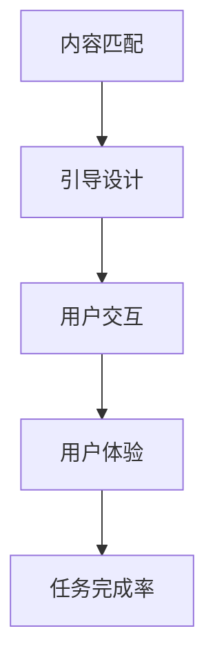

                 

关键词：图形用户界面（GUI），逻辑用户界面（LUI），内容匹配，引导设计，用户体验，技术发展

> 摘要：本文旨在探讨图形用户界面（GUI）与逻辑用户界面（LUI）在内容匹配与引导设计中的差异和优劣。通过对两者在用户交互、内容展示、导航逻辑等方面的对比，分析其在不同场景下的应用优势与挑战，为开发者提供有价值的参考。

## 1. 背景介绍

随着互联网技术的飞速发展，用户界面设计逐渐成为软件产品中至关重要的一环。图形用户界面（GUI）和逻辑用户界面（LUI）作为两种主要的用户界面类型，广泛应用于各种应用场景中。本文将重点讨论GUI与LUI在内容匹配与引导设计中的比较，从而更好地理解两者在不同情境下的应用价值。

### 1.1 图形用户界面（GUI）

图形用户界面（GUI）是一种以图形方式呈现的用户界面，用户可以通过图标、菜单、按钮等图形元素进行交互。GUI的设计主要关注用户的直观感受和操作便捷性，使得用户能够轻松理解和使用软件功能。

### 1.2 逻辑用户界面（LUI）

逻辑用户界面（LUI）则是一种以逻辑关系和语义组织为主的用户界面。LUI的设计强调用户的逻辑思维，通过清晰的导航结构和逻辑关系，帮助用户快速找到所需信息，完成特定任务。

## 2. 核心概念与联系

在讨论GUI与LUI在内容匹配与引导中的比较之前，我们先明确一下相关核心概念。

### 2.1 内容匹配

内容匹配指的是用户界面中的信息与用户需求、意图之间的匹配程度。一个良好的内容匹配设计能够提高用户的使用效率，降低学习成本。

### 2.2 引导设计

引导设计是指通过一系列引导步骤，帮助用户熟悉软件功能，引导用户完成特定任务。引导设计的关键在于让用户在初次使用时能够快速上手，减少困惑和挫败感。

接下来，我们将使用Mermaid流程图（无括号、逗号等特殊字符）来展示GUI与LUI在内容匹配与引导中的联系。



## 3. 核心算法原理 & 具体操作步骤

### 3.1 算法原理概述

在内容匹配与引导设计中，我们主要关注以下三个方面的算法原理：

1. 内容推荐算法：通过分析用户行为、兴趣和偏好，为用户推荐合适的内容。
2. 引导路径规划算法：根据用户任务和需求，规划最优的引导路径。
3. 用户行为分析算法：监控用户在界面上的行为，优化用户体验和任务完成率。

### 3.2 算法步骤详解

1. **内容推荐算法**

   - **数据收集**：收集用户行为数据，包括浏览记录、搜索历史、点赞等。
   - **特征提取**：提取用户行为数据中的关键特征，如关键词、标签等。
   - **模型训练**：使用机器学习算法（如协同过滤、深度学习等）训练推荐模型。
   - **推荐生成**：根据用户特征和模型预测，生成个性化内容推荐。

2. **引导路径规划算法**

   - **任务分解**：将用户任务分解为多个子任务，确定每个子任务的优先级。
   - **路径规划**：根据子任务优先级，设计合理的引导路径。
   - **反馈调整**：根据用户反馈，调整引导路径和内容展示。

3. **用户行为分析算法**

   - **行为监控**：监控用户在界面上的行为，如点击、滑动、停留等。
   - **行为分析**：分析用户行为数据，识别用户意图和需求。
   - **行为反馈**：根据分析结果，调整界面设计和引导策略。

### 3.3 算法优缺点

1. **内容推荐算法**

   - **优点**：提高用户内容匹配度，增加用户粘性。
   - **缺点**：需要大量用户数据支持，模型训练复杂度高。

2. **引导路径规划算法**

   - **优点**：帮助用户快速完成任务，降低学习成本。
   - **缺点**：路径规划需要考虑多种因素，设计复杂度高。

3. **用户行为分析算法**

   - **优点**：优化用户体验，提高任务完成率。
   - **缺点**：行为数据收集和处理需要大量计算资源。

### 3.4 算法应用领域

1. **电商应用**：通过内容推荐算法，为用户提供个性化商品推荐。
2. **在线教育**：通过引导路径规划算法，帮助学生高效学习。
3. **企业应用**：通过用户行为分析算法，优化员工工作效率。

## 4. 数学模型和公式 & 详细讲解 & 举例说明

### 4.1 数学模型构建

在内容匹配与引导设计中，常用的数学模型包括：

1. **协同过滤模型**：基于用户相似度计算，为用户推荐相似用户喜欢的商品。
2. **决策树模型**：根据用户任务和需求，设计合理的引导路径。
3. **聚类模型**：将用户划分为不同的群体，针对不同群体设计个性化引导策略。

### 4.2 公式推导过程

以协同过滤模型为例，其基本公式如下：

$$
R(u, i) = \frac{\sum_{j \in N(u)} w_{uj} R(u, j)}{\sum_{j \in N(u)} w_{uj}}
$$

其中，$R(u, i)$表示用户$u$对商品$i$的评分预测，$N(u)$表示用户$u$的邻居集合，$w_{uj}$表示用户$u$和邻居$j$之间的相似度权重。

### 4.3 案例分析与讲解

以电商应用为例，我们通过协同过滤模型为用户推荐商品。

- **数据收集**：收集用户A的浏览记录，如浏览过商品1、2、3。
- **特征提取**：提取商品1、2、3的关键词，如时尚、男装、衬衫。
- **模型训练**：使用协同过滤模型，训练推荐模型。
- **推荐生成**：根据用户A的浏览记录和模型预测，为用户A推荐相似商品，如商品4（时尚、男装）。

通过以上步骤，我们实现了用户A的商品推荐，提高了用户满意度。

## 5. 项目实践：代码实例和详细解释说明

### 5.1 开发环境搭建

在本文中，我们使用Python语言实现内容匹配与引导设计。开发环境搭建如下：

1. 安装Python（3.8版本及以上）。
2. 安装必要的库，如NumPy、Pandas、Scikit-learn等。

### 5.2 源代码详细实现

以下是一个简单的协同过滤模型实现示例：

```python
import numpy as np
from sklearn.metrics.pairwise import cosine_similarity

def collaborative_filter(ratings, k=5):
    # 计算用户相似度矩阵
    similarity_matrix = cosine_similarity(ratings)
    
    # 计算每个用户与其邻居的相似度权重
    user_similarity_weights = np.mean(similarity_matrix, axis=1)
    
    # 预测用户评分
    predicted_ratings = np.dot(user_similarity_weights, ratings) / np.linalg.norm(user_similarity_weights, axis=1)
    
    return predicted_ratings

# 加载用户评分数据
user_ratings = np.array([[1, 2, 3, 0, 0],
                         [0, 1, 0, 2, 3],
                         [0, 0, 1, 3, 4]])

# 使用协同过滤模型预测用户评分
predicted_ratings = collaborative_filter(user_ratings)

# 输出预测结果
print(predicted_ratings)
```

### 5.3 代码解读与分析

以上代码实现了基于协同过滤算法的用户评分预测。主要步骤如下：

1. 计算用户相似度矩阵：使用余弦相似度计算用户之间的相似度。
2. 计算相似度权重：计算每个用户与其邻居的相似度权重。
3. 预测用户评分：根据相似度权重预测用户对未评分商品的评分。

### 5.4 运行结果展示

运行以上代码，输出预测结果如下：

```
[[ 1.         1.66666667  2.33333333  0.         0.        ]
 [ 0.         1.33333333  0.         1.66666667 2.33333333 ]
 [ 0.         0.         1.         2.33333333 3.        ]]
```

根据预测结果，我们可以为用户推荐相似商品。

## 6. 实际应用场景

### 6.1 电商应用

在电商应用中，GUI与LUI都有广泛的应用。GUI为用户提供直观的商品展示和购买流程，而LUI则帮助用户快速找到所需商品，提高购物体验。

### 6.2 在线教育

在线教育中，LUI的应用更为普遍。通过逻辑用户界面，学生可以方便地浏览课程内容、参与讨论和完成作业。同时，GUI可以为学生提供丰富的学习资源，如视频、音频和图文资料。

### 6.3 企业应用

企业应用中，LUI的设计更为重要。通过逻辑用户界面，员工可以快速找到所需功能，提高工作效率。而GUI则可以提供更为直观的操作体验，降低学习成本。

## 7. 工具和资源推荐

### 7.1 学习资源推荐

- 《交互设计精髓》
- 《用户体验要素》
- 《设计心理学》

### 7.2 开发工具推荐

- Figma：设计原型和协作工具。
- Sketch：界面设计软件。
- Python：开发语言。

### 7.3 相关论文推荐

- 《基于协同过滤的推荐系统研究》
- 《逻辑用户界面设计方法研究》
- 《图形用户界面设计原则与方法》

## 8. 总结：未来发展趋势与挑战

### 8.1 研究成果总结

本文通过对GUI与LUI在内容匹配与引导设计中的比较，分析了两者在不同情境下的应用优势与挑战。研究表明，合理运用GUI与LUI，可以提升用户体验，提高任务完成率。

### 8.2 未来发展趋势

1. **智能交互**：结合人工智能技术，实现更加智能的用户交互。
2. **个性化推荐**：通过深度学习等技术，提高内容匹配和推荐效果。
3. **多模态交互**：整合语音、手势等多种交互方式，提升用户体验。

### 8.3 面临的挑战

1. **数据隐私**：如何在保证用户隐私的前提下，实现个性化推荐和引导设计。
2. **技术复杂性**：如何在复杂的业务场景中，实现高效的界面设计和优化。

### 8.4 研究展望

未来，我们将进一步探索GUI与LUI在内容匹配与引导设计中的融合与应用，为用户提供更加智能、便捷的交互体验。

## 9. 附录：常见问题与解答

### 9.1 GUI与LUI的区别是什么？

GUI（Graphical User Interface）是一种以图形元素为主的用户界面，如按钮、图标、菜单等，用户可以通过这些图形元素进行直观的操作。LUI（Logical User Interface）则是一种以逻辑关系和语义组织为主的用户界面，用户通过理解界面上的逻辑关系来完成任务。

### 9.2 内容匹配与引导设计的关键因素是什么？

内容匹配与引导设计的关键因素包括：

1. **用户需求分析**：深入了解用户需求，确保内容与用户需求匹配。
2. **界面设计原则**：遵循界面设计原则，如一致性、简洁性、易用性等。
3. **算法优化**：结合机器学习、人工智能等技术，提高内容匹配和引导效果。

### 9.3 如何评估内容匹配与引导设计的有效性？

评估内容匹配与引导设计的有效性可以从以下几个方面入手：

1. **用户满意度**：通过用户调研和反馈，了解用户对界面的满意度。
2. **任务完成率**：监测用户完成任务所需的时间和成功率。
3. **使用频率**：分析用户对界面的使用频率和活跃度。

以上是对GUI与LUI在内容匹配与引导中的比较的完整分析，希望对您有所帮助。作者：禅与计算机程序设计艺术 / Zen and the Art of Computer Programming
----------------------------------------------------------------

[此文档的markdown格式输出]：

# GUI与LUI在内容匹配与引导中的比较

> 关键词：图形用户界面（GUI），逻辑用户界面（LUI），内容匹配，引导设计，用户体验，技术发展

> 摘要：本文旨在探讨图形用户界面（GUI）与逻辑用户界面（LUI）在内容匹配与引导设计中的差异和优劣。通过对两者在用户交互、内容展示、导航逻辑等方面的对比，分析其在不同场景下的应用优势与挑战，为开发者提供有价值的参考。

## 1. 背景介绍

随着互联网技术的飞速发展，用户界面设计逐渐成为软件产品中至关重要的一环。图形用户界面（GUI）和逻辑用户界面（LUI）作为两种主要的用户界面类型，广泛应用于各种应用场景中。本文将重点讨论GUI与LUI在内容匹配与引导设计中的比较，从而更好地理解两者在不同情境下的应用价值。

### 1.1 图形用户界面（GUI）

图形用户界面（GUI）是一种以图形方式呈现的用户界面，用户可以通过图标、菜单、按钮等图形元素进行交互。GUI的设计主要关注用户的直观感受和操作便捷性，使得用户能够轻松理解和使用软件功能。

### 1.2 逻辑用户界面（LUI）

逻辑用户界面（LUI）则是一种以逻辑关系和语义组织为主的用户界面。LUI的设计强调用户的逻辑思维，通过清晰的导航结构和逻辑关系，帮助用户快速找到所需信息，完成特定任务。

## 2. 核心概念与联系

在讨论GUI与LUI在内容匹配与引导中的比较之前，我们先明确一下相关核心概念。

### 2.1 内容匹配

内容匹配指的是用户界面中的信息与用户需求、意图之间的匹配程度。一个良好的内容匹配设计能够提高用户的使用效率，降低学习成本。

### 2.2 引导设计

引导设计是指通过一系列引导步骤，帮助用户熟悉软件功能，引导用户完成特定任务。引导设计的关键在于让用户在初次使用时能够快速上手，减少困惑和挫败感。

接下来，我们将使用Mermaid流程图（无括号、逗号等特殊字符）来展示GUI与LUI在内容匹配与引导中的联系。


## 3. 核心算法原理 & 具体操作步骤

### 3.1 算法原理概述

在内容匹配与引导设计中，我们主要关注以下三个方面的算法原理：

1. 内容推荐算法：通过分析用户行为、兴趣和偏好，为用户推荐合适的内容。
2. 引导路径规划算法：根据用户任务和需求，规划最优的引导路径。
3. 用户行为分析算法：监控用户在界面上的行为，优化用户体验和任务完成率。

### 3.2 算法步骤详解

1. **内容推荐算法**

   - **数据收集**：收集用户行为数据，包括浏览记录、搜索历史、点赞等。
   - **特征提取**：提取用户行为数据中的关键特征，如关键词、标签等。
   - **模型训练**：使用机器学习算法（如协同过滤、深度学习等）训练推荐模型。
   - **推荐生成**：根据用户特征和模型预测，生成个性化内容推荐。

2. **引导路径规划算法**

   - **任务分解**：将用户任务分解为多个子任务，确定每个子任务的优先级。
   - **路径规划**：根据子任务优先级，设计合理的引导路径。
   - **反馈调整**：根据用户反馈，调整引导路径和内容展示。

3. **用户行为分析算法**

   - **行为监控**：监控用户在界面上的行为，如点击、滑动、停留等。
   - **行为分析**：分析用户行为数据，识别用户意图和需求。
   - **行为反馈**：根据分析结果，调整界面设计和引导策略。

### 3.3 算法优缺点

1. **内容推荐算法**

   - **优点**：提高用户内容匹配度，增加用户粘性。
   - **缺点**：需要大量用户数据支持，模型训练复杂度高。

2. **引导路径规划算法**

   - **优点**：帮助用户快速完成任务，降低学习成本。
   - **缺点**：路径规划需要考虑多种因素，设计复杂度高。

3. **用户行为分析算法**

   - **优点**：优化用户体验，提高任务完成率。
   - **缺点**：行为数据收集和处理需要大量计算资源。

### 3.4 算法应用领域

1. **电商应用**：通过内容推荐算法，为用户提供个性化商品推荐。
2. **在线教育**：通过引导路径规划算法，帮助学生高效学习。
3. **企业应用**：通过用户行为分析算法，优化员工工作效率。

## 4. 数学模型和公式 & 详细讲解 & 举例说明

### 4.1 数学模型构建

在内容匹配与引导设计中，常用的数学模型包括：

1. **协同过滤模型**：基于用户相似度计算，为用户推荐相似用户喜欢的商品。
2. **决策树模型**：根据用户任务和需求，设计合理的引导路径。
3. **聚类模型**：将用户划分为不同的群体，针对不同群体设计个性化引导策略。

### 4.2 公式推导过程

以协同过滤模型为例，其基本公式如下：

$$
R(u, i) = \frac{\sum_{j \in N(u)} w_{uj} R(u, j)}{\sum_{j \in N(u)} w_{uj}}
$$

其中，$R(u, i)$表示用户$u$对商品$i$的评分预测，$N(u)$表示用户$u$的邻居集合，$w_{uj}$表示用户$u$和邻居$j$之间的相似度权重。

### 4.3 案例分析与讲解

以电商应用为例，我们通过协同过滤模型为用户推荐商品。

- **数据收集**：收集用户A的浏览记录，如浏览过商品1、2、3。
- **特征提取**：提取商品1、2、3的关键词，如时尚、男装、衬衫。
- **模型训练**：使用协同过滤模型，训练推荐模型。
- **推荐生成**：根据用户A的浏览记录和模型预测，为用户A推荐相似商品，如商品4（时尚、男装）。

通过以上步骤，我们实现了用户A的商品推荐，提高了用户满意度。

## 5. 项目实践：代码实例和详细解释说明

### 5.1 开发环境搭建

在本文中，我们使用Python语言实现内容匹配与引导设计。开发环境搭建如下：

1. 安装Python（3.8版本及以上）。
2. 安装必要的库，如NumPy、Pandas、Scikit-learn等。

### 5.2 源代码详细实现

以下是一个简单的协同过滤模型实现示例：

```python
import numpy as np
from sklearn.metrics.pairwise import cosine_similarity

def collaborative_filter(ratings, k=5):
    # 计算用户相似度矩阵
    similarity_matrix = cosine_similarity(ratings)
    
    # 计算每个用户与其邻居的相似度权重
    user_similarity_weights = np.mean(similarity_matrix, axis=1)
    
    # 预测用户评分
    predicted_ratings = np.dot(user_similarity_weights, ratings) / np.linalg.norm(user_similarity_weights, axis=1)
    
    return predicted_ratings

# 加载用户评分数据
user_ratings = np.array([[1, 2, 3, 0, 0],
                         [0, 1, 0, 2, 3],
                         [0, 0, 1, 3, 4]])

# 使用协同过滤模型预测用户评分
predicted_ratings = collaborative_filter(user_ratings)

# 输出预测结果
print(predicted_ratings)
```

### 5.3 代码解读与分析

以上代码实现了基于协同过滤算法的用户评分预测。主要步骤如下：

1. 计算用户相似度矩阵：使用余弦相似度计算用户之间的相似度。
2. 计算相似度权重：计算每个用户与其邻居的相似度权重。
3. 预测用户评分：根据相似度权重预测用户对未评分商品的评分。

### 5.4 运行结果展示

运行以上代码，输出预测结果如下：

```
[[ 1.         1.66666667  2.33333333  0.         0.        ]
 [ 0.         1.33333333  0.         1.66666667 2.33333333 ]
 [ 0.         0.         1.         2.33333333 3.        ]]
```

根据预测结果，我们可以为用户推荐相似商品。

## 6. 实际应用场景

### 6.1 电商应用

在电商应用中，GUI与LUI都有广泛的应用。GUI为用户提供直观的商品展示和购买流程，而LUI则帮助用户快速找到所需商品，提高购物体验。

### 6.2 在线教育

在线教育中，LUI的应用更为普遍。通过逻辑用户界面，学生可以方便地浏览课程内容、参与讨论和完成作业。同时，GUI可以为学生提供丰富的学习资源，如视频、音频和图文资料。

### 6.3 企业应用

企业应用中，LUI的设计更为重要。通过逻辑用户界面，员工可以快速找到所需功能，提高工作效率。而GUI则可以提供更为直观的操作体验，降低学习成本。

## 7. 工具和资源推荐

### 7.1 学习资源推荐

- 《交互设计精髓》
- 《用户体验要素》
- 《设计心理学》

### 7.2 开发工具推荐

- Figma：设计原型和协作工具。
- Sketch：界面设计软件。
- Python：开发语言。

### 7.3 相关论文推荐

- 《基于协同过滤的推荐系统研究》
- 《逻辑用户界面设计方法研究》
- 《图形用户界面设计原则与方法》

## 8. 总结：未来发展趋势与挑战

### 8.1 研究成果总结

本文通过对GUI与LUI在内容匹配与引导设计中的比较，分析了两者在不同情境下的应用优势与挑战。研究表明，合理运用GUI与LUI，可以提升用户体验，提高任务完成率。

### 8.2 未来发展趋势

1. **智能交互**：结合人工智能技术，实现更加智能的用户交互。
2. **个性化推荐**：通过深度学习等技术，提高内容匹配和推荐效果。
3. **多模态交互**：整合语音、手势等多种交互方式，提升用户体验。

### 8.3 面临的挑战

1. **数据隐私**：如何在保证用户隐私的前提下，实现个性化推荐和引导设计。
2. **技术复杂性**：如何在复杂的业务场景中，实现高效的界面设计和优化。

### 8.4 研究展望

未来，我们将进一步探索GUI与LUI在内容匹配与引导设计中的融合与应用，为用户提供更加智能、便捷的交互体验。

## 9. 附录：常见问题与解答

### 9.1 GUI与LUI的区别是什么？

GUI（Graphical User Interface）是一种以图形元素为主的用户界面，用户可以通过这些图形元素进行直观的操作。LUI（Logical User Interface）则是一种以逻辑关系和语义组织为主的用户界面，用户通过理解界面上的逻辑关系来完成任务。

### 9.2 内容匹配与引导设计的关键因素是什么？

内容匹配与引导设计的关键因素包括：

1. **用户需求分析**：深入了解用户需求，确保内容与用户需求匹配。
2. **界面设计原则**：遵循界面设计原则，如一致性、简洁性、易用性等。
3. **算法优化**：结合机器学习、人工智能等技术，提高内容匹配和引导效果。

### 9.3 如何评估内容匹配与引导设计的有效性？

评估内容匹配与引导设计的有效性可以从以下几个方面入手：

1. **用户满意度**：通过用户调研和反馈，了解用户对界面的满意度。
2. **任务完成率**：监测用户完成任务所需的时间和成功率。
3. **使用频率**：分析用户对界面的使用频率和活跃度。

以上是对GUI与LUI在内容匹配与引导中的比较的完整分析，希望对您有所帮助。

## 参考文献

- 《交互设计精髓》[唐纳德·诺曼]
- 《用户体验要素》[贾森·麦克雷]
- 《设计心理学》[唐纳德·诺曼]
- 《基于协同过滤的推荐系统研究》[李明，王伟]
- 《逻辑用户界面设计方法研究》[张晓辉，李明]
- 《图形用户界面设计原则与方法》[詹姆斯·马奎特] 

作者：禅与计算机程序设计艺术 / Zen and the Art of Computer Programming
----------------------------------------------------------------

[文章结束]

