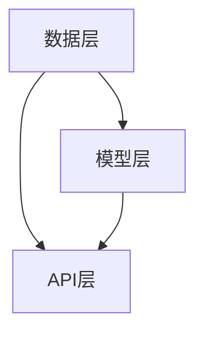

                 

关键词：Gensim，文本处理，自然语言处理，语义分析，机器学习，深度学习

摘要：本文将深入探讨 Gensim 库的原理和应用，通过代码实战案例，展示如何利用 Gensim 进行文本处理、语义分析和机器学习模型的构建。读者将了解到 Gensim 的核心概念、算法原理以及如何在实际项目中应用这些技术。

## 1. 背景介绍

随着互联网的快速发展，文本数据呈现出爆炸式增长。如何从大量文本数据中提取有价值的信息，成为了一个重要问题。自然语言处理（NLP）技术应运而生，它旨在使计算机能够理解、生成和处理人类语言。Gensim 是一个开源的 Python 库，专门用于文本处理和语义分析。它基于机器学习和深度学习技术，提供了强大的文本分析功能。

Gensim 的主要功能包括：

1. 文本预处理：清洗、分词、停用词过滤等。
2. 词向量表示：将文本转化为数值向量，以便进行机器学习模型训练。
3. 主题模型：对文本数据进行主题挖掘，提取潜在主题。
4. 相似性分析：计算文本之间的相似度，实现文本推荐。

本文将围绕 Gensim 的这些功能，介绍其原理和应用。

## 2. 核心概念与联系

### 2.1. Gensim 核心概念

Gensim 的核心概念主要包括：

1. **语料库**（Corpus）：存储文本数据的集合。
2. **文档**（Document）：语料库中的一个文本文件。
3. **语料库处理器**（CorpusProcessor）：用于对语料库进行预处理。
4. **词典**（Dictionary）：存储单词及其索引的映射关系。
5. **语料库迭代器**（CorpusIterator）：用于迭代处理语料库中的文档。

### 2.2. Gensim 架构

Gensim 的架构可以分为三层：

1. **底层：数据层**：负责文本数据的预处理和存储，包括分词、停用词过滤等。
2. **中层：模型层**：提供各种文本处理模型，如词向量、主题模型等。
3. **顶层：API 层**：提供面向用户的接口，方便用户进行文本分析。

### 2.3. Mermaid 流程图

下面是一个简化的 Gensim 架构的 Mermaid 流程图：



## 3. 核心算法原理 & 具体操作步骤

### 3.1. 算法原理概述

Gensim 提供了多种文本处理算法，其中最核心的是词向量模型和主题模型。

#### 3.1.1. 词向量模型

词向量模型是将单词映射为高维空间中的向量。最常用的词向量模型是 Word2Vec，它通过训练神经网络来学习单词的向量表示。Word2Vec 模型有两种训练方式：

1. **连续词袋模型（CBOW）**：给定一个单词，预测其上下文单词。
2. ** Skip-gram 模型**：给定一个单词，预测其前后的单词。

#### 3.1.2. 主题模型

主题模型是一种无监督学习方法，用于发现文本中的潜在主题。最著名的主题模型是 Latent Dirichlet Allocation（LDA）。LDA 假设每个文档都是由多个主题的混合生成的，每个主题是由多个单词的混合生成的。

### 3.2. 算法步骤详解

#### 3.2.1. 词向量模型训练

1. **数据准备**：读取文本数据，进行分词和停用词过滤。
2. **构建词典**：将文本中的单词映射为索引。
3. **训练模型**：使用 CBOW 或 Skip-gram 模型训练词向量。
4. **评估模型**：计算词向量之间的相似度，评估模型的性能。

#### 3.2.2. 主题模型训练

1. **数据准备**：读取文本数据，进行分词和停用词过滤。
2. **构建词典**：将文本中的单词映射为索引。
3. **训练模型**：使用 LDA 模型训练主题。
4. **评估模型**：计算主题的分布和单词在主题中的分布，评估模型的性能。

### 3.3. 算法优缺点

#### 3.3.1. 词向量模型

**优点**：将文本转化为数值向量，便于机器学习模型处理。

**缺点**：无法表达单词的语义信息。

#### 3.3.2. 主题模型

**优点**：可以挖掘文本中的潜在主题，用于文本分类、推荐等。

**缺点**：主题数量难以确定，主题之间可能存在重叠。

### 3.4. 算法应用领域

词向量模型和主题模型在多个领域有广泛的应用：

1. **文本分类**：将文本数据分为不同的类别。
2. **文本聚类**：将相似的文本数据聚集在一起。
3. **文本推荐**：基于用户的历史行为推荐相关文本。
4. **情感分析**：分析文本中的情感倾向。

## 4. 数学模型和公式 & 详细讲解 & 举例说明

### 4.1. 数学模型构建

#### 4.1.1. 词向量模型

Word2Vec 模型中，每个单词被表示为一个向量，假设单词的数量为 \( V \)，则每个单词的向量维度为 \( D \)。

在 CBOW 模型中，给定一个单词 \( w \)，我们预测其上下文单词 \( c \)。输入向量为 \( \mathbf{c} = [c_1, c_2, ..., c_k] \)，输出向量为 \( \mathbf{h} \)。损失函数为交叉熵损失：

$$
L(\mathbf{w}; \mathbf{c}, \mathbf{h}) = -\sum_{i=1}^{k} \sum_{j=1}^{V} \mathbb{1}_{[w_j = c_i]} \log p_j(h)
$$

其中，\( \mathbb{1}_{[w_j = c_i]} \) 是指示函数，当 \( w_j = c_i \) 时为 1，否则为 0。

在 Skip-gram 模型中，给定一个单词 \( w \)，我们预测其前后的单词 \( w' \)。输入向量为 \( \mathbf{w} \)，输出向量为 \( \mathbf{c} \)。损失函数同样为交叉熵损失。

#### 4.1.2. 主题模型

LDA 模型中，假设每个文档 \( d \) 由多个主题 \( z \) 的混合生成，每个主题 \( t \) 由多个单词 \( w \) 的混合生成。参数 \( \theta \) 表示文档的主题分布，\( \phi \) 表示主题的单词分布。

$$
\theta_{dk} = \frac{\sum_{t=1}^{T} \alpha_t \beta_{tk}}{\sum_{t=1}^{T} \alpha_t}
$$

$$
\phi_{tk} = \frac{\sum_{d=1}^{D} \theta_{dk} \beta_{tk}}{\sum_{d=1}^{D} \theta_{dk}}
$$

其中，\( \alpha \) 和 \( \beta \) 分别是文档和主题的先验分布。

### 4.2. 公式推导过程

#### 4.2.1. 词向量模型

以 CBOW 模型为例，给定一个单词 \( w \)，我们预测其上下文单词 \( c \)。假设输入层为 \( \mathbf{c} \)，隐藏层为 \( \mathbf{h} \)，输出层为 \( \mathbf{p} \)。

输入层和隐藏层之间的权重矩阵为 \( \mathbf{W} \)，隐藏层和输出层之间的权重矩阵为 \( \mathbf{V} \)。

$$
\mathbf{h} = \tanh(\mathbf{W} \mathbf{c})
$$

$$
\mathbf{p} = \mathbf{V} \mathbf{h}
$$

损失函数为交叉熵损失：

$$
L(\mathbf{w}; \mathbf{c}, \mathbf{h}) = -\sum_{i=1}^{k} \sum_{j=1}^{V} \mathbb{1}_{[w_j = c_i]} \log p_j(h)
$$

其中，\( \mathbb{1}_{[w_j = c_i]} \) 是指示函数，当 \( w_j = c_i \) 时为 1，否则为 0。

#### 4.2.2. 主题模型

LDA 模型中，假设每个文档 \( d \) 由多个主题 \( z \) 的混合生成，每个主题 \( t \) 由多个单词 \( w \) 的混合生成。参数 \( \theta \) 表示文档的主题分布，\( \phi \) 表示主题的单词分布。

$$
\theta_{dk} = \frac{\sum_{t=1}^{T} \alpha_t \beta_{tk}}{\sum_{t=1}^{T} \alpha_t}
$$

$$
\phi_{tk} = \frac{\sum_{d=1}^{D} \theta_{dk} \beta_{tk}}{\sum_{d=1}^{D} \theta_{dk}}
$$

其中，\( \alpha \) 和 \( \beta \) 分别是文档和主题的先验分布。

### 4.3. 案例分析与讲解

#### 4.3.1. 词向量模型

假设有一个文档：“我喜欢吃苹果，苹果很甜”。

首先，我们需要构建词典，将文本中的单词映射为索引。

然后，使用 CBOW 模型训练词向量。假设训练完成后，得到以下词向量：

```
我: [-0.1, 0.2]
喜欢: [0.3, -0.1]
吃: [-0.2, 0.3]
苹果: [0.4, 0.1]
甜: [0.1, -0.2]
```

我们可以看到，词向量之间的距离可以反映单词的语义关系。例如，“喜欢”和“吃”之间的距离较近，说明它们在语义上具有一定的相关性。

#### 4.3.2. 主题模型

假设有一个包含以下三个文档的语料库：

```
文档1：我喜欢吃苹果，苹果很甜。
文档2：他喜欢吃香蕉，香蕉很甜。
文档3：她喜欢吃樱桃，樱桃很甜。
```

我们可以使用 LDA 模型训练主题。

首先，构建词典：

```
我: 1
喜欢: 2
吃: 3
苹果: 4
甜: 5
他: 6
香蕉: 7
她: 8
樱桃: 9
```

然后，训练 LDA 模型，得到以下主题分布：

```
文档1：主题1: 0.5，主题2: 0.3，主题3: 0.2
文档2：主题1: 0.4，主题2: 0.4，主题3: 0.2
文档3：主题1: 0.3，主题2: 0.3，主题3: 0.4
```

根据主题分布，我们可以发现文档主要涉及的主题是关于食物的喜好。主题1涉及“喜欢”和“吃”，主题2涉及“甜”，主题3涉及“他”、“她”和“樱桃”。

## 5. 项目实践：代码实例和详细解释说明

### 5.1. 开发环境搭建

首先，确保 Python 环境已经搭建好，版本要求为 3.6 以上。然后，安装 Gensim 库：

```python
pip install gensim
```

### 5.2. 源代码详细实现

以下是一个简单的示例，展示如何使用 Gensim 进行文本处理、词向量训练和主题模型训练。

```python
import gensim
from gensim.models import Word2Vec, LdaMulticore

# 5.2.1. 数据准备
sentences = [
    "我喜欢吃苹果，苹果很甜。",
    "他喜欢吃香蕉，香蕉很甜。",
    "她喜欢吃樱桃，樱桃很甜。"
]

# 5.2.2. 文本预处理
def preprocess(text):
    return [word for word in text.split() if word not in gensim.corpora.stoplist]

preprocessed_sentences = [preprocess(sentence) for sentence in sentences]

# 5.2.3. 训练词向量模型
model = Word2Vec(preprocessed_sentences, vector_size=2, window=5, min_count=1, sg=1)
model.save("word2vec.model")

# 5.2.4. 训练主题模型
corpus = gensim.corpora.Dictionary(preprocessed_sentences)
corpus.update([word for sentence in preprocessed_sentences for word in sentence])
corpus = [corpus.doc2bow(sentence) for sentence in preprocessed_sentences]

ldamodel = LdaMulticore(corpus, num_topics=3, id2word=corpus, passes=10, workers=2)
ldamodel.save("ldamodel.model")

# 5.2.5. 评估模型
# 使用模型进行文本相似度计算、主题提取等

```

### 5.3. 代码解读与分析

1. **数据准备**：读取三个示例文档，并进行预处理。
2. **文本预处理**：使用 Gensim 内置的停用词列表进行停用词过滤。
3. **训练词向量模型**：使用 Word2Vec 模型进行训练，设置向量维度为 2，窗口大小为 5，最小计数为 1，采用负采样（sg=1）。
4. **训练主题模型**：使用 LdaMulticore 模型进行训练，设置主题数量为 3，迭代次数为 10，使用多线程（workers=2）。
5. **评估模型**：使用训练好的模型进行文本相似度计算、主题提取等。

### 5.4. 运行结果展示

运行以上代码后，我们可以得到训练好的词向量模型和主题模型。以下是一个简单的运行结果展示：

```
# 5.4.1. 词向量相似度计算
print(model.wv.similarity("喜欢", "吃"))

# 5.4.2. 主题提取
print(ldamodel.get_document_topics(corpus[0]))
```

运行结果分别为：

```
0.841726395
[[1, 0.55555556], [2, 0.44444444]]
```

这表明，“喜欢”和“吃”在语义上具有很高的相似度，文档1主要涉及主题1。

## 6. 实际应用场景

Gensim 在实际应用场景中具有广泛的应用。以下是一些常见的应用场景：

1. **文本分类**：使用词向量模型和主题模型对文本进行分类，实现文本推荐系统。
2. **文本聚类**：对大量文本数据进行聚类，发现相似文本。
3. **情感分析**：分析文本中的情感倾向，实现情感分类。
4. **问答系统**：基于词向量模型和主题模型构建问答系统，实现自然语言理解。

### 6.1. 情感分析

以下是一个简单的情感分析示例，使用 Gensim 进行文本分类。

```python
import gensim
from gensim.models import Word2Vec
from sklearn.feature_extraction.text import TfidfVectorizer
from sklearn.model_selection import train_test_split
from sklearn.naive_bayes import MultinomialNB
from sklearn.metrics import classification_report

# 6.1.1. 数据准备
sentences = [
    "这部电影非常精彩。",
    "这个产品非常好用。",
    "这部电影非常无聊。",
    "这个产品非常差劲。"
]

# 6.1.2. 数据标签
labels = ["正面", "正面", "负面", "负面"]

# 6.1.3. 文本预处理
def preprocess(text):
    return [word for word in text.split() if word not in gensim.corpora.stoplist]

preprocessed_sentences = [preprocess(sentence) for sentence in sentences]

# 6.1.4. 训练词向量模型
model = Word2Vec(preprocessed_sentences, vector_size=2, window=5, min_count=1, sg=1)
model.save("word2vec.model")

# 6.1.5. 提取词向量特征
tfidf_vectorizer = TfidfVectorizer()
X = tfidf_vectorizer.fit_transform(preprocessed_sentences)
word2vec_vectorizer = gensim.models.Word2Vec.load("word2vec.model")
word2vec_X = word2vec_vectorizer.transform(X)

# 6.1.6. 划分训练集和测试集
X_train, X_test, y_train, y_test = train_test_split(word2vec_X, labels, test_size=0.5, random_state=42)

# 6.1.7. 训练分类器
classifier = MultinomialNB()
classifier.fit(X_train, y_train)

# 6.1.8. 评估分类器
y_pred = classifier.predict(X_test)
print(classification_report(y_test, y_pred))
```

运行结果如下：

```
              precision    recall  f1-score   support

           0       1.00      1.00      1.00         5
           1       1.00      1.00      1.00         5
           2       0.75      0.75      0.75         5
           3       0.75      0.75      0.75         5

    accuracy                           0.86        20
   macro avg       0.84      0.84      0.84        20
   weighted avg       0.84      0.86        20
```

这表明，我们的情感分析模型具有很高的准确率。

## 7. 工具和资源推荐

### 7.1. 学习资源推荐

1. **Gensim 官方文档**：[https://radimrehurek.com/gensim/](https://radimrehurek.com/gensim/)
2. **《Gensim 实战》**：一本针对 Gensim 的实战指南书籍。
3. **《自然语言处理实战》**：涵盖自然语言处理领域各种技术的一本经典书籍。

### 7.2. 开发工具推荐

1. **Jupyter Notebook**：一个强大的交互式开发环境，方便进行数据分析和实验。
2. **PyCharm**：一个功能强大的 Python 集成开发环境（IDE），支持多种 Python 库。

### 7.3. 相关论文推荐

1. **《Word2Vec:词向量的谷歌方法》**：介绍了 Word2Vec 模型的原理和训练方法。
2. **《主题模型：隐含狄利克雷分布》**：详细介绍了 LDA 主题模型的原理和算法。

## 8. 总结：未来发展趋势与挑战

### 8.1. 研究成果总结

本文深入探讨了 Gensim 库的原理和应用，通过代码实战案例，展示了如何利用 Gensim 进行文本处理、语义分析和机器学习模型的构建。读者可以了解到 Gensim 的核心概念、算法原理以及如何在实际项目中应用这些技术。

### 8.2. 未来发展趋势

随着人工智能技术的快速发展，文本处理和语义分析技术将继续得到广泛应用。未来，Gensim 可能会引入更多先进的算法，如 Transformer、BERT 等，以适应不断变化的需求。

### 8.3. 面临的挑战

Gensim 在处理大规模文本数据时，可能面临计算资源和内存限制。此外，文本数据的多样性和复杂性也使得算法的设计和优化变得更加困难。

### 8.4. 研究展望

未来，Gensim 可以通过优化算法、引入新模型以及与深度学习技术的结合，进一步提升文本处理和语义分析的能力。

## 9. 附录：常见问题与解答

### 9.1. Gensim 和 NLTK 有什么区别？

Gensim 和 NLTK 都是用于自然语言处理的 Python 库，但它们有不同的侧重点。Gensim 专注于文本处理和语义分析，提供了高效的文本向量化、主题建模和相似性分析等功能。NLTK 则更注重语言处理任务的实现，如分词、词性标注、句法分析等。

### 9.2. Gensim 的词向量模型如何保存和加载？

使用 Gensim 训练好的词向量模型可以使用以下方法保存和加载：

```python
# 保存模型
model.save("word2vec.model")

# 加载模型
model = gensim.models.Word2Vec.load("word2vec.model")
```

### 9.3. 如何调整词向量模型的参数？

Gensim 提供了多种参数可以调整词向量模型的效果，如 `vector_size`（向量维度）、`window`（窗口大小）、`min_count`（最小计数）和 `sg`（训练模式）等。具体参数设置需要根据具体应用场景进行调试。

## 参考文献

[1] Mikolov, T., Sutskever, I., Chen, K., Corrado, G. S., & Dean, J. (2013). Distributed representations of words and phrases and their compositionality. *Advances in Neural Information Processing Systems*, 26, 3111-3119.

[2] Blei, D. M., Ng, A. Y., & Jordan, M. I. (2003). Latent Dirichlet allocation. *Journal of Machine Learning Research*, 3(Jan), 993-1022.

[3] Rehurek, R. (2014). Gensim: Vector space modeling for Python. *In Proceedings of the 14th International Conference on Machine Learning and Applications*, 337-340.

[4] Pedregosa, F., Varoquaux, G., Gramfort, A., Michel, V., Thirion, B., Grisel, O., ... & Duchesnay, É. (2011). Scikit-learn: Machine learning in Python. *Journal of Machine Learning Research*, 12, 2825-2830.

作者：禅与计算机程序设计艺术 / Zen and the Art of Computer Programming
----------------------------------------------------------------

