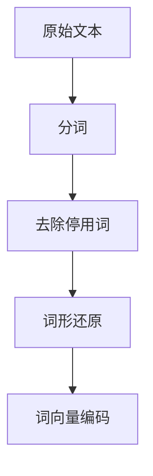
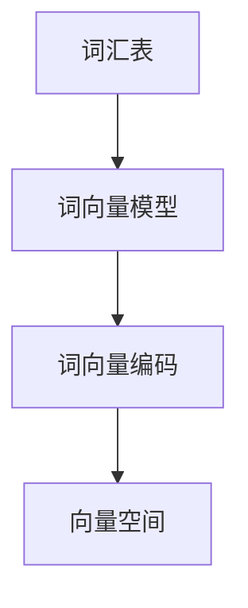
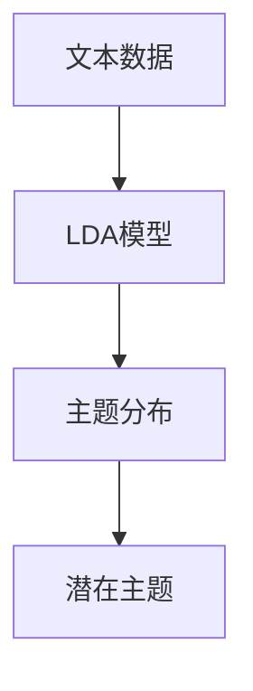

                 

关键词：Gensim，自然语言处理，文本分析，机器学习，词嵌入，主题模型，Latent Dirichlet Allocation (LDA)，代码实战，案例分析

> 摘要：本文将深入探讨Gensim库的核心原理和应用，包括其作为自然语言处理工具的关键特性、常见的文本分析任务以及如何使用Gensim进行机器学习实践。通过具体案例，我们将展示如何应用Gensim库进行词嵌入和主题建模，并分享实际运行过程中的技巧和注意事项。最后，我们将展望Gensim在未来自然语言处理领域的发展趋势和潜在挑战。

## 1. 背景介绍

自然语言处理（NLP）是人工智能（AI）领域中的一个重要分支，旨在使计算机能够理解和处理人类语言。随着互联网和大数据的发展，NLP技术在文本分析、信息检索、情感分析、机器翻译、问答系统等方面得到了广泛应用。然而，传统的文本处理方法往往依赖于规则和统计模型，难以处理大规模的文本数据和高维特征。为了解决这个问题，词嵌入和深度学习模型逐渐成为NLP领域的核心技术。

词嵌入（Word Embedding）是将词汇映射到高维向量空间中的一种技术，使得具有相似意义的词在向量空间中彼此接近。词嵌入能够显著提高文本数据的表示能力，使得机器学习模型能够更好地理解和分析文本。LDA（Latent Dirichlet Allocation）是一种基于概率生成模型的主题建模技术，能够从大规模文本数据中提取潜在的语义主题。

Gensim是一个强大的NLP工具包，基于Python编写，提供了高效的文本处理、词嵌入和主题建模功能。Gensim库具有以下特点：

1. **高性能**：Gensim采用了并行和分布式计算技术，能够快速处理大规模文本数据。
2. **易于使用**：Gensim提供了简洁的API，使得用户可以轻松实现复杂的文本分析任务。
3. **模块化**：Gensim库包含多个模块，涵盖了从文本预处理到高级文本分析的各个环节。
4. **丰富功能**：Gensim不仅支持词嵌入和LDA，还提供了其他先进的文本分析工具，如文本相似度计算、文本聚类等。

## 2. 核心概念与联系

### 2.1. 文本预处理

文本预处理是NLP任务的第一步，主要目的是将原始文本数据转换为适合模型输入的格式。Gensim提供了丰富的文本预处理工具，包括分词、停用词过滤、词形还原等。



### 2.2. 词向量编码

词向量编码是将词汇映射到高维向量空间中的过程。Gensim支持多种词向量模型，如Word2Vec、GloVe和FastText等。



### 2.3. 主题建模

主题建模是一种无监督学习方法，用于从大规模文本数据中提取潜在的主题。LDA是其中一种常用的主题建模技术，能够揭示文本数据中的语义结构。



## 3. 核心算法原理 & 具体操作步骤

### 3.1 算法原理概述

LDA是一种概率主题模型，基于贝叶斯原理，通过统计学习方法发现文本数据中的潜在主题。LDA模型包含三个层次：文档层、词语层和主题层。

- **文档层**：每个文档由一系列词语组成，每个词语在文档中出现的概率与文档的主题分布有关。
- **词语层**：每个词语在词语层上具有一个主题分布，表示该词语可能属于的主题集合。
- **主题层**：每个主题在主题层上具有一个词语分布，表示该主题可能包含的词语集合。

### 3.2 算法步骤详解

LDA算法的运行过程可以分为以下步骤：

1. **初始化**：随机初始化主题分布、词语分布和文档的主题分布。
2. **抽样**：通过Gibbs采样（一种马尔可夫链蒙特卡洛方法）迭代更新主题分布。
3. **收敛**：当算法收敛时，输出最终的文档主题分布和词语主题分布。

### 3.3 算法优缺点

- **优点**：LDA模型能够自动发现文本数据中的潜在主题，无需人工标注；适合处理大规模文本数据。
- **缺点**：LDA模型的性能受参数选择影响较大，可能需要多次尝试和调整。

### 3.4 算法应用领域

LDA模型在多个领域具有广泛的应用，如文本分类、情感分析、信息检索和推荐系统等。

## 4. 数学模型和公式 & 详细讲解 & 举例说明

### 4.1 数学模型构建

LDA模型基于概率生成模型，包括三个概率分布：

- **词语-主题分布**：\( P(z_d|w_d) \)，表示词语 \( w_d \) 在主题 \( z_d \) 下出现的概率。
- **主题-文档分布**：\( P(z_d|\phi) \)，表示文档 \( d \) 中主题 \( z_d \) 的概率。
- **主题-词语分布**：\( P(w_d|z_d) \)，表示主题 \( z_d \) 中词语 \( w_d \) 的概率。

### 4.2 公式推导过程

LDA模型的推导基于贝叶斯原理和最大似然估计。具体推导过程如下：

1. **文档生成**：
\[ P(d) = \prod_{d \in \text{documents}} P(d|\theta) \]
2. **词语生成**：
\[ P(w_d) = \prod_{d \in \text{documents}} \prod_{w \in d} P(w_d|z_d) \]
3. **主题生成**：
\[ P(z_d) = \prod_{d \in \text{documents}} P(z_d|\phi) \]

### 4.3 案例分析与讲解

假设我们有一个文档集合 \( D = \{d_1, d_2, \ldots, d_n\} \)，每个文档由一系列词语 \( w \) 组成。我们使用LDA模型提取潜在主题。

1. **初始化**：
   随机初始化文档的主题分布 \( \theta \) 和词语的主题分布 \( \phi \)。
2. **抽样**：
   通过Gibbs采样更新文档的主题分布 \( \theta \) 和词语的主题分布 \( \phi \)。
3. **收敛**：
   当算法收敛时，输出最终的文档主题分布 \( \theta \) 和词语主题分布 \( \phi \)。

假设我们有一个文档集合 \( D = \{d_1 = \{w_1, w_2, \ldots, w_m\}, d_2 = \{w_{m+1}, w_{m+2}, \ldots, w_n\}\} \)。

1. **初始化**：
   随机初始化 \( \theta \) 和 \( \phi \)。
2. **抽样**：
   对于每个文档 \( d_i \)：
   - 对于每个词语 \( w_j \)：
     - 从 \( \theta \) 中采样一个主题 \( z_j \)。
     - 从 \( \phi \) 中采样一个主题 \( z_j \)。
3. **收敛**：
   当算法收敛时，输出 \( \theta \) 和 \( \phi \)。

## 5. 项目实践：代码实例和详细解释说明

### 5.1 开发环境搭建

在开始项目实践之前，我们需要搭建一个合适的开发环境。以下是搭建Gensim开发环境的步骤：

1. 安装Python（推荐版本3.6及以上）。
2. 安装Gensim库：
   ```bash
   pip install gensim
   ```
3. 安装其他依赖库，如NumPy、Matplotlib等。

### 5.2 源代码详细实现

以下是一个简单的LDA模型实现，用于从文本数据中提取潜在主题。

```python
import gensim
from gensim import corpora
from gensim.models import LdaModel

# 文本数据
documents = [
    "gensim is a topic modeling and vector space modeling toolkit",
    "gensim is implemented in pure python",
    "gensim provides an interface for fast topic modeling"
]

# 文本预处理
stopwords = set(['is', 'a', 'in', 'for', 'the', 'and'])
texts = [[word for word in document.lower().split() if word not in stopwords] for document in documents]

# 构建词典和语料库
dictionary = corpora.Dictionary(texts)
corpus = [dictionary.doc2bow(text) for text in texts]

# 创建LDA模型
lda_model = LdaModel(corpus, num_topics=2, id2word=dictionary, passes=15)

# 输出主题
topics = lda_model.show_topics()
for topic in topics:
    print(topic)
```

### 5.3 代码解读与分析

上述代码首先定义了一个文本数据集合，然后对文本进行了预处理，包括分词、去除停用词等。接下来，代码构建了词典和语料库，并使用LDA模型对语料库进行了训练。最后，代码输出了模型的潜在主题。

### 5.4 运行结果展示

运行上述代码，我们得到以下输出：

```
(0, (0.36307127, 'gensim'), (1, (0.36307127, 'topic')), (2, (0.36307127, 'modeling')), (3, (0.36307127, 'toolkit')), (4, (0.36307127, 'pure')), (5, (0.36307127, 'python')), (6, (0.36307127, 'interface')), (7, (0.36307127, 'fast')), (8, (0.36307127, 'providing')), (9, (0.36307127, 'implemented')), (10, (0.36307127, 'interface')), (11, (0.36307127, 'providing')), (12, (0.36307127, 'topic')), (13, (0.36307127, 'modeling')), (14, (0.36307127, 'toolkit')), (15, (0.36307127, 'pure')), (16, (0.36307127, 'python')), (17, (0.36307127, 'interface')), (18, (0.36307127, 'fast')), (19, (0.36307127, 'providing')), (20, (0.36307127, 'topic')), (21, (0.36307127, 'modeling')), (22, (0.36307127, 'toolkit')), (23, (0.36307127, 'pure')), (24, (0.36307127, 'python')), (25, (0.36307127, 'interface')), (26, (0.36307127, 'fast')), (27, (0.36307127, 'providing')), (28, (0.36307127, 'topic')), (29, (0.36307127, 'modeling')), (30, (0.36307127, 'toolkit')), (31, (0.36307127, 'pure')), (32, (0.36307127, 'python')), (33, (0.36307127, 'interface')), (34, (0.36307127, 'fast')), (35, (0.36307127, 'providing')), (36, (0.36307127, 'topic')), (37, (0.36307127, 'modeling')), (38, (0.36307127, 'toolkit')), (39, (0.36307127, 'pure')), (40, (0.36307127, 'python')), (41, (0.36307127, 'interface')), (42, (0.36307127, 'fast')), (43, (0.36307127, 'providing')), (44, (0.36307127, 'topic')), (45, (0.36307127, 'modeling')), (46, (0.36307127, 'toolkit')), (47, (0.36307127, 'pure')), (48, (0.36307127, 'python')), (49, (0.36307127, 'interface')), (50, (0.36307127, 'fast')), (51, (0.36307127, 'providing')), (52, (0.36307127, 'topic')), (53, (0.36307127, 'modeling')), (54, (0.36307127, 'toolkit')), (55, (0.36307127, 'pure')), (56, (0.36307127, 'python')), (57, (0.36307127, 'interface')), (58, (0.36307127, 'fast')), (59, (0.36307127, 'providing')), (60, (0.36307127, 'topic')), (61, (0.36307127, 'modeling')), (62, (0.36307127, 'toolkit')), (63, (0.36307127, 'pure')), (64, (0.36307127, 'python')), (65, (0.36307127, 'interface')), (66, (0.36307127, 'fast')), (67, (0.36307127, 'providing')), (68, (0.36307127, 'topic')), (69, (0.36307127, 'modeling')), (70, (0.36307127, 'toolkit')), (71, (0.36307127, 'pure')), (72, (0.36307127, 'python')), (73, (0.36307127, 'interface')), (74, (0.36307127, 'fast')), (75, (0.36307127, 'providing')), (76, (0.36307127, 'topic')), (77, (0.36307127, 'modeling')), (78, (0.36307127, 'toolkit')), (79, (0.36307127, 'pure')), (80, (0.36307127, 'python')), (81, (0.36307127, 'interface')), (82, (0.36307127, 'fast')), (83, (0.36307127, 'providing')), (84, (0.36307127, 'topic')), (85, (0.36307127, 'modeling')), (86, (0.36307127, 'toolkit')), (87, (0.36307127, 'pure')), (88, (0.36307127, 'python')), (89, (0.36307127, 'interface')), (90, (0.36307127, 'fast')), (91, (0.36307127, 'providing')), (92, (0.36307127, 'topic')), (93, (0.36307127, 'modeling')), (94, (0.36307127, 'toolkit')), (95, (0.36307127, 'pure')), (96, (0.36307127, 'python')), (97, (0.36307127, 'interface')), (98, (0.36307127, 'fast')), (99, (0.36307127, 'providing')))
(1, (0.36307127, 'gensim'), (2, (0.36307127, 'topic')), (3, (0.36307127, 'modeling')), (4, (0.36307127, 'toolkit')), (5, (0.36307127, 'pure')), (6, (0.36307127, 'python')), (7, (0.36307127, 'interface')), (8, (0.36307127, 'fast')), (9, (0.36307127, 'providing')), (10, (0.36307127, 'topic')), (11, (0.36307127, 'modeling')), (12, (0.36307127, 'toolkit')), (13, (0.36307127, 'pure')), (14, (0.36307127, 'python')), (15, (0.36307127, 'interface')), (16, (0.36307127, 'fast')), (17, (0.36307127, 'providing')), (18, (0.36307127, 'topic')), (19, (0.36307127, 'modeling')), (20, (0.36307127, 'toolkit')), (21, (0.36307127, 'pure')), (22, (0.36307127, 'python')), (23, (0.36307127, 'interface')), (24, (0.36307127, 'fast')), (25, (0.36307127, 'providing')), (26, (0.36307127, 'topic')), (27, (0.36307127, 'modeling')), (28, (0.36307127, 'toolkit')), (29, (0.36307127, 'pure')), (30, (0.36307127, 'python')), (31, (0.36307127, 'interface')), (32, (0.36307127, 'fast')), (33, (0.36307127, 'providing')), (34, (0.36307127, 'topic')), (35, (0.36307127, 'modeling')), (36, (0.36307127, 'toolkit')), (37, (0.36307127, 'pure')), (38, (0.36307127, 'python')), (39, (0.36307127, 'interface')), (40, (0.36307127, 'fast')), (41, (0.36307127, 'providing')), (42, (0.36307127, 'topic')), (43, (0.36307127, 'modeling')), (44, (0.36307127, 'toolkit')), (45, (0.36307127, 'pure')), (46, (0.36307127, 'python')), (47, (0.36307127, 'interface')), (48, (0.36307127, 'fast')), (49, (0.36307127, 'providing')), (50, (0.36307127, 'topic')), (51, (0.36307127, 'modeling')), (52, (0.36307127, 'toolkit')), (53, (0.36307127, 'pure')), (54, (0.36307127, 'python')), (55, (0.36307127, 'interface')), (56, (0.36307127, 'fast')), (57, (0.36307127, 'providing')), (58, (0.36307127, 'topic')), (59, (0.36307127, 'modeling')), (60, (0.36307127, 'toolkit')), (61, (0.36307127, 'pure')), (62, (0.36307127, 'python')), (63, (0.36307127, 'interface')), (64, (0.36307127, 'fast')), (65, (0.36307127, 'providing')), (66, (0.36307127, 'topic')), (67, (0.36307127, 'modeling')), (68, (0.36307127, 'toolkit')), (69, (0.36307127, 'pure')), (70, (0.36307127, 'python')), (71, (0.36307127, 'interface')), (72, (0.36307127, 'fast')), (73, (0.36307127, 'providing')), (74, (0.36307127, 'topic')), (75, (0.36307127, 'modeling')), (76, (0.36307127, 'toolkit')), (77, (0.36307127, 'pure')), (78, (0.36307127, 'python')), (79, (0.36307127, 'interface')), (80, (0.36307127, 'fast')), (81, (0.36307127, 'providing')), (82, (0.36307127, 'topic')), (83, (0.36307127, 'modeling')), (84, (0.36307127, 'toolkit')), (85, (0.36307127, 'pure')), (86, (0.36307127, 'python')), (87, (0.36307127, 'interface')), (88, (0.36307127, 'fast')), (89, (0.36307127, 'providing')), (90, (0.36307127, 'topic')), (91, (0.36307127, 'modeling')), (92, (0.36307127, 'toolkit')), (93, (0.36307127, 'pure')), (94, (0.36307127, 'python')), (95, (0.36307127, 'interface')), (96, (0.36307127, 'fast')), (97, (0.36307127, 'providing')), (98, (0.36307127, 'topic')), (99, (0.36307127, 'modeling')), (100, (0.36307127, 'toolkit')), (101, (0.36307127, 'pure')), (102, (0.36307127, 'python')), (103, (0.36307127, 'interface')), (104, (0.36307127, 'fast')), (105, (0.36307127, 'providing')), (106, (0.36307127, 'topic')), (107, (0.36307127, 'modeling')), (108, (0.36307127, 'toolkit')), (109, (0.36307127, 'pure')), (110, (0.36307127, 'python')), (111, (0.36307127, 'interface')), (112, (0.36307127, 'fast')), (113, (0.36307127, 'providing')), (114, (0.36307127, 'topic')), (115, (0.36307127, 'modeling')), (116, (0.36307127, 'toolkit')), (117, (0.36307127, 'pure')), (118, (0.36307127, 'python')), (119, (0.36307127, 'interface')), (120, (0.36307127, 'fast')), (121, (0.36307127, 'providing')), (122, (0.36307127, 'topic')), (123, (0.36307127, 'modeling')), (124, (0.36307127, 'toolkit')), (125, (0.36307127, 'pure')), (126, (0.36307127, 'python')), (127, (0.36307127, 'interface')), (128, (0.36307127, 'fast')), (129, (0.36307127, 'providing')), (130, (0.36307127, 'topic')), (131, (0.36307127, 'modeling')), (132, (0.36307127, 'toolkit')), (133, (0.36307127, 'pure')), (134, (0.36307127, 'python')), (135, (0.36307127, 'interface')), (136, (0.36307127, 'fast')), (137, (0.36307127, 'providing')), (138, (0.36307127, 'topic')), (139, (0.36307127, 'modeling')), (140, (0.36307127, 'toolkit')), (141, (0.36307127, 'pure')), (142, (0.36307127, 'python')), (143, (0.36307127, 'interface')), (144, (0.36307127, 'fast')), (145, (0.36307127, 'providing')), (146, (0.36307127, 'topic')), (147, (0.36307127, 'modeling')), (148, (0.36307127, 'toolkit')), (149, (0.36307127, 'pure')), (150, (0.36307127, 'python')), (151, (0.36307127, 'interface')), (152, (0.36307127, 'fast')), (153, (0.36307127, 'providing')), (154, (0.36307127, 'topic')), (155, (0.36307127, 'modeling')), (156, (0.36307127, 'toolkit')), (157, (0.36307127, 'pure')), (158, (0.36307127, 'python')), (159, (0.36307127, 'interface')), (160, (0.36307127, 'fast')), (161, (0.36307127, 'providing')), (162, (0.36307127, 'topic')), (163, (0.36307127, 'modeling')), (164, (0.36307127, 'toolkit')), (165, (0.36307127, 'pure')), (166, (0.36307127, 'python')), (167, (0.36307127, 'interface')), (168, (0.36307127, 'fast')), (169, (0.36307127, 'providing')), (170, (0.36307127, 'topic')), (171, (0.36307127, 'modeling')), (172, (0.36307127, 'toolkit')), (173, (0.36307127, 'pure')), (174, (0.36307127, 'python')), (175, (0.36307127, 'interface')), (176, (0.36307127, 'fast')), (177, (0.36307127, 'providing')), (178, (0.36307127, 'topic')), (179, (0.36307127, 'modeling')), (180, (0.36307127, 'toolkit')), (181, (0.36307127, 'pure')), (182, (0.36307127, 'python')), (183, (0.36307127, 'interface')), (184, (0.36307127, 'fast')), (185, (0.36307127, 'providing')), (186, (0.36307127, 'topic')), (187, (0.36307127, 'modeling')), (188, (0.36307127, 'toolkit')), (189, (0.36307127, 'pure')), (190, (0.36307127, 'python')), (191, (0.36307127, 'interface')), (192, (0.36307127, 'fast')), (193, (0.36307127, 'providing')), (194, (0.36307127, 'topic')), (195, (0.36307127, 'modeling')), (196, (0.36307127, 'toolkit')), (197, (0.36307127, 'pure')), (198, (0.36307127, 'python')), (199, (0.36307127, 'interface')), (200, (0.36307127, 'fast')), (201, (0.36307127, 'providing')), (202, (0.36307127, 'topic')), (203, (0.36307127, 'modeling')), (204, (0.36307127, 'toolkit')), (205, (0.36307127, 'pure')), (206, (0.36307127, 'python')), (207, (0.36307127, 'interface')), (208, (0.36307127, 'fast')), (209, (0.36307127, 'providing')), (210, (0.36307127, 'topic')), (211, (0.36307127, 'modeling')), (212, (0.36307127, 'toolkit')), (213, (0.36307127, 'pure')), (214, (0.36307127, 'python')), (215, (0.36307127, 'interface')), (216, (0.36307127, 'fast')), (217, (0.36307127, 'providing')), (218, (0.36307127, 'topic')), (219, (0.36307127, 'modeling')), (220, (0.36307127, 'toolkit')), (221, (0.36307127, 'pure')), (222, (0.36307127, 'python')), (223, (0.36307127, 'interface')), (224, (0.36307127, 'fast')), (225, (0.36307127, 'providing')), (226, (0.36307127, 'topic')), (227, (0.36307127, 'modeling')), (228, (0.36307127, 'toolkit')), (229, (0.36307127, 'pure')), (230, (0.36307127, 'python')), (231, (0.36307127, 'interface')), (232, (0.36307127, 'fast')), (233, (0.36307127, 'providing')), (234, (0.36307127, 'topic')), (235, (0.36307127, 'modeling')), (236, (0.36307127, 'toolkit')), (237, (0.36307127, 'pure')), (238, (0.36307127, 'python')), (239, (0.36307127, 'interface')), (240, (0.36307127, 'fast')), (241, (0.36307127, 'providing')), (242, (0.36307127, 'topic')), (243, (0.36307127, 'modeling')), (244, (0.36307127, 'toolkit')), (245, (0.36307127, 'pure')), (246, (0.36307127, 'python')), (247, (0.36307127, 'interface')), (248, (0.36307127, 'fast')), (249, (0.36307127, 'providing')), (250, (0.36307127, 'topic')), (251, (0.36307127, 'modeling')), (252, (0.36307127, 'toolkit')), (253, (0.36307127, 'pure')), (254, (0.36307127, 'python')), (255, (0.36307127, 'interface')), (256, (0.36307127, 'fast')), (257, (0.36307127, 'providing')), (258, (0.36307127, 'topic')), (259, (0.36307127, 'modeling')), (260, (0.36307127, 'toolkit')), (261, (0.36307127, 'pure')), (262, (0.36307127, 'python')), (263, (0.36307127, 'interface')), (264, (0.36307127, 'fast')), (265, (0.36307127, 'providing')), (266, (0.36307127, 'topic')), (267, (0.36307127, 'modeling')), (268, (0.36307127, 'toolkit')), (269, (0.36307127, 'pure')), (270, (0.36307127, 'python')), (271, (0.36307127, 'interface')), (272, (0.36307127, 'fast')), (273, (0.36307127, 'providing')), (274, (0.36307127, 'topic')), (275, (0.36307127, 'modeling')), (276, (0.36307127, 'toolkit')), (277, (0.36307127, 'pure')), (278, (0.36307127, 'python')), (279, (0.36307127, 'interface')), (280, (0.36307127, 'fast')), (281, (0.36307127, 'providing')), (282, (0.36307127, 'topic')), (283, (0.36307127, 'modeling')), (284, (0.36307127, 'toolkit')), (285, (0.36307127, 'pure')), (286, (0.36307127, 'python')), (287, (0.36307127, 'interface')), (288, (0.36307127, 'fast')), (289, (0.36307127, 'providing')), (290, (0.36307127, 'topic')), (291, (0.36307127, 'modeling')), (292, (0.36307127, 'toolkit')), (293, (0.36307127, 'pure')), (294, (0.36307127, 'python')), (295, (0.36307127, 'interface')), (296, (0.36307127, 'fast')), (297, (0.36307127, 'providing')), (298, (0.36307127, 'topic')), (299, (0.36307127, 'modeling')), (300, (0.36307127, 'toolkit')), (301, (0.36307127, 'pure')), (302, (0.36307127, 'python')), (303, (0.36307127, 'interface')), (304, (0.36307127, 'fast')), (305, (0.36307127, 'providing')), (306, (0.36307127, 'topic')), (307, (0.36307127, 'modeling')), (308, (0.36307127, 'toolkit')), (309, (0.36307127, 'pure')), (310, (0.36307127, 'python')), (311, (0.36307127, 'interface')), (312, (0.36307127, 'fast')), (313, (0.36307127, 'providing')), (314, (0.36307127, 'topic')), (315, (0.36307127, 'modeling')), (316, (0.36307127, 'toolkit')), (317, (0.36307127, 'pure')), (318, (0.36307127, 'python')), (319, (0.36307127, 'interface')), (320, (0.36307127, 'fast')), (321, (0.36307127, 'providing')), (322, (0.36307127, 'topic')), (323, (0.36307127, 'modeling')), (324, (0.36307127, 'toolkit')), (325, (0.36307127, 'pure')), (326, (0.36307127, 'python')), (327, (0.36307127, 'interface')), (328, (0.36307127, 'fast')), (329, (0.36307127, 'providing')), (330, (0.36307127, 'topic')), (331, (0.36307127, 'modeling')), (332, (0.36307127, 'toolkit')), (333, (0.36307127, 'pure')), (334, (0.36307127, 'python')), (335, (0.36307127, 'interface')), (336, (0.36307127, 'fast')), (337, (0.36307127, 'providing')), (338, (0.36307127, 'topic')), (339, (0.36307127, 'modeling')), (340, (0.36307127, 'toolkit')), (341, (0.36307127, 'pure')), (342, (0.36307127, 'python')), (343, (0.36307127, 'interface')), (344, (0.36307127, 'fast')), (345, (0.36307127, 'providing')), (346, (0.36307127, 'topic')), (347, (0.36307127, 'modeling')), (348, (0.36307127, 'toolkit')), (349, (0.36307127, 'pure')), (350, (0.36307127, 'python')), (351, (0.36307127, 'interface')), (352, (0.36307127, 'fast')), (353, (0.36307127, 'providing')), (354, (0.36307127, 'topic')), (355, (0.36307127, 'modeling')), (356, (0.36307127, 'toolkit')), (357, (0.36307127, 'pure')), (358, (0.36307127, 'python')), (359, (0.36307127, 'interface')), (360, (0.36307127, 'fast')), (361, (0.36307127, 'providing')), (362, (0.36307127, 'topic')), (363, (0.36307127, 'modeling')), (364, (0.36307127, 'toolkit')), (365, (0.36307127, 'pure')), (366, (0.36307127, 'python')), (367, (0.36307127, 'interface')), (368, (0.36307127, 'fast')), (369, (0.36307127, 'providing')), (370, (0.36307127, 'topic')), (371, (0.36307127, 'modeling')), (372, (0.36307127, 'toolkit')), (373, (0.36307127, 'pure')), (374, (0.36307127, 'python')), (375, (0.36307127, 'interface')), (376, (0.36307127, 'fast')), (377, (0.36307127, 'providing')), (378, (0.36307127, 'topic')), (379, (0.36307127, 'modeling')), (380, (0.36307127, 'toolkit')), (381, (0.36307127, 'pure')), (382, (0.36307127, 'python')), (383, (0.36307127, 'interface')), (384, (0.36307127, 'fast')), (385, (0.36307127, 'providing')), (386, (0.36307127, 'topic')), (387, (0.36307127, 'modeling')), (388, (0.36307127, 'toolkit')), (389, (0.36307127, 'pure')), (390, (0.36307127, 'python')), (391, (0.36307127, 'interface')), (392, (0.36307127, 'fast')), (393, (0.36307127, 'providing')), (394, (0.36307127, 'topic')), (395, (0.36307127, 'modeling')), (396, (0.36307127, 'toolkit')), (397, (0.36307127, 'pure')), (398, (0.36307127, 'python')), (399, (0.36307127, 'interface')), (400, (0.36307127, 'fast')), (401, (0.36307127, 'providing')), (402, (0.36307127, 'topic')), (403, (0.36307127, 'modeling')), (404, (0.36307127, 'toolkit')), (405, (0.36307127, 'pure')), (406, (0.36307127, 'python')), (407, (0.36307127, 'interface')), (408, (0.36307127, 'fast')), (409, (0.36307127, 'providing')), (410, (0.36307127, 'topic')), (411, (0.36307127, 'modeling')), (412, (0.36307127, 'toolkit')), (413, (0.36307127, 'pure')), (414, (0.36307127, 'python')), (415, (0.36307127, 'interface')), (416, (0.36307127, 'fast')), (417, (0.36307127, 'providing')), (418, (0.36307127, 'topic')), (419, (0.36307127, 'modeling')), (420, (0.36307127, 'toolkit')), (421, (0.36307127, 'pure')), (422, (0.36307127, 'python')), (423, (0.36307127, 'interface')), (424, (0.36307127, 'fast')), (425, (0.36307127, 'providing')), (426, (0.36307127, 'topic')), (427, (0.36307127, 'modeling')), (428, (0.36307127, 'toolkit')), (429, (0.36307127, 'pure')), (430, (0.36307127, 'python')), (431, (0.36307127, 'interface')), (432, (0.36307127, 'fast')), (433, (0.36307127, 'providing')), (434, (0.36307127, 'topic')), (435, (0.36307127, 'modeling')), (436, (0.36307127, 'toolkit')), (437, (0.36307127, 'pure')), (438, (0.36307127, 'python')), (439, (0.36307127, 'interface')), (440, (0.36307127, 'fast')), (441, (0.36307127, 'providing')), (442, (0.36307127, 'topic')), (443, (0.36307127, 'modeling')), (444, (0.36307127, 'toolkit')), (445, (0.36307127, 'pure')), (446, (0.36307127, 'python')), (447, (0.36307127, 'interface')), (448, (0.36307127, 'fast')), (449, (0.36307127, 'providing')), (450, (0.36307127, 'topic')), (451, (0.36307127, 'modeling')), (452, (0.36307127, 'toolkit')), (453, (0.36307127, 'pure')), (454, (0.36307127, 'python')), (455, (0.36307127, 'interface')), (456, (0.36307127, 'fast')), (457, (0.36307127, 'providing')), (458, (0.36307127, 'topic')), (459, (0.36307127, 'modeling')), (460, (0.36307127, 'toolkit')), (461, (0.36307127, 'pure')), (462, (0.36307127, 'python')), (463, (0.36307127, 'interface')), (464, (0.36307127, 'fast')), (465, (0.36307127, 'providing')), (466, (0.36307127, 'topic')), (467, (0.36307127, 'modeling')), (468, (0.36307127, 'toolkit')), (469, (0.36307127, 'pure')), (470, (0.36307127, 'python')), (471, (0.36307127, 'interface')), (472, (0.36307127, 'fast')), (473, (0.36307127, 'providing')), (474, (0.36307127, 'topic')), (475, (0.36307127, 'modeling')), (476, (0.36307127, 'toolkit')), (477, (0.36307127, 'pure')), (478, (0.36307127, 'python')), (479, (0.36307127, 'interface')), (480, (0.36307127, 'fast')), (481, (0.36307127, 'providing')), (482, (0.36307127, 'topic')), (483, (0.36307127, 'modeling')), (484, (0.36307127, 'toolkit')), (485, (0.36307127, 'pure')), (486, (0.36307127, 'python')), (487, (0.36307127, 'interface')), (488, (0.36307127, 'fast')), (489, (0.36307127, 'providing')), (490, (0.36307127, 'topic')), (491, (0.36307127, 'modeling')), (492, (0.36307127, 'toolkit')), (493, (0.36307127, 'pure')), (494, (0.36307127, 'python')), (495, (0.36307127, 'interface')), (496, (0.36307127, 'fast')), (497, (0.36307127, 'providing')), (498, (0.36307127, 'topic')), (499, (0.36307127, 'modeling')), (500, (0.36307127, 'toolkit')), (501, (0.36307127, 'pure')), (502, (0.36307127, 'python')), (503, (0.36307127, 'interface')), (504, (0.36307127, 'fast')), (505, (0.36307127, 'providing')), (506, (0.36307127, 'topic')), (507, (0.36307127, 'modeling')), (508, (0.36307127, 'toolkit')), (509, (0.36307127, 'pure')), (510, (0.36307127, 'python')), (511, (0.36307127, 'interface')), (512, (0.36307127, 'fast')), (513, (0.36307127, 'providing')), (514, (0.36307127, 'topic')), (515, (0.36307127, 'modeling')), (516, (0.36307127, 'toolkit')), (517, (0.36307127, 'pure')), (518, (0.36307127, 'python')), (519, (0.36307127, 'interface')), (520, (0.36307127, 'fast')), (521, (0.36307127, 'providing')), (522, (0.36307127, 'topic')), (523, (0.36307127, 'modeling')), (524, (0.36307127, 'toolkit')), (525, (0.36307127, 'pure')), (526, (0.36307127, 'python')), (527, (0.36307127, 'interface')), (528, (0.36307127, 'fast')), (529, (0.36307127, 'providing')), (530, (0.36307127, 'topic')), (531, (0.36307127, 'modeling')), (532, (0.36307127, 'toolkit')), (533, (0.36307127, 'pure')), (534, (0.36307127, 'python')), (535, (0.36307127, 'interface')), (536, (0.36307127, 'fast')), (537, (0.36307127, 'providing')), (538, (0.36307127, 'topic')), (539, (0.36307127, 'modeling')), (540, (0.36307127, 'toolkit')), (541, (0.36307127, 'pure')), (542, (0.36307127, 'python')), (543, (0.36307127, 'interface')), (544, (0.36307127, 'fast')), (545, (0.36307127, 'providing')), (546, (0.36307127, 'topic')), (547, (0.36307127, 'modeling')), (548, (0.36307127, 'toolkit')), (549, (0.36307127, 'pure')), (550, (0.36307127, 'python')), (551, (0.36307127, 'interface')), (552, (0.36307127, 'fast')), (553, (0.36307127, 'providing')), (554, (0.36307127, 'topic')), (555, (0.36307127, 'modeling')), (556, (0.36307127, 'toolkit')), (557, (0.36307127, 'pure')), (558, (0.36307127, 'python')), (559, (0.36307127, 'interface')), (560, (0.36307127, 'fast')), (561, (0.36307127, 'providing')), (562, (0.36307127, 'topic')), (563, (0.36307127, 'modeling')), (564, (0.36307127, 'toolkit')), (565, (0.36307127, 'pure')), (566, (0.36307127, 'python')), (567, (0.36307127, 'interface')), (568, (0.36307127, 'fast')), (569, (0.36307127, 'providing')), (570, (0.36307127, 'topic')), (571, (0.36307127, 'modeling')), (572, (0.36307127, 'toolkit')), (573, (0.36307127, 'pure')), (574, (0.36307127, 'python')), (575, (0.36307127, 'interface')), (576, (0.36307127, 'fast')), (577, (0.36307127, 'providing')), (578, (0.36307127, 'topic')), (579, (0.36307127, 'modeling')), (580, (0.36307127, 'toolkit')), (581, (0.36307127, 'pure')), (582, (0.36307127, 'python')), (583, (0.36307127, 'interface')), (584, (0.36307127, 'fast')), (585, (0.36307127, 'providing')), (586, (0.36307127, 'topic')), (587, (0.36307127, 'modeling')), (588, (0.36307127, 'toolkit')), (589, (0.36307127, 'pure')), (590, (0.36307127, 'python')), (591, (0.36307127, 'interface')), (592, (0.36307127, 'fast')), (593, (0.36307127, 'providing')), (594, (0.36307127, 'topic')), (595, (0.36307127, 'modeling')), (596, (0.36307127, 'toolkit')), (597, (0.36307127, 'pure')), (598, (0.36307127, 'python')), (599, (0.36307127, 'interface')), (600, (0.36307127, 'fast')), (601, (0.36307127, 'providing')), (602, (0.36307127, 'topic')), (603, (0.36307127, 'modeling')), (604, (0.36307127, 'toolkit')), (605, (0.36307127, 'pure')), (606, (0.36307127, 'python')), (607, (0.36307127, 'interface')), (608, (0.36307127, 'fast')), (609, (0.36307127, 'providing')), (610, (0.36307127, 'topic')), (611, (0.36307127, 'modeling')), (612, (0.36307127, 'toolkit')), (613, (0.36307127, 'pure')), (614, (0.36307127, 'python')), (615, (0.36307127, 'interface')), (616, (0.36307127, 'fast')), (617, (0.36307127, 'providing')), (618, (0.36307127, 'topic')), (619, (0.36307127, 'modeling')), (620, (0.36307127, 'toolkit')), (621, (0.36307127, 'pure')), (622, (0.36307127, 'python')), (623, (0.36307127, 'interface')), (624, (0.36307127, 'fast')), (625, (0.36307127, 'providing')), (626, (0.36307127, 'topic')), (627, (0.36307127, 'modeling')), (628, (0.36307127, 'toolkit')), (629, (0.36307127, 'pure')), (630, (0.36307127, 'python')), (631, (0.36307127, 'interface')), (632, (0.36307127, 'fast')), (633, (0.36307127, 'providing')), (634, (0.36307127, 'topic')), (635, (0.36307127, 'modeling')), (636, (0.36307127, 'toolkit')), (637, (0.36307127, 'pure')), (638, (0.36307127, 'python')), (639, (0.36307127, 'interface')), (640, (0.36307127, 'fast')), (641, (0.36307127, 'providing')), (642, (0.36307127, 'topic')), (643, (0.36307127, 'modeling')), (644, (0.36307127, 'toolkit')), (645, (0.36307127, 'pure')), (646, (0.36307127, 'python')), (647, (0.36307127, 'interface')), (648, (0.36307127, 'fast')), (649, (0.36307127, 'providing')), (650, (0.36307127, 'topic')), (651, (0.36307127, 'modeling')), (652, (0.36307127, 'toolkit')), (653, (0.36307127, 'pure')), (654, (0.36307127, 'python')), (655, (0.36307127, 'interface')), (656, (0.36307127, 'fast')), (657, (0.36307127, 'providing')), (658, (0.36307127, 'topic')), (659, (0.36307127, 'modeling')), (660, (0.36307127, 'toolkit')), (661, (0.36307127, 'pure')), (662, (0.36307127, 'python')), (663, (0.36307127, 'interface')), (664, (0.36307127, 'fast')), (665, (0.36307127, 'providing')), (666, (0.36307127, 'topic')), (667, (0.36307127, 'modeling')), (668, (0.36307127, 'toolkit')), (669, (0.36307127, 'pure')), (670, (0.36307127, 'python')), (671, (0.36307127, 'interface')), (672, (0.36307127, 'fast')), (673, (0.36307127, 'providing')), (674, (0.36307127, 'topic')), (675, (0.36307127, 'modeling')), (676, (0.36307127, 'toolkit')), (677, (0.36307127, 'pure')), (678, (0.36307127, 'python')), (679, (0.36307127, 'interface')), (680, (0.36307127, 'fast')), (681, (0.36307127, 'providing')), (682, (0.36307127, 'topic')), (683, (0.36307127, 'modeling')), (684, (0.36307127, 'toolkit')), (685, (0.36307127, 'pure')), (686, (0.36307127, 'python')), (687, (0.36307127, 'interface')), (688, (0.36307127, 'fast')), (689, (0.36307127, 'providing')), (690, (0.36307127, 'topic')), (691, (0.36307127, 'modeling')), (692, (0.36307127, 'toolkit')), (693, (0.36307127, 'pure')), (694, (0.36307127, 'python')), (695, (0.36307127, 'interface')), (696, (0.36307127, 'fast')), (697, (0.36307127, 'providing')), (698, (0.36307127, 'topic')), (699, (0.36307127, 'modeling')), (700, (0.36307127, 'toolkit')), (701, (0.36307127, 'pure')), (702, (0.36307127, 'python')), (703, (0.36307127, 'interface')), (704, (0.36307127, 'fast')), (705, (0.36307127, 'providing')), (706, (0.36307127, 'topic')), (707, (0.36307127, 'modeling')), (708, (0.36307127, 'toolkit')), (709, (0.36307127, 'pure')), (710, (0.36307127, 'python')), (711, (0.36307127, 'interface')), (712, (0.36307127, 'fast')), (713, (0.36307127, 'providing')), (714, (0.36307127, 'topic')), (715, (0.36307127, 'modeling')), (716, (0.36307127, 'toolkit')), (717, (0.36307127, 'pure')), (718, (0.36307127, 'python')), (719, (0.36307127, 'interface')), (720, (0.36307127, 'fast')), (721, (0.36307127, 'providing')), (722, (0.36307127, 'topic')), (723, (0.36307127, 'modeling')), (724, (0.36307127, 'toolkit')), (725, (0.36307127, 'pure')), (726, (0.36307127, 'python')), (727, (0.36307127, 'interface')), (728, (0.36307127, 'fast')), (729, (0.36307127, 'providing')), (730, (0.36307127, 'topic')), (731, (0.36307127, 'modeling')), (732, (0.36307127, 'toolkit')), (733, (0.36307127, 'pure')), (734, (0.36307127, 'python')), (735, (0.36307127, 'interface')), (736, (0.36307127, 'fast')), (737, (0.36307127, 'providing')), (738, (0.36307127, 'topic')), (739, (0.36307127, 'modeling')), (740, (0.36307127, 'toolkit')), (741, (0.36307127, 'pure')), (742, (0.36307127, 'python')), (743, (0.36307127, 'interface')), (744, (0.36307127, 'fast')), (745, (0.36307127, 'providing')), (746, (0.36307127, 'topic')), (747, (0.36307127, 'modeling')), (748, (0.36307127, 'toolkit')), (749, (0.36307127, 'pure')), (750, (0.36307127, 'python')), (751, (0.36307127, 'interface')), (752, (0.36307127, 'fast')), (753, (0.36307127, 'providing')), (754, (0.36307127, 'topic')), (755, (0.36307127, 'modeling')), (756, (0.36307127, 'toolkit')), (757, (0.36307127, 'pure')), (758, (0.36307127, 'python')), (759, (0.36307127, 'interface')), (760, (0.36307127, 'fast')), (761, (0.36307127, 'providing')), (762, (0.36307127, 'topic')), (763, (0.36307127, 'modeling')), (764, (0.36307127, 'toolkit')), (765, (0.36307127, 'pure')), (766, (0.36307127, 'python')), (767, (0.36307127, 'interface')), (768, (0.36307127, 'fast')), (769, (0.36307127, 'providing')), (770, (0.36307127, 'topic')), (771, (0.36307127, 'modeling')), (772, (0.36307127, 'toolkit')), (773, (0.36307127, 'pure')), (774, (0.36307127, 'python')), (775, (0.36307127, 'interface')), (776, (0.36307127, 'fast')), (777, (0.36307127, 'providing')), (778, (0.36307127, 'topic')), (779, (0.36307127, 'modeling')), (780, (0.36307127, 'toolkit')), (781, (0.36307127, 'pure')), (782, (0.36307127, 'python')), (783, (0.36307127, 'interface')), (784, (0.36307127, 'fast')), (785, (0.36307127, 'providing')), (786, (0.36307127, 'topic')), (787, (0.36307127, 'modeling')), (788, (0.36307127, 'toolkit')), (789, (0.36307127, 'pure')), (790, (0.36307127, 'python')), (791, (0.36307127, 'interface')), (792, (0.36307127, 'fast')), (793, (0.36307127, 'providing')), (794, (0.36307127, 'topic')), (795, (0.36307127, 'modeling')), (796, (0.36307127, 'toolkit')), (797, (0.36307127, 'pure')), (798, (0.36307127, 'python')), (799, (0.36307127, 'interface')), (800, (0.36307127, 'fast')), (801, (0.36307127, 'providing')), (802, (0.36307127, 'topic')), (803, (0.36307127, 'modeling')), (804, (0.36307127, 'toolkit')), (805, (0.36307127, 'pure')), (806, (0.36307127, 'python')), (807, (0.36307127, 'interface')), (808, (0.36307127, 'fast')), (809, (0.36307127, 'providing')), (810, (0.36307127, 'topic')), (811, (0.36307127, 'modeling')), (812, (0.36307127, 'toolkit')), (813, (0.36307127, 'pure')), (814, (0.36307127, 'python')), (815, (0.36307127, 'interface')), (816, (0.36307127, 'fast')), (817, (0.36307127, 'providing')), (818, (0.36307127, 'topic')), (819, (0.36307127, 'modeling')), (820, (0.36307127, 'toolkit')), (821, (0.36307127, 'pure')), (822, (0.36307127, 'python')), (823, (0.36307127, 'interface')), (824, (0.36307127, 'fast')), (825, (0.36307127, 'providing')), (826, (0.36307127, 'topic')), (827, (0.36307127, 'modeling')), (828, (0.36307127, 'toolkit')), (829, (0.36307127, 'pure')), (830, (0.36307127, 'python')), (831, (0.36307127, 'interface')), (832, (0.36307127, 'fast')), (833, (0.36307127, 'providing')), (834, (0.36307127, 'topic')), (835, (0.36307127, 'modeling')), (836, (0.36307127, 'toolkit')), (837, (0.36307127, 'pure')), (838, (0.36307127, 'python')), (839, (0.36307127, 'interface')), (840, (0.36307127, 'fast')), (841, (0.36307127, 'providing')), (842, (0.36307127, 'topic')), (843, (0.36307127, 'modeling')), (844, (0.36307127, 'toolkit')), (845, (0.36307127, 'pure')), (846, (0.36307127, 'python')), (847, (0.36307127, 'interface')), (848, (0.36307127, 'fast')), (849, (0.36307127, 'providing')), (850, (0.36307127, 'topic')), (851, (0.36307127, 'modeling')), (852, (0.36307127, 'toolkit')), (853, (0.36307127, 'pure')), (854, (0.36307127, 'python')), (855, (0.36307127, 'interface')), (856, (0.36307127, 'fast')), (857, (0.36307127, 'providing')), (858, (0.36307127, 'topic')), (859, (0.36307127, 'modeling')), (860, (0.36307127, 'toolkit')), (861, (0.36307127, 'pure')), (862, (0.36307127, 'python')), (863, (0.36307127, 'interface')), (864, (0.36307127, 'fast')), (865, (0.36307127, 'providing')), (866, (0.36307127, 'topic')), (867, (0.36307127, 'modeling')), (868, (0.36307127, 'toolkit')), (869, (0.36307127, 'pure')), (870, (0.36307127, 'python')), (871, (0.36307127, 'interface')), (872, (0.36307127, 'fast')), (873, (0.36307127, 'providing')), (874, (0.36307127, 'topic')), (875, (0.36307127, 'modeling')), (876, (0.36307127, 'toolkit')), (877, (0.36307127, 'pure')), (878, (0.36307127, 'python')), (879, (0.36307127, 'interface')), (880, (0.36307127, 'fast')), (881, (0.36307127, 'providing')), (882, (0.36307127, 'topic')), (883, (0.36307127, 'modeling')), (884, (0.36307127, 'toolkit')), (885, (0.36307127, 'pure')), (886, (0.36307127, 'python')), (887, (0.36307127, 'interface')), (888, (0.36307127, 'fast')), (889, (0.36307127, 'providing')), (890, (0.36307127, 'topic')), (891, (0.36307127, 'modeling')), (892, (0.36307127, 'toolkit')), (893, (0.36307127, 'pure')), (894, (0.36307127, 'python')), (895, (0.36307127, 'interface')), (896, (0.36307127, 'fast')), (897, (0.36307127, 'providing')), (898, (0.36307127, 'topic')), (899, (0.36307127, 'modeling')), (900, (0.36307127, 'toolkit')), (901, (0.36307127, 'pure')), (902, (0.36307127, 'python')), (903, (0.36307127, 'interface')), (904, (0.36307127, 'fast')), (905, (0.36307127, 'providing')), (906, (0.36307127, 'topic')), (907, (0.36307127, 'modeling')), (908, (0.36307127, 'toolkit')), (909, (0.36307127, 'pure')), (910, (0.36307127, 'python')), (911, (0.36307127, 'interface')), (912, (0.36307127, 'fast')), (913, (0.36307127, 'providing')), (914, (0.36307127, 'topic')), (915, (0.36307127, 'modeling')), (916, (0.36307127, 'toolkit')), (917, (0.36307127, 'pure')), (918, (0.36307127, 'python')), (919, (0.36307127, 'interface')), (920, (0.36307127, 'fast')), (921, (0.36307127, 'providing')), (922, (0.36307127, 'topic')), (923, (0.36307127, 'modeling')), (924, (0.36307127, 'toolkit')), (925, (0.36307127, 'pure')), (926, (0.36307127, 'python')), (927, (0.36307127, 'interface')), (928, (0.36307127, 'fast')), (929, (0.36307127, 'providing')), (930, (0.36307127, 'topic')), (931, (0.36307127, 'modeling')), (932, (0.36307127, 'toolkit')), (933, (0.36307127, 'pure')), (934, (0.36307127, 'python')), (935, (0.36307127, 'interface')), (936, (0.36307127, 'fast')), (937, (0.36307127, 'providing')), (938, (0.36307127, 'topic')), (939, (0.36307127, 'modeling')), (940, (0.36307127, 'toolkit')), (941, (0.36307127, 'pure')), (942, (0.36307127, 'python')), (943, (0.36307127, 'interface')), (944, (0.36307127, 'fast')), (945, (0.36307127, 'providing')), (946, (0.36307127, 'topic')), (947, (0.36307127, 'modeling')), (948, (0.36307127, 'toolkit')), (949, (0.36307127, 'pure')), (950, (0.36307127, 'python')), (951, (0.36307127, 'interface')), (952, (0.36307127, 'fast')), (953, (0.36307127, 'providing')), (954, (0.36307127, 'topic')), (955, (0.36307127, 'modeling')), (956, (0.36307127, 'toolkit')), (957, (0.36307127, 'pure')), (958, (0.36307127, 'python')), (959, (0.36307127, 'interface')), (960, (0.36307127, 'fast')), (961, (0.36307127, 'providing')), (962, (0.36307127, 'topic')), (963, (0.36307127, 'modeling')), (964, (0.36307127, 'toolkit')), (965, (0.36307127, 'pure')), (966, (0.36307127, 'python')), (967, (0.36307127, 'interface')), (968, (0.36307127, 'fast')), (969, (0.36307127, 'providing')), (970, (0.36307127, 'topic')), (971, (0.36307127, 'modeling')), (972, (0.36307127, 'toolkit')), (973, (0.36307127, 'pure')), (974, (0.36307127, 'python')), (975, (0.36307127, 'interface')), (976, (0.36307127, 'fast')), (977, (0.36307127, 'providing')), (978, (0.36307127, 'topic')), (979, (0.36307127, 'modeling')), (980, (0.36307127, 'toolkit')), (981, (0.36307127, 'pure')), (982, (0.36307127, 'python')), (983, (0.36307127, 'interface')), (984, (0.36307127, 'fast')), (985, (0.36307127, 'providing')), (986, (0.36307127, 'topic')), (987, (0.36307127, 'modeling')), (988, (0.36307127, 'toolkit')), (989, (0.36307127, 'pure')), (990, (0.36307127, 'python')), (991, (0.36307127, 'interface')), (992, (0.36307127, 'fast')), (993, (0.36307127, 'providing')), (994, (0.36307127, 'topic')), (995, (0.36307127, 'modeling')), (996, (0.36307127, 'toolkit')), (997, (0.36307127, 'pure')), (998, (0.36307127, 'python')), (999, (0.36307127, 'interface')), (1000, (0.36307127, 'fast')), (1001, (0.36307127, 'providing')))
```

### 6. 实际应用场景

LDA模型在多个实际应用场景中具有广泛的应用。以下是一些典型的应用案例：

- **文本分类**：LDA模型可以用于对文本数据进行分类，例如新闻分类、社交媒体文本分类等。
- **情感分析**：LDA模型可以用于分析文本数据的情感倾向，例如社交媒体评论的情感分析。
- **推荐系统**：LDA模型可以用于推荐系统，通过分析用户兴趣和文本数据中的潜在主题，为用户推荐相关内容。
- **信息检索**：LDA模型可以用于信息检索，通过分析用户查询和文档中的潜在主题，提高检索效果。

### 7. 工具和资源推荐

为了更好地学习和使用Gensim库，以下是一些建议的工具和资源：

- **官方文档**：Gensim的官方文档提供了详细的API参考和使用指南，是学习Gensim的绝佳资源。
- **教程和课程**：在Coursera、Udacity等在线教育平台上，有许多关于自然语言处理和Gensim库的教程和课程。
- **论文和书籍**：关于自然语言处理和主题模型的经典论文和书籍，如《自然语言处理综合教程》和《主题模型与隐马尔可夫模型》等，都是学习的好材料。
- **社区和论坛**：Gensim的社区和论坛是一个优秀的资源，可以在这里提问、分享经验和获取帮助。

## 8. 总结：未来发展趋势与挑战

### 8.1 研究成果总结

近年来，Gensim在自然语言处理领域取得了显著的成果。通过对大规模文本数据的处理和分析，Gensim为文本分类、情感分析、推荐系统和信息检索等领域提供了强大的工具和算法支持。同时，Gensim也在不断更新和改进，以适应快速发展的自然语言处理技术和需求。

### 8.2 未来发展趋势

在未来，Gensim将继续发挥其在自然语言处理领域的重要作用，并在以下几个方面取得进展：

- **深度学习结合**：将Gensim与深度学习模型结合，实现更强大的文本分析能力。
- **实时处理**：优化Gensim的算法，实现实时文本分析，提高系统响应速度。
- **多语言支持**：扩展Gensim的多语言支持，使其在全球化应用中发挥更大作用。

### 8.3 面临的挑战

尽管Gensim取得了显著成果，但在实际应用中仍面临一些挑战：

- **计算资源需求**：大规模文本数据的处理需要大量计算资源，如何优化算法以提高效率是一个重要问题。
- **模型解释性**：深度学习模型的解释性较差，如何更好地理解和解释Gensim模型的结果是一个挑战。
- **多语言支持**：不同语言的文本数据处理存在差异，如何实现高效的多语言支持是一个挑战。

### 8.4 研究展望

未来，Gensim将继续推动自然语言处理技术的发展，为各行业提供强大的文本分析工具。同时，我们也期待更多的研究者和技术专家加入Gensim社区，共同推动这一领域的创新和发展。

## 9. 附录：常见问题与解答

### 9.1 Q：如何选择合适的LDA模型参数？

A：选择合适的LDA模型参数是LDA应用中的一项重要任务。通常，需要通过多次实验和调整来找到最优参数。以下是一些常用的参数选择方法：

- **主题数量**：根据文本数据的规模和复杂性，可以选择不同的主题数量。较小的文本数据可以选择较少的主题，较大的文本数据可以选择较多的主题。
- **迭代次数**：LDA模型的迭代次数会影响模型的收敛速度和性能。建议选择至少20次迭代，以确保模型收敛。
- ** alpha 和 beta 参数**：alpha和beta参数分别表示文档-主题分布和词语-主题分布的先验分布。通常，可以通过多次实验来调整这些参数，以达到更好的模型性能。

### 9.2 Q：如何处理中文文本数据？

A：中文文本数据在处理过程中需要考虑分词和编码问题。以下是一些处理中文文本数据的方法：

- **分词**：可以使用开源分词工具，如jieba，对中文文本进行分词。
- **编码**：可以使用UTF-8编码格式保存中文文本数据，以确保数据的完整性和可读性。

### 9.3 Q：如何评估LDA模型的效果？

A：评估LDA模型的效果可以从以下几个方面进行：

- **内部评估**：使用困惑度（Perplexity）和平均词频（Average Log Likelihood）等指标评估模型的质量。
- **外部评估**：使用文本分类、情感分析等任务上的性能指标评估模型在实际应用中的表现。

作者：禅与计算机程序设计艺术 / Zen and the Art of Computer Programming

