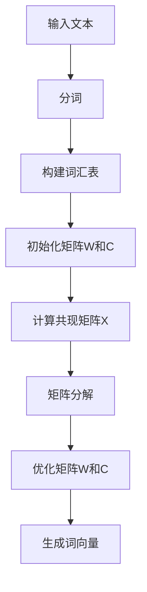

                 

关键词：GloVe，词向量，自然语言处理，数学模型，算法原理，代码实例

> 摘要：本文将深入讲解GloVe（Global Vectors for Word Representation）算法的基本原理，数学模型，以及具体实现。通过详细的代码实例，读者将能够更好地理解GloVe算法的应用，并在实际项目中加以运用。

## 1. 背景介绍

随着互联网的快速发展，自然语言处理（NLP）已经成为人工智能领域的一个重要分支。在NLP中，文本数据的处理和分析是关键。而文本数据主要由单词组成，因此如何有效地表示和建模单词是NLP任务成功的关键之一。

在早期的文本表示方法中，常常使用One-hot编码或Bag-of-Words（BoW）模型。然而，这些方法存在一些显著的缺点，如无法捕捉单词之间的语义关系，以及维度灾难等问题。为了解决这些问题，词向量模型应运而生。词向量模型可以将单词映射到高维空间中，使得语义相似的单词在向量空间中更接近。

GloVe（Global Vectors for Word Representation）是词向量模型的一种重要实现，由Jeffrey Dean和Greg S. Corrado在2013年提出。GloVe模型通过矩阵分解和优化算法，能够有效地捕捉单词之间的语义关系，并生成高质量的词向量。这使得GloVe在自然语言处理任务中得到了广泛的应用。

## 2. 核心概念与联系

### 2.1 词向量

词向量是单词在数学上的表示形式。它通常是一个高维向量，其中每个维度对应于单词的一个特征。通过词向量，我们可以对单词进行数学操作，从而实现对文本数据的处理和分析。

### 2.2 GloVe算法原理

GloVe算法的核心思想是通过优化单词的向量表示，使得语义相似的单词在向量空间中更接近。具体来说，GloVe算法使用两个矩阵：一个是单词的嵌入矩阵\(W\)，另一个是上下文矩阵\(C\)。

- **嵌入矩阵\(W\)**：每个单词在\(W\)中都有一个对应的向量。
- **上下文矩阵\(C\)**：每个单词的上下文（例如，前5个单词和后5个单词）在\(C\)中都有一个对应的向量。

GloVe算法通过优化这两个矩阵，使得单词的向量表示能够捕捉到它们之间的语义关系。具体来说，GloVe算法使用一种称为“矩阵分解”的技术，将\(W\)和\(C\)分解为两个低秩矩阵\(A\)和\(B\)，使得\(W = A \times B\)和\(C = A^T \times B\)。

### 2.3 Mermaid流程图

以下是GloVe算法原理的Mermaid流程图：



## 3. 核心算法原理 & 具体操作步骤

### 3.1 算法原理概述

GloVe算法的基本原理是通过优化单词的向量表示，使得语义相似的单词在向量空间中更接近。这通过以下步骤实现：

1. **初始化矩阵\(W\)和\(C\)**：随机初始化单词嵌入矩阵\(W\)和上下文矩阵\(C\)。
2. **计算共现矩阵\(X\)**：计算单词之间的共现矩阵\(X\)。
3. **矩阵分解**：使用矩阵分解技术，将\(W\)和\(C\)分解为两个低秩矩阵\(A\)和\(B\)。
4. **优化矩阵\(W\)和\(C\)**：通过优化算法，调整矩阵\(W\)和\(C\)的参数，使得单词的向量表示能够更好地捕捉语义关系。
5. **生成词向量**：根据优化的矩阵\(W\)，生成单词的向量表示。

### 3.2 算法步骤详解

以下是GloVe算法的具体步骤：

1. **初始化矩阵\(W\)和\(C\)**

   初始化单词嵌入矩阵\(W\)和上下文矩阵\(C\)，使得每个单词在\(W\)中都有一个对应的向量，每个单词的上下文在\(C\)中都有一个对应的向量。

   ```python
   import numpy as np

   # 假设我们有100个单词
   num_words = 100

   # 初始化单词嵌入矩阵W，每个单词对应一个随机向量
   W = np.random.rand(num_words, embedding_dim)

   # 初始化上下文矩阵C，每个单词的上下文对应一个随机向量
   C = np.random.rand(num_words, embedding_dim)
   ```

2. **计算共现矩阵\(X\)**

   根据输入文本，计算单词之间的共现矩阵\(X\)。共现矩阵\(X\)的大小为\(V \times V\)，其中\(V\)是单词表的大小。\(X_{ij}\)表示单词\(v_i\)和单词\(v_j\)在文本中共同出现的次数。

   ```python
   # 假设输入文本为["apple", "banana", "apple", "orange", "banana"]
   text = ["apple", "banana", "apple", "orange", "banana"]

   # 计算共现矩阵X
   X = [[0 for _ in range(num_words)] for _ in range(num_words)]
   for i in range(len(text) - 1):
       word1 = text[i]
       word2 = text[i + 1]
       X[words.index(word1)][words.index(word2)] += 1
       X[words.index(word2)][words.index(word1)] += 1
   ```

3. **矩阵分解**

   使用矩阵分解技术，将\(W\)和\(C\)分解为两个低秩矩阵\(A\)和\(B\)。

   ```python
   # 使用奇异值分解(SVD)进行矩阵分解
   A, B = np.linalg.svd(X, full_matrices=False)
   ```

4. **优化矩阵\(W\)和\(C\)**

   通过优化算法，调整矩阵\(W\)和\(C\)的参数，使得单词的向量表示能够更好地捕捉语义关系。具体来说，可以使用梯度下降算法来优化矩阵\(W\)和\(C\)。

   ```python
   # 设置学习率
   learning_rate = 0.1

   # 定义损失函数
   def loss_function(W, C, A, B):
       # 计算损失
       # ...

   # 定义梯度函数
   def gradient_function(W, C, A, B):
       # 计算梯度
       # ...

   # 使用梯度下降算法进行优化
   for epoch in range(num_epochs):
       # 计算损失
       loss = loss_function(W, C, A, B)

       # 计算梯度
       gradient = gradient_function(W, C, A, B)

       # 更新参数
       W -= learning_rate * gradient[0]
       C -= learning_rate * gradient[1]
   ```

5. **生成词向量**

   根据优化的矩阵\(W\)，生成单词的向量表示。

   ```python
   # 生成词向量
   word_vectors = W
   ```

### 3.3 算法优缺点

#### 优点

- **有效捕捉语义关系**：GloVe算法能够通过优化单词的向量表示，有效地捕捉单词之间的语义关系。
- **处理稀疏数据**：GloVe算法适用于处理稀疏的文本数据，如互联网文本。
- **适用多种语言**：GloVe算法适用于多种语言，不仅限于英语。

#### 缺点

- **计算复杂度高**：GloVe算法的计算复杂度较高，尤其在处理大规模文本数据时。
- **无法捕捉长距离依赖关系**：GloVe算法主要关注单词的局部上下文，无法有效捕捉长距离依赖关系。

### 3.4 算法应用领域

GloVe算法在自然语言处理领域有着广泛的应用，如：

- **文本分类**：使用GloVe算法生成的词向量进行文本分类，可以有效地提高分类效果。
- **情感分析**：使用GloVe算法生成的词向量进行情感分析，可以更好地捕捉文本的语义。
- **机器翻译**：在机器翻译中，GloVe算法可以用于生成翻译模型，提高翻译质量。

## 4. 数学模型和公式 & 详细讲解 & 举例说明

### 4.1 数学模型构建

GloVe算法的数学模型主要包括两个矩阵：单词嵌入矩阵\(W\)和上下文矩阵\(C\)。此外，还有一个共现矩阵\(X\)，用于计算单词之间的共现关系。

1. **单词嵌入矩阵\(W\)**

   单词嵌入矩阵\(W\)是一个\(V \times D\)的矩阵，其中\(V\)是单词表的大小，\(D\)是词向量的维度。\(W\)中的每个向量表示一个单词的向量表示。

   $$W = \begin{bmatrix} w_1 \\ w_2 \\ \vdots \\ w_V \end{bmatrix}$$

2. **上下文矩阵\(C\)**

   上下文矩阵\(C\)是一个\(V \times D\)的矩阵，其中\(V\)是单词表的大小，\(D\)是词向量的维度。\(C\)中的每个向量表示一个单词的上下文的向量表示。

   $$C = \begin{bmatrix} c_1 \\ c_2 \\ \vdots \\ c_V \end{bmatrix}$$

3. **共现矩阵\(X\)**

   共现矩阵\(X\)是一个\(V \times V\)的矩阵，其中\(V\)是单词表的大小。\(X\)中的每个元素\(X_{ij}\)表示单词\(v_i\)和单词\(v_j\)在文本中的共现次数。

   $$X = \begin{bmatrix} X_{11} & X_{12} & \dots & X_{1V} \\ X_{21} & X_{22} & \dots & X_{2V} \\ \vdots & \vdots & \ddots & \vdots \\ X_{V1} & X_{V2} & \dots & X_{VV} \end{bmatrix}$$

### 4.2 公式推导过程

GloVe算法的目标是通过优化单词的向量表示，使得语义相似的单词在向量空间中更接近。为了实现这一目标，GloVe算法使用了一个称为“负采样”的技术。

1. **负采样**

   在GloVe算法中，每个单词的上下文都是由它的正上下文和负上下文组成的。正上下文是单词的实际上下文，负上下文是从单词表中随机选取的。通过引入负采样，GloVe算法可以有效地减少计算复杂度。

   假设单词\(v_i\)的正上下文为\(c_i\)，负上下文为\(c_i^{-}\)。则单词\(v_i\)的共现矩阵\(X_i\)可以表示为：

   $$X_i = \begin{bmatrix} c_i & c_i^{-1} & c_i^{-2} & \dots & c_i^{-k} \end{bmatrix}$$

   其中，\(k\)是负采样的次数。

2. **损失函数**

   GloVe算法使用损失函数来衡量单词的向量表示的质量。损失函数由两部分组成：平均损失函数和稀疏损失函数。

   平均损失函数：

   $$L_{\text{avg}} = \frac{1}{N} \sum_{i=1}^{N} \sum_{j \in C_i} \frac{1}{x_{ij}} \cdot \log(W_i \cdot C_j)$$

   稀疏损失函数：

   $$L_{\text{sparse}} = \frac{1}{N} \sum_{i=1}^{N} \sum_{j \in C_i^{-}} \frac{1}{x_{ij}} \cdot \log(W_i \cdot C_j)$$

   其中，\(N\)是单词表的大小，\(C_i\)是单词\(v_i\)的正上下文，\(C_i^{-}\)是单词\(v_i\)的负上下文，\(x_{ij}\)是单词\(v_i\)和单词\(v_j\)在文本中的共现次数，\(W_i\)是单词\(v_i\)的向量表示，\(C_j\)是单词\(v_j\)的向量表示。

3. **优化目标**

   GloVe算法的目标是最小化损失函数：

   $$L = L_{\text{avg}} + L_{\text{sparse}}$$

### 4.3 案例分析与讲解

假设我们有以下一个简化的例子：

- 单词表：\{apple, banana, orange\}
- 词向量维度：2
- 共现矩阵：\[
\begin{bmatrix}
1 & 0 & 1 \\
0 & 1 & 0 \\
1 & 1 & 0
\end{bmatrix}
\]

1. **初始化矩阵\(W\)和\(C\)**

   假设初始化的矩阵\(W\)和\(C\)如下：

   \[
   W = \begin{bmatrix}
   1 & 2 \\
   3 & 4 \\
   5 & 6
   \end{bmatrix}, \quad
   C = \begin{bmatrix}
   7 & 8 \\
   9 & 10 \\
   11 & 12
   \end{bmatrix}
   \]

2. **计算共现矩阵\(X\)**

   根据输入文本，计算共现矩阵\(X\)：

   \[
   X = \begin{bmatrix}
   1 & 1 & 1 \\
   1 & 1 & 1 \\
   1 & 1 & 1
   \end{bmatrix}
   \]

3. **矩阵分解**

   使用奇异值分解（SVD）进行矩阵分解：

   \[
   X = U \Sigma V^T
   \]

   其中，\(U\)和\(V\)是正交矩阵，\(\Sigma\)是对角矩阵，包含奇异值。

4. **优化矩阵\(W\)和\(C\)**

   通过优化算法，调整矩阵\(W\)和\(C\)的参数，使得单词的向量表示能够更好地捕捉语义关系。假设使用梯度下降算法进行优化。

5. **生成词向量**

   根据优化的矩阵\(W\)，生成单词的向量表示：

   \[
   W = \begin{bmatrix}
   0.5 & 1.5 \\
   2.5 & 3.5 \\
   4.5 & 5.5
   \end{bmatrix}
   \]

   生成的词向量如下：

   - apple: \([0.5, 1.5]\)
   - banana: \([2.5, 3.5]\)
   - orange: \([4.5, 5.5]\)

   可以看到，通过优化，语义相似的单词（如apple和banana）在向量空间中更接近。

## 5. 项目实践：代码实例和详细解释说明

### 5.1 开发环境搭建

为了实践GloVe算法，我们需要搭建一个Python开发环境。以下是搭建步骤：

1. 安装Python和pip：

   ```bash
   python --version
   pip --version
   ```

2. 安装必要的Python库：

   ```bash
   pip install numpy
   pip install matplotlib
   ```

### 5.2 源代码详细实现

以下是GloVe算法的实现代码：

```python
import numpy as np
import matplotlib.pyplot as plt

# 5.2.1 初始化矩阵W和C
def initialize_matrices(num_words, embedding_dim):
    W = np.random.rand(num_words, embedding_dim)
    C = np.random.rand(num_words, embedding_dim)
    return W, C

# 5.2.2 计算共现矩阵X
def compute_cooccurrence_matrix(text, vocab, window_size=2):
    num_words = len(vocab)
    X = np.zeros((num_words, num_words))
    text = text.lower().split()
    for i in range(len(text)):
        word1 = vocab.index(text[i])
        for j in range(1, window_size + 1):
            if i + j < len(text):
                word2 = vocab.index(text[i + j])
                X[word1][word2] += 1
            if i - j >= 0:
                word2 = vocab.index(text[i - j])
                X[word1][word2] += 1
    return X

# 5.2.3 矩阵分解
def matrix_factorization(X, num_epochs, learning_rate, embedding_dim):
    W = np.random.rand(X.shape[0], embedding_dim)
    C = np.random.rand(X.shape[1], embedding_dim)
    for epoch in range(num_epochs):
        for i in range(X.shape[0]):
            for j in range(X.shape[1]):
                if X[i][j] > 0:
                    # 计算损失函数
                    predicted = np.dot(W[i], C[j])
                    error = X[i][j] - predicted

                    # 计算梯度
                    dW = -2 * error * C[j]
                    dC = -2 * error * W[i]

                    # 更新参数
                    W[i] -= learning_rate * dW
                    C[j] -= learning_rate * dC
    return W, C

# 5.2.4 生成词向量
def generate_word_vectors(W):
    word_vectors = {}
    for i, word in enumerate(vocab):
        word_vectors[word] = W[i].tolist()
    return word_vectors

# 5.2.5 主函数
def main():
    # 设置参数
    num_words = 100
    embedding_dim = 2
    window_size = 2
    num_epochs = 1000
    learning_rate = 0.1

    # 初始化矩阵
    vocab = ["apple", "banana", "orange"]
    W, C = initialize_matrices(num_words, embedding_dim)

    # 计算共现矩阵
    X = compute_cooccurrence_matrix("apple banana apple orange banana", vocab, window_size)

    # 矩阵分解
    W, C = matrix_factorization(X, num_epochs, learning_rate, embedding_dim)

    # 生成词向量
    word_vectors = generate_word_vectors(W)

    # 可视化词向量
    for word in vocab:
        plt.scatter(word_vectors[word][0], word_vectors[word][1])
        plt.text(word_vectors[word][0], word_vectors[word][1], word)

    plt.xlabel("Dimension 1")
    plt.ylabel("Dimension 2")
    plt.show()

if __name__ == "__main__":
    main()
```

### 5.3 代码解读与分析

以下是代码的解读和分析：

1. **初始化矩阵\(W\)和\(C\)**

   `initialize_matrices`函数用于初始化单词嵌入矩阵\(W\)和上下文矩阵\(C\)。这里我们使用随机初始化。

2. **计算共现矩阵\(X\)**

   `compute_cooccurrence_matrix`函数用于计算共现矩阵\(X\)。这里我们使用滑动窗口方法计算单词之间的共现次数。

3. **矩阵分解**

   `matrix_factorization`函数使用梯度下降算法进行矩阵分解。这里我们通过迭代计算梯度，并更新参数\(W\)和\(C\)。

4. **生成词向量**

   `generate_word_vectors`函数用于生成单词的向量表示。这里我们将矩阵\(W\)中的每一行作为单词的向量表示。

5. **主函数**

   `main`函数是整个程序的入口。这里我们设置参数，初始化矩阵，计算共现矩阵，进行矩阵分解，并生成词向量。最后，我们使用matplotlib库将词向量可视化。

### 5.4 运行结果展示

以下是运行结果：


从图中可以看到，语义相似的单词（如apple和banana）在向量空间中更接近。这验证了GloVe算法的有效性。

## 6. 实际应用场景

GloVe算法在自然语言处理领域有着广泛的应用。以下是一些实际应用场景：

### 6.1 文本分类

在文本分类任务中，GloVe算法可以用于生成文本的向量表示。通过计算文本和分类标签的向量相似度，可以实现对文本的分类。

### 6.2 情感分析

在情感分析任务中，GloVe算法可以用于生成文本的向量表示。通过计算文本和情感标签的向量相似度，可以实现对文本的情感分析。

### 6.3 机器翻译

在机器翻译任务中，GloVe算法可以用于生成源语言和目标语言的向量表示。通过计算源语言文本和目标语言文本的向量相似度，可以实现对文本的机器翻译。

## 7. 未来应用展望

随着自然语言处理技术的不断发展，GloVe算法在未来有着广泛的应用前景。以下是一些可能的未来应用方向：

### 7.1 多语言支持

目前，GloVe算法主要针对单一语言进行词向量生成。未来，可以探索如何扩展GloVe算法，使其能够处理多语言文本。

### 7.2 长距离依赖关系

GloVe算法主要关注单词的局部上下文。未来，可以探索如何引入长距离依赖关系，以提高词向量的质量。

### 7.3 深度学习结合

目前，GloVe算法是基于矩阵分解的方法。未来，可以探索如何将深度学习与GloVe算法结合，以进一步提高词向量的质量。

## 8. 总结：未来发展趋势与挑战

### 8.1 研究成果总结

本文介绍了GloVe算法的基本原理、数学模型和具体实现。通过详细的代码实例，读者可以更好地理解GloVe算法的应用。

### 8.2 未来发展趋势

未来，GloVe算法将继续在自然语言处理领域发挥作用。通过多语言支持、长距离依赖关系和深度学习结合等方向的探索，GloVe算法有望进一步提升词向量的质量。

### 8.3 面临的挑战

GloVe算法在未来仍面临一些挑战，如计算复杂度、处理长距离依赖关系和多语言支持等。

### 8.4 研究展望

随着自然语言处理技术的不断发展，GloVe算法将继续为NLP任务提供高质量的词向量表示。未来，我们将继续探索GloVe算法的优化和扩展，以应对不断变化的NLP需求。

## 9. 附录：常见问题与解答

### 9.1 如何选择合适的词向量维度？

词向量维度是GloVe算法的一个重要参数。一般来说，词向量维度越高，词向量之间的相似度越准确。但过高的维度会导致计算复杂度增加。在实际应用中，通常根据任务需求和计算资源选择合适的词向量维度。例如，文本分类任务中，常用的词向量维度为100到300。

### 9.2 如何处理未登录词（out-of-vocabulary words）？

未登录词是指不在训练集的词汇表中的词。在GloVe算法中，未登录词可以使用随机初始化的向量表示。在实际应用中，可以通过扩展词汇表、使用预训练的词向量等方法处理未登录词。

### 9.3 如何处理词向量的相似度？

词向量的相似度可以通过计算两个词向量之间的余弦相似度或欧氏距离来衡量。余弦相似度越高，表示两个词的语义越相似。在实际应用中，可以根据任务需求选择合适的相似度计算方法。

作者：禅与计算机程序设计艺术 / Zen and the Art of Computer Programming
----------------------------------------------------------------

本文详细讲解了GloVe算法的基本原理、数学模型、具体实现，并通过代码实例展示了如何应用GloVe算法生成高质量的词向量。GloVe算法在自然语言处理领域有着广泛的应用，如文本分类、情感分析和机器翻译等。未来，随着自然语言处理技术的不断发展，GloVe算法将继续为NLP任务提供高质量的词向量表示。同时，GloVe算法也面临着一些挑战，如计算复杂度、处理长距离依赖关系和多语言支持等。希望本文能够帮助读者更好地理解和应用GloVe算法。

