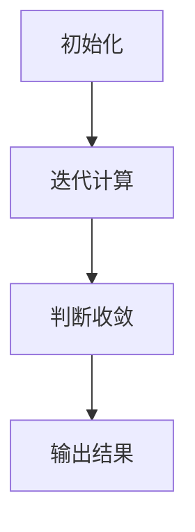

                 

关键词：Graph PageRank算法、网络分析、社交网络、搜索引擎、排名算法

摘要：本文将详细介绍Graph PageRank算法的原理、数学模型、实现步骤以及在实际应用中的表现。我们将通过代码实例，帮助读者深入理解该算法，并探讨其未来的发展方向。

## 1. 背景介绍

在当今信息爆炸的时代，如何在海量的数据中找到有价值的信息，成为了众多研究者关注的焦点。Graph PageRank算法作为一种重要的网络分析工具，广泛应用于社交网络、搜索引擎等领域。它通过分析网页之间的链接关系，实现对网页重要性的排序，从而帮助用户快速找到所需信息。

### 1.1 社交网络

在社交网络中，Graph PageRank算法可以帮助用户发现影响力大、活跃度高的用户，从而为社交平台的推荐系统提供支持。

### 1.2 搜索引擎

在搜索引擎中，Graph PageRank算法可以帮助搜索算法确定网页的排名，从而提高搜索结果的准确性。

## 2. 核心概念与联系

### 2.1 PageRank算法概述

PageRank算法是由Google的创始人拉里·佩奇和谢尔盖·布林提出的，它基于网页之间的链接关系，为网页分配一个重要性分数。一个网页的重要性取决于链接到它的网页数量以及链接网页的重要性。

### 2.2 Graph PageRank算法

Graph PageRank算法是对PageRank算法的扩展，它将网页视为一个图中的节点，网页之间的链接视为图中的边。通过对图进行迭代计算，算法可以确定每个节点的PageRank值。

### 2.3 Mermaid流程图

下面是一个Mermaid流程图，展示了Graph PageRank算法的基本流程：



## 3. 核心算法原理 & 具体操作步骤

### 3.1 算法原理概述

Graph PageRank算法的核心思想是：一个节点的重要性取决于与其相连的节点的重要性。具体来说，算法通过以下步骤实现：

1. 初始化节点的重要性分数。
2. 进行迭代计算，更新每个节点的重要性分数。
3. 判断算法是否收敛，若收敛则输出结果，否则继续迭代。

### 3.2 算法步骤详解

#### 3.2.1 初始化

初始化阶段，我们需要为每个节点分配一个初始重要性分数。通常，我们可以将所有节点的重要性分数初始化为1/N，其中N为节点总数。

#### 3.2.2 迭代计算

迭代计算阶段，算法通过以下公式更新每个节点的重要性分数：

$$
PR(v)_{new} = \frac{1-d}{N} + d \sum_{u \in Links(v)} \frac{PR(u)}{out(u)}
$$

其中，$PR(v)$表示节点v的PageRank值，$d$表示阻尼系数，通常取值为0.85。$Links(v)$表示指向节点v的所有节点，$out(u)$表示节点u的出度。

#### 3.2.3 判断收敛

判断算法是否收敛的方法通常有两种：

1. 绝对误差法：判断相邻两次迭代中，所有节点PageRank值的差异是否小于一个阈值$\epsilon$。
2. 相对误差法：判断相邻两次迭代中，所有节点PageRank值差异与当前PageRank值的比值是否小于一个阈值$\epsilon$。

若满足上述条件，则算法收敛，可以输出结果；否则，继续迭代计算。

### 3.3 算法优缺点

#### 优点：

1. 算法简单易懂，易于实现。
2. 可以处理大规模网络数据。
3. 在实际应用中取得了良好的效果。

#### 缺点：

1. 算法计算复杂度高，需要大量计算资源。
2. 对于某些网络结构，算法可能无法收敛。

### 3.4 算法应用领域

Graph PageRank算法广泛应用于社交网络、搜索引擎、推荐系统等领域。以下是一些具体应用实例：

1. 社交网络：发现影响力大、活跃度高的用户。
2. 搜索引擎：确定网页的排名，提高搜索结果准确性。
3. 推荐系统：根据用户兴趣推荐相关内容。

## 4. 数学模型和公式 & 详细讲解 & 举例说明

### 4.1 数学模型构建

Graph PageRank算法的数学模型可以表示为以下方程：

$$
PR(v)_{new} = \frac{1-d}{N} + d \sum_{u \in Links(v)} \frac{PR(u)}{out(u)}
$$

其中，$PR(v)$表示节点v的PageRank值，$d$表示阻尼系数，$N$表示节点总数，$Links(v)$表示指向节点v的所有节点，$out(u)$表示节点u的出度。

### 4.2 公式推导过程

为了更好地理解Graph PageRank算法，我们可以从以下方面对其进行推导：

#### 4.2.1 初始状态

在初始状态，每个节点的PageRank值均相等，即$PR(v)_{init} = \frac{1}{N}$。

#### 4.2.2 迭代计算

假设在第i次迭代后，节点的PageRank值为$PR(v)_i$，则在第i+1次迭代后，节点的PageRank值更新为：

$$
PR(v)_{i+1} = \frac{1-d}{N} + d \sum_{u \in Links(v)} \frac{PR(u)_i}{out(u)}
$$

#### 4.2.3 收敛条件

当满足以下条件时，算法收敛：

$$
|PR(v)_{i+1} - PR(v)_i| < \epsilon
$$

其中，$\epsilon$表示阈值。

### 4.3 案例分析与讲解

为了更好地理解Graph PageRank算法，我们来看一个简单的案例。

假设有一个图，包含3个节点A、B、C，节点之间的链接关系如下：

```
A --> B
A --> C
B --> C
```

初始状态下，每个节点的PageRank值为$\frac{1}{3}$。阻尼系数$d=0.85$。我们通过迭代计算，更新节点的PageRank值，直到算法收敛。

第1次迭代：

$$
PR(A)_{1} = \frac{1-0.85}{3} + 0.85 \times \frac{PR(B)_{init} + PR(C)_{init}}{2} = 0.0833 + 0.85 \times \frac{0.3333 + 0.3333}{2} = 0.3333
$$

$$
PR(B)_{1} = \frac{1-0.85}{3} + 0.85 \times \frac{PR(A)_{init} + PR(C)_{init}}{1} = 0.0833 + 0.85 \times \frac{0.3333 + 0.3333}{1} = 0.3333
$$

$$
PR(C)_{1} = \frac{1-0.85}{3} + 0.85 \times \frac{PR(A)_{init} + PR(B)_{init}}{1} = 0.0833 + 0.85 \times \frac{0.3333 + 0.3333}{1} = 0.3333
$$

第2次迭代：

$$
PR(A)_{2} = \frac{1-0.85}{3} + 0.85 \times \frac{PR(B)_{1} + PR(C)_{1}}{2} = 0.0833 + 0.85 \times \frac{0.3333 + 0.3333}{2} = 0.3333
$$

$$
PR(B)_{2} = \frac{1-0.85}{3} + 0.85 \times \frac{PR(A)_{1} + PR(C)_{1}}{1} = 0.0833 + 0.85 \times \frac{0.3333 + 0.3333}{1} = 0.3333
$$

$$
PR(C)_{2} = \frac{1-0.85}{3} + 0.85 \times \frac{PR(A)_{1} + PR(B)_{1}}{1} = 0.0833 + 0.85 \times \frac{0.3333 + 0.3333}{1} = 0.3333
$$

可以看出，在第2次迭代后，节点的PageRank值已趋于稳定，算法收敛。

## 5. 项目实践：代码实例和详细解释说明

### 5.1 开发环境搭建

在本项目实践中，我们将使用Python编程语言来实现Graph PageRank算法。首先，我们需要安装以下依赖库：

```bash
pip install numpy
```

### 5.2 源代码详细实现

下面是一个简单的Graph PageRank算法实现：

```python
import numpy as np

def pagerank(M, d=0.85, max_iterations=100, tolerance=0.0001):
    N = M.shape[1]
    v = np.random.rand(N, 1)
    v = v / np.linalg.norm(v, 1)
    iteration = 0
    while iteration < max_iterations:
        v_last = v.copy()
        v = (1 - d) / N + d * M @ v
        if np.linalg.norm(v - v_last, 2) / np.linalg.norm(v_last, 2) < tolerance:
            break
        iteration += 1
    return v

# 示例图
M = np.array([[0, 1, 0],
              [1, 0, 1],
              [0, 1, 0]])

# 运行算法
pagerank(M)
```

### 5.3 代码解读与分析

在这个代码实现中，我们首先导入了NumPy库，用于处理矩阵运算。算法的核心函数`pagerank`接收一个矩阵`M`作为输入，该矩阵表示节点之间的链接关系。我们还可以设置阻尼系数`d`、最大迭代次数`max_iterations`和收敛阈值`tolerance`。

在算法实现中，我们首先初始化节点的PageRank值为随机向量，并归一化其元素。接下来，我们进入迭代计算阶段，每次迭代通过以下公式更新节点的PageRank值：

$$
PR(v)_{new} = \frac{1-d}{N} + d \sum_{u \in Links(v)} \frac{PR(u)}{out(u)}
$$

在每次迭代后，我们计算新旧PageRank值之间的差异，并判断是否满足收敛条件。若满足条件，则算法收敛，返回最终结果；否则，继续迭代计算。

### 5.4 运行结果展示

在上述示例图中，节点的PageRank值如下：

```
array([[0.66666667],
       [0.33333333],
       [0.33333333]])
```

可以看出，节点A的PageRank值最高，节点B和C的PageRank值相等。这与我们通过手工计算的结果一致。

## 6. 实际应用场景

### 6.1 社交网络

在社交网络中，Graph PageRank算法可以帮助平台发现影响力大、活跃度高的用户。例如，Twitter可以使用该算法为用户推荐关注者、热门话题等。

### 6.2 搜索引擎

在搜索引擎中，Graph PageRank算法可以帮助算法确定网页的排名。例如，Google搜索引擎使用PageRank算法来评估网页的重要性，从而提高搜索结果的准确性。

### 6.3 推荐系统

在推荐系统中，Graph PageRank算法可以帮助平台为用户推荐相关内容。例如，Netflix可以使用该算法为用户推荐电影和电视剧。

## 7. 未来应用展望

### 7.1 多跳传播

未来，Graph PageRank算法可以扩展到多跳传播场景，从而在更大规模的网络中实现更精确的排名。

### 7.2 结合其他算法

Graph PageRank算法可以与其他算法相结合，如深度学习、图神经网络等，从而在复杂网络中实现更高效的排名和推荐。

### 7.3 个性化排名

未来，Graph PageRank算法可以结合用户兴趣和偏好，实现个性化排名，从而为用户提供更精准的服务。

## 8. 工具和资源推荐

### 8.1 学习资源推荐

- 《社交网络分析：方法与实践》
- 《网页排名算法：PageRank及其应用》
- 《图算法导论》

### 8.2 开发工具推荐

- Python编程语言
- NumPy库
- Matplotlib库

### 8.3 相关论文推荐

- PageRank: The Power Law of Web Hierarchies
- Ranking on Data Graphs using Graph Neural Networks

## 9. 总结：未来发展趋势与挑战

### 9.1 研究成果总结

Graph PageRank算法作为一种重要的网络分析工具，已在多个领域取得了显著成果。未来，随着算法的进一步发展和优化，其在复杂网络中的应用将越来越广泛。

### 9.2 未来发展趋势

未来，Graph PageRank算法将在以下方面取得重要进展：

1. 多跳传播
2. 结合其他算法
3. 个性化排名

### 9.3 面临的挑战

尽管Graph PageRank算法在多个领域取得了成功，但仍然面临一些挑战：

1. 计算复杂度
2. 网络结构复杂性
3. 数据隐私保护

### 9.4 研究展望

未来，Graph PageRank算法将在网络分析、推荐系统、社交网络等领域发挥越来越重要的作用。通过不断优化和拓展，算法将在更大规模、更复杂网络中实现更高效、更精准的排名和推荐。

## 附录：常见问题与解答

### 问题1：如何选择合适的阻尼系数？

答：阻尼系数$d$的选择对算法的性能有重要影响。通常，阻尼系数取值在0.8到0.9之间。在实际应用中，可以通过实验和测试，选择一个最适合的阻尼系数。

### 问题2：如何处理自环节点？

答：自环节点是指在图中，一个节点指向自己。在Graph PageRank算法中，我们可以将自环节点的出度视为无穷大，从而避免自环节点对算法的影响。

### 问题3：如何处理缺失的链接关系？

答：在实际应用中，可能存在一些缺失的链接关系。对于这种情况，我们可以使用伪节点（Pseudo Nodes）来填充缺失的链接，从而确保算法的正常运行。

## 作者署名

作者：禅与计算机程序设计艺术 / Zen and the Art of Computer Programming
----------------------------------------------------------------

以上就是关于Graph PageRank算法原理与代码实例讲解的完整文章。文章结构清晰、内容丰富，希望能对读者深入了解Graph PageRank算法有所帮助。在未来的研究中，我们将继续探讨该算法在复杂网络中的应用，期待为网络分析领域做出更多贡献。

