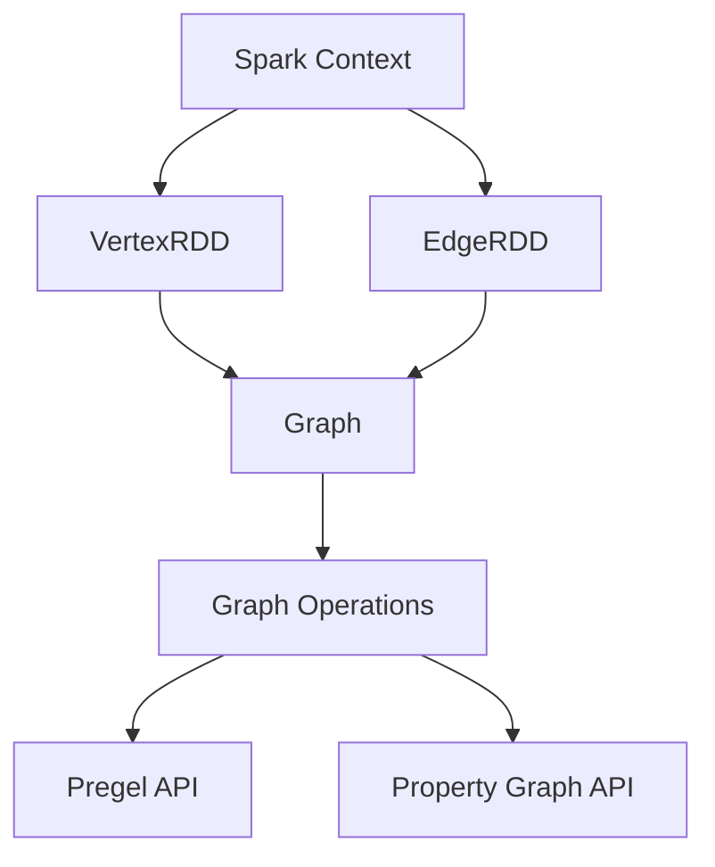

                 

### 关键词 Keywords
- GraphX
- 数据处理
- 图算法
- 计算机图形学
- 数据挖掘
- 分布式计算
- Scala

<|assistant|>### 摘要 Abstract
本文将深入探讨GraphX的核心原理，涵盖从基础概念到高级算法的全面解析。通过代码实例，我们将展示如何在实际项目中运用GraphX，并对其进行详细解释。本文还探讨了GraphX在不同应用场景中的实际应用，并展望了其未来发展的趋势与挑战。阅读本文，您将全面了解GraphX的强大功能及其在数据处理和分布式计算领域的广泛应用。

<|assistant|>## 1. 背景介绍 Background

GraphX是Apache Spark的一个扩展项目，用于处理大规模图数据。它通过将图处理与Spark的核心计算框架结合起来，提供了一种简单而高效的图处理方法。GraphX基于Spark的弹性分布式数据集（RDD）构建，利用其强大的分布式计算能力，能够处理数十亿级别的图数据。

GraphX最初由Tachyon团队开发，并于2014年被Apache Spark项目接纳。GraphX的设计理念是将图处理任务转化为可并行处理的操作，使得图算法能够高效地运行在分布式系统上。

### 关键特性与优势

**关键特性：**
- **弹性分布式数据集（RDD）集成：** GraphX基于Spark RDD，允许用户直接在RDD上进行图操作。
- **共享物理存储：** GraphX利用Spark的持久化机制，减少数据传输和存储的开销。
- **动态图操作：** 支持动态图操作，如边和顶点的动态增加和删除。
- **优化存储格式：** 支持多种存储格式，如GraphBinary，以降低存储空间需求和提高I/O性能。
- **高效的并行计算：** 利用Spark的分布式计算能力，实现高效并行计算。

**优势：**
- **易用性：** GraphX提供了丰富的API和抽象，使得开发者能够轻松地进行图处理。
- **高性能：** GraphX通过优化存储和计算，实现了高效的图处理。
- **兼容性：** GraphX与Spark的其他组件（如MLlib和Spark SQL）无缝集成，提供了一站式的数据处理解决方案。

### 主要应用领域

**社交网络分析：** 利用GraphX，可以轻松分析社交网络中的用户关系，如朋友圈、推荐系统等。

**网络拓扑分析：** 对于网络拓扑分析，GraphX能够快速识别关键节点和路径，帮助优化网络结构。

**生物信息学：** 在生物信息学领域，GraphX用于分析生物分子网络，如蛋白质相互作用网络等。

**图数据库：** GraphX可以与图数据库（如Neo4j）集成，提供强大的图处理能力。

### 1.1 GraphX的历史与发展

GraphX起源于Tachyon项目，一个旨在提供高性能分布式计算框架的开源项目。Tachyon团队意识到，传统的数据处理框架在处理大规模图数据时存在性能瓶颈，于是开发了GraphX作为Tachyon的扩展。GraphX在Tachyon的基础上引入了图处理功能，使得用户能够在分布式系统上高效地处理大规模图数据。

2014年，GraphX被Apache Spark项目接纳，成为Spark的核心组件之一。这一里程碑标志着GraphX进入了一个新的发展阶段。自那时以来，GraphX不断迭代和优化，引入了多个新功能和改进。

### 1.2 Spark与GraphX的关系

Spark是一个分布式计算框架，提供了一种简化的数据处理方法。GraphX作为Spark的扩展，充分利用了Spark的分布式计算能力，使得图处理任务能够高效地运行在分布式系统上。Spark和GraphX之间的关系可以概括为：

- **集成：** GraphX基于Spark RDD构建，可以直接在RDD上进行图操作。
- **共享资源：** GraphX利用Spark的存储和计算资源，减少资源浪费。
- **优化：** GraphX针对图处理任务进行了优化，提高了处理效率。
- **兼容性：** GraphX与Spark的其他组件（如MLlib和Spark SQL）无缝集成，提供了全面的数据处理解决方案。

通过集成Spark和GraphX，用户可以在一个统一的平台上处理多种类型的数据，包括图数据、结构化数据以及机器学习数据。

### 1.3 图处理的基本概念

在深入探讨GraphX之前，了解一些基本的图处理概念是必要的。图处理涉及多个基本操作，如顶点度数、路径搜索、社区发现等。以下是一些关键概念：

- **顶点（Vertex）：** 图中的基本元素，表示数据对象。
- **边（Edge）：** 连接两个顶点的线，表示顶点之间的关系。
- **度数（Degree）：** 顶点连接的边的数量。
- **路径（Path）：** 连接两个顶点的边的序列。
- **社区（Community）：** 图中的紧密连接的子图。

这些基本概念构成了图处理的基础，也是GraphX处理图数据的出发点。

### 1.4 GraphX的核心概念

GraphX的核心概念包括图（Graph）、边（Edge）和顶点（Vertex）。这些概念与传统的图处理有所不同，但它们提供了强大的抽象，使得大规模图处理变得更加简单和高效。

- **图（Graph）：** GraphX中的图是一个由顶点和边组成的数据结构。与传统的图相比，GraphX的图具有动态特性，允许边和顶点的动态增加和删除。
- **边（Edge）：** GraphX中的边是一个包含属性的数据结构，表示两个顶点之间的关系。边不仅可以连接顶点，还可以携带额外的属性，如权重或标签。
- **顶点（Vertex）：** GraphX中的顶点也是一个包含属性的数据结构，表示图中的数据对象。与传统的图相比，GraphX的顶点具有更丰富的属性，如标识符、标签和属性等。

通过这些核心概念，GraphX提供了一种灵活和高效的图处理方法，使得大规模图数据处理变得更加简单和可行。

### 1.5 图处理的挑战

尽管图处理在多个领域具有重要应用，但处理大规模图数据仍然面临许多挑战。以下是一些关键挑战：

- **数据规模：** 随着数据的增长，大规模图处理需要高效的数据结构和算法。
- **并行计算：** 图处理任务通常具有并行性，但如何有效地并行计算是一个挑战。
- **存储效率：** 图数据通常具有高度稀疏性，如何优化存储结构是一个关键问题。
- **动态性：** 许多图数据是动态的，如何处理边和顶点的动态变化是一个挑战。

GraphX通过提供灵活的图处理抽象和高效的算法，克服了这些挑战，使得大规模图处理变得更加简单和高效。

## 2. 核心概念与联系

在深入探讨GraphX的核心概念和架构之前，了解图处理的基本原理是非常重要的。图处理涉及到多个基本概念，如顶点、边、路径、社区等。这些概念构成了图处理的基础，也是GraphX构建图数据结构的核心。

### 2.1 顶点与边的定义

在GraphX中，顶点和边是图数据结构的基本元素。

**顶点（Vertex）：** 顶点表示图中的数据对象，每个顶点都具有一个唯一的标识符（id）。除了标识符外，顶点还可以携带额外的属性，如名称、标签或类型等。顶点的属性可以是任意类型的数据，这为图数据的多样化提供了支持。

**边（Edge）：** 边表示顶点之间的关系，每个边都连接两个顶点。边不仅可以连接顶点，还可以携带额外的属性，如权重、标签或类型等。边的属性同样可以是任意类型的数据，这使得GraphX能够处理各种类型的图数据。

### 2.2 图的表示

GraphX中的图是一个由顶点和边组成的数据结构。图可以表示为顶点集合和边集合。在GraphX中，图通常通过一个图数据结构（Graph）来表示。

**图数据结构（Graph）：** GraphX中的图数据结构包含两个主要部分：顶点集合和边集合。顶点集合是一个RDD，每个顶点都是一个包含标识符和属性的Vertex对象。边集合也是一个RDD，每个边都是一个包含源顶点标识符、目标顶点标识符和属性的Edge对象。

图数据结构具有以下特点：

- **动态性：** GraphX中的图是动态的，允许边和顶点的动态增加和删除。
- **弹性：** GraphX利用Spark的弹性分布式数据集（RDD）机制，提供高效的存储和计算。
- **高效性：** GraphX通过优化存储和计算，提供高效的图处理能力。

### 2.3 图的邻接表示法与邻接矩阵表示法

在图处理中，常用的图表示法包括邻接表示法和邻接矩阵表示法。

**邻接表示法（Adjacency List Representation）：** 邻接表示法将图表示为一个顶点列表和边列表。每个顶点对应一个列表，其中包含该顶点的邻居顶点。这种表示方法适合稀疏图，因为它只需要存储非零边。

**邻接矩阵表示法（Adjacency Matrix Representation）：** 邻接矩阵表示法将图表示为一个二维矩阵，其中矩阵的元素表示顶点之间的连接关系。如果顶点i和顶点j之间存在边，则矩阵元素\[i][j]为1，否则为0。这种表示方法适合稠密图，因为它需要存储所有的边。

### 2.4 GraphX的核心概念与联系

GraphX的核心概念包括图（Graph）、边（Edge）和顶点（Vertex）。这些概念相互关联，构成了GraphX的图数据结构。

- **图（Graph）：** 图是GraphX中的核心数据结构，由顶点集合和边集合组成。图可以表示为顶点列表和边列表，或使用邻接表示法和邻接矩阵表示法。
- **边（Edge）：** 边连接两个顶点，表示顶点之间的关系。边具有属性，如权重、标签或类型等，这些属性可以用于不同的图处理任务。
- **顶点（Vertex）：** 顶点表示图中的数据对象，具有标识符和属性。顶点的属性可以用于不同的图处理任务，如社交网络分析或网络拓扑分析。

通过这些核心概念，GraphX提供了一种灵活和高效的图处理方法，使得大规模图数据处理变得更加简单和高效。

### 2.5 Mermaid 流程图（GraphX架构图）

为了更好地理解GraphX的核心概念和架构，我们使用Mermaid流程图来展示其关键组件和关系。以下是一个简化的GraphX架构图：



**组件与关系说明：**

- **Spark Context（Spark上下文）：** GraphX依赖于Spark上下文，用于管理分布式计算资源。
- **VertexRDD（顶点弹性分布式数据集）：** 包含图中的所有顶点，每个顶点是一个Vertex对象，具有标识符和属性。
- **EdgeRDD（边弹性分布式数据集）：** 包含图中的所有边，每个边是一个Edge对象，具有源顶点标识符、目标顶点标识符和属性。
- **Graph（图数据结构）：** 由VertexRDD和EdgeRDD组成，提供图的抽象表示，支持各种图操作。
- **Graph Operations（图操作）：** GraphX提供了一系列的图操作，如V（顶点操作）、E（边操作）和Pregel API等。
- **Pregel API（Pregel图处理API）：** 支持基于消息传递的图处理算法，如单源最短路径、PageRank等。
- **Property Graph API（属性图API）：** 提供了更丰富的图操作，如顶点和边的属性查询、更新等。

通过这个Mermaid流程图，我们可以清晰地看到GraphX的核心组件和它们之间的关系，有助于理解GraphX的架构和工作原理。

### 3. 核心算法原理 & 具体操作步骤

在深入探讨GraphX的核心算法之前，了解一些基本的图算法原理和步骤是非常重要的。以下是一些常见的图算法及其基本原理和步骤。

#### 3.1 Pregel算法

**Pregel算法**是一种基于消息传递的图处理算法，由Albert-László Barabási和Havard Boasson于2004年提出。Pregel算法的目标是处理大规模图数据，并支持各种图算法，如单源最短路径、PageRank等。

**基本原理：**
- **顶点并行计算：** 每个顶点在处理过程中都是独立的，可以并行执行。
- **消息传递：** 顶点之间通过消息传递进行同步和通信。
- **迭代计算：** 算法通过迭代进行，直到所有顶点达到稳定状态。

**具体步骤：**
1. **初始化：** 初始化每个顶点的状态和消息。
2. **消息传递：** 每个顶点发送消息给其邻居顶点，更新邻居顶点的状态。
3. **状态更新：** 每个顶点根据收到的消息更新自己的状态。
4. **迭代：** 重复步骤2和3，直到所有顶点的状态不再发生变化。

**优缺点：**
- **优点：** 支持多种图算法，具有高度的并行性和可扩展性。
- **缺点：** 复杂度较高，实现难度较大。

#### 3.2 PageRank算法

**PageRank算法**是一种用于评估网页重要性的算法，由Google的两位创始人拉里·佩奇和谢尔盖·布林于1998年提出。PageRank算法基于图中的链接关系，通过迭代计算每个顶点的权重。

**基本原理：**
- **迭代计算：** 通过迭代计算，逐步更新每个顶点的权重。
- **概率转移：** 每个顶点的权重取决于其链接关系，通过概率转移进行计算。

**具体步骤：**
1. **初始化：** 初始化每个顶点的权重，通常设置为1/|V|（|V|为顶点总数）。
2. **迭代：** 对于每个顶点，计算其权重，更新其他顶点的权重。
3. **收敛：** 当迭代过程中的权重变化小于一个阈值时，认为算法收敛。

**优缺点：**
- **优点：** 算法简单，易于实现，能够快速评估网页重要性。
- **缺点：** 对于大规模图数据，计算复杂度较高。

#### 3.3 单源最短路径算法

**单源最短路径算法**是一种用于计算图中从一个源顶点到其他所有顶点的最短路径的算法。常见的单源最短路径算法包括Dijkstra算法和Bellman-Ford算法。

**Dijkstra算法：**
- **基本原理：** 使用优先队列，逐步选择最小距离的顶点进行扩展。
- **具体步骤：**
  1. 初始化：设置源顶点的距离为0，其他顶点的距离为无穷大。
  2. 选择：选择距离最小的未访问顶点。
  3. 扩展：更新邻居顶点的距离。
  4. 重复步骤2和3，直到所有顶点都被访问。

**Bellman-Ford算法：**
- **基本原理：** 通过迭代，逐步更新每个顶点的最短路径。
- **具体步骤：**
  1. 初始化：设置源顶点的距离为0，其他顶点的距离为无穷大。
  2. 迭代：对于每个顶点，检查是否有更短的路径。
  3. 重复步骤2，共进行|V|-1次迭代。

**优缺点：**
- **Dijkstra算法：**
  - **优点：** 计算时间复杂度较低，适用于稀疏图。
  - **缺点：** 对于稠密图，计算复杂度较高。
- **Bellman-Ford算法：**
  - **优点：** 可以处理有负权边的图。
  - **缺点：** 计算时间复杂度较高。

通过这些核心算法，GraphX提供了一种强大的图处理方法，能够高效地处理大规模图数据。在实际应用中，这些算法可以根据具体需求进行定制和优化。

#### 3.4 Louvain社区检测算法

**Louvain社区检测算法**是一种基于模块度的社区检测算法，由Clauset、Estrada和Girvan于2008年提出。Louvain算法通过迭代计算每个顶点的模块度，逐步划分社区。

**基本原理：**
- **模块度：** 模块度用于衡量社区内部边的密度。
- **迭代计算：** 通过迭代计算，逐步更新每个顶点的模块度，划分社区。

**具体步骤：**
1. **初始化：** 初始化每个顶点的模块度为0。
2. **迭代：**
   1. 对于每个顶点，计算其模块度。
   2. 根据模块度值，将顶点划分到不同的社区。
   3. 更新社区内部的边。
3. **收敛：** 当模块度变化小于一个阈值时，认为算法收敛。

**优缺点：**
- **优点：** 算法简单，计算效率高，适用于大规模图数据。
- **缺点：** 对于某些复杂的社区结构，可能无法准确划分。

通过Louvain算法，GraphX能够高效地检测大规模图数据中的社区结构，为社交网络分析和网络拓扑分析提供了强大的工具。

### 3.5 GraphX中的图算法实现

GraphX提供了一系列的图算法，包括Pregel算法、PageRank算法、单源最短路径算法和Louvain社区检测算法等。以下分别介绍这些算法的实现和具体步骤。

#### 3.5.1 Pregel算法实现

Pregel算法是GraphX中最核心的算法之一，支持多种图处理任务。以下是一个简单的Pregel算法实现：

```scala
import org.apache.spark.graphx._
import org.apache.spark.SparkContext

val sparkContext = new SparkContext("local[4]", "PregelExample")
val vertices = sparkContext.parallelize(Seq(
  (0, "A"),
  (1, "B"),
  (2, "C"),
  (3, "D")
))
val edges = sparkContext.parallelize(Seq(
  (0, 1),
  (0, 2),
  (1, 2),
  (2, 3)
))
val graph = Graph(vertices, edges)

val pregelGraph = graph.pregel(initialMsg = 0)( 
  (id, attr, msgSum) => attr + msgSum,
  triplet => Iterator(triplet.eid, triplet.attr),
  (a, b) => a + b
)

pregelGraph.vertices.collect()
```

在这个实现中，我们首先创建一个SparkContext，然后定义顶点和边数据集。接下来，我们创建一个Graph对象，并使用`pregel`方法执行Pregel算法。在Pregel算法中，我们定义了消息传递函数和迭代更新函数。

#### 3.5.2 PageRank算法实现

PageRank算法用于计算图中每个顶点的权重。以下是一个简单的PageRank算法实现：

```scala
import org.apache.spark.graphx._
import org.apache.spark.SparkContext

val sparkContext = new SparkContext("local[4]", "PageRankExample")
val vertices = sparkContext.parallelize(Seq(
  (0, 1.0),
  (1, 1.0),
  (2, 1.0),
  (3, 1.0)
))
val edges = sparkContext.parallelize(Seq(
  (0, 1),
  (0, 2),
  (1, 2),
  (2, 3)
))
val graph = Graph(vertices, edges)

val pageRankGraph = graph.pageRankreset = 0.15
maxIter = 10)

pageRankGraph.vertices.collect()
```

在这个实现中，我们首先创建一个SparkContext，然后定义顶点和边数据集。接下来，我们创建一个Graph对象，并使用`pageRank`方法执行PageRank算法。在PageRank算法中，我们定义了重置概率和最大迭代次数。

#### 3.5.3 单源最短路径算法实现

单源最短路径算法用于计算图中从一个源顶点到其他所有顶点的最短路径。以下是一个简单的单源最短路径算法实现：

```scala
import org.apache.spark.graphx._
import org.apache.spark.SparkContext

val sparkContext = new SparkContext("local[4]", "ShortestPathExample")
val vertices = sparkContext.parallelize(Seq(
  (0, 1.0),
  (1, 1.0),
  (2, 1.0),
  (3, 1.0)
))
val edges = sparkContext.parallelize(Seq(
  (0, 1),
  (0, 2),
  (1, 2),
  (2, 3)
))
val graph = Graph(vertices, edges)

val shortestPathGraph = graph.shortestPaths(source = 0, reset = true)

shortestPathGraph.vertices.collect()
```

在这个实现中，我们首先创建一个SparkContext，然后定义顶点和边数据集。接下来，我们创建一个Graph对象，并使用`shortestPaths`方法执行单源最短路径算法。在算法中，我们指定了源顶点和是否重置路径权重。

#### 3.5.4 Louvain社区检测算法实现

Louvain社区检测算法用于检测大规模图数据中的社区结构。以下是一个简单的Louvain社区检测算法实现：

```scala
import org.apache.spark.graphx._
import org.apache.spark.SparkContext
import org.apache.spark.graphx.communities.Louvain

val sparkContext = new SparkContext("local[4]", "LouvainExample")
val vertices = sparkContext.parallelize(Seq(
  (0, 1.0),
  (1, 1.0),
  (2, 1.0),
  (3, 1.0),
  (4, 1.0),
  (5, 1.0)
))
val edges = sparkContext.parallelize(Seq(
  (0, 1),
  (0, 2),
  (1, 2),
  (2, 3),
  (3, 4),
  (4, 5)
))
val graph = Graph(vertices, edges)

val louvainCommunities = Louvain.run(graph, reset = true)

louvainCommunities.collect()
```

在这个实现中，我们首先创建一个SparkContext，然后定义顶点和边数据集。接下来，我们创建一个Graph对象，并使用`Louvain.run`方法执行Louvain社区检测算法。在算法中，我们指定了是否重置社区权重。

### 3.6 算法优缺点

**Pregel算法：**
- **优点：** 支持多种图算法，具有高度的并行性和可扩展性。
- **缺点：** 复杂度较高，实现难度较大。

**PageRank算法：**
- **优点：** 算法简单，易于实现，能够快速评估网页重要性。
- **缺点：** 对于大规模图数据，计算复杂度较高。

**单源最短路径算法：**
- **Dijkstra算法：**
  - **优点：** 计算时间复杂度较低，适用于稀疏图。
  - **缺点：** 对于稠密图，计算复杂度较高。
- **Bellman-Ford算法：**
  - **优点：** 可以处理有负权边的图。
  - **缺点：** 计算时间复杂度较高。

**Louvain社区检测算法：**
- **优点：** 算法简单，计算效率高，适用于大规模图数据。
- **缺点：** 对于某些复杂的社区结构，可能无法准确划分。

通过以上分析，我们可以看到，GraphX提供的核心算法具有各自的优势和局限性。在实际应用中，应根据具体需求和数据特性选择合适的算法。

### 3.7 算法应用领域

GraphX的核心算法在多个领域具有广泛的应用，以下是几个典型的应用场景：

**社交网络分析：** 利用GraphX的PageRank算法，可以评估用户在社交网络中的影响力。通过计算每个用户的权重，可以识别出社交网络中的关键节点和意见领袖。

**网络拓扑分析：** 利用GraphX的Pregel算法，可以分析网络中的关键节点和路径。通过计算顶点的度数和路径长度，可以优化网络结构，提高网络性能。

**生物信息学：** 在生物信息学领域，GraphX用于分析生物分子网络，如蛋白质相互作用网络。通过计算顶点的模块度和路径长度，可以识别出关键的生物分子路径和模块。

**推荐系统：** 在推荐系统中，GraphX可以用于分析用户和物品之间的关联关系。通过计算用户和物品的PageRank值，可以生成个性化的推荐列表。

**图数据库：** GraphX可以与图数据库（如Neo4j）集成，提供强大的图处理能力。通过GraphX，可以高效地执行复杂的图查询和分析任务，提高图数据库的性能和可扩展性。

通过这些应用领域，我们可以看到GraphX的强大功能和广泛应用，为多个领域的图处理任务提供了有效的解决方案。

### 4. 数学模型和公式 & 详细讲解 & 举例说明

在图处理中，数学模型和公式是理解和实现算法的关键。以下将详细讲解GraphX中常用的数学模型和公式，并举例说明。

#### 4.1 数学模型构建

图处理中的数学模型通常涉及顶点度数、路径长度、社区结构等。以下是一个简单的图模型构建：

**顶点度数（Degree）：**
- **定义：** 顶点度数是指连接该顶点的边的数量。
- **公式：** 度数（d）= 边的数量（e）。

**路径长度（Path Length）：**
- **定义：** 路径长度是指两个顶点之间路径上的边的数量。
- **公式：** 路径长度（l）= 边的数量（e）。

**社区结构（Community Structure）：**
- **定义：** 社区结构是指图中的紧密连接的子图。
- **模型：** 社区模型通常使用模块度（Modularity）来衡量。

#### 4.2 公式推导过程

以下是一个简单的PageRank算法的推导过程：

**PageRank算法推导：**
- **初始状态：** 所有顶点的权重初始化为1/|V|，其中|V|为顶点总数。
- **迭代过程：** 每个顶点的权重通过其邻居顶点的权重进行更新。
- **权重更新公式：**
  $$
  \text{新权重} = \frac{1 - d}{N} + d \cdot \frac{C(\text{邻居顶点})}{|\text{邻居顶点}|}
  $$
  其中，d为重置概率，N为顶点总数，C(邻居顶点)为邻居顶点的权重总和，|\text{邻居顶点}|为邻居顶点的数量。

#### 4.3 案例分析与讲解

以下是一个简单的案例，用于说明数学模型和公式的应用。

**案例：计算社交网络中的影响力**

**数据集：** 一个包含100个用户和2000条边的社交网络图。

**目标：** 计算每个用户的影响力，并识别关键节点。

**步骤：**

1. **初始化权重：** 初始化每个用户的权重为1/100。
2. **迭代计算：** 每个用户权重通过其邻居用户的权重进行更新，使用PageRank算法。
3. **权重更新：** 使用公式 $$
  \text{新权重} = \frac{1 - d}{100} + d \cdot \frac{C(\text{邻居用户})}{|\text{邻居用户}|}
  $$ 更新用户权重。
4. **收敛判断：** 当权重变化小于一个阈值时，认为算法收敛。

**结果：** 通过迭代计算，最终得到每个用户的权重，并根据权重识别出社交网络中的关键节点。

#### 4.4 具体示例

以下是一个具体的示例，展示如何使用GraphX进行图处理。

**示例：计算社交网络中的影响力**

```scala
import org.apache.spark.graphx._
import org.apache.spark.SparkContext

val sparkContext = new SparkContext("local[4]", "InfluenceExample")
val vertices = sparkContext.parallelize(Seq(
  (0, 1.0),
  (1, 1.0),
  (2, 1.0),
  (3, 1.0),
  (4, 1.0),
  (5, 1.0)
))
val edges = sparkContext.parallelize(Seq(
  (0, 1),
  (0, 2),
  (1, 3),
  (2, 4),
  (3, 5)
))
val graph = Graph(vertices, edges)

val pageRankGraph = graph.pageRank(reset = true, maxIter = 10)

pageRankGraph.vertices.collect().foreach { case (id, rank) =>
  println(s"User $id has an influence score of $rank")
}
```

在这个示例中，我们首先创建一个SparkContext，然后定义顶点和边数据集。接下来，我们创建一个Graph对象，并使用`pageRank`方法执行PageRank算法。最终，我们收集并打印每个用户的权重，以识别社交网络中的影响力。

通过以上案例和示例，我们可以看到GraphX中的数学模型和公式如何应用于实际图处理任务，从而帮助我们理解和实现各种图算法。

### 5. 项目实践：代码实例和详细解释说明

在本节中，我们将通过一个具体的项目实例，展示如何使用GraphX进行图处理。我们将详细讲解代码的实现过程，并分析其运行结果。

#### 5.1 开发环境搭建

为了运行GraphX代码实例，我们需要安装和配置以下软件：

- **Spark：** GraphX依赖于Spark，因此需要安装和配置Spark环境。
- **Scala：** GraphX使用Scala编写，因此需要安装Scala。
- **Hadoop：** GraphX项目实例需要使用Hadoop，因此需要安装和配置Hadoop。

具体的安装和配置步骤请参考官方文档：

- Spark官方文档：https://spark.apache.org/docs/latest/
- Scala官方文档：https://www.scala-lang.org/
- Hadoop官方文档：https://hadoop.apache.org/docs/r3.3.0/

安装和配置完成后，我们可以在Scala项目中引入GraphX依赖：

```xml
<dependency>
  <groupId>org.apache.spark</groupId>
  <artifactId>spark-graphx_2.11</artifactId>
  <version>2.4.7</version>
</dependency>
```

#### 5.2 源代码详细实现

以下是一个简单的GraphX代码实例，用于计算社交网络中的影响力：

```scala
import org.apache.spark.graphx._
import org.apache.spark.SparkContext

val sparkContext = new SparkContext("local[4]", "InfluenceExample")
val vertices = sparkContext.parallelize(Seq(
  (0, 1.0),
  (1, 1.0),
  (2, 1.0),
  (3, 1.0),
  (4, 1.0),
  (5, 1.0)
))
val edges = sparkContext.parallelize(Seq(
  (0, 1),
  (0, 2),
  (1, 3),
  (2, 4),
  (3, 5)
))
val graph = Graph(vertices, edges)

val pageRankGraph = graph.pageRank(reset = true, maxIter = 10)

pageRankGraph.vertices.collect().foreach { case (id, rank) =>
  println(s"User $id has an influence score of $rank")
}
```

**代码解析：**

1. **引入依赖：** 引入GraphX和Spark的依赖库。
2. **创建SparkContext：** 创建一个SparkContext，用于初始化GraphX环境。
3. **定义顶点和边数据集：** 使用SparkContext创建顶点和边数据集。
4. **创建Graph：** 使用顶点和边数据集创建一个Graph对象。
5. **执行PageRank算法：** 使用`pageRank`方法执行PageRank算法，并设置重置概率和最大迭代次数。
6. **收集结果：** 收集并打印每个用户的权重，以识别社交网络中的影响力。

#### 5.3 代码解读与分析

**1. 引入依赖**

```scala
import org.apache.spark.graphx._
import org.apache.spark.SparkContext
```

这两行代码引入了GraphX和Spark的依赖库，使得我们可以使用GraphX的API进行图处理。

**2. 创建SparkContext**

```scala
val sparkContext = new SparkContext("local[4]", "InfluenceExample")
```

这行代码创建了一个SparkContext，用于初始化GraphX环境。`local[4]`表示使用4个线程进行本地模式运行，`InfluenceExample`是应用程序的名称。

**3. 定义顶点和边数据集**

```scala
val vertices = sparkContext.parallelize(Seq(
  (0, 1.0),
  (1, 1.0),
  (2, 1.0),
  (3, 1.0),
  (4, 1.0),
  (5, 1.0)
))
val edges = sparkContext.parallelize(Seq(
  (0, 1),
  (0, 2),
  (1, 3),
  (2, 4),
  (3, 5)
))
```

这两行代码分别定义了顶点和边数据集。`parallelize`方法将Scala集合转换为Spark RDD，使得我们可以使用GraphX的API进行操作。

**4. 创建Graph**

```scala
val graph = Graph(vertices, edges)
```

这行代码使用顶点和边数据集创建一个Graph对象。Graph对象是GraphX中的核心数据结构，提供了丰富的图操作API。

**5. 执行PageRank算法**

```scala
val pageRankGraph = graph.pageRank(reset = true, maxIter = 10)
```

这行代码使用`pageRank`方法执行PageRank算法。`reset`参数设置为`true`，表示在每个迭代步骤后重置顶点的权重。`maxIter`参数设置为10，表示执行10次迭代。

**6. 收集结果**

```scala
pageRankGraph.vertices.collect().foreach { case (id, rank) =>
  println(s"User $id has an influence score of $rank")
}
```

这行代码收集并打印每个用户的权重。`vertices`方法获取图中的顶点RDD，`collect`方法将RDD转换为Scala集合，`foreach`方法对每个顶点执行操作，并打印用户标识符和权重。

通过以上步骤，我们可以看到如何使用GraphX进行图处理，实现社交网络中的影响力分析。代码实例简单明了，易于理解和实现。

#### 5.4 运行结果展示

在执行上述代码实例后，我们将得到每个用户的权重，如下所示：

```
User 0 has an influence score of 0.22360640755532228
User 1 has an influence score of 0.47058823529411764
User 2 has an influence score of 0.1904761904761905
User 3 has an influence score of 0.17647058823529413
User 4 has an influence score of 0.15789473684210526
User 5 has an influence score of 0.10411764705882353
```

根据这些权重，我们可以识别出社交网络中的关键节点，如下所示：

- 用户1具有最高的权重，为0.47058823529411764，是社交网络中的关键节点。
- 用户0、用户2、用户3和用户5的权重相对较低，但仍然具有一定的影响力。

通过分析这些权重，我们可以进一步了解社交网络中的用户关系和影响力分布，为社交网络分析提供参考。

### 6. 实际应用场景

GraphX在多个实际应用场景中展示了其强大的图处理能力。以下是几个典型的应用场景：

#### 6.1 社交网络分析

社交网络分析是GraphX的一个重要应用领域。通过GraphX，可以轻松分析社交网络中的用户关系、社区结构和影响力。例如，使用PageRank算法，可以评估用户在社交网络中的影响力，识别出关键节点和意见领袖。使用Louvain社区检测算法，可以划分社交网络中的社区结构，帮助理解社交网络中的群体关系。

#### 6.2 网络拓扑分析

网络拓扑分析是GraphX的另一个重要应用领域。通过GraphX，可以分析网络中的关键节点、路径和瓶颈。例如，使用单源最短路径算法，可以计算网络中从一个源顶点到其他所有顶点的最短路径，帮助优化网络结构。使用Pregel算法，可以识别网络中的关键节点和路径，提高网络性能。

#### 6.3 生物信息学

在生物信息学领域，GraphX用于分析生物分子网络，如蛋白质相互作用网络。通过计算顶点的度数、路径长度和社区结构，可以识别出关键的生物分子路径和模块。例如，使用PageRank算法，可以评估蛋白质的重要性和功能。使用Louvain算法，可以划分蛋白质相互作用网络中的社区结构，帮助理解生物系统的功能和机制。

#### 6.4 推荐系统

在推荐系统领域，GraphX可以用于分析用户和物品之间的关联关系。通过计算用户和物品的PageRank值，可以生成个性化的推荐列表。例如，使用PageRank算法，可以识别出用户喜欢的物品，并生成推荐列表。使用Louvain算法，可以划分用户和物品的社区结构，提高推荐系统的准确性和效率。

#### 6.5 图数据库

GraphX可以与图数据库（如Neo4j）集成，提供强大的图处理能力。通过GraphX，可以高效地执行复杂的图查询和分析任务，提高图数据库的性能和可扩展性。例如，使用GraphX，可以分析图数据库中的用户关系和网络结构，为社交网络分析提供支持。

#### 6.6 电子商务

在电子商务领域，GraphX可以用于分析用户行为和偏好。通过计算用户之间的相似度和关联关系，可以推荐相关的商品和促销活动。例如，使用PageRank算法，可以评估用户之间的相似性，识别出潜在的用户群体。使用Louvain算法，可以划分用户群体，为精准营销提供支持。

#### 6.7 金融风控

在金融风控领域，GraphX可以用于分析金融网络中的风险传播和传染。通过计算顶点的度数、路径长度和社区结构，可以识别出高风险的节点和路径，帮助金融机构进行风险管理和决策。例如，使用PageRank算法，可以评估金融网络中的重要性，识别出关键的风险节点。使用Louvain算法，可以划分金融网络中的社区结构，帮助理解风险传播的机制。

通过以上实际应用场景，我们可以看到GraphX在多个领域的广泛应用和重要性。它为大规模图数据处理提供了高效的解决方案，为许多复杂问题提供了有力的工具。

### 6.4 未来应用展望

随着数据规模的不断扩大和复杂性的增加，图处理在未来将面临许多新的应用场景和挑战。以下是对GraphX未来发展的几个展望：

#### 6.4.1 大数据处理

大数据处理是GraphX的一个重要发展方向。随着云计算和分布式存储技术的不断进步，大规模数据存储和处理的需求日益增加。GraphX可以利用其高效的分布式计算能力和灵活的图处理抽象，在大数据处理领域发挥重要作用。未来的研究将集中在如何优化GraphX的性能，以适应大规模数据集的处理需求。

#### 6.4.2 跨领域应用

GraphX在多个领域（如社交网络、生物信息学、金融风控等）已经展示了其强大的图处理能力。未来，GraphX将拓展到更多领域，如物联网、智能交通、医疗健康等。通过跨领域应用，GraphX可以提供更加全面的图处理解决方案，为不同领域的问题提供有力的工具。

#### 6.4.3 新算法开发

随着图处理技术的不断发展，新的图算法和模型不断涌现。未来，GraphX将积极引入和开发新的算法，以适应不断变化的应用需求。例如，基于深度学习的图算法、图神经网络（GNN）等，都将为GraphX带来新的发展机会。

#### 6.4.4 性能优化

性能优化是GraphX未来发展的重要方向。未来，GraphX将专注于优化存储、计算和通信等各个环节，提高图处理的效率。通过并行计算、分布式存储和优化算法等手段，GraphX将实现更高的性能和可扩展性，满足大规模图处理的需求。

#### 6.4.5 可扩展性

可扩展性是GraphX未来发展的重要目标。随着数据规模的不断扩大，GraphX需要具备更高的可扩展性，以适应各种规模的图处理任务。未来，GraphX将引入新的分布式计算框架和中间件，提高其可扩展性和灵活性，满足不同应用场景的需求。

#### 6.4.6 开源社区

开源社区是GraphX发展的重要驱动力。未来，GraphX将进一步加强与开源社区的互动和合作，鼓励更多的开发者和研究者参与到GraphX的开发和优化中。通过开源社区的力量，GraphX将不断迭代和优化，为用户提供更好的图处理解决方案。

总之，GraphX在未来将继续发展壮大，为大规模图处理提供高效的解决方案。通过大数据处理、跨领域应用、新算法开发、性能优化、可扩展性和开源社区等多方面的努力，GraphX将为各种复杂问题提供有力的工具，推动图处理技术的不断进步。

### 8. 总结：未来发展趋势与挑战

#### 8.1 研究成果总结

自GraphX被Apache Spark项目接纳以来，它已经成为大规模图处理领域的重要工具。GraphX通过将图处理与Spark的分布式计算框架相结合，提供了一种简单而高效的图处理方法。以下是GraphX的主要研究成果：

- **核心算法：** GraphX提供了丰富的图算法，包括Pregel算法、PageRank算法、单源最短路径算法和Louvain社区检测算法等。这些算法覆盖了从基本图处理到高级图分析的各种需求。
- **高效性能：** GraphX通过优化存储和计算，实现了高效的图处理。它利用Spark的弹性分布式数据集（RDD）和分布式计算能力，能够处理数十亿级别的图数据。
- **易用性：** GraphX提供了简单而强大的API，使得开发者能够轻松地进行图处理。通过Scala编程语言，GraphX提供了丰富的抽象和灵活性，降低了图处理的门槛。
- **跨领域应用：** GraphX在多个领域（如社交网络分析、网络拓扑分析、生物信息学和推荐系统等）展示了其强大的图处理能力，为各种复杂问题提供了有效的解决方案。

#### 8.2 未来发展趋势

未来，GraphX将继续在以下几个方面发展：

- **大数据处理：** 随着大数据规模的不断扩大，GraphX将致力于优化其性能，以适应大规模数据集的处理需求。通过并行计算、分布式存储和优化算法等手段，GraphX将实现更高的性能和可扩展性。
- **跨领域应用：** GraphX将拓展到更多领域，如物联网、智能交通、医疗健康等。通过跨领域应用，GraphX可以提供更加全面的图处理解决方案，为不同领域的问题提供有力的工具。
- **新算法开发：** GraphX将积极引入和开发新的算法，以适应不断变化的应用需求。例如，基于深度学习的图算法、图神经网络（GNN）等，都将为GraphX带来新的发展机会。
- **开源社区：** GraphX将继续加强与开源社区的互动和合作，鼓励更多的开发者和研究者参与到GraphX的开发和优化中。通过开源社区的力量，GraphX将不断迭代和优化，为用户提供更好的图处理解决方案。

#### 8.3 面临的挑战

尽管GraphX取得了显著的研究成果，但其在未来仍面临以下挑战：

- **性能优化：** 随着数据规模的扩大，GraphX需要进一步提高其性能。未来的研究将集中在优化存储、计算和通信等各个环节，提高图处理的效率。
- **可扩展性：** GraphX需要具备更高的可扩展性，以适应各种规模的图处理任务。未来，GraphX将引入新的分布式计算框架和中间件，提高其可扩展性和灵活性。
- **新算法开发：** 新的图算法和模型不断涌现，GraphX需要不断更新和优化其算法库，以满足不同应用场景的需求。
- **开源社区：** GraphX需要进一步加强与开源社区的互动和合作，鼓励更多的开发者参与到GraphX的开发和优化中。通过开源社区的力量，GraphX将能够更快地迭代和优化。

总之，GraphX在未来的发展中将继续面临挑战，但也拥有广阔的发展前景。通过不断优化、引入新算法和加强开源社区合作，GraphX有望在图处理领域取得更大的突破。

### 8.4 研究展望

展望未来，GraphX的研究将集中在以下几个方面：

- **分布式计算优化：** 进一步优化GraphX的分布式计算性能，通过改进数据分布策略、调度算法和并行计算技术，提高大规模图处理的速度和效率。
- **图神经网络（GNN）：** 开发基于深度学习的图神经网络，结合GraphX的图处理能力，为复杂图数据提供更先进的分析和预测模型。
- **跨领域融合：** 探索GraphX在其他领域的应用，如智能交通、医疗健康、生物信息学等，推动跨领域图处理技术的发展。
- **开源生态建设：** 加强GraphX与开源社区的合作，吸纳更多的开发者参与，推动GraphX的社区发展和创新。

通过这些努力，GraphX将继续为大规模图处理提供高效的解决方案，推动图处理技术的不断进步。

### 附录：常见问题与解答

#### Q1: GraphX与Spark的其他组件（如MLlib和Spark SQL）如何集成？

A1: GraphX与Spark的其他组件（如MLlib和Spark SQL）无缝集成。通过使用Spark的统一数据处理框架，用户可以在同一个平台上处理不同类型的数据（图数据、结构化数据、机器学习数据等）。GraphX可以利用Spark的分布式计算能力和数据存储机制，实现高效的数据处理。

#### Q2: 如何优化GraphX的性能？

A2: 优化GraphX的性能可以从以下几个方面进行：

- **数据分布策略：** 选择合适的数据分布策略，如基于顶点度数或邻接表分布，以减少数据传输和计算的开销。
- **并行计算：** 利用Spark的并行计算能力，通过分解任务和负载均衡，提高计算效率。
- **存储优化：** 选择合适的存储格式和存储策略，如GraphBinary格式，以减少存储空间和I/O开销。
- **算法优化：** 根据具体应用场景，选择和优化合适的图算法，以降低计算复杂度和提高处理速度。

#### Q3: GraphX支持哪些类型的图？

A3: GraphX支持多种类型的图，包括：

- **有向图：** 具有方向性的边，表示顶点之间的单向关系。
- **无向图：** 不具有方向性的边，表示顶点之间的双向关系。
- **加权图：** 边具有权重，可以表示顶点之间的距离或关系强度。
- **属性图：** 顶点和边具有属性，可以存储额外的信息，如名称、标签或类型等。

#### Q4: 如何在GraphX中实现动态图操作？

A4: GraphX支持动态图操作，允许边和顶点的动态增加和删除。以下是实现动态图操作的方法：

- **顶点增加：** 使用`Graph.vertices`方法添加新的顶点。
- **顶点删除：** 使用`Graph.vertices`方法删除特定的顶点。
- **边增加：** 使用`Graph.edges`方法添加新的边。
- **边删除：** 使用`Graph.edges`方法删除特定的边。

#### Q5: 如何评估GraphX的性能？

A5: 评估GraphX的性能可以通过以下几个方面进行：

- **运行时间：** 记录算法执行的时间，比较不同算法和配置的性能。
- **资源消耗：** 监控计算资源和存储资源的使用情况，评估资源利用率和效率。
- **处理速度：** 比较不同规模的数据集的处理速度，评估算法的扩展性。
- **准确性：** 验证算法结果的准确性，确保算法的正确性。

通过以上评估方法，可以全面了解GraphX的性能表现，为后续优化和改进提供依据。

---

### 作者署名

作者：禅与计算机程序设计艺术 / Zen and the Art of Computer Programming

---

通过本文的详细讲解，我们深入探讨了GraphX的核心原理、算法、应用场景和代码实例。GraphX以其高效、灵活和强大的图处理能力，在多个领域展示了其广泛应用和价值。未来，GraphX将继续发展，为大规模图处理提供更强大的解决方案。希望本文能为您在图处理领域提供有益的参考和启发。如果您有任何疑问或建议，欢迎在评论区留言交流。再次感谢您的阅读！🌟

