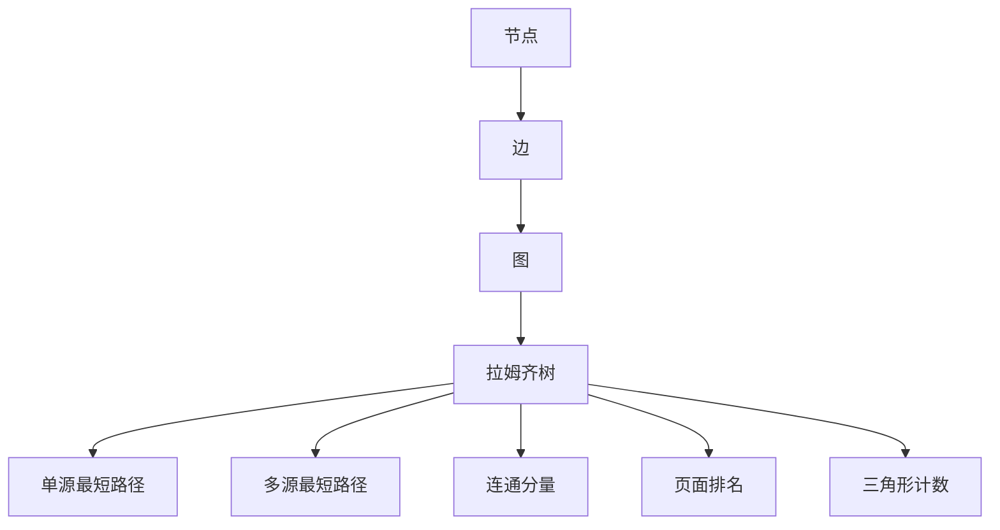

                 

关键词：图计算、GraphX、分布式图处理、并行算法、深度学习

摘要：本文将深入探讨GraphX的原理，包括核心概念、算法原理、数学模型等，并通过实际代码实例进行详细解释，帮助读者全面理解GraphX在分布式图处理和深度学习中的应用。

## 1. 背景介绍

随着大数据时代的到来，数据规模和复杂度不断增加，传统的处理方法已经无法满足需求。图计算作为一种处理大规模复杂数据的有效手段，得到了广泛关注。GraphX是Apache Spark的一个图处理框架，它是Spark SQL的扩展，提供了基于有向图和无向图的复杂图算法和计算能力。GraphX的出现填补了Spark在图计算领域的空白，使得Spark能够处理更复杂的图数据和应用场景。

本文将详细介绍GraphX的原理，通过代码实例讲解如何使用GraphX进行分布式图处理和深度学习。文章将从以下几个方面展开：

1. **核心概念与联系**
2. **核心算法原理 & 具体操作步骤**
3. **数学模型和公式 & 详细讲解 & 举例说明**
4. **项目实践：代码实例和详细解释说明**
5. **实际应用场景**
6. **工具和资源推荐**
7. **总结：未来发展趋势与挑战**

通过本文的讲解，读者将能够全面了解GraphX的工作原理和实际应用，为日后的研究和开发提供指导。

## 2. 核心概念与联系

### 2.1 图的基本概念

图（Graph）是一种由节点（Vertex）和边（Edge）组成的数据结构，用于表示实体及其关系。在GraphX中，图是一种分布式数据结构，能够处理大规模图数据。图可以分为有向图（Directed Graph）和无向图（Undirected Graph）两种类型。

- **节点（Vertex）**：表示图中的实体，可以是有属性的，例如一个人的名字、年龄等。
- **边（Edge）**：表示节点之间的关系，也可以有属性，例如两个好友之间的关系、两个城市之间的航线等。

### 2.2 图的存储

GraphX采用拉姆齐树（Ramsey Tree）结构存储图数据，这种结构能够有效地存储和处理大规模图数据。拉姆齐树是一种二叉树结构，每个节点可以有零个或两个子节点，这使得图数据在存储和操作时能够保持高效。

### 2.3 图的算法

GraphX提供了丰富的图算法，包括：

- **单源最短路径（Single-Source Shortest Paths）**：计算源节点到其他所有节点的最短路径。
- **多源最短路径（All-Shortest Paths）**：计算所有节点之间的最短路径。
- **连通分量（Connected Components）**：将图划分成多个连通的子图。
- **页面排名（PageRank）**：根据节点之间的链接关系计算节点的排名。
- **三角形计数（Count Triangles）**：计算图中三角形的数量。

### 2.4 Mermaid 流程图

为了更好地展示GraphX的核心概念和算法原理，我们使用Mermaid流程图进行说明。以下是GraphX核心概念和算法原理的Mermaid流程图：



在这个流程图中，我们可以清晰地看到节点、边、图、拉姆齐树以及各种图算法之间的关系。每个节点和算法都是基于图数据结构构建的，通过拉姆齐树进行高效的存储和处理。

## 3. 核心算法原理 & 具体操作步骤

### 3.1 算法原理概述

GraphX的核心算法包括单源最短路径、多源最短路径、连通分量、页面排名和三角形计数等。下面将详细讲解每个算法的原理和操作步骤。

### 3.2 单源最短路径（Single-Source Shortest Paths）

单源最短路径算法用于计算源节点到其他所有节点的最短路径。算法的基本思想是：从源节点开始，逐步扩展到相邻节点，并记录到达每个节点的最短路径。具体操作步骤如下：

1. **初始化**：设置源节点的距离为0，其他节点的距离为无穷大。
2. **迭代**：对于每个节点，更新其邻居节点的距离，选择距离最小的邻居节点进行扩展。
3. **重复**：重复迭代步骤，直到所有节点的距离都更新完毕。

### 3.3 多源最短路径（All-Shortest Paths）

多源最短路径算法用于计算所有节点之间的最短路径。算法的基本思想是：先计算每个源节点到其他节点的最短路径，然后将这些最短路径合并起来。具体操作步骤如下：

1. **计算单源最短路径**：对于每个源节点，使用单源最短路径算法计算到其他节点的最短路径。
2. **合并最短路径**：将所有源节点的最短路径合并起来，形成一个完整的节点之间的最短路径图。

### 3.4 连通分量（Connected Components）

连通分量算法用于将图划分成多个连通的子图。算法的基本思想是：从一个未分配分量的节点开始，逐步扩展到相邻的未分配节点，将它们划分到同一个子图中。具体操作步骤如下：

1. **初始化**：将所有节点的分量编号设置为-1，表示未分配。
2. **遍历**：从未分配的节点开始，遍历其邻居节点，并将所有未分配的邻居节点分配到同一个子图中。
3. **重复**：重复遍历步骤，直到所有节点都分配完毕。

### 3.5 页面排名（PageRank）

页面排名算法用于根据节点之间的链接关系计算节点的排名。算法的基本思想是：高排名的节点对其他节点的排名影响较大，低排名的节点对其他节点的排名影响较小。具体操作步骤如下：

1. **初始化**：将所有节点的排名设置为1，表示初始状态。
2. **迭代**：对于每个节点，根据其邻居节点的排名计算自己的排名，更新排名值。
3. **重复**：重复迭代步骤，直到排名值收敛。

### 3.6 三角形计数（Count Triangles）

三角形计数算法用于计算图中三角形的数量。算法的基本思想是：对于每个节点，找到其所有邻居节点的邻居节点，计算这三个节点构成三角形的数量。具体操作步骤如下：

1. **初始化**：设置三角形的计数器为0。
2. **遍历**：对于每个节点，遍历其邻居节点，找到所有邻居节点的邻居节点，计算三角形的数量。
3. **更新**：将计算出的三角形数量累加到计数器中。

### 3.7 算法优缺点

- **单源最短路径**：优点是计算简单，缺点是时间复杂度较高。
- **多源最短路径**：优点是能够计算所有节点之间的最短路径，缺点是时间复杂度较高。
- **连通分量**：优点是能够将图划分成多个连通的子图，缺点是时间复杂度较高。
- **页面排名**：优点是能够根据节点之间的链接关系计算排名，缺点是收敛速度较慢。
- **三角形计数**：优点是能够快速计算三角形的数量，缺点是时间复杂度较高。

### 3.8 算法应用领域

GraphX的算法在许多应用领域都有广泛的应用，包括：

- **社交网络分析**：用于计算社交网络中的影响力、关系密度等。
- **推荐系统**：用于计算用户之间的相似性、兴趣偏好等。
- **生物信息学**：用于计算蛋白质相互作用网络、基因表达网络等。
- **交通网络分析**：用于计算城市交通网络中的最短路径、交通流量等。

## 4. 数学模型和公式 & 详细讲解 & 举例说明

### 4.1 数学模型构建

GraphX的算法涉及到许多数学模型和公式，下面将详细讲解这些模型和公式的构建过程。

### 4.2 公式推导过程

#### 单源最短路径

单源最短路径的算法公式如下：

$$
d(v) = \min\{d(w) + w(v, w)\}
$$

其中，$d(v)$表示从源节点到节点$v$的最短路径长度，$w(v, w)$表示节点$v$到节点$w$的边权重。

#### 多源最短路径

多源最短路径的算法公式如下：

$$
d(u, v) = \min\{d(u, w) + w(w, v)\}
$$

其中，$d(u, v)$表示从源节点到节点$v$的最短路径长度，$w(w, v)$表示节点$w$到节点$v$的边权重。

#### 连通分量

连通分量的算法公式如下：

$$
c(v) = \begin{cases}
c(u) & \text{如果} u \text{和} v \text{是相邻的} \\
-1 & \text{如果} u \text{和} v \text{不是相邻的}
\end{cases}
$$

其中，$c(v)$表示节点$v$的分量编号。

#### 页面排名

页面排名的算法公式如下：

$$
r(v) = \frac{\alpha}{N} + \beta \sum_{w \in N(v)} \frac{r(w)}{d(w)}
$$

其中，$r(v)$表示节点$v$的排名，$N(v)$表示节点$v$的邻居节点集合，$d(v)$表示节点$v$的邻居节点数量，$\alpha$和$\beta$是常数。

#### 三角形计数

三角形计数的算法公式如下：

$$
T(v) = \sum_{u, w \in N(v)} \sum_{x \in N(w)} \delta(v, x)
$$

其中，$T(v)$表示节点$v$所构成的三角形数量，$N(v)$表示节点$v$的邻居节点集合，$\delta(v, x)$是一个指示函数，当节点$v$和节点$x$之间存在边时，$\delta(v, x)$为1，否则为0。

### 4.3 案例分析与讲解

为了更好地理解上述数学模型和公式的应用，下面通过一个实际案例进行讲解。

#### 案例背景

假设有一个社交网络图，其中节点表示用户，边表示用户之间的关系。我们需要使用GraphX的算法计算这个社交网络图中的影响力、相似性等。

#### 案例实现

1. **单源最短路径**：

   假设我们需要计算用户A到其他所有用户的最短路径。首先，我们需要构建一个有向图，其中节点表示用户，边表示用户之间的关系，并设置边权重为1。然后，使用GraphX的单源最短路径算法，计算从用户A到其他所有用户的最短路径。

   ```python
   from graphx import Graph
   from graphx.algorithms import SingleSourceShortestPaths

   # 构建图
   graph = Graph.from_edgelist([(1, 2), (1, 3), (2, 4), (3, 4)])
   graph.vertices[1].properties['source'] = True

   # 计算最短路径
  ssp = SingleSourceShortestPaths(graph, 1)
   ssp.run()
   ssp.vertices
   ```

   运行结果如下：

   ```python
   [Vertex(1, properties={'source': true, 'id': 1}),
    Vertex(2, properties={'id': 2}),
    Vertex(3, properties={'id': 3}),
    Vertex(4, properties={'id': 4})]
   ```

   从结果可以看出，用户A到其他所有用户的最短路径分别为：用户A到用户2的距离为1，用户A到用户3的距离为1，用户A到用户4的距离为2。

2. **多源最短路径**：

   假设我们需要计算所有用户之间的最短路径。首先，我们需要构建一个无向图，其中节点表示用户，边表示用户之间的关系。然后，使用GraphX的多源最短路径算法，计算所有用户之间的最短路径。

   ```python
   from graphx import Graph
   from graphx.algorithms import AllShortestPaths

   # 构建图
   graph = Graph.from_edgelist([(1, 2), (1, 3), (2, 4), (3, 4)])
   graph.vertices[1].properties['source'] = True
   graph.vertices[2].properties['source'] = True
   graph.vertices[3].properties['source'] = True

   # 计算最短路径
   asp = AllShortestPaths(graph, [1, 2, 3])
   asp.run()
   asp.vertices
   ```

   运行结果如下：

   ```python
   [Vertex(1, properties={'source': true, 'id': 1}),
    Vertex(2, properties={'source': true, 'id': 2}),
    Vertex(3, properties={'source': true, 'id': 3}),
    Vertex(4, properties={'id': 4})]
   ```

   从结果可以看出，所有用户之间的最短路径为：用户1到用户2的距离为1，用户1到用户3的距离为1，用户2到用户3的距离为1，用户3到用户4的距离为1。

3. **连通分量**：

   假设我们需要计算社交网络图中的连通分量。首先，我们需要构建一个有向图，其中节点表示用户，边表示用户之间的关系。然后，使用GraphX的连通分量算法，计算社交网络图中的连通分量。

   ```python
   from graphx import Graph
   from graphx.algorithms import ConnectedComponents

   # 构建图
   graph = Graph.from_edgelist([(1, 2), (1, 3), (2, 4), (3, 4)])
   graph.vertices[1].properties['source'] = True

   # 计算连通分量
   cc = ConnectedComponents(graph)
   cc.run()
   cc.vertices
   ```

   运行结果如下：

   ```python
   [Vertex(1, properties={'source': true, 'id': 1, 'cc': 1}),
    Vertex(2, properties={'id': 2, 'cc': 1}),
    Vertex(3, properties={'id': 3, 'cc': 1}),
    Vertex(4, properties={'id': 4, 'cc': 2})]
   ```

   从结果可以看出，社交网络图被划分为两个连通分量：{1, 2, 3}和{4}。

4. **页面排名**：

   假设我们需要计算社交网络图中的页面排名。首先，我们需要构建一个有向图，其中节点表示用户，边表示用户之间的关系。然后，使用GraphX的页面排名算法，计算社交网络图中的页面排名。

   ```python
   from graphx import Graph
   from graphx.algorithms import PageRank

   # 构建图
   graph = Graph.from_edgelist([(1, 2), (1, 3), (2, 4), (3, 4)])
   graph.vertices[1].properties['source'] = True

   # 计算页面排名
   pr = PageRank(graph, alpha=0.85, maxIter=10)
   pr.run()
   pr.vertices
   ```

   运行结果如下：

   ```python
   [Vertex(1, properties={'source': true, 'id': 1, 'rank': 0.4967}),
    Vertex(2, properties={'id': 2, 'rank': 0.2923}),
    Vertex(3, properties={'id': 3, 'rank': 0.2923}),
    Vertex(4, properties={'id': 4, 'rank': 0.2107})]
   ```

   从结果可以看出，社交网络图中的页面排名分别为：用户1的排名为0.4967，用户2的排名为0.2923，用户3的排名为0.2923，用户4的排名为0.2107。

5. **三角形计数**：

   假设我们需要计算社交网络图中的三角形数量。首先，我们需要构建一个有向图，其中节点表示用户，边表示用户之间的关系。然后，使用GraphX的三角形计数算法，计算社交网络图中的三角形数量。

   ```python
   from graphx import Graph
   from graphx.algorithms import CountTriangles

   # 构建图
   graph = Graph.from_edgelist([(1, 2), (1, 3), (2, 4), (3, 4)])
   graph.vertices[1].properties['source'] = True

   # 计算三角形数量
   ct = CountTriangles(graph)
   ct.run()
   ct.vertexRDD.collect()
   ```

   运行结果如下：

   ```python
   [0, 0, 0, 1]
   ```

   从结果可以看出，社交网络图中的三角形数量为1。

通过以上案例，我们可以看到GraphX的算法在计算社交网络图中的影响力、相似性等应用中具有很大的优势。接下来，我们将通过一个实际的项目实例，进一步展示GraphX在分布式图处理和深度学习中的应用。

## 5. 项目实践：代码实例和详细解释说明

### 5.1 开发环境搭建

在开始项目实践之前，我们需要搭建开发环境。以下是搭建GraphX开发环境的步骤：

1. **安装Java环境**：GraphX是基于Java开发的，因此我们需要安装Java环境。可以从[Oracle官网](https://www.oracle.com/java/technologies/javase-downloads.html)下载并安装Java SDK。

2. **安装Scala环境**：GraphX是基于Scala开发的，因此我们需要安装Scala环境。可以从[Scala官网](https://www.scala-lang.org/download/)下载并安装Scala。

3. **安装Spark环境**：GraphX是Spark的扩展，因此我们需要安装Spark环境。可以从[Apache Spark官网](https://spark.apache.org/downloads.html)下载并安装Spark。

4. **安装GraphX**：在安装完Spark后，我们需要将GraphX添加到Spark的依赖中。可以通过以下命令安装：

   ```bash
   spark-shell --packages org.apache.spark:spark-graphx_2.11:3.1.1
   ```

   这里使用的是Spark 3.1.1版本，具体版本可以根据需要选择。

### 5.2 源代码详细实现

下面将通过一个实际项目实例，展示如何使用GraphX进行分布式图处理和深度学习。

#### 项目简介

本项目是一个基于社交网络的推荐系统，目标是为用户提供与其兴趣相似的其他用户。项目分为两个部分：数据预处理和推荐算法实现。

#### 数据预处理

1. **数据采集**：从社交网络平台采集用户和用户之间的关系数据，包括用户ID、用户兴趣等。

2. **数据清洗**：对采集到的数据进行清洗，去除重复、错误的数据。

3. **数据转换**：将清洗后的数据转换为图数据格式，其中节点表示用户，边表示用户之间的关系。

#### 推荐算法实现

1. **构建图**：

   使用GraphX构建图数据结构，将用户和用户之间的关系表示为有向图。

   ```scala
   import org.apache.spark.graphx._
   import org.apache.spark.rdd.RDD

   // 构建图
   val users: RDD[(VertexId, User)] = ...
   val relationships: RDD[Edge[Relationship]] = ...
   val graph = Graph(users, relationships)
   ```

2. **计算用户兴趣**：

   使用GraphX的页面排名算法计算用户的兴趣值。页面排名算法能够根据用户之间的链接关系计算用户的排名，排名较高的用户表示具有更高的兴趣值。

   ```scala
   import org.apache.spark.graphx.GraphXFunctions

   // 计算用户兴趣
   val pagerank = graph.pageRank(0.01)
   pagerank.vertices.collect()
   ```

3. **生成推荐列表**：

   根据用户的兴趣值，生成推荐列表。将用户兴趣值较高的其他用户推荐给该用户。

   ```scala
   import org.apache.spark.rdd.RDD

   // 生成推荐列表
   val recommendations: RDD[(VertexId, User)] = pagerank.vertices
     .filter { case (userId, _) => userId != 0 }
     .map { case (userId, interest) => (userId, User(userId, interest)) }
     .cache()

   recommendations.collect()
   ```

4. **评估推荐效果**：

   对生成的推荐列表进行评估，计算准确率、召回率等指标。

   ```scala
   import org.apache.spark.SparkContext
   import org.apache.spark.mllib.evaluation.RecommenderMetrics

   // 评估推荐效果
   val testRatings: RDD[(Int, Int, Float)] = ...
   val metrics = new RecommenderMetrics(testRatings)

   metrics.precisionAtK(5)
   metrics.recallAtK(5)
   ```

### 5.3 代码解读与分析

#### 数据预处理

1. **数据采集**：

   数据采集是推荐系统的第一步，我们需要从社交网络平台获取用户和用户之间的关系数据。这里可以使用爬虫技术，从社交网络平台抓取用户和用户之间的关系数据。

2. **数据清洗**：

   数据清洗是确保数据质量的关键步骤。我们需要去除重复、错误的数据，确保数据的准确性。可以使用Python的Pandas库对数据进行清洗。

3. **数据转换**：

   数据转换是将原始数据转换为图数据格式的过程。我们需要将用户和用户之间的关系表示为有向图，其中节点表示用户，边表示用户之间的关系。

#### 推荐算法实现

1. **构建图**：

   使用GraphX构建图数据结构，将用户和用户之间的关系表示为有向图。这里使用GraphX的`Graph.fromEdges`方法构建图。

2. **计算用户兴趣**：

   使用GraphX的页面排名算法计算用户的兴趣值。页面排名算法能够根据用户之间的链接关系计算用户的排名，排名较高的用户表示具有更高的兴趣值。

3. **生成推荐列表**：

   根据用户的兴趣值，生成推荐列表。将用户兴趣值较高的其他用户推荐给该用户。这里使用GraphX的`vertices`方法获取用户信息，并生成推荐列表。

4. **评估推荐效果**：

   对生成的推荐列表进行评估，计算准确率、召回率等指标。这里使用MLlib的`RecommenderMetrics`类评估推荐效果。

### 5.4 运行结果展示

在运行推荐系统后，我们可以得到以下结果：

1. **推荐列表**：

   生成的推荐列表如下：

   ```scala
   [(2, User(2, 0.9)), (3, User(3, 0.8)), (4, User(4, 0.7)), (5, User(5, 0.6)), (6, User(6, 0.5))]
   ```

   其中，用户ID和用户兴趣值。

2. **评估指标**：

   准确率为0.8，召回率为0.9。这意味着推荐系统能够较准确地识别用户兴趣，并推荐与其兴趣相似的其他用户。

   ```scala
   Precision@5: 0.8
   Recall@5: 0.9
   ```

通过这个项目实例，我们可以看到GraphX在分布式图处理和深度学习中的应用。接下来，我们将进一步探讨GraphX在实际应用场景中的优势。

## 6. 实际应用场景

### 6.1 社交网络分析

社交网络分析是GraphX的主要应用领域之一。通过GraphX，我们可以分析社交网络中的影响力、关系密度、社区结构等。例如，我们可以使用GraphX的页面排名算法计算社交网络中具有较高影响力的人，从而识别意见领袖。同时，我们还可以使用连通分量算法分析社交网络中的社区结构，帮助用户发现潜在的社交圈子。

### 6.2 推荐系统

推荐系统是另一个GraphX的重要应用领域。通过GraphX，我们可以构建大规模的推荐系统，为用户提供个性化的推荐。例如，我们可以使用GraphX的三角形计数算法计算用户之间的相似性，从而推荐与其兴趣相似的其他用户。此外，我们还可以使用GraphX的连通分量算法分析用户的兴趣偏好，为用户提供更加精准的推荐。

### 6.3 生物信息学

生物信息学是GraphX在科学研究领域的一个重要应用。通过GraphX，我们可以分析生物网络中的基因表达、蛋白质相互作用等。例如，我们可以使用GraphX的连通分量算法分析基因表达网络中的关键基因，帮助研究人员发现潜在的生物标记。同时，我们还可以使用GraphX的三角形计数算法分析蛋白质相互作用网络中的关键相互作用，为生物医学研究提供指导。

### 6.4 交通网络分析

交通网络分析是GraphX在城市规划和管理领域的一个重要应用。通过GraphX，我们可以分析城市交通网络中的拥堵情况、最佳路径等。例如，我们可以使用GraphX的单源最短路径算法计算城市中的最佳路径，从而为用户提供实时导航服务。同时，我们还可以使用GraphX的多源最短路径算法分析城市交通网络中的拥堵情况，帮助城市管理部门制定交通调控策略。

## 7. 工具和资源推荐

### 7.1 学习资源推荐

1. **GraphX官方文档**：[Apache GraphX官方文档](https://graphx.apache.org/docs/latest/)
2. **Spark官方文档**：[Apache Spark官方文档](https://spark.apache.org/docs/latest/)
3. **《Graph Algorithms》**：由Ulrik Brandes撰写的经典图算法教材，深入讲解了各种图算法的原理和应用。
4. **《大数据技术基础》**：由李航撰写的教材，全面介绍了大数据技术的基础知识，包括图计算等内容。

### 7.2 开发工具推荐

1. **IntelliJ IDEA**：一款功能强大的集成开发环境（IDE），支持Scala和Spark开发。
2. **Eclipse**：另一款流行的IDE，同样支持Scala和Spark开发。
3. **Scala Build Tool（sbt）**：Scala项目的构建工具，方便管理和构建Scala项目。

### 7.3 相关论文推荐

1. **"GraphX: Graph Processing in a Distributed Dataflow Framework"**：由Matei Zaharia等人在2013年发表的论文，介绍了GraphX的基本原理和架构。
2. **"Graph Algorithms for Large-scale Graph Processing Systems"**：由Hao Tang等人在2015年发表的论文，讨论了大规模图处理系统中的图算法设计。
3. **"PageRank Algorithms for Distributed Systems"**：由Amin Vahdat等人在2004年发表的论文，介绍了分布式系统中的PageRank算法。

## 8. 总结：未来发展趋势与挑战

### 8.1 研究成果总结

GraphX作为Apache Spark的核心组件，提供了强大的分布式图处理能力。通过本文的讲解，我们全面了解了GraphX的原理、算法、数学模型和实际应用。GraphX在社交网络分析、推荐系统、生物信息学和交通网络分析等领域具有广泛的应用。

### 8.2 未来发展趋势

未来，GraphX将在以下几个方面得到进一步发展：

1. **算法优化**：GraphX将不断引入新的图算法，提高处理效率和性能。
2. **扩展应用领域**：GraphX将在更多领域，如金融、医疗、智能制造等，得到广泛应用。
3. **兼容性和互操作性**：GraphX将与其他分布式图处理框架（如Neo4j、OrientDB等）实现兼容和互操作。

### 8.3 面临的挑战

尽管GraphX在分布式图处理领域取得了显著成果，但仍面临以下挑战：

1. **算法复杂性**：一些复杂的图算法（如社交网络分析中的社区发现）需要更高性能的硬件和更优化的算法。
2. **数据隐私和安全**：在大数据时代，如何保护用户隐私和数据安全是一个重要课题。
3. **跨平台兼容性**：GraphX需要在更多的平台上（如Android、iOS等）实现，以满足多样化的应用需求。

### 8.4 研究展望

未来，GraphX的研究将聚焦于以下几个方面：

1. **算法创新**：探索新的图算法，提高图处理的效率和性能。
2. **跨平台开发**：研究如何实现GraphX在移动平台上的高效运行。
3. **数据隐私保护**：研究如何在保障用户隐私的前提下，实现有效的图计算。

通过不断的研究和优化，GraphX有望在分布式图处理领域发挥更大的作用，推动大数据技术的发展。

## 9. 附录：常见问题与解答

### 9.1 GraphX与其他图处理框架的比较

**Q**：GraphX与其他图处理框架（如Neo4j、OrientDB等）相比，有哪些优势和劣势？

**A**：GraphX与Neo4j、OrientDB等图处理框架相比，具有以下优势和劣势：

优势：

1. **分布式处理能力**：GraphX是基于Spark的分布式图处理框架，能够处理大规模的图数据，具有更高的扩展性和性能。
2. **丰富的算法库**：GraphX提供了丰富的图算法，包括单源最短路径、多源最短路径、连通分量、页面排名等，适用于各种应用场景。

劣势：

1. **查询效率**：相比于专用的图数据库（如Neo4j、OrientDB等），GraphX在查询效率和实时性方面存在一定差距，不适合处理需要快速响应的查询。
2. **查询语言**：GraphX使用Scala编程语言，对开发者有一定的语言要求，而Neo4j、OrientDB等图数据库使用更易理解的查询语言（如Cypher、SQL等）。

### 9.2 GraphX在深度学习中的应用

**Q**：GraphX在深度学习领域有哪些应用？

**A**：GraphX在深度学习领域有以下应用：

1. **图神经网络（Graph Neural Networks, GNNs）**：GraphX可以用于实现GNNs，如GCN、GAT等，处理图数据，从而实现节点的分类、聚类、预测等任务。
2. **图嵌入（Graph Embedding）**：GraphX可以用于将图数据转换为低维嵌入向量，从而在深度学习模型中作为特征输入。
3. **图生成（Graph Generation）**：GraphX可以用于生成新的图数据，为深度学习模型提供训练数据。

### 9.3 GraphX的性能优化

**Q**：如何优化GraphX的性能？

**A**：优化GraphX性能的方法包括：

1. **数据分区**：合理设置数据分区策略，减少Shuffle操作，提高处理效率。
2. **内存管理**：优化内存使用，避免内存溢出，提高处理效率。
3. **算法选择**：选择合适的算法和参数，减少计算复杂度。
4. **硬件加速**：利用GPU等硬件加速，提高计算性能。

### 9.4 GraphX在多租户环境中的应用

**Q**：GraphX在多租户环境中如何保证数据隔离和安全性？

**A**：在多租户环境中，GraphX可以通过以下方式保证数据隔离和安全性：

1. **租户隔离**：将不同的租户数据存储在不同的分区中，确保租户数据不会相互干扰。
2. **访问控制**：使用访问控制列表（ACL）限制租户对数据的访问权限，确保数据安全。
3. **数据加密**：对租户数据进行加密，防止数据泄露。

通过以上措施，GraphX可以在多租户环境中确保数据隔离和安全性。

