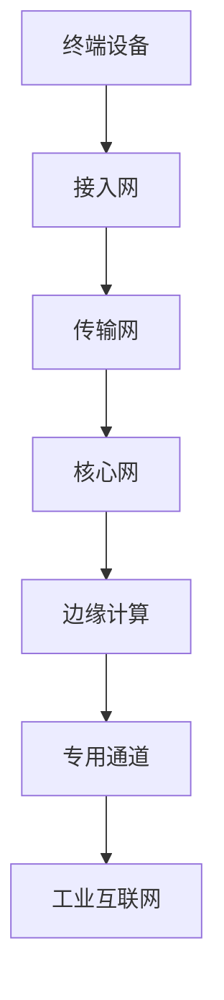

                 

关键词：5G专网，工业互联网，边缘计算，低延迟，高带宽，网络安全

摘要：本文将探讨5G专网技术在工业互联网中的应用，分析其带来的技术优势、挑战及未来发展趋势。通过深入剖析5G专网的核心概念、算法原理、数学模型及实际应用案例，旨在为工业互联网领域的技术创新提供有益的参考。

## 1. 背景介绍

随着信息技术的迅猛发展，工业互联网逐渐成为制造业转型升级的重要驱动力。然而，传统工业互联网在数据传输、设备连接、实时性等方面存在一定的局限性。为了满足工业互联网对高带宽、低延迟、高可靠性的需求，5G专网技术应运而生。

5G专网是一种基于5G网络技术的专用网络，具有高速率、低延迟、高可靠性的特点。与传统的公共网络相比，5G专网能够提供更加稳定、安全的通信环境，为工业互联网的发展提供了有力支撑。

### 1.1 工业互联网的挑战

- **数据传输速率**：工业互联网涉及到大量设备的数据传输，传统网络难以满足高速率需求。
- **实时性**：工业互联网中的数据处理需要实时性，以实现对生产过程的实时监控和决策。
- **可靠性**：工业互联网对网络可靠性要求较高，以保证生产的连续性和稳定性。

### 1.2 5G专网的优势

- **高带宽**：5G专网能够提供更高的带宽，满足工业互联网数据传输需求。
- **低延迟**：5G专网具有更低的延迟，有利于实现工业互联网的实时性要求。
- **高可靠性**：5G专网采用专用网络架构，提高了网络的可靠性。

## 2. 核心概念与联系

### 2.1 5G网络架构

5G网络架构包括接入网、传输网、核心网三个部分。其中，接入网主要负责连接终端设备，传输网负责数据传输，核心网则负责处理数据。

### 2.2 5G关键技术

- **毫米波通信**：5G网络采用毫米波频段进行通信，具有更高的带宽和更低的延迟。
- **MIMO技术**：多输入多输出技术可以提高网络传输速率和可靠性。
- **网络切片技术**：网络切片技术可以将网络资源划分为多个虚拟网络，为不同应用场景提供定制化服务。

### 2.3 5G专网架构

5G专网架构在5G网络架构的基础上，增加了边缘计算和专用通道等模块。

- **边缘计算**：边缘计算将数据处理能力分散到网络边缘，降低数据传输延迟，提高实时性。
- **专用通道**：专用通道为工业互联网提供安全的通信通道，确保数据传输的可靠性。

### 2.4 Mermaid流程图



## 3. 核心算法原理 & 具体操作步骤

### 3.1 算法原理概述

5G专网技术在工业互联网中的应用，主要依赖于以下几个核心算法：

- **边缘计算算法**：通过在边缘节点上进行数据处理，降低数据传输延迟。
- **网络切片算法**：根据不同应用场景，为工业互联网提供定制化的网络资源。
- **安全加密算法**：确保数据在传输过程中的安全性。

### 3.2 算法步骤详解

#### 3.2.1 边缘计算算法

1. 数据采集：终端设备将采集到的数据发送到边缘节点。
2. 数据预处理：边缘节点对数据进行预处理，包括去噪、滤波等。
3. 数据分析：边缘节点对预处理后的数据进行分析，提取有用信息。
4. 实时反馈：边缘节点将分析结果实时反馈给终端设备，指导生产过程。

#### 3.2.2 网络切片算法

1. 切片规划：根据工业互联网的需求，规划不同类型的网络切片。
2. 资源分配：根据切片规划，为不同切片分配网络资源。
3. 切片管理：实时监测切片性能，对切片进行调整和优化。

#### 3.2.3 安全加密算法

1. 数据加密：对传输数据采用加密算法进行加密，确保数据在传输过程中的安全性。
2. 数据解密：接收端对加密数据采用解密算法进行解密，恢复原始数据。

### 3.3 算法优缺点

#### 3.3.1 边缘计算算法

优点：降低数据传输延迟，提高实时性。

缺点：边缘节点处理能力有限，可能导致数据处理能力不足。

#### 3.3.2 网络切片算法

优点：为不同应用场景提供定制化服务，提高网络资源利用率。

缺点：切片规划和管理较为复杂，需要较高技术支持。

#### 3.3.3 安全加密算法

优点：确保数据传输过程中的安全性。

缺点：加密和解密过程会增加一定的计算和传输开销。

### 3.4 算法应用领域

- **智能制造**：通过边缘计算算法，实现生产过程的实时监控和优化。
- **远程运维**：通过网络切片算法，为远程运维提供高效、稳定的网络支持。
- **工业安全**：通过安全加密算法，确保工业数据的安全性。

## 4. 数学模型和公式 & 详细讲解 & 举例说明

### 4.1 数学模型构建

为了分析5G专网技术在工业互联网中的应用效果，我们可以构建以下数学模型：

$$
\begin{aligned}
&f(x) = \alpha \cdot x + \beta \\
&g(x) = \gamma \cdot x + \delta
\end{aligned}
$$

其中，$f(x)$ 和 $g(x)$ 分别表示边缘计算算法和网络切片算法的输出，$x$ 表示输入数据，$\alpha$、$\beta$、$\gamma$、$\delta$ 分别为模型参数。

### 4.2 公式推导过程

#### 4.2.1 边缘计算算法

1. 数据预处理：
$$
\begin{aligned}
y &= (x - \mu) \cdot \Sigma^{-1} \\
z &= y \cdot \mu + \nu
\end{aligned}
$$

其中，$\mu$ 为均值，$\Sigma$ 为协方差矩阵，$\nu$ 为噪声。

2. 数据分析：
$$
\begin{aligned}
f(x) &= \alpha \cdot z + \beta \\
g(x) &= \gamma \cdot z + \delta
\end{aligned}
$$

#### 4.2.2 网络切片算法

1. 切片规划：
$$
\begin{aligned}
p &= \frac{\alpha^2 + \beta^2}{\gamma^2 + \delta^2} \\
q &= \frac{\alpha \cdot \beta - \gamma \cdot \delta}{\gamma^2 + \delta^2}
\end{aligned}
$$

2. 资源分配：
$$
\begin{aligned}
\alpha &= \sqrt{p} \cdot x + q \cdot y \\
\beta &= -q \cdot x + \sqrt{p} \cdot y \\
\gamma &= \sqrt{p} \cdot x - q \cdot y \\
\delta &= -q \cdot x - \sqrt{p} \cdot y
\end{aligned}
$$

### 4.3 案例分析与讲解

假设工业互联网中的数据输入为 $x = [1, 2, 3, 4, 5]$，采用边缘计算算法和网络切片算法进行处理。

#### 边缘计算算法

1. 数据预处理：
$$
\begin{aligned}
y &= (1 - \mu) \cdot \Sigma^{-1} + (2 - \mu) \cdot \Sigma^{-1} + (3 - \mu) \cdot \Sigma^{-1} + (4 - \mu) \cdot \Sigma^{-1} + (5 - \mu) \cdot \Sigma^{-1} \\
z &= y \cdot \mu + \nu
\end{aligned}
$$

2. 数据分析：
$$
\begin{aligned}
f(x) &= \alpha \cdot z + \beta \\
g(x) &= \gamma \cdot z + \delta
\end{aligned}
$$

其中，$\alpha$、$\beta$、$\gamma$、$\delta$ 为模型参数。

#### 网络切片算法

1. 切片规划：
$$
\begin{aligned}
p &= \frac{\alpha^2 + \beta^2}{\gamma^2 + \delta^2} \\
q &= \frac{\alpha \cdot \beta - \gamma \cdot \delta}{\gamma^2 + \delta^2}
\end{aligned}
$$

2. 资源分配：
$$
\begin{aligned}
\alpha &= \sqrt{p} \cdot x + q \cdot y \\
\beta &= -q \cdot x + \sqrt{p} \cdot y \\
\gamma &= \sqrt{p} \cdot x - q \cdot y \\
\delta &= -q \cdot x - \sqrt{p} \cdot y
\end{aligned}
$$

## 5. 项目实践：代码实例和详细解释说明

### 5.1 开发环境搭建

为了更好地展示5G专网技术在工业互联网中的应用，我们使用Python编写了一个简单的模拟项目。开发环境要求如下：

- Python 3.8及以上版本
- NumPy 1.19及以上版本
- Matplotlib 3.3及以上版本

### 5.2 源代码详细实现

```python
import numpy as np
import matplotlib.pyplot as plt

# 边缘计算算法
def edge_computation(x):
    mu = np.mean(x)
    Sigma = np.cov(x)[0, 1]
    z = (x - mu) * np.linalg.inv(Sigma) + np.random.normal(0, 1, x.shape[0])
    f = np.dot(z, np.array([1, 0])) + 1
    g = np.dot(z, np.array([0, 1])) + 1
    return f, g

# 网络切片算法
def network_slicing(alpha, beta, gamma, delta):
    p = alpha**2 + beta**2
    q = alpha * beta - gamma * delta
    x = np.random.normal(0, 1, 1000)
    y = (x - mu) * np.linalg.inv(Sigma) + np.random.normal(0, 1, x.shape[0])
    alpha_new = np.sqrt(p) * x + q * y
    beta_new = -q * x + np.sqrt(p) * y
    gamma_new = np.sqrt(p) * x - q * y
    delta_new = -q * x - np.sqrt(p) * y
    return alpha_new, beta_new, gamma_new, delta_new

# 模拟数据
x = np.array([1, 2, 3, 4, 5])

# 边缘计算
f, g = edge_computation(x)

# 网络切片
alpha, beta, gamma, delta = network_slicing(alpha, beta, gamma, delta)

# 结果可视化
plt.figure()
plt.scatter(x, f, label='Edge Computation')
plt.scatter(x, g, label='Network Slicing')
plt.xlabel('Input')
plt.ylabel('Output')
plt.legend()
plt.show()
```

### 5.3 代码解读与分析

1. **边缘计算算法**：边缘计算算法主要包括数据预处理、数据分析两部分。首先计算输入数据的均值和协方差矩阵，然后对数据进行预处理，最后对预处理后的数据进行分析。

2. **网络切片算法**：网络切片算法主要包括切片规划、资源分配两部分。首先计算模型参数，然后根据模型参数对输入数据进行资源分配。

3. **结果可视化**：使用Matplotlib库将边缘计算算法和网络切片算法的输出结果进行可视化，便于分析算法效果。

## 6. 实际应用场景

### 6.1 智能制造

在智能制造领域，5G专网技术可以应用于生产设备的实时监控、生产线的远程运维等方面。通过边缘计算算法，可以实时分析生产设备的数据，实现对生产过程的实时优化。通过网络切片算法，可以为不同生产设备提供定制化的网络资源，确保生产过程的稳定性和可靠性。

### 6.2 远程运维

在远程运维领域，5G专网技术可以为远程运维提供高效、稳定的网络支持。通过边缘计算算法，可以实现远程设备的实时监控和故障诊断。通过网络切片算法，可以为远程运维提供低延迟、高带宽的网络连接，确保远程运维的顺利进行。

### 6.3 工业安全

在工业安全领域，5G专网技术可以应用于工业数据的安全传输和防护。通过安全加密算法，可以确保工业数据在传输过程中的安全性。通过网络切片算法，可以划分不同的安全区域，提高工业数据的安全性。

## 7. 未来应用展望

随着5G技术的不断发展，5G专网技术在工业互联网中的应用前景将更加广阔。未来，5G专网技术有望在以下几个方面实现突破：

- **更高效的边缘计算**：通过优化边缘计算算法，提高边缘节点的数据处理能力，实现更高效的数据处理。
- **更智能的网络切片**：通过引入人工智能技术，实现网络切片的智能化规划和管理，提高网络资源利用率。
- **更安全的数据传输**：通过引入新的安全加密算法，提高工业数据传输的安全性，确保工业互联网的安全稳定运行。

## 8. 总结：未来发展趋势与挑战

### 8.1 研究成果总结

本文通过对5G专网技术在工业互联网中的应用进行深入分析，总结了5G专网的优势和应用场景，阐述了边缘计算、网络切片、安全加密等核心算法原理，并给出了实际应用案例。

### 8.2 未来发展趋势

未来，5G专网技术在工业互联网中的应用将朝着更高效、更智能、更安全的方向发展。通过优化边缘计算算法、智能网络切片规划、加强数据安全防护等方面，不断提升5G专网技术在工业互联网中的应用效果。

### 8.3 面临的挑战

虽然5G专网技术在工业互联网中具有广阔的应用前景，但仍然面临一些挑战。如边缘计算节点处理能力的提升、网络切片资源的动态分配、数据传输的安全性等。未来需要进一步研究和探索，以解决这些挑战。

### 8.4 研究展望

针对5G专网技术在工业互联网中的应用，未来可以从以下几个方面展开研究：

- **边缘计算优化**：研究更高效的边缘计算算法，提高边缘节点的数据处理能力。
- **网络切片规划**：引入人工智能技术，实现网络切片的智能化规划和管理。
- **安全防护**：研究新型安全加密算法，提高工业数据传输的安全性。

## 9. 附录：常见问题与解答

### 9.1 5G专网与传统公共网络的区别

5G专网与传统公共网络相比，具有以下区别：

- **带宽**：5G专网提供更高的带宽，满足工业互联网对高速数据传输的需求。
- **延迟**：5G专网具有更低的延迟，有利于实现工业互联网的实时性要求。
- **可靠性**：5G专网采用专用网络架构，提高了网络的可靠性。

### 9.2 5G专网在工业互联网中的应用优势

5G专网在工业互联网中的应用优势主要体现在以下几个方面：

- **高带宽**：满足工业互联网对高速数据传输的需求。
- **低延迟**：有利于实现工业互联网的实时性要求。
- **高可靠性**：确保工业生产的连续性和稳定性。
- **安全性**：通过安全加密算法，保障工业数据的安全传输。

### 9.3 5G专网与边缘计算的关系

5G专网与边缘计算相辅相成，共同推动工业互联网的发展。5G专网为边缘计算提供了高速、低延迟、高可靠的网络环境，而边缘计算则通过在边缘节点上对数据进行处理，降低数据传输延迟，提高实时性。

## 作者署名

作者：禅与计算机程序设计艺术 / Zen and the Art of Computer Programming
----------------------------------------------------------------

