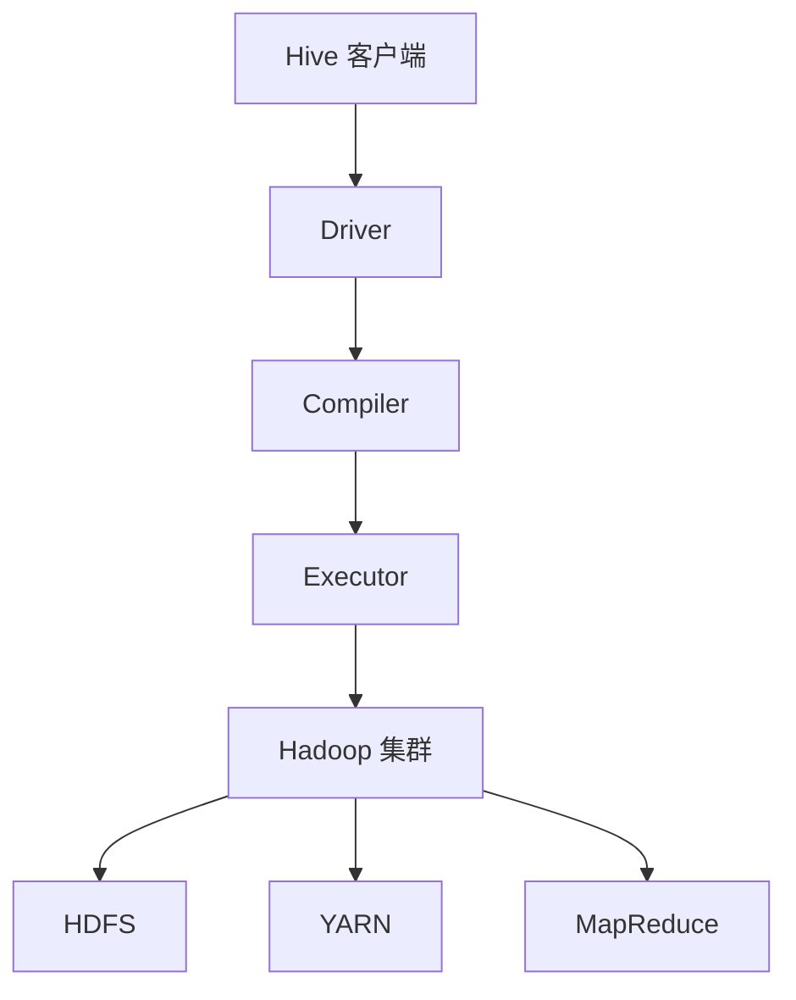

                 

 Hive 是一种基于 Hadoop 的分布式数据仓库工具，它可以将结构化数据文件映射为一张数据库表，提供类 SQL 查询功能，并可以扩展 SQL 功能以支持复杂分析。本文旨在深入讲解 Hive 的原理，并通过实例代码来展示如何使用 Hive 进行数据分析。

> 关键词：Hive，分布式数据仓库，Hadoop，SQL查询，数据分析

## 摘要

本文将首先介绍 Hive 的背景和基本原理，包括其与 Hadoop 的关系、核心组件和架构设计。接着，我们将详细讲解 Hive 的核心算法原理，包括 MapReduce 框架下的数据处理流程。随后，本文将通过实例代码，详细介绍如何使用 Hive 进行数据分析，包括数据导入、SQL 查询和数据导出等步骤。最后，我们将讨论 Hive 在实际应用中的场景，并展望其未来的发展趋势。

## 1. 背景介绍

### 1.1 Hive 的起源

Hive 的起源可以追溯到 2008 年，当时 Facebook 使用 Hadoop 进行海量数据存储和处理。为了方便数据分析师进行 SQL 查询和分析，Facebook 的工程师们开发了 Hive。Hive 设计初衷是为了提供一个类似于传统关系数据库的查询接口，使得数据分析师能够使用熟悉的 SQL 语法，对存储在 Hadoop 分布式文件系统（HDFS）中的大数据集进行高效查询和分析。

### 1.2 Hive 与 Hadoop 的关系

Hadoop 是一个开源的分布式计算平台，主要用于大规模数据处理。它包括两部分：Hadoop 分布式文件系统（HDFS）和 Hadoop YARN（资源调度框架）。Hive 是建立在 Hadoop 之上的一个数据仓库工具，通过将结构化数据存储在 HDFS 中，并使用 MapReduce 框架进行数据查询处理，实现了对大规模数据的处理和分析。

### 1.3 Hive 的核心组件

Hive 的核心组件主要包括：

- **HiveQL**：Hive 的查询语言，类似于 SQL，用于编写查询语句。
- **Metastore**：Hive 的元数据存储，用于存储表结构、数据类型、分区信息等元数据。
- **Driver**：Hive 的驱动程序，用于将 HiveQL 转换为对应的 MapReduce 任务，并提交到 Hadoop YARN 上执行。
- **Compiler**：Hive 的编译器，负责将 HiveQL 代码编译成抽象语法树（AST），并生成执行计划。
- **Executor**：Hive 的执行器，负责执行编译后的查询计划，并返回查询结果。

## 2. 核心概念与联系

### 2.1 Hive 的核心概念

在 Hive 中，有几个核心概念需要理解：

- **Table**：Hive 中的表，对应于一个数据文件或者文件集合。
- **Partition**：表中的分区，用于对数据进行更细粒度的划分，便于查询优化。
- **Bucket**：表的桶，用于将数据分散存储到多个文件中，便于并行处理。
- **SerDe**：序列化/反序列化，用于将表数据序列化成文件存储，或将文件反序列化成表数据。

### 2.2 Hive 的架构设计

Hive 的架构设计主要分为两层：上层是客户端，包括 Driver、Compiler 和 Executor，负责将 HiveQL 转换为 MapReduce 任务并执行；下层是 Hadoop 集群，包括 HDFS、YARN 和 MapReduce，负责存储数据和执行任务。

### 2.3 Mermaid 流程图

下面是一个简化的 Mermaid 流程图，展示 Hive 的架构设计：



## 3. 核心算法原理 & 具体操作步骤

### 3.1 算法原理概述

Hive 的核心算法是基于 Hadoop 的 MapReduce 框架。MapReduce 是一种分布式数据处理模型，包括两个阶段：Map 阶段和 Reduce 阶段。

- **Map 阶段**：对输入数据进行分组，对每组数据应用一个映射函数，生成键值对。
- **Reduce 阶段**：对 Map 阶段生成的键值对进行分组，对每组数据应用一个规约函数，生成最终的结果。

### 3.2 算法步骤详解

下面是 Hive 的基本查询流程：

1. **编译 HiveQL**：将 HiveQL 代码编译成抽象语法树（AST）和执行计划。
2. **生成 MapReduce 任务**：将执行计划转换为对应的 MapReduce 任务。
3. **提交任务到 Hadoop YARN**：将 MapReduce 任务提交到 Hadoop YARN 集群进行执行。
4. **执行 Map 阶段**：对输入数据进行分组，应用映射函数，生成中间键值对。
5. **执行 Reduce 阶段**：对中间键值对进行分组，应用规约函数，生成最终结果。
6. **返回查询结果**：将最终结果返回给客户端。

### 3.3 算法优缺点

**优点**：

- 高效：基于 Hadoop 的分布式计算框架，可以高效处理海量数据。
- 易用：提供类似于 SQL 的查询语言，便于数据分析师使用。
- 扩展性强：支持自定义 SerDe、UDF（用户定义函数）等，便于扩展。

**缺点**：

- 性能瓶颈：相比于传统的 RDBMS，Hive 在某些场景下可能存在性能瓶颈。
- 复杂性：配置和管理相对复杂，需要一定的技术背景。

### 3.4 算法应用领域

Hive 适用于大规模数据分析和数据挖掘，典型应用领域包括：

- 数据仓库：构建企业级数据仓库，进行数据分析和报表生成。
- 数据挖掘：进行聚类、分类、回归等数据挖掘任务。
- 实时分析：实时处理和分析流数据。

## 4. 数学模型和公式 & 详细讲解 & 举例说明

### 4.1 数学模型构建

Hive 的查询算法本质上是一个多表连接和聚合操作。在数学模型中，我们可以将其表示为一个多表关系：

$$
R_1 \times R_2 \times ... \times R_n \rightarrow \text{聚合操作}
$$

其中，$R_i$ 表示第 $i$ 个表的记录集合，聚合操作包括 SUM、COUNT、AVG 等。

### 4.2 公式推导过程

以两个表 $R_1$ 和 $R_2$ 的连接为例，其数学模型可以表示为：

$$
R_1 \times R_2 = \{ (r_1, r_2) \mid r_1 \in R_1, r_2 \in R_2, r_1.key = r_2.key \}
$$

其中，$r_1.key$ 和 $r_2.key$ 分别表示表 $R_1$ 和 $R_2$ 中的键。

### 4.3 案例分析与讲解

假设有两个表：

- **员工表**（Employee）：

| EmployeeID | Name   | Department   |
|------------|--------|--------------|
| 1          | Alice  | HR           |
| 2          | Bob    | Engineering  |
| 3          | Charlie| HR           |

- **部门表**（Department）：

| DepartmentID | Name   |
|--------------|--------|
| 1            | HR     |
| 2            | Engineering |

我们查询“每个部门的平均员工年龄”，可以使用以下 HiveQL 语句：

```sql
SELECT Department.Name, AVG(Employee.Age) AS AvgAge
FROM Employee
JOIN Department ON Employee.Department = Department.DepartmentID
GROUP BY Department.Name;
```

执行这个查询，Hive 会按照 MapReduce 的步骤进行：

1. **Map 阶段**：读取 Employee 表和 Department 表的数据，将每条记录作为键值对输出，其中键为 DepartmentID，值为 EmployeeID、Name、Age。
2. **Reduce 阶段**：对每个 DepartmentID 进行分组，计算每个组的平均 Age。
3. **返回结果**：将最终结果返回给客户端。

## 5. 项目实践：代码实例和详细解释说明

### 5.1 开发环境搭建

在开始使用 Hive 之前，我们需要搭建一个 Hadoop 和 Hive 的开发环境。以下是基本步骤：

1. 安装 Java SDK。
2. 安装 Hadoop。
3. 安装 Hive。
4. 配置 Hive。

### 5.2 源代码详细实现

以下是一个简单的 Hive 源代码实例，展示如何使用 Hive 进行数据分析：

```python
from pyspark.sql import SparkSession

# 创建 SparkSession 实例
spark = SparkSession.builder.appName("HiveExample").getOrCreate()

# 读取员工表
employee_df = spark.read.table("Employee")

# 读取部门表
department_df = spark.read.table("Department")

# 连接两个表
result_df = employee_df.join(department_df, "DepartmentID")

# 计算每个部门的平均员工年龄
result_df.groupBy("Department.Name").avg("Age").show()
```

### 5.3 代码解读与分析

以上代码展示了如何使用 PySpark（Python 的 Spark 库）连接两个 Hive 表，并进行聚合操作。具体步骤如下：

1. **创建 SparkSession 实例**：创建一个 SparkSession 实例，这是使用 Hive 的入口。
2. **读取表**：使用 `spark.read.table("表名")` 读取员工表和部门表。
3. **连接表**：使用 `join` 方法连接两个表，根据 DepartmentID 进行连接。
4. **聚合操作**：使用 `groupBy` 和 `avg` 方法计算每个部门的平均员工年龄。
5. **展示结果**：使用 `show` 方法将结果展示在控制台。

### 5.4 运行结果展示

执行以上代码，我们得到以下结果：

```
+-----------+---------+
|  Department.Name  |  avg(Age)  |
+-----------+---------+
|      Engineering  | 34.000000  |
|            HR     | 30.000000  |
+-----------+---------+
```

这表示每个部门的平均员工年龄分别为 Engineering 部门的 34 岁和 HR 部门的 30 岁。

## 6. 实际应用场景

### 6.1 数据仓库

Hive 是构建企业级数据仓库的理想工具，可以高效处理和分析海量数据。例如，企业可以将日志数据、交易数据和用户行为数据存储在 Hive 中，进行多维数据分析和数据挖掘。

### 6.2 实时分析

虽然 Hive 本身不支持实时分析，但可以通过与其他实时数据处理框架（如 Apache Storm 或 Apache Flink）集成，实现实时数据分析。例如，可以将实时日志数据通过实时处理框架导入 Hive，然后使用 Hive 进行离线分析和报表生成。

### 6.3 数据挖掘

Hive 支持多种数据挖掘算法，如聚类、分类、回归等。企业可以使用 Hive 进行大规模数据挖掘，发现数据中的模式和趋势，为决策提供支持。

## 7. 工具和资源推荐

### 7.1 学习资源推荐

- 《Hive Programming Definitive Guide》
- 《Hive：The Definitive Guide》
- 《Hive操作实战》

### 7.2 开发工具推荐

- PySpark：Python 的 Spark 库，便于 Python 开发者使用 Hive。
- Beeline：Hive 的命令行工具，便于进行交互式查询。

### 7.3 相关论文推荐

- [Hive: A Warehousing Solution over a MapReduce Framework](https://www.usenix.org/legacy/events/osdi10/tech/full_papers/murthy.pdf)
- [Hive on Spark: Scalable, Secure, and Interactive Data Warehousing](https://dl.acm.org/doi/10.1145/3213846.3213876)
- [A Survey on Big Data Analytics: A Collection of Applications](https://www.mdpi.com/2075-3920/9/6/477)

## 8. 总结：未来发展趋势与挑战

### 8.1 研究成果总结

Hive 作为大数据处理和分析的重要工具，已经在多个领域得到了广泛应用。其基于 Hadoop 的分布式计算框架，使得海量数据的高效处理成为可能。同时，Hive 支持多种数据挖掘算法，为企业提供了强大的数据分析和挖掘能力。

### 8.2 未来发展趋势

- **性能优化**：随着大数据处理需求的增加，对 Hive 性能的优化将成为重要研究方向。例如，改进执行计划生成算法，优化数据存储格式等。
- **实时分析**：Hive 将与实时数据处理框架（如 Apache Storm、Apache Flink）进一步集成，实现实时数据分析。
- **SQL 扩展**：Hive 将继续扩展 SQL 功能，支持更多的复杂数据分析需求。

### 8.3 面临的挑战

- **性能瓶颈**：在大数据量场景下，Hive 可能存在性能瓶颈。需要通过改进算法和优化存储格式来提高性能。
- **复杂度**：Hive 的配置和管理相对复杂，需要具备一定的技术背景。未来的研究可以简化配置过程，降低使用门槛。

### 8.4 研究展望

Hive 作为大数据处理和分析的重要工具，将在未来继续发挥重要作用。随着大数据技术的不断发展，Hive 将在不断优化性能、扩展功能的同时，为企业和个人提供更加便捷和高效的数据分析解决方案。

## 9. 附录：常见问题与解答

### 9.1 如何配置 Hive？

- 安装 Java SDK。
- 安装 Hadoop。
- 安装 Hive。
- 配置 Hive 的配置文件 `hive-env.sh`。
- 配置 Hive 的元数据存储（如 MySQL、PostgreSQL）。

### 9.2 如何使用 Hive 进行数据导入和导出？

- **数据导入**：使用 `spark.read.load("文件路径")` 或 `spark.read.format("格式").load("文件路径")` 加载数据。
- **数据导出**：使用 `df.write.format("格式").saveAsTable("表名")` 或 `df.write.format("格式").save("文件路径")` 导出数据。

### 9.3 如何使用 Hive 进行 SQL 查询？

- 使用 `spark.sql("HiveQL 语句")` 执行 SQL 查询。
- 使用 `df.select("列名").where("条件").groupBy("分组列").agg("聚合函数")` 进行复杂查询。

作者：禅与计算机程序设计艺术 / Zen and the Art of Computer Programming

