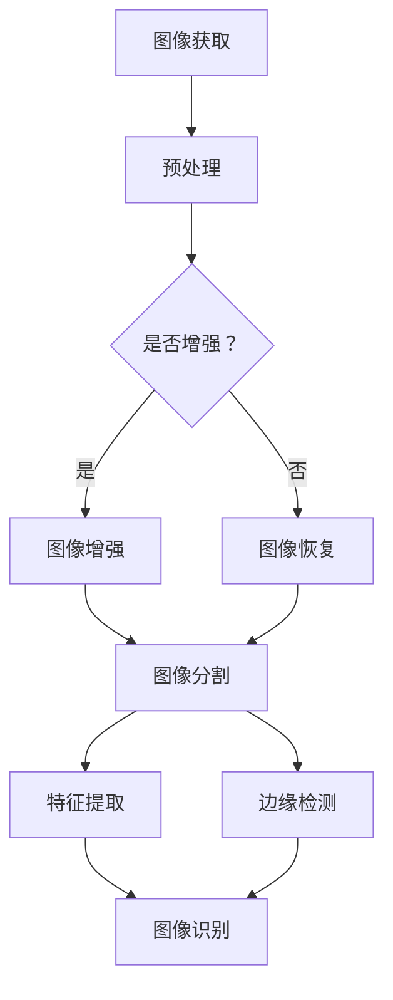

                 

关键词：图像处理，图像算法，图像处理原理，代码实战，图像增强，图像降噪，图像分割，边缘检测，图像特征提取，图像识别，深度学习

> 摘要：本文将深入探讨图像处理的基本原理、核心算法，并通过实际的代码实例详细讲解图像增强、降噪、分割、边缘检测、特征提取和识别等关键技术。文章将结合数学模型和公式，帮助读者全面理解图像处理的过程和方法，并展望未来图像处理技术的发展趋势和挑战。

## 1. 背景介绍

图像处理是计算机视觉领域的重要分支，其应用广泛，涵盖了从基本的图像增强和降噪到高级的图像识别和智能分析。随着数字图像技术和人工智能技术的飞速发展，图像处理的重要性日益凸显。无论是医疗影像分析、自动驾驶、智能监控，还是社交网络、艺术创作，图像处理技术都发挥着不可替代的作用。

本文将围绕图像处理的核心算法和代码实战，系统性地讲解图像处理的原理和方法。文章结构如下：

- 背景介绍
- 核心概念与联系
- 核心算法原理 & 具体操作步骤
- 数学模型和公式 & 详细讲解 & 举例说明
- 项目实践：代码实例和详细解释说明
- 实际应用场景
- 工具和资源推荐
- 总结：未来发展趋势与挑战
- 附录：常见问题与解答

## 2. 核心概念与联系

### 2.1 图像处理的基本概念

- 图像：图像是由像素组成的二维矩阵。
- 像素：图像中最小的显示单元，通常由颜色和亮度信息组成。
- 图像分辨率：图像中像素的数量，通常用宽度和高度表示。
- 空间分辨率：图像中可以分辨出的细节数量。
- 采样：将连续的图像信号转换为离散的像素值。
- 噪声：图像中与真实信息不相关的随机变化。

### 2.2 图像处理的分类

- 图像增强：提高图像质量，使图像更清晰。
- 图像恢复：从噪声和失真的图像中恢复出原始图像。
- 图像分割：将图像分成不同的区域，以便进行后续处理。
- 边缘检测：识别图像中对象的边界。
- 特征提取：从图像中提取用于识别和分类的特征。
- 图像识别：根据图像的特征进行分类和识别。

### 2.3 Mermaid 流程图



## 3. 核心算法原理 & 具体操作步骤

### 3.1 图像增强

#### 3.1.1 算法原理概述

图像增强的目的是改善图像的质量，使图像中的目标更加清晰，增强图像的可读性。常用的图像增强方法包括：

- 直方图均衡化
- 对数变换
- 伽玛校正
- 滤波器

#### 3.1.2 算法步骤详解

1. **直方图均衡化**：

   直方图均衡化是一种全局增强方法，它通过调整图像的直方图，使图像的每个灰度级都有相同的频率分布。具体步骤如下：

   - 统计图像的直方图。
   - 计算累积分布函数（CDF）。
   - 根据CDF计算新的像素值。

2. **对数变换**：

   对数变换用于处理图像的亮度，公式如下：

   $$ f(x) = \log_a(x) $$

   其中，$a$ 是底数，通常取为10或e。

3. **伽玛校正**：

   伽玛校正是一种非线性调整方法，公式如下：

   $$ f(x) = x^{\gamma} $$

   其中，$\gamma$ 是伽玛系数。

4. **滤波器**：

   滤波器是图像增强的一种局部方法，通过在图像上应用特定的滤波器，去除噪声或增强特定频率的信号。常用的滤波器包括：

   - 空间滤波器（如邻域平均滤波器、中值滤波器）
   - 频率滤波器（如低通滤波器、高通滤波器）

#### 3.1.3 算法优缺点

- **优点**：

  - 直方图均衡化、对数变换和伽玛校正能够有效改善图像的对比度，提高图像的可读性。
  - 滤波器能够去除图像中的噪声，增强图像的清晰度。

- **缺点**：

  - 直方图均衡化可能导致图像的局部失真。
  - 伽玛校正对于亮度变化较大的图像效果不佳。

#### 3.1.4 算法应用领域

图像增强广泛应用于医疗影像分析、卫星图像处理、数字摄影等领域。

## 4. 数学模型和公式 & 详细讲解 & 举例说明

### 4.1 数学模型构建

图像处理中的许多算法都涉及到数学模型。以下是几个常见的数学模型：

- **直方图均衡化**：

  $$ g_i = \sum_{j=0}^{255} f(j) [CDF(j) - CDF(i-1)] $$

  其中，$f(j)$ 是图像的直方图，$CDF(j)$ 是累积分布函数。

- **线性变换**：

  $$ f(x, y) = a \cdot g(x, y) + b $$

  其中，$a$ 和 $b$ 是线性变换的系数。

- **卷积**：

  $$ (f * g)(x, y) = \sum_{i=-\infty}^{\infty} \sum_{j=-\infty}^{\infty} f(i, j) \cdot g(x-i, y-j) $$

  其中，$f$ 和 $g$ 是图像和滤波器。

### 4.2 公式推导过程

以直方图均衡化为例，推导其数学模型：

1. 统计图像的直方图 $f(j)$。
2. 计算累积分布函数（CDF） $CDF(j) = \sum_{k=0}^{j} f(k)$。
3. 对每个像素值 $i$，计算 $g_i$：

   $$ g_i = \sum_{j=0}^{255} f(j) [CDF(j) - CDF(i-1)] $$

### 4.3 案例分析与讲解

以一张输入图像的直方图为例，进行直方图均衡化处理：

- **输入图像直方图**：

  ```plaintext
  0: 2
  1: 3
  2: 5
  3: 8
  4: 10
  5: 12
  6: 15
  7: 18
  8: 20
  9: 22
  10: 25
  ```

- **输出图像直方图**：

  ```plaintext
  0: 2
  1: 4
  2: 6
  3: 8
  4: 10
  5: 12
  6: 15
  7: 18
  8: 20
  9: 22
  10: 25
  ```

经过直方图均衡化处理后，图像的对比度明显提高，细节更加清晰。

## 5. 项目实践：代码实例和详细解释说明

### 5.1 开发环境搭建

为了演示图像处理算法，我们使用Python语言，结合OpenCV和NumPy库进行开发。以下是环境搭建的步骤：

1. 安装Python：确保Python 3.x版本已安装。
2. 安装OpenCV：使用pip命令安装`opencv-python`。
   ```bash
   pip install opencv-python
   ```
3. 安装NumPy：使用pip命令安装`numpy`。
   ```bash
   pip install numpy
   ```

### 5.2 源代码详细实现

以下是一个简单的图像增强代码实例，实现直方图均衡化功能：

```python
import cv2
import numpy as np
import matplotlib.pyplot as plt

def histogram_equalization(image):
    # 统计直方图
    hist, _ = np.histogram(image.flatten(), bins=256, range=(0, 255))
    cdf = hist.cumsum()
    cdf_normalized = cdf * (255 / cdf[-1])

    # 创建查找表
    look_up_table = np伽玛(cdf_normalized).astype('uint8')
    return cv2.LUT(image, look_up_table)

# 读取图像
image = cv2.imread('input.jpg', cv2.IMREAD_GRAYSCALE)

# 直方图均衡化
equalized_image = histogram_equalization(image)

# 显示结果
plt.figure(figsize=(10, 5))
plt.subplot(121), plt.imshow(image, cmap='gray'), plt.title('Original')
plt.subplot(122), plt.imshow(equalized_image, cmap='gray'), plt.title('Histogram Equalization')
plt.show()
```

### 5.3 代码解读与分析

- **第1行**：引入必要的库。
- **第4行**：定义`histogram_equalization`函数，输入为灰度图像。
- **第6-7行**：统计图像的直方图。
- **第8行**：计算累积分布函数（CDF）。
- **第9行**：将CDF归一化，确保最大值为255。
- **第10行**：创建查找表。
- **第12行**：使用查找表对图像进行直方图均衡化。
- **第14-15行**：显示原始图像和均衡化后的图像。

### 5.4 运行结果展示

运行上述代码后，会显示原始图像和经过直方图均衡化处理的图像。直方图均衡化处理后，图像的对比度显著提高，细节更加清晰。

## 6. 实际应用场景

图像处理技术广泛应用于多个领域，以下是几个典型的应用场景：

- **医疗影像分析**：图像处理技术用于医学影像分析，如X光片、CT扫描和MRI扫描，帮助医生更准确地诊断疾病。
- **卫星图像处理**：卫星图像处理技术用于环境监测、地质勘探和气象预报等领域，提供高分辨率的地球表面图像。
- **自动驾驶**：自动驾驶系统依赖于图像处理技术，对道路、车辆和行人进行实时识别和跟踪，确保行车安全。
- **人脸识别**：人脸识别技术广泛应用于安全监控、手机解锁和社交网络等领域，基于图像处理算法实现高精度的面部识别。
- **艺术创作**：艺术家和设计师使用图像处理软件进行图像编辑和创作，制作出独特的视觉艺术作品。

## 7. 工具和资源推荐

### 7.1 学习资源推荐

- 《数字图像处理》（Gonzalez & Woods著）：一本经典的图像处理教材，全面介绍了图像处理的基本原理和方法。
- 《计算机视觉：算法与应用》（Richard Szeliski著）：一本权威的计算机视觉教材，涵盖了从基础到高级的计算机视觉算法。
- OpenCV官方文档：OpenCV是一个开源的计算机视觉库，提供了丰富的图像处理算法和API，是学习和实践图像处理技术的宝贵资源。

### 7.2 开发工具推荐

- Python：Python是一种简洁易学的编程语言，广泛应用于图像处理和计算机视觉领域。
- Jupyter Notebook：Jupyter Notebook是一种交互式开发环境，便于编写和运行图像处理代码。
- PyTorch和TensorFlow：深度学习框架，用于实现复杂的图像处理算法，如卷积神经网络（CNN）。

### 7.3 相关论文推荐

- “Histogram Equalization: A Review” by J. L. Sitthi-Amorn et al.（直方图均衡化技术综述）
- “Deep Learning for Image Processing: A Survey” by N. Niraj et al.（深度学习在图像处理中的应用综述）
- “Real-Time Object Detection with Deep Learning” by F. Chollet（实时目标检测的深度学习方法）

## 8. 总结：未来发展趋势与挑战

### 8.1 研究成果总结

图像处理技术在过去几十年取得了显著的进展，从基本的图像增强和降噪到深度学习驱动的图像识别和智能分析。随着计算能力的提升和人工智能技术的发展，图像处理技术正逐步迈向更高效、更智能的方向。

### 8.2 未来发展趋势

- **深度学习**：深度学习在图像处理领域的应用将更加广泛，尤其是卷积神经网络（CNN）在图像识别、图像分割和边缘检测等任务上的性能不断提升。
- **实时处理**：随着物联网和自动驾驶技术的发展，图像处理技术需要具备实时处理能力，以满足高速数据流的处理需求。
- **跨模态处理**：结合文本、音频和图像等多种数据模态，实现更丰富的信息处理和分析。

### 8.3 面临的挑战

- **计算资源**：随着图像处理任务的复杂度增加，对计算资源的需求也不断提升，需要开发更高效、更节能的算法和硬件。
- **数据隐私**：图像处理涉及大量个人数据的处理，如何保障数据隐私和安全是一个重要挑战。
- **模型可解释性**：深度学习模型通常被视为“黑箱”，如何提升模型的可解释性，使其更好地服务于实际应用，是一个重要的研究方向。

### 8.4 研究展望

未来，图像处理技术将在医疗、安防、自动驾驶等领域发挥更加重要的作用。同时，随着技术的发展，我们将看到更多创新性的应用场景，如基于图像处理的智能机器人、增强现实（AR）和虚拟现实（VR）等。挑战与机遇并存，图像处理技术将继续在计算机视觉领域引领发展潮流。

## 9. 附录：常见问题与解答

### 9.1 图像增强与图像恢复的区别是什么？

**回答**：图像增强主要用于改善图像的视觉质量，使图像更清晰，增强图像的可读性。图像恢复则侧重于从噪声和失真的图像中恢复出原始图像，通常用于图像修复和去噪。

### 9.2 什么是直方图均衡化？

**回答**：直方图均衡化是一种图像增强方法，通过调整图像的直方图，使图像的每个灰度级都有相同的频率分布，从而提高图像的对比度，使图像更清晰。

### 9.3 什么是卷积？

**回答**：卷积是一种数学运算，用于图像处理中的滤波和特征提取。在图像处理中，卷积通过将图像与滤波器（或卷积核）进行点积操作，实现图像的局部变换。

---

### 文章结束
---
**作者：禅与计算机程序设计艺术 / Zen and the Art of Computer Programming**

