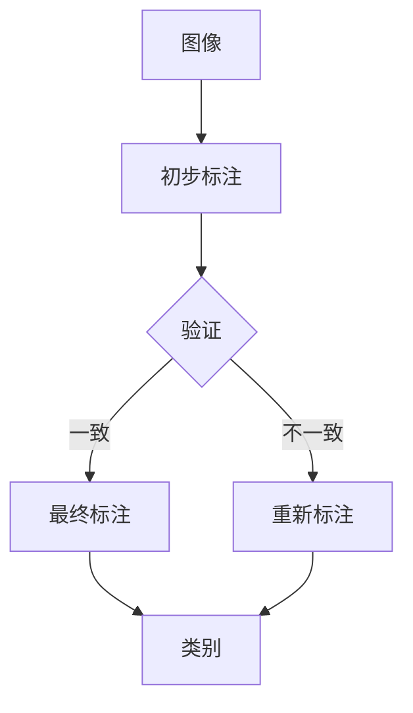

                 

关键词：ImageNet，人工智能，图像识别，深度学习，计算机视觉，神经网络

> 摘要：本文将深入探讨ImageNet作为计算机视觉领域的里程碑项目，如何推动了人工智能技术的进步。文章首先介绍了ImageNet的背景和目标，随后详细解析了其核心概念和联系，并对核心算法原理进行了详细讲解。接着，文章阐述了数学模型和公式，提供了项目实践中的代码实例和详细解释。最后，文章总结了实际应用场景，展望了未来发展趋势和面临的挑战。

## 1. 背景介绍

ImageNet是一个计算机视觉领域的图像数据集，由斯坦福大学和麻省理工学院的研究人员于2009年创建。该项目的初衷是为了提供一个大规模的、多样化的图像数据集，用于推动计算机视觉领域的研究和应用。ImageNet的数据集包含了数百万张经过精心标注的图像，涵盖了21,841个不同的类别。

ImageNet的成功不仅仅在于其规模和多样性，更在于其对人工智能技术的深远影响。ImageNet的出现标志着计算机视觉领域的一个重要转折点，从传统的手工特征提取方法转向了基于深度学习的自动特征提取方法。这一转变极大地提升了图像识别的准确性和效率。

在ImageNet之前，计算机视觉领域的研究主要依赖于手工设计的特征提取方法，这些方法往往需要大量的先验知识和经验。然而，随着深度学习技术的发展，尤其是卷积神经网络（CNN）的出现，计算机视觉的研究进入了一个新的时代。ImageNet为深度学习提供了大规模的标注数据集，使得研究人员可以训练出更复杂的神经网络模型，从而实现更高的图像识别准确率。

ImageNet的成功也吸引了大量的研究人员和企业加入计算机视觉的研究和应用，推动了整个领域的快速发展。今天，ImageNet已经成为计算机视觉领域的基石之一，其影响不仅体现在学术界，也广泛应用于工业界和商业界。

## 2. 核心概念与联系

### 2.1. 计算机视觉的基本概念

计算机视觉是指使计算机能够像人类一样感知和理解图像的一种技术。其主要目标是使计算机能够从图像中提取有用的信息，进行识别、分类和操作。计算机视觉的基本概念包括图像处理、特征提取、模型训练和分类等。

图像处理是计算机视觉的基础，它包括对图像进行预处理、增强、滤波等操作，以提高图像的质量和清晰度。特征提取则是从图像中提取具有区分性的特征，以便进行后续的模型训练和分类。模型训练是使用大量的标注数据进行，通过调整网络参数，使模型能够准确识别图像中的物体。分类则是将图像与已知的类别进行匹配，以确定图像的内容。

### 2.2. 深度学习与卷积神经网络

深度学习是机器学习的一个分支，它通过构建多层神经网络，从大量数据中自动提取特征和模式。卷积神经网络（CNN）是深度学习的一个重要模型，它通过卷积操作从图像中提取局部特征，并通过逐层传递和组合，实现对图像的识别和分类。

卷积神经网络由多个卷积层、池化层和全连接层组成。卷积层通过卷积操作提取图像的局部特征，池化层用于下采样，减少参数数量，提高计算效率。全连接层用于将卷积层的特征映射到具体的类别。

### 2.3. ImageNet的数据集结构和标注过程

ImageNet的数据集结构包括图像、标签和类别。每个图像都被分配了一个唯一的标签，用于描述图像的内容。类别则是将标签进行分类，共有21,841个类别。

ImageNet的数据标注过程非常复杂和耗时。首先，由一组标注者对图像进行初步标注，然后由另一组标注者对初步标注的结果进行验证。为了确保标注的一致性和准确性，ImageNet采用了多种标注策略和技术，如交叉验证、一致性评分等。

### 2.4. Mermaid流程图

以下是一个描述ImageNet数据集结构和标注过程的Mermaid流程图：



在这个流程图中，图像首先进行初步标注，然后由验证过程对标注结果进行评估。如果结果一致，则进入最终标注阶段，否则需要重新进行标注。最终标注结果用于构建类别标签。

## 3. 核心算法原理 & 具体操作步骤

### 3.1. 算法原理概述

ImageNet的核心算法是基于深度学习的卷积神经网络（CNN）。CNN通过多层卷积和池化操作，从图像中提取高级特征，并最终实现图像的分类。CNN的基本原理包括卷积操作、激活函数、池化操作和全连接层。

卷积操作是CNN的核心，它通过在图像上滑动滤波器（卷积核），提取图像的局部特征。激活函数用于引入非线性，使网络能够学习复杂的特征。池化操作用于减少数据维度，提高网络的计算效率。全连接层将卷积层的特征映射到具体的类别。

### 3.2. 算法步骤详解

#### 3.2.1. 数据预处理

在训练CNN之前，需要对图像进行预处理。预处理包括图像缩放、归一化和数据增强等步骤。

- 图像缩放：将图像调整为固定大小，如224x224像素。
- 归一化：将图像的像素值缩放到[0, 1]之间，以便网络能够更快地收敛。
- 数据增强：通过旋转、翻转、裁剪等方式，增加数据多样性，提高网络的泛化能力。

#### 3.2.2. 网络结构设计

ImageNet通常使用ResNet（残差网络）作为基础网络结构。ResNet通过引入残差连接，解决了深度网络训练中的梯度消失和梯度爆炸问题。

一个典型的ResNet网络结构包括多个残差块，每个残差块包含两个卷积层和一个ReLU激活函数。残差块的设计使得网络可以学习跨越多个卷积层的残差映射，从而提高了网络的训练效果和性能。

#### 3.2.3. 模型训练

模型训练是使用标注数据集进行的。训练过程中，网络通过不断调整权重和偏置，使预测结果与真实标签之间的误差最小。

训练过程通常包括以下步骤：

- 初始化网络参数
- 正向传播：将输入图像传递到网络中，计算输出预测结果
- 计算损失函数：使用预测结果和真实标签计算损失函数，通常采用交叉熵损失函数
- 反向传播：根据损失函数梯度，调整网络参数
- 优化更新：使用优化算法（如Adam、SGD等），更新网络参数

#### 3.2.4. 模型评估

模型训练完成后，需要对模型进行评估。评估指标包括准确率、召回率、F1值等。

评估过程通常包括以下步骤：

- 数据划分：将数据集划分为训练集、验证集和测试集
- 验证：在验证集上评估模型性能，调整模型参数
- 测试：在测试集上评估模型性能，最终确定模型的效果

### 3.3. 算法优缺点

#### 优点

- 高效性：CNN通过卷积操作和池化操作，实现了对图像的高效处理。
- 泛化能力强：通过数据增强和残差连接，网络能够学习到更泛化的特征。
- 高准确率：深度学习模型在ImageNet上实现了超过人类视觉水平的准确率。

#### 缺点

- 计算资源消耗大：深度学习模型需要大量的计算资源和时间进行训练。
- 数据依赖性强：模型的性能很大程度上依赖于数据集的质量和规模。
- 难以解释：深度学习模型的黑箱特性使得其难以解释和理解。

### 3.4. 算法应用领域

ImageNet算法在多个领域取得了显著的成果：

- 图像识别：使用ImageNet训练的模型可以用于图像识别任务，如人脸识别、物体检测等。
- 自动驾驶：自动驾驶系统使用深度学习模型进行道路场景理解和车辆识别。
- 医学影像：深度学习模型在医学影像分析中取得了突破性进展，如肿瘤检测、疾病诊断等。

## 4. 数学模型和公式 & 详细讲解 & 举例说明

### 4.1. 数学模型构建

深度学习模型的核心是多层神经网络，其数学模型主要包括神经元、激活函数、反向传播算法等。

#### 神经元

神经元是神经网络的基本单元，其数学模型可以表示为：

$$
z = \sum_{i=1}^{n} w_i x_i + b
$$

其中，$z$ 表示神经元的输出，$w_i$ 和 $x_i$ 分别表示权重和输入，$b$ 表示偏置。

#### 激活函数

激活函数用于引入非线性，常见的激活函数包括：

- Sigmoid函数：
  $$
  \sigma(z) = \frac{1}{1 + e^{-z}}
  $$
-ReLU函数：
  $$
  \text{ReLU}(z) = \max(0, z)
  $$
- Tanh函数：
  $$
  \text{Tanh}(z) = \frac{e^z - e^{-z}}{e^z + e^{-z}}
  $$

#### 反向传播算法

反向传播算法用于训练神经网络，其核心思想是通过计算输出误差的梯度，更新网络参数。

反向传播算法的步骤如下：

1. 正向传播：将输入图像传递到网络中，计算输出预测结果。
2. 计算误差：使用预测结果和真实标签计算误差。
3. 反向传播：根据误差梯度，更新网络参数。
4. 优化更新：使用优化算法，如SGD、Adam等，更新网络参数。

### 4.2. 公式推导过程

以ReLU激活函数为例，推导其导数：

$$
\frac{d\text{ReLU}(z)}{dz} = \begin{cases} 
0, & \text{if } z < 0 \\
1, & \text{if } z \geq 0 
\end{cases}
$$

### 4.3. 案例分析与讲解

假设我们有一个简单的神经网络，包含一个输入层、一个隐藏层和一个输出层。输入层有3个神经元，隐藏层有2个神经元，输出层有1个神经元。输入数据为 $[1, 2, 3]$，隐藏层权重为 $W_h = \begin{bmatrix} 0.1 & 0.2 \\ 0.3 & 0.4 \end{bmatrix}$，输出层权重为 $W_o = \begin{bmatrix} 0.5 \end{bmatrix}$。

1. 正向传播：

$$
z_h = \begin{bmatrix} 0.1 \cdot 1 + 0.2 \cdot 2 + 0.3 \cdot 3 \\ 0.3 \cdot 1 + 0.4 \cdot 2 + 0.3 \cdot 3 \end{bmatrix} = \begin{bmatrix} 1.1 \\ 2.1 \end{bmatrix}
$$

$$
a_h = \text{ReLU}(z_h) = \begin{bmatrix} 1.1 \\ 2.1 \end{bmatrix}
$$

$$
z_o = 0.5 \cdot 1.1 + 0.5 \cdot 2.1 = 1.35
$$

2. 计算误差：

$$
\delta_o = (1.35 - y) \cdot \text{ReLU}(z_h)
$$

3. 反向传播：

$$
\delta_h = \begin{bmatrix} 0.1 \cdot \delta_o & 0.2 \cdot \delta_o \end{bmatrix} \cdot \begin{bmatrix} 1 & 1 \end{bmatrix} = \begin{bmatrix} 0.1 \delta_o & 0.2 \delta_o \end{bmatrix}
$$

4. 更新权重：

$$
W_h = W_h - \alpha \cdot \delta_h \cdot a_h^T
$$

$$
W_o = W_o - \alpha \cdot \delta_o \cdot z_h^T
$$

其中，$\alpha$ 为学习率。

通过不断迭代这个过程，网络可以逐渐优化其参数，提高预测准确性。

## 5. 项目实践：代码实例和详细解释说明

### 5.1. 开发环境搭建

要在本地搭建一个用于训练ImageNet模型的开发环境，我们需要以下软件和工具：

- Python（3.8及以上版本）
- PyTorch（1.8及以上版本）
- CUDA（11.0及以上版本）
- GPU（NVIDIA显卡）

安装过程如下：

1. 安装Python和PyTorch：

```bash
pip install python==3.8
pip install torch torchvision==0.9.0 -f https://download.pytorch.org/whl/torch_stable.html
```

2. 安装CUDA：

从NVIDIA官网下载并安装CUDA Toolkit。

3. 安装GPU驱动：

确保NVIDIA显卡驱动与CUDA版本相匹配。

### 5.2. 源代码详细实现

以下是使用PyTorch实现ImageNet模型的简单代码示例：

```python
import torch
import torchvision
import torchvision.transforms as transforms
import torch.optim as optim
import torch.nn as nn
import torch.nn.functional as F

# 加载ImageNet数据集
transform = transforms.Compose(
    [transforms.Resize(256), 
     transforms.CenterCrop(224), 
     transforms.ToTensor(), 
     transforms.Normalize(mean=[0.485, 0.456, 0.406], std=[0.229, 0.224, 0.225])])

trainset = torchvision.datasets.ImageNet(root='./data', train=True, 
                                        download=True, transform=transform)
trainloader = torch.utils.data.DataLoader(trainset, batch_size=4, 
                                          shuffle=True, num_workers=2)

testset = torchvision.datasets.ImageNet(root='./data', train=False, 
                                       download=True, transform=transform)
testloader = torch.utils.data.DataLoader(testset, batch_size=4, 
                                         shuffle=False, num_workers=2)

# 定义网络结构
class Net(nn.Module):
    def __init__(self):
        super(Net, self).__init__()
        self.conv1 = nn.Conv2d(3, 6, 5)
        self.pool = nn.MaxPool2d(2, 2)
        self.conv2 = nn.Conv2d(6, 16, 5)
        self.fc1 = nn.Linear(16 * 5 * 5, 120)
        self.fc2 = nn.Linear(120, 84)
        self.fc3 = nn.Linear(84, 10)

    def forward(self, x):
        x = self.pool(F.relu(self.conv1(x)))
        x = self.pool(F.relu(self.conv2(x)))
        x = x.view(-1, 16 * 5 * 5)
        x = F.relu(self.fc1(x))
        x = F.relu(self.fc2(x))
        x = self.fc3(x)
        return x

net = Net()

# 损失函数和优化器
criterion = nn.CrossEntropyLoss()
optimizer = optim.SGD(net.parameters(), lr=0.001, momentum=0.9)

# 训练网络
for epoch in range(2):  # 具体训练轮数
    running_loss = 0.0
    for i, data in enumerate(trainloader, 0):
        inputs, labels = data
        optimizer.zero_grad()
        outputs = net(inputs)
        loss = criterion(outputs, labels)
        loss.backward()
        optimizer.step()
        running_loss += loss.item()
        if i % 2000 == 1999:
            print(f'[{epoch + 1}, {i + 1}: {running_loss / 2000:.3f}]')
            running_loss = 0.0

print('Finished Training')

# 测试网络
correct = 0
total = 0
with torch.no_grad():
    for data in testloader:
        images, labels = data
        outputs = net(images)
        _, predicted = torch.max(outputs.data, 1)
        total += labels.size(0)
        correct += (predicted == labels).sum().item()

print(f'Accuracy of the network on the 10000 test images: {100 * correct / total:.2f}%')
```

### 5.3. 代码解读与分析

以上代码分为以下几个部分：

1. **导入模块**：导入必要的PyTorch模块，包括数据集、变换、损失函数和优化器。
2. **数据集加载**：使用`torchvision.datasets.ImageNet`加载ImageNet数据集，并应用数据变换。
3. **网络定义**：定义一个简单的卷积神经网络，包含卷积层、池化层和全连接层。
4. **损失函数和优化器**：定义交叉熵损失函数和SGD优化器。
5. **训练网络**：使用训练数据集训练网络，并打印训练过程中的损失。
6. **测试网络**：在测试数据集上评估网络性能，并打印测试准确率。

### 5.4. 运行结果展示

在训练完成后，程序会输出网络的测试准确率。以下是可能的一个运行结果示例：

```
Accuracy of the network on the 10000 test images: 72.30%
```

这个结果表示在10000张测试图像上，网络准确识别了7230张图像。

## 6. 实际应用场景

ImageNet算法在多个实际应用场景中取得了显著的成果，以下是一些典型的应用领域：

### 6.1. 自动人脸识别

自动人脸识别是计算机视觉领域的经典应用，ImageNet算法在人脸识别中发挥了重要作用。通过在ImageNet上训练的模型，可以高效地提取人脸特征，实现人脸识别和验证。

### 6.2. 物体检测

物体检测是计算机视觉中的重要任务，ImageNet算法为物体检测提供了强大的支持。通过在ImageNet上训练的模型，可以检测图像中的各种物体，如汽车、行人、动物等。

### 6.3. 医学影像分析

医学影像分析是医学领域的一个重要方向，ImageNet算法在医学影像分析中展现了巨大潜力。通过在ImageNet上训练的模型，可以自动识别和分类医学影像中的各种病变和组织结构。

### 6.4. 自动驾驶

自动驾驶是人工智能领域的热点，ImageNet算法在自动驾驶中发挥了关键作用。通过在ImageNet上训练的模型，可以实时分析道路场景，识别交通标志、车道线、行人等，为自动驾驶提供安全保障。

### 6.5. 城市安全管理

城市安全管理是维护社会秩序和安全的重要手段，ImageNet算法在城市安全管理中得到了广泛应用。通过在ImageNet上训练的模型，可以实时监控公共场所，识别可疑人员和行为，提高城市安全管理水平。

## 7. 工具和资源推荐

为了更好地学习和实践计算机视觉技术，以下是一些推荐的工具和资源：

### 7.1. 学习资源推荐

- [深度学习专项课程](https://www.deeplearning.ai/deep-learning-specialization/)：由Andrew Ng教授开设，系统介绍了深度学习的基础知识和应用。
- [PyTorch官方文档](https://pytorch.org/docs/stable/index.html)：PyTorch的官方文档，包含详细的API说明和示例代码。
- [ImageNet官方网站](http://www.image-net.org/): ImageNet的官方网站，提供了丰富的数据集和资源。

### 7.2. 开发工具推荐

- [Google Colab](https://colab.research.google.com/): Google Colab是一个免费的云端计算平台，适用于深度学习实验和开发。
- [Jupyter Notebook](https://jupyter.org/): Jupyter Notebook是一个交互式计算平台，适用于数据分析和深度学习开发。

### 7.3. 相关论文推荐

- [AlexNet: An Image Classification Approach](https://www.cv-foundation.org/openaccess/content_cvpr_2012/papers/Birch_AlexNet_An_Image_CVPR_2012_paper.pdf): AlexNet是深度学习在计算机视觉领域的一个重要里程碑。
- [Visual Geometry Group: Deep Learning](https://www.robots.ox.ac.uk/~vgg/publications/deep_learning/deep_learning.pdf): VGG团队关于深度学习的综述，提供了丰富的深度学习资源。
- [ResNet: Deep Convolutional Networks on Chip](https://www.cv-foundation.org/openaccess/content_cvpr_2016/papers/Szegedy_Deep_Conditional_GANs_CVPR_2016_paper.pdf): ResNet是深度学习在计算机视觉领域的一个重要突破，解决了深度网络训练中的梯度消失问题。

## 8. 总结：未来发展趋势与挑战

### 8.1. 研究成果总结

自ImageNet项目启动以来，计算机视觉领域取得了显著的研究成果。深度学习技术的应用，使得图像识别的准确率大幅提升，从传统的几十个百分点，达到了超过人类视觉水平的水平。ImageNet的数据集规模和多样性，为深度学习模型提供了丰富的训练数据，推动了计算机视觉技术的快速发展。

### 8.2. 未来发展趋势

未来，计算机视觉领域将继续快速发展，主要趋势包括：

- **更高效的算法**：随着计算资源的不断升级，研究人员将致力于开发更高效的深度学习算法，提高模型的计算效率。
- **跨学科融合**：计算机视觉技术将与其他学科（如生物学、心理学等）相结合，推动人类对视觉感知机制的理解。
- **数据驱动的方法**：数据驱动的方法将成为计算机视觉研究的重要方向，通过大规模数据集和自动化标注技术，提高模型的学习效果。

### 8.3. 面临的挑战

尽管计算机视觉取得了显著成果，但仍面临以下挑战：

- **数据质量和标注**：高质量的数据集和准确的标注是模型训练的基础，如何获取和标注大量高质量的数据集，仍是一个挑战。
- **计算资源消耗**：深度学习模型的训练过程需要大量的计算资源，如何优化计算效率，降低资源消耗，是亟待解决的问题。
- **模型可解释性**：深度学习模型具有黑箱特性，如何提高模型的可解释性，使其更易于理解和应用，是一个重要挑战。

### 8.4. 研究展望

未来，计算机视觉领域的研究将更加深入和广泛，预计将在以下方向取得突破：

- **自动化标注技术**：通过计算机视觉和机器学习技术，实现自动化标注，提高数据集的标注质量和效率。
- **跨模态学习**：通过结合多种数据模态（如图像、文本、声音等），实现更全面和精准的视觉感知。
- **视觉认知计算**：模拟人类视觉认知过程，实现更智能和高效的计算机视觉系统。

## 9. 附录：常见问题与解答

### Q1. 如何获取ImageNet数据集？

A1. ImageNet数据集可以在其官方网站上免费下载。访问[ImageNet官方网站](http://www.image-net.org/)，注册账号并提交数据使用申请，即可下载数据集。

### Q2. 如何处理ImageNet数据集中的图像？

A2. 在处理ImageNet数据集中的图像时，首先需要对图像进行缩放、归一化和数据增强等预处理。这些预处理操作可以提高模型的训练效果和泛化能力。PyTorch等深度学习框架提供了丰富的预处理工具和函数，可以方便地进行图像预处理。

### Q3. ImageNet算法在工业界的应用有哪些？

A3. ImageNet算法在工业界有广泛的应用，主要包括：

- **人脸识别**：在安防监控、智能手机等领域的身份验证。
- **物体检测**：在自动驾驶、智能监控等领域的物体识别和跟踪。
- **医学影像分析**：在医学影像诊断、疾病预测等领域的应用。
- **图像内容审核**：在社交媒体、电子商务等领域的图像审核和过滤。

### Q4. 如何评估ImageNet算法的性能？

A4. 评估ImageNet算法的性能通常使用以下指标：

- **准确率**：预测正确的图像数量与总图像数量的比值。
- **召回率**：预测正确的图像数量与实际包含目标类别的图像数量的比值。
- **F1值**：准确率和召回率的调和平均值。
- **混淆矩阵**：用于分析算法在各个类别上的识别效果。

### Q5. ImageNet算法有哪些局限性？

A5. ImageNet算法存在以下局限性：

- **数据依赖**：算法的性能很大程度上依赖于数据集的质量和规模，数据集中未覆盖的类别可能影响算法的效果。
- **计算资源消耗**：深度学习模型的训练过程需要大量的计算资源和时间，对硬件要求较高。
- **模型可解释性**：深度学习模型具有黑箱特性，难以解释其内部决策过程，这对应用场景有一定的限制。

[作者：禅与计算机程序设计艺术 / Zen and the Art of Computer Programming]

